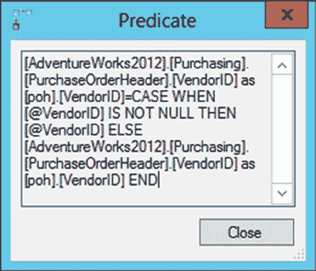
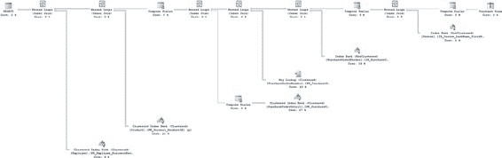

# 第 25 章 ■ 数据库工作负载优化

代价高昂的步骤 2 是查询的`哈希匹配`连接操作。这同样不一定是个问题。但是，有时候`哈希匹配`操作表明存在不良索引或缺失索引，或者查询无法利用现有索引，因此它们常常是需要优化的领域。至少，对于 OLTP 系统来说通常如此。对于大型数据仓库系统，`哈希匹配`可能是处理你将在那里看到的查询类型的理想选择。

**提示** 有时你可能会发现，无法对处理策略中代价最高的步骤进行任何改进。在这种情况下，请专注于下一个代价最高的步骤以识别问题。如果所有步骤都无法进一步优化，那么就转向处理工作负载中下一个代价最高的查询。你可能需要考虑更改数据库设计或查询结构。

## 优化代价最高的查询

一旦你诊断出具有高成本步骤的查询，下一阶段就是实施必要的修正以降低这些步骤的成本。

对于一个问题的步骤，纠正措施可能有一个或多个替代解决方案。例如，是应该创建一个新索引，还是以不同方式构造查询？在这种情况下，你应该根据预期效果和所需的工作量来对解决方案进行优先级排序。例如，如果一个窄索引或多或少能完成这项工作，那么通常最好优先选择它，而不是可能导致业务测试的代码更改。更改代码也可能是干扰性较小的方法。你需要根据你所处的业务和应用架构来评估每种情况。

按预期收益的顺序单独应用解决方案，并衡量它们对查询性能的单独影响。最后，你可以应用能提供最大性能改进的解决方案（或一组解决方案）来纠正有问题的步骤。有时，很明显最佳解决方案会损害工作负载中的其他查询。例如，在大量列上创建新索引可能会损害操作查询的性能。然而，由于这并非总是如此，最好通过测试来确定此类优化技术对整个工作负载的影响。如果某个特定解决方案损害了工作负载的整体性能，请选择次优解决方案，同时密切关注工作负载的整体性能。

### 修改代码

查询中代价最高的操作是对 `PurchaseOrderHeader` 表的聚集索引扫描。你首先需要了解的是，对于返回的查询和数据，聚集索引扫描是否是必要的，或者它可能是因为代码的原因，甚至是因为另一个索引或不同的索引结构可能效果更好而出现的。要开始理解为什么会出现聚集索引扫描，你应该查看扫描操作的属性。既然你得到了一个扫描，你也需要查看代码以确保它是可搜索的（sargable）。你特别需要关注 `Predicate` 属性，如图 25-8 所示。

[www.it-ebooks.info](http://www.it-ebooks.info/)



图 25-8. 聚集索引扫描的谓词

这是一个计算。在 `PurchaseOrderTable` 表的 `VendorID` 列上存在一个可能对查询有用的索引，但因为你使用了 `COALESCE` 语句来过滤值，所以需要扫描整个表来检索信息。`COALESCE` 运算符基本上是一种考虑给定值可能为 `NULL` 的方法，如果它是 `NULL`，则提供一个备选值，甚至可能是几个备选值。然而，它是一个函数，而在 `WHERE` 子句、`JOIN` 条件或 `HAVING` 子句中针对列使用函数很可能导致扫描，因此你需要消除这个函数。由于这个函数，你不能简单地添加或修改索引，因为最终仍然会导致扫描。你可以尝试用一个 `OR` 子句重写查询，像这样：

```sql
...WHERE per.LastName LIKE @LastName AND
poh.VendorID = @VendorID
OR poh.VendorID = poh.VendorID...
```

但在逻辑上，这与 `COALESCE` 操作并不相同。相反，它是将 `WHERE` 子句的一部分替换为另一部分，而不仅仅是使用 `OR` 结构。因此，你可以像这样重写整个存储过程的定义：

```sql
ALTER PROCEDURE dbo.PurchaseOrderBySalesPersonName
    @LastName NVARCHAR(50),
    @VendorID INT = NULL
AS
IF @VendorID IS NULL
BEGIN
    SELECT poh.PurchaseOrderID,
        poh.OrderDate,
        pod.LineTotal,
        p.[Name] AS ProductName,
        e.JobTitle,
        per.LastName + ', ' + per.FirstName AS SalesPerson,
        poh.VendorID
    FROM Purchasing.PurchaseOrderHeader AS poh
    JOIN Purchasing.PurchaseOrderDetail AS pod
        ON poh.PurchaseOrderID = pod.PurchaseOrderID
    JOIN Production.Product AS p
        ON pod.ProductID = p.ProductID
    JOIN HumanResources.Employee AS e
        ON poh.EmployeeID = e.BusinessEntityID
    JOIN Person.Person AS per
        ON e.BusinessEntityID = per.BusinessEntityID
    WHERE per.LastName LIKE @LastName
    ORDER BY per.LastName,
        per.FirstName;
END
ELSE
BEGIN
    SELECT poh.PurchaseOrderID,
        poh.OrderDate,
        pod.LineTotal,
        p.[Name] AS ProductName,
        e.JobTitle,
        per.LastName + ', ' + per.FirstName AS SalesPerson,
        poh.VendorID
    FROM Purchasing.PurchaseOrderHeader AS poh
    JOIN Purchasing.PurchaseOrderDetail AS pod
        ON poh.PurchaseOrderID = pod.PurchaseOrderID
    JOIN Production.Product AS p
        ON pod.ProductID = p.ProductID
    JOIN HumanResources.Employee AS e
        ON poh.EmployeeID = e.BusinessEntityID
    JOIN Person.Person AS per
        ON e.BusinessEntityID = per.BusinessEntityID
    WHERE per.LastName LIKE @LastName AND
        poh.VendorID = @VendorID
    ORDER BY per.LastName,
        per.FirstName;
END
GO
```

使用 `IF` 结构将查询分成了两个。使用相同的参数集运行它，导致执行时间从 1313 毫秒变为 267 毫秒，这是一个相当显著的改进。对 `Purchasing.PurchaseOrderHeader` 的读取次数从 44 次增加到 87 次，这可能不太好。但是对 `Purchasing.PurchaseOrderDetail` 的读取次数从 1,539 次下降到 763 次。综合考虑读取次数的减少和性能时间的降低，我们看到的是一个不错的解决方案。

执行计划当然不同了，如图 25-9 所示。

[www.it-ebooks.info](http://www.it-ebooks.info/)



图 25-9. 拆分查询后的新执行计划

现在，代价最高的两个操作符已经消失了。不再有扫描操作，所有的连接操作现在都是 `循环` 连接。但是，添加了一个新的数据访问操作。你现在看到了一个 `键查找` 操作，如第 11 章所述，因此你还有更多的调优机会。

### 修复键查找操作

现在你知道有一个 `键查找` 操作，你需要确定第 11 章中建议的解决它的任何方法是否适用。首先，你需要知道在此操作中正在检索哪些列。


