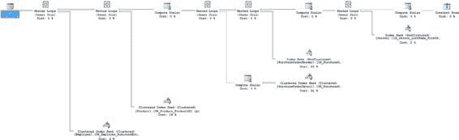
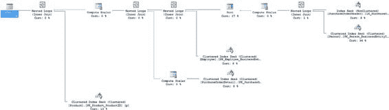
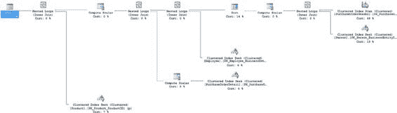
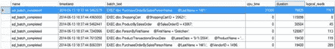

# 索引优化

这意味着访问键查找运算符的属性。这些属性显示了 `VendorID` 和 `OrderDate` 列。这意味着你只需通过非聚集索引的 `INCLUDE` 部分将这些列添加到索引的叶级页中。你可以按如下方式修改该索引：

```sql
CREATE NONCLUSTERED INDEX [IX_PurchaseOrderHeader_EmployeeID] ON [Purchasing].[PurchaseOrderHeader]
(
    [EmployeeID] ASC
)
INCLUDE (VendorID, OrderDate)
WITH DROP_EXISTING;
```

应用此索引会带来执行计划的改变和性能的调整。之前的结构和代码耗时为 267 毫秒。使用这个新索引后，查询执行时间降至 56 毫秒。执行计划现在完全不同了，如图 25-10 所示。

[www.it-ebooks.info](http://www.it-ebooks.info/)



`图 25-10.` 修改索引后的新执行计划

至此，执行计划中只剩下嵌套循环联接和索引查找操作。尽管查询中有 `ORDER BY` 语句，但甚至不再有排序操作。这是因为针对 `Person` 表的索引查找输出是**有序的**。简而言之，就这个查询而言，你的状况已经相当不错了，但过程中现在有两个查询。

### 调优第二个查询

消除 `COALESCE` 使你能够使用现有索引，但这样做实际上为你的查询创建了两条路径。因为你只使用了单个参数，只探索了第一条路径，从而忽略了第二个查询。让我们修改测试脚本，看看第二条查询路径将如何工作。

```sql
DBCC FREEPROCCACHE();
DBCC DROPCLEANBUFFERS;
GO

SET STATISTICS TIME ON;
GO
SET STATISTICS IO ON;
GO

EXEC dbo.PurchaseOrderBySalesPersonName @LastName = 'Hill%',
    @VendorID = 1496;
GO

SET STATISTICS TIME OFF;
GO
SET STATISTICS IO OFF;
GO
```

运行此查询会产生一个完全不同的执行计划，如图 25-11 所示。

[www.it-ebooks.info](http://www.it-ebooks.info/)





`图 25-11.` 存储过程中另一个查询的执行计划

这个新查询的行为不同是由于查询本身的差异。这里的主要问题是针对 `PurchaseOrderHeader` 表的聚集索引扫描。尽管 `VendorID` 上存在索引，你仍然看到了扫描操作。

再次，你可以查看该运算符的输出内容。这次，它不止两个列：`OrderDate`, `EmployeeID`, `PurchaseOrderID`。这些列虽然不大，但会增加索引的大小。

你需要评估索引大小的增加是否值得通过消除索引扫描带来的性能提升。我打算直接尝试，按如下方式修改索引：

```sql
CREATE NONCLUSTERED INDEX IX_PurchaseOrderHeader_VendorID ON Purchasing.PurchaseOrderHeader (
    VendorID ASC
)
INCLUDE(OrderDate,EmployeeID,PurchaseOrderID)
WITH DROP_EXISTING;
GO
```

应用索引前，执行时间约为 340 毫秒。应用索引后，执行时间降至 154 毫秒。执行计划现在如图 25-12. 所示。

`图 25-12.` 修改索引后的第二个执行计划

[www.it-ebooks.info](http://www.it-ebooks.info/)

新的执行计划由索引查找和嵌套循环联接组成。存在一个排序运算符（计划中代价第二高的操作），按 `LastName` 和 `FirstName` 对数据排序。让检索过程处理这个排序可能有助于提高性能，但到目前为止我的调优相当成功，所以我暂时保持原样。

对于拆分查询还有一点需要考虑。当优化器处理这样的查询时，两个语句都将针对传入的参数值进行优化。因此，你可能会看到糟糕的执行计划，特别是对于使用 `VendorID` 进行过滤的第二个查询，因为参数嗅探可能出现问题。

为避免这种情况，应进行一次额外的调优工作。

### 创建包装器过程

因为你为了适应不同的数据查询机制而在存储过程中创建了两条路径，所以存在获得糟糕参数嗅探的可能性，因为无论传入什么参数，两条路径都会被编译。解决此问题的一个机制是将现有过程封装到一个包装器过程中。但首先，你必须为每个查询创建两个新过程，如下所示：

```sql
CREATE PROCEDURE dbo.PurchaseOrderByLastName
    @LastName NVARCHAR(50)
AS
SELECT
    poh.PurchaseOrderID,
    poh.OrderDate,
    pod.LineTotal,
    p.[Name] AS ProductName,
    e.JobTitle,
    per.LastName + ', ' + per.FirstName AS SalesPerson,
    poh.VendorID
FROM Purchasing.PurchaseOrderHeader AS poh
JOIN Purchasing.PurchaseOrderDetail AS pod
    ON poh.PurchaseOrderID = pod.PurchaseOrderID
JOIN Production.Product AS p
    ON pod.ProductID = p.ProductID
JOIN HumanResources.Employee AS e
    ON poh.EmployeeID = e.BusinessEntityID
JOIN Person.Person AS per
    ON e.BusinessEntityID = per.BusinessEntityID
WHERE per.LastName LIKE @LastName
ORDER BY per.LastName,
    per.FirstName;
GO

CREATE PROCEDURE dbo.PurchaseOrderByLastNameVendor
    @LastName NVARCHAR(50),
    @VendorID INT
AS
SELECT
    poh.PurchaseOrderID,
    poh.OrderDate,
    pod.LineTotal,
    p.[Name] AS ProductName,
    e.JobTitle,
    per.LastName + ', ' + per.FirstName AS SalesPerson,
    poh.VendorID
FROM Purchasing.PurchaseOrderHeader AS poh
JOIN Purchasing.PurchaseOrderDetail AS pod
    ON poh.PurchaseOrderID = pod.PurchaseOrderID
JOIN Production.Product AS p
    ON pod.ProductID = p.ProductID
JOIN HumanResources.Employee AS e
    ON poh.EmployeeID = e.BusinessEntityID
JOIN Person.Person AS per
    ON e.BusinessEntityID = per.BusinessEntityID
WHERE per.LastName LIKE @LastName AND
    poh.VendorID = @VendorID
ORDER BY per.LastName,
    per.FirstName;
GO
```

[www.it-ebooks.info](http://www.it-ebooks.info/)

然后，你需要修改现有的存储过程，使其如下所示：

```sql
ALTER PROCEDURE dbo.PurchaseOrderBySalesPersonName
    @LastName NVARCHAR(50),
    @VendorID INT = NULL
AS
IF @VendorID IS NULL
BEGIN
    EXEC dbo.PurchaseOrderByLastName @LastName
END
ELSE
BEGIN
    EXEC dbo.PurchaseOrderByLastNameVendor @LastName, @VendorID
END
GO
```

这样设置后，无论选择哪条代码路径，当这些查询第一次被调用时，每个过程都将获得自己独特的执行计划，从而避免了糟糕的参数嗅探。而且，这不会对性能时间产生负面影响。如果我现在运行这两个查询，结果大致相同。

将性能从 1313 毫秒降低到 56 毫秒或 154 毫秒，这是一个相当不错的执行时间缩减。如果这个查询在一分钟内被调用数百次，那么这种程度的缩减确实相当可观。但是，你应该始终回头评估对整体数据库工作负载的影响。

## 分析对数据库工作负载的影响

一旦你优化了性能最差的查询，必须确保它不会损害其他查询的性能；否则，你的工作将功亏一篑。

要分析整体工作负载的最终性能，你需要使用第 15 章概述的技术。为了这个小型测试的目的，重新执行完整的工作负载并捕获扩展事件以记录整体性能。

**■ 提示** 为了与原始扩展事件进行适当比较，请确保图形执行计划已关闭。

[www.it-ebooks.info](http://www.it-ebooks.info/)



图 25-13 显示了捕获到的相应跟踪输出。


