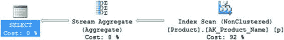
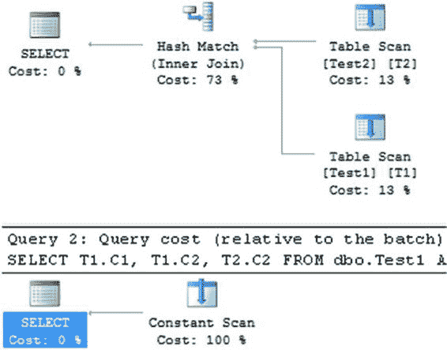

# 除了维护数据完整性，唯一索引还有助于优化器生成高效的执行计划

除了维护数据完整性之外，唯一索引——实体完整性约束的主要载体——还有助于优化器生成高效的执行计划。SQL Server 通常能比搜索非唯一索引更快地搜索唯一索引。这是因为唯一索引中的每一行都是唯一的；一旦找到一行，SQL Server 就不需要继续查找其他匹配的行（优化器知道这一点）。如果某一列用于排序（或 `GROUP BY` 或 `DISTINCT`）操作，请考虑在该列上定义唯一约束（使用唯一索引），因为具有唯一约束的列通常比没有唯一约束的列排序更快。

## 理解实体完整性或唯一约束的性能优势

考虑一个例子来理解实体完整性或唯一约束带来的性能优势。假设你想要修改 `Production.Product` 表上现有的唯一索引。

```sql
CREATE NONCLUSTERED INDEX [AK_Product_Name]
ON [Production].[Product] ([Name] ASC) WITH (
    DROP_EXISTING = ON)
ON [PRIMARY];
GO
```




**第 26 章 ■ SQL Server 优化清单**

该非聚集索引不包含 `UNIQUE` 约束。因此，尽管 `[Name]` 列包含唯一值，但非聚集索引中缺乏 `UNIQUE` 约束，无法提前将此信息提供给优化器。现在，让我们考虑 `UNIQUE` 约束（或缺失的 `UNIQUE` 约束）对以下 `SELECT` 语句的性能影响：

```sql
SELECT DISTINCT
    (p.[Name])
FROM Production.Product AS p;
```

**图 26-1.** `[Name]` 列上没有 `UNIQUE` 约束的执行计划

从执行计划中可以看到，使用了非聚集索引 `AK_ProductName` 来检索数据，然后对数据执行 `Stream Aggregate` 操作，以便在 `[Name]` 列上对数据进行分组，从而可以从最终结果集中删除重复的 `[Name]` 值。请注意，如果优化器提前知道 `[Name]` 列的唯一性，那么 `Stream Aggregate` 操作本来是不需要的。你可以通过使用 `UNIQUE` 约束定义非聚集索引来实现这一点，如下所示：

```sql
CREATE UNIQUE NONCLUSTERED INDEX [AK_Product_Name]
ON [Production].Product
WITH (
    DROP_EXISTING = ON)
ON [PRIMARY];
GO
```

**图 26-2.** `[Name]` 列上具有 `UNIQUE` 约束的 `SELECT` 语句的新执行计划

一般来说，实体完整性约束（换言之，主键和唯一约束）为优化器提供了关于预期结果的有用信息，帮助优化器生成高效的执行计划。值得注意的是，`sys.dm_db_index_usage_stats` 不会显示何时针对定义唯一约束的索引运行了约束检查。

**第 26 章 ■ SQL Server 优化清单**

### 受益于域和引用完整性约束

数据完整性的另外两个重要组成部分是**域完整性**和**引用完整性**。可以通过限制列的数据类型、定义输入数据的格式以及限制列的可接受值范围来强制执行列的域完整性。SQL Server 提供以下功能来实现域完整性：数据类型、`FOREIGN KEY` 约束、`CHECK` 约束、`DEFAULT` 定义和 `NOT NULL` 定义。如果应用程序要求将数据列的值限制在某个值范围内，则此业务规则可以在应用程序代码中实现，也可以在数据库架构中实现。在数据库中使用域约束（例如 `CHECK` 约束）实现此类业务规则通常有助于优化器生成高效的执行计划。


要理解域完整性带来的性能优势，请考虑以下示例：

```sql
--创建两个测试表

IF (SELECT OBJECT_ID('dbo.Test1')
) IS NOT NULL
DROP TABLE dbo.Test1;
GO

CREATE TABLE dbo.Test1 (
    C1 INT,
    C2 INT CHECK (C2 BETWEEN 10 AND 20)
) ;

INSERT INTO dbo.Test1
VALUES (11, 12);
GO

IF (SELECT OBJECT_ID('dbo.Test2')
) IS NOT NULL
DROP TABLE dbo.Test2;
GO

CREATE TABLE dbo.Test2 (C1 INT, C2 INT);

INSERT INTO dbo.Test2
VALUES (101, 102);
```

现在执行以下两条 `SELECT` 语句：

```sql
SELECT T1.C1,
       T1.C2,
       T2.C2
FROM   dbo.Test1 AS T1
       JOIN dbo.Test2 AS T2
            ON  T1.C1 = T2.C2
            AND T1.C2 = 20;
GO

SELECT T1.C1,
       T1.C2,
       T2.C2
FROM   dbo.Test1 AS T1
       JOIN dbo.Test2 AS T2
            ON  T1.C1 = T2.C2
            AND T1.C2 = 30;
```

[www.it-ebooks.info](http://www.it-ebooks.info/)



