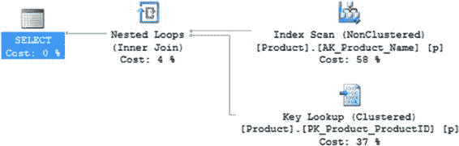
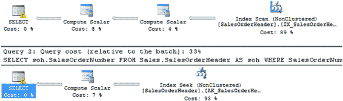

# SQL Server 优化检查清单

对于较大的数据库，备份时长和备份文件大小通常会成为一个问题。过长的备份时长使得在管理时间窗口内完成备份变得困难，进而开始影响最终用户的体验。备份文件的大尺寸使得备份文件的空间管理颇具挑战性，并且当通过网络执行备份到集中备份基础设施时，会增加网络压力。压缩也能加快备份进程，因为需要写入磁盘的数据更少了。

优化备份时长、备份文件大小以及由此产生的网络压力的推荐方法是使用**备份压缩**。SQL Server 2008R2 SP1 及更高版本的 Standard 版本及以上版本支持备份压缩。

## 查询设计

以下是设计数据库查询时应遵循的与性能相关的最佳实践列表：

-   使用命令 `SET NOCOUNT ON`。
-   显式定义对象的所有者。
-   避免**非 Sargable** 的搜索条件。
-   避免在 `WHERE` 子句的列上使用算术运算符和函数。
-   避免优化器提示。
-   远离嵌套视图。
-   确保没有隐式数据类型转换。
-   最小化日志记录开销。
-   采用重用执行计划的最佳实践。
-   采用数据库事务的最佳实践。
-   消除或减少数据库游标的开销。
-   原生编译存储过程。

我将在后续章节中详细说明每条最佳实践。

[www.it-ebooks.info](http://www.it-ebooks.info/)



## 第 26 章 ■ SQL Server 优化检查清单

### 使用命令 `SET NOCOUNT ON`

作为规则，始终在存储过程、触发器和其他批查询中将命令 `SET NOCOUNT ON` 作为第一条语句。这使您可以避免与每条 SQL 语句执行后返回受影响行数相关的网络开销。命令 `SET NOCOUNT` 在第 19 章的“使用 `SET NOCOUNT`”一节中有详细解释。

### 显式定义对象的所有者

作为性能最佳实践，始终用其所有者限定数据库对象，以避免验证对象所有者所需的运行时成本。显式限定数据库对象所有者的性能优势在第 15 章的“不允许在查询中隐式解析对象”一节中有详细解释。

### 避免非 Sargable 搜索条件

在查询中定义搜索条件时要警惕。如果 `WHERE` 子句中使用的列上的搜索条件阻止优化器有效地使用该列上的索引，那么即使存在正确的索引，查询的执行成本也会很高。非 sargable 搜索条件的性能影响在第 18 章的相应章节中有详细解释。

此外，请注意不要在搜索功能上提供过多的灵活性。如果您定义了一个应用程序功能，例如“检索产品名称以‘Caps’结尾的所有产品”，那么您将得到扫描整个表（或聚集索引）的查询。如您所知，扫描包含数百万行的表会损害数据库性能。除非您使用索引提示，否则您将无法从该列的索引中受益。

然而，使用索引提示会覆盖查询优化器的决策，因此通常也不建议您使用索引提示（更多信息请参见第 18 章）。要理解此类业务规则的性能影响，请考虑以下 `SELECT` 语句：

```sql
SELECT p.*
FROM Production.Product AS p
WHERE p.[Name] LIKE '%Caps';
```

在**图 26-4** 中，您可以看到执行计划使用了 `[Name]` 列上的索引，但它必须执行扫描而不是查找。由于对字符数据类型（如 `CHAR` 和 `VARCHAR`）列上的索引按列的前导字符对数据值进行排序，在 `LIKE` 条件中使用前导的 `%` 不允许对索引进行查找操作。匹配的行可能分布在整个索引行中，使得索引对搜索条件无效，从而损害查询的性能。

***图 26-4.** 显示由非 sargable `LIKE` 子句引起的聚集索引扫描的执行计划* 560

[www.it-ebooks.info](http://www.it-ebooks.info/)



## 第 26 章 ■ SQL Server 优化检查清单

### 避免在 `WHERE` 子句列上使用算术表达式

始终尝试避免在 `WHERE` 和 `JOIN` 子句中的列上使用算术运算符和函数。在列上使用运算符和函数会阻止使用这些列上的索引。在 `WHERE` 子句列上使用算术运算符的性能影响在第 18 章的“避免在 `WHERE` 子句列上使用算术运算符”一节中有详细解释，而使用函数的影响在同一章的“避免在 `WHERE` 子句列上使用函数”一节中有详细解释。

为了实际观察，请考虑以下查询：

```sql
SELECT soh.SalesOrderNumber
FROM Sales.SalesOrderHeader AS soh
WHERE 'SO5' = LEFT(SalesOrderNumber, 3);

SELECT soh.SalesOrderNumber
FROM Sales.SalesOrderHeader AS soh
WHERE SalesOrderNumber LIKE 'SO5%';
```

这些查询基本上实现了相同的逻辑：它们检查 `SalesOrderNumber` 是否等于 `S05`。

然而，第一个查询在 `SalesOrderNumber` 列上执行了一个函数，而第二个使用 `LIKE` 子句来检查相同的数据。**图 26-5** 显示了生成的执行计划。

***图 26-5.** 显示函数阻止索引使用的执行计划*

如您在**图 26-5** 中所见，第一个查询强制了索引扫描操作，而第二个能够执行一个良好、清晰的索引查找。这些示例清楚地说明了为什么应该避免在 `WHERE` 子句列上使用函数和运算符。

您在计划中看到的警告与 `SalesOrderHeader` 表中计算列内发生的隐式转换有关。

### 避免优化器提示

作为规则，避免使用优化器提示，例如索引提示和连接提示，因为它们会覆盖优化器的决策过程。在大多数情况下，优化器足够智能以生成高效的执行计划，并且在没有任何优化器提示强加的情况下，它工作得最好。这同样适用于计划指南。强制计划在极少数情况下有帮助，但通常最好依赖优化器做出好的选择。要详细了解优化器提示的性能影响，请参阅第 18 章的“避免优化器提示”一节。

[www.it-ebooks.info](http://www.it-ebooks.info/)

## 第 26 章 ■ SQL Server 优化检查清单

### 远离嵌套视图

当一个视图调用另一个视图，后者又调用更多视图，依此类推时，就存在嵌套视图。这可能导致代码混乱，原因有二。首先，这些视图掩盖了所执行的操作。其次，查询可能很简单，但 SQL 引擎的执行计划和后续操作可能既复杂又昂贵。这是因为优化器没有时间来简化查询，消除它不需要的表和列；相反，优化器假定所有表和列都是必需的。同样的规则也适用于嵌套用户定义函数。

### 确保没有隐式数据类型转换


在查询中创建变量时，请确保这些变量的数据类型与它们将用于比较的列的数据类型相同。尽管 SQL Server 能够并且确实会进行例如将 `VARCHAR` 转换为 `DATE` 的操作，但这种隐式转换可能导致索引无法使用。在诸如表连接等情况下，你也必须同样谨慎，确保一个表的主键数据类型与所连接表的外键匹配。你偶尔可能会在执行计划中看到警告来帮助你解决这个问题，但不能依赖于此。

### 最小化日志开销

SQL Server 在事务日志中维护每个原子操作（或事务）的新旧状态，以确保数据库的一致性和持久性。这可能会给日志磁盘带来巨大压力，常常使日志磁盘成为争用点。因此，为了提高数据库性能，你必须尝试优化事务日志开销。除了本章后面讨论的硬件解决方案外，你还应采用以下查询设计最佳实践：

• 对于小型结果集（小于 20 到 50 行），尽可能选择使用 `表变量` 而不是 `临时表`。请记住：如果结果集不小，你可能会遇到严重问题。

`表变量` 的性能优势在第 17 章的“使用表变量”一节中有详细解释。

• 将多个操作查询批处理在一个单一事务中。使用此选项时必须小心，因为如果在单个事务中影响的行过多，相应的数据库对象将被长时间锁定，阻塞所有其他尝试访问这些对象的用户。

• 通过使用 `大容量日志` 恢复模型来减少某些操作的日志记录量。

此规则主要适用于处理大规模数据操作时。当启用 `大容量日志` 并使用 `UPDATE` 语句的 `WRITE` 子句或删除或创建索引时，你也会使用最小日志记录。

### 采用最佳实践以重用执行计划

优化计划生成成本的最佳实践可大致分为以下两类：

• 有效缓存 `执行计划`

• 最小化 `执行计划` 的重新编译

[www.it-ebooks.info](http://www.it-ebooks.info/)

