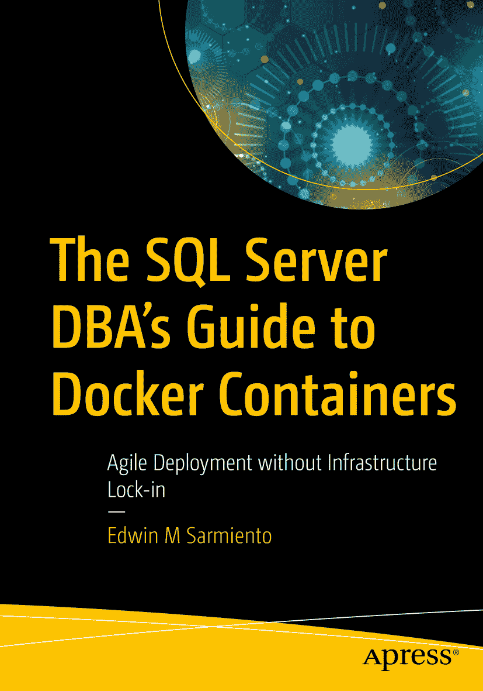

ISBN 978-1-4842-5825-5 e-ISBN 978-1-4842-5826-2
[`doi.org/10.1007/978-1-4842-5826-2`](https://doi.org/10.1007/978-1-4842-5826-2) © Edwin M Sarmiento 2020

本作品受版权保护。出版商保留所有权利，无论涉及材料的全部或部分，特别是翻译、转载、插图再利用、朗诵、广播、微缩胶片或其他任何物理方式的复制，以及信息存储与检索、电子改编、计算机软件，或目前及未来已知或开发的类似或不同方法的传播权。在本出版物中使用通用描述性名称、注册商标、服务标志等，即使未作具体说明，也不意味着这些名称可不受相关保护法律法规的约束而自由使用。出版商、作者和编辑可以放心地认为本书中的建议和信息在出版时是真实准确的。出版商、作者或编辑均不对此处包含的材料或可能已出现的任何错误或遗漏提供明示或暗示的保证。出版商对出版地图中的管辖权主张及机构附属关系保持中立。

本书通过 Springer Science+Business Media New York（地址：233 Spring Street, 6th Floor, New York, NY 10013，电话：1-800-SPRINGER，传真：(201) 348-4505，邮箱：orders-ny@springer-sbm.com，或访问 www.springeronline.com）面向全球图书贸易发行。Apress Media, LLC 是加利福尼亚州的一家有限责任公司，其唯一成员（所有者）是 Springer Science + Business Media Finance Inc (SSBM Finance Inc)。SSBM Finance Inc 是特拉华州的一家公司。

## 献词

*本书献给所有多年来固守“自己不具备成功所需条件”这一信念的 SQL Server DBA 和 IT 专业人士——觉得自己不够好、不够聪明、技术不够强、天赋不够高。是时候放下那些谎言，开始过你命中注定要过的生活了。本书的作者，就是一个曾被告知自己将一事无成的人。*

