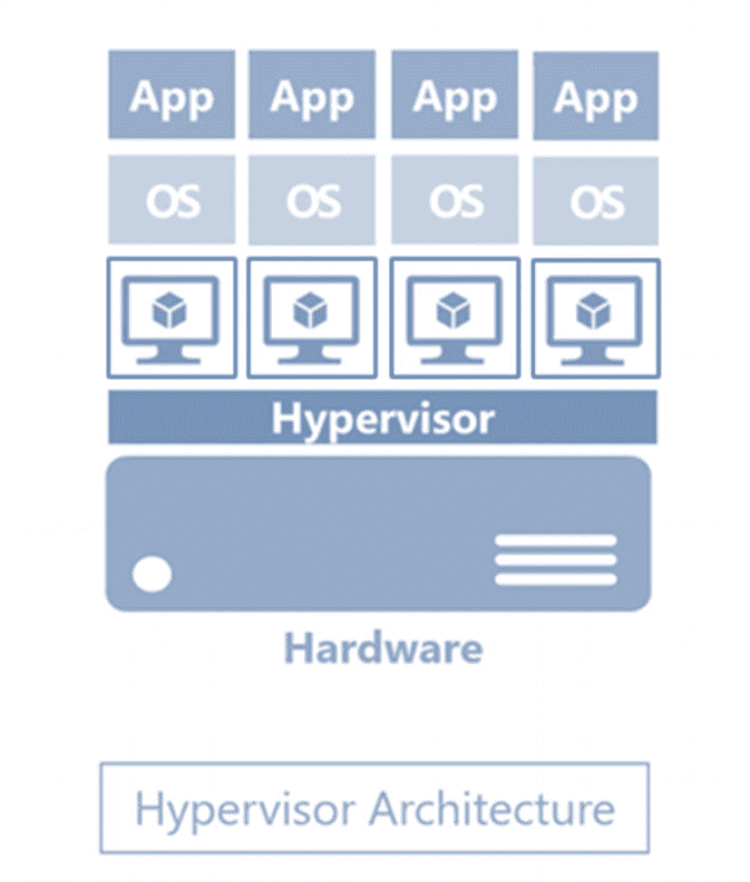
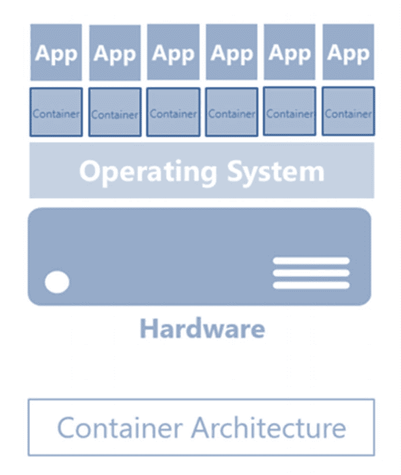

# 1. 容器简介

> 无法铭记过去的人注定会重蹈覆辙。
>
> —乔治·桑塔亚纳

容器技术正在改变我们开发、部署和运行软件的方式。尽管它看起来像是一夜之间冒出来并正在接管 IT 组织的技术，但事实远非如此。

在本章中，我们将回溯历史，看看容器技术的一些历史及其演变过程。你可能在想：“我高中时最讨厌历史了。” 我完全能理解。我在高中和大学读历史，唯一的目的就是应付考试。我讨厌记人名和日期。那么，为什么还要费心去了解容器技术的历史呢？

历史赋予我们后见之明的好处，这是你在第一次经历某事时所不具备的。当别人已经完成了你正试图完成的事情时，你就拥有了他们从经验教训中获益的优势，可以避免他们犯过的错误，并且可能理解那些看似凭空出现的模式。这些历史课程充满了深刻的见解，可以帮助你更好地理解技术或更广阔的世界。这些年来，我学会了欣赏历史以及它如何塑造了我们当前的现实——更妙的是，学会了如何改变我的现在，从而塑造未来。

我们还将关注当今最广泛使用和认可的容器技术背后的公司——`Docker, Inc.`。

讨论容器技术，如果不将其与虚拟化技术进行比较，就是不完整的。我们将花一点时间看看两者之间的异同。

最后，我们将看看`Microsoft`如何为`Windows`和`SQL Server`采用容器技术。

## 最新的 30 年老技术

当我了解到容器技术可以追溯到 1979 年时，我很惊讶。正是`Unix V7`首次允许进程在操作系统级别隔离运行——即隔离和保护一个进程不受另一个进程影响的能力。这个想法的产生源于需要同时在许多用户之间共享非常昂贵的计算资源。回想一下大型机只能执行一项特定任务的日子，而这项任务可能需要几天甚至几周才能运行完。

然而，像任何其他未被广泛采用的技术创新一样，进程隔离技术变得停滞不前。直到 2000 年，类 Unix 操作系统`FreeBSD`引入了`Jails`——一种将计算机系统划分为几个独立微型系统的机制，每个系统拥有自己的文件、进程和安全性。你可以将其视为我们今天所知的虚拟化技术的早期雏形。

此后，实现进程隔离技术的多种变体相继出现，包括 2001 年的`Linux VServer`（一个允许操作系统级虚拟化的 Linux 内核补丁）、2004 年的`Solaris Containers`（前`Sun Microsystems`对操作系统级虚拟化的实现）以及 2005 年的`Open Virtuozzo`。2006 年，`Google`对 Linux 内核做出了自己的贡献，并将其命名为`Process Containers`，后来为了避免与 Linux 容器上下文中的“容器”一词混淆，将其更名为`Control Groups`（`cgroups`）。

2008 年成为容器技术发展的关键时刻，`Linux Containers`（`LXC`）项目被创建，将`Google`工程师在`cgroups`方面的工作合并到了 Linux 内核中。它允许在一台主机上使用单个 Linux 内核运行多个隔离的 Linux 系统——而无需额外的补丁。

`LXC`成为了后续现代容器技术的基石。2011 年，`VMWare`与`EMC`和`General Electric`共同启动了一个名为`Cloud Foundry Warden`的开源计划，用于跨多个主机管理容器集合。2013 年，`Google`又创建了一个他们容器栈的开源版本，名为`lmctfy`（代表“让我为你包含那个”），并从此开始与`Docker, Inc.`合作开发容器运行时环境`libcontainer`。

容器技术看起来像是席卷 IT 界的最新技术。但事实是，它并不新。它只是远远超前于它的时代。而现在它的时代已经到来，你根本无法忽视它。

## Docker——公司与容器运行时

`Docker`之于容器运行时引擎，就像`VMWare`之于虚拟化或`Red Hat`之于`Linux`——它已成为 IT 界一个巨大的品牌。`Docker`运行时引擎是由`Docker, Inc.`这家公司开发的。该公司最初并非一家开发公司。事实上，他们最初是一家平台即服务公司，允许开发人员构建和运行应用程序，而无需担心底层基础设施。不幸的是，该公司难以产生收入来支付账单。但好处是，他们学会了如何最大限度地利用当时的处境。

当`Docker, Inc.`陷入财务困境时，工程师们决定在 2013 年将其平台即服务产品的底层技术——容器运行时引擎`Docker`——开源。他们并没有期望它会大受欢迎。但当它确实火起来后，公司转型了业务，专注于`Docker`。他们甚至将公司名称从创立时的原名`dotCloud`改为`Docker, Inc.`。于是，现代容器技术诞生了。早期版本的`Docker`利用`LXC`作为容器运行时引擎。后来的版本则使用`libcontainer`。

看到`Docker`从一个举步维艰的企业转型为现在可被认为是一家盈利的软件公司，这很有趣。我们 IT 专业人士需要从他们的例子中学习。我们需要学会在需要时进行转型。学习新兴技术，而不是只要能满足业务目标就满足于旧技术。我们需要学会将我们的角色从纯技术性转向更多领导性。而且，由于技术在不断发展，我们需要与时俱进，在必要时改变角色。

这是在 IT 行业取得成功的关键。

## 容器的价值主张

我们 IT 专业人士喜欢钻研技术，因为它们很酷、很有趣。很容易陷入为技术而技术的陷阱。但要认识到，每一项成功的技术都是为了解决某个业务问题。要成为一名成功的 IT 专业人士，我们需要关注技术解决方案旨在解决的业务问题。

那么容器技术解决了什么业务问题呢？可靠地运行软件，当它从一个计算环境迁移到另一个计算环境时。`SQL Server`管理员在每次将数据库从一个平台迁移到另一个平台时都会处理这个问题——从物理机到另一台物理机，从物理机到虚拟机，从旧版本到新版本，或从本地迁移到云端。一个更常见的场景是，开发人员在其开发环境中编写`T-SQL`代码，然后将代码提升到预演环境甚至生产环境。即使有适当的变更管理流程，这仍然可能是个问题，因为无法保证不同的计算环境是相同的。配置漂移是我作为顾问不得不处理的许多高可用性和灾难恢复系统故障的原因。

容器技术解决了这个问题。它通过打包一个应用程序及其所有依赖项（如二进制文件、内核库、配置文件、系统工具等）并创建一个完整的运行时环境来实现这一点。一个容器镜像被创建出来，并与应用程序及其所有依赖项打包在一起。然后，该镜像在运行时被部署为一个容器。

## 容器与虚拟化

乍看之下，容器因其本质和功能，可能与虚拟化非常相似。请不要混淆。请看图 1-1 中关于 hypervisor 架构的示意图。

图 1-1 Hypervisor 架构

在虚拟化的世界中，你在硬件之上运行一个 hypervisor——例如`VMWare`、`Hyper-V`、`Xen`等等。然后，你创建一个带有自己操作系统的虚拟机，之后才能安装并运行你的应用程序。每台虚拟机都被配置为使用硬件 CPU、内存、网络和存储资源的一部分。多年来，虚拟化解决了一个 IT 组织面临的主要业务问题：物理硬件的过度配置。过去，我们只能猜测并过度配置物理机的规格，让它运行着，却几乎连四分之一的硬件资源都用不上。虚拟化允许我们在单台物理机上创建多个虚拟机，以最大化利用每一点可用的硬件资源。它还实现了进程和应用程序的隔离——它们在虚拟机的边界内运行。这让财务人员非常高兴。但我们的感受却并非如此。

我们花费大量时间来管理操作系统——打补丁、加固安全、监控、更新、审计、许可，甚至为它们分配资源。管理操作系统本身仿佛已经成了一个独立的业务单元。我们本职并非管理操作系统，但我们的日常工作看起来却确实如此。如果我们只有一个操作系统，但它能运行不同的应用程序，且这些应用程序在隔离的进程中运行，从而互不干扰，就像应用程序通过虚拟机彼此隔离那样，这岂不是很好？我们不需要完全抛弃操作系统，我们只是需要减少其数量。

这正是容器技术的用武之地。

图 1-2 容器架构

在图 1-2 中，你只有一个操作系统。容器与其他容器共享同一个操作系统内核，每个容器都作为用户空间中隔离的进程运行。容器抽象的是操作系统内核，而不是像虚拟化那样抽象硬件。想象一下这对你的资源会产生什么影响。你不再需要多个操作系统副本运行在客户虚拟机上，而只需要一个副本，从而减少了所需的存储空间。你也在减少管理操作系统所需的管理开销。如果你曾不得不在周末和节假日加班，只为了在所有服务器上安装那个关键的安全补丁，你就知道这有多重要。此外，鉴于容器对资源的需求较低，与虚拟机相比，你可以在单台主机上运行更多的容器。

## 微软、容器与 Linux 上的 SQL Server

在我短暂担任 Oracle DBA 期间，我自主决定要转型。那时，说到关系型数据库，Oracle 就是那个代名词。我的同行们正转向 Oracle 和 Java。但我决定反其道而行之——我转投了微软的`SQL Server`和`.NET`。我这样做是因为我看到了微软做软件的方式，更侧重于用户，而不仅仅是技术本身。他们创建了用户界面、易于访问的文档、教程、博客文章、在线社区等等。硬核的技术迷们对此嗤之以鼻。但客户们却很喜欢。所以，我转型了。

那是 2015 年。在一年一度的微软 MVP 峰会上，我正在听数据库系统部门的微软高管谈论他们正在开发的一个项目。他们称之为`Project Helsinki`。其使命是将`SQL Server`引入 Linux。微软有客户询问他们是否会将`SQL Server`移植到 Linux 上。高管们谈到，新一代的开发者并不真正关心底层的操作系统——他们只想要一个数据平台。微软仍然专注于客户。

当`SQL Server 2017`发布时，它同时支持 Windows 和 Linux。这不再是愚人节玩笑（我希望他们没有在 4 月 1 日发布）。这是真实的。`SQL Server 2017`是第一个可以在 Windows、Linux 和 Docker 容器上运行的版本。我立刻下载并安装了`SQL Server`到我的`CentOS` Linux 虚拟机上，几分钟内，我就能够使用我 Windows 8 机器上的`SQL Server Management Studio`远程连接到它了。

> **提示**
>
> Bob Ward 所著的 Apress 书籍`Pro SQL Server on Linux`讲述了微软如何成功使这个看似不可能的任务成为现实的幕后故事。

也正是在这个时期，微软将 Docker 引擎集成到了`Windows Server 2016`操作系统中——即`Windows Server Containers`。他们与`Docker, Inc.`合作，创建了一个在`Windows Server`操作系统内部原生运行的容器运行时引擎。由于`Docker`是开源的，它允许微软对其进行修改，使其在 Windows 上工作。

开源、微软、Linux 上的`SQL Server`、容器。我确信 2001 年的史蒂夫·鲍尔默没有预见到这一切。

