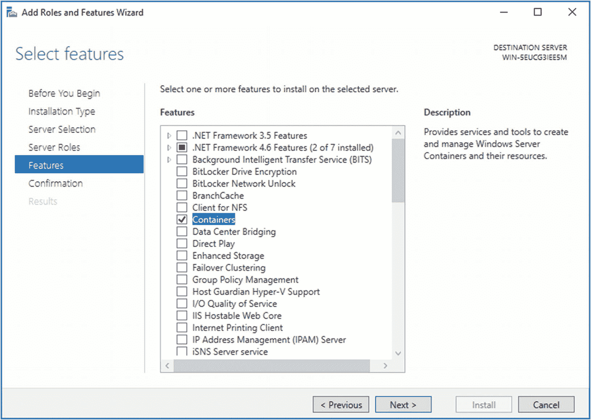
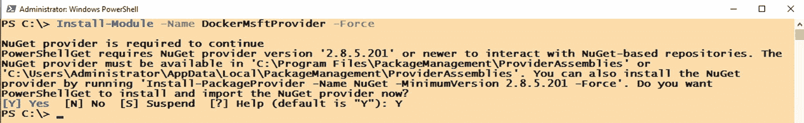
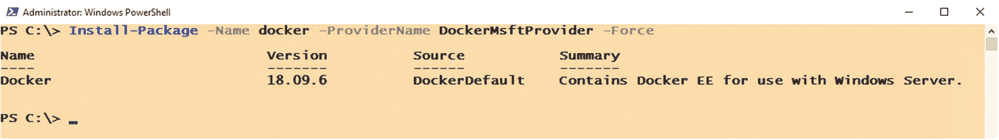
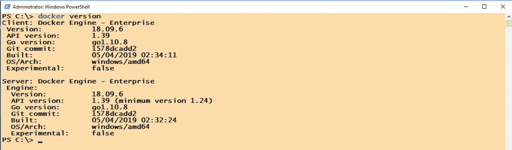
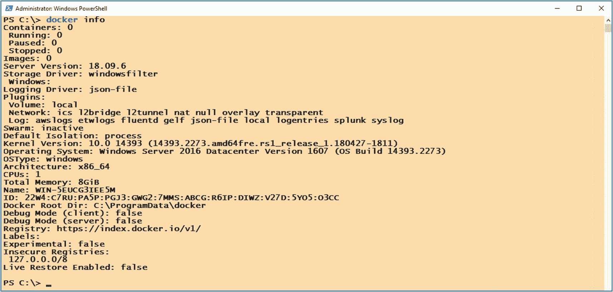
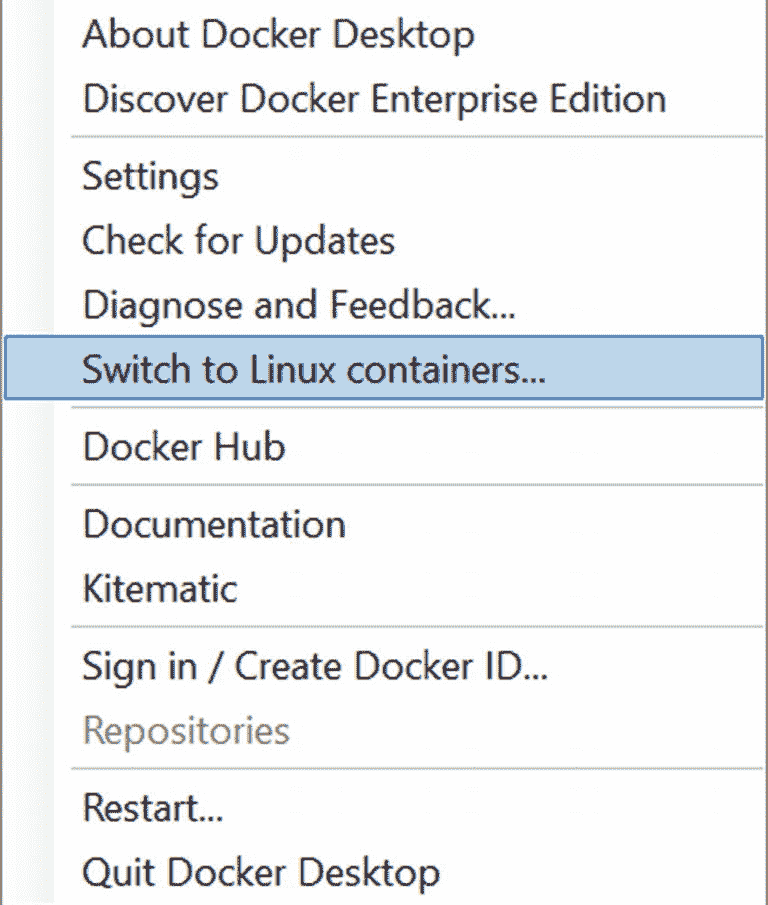
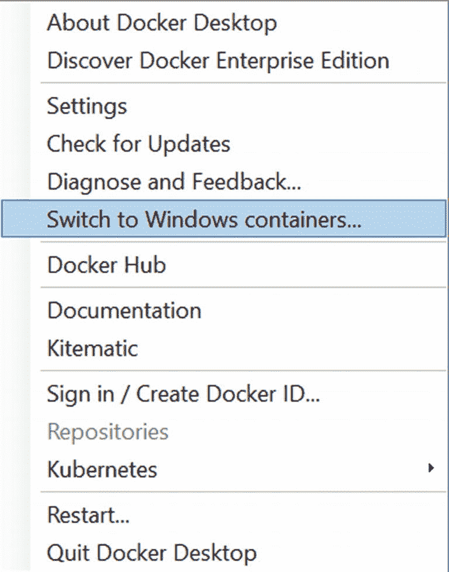
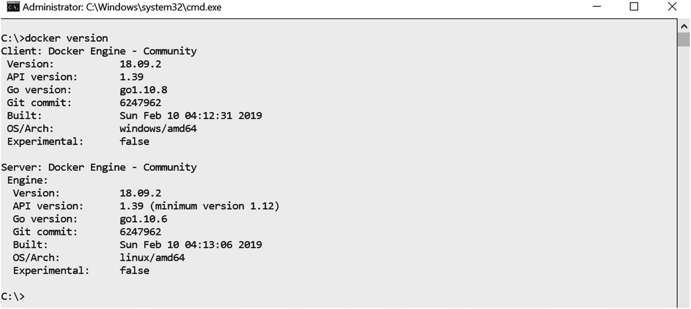

# 2. 在 Windows Server 上安装和配置 Docker

> 学习是创建已知与未知之间关系的过程。
> ——托尼·罗宾斯

上一章介绍了容器技术、其起源，以及`SQL Server`现在如何在 Linux 和 Docker 容器上运行。但对于一个几乎没有 Linux 经验的人来说，这可能有点让人不知所措。因此，本章不会直接深入 Linux，而是帮助你使用你已经熟悉的平台——`Windows Server`操作系统，开始接触 Docker 容器。微软与`Docker, Inc.`合作，将 Docker 容器引入`Windows Server`操作系统，使 Windows 和`SQL Server`管理员能够轻松学习和部署 Docker 容器。

本章我们将使用`Windows Server 2016 Build 1607`，但后续版本如`1709`和`1803`也可使用。然而，你肯定不想在处理预发布软件问题的同时学习容器技术。相信我，在 2000 年代早期处理预发布软件让我掉了很多头发。

> **注意**
>
> 本章不涉及安装`Windows Server`操作系统的过程。假定已存在一个干净安装的`Windows Server 2016`，并且具有互联网连接。有关安装`Windows Server 2016`的逐步指南，请参阅*附录 A*。
>
> 另外，默认的`Windows Server`安装将选择`Server Core`，除非你特别选择`Desktop Experience`。当你开始使用`Docker`和 Linux 时，你将需要使用命令行，所以现在先坚持使用 Windows 的图形用户界面。


## 最低系统要求

与任何软件安装一样，您需要满足最低系统要求，才能成功地将 Windows Server 操作系统用作 `Docker 容器主机`。Docker 容器主机是运行 Docker `守护进程` 的操作系统（守护进程简单来说就是 Linux 中相当于 Windows 服务的程序）。

*   **内存**：至少 4GB。您肯定不希望花费大量时间排查容器部署问题，最后却发现只是内存资源不足。此外，一个 SQL Server 实例会尽可能占用所有可用的内存资源。在容器中运行时也是如此。
*   **操作系统**：我们使用的是 Windows Server 2016，但这并不意味着您只需要了解这一点。请记住，容器共享相同的操作系统内核。这意味着容器主机的操作系统应支持容器镜像的操作系统。由于我们部署的是 Windows Server 2016 容器主机，因此只能部署运行 Server Core 或 Nano Server 的 Windows Server 2016 容器镜像。我们将跳过 Nano Server，因为 SQL Server 不支持在其上运行。
*   **磁盘空间**：最低限度是 32GB。与虚拟机类似，每个容器镜像都需要自己的磁盘空间。请分配足够的磁盘空间，以便同时运行多个容器。

## 在 Windows Server 2016 中启用容器功能

在 Windows Server 2016 机器上安装和配置 Docker 容器主机是一个三步过程。您需要让这台机器连接到互联网，以下载二进制文件、PowerShell 包和基于 Windows 的容器镜像。

第一步是在 Windows Server 2016 上启用容器功能：

1.  从 **开始** 菜单中，选择 **服务器管理器**。
2.  在服务器管理器仪表板中，单击 **添加角色和功能** 链接。这将运行 **添加角色和功能向导**。
3.  单击“下一步”，直到到达 **选择功能** 对话框。如图 2-1 所示，选中 **容器** 复选框，然后单击“下一步”。请注意，在 Windows Server 2016 版本 1607 上，默认会选中 **.NET Framework 4.6 功能** 复选框。如果未选中，请展开 **.NET Framework 4.6 功能** 复选框，并确保显示 **.NET Framework 4.6 (已安装)**。
    
    **图 2-1**
    在“选择功能”对话框中选中“容器”复选框
4.  在 **确认安装选定内容** 对话框中，单击“安装”。

由于您将通过命令行处理 Docker 命令——在 Windows 和 Linux 上都是如此——这是一个在 Windows 环境中开始使用命令行的绝佳机会。请拥抱闪烁的光标并熟悉它。启用容器功能的另一种方法是使用 `Install-WindowsFeature` PowerShell cmdlet。打开一个具有管理员权限的 PowerShell 命令窗口，并运行以下命令：
```
Install-WindowsFeature –Name Containers
```
启用容器功能后，系统将提示您重新启动计算机以完成安装过程。您可以使用熟悉的方法执行重启，也可以使用 `Restart-Computer` PowerShell cmdlet。

## 下载并安装 Docker-Microsoft PackageManagement 提供程序

第二步是下载并安装 `Docker-Microsoft PackageManagement 提供程序`。包管理系统的作用是自动化地持续发现、安装、更新、配置和移除计算机软件。在这种情况下，您将安装一个专门用于与 Docker 配合使用的包管理系统。

运行以下 PowerShell 命令以下载并安装 Docker-Microsoft PackageManagement 提供程序：
```
Install-Module -Name DockerMsftProvider -Force
```
当提示下载并安装 `NuGet` 提供程序时，输入 **Y** 表示“是”，如图 2-2 所示。

**图 2-2**
使用 Docker-Microsoft PackageManagement 提供程序下载 NuGet 提供程序

**注意**
对于主要工作在 Windows 平台上的 IT 专业人士来说，包管理系统的主题可能会有点令人困惑。多年来，Windows 上的软件是通过 EXE、MSI 和 MSU 文件分发的——只需下载安装文件，双击并安装即可。Linux 的情况则不同。鉴于 Linux 的开源性质以及软件来源的多样性，需要使用包管理器来安装和管理软件。PowerShell 5.0 引入了利用包管理器的功能，以简化安装软件和 PowerShell 模块的复杂性。

如果您想深入了解 `Docker-Microsoft PackageManagement 提供程序` 的实现细节，请查看 GitHub 仓库：[*https://github.com/OneGet/MicrosoftDockerProvider*](https://github.com/OneGet/MicrosoftDockerProvider)。

## 下载并安装 Docker 软件包

第三步是下载并安装 Docker 软件包。运行以下 PowerShell 命令，使用您在上一步中下载的 `Docker-Microsoft PackageManagement 提供程序` 来下载并安装 Docker 软件包。图 2-3 显示了成功安装 Docker 企业版 (EE)。

**图 2-3**
下载并安装 Docker 软件包
```
Install-Package -Name docker -ProviderName DockerMsftProvider -Force
```
这将创建一个名为 **Docker Engine** 的 Windows 服务，该服务调用命令 `"C:\Program Files\Docker\dockerd.exe" --run-service`

该服务配置为在服务器启动时自动启动，但安装过程不会显式启动该服务。这时您需要进行一次不太受欢迎的服务器重启，以更新环境变量，从而可以从命令提示符或 PowerShell 命令 shell 运行 Docker 命令。别担心。这将是您最后一次需要重启服务器。


## 验证 Docker 引擎安装

我确实说过，你需要开始习惯使用命令行。从现在起，你将主要使用命令行进行操作——无论是命令提示符还是 PowerShell 命令 shell。我更喜欢使用 PowerShell，这样我可以同时利用可用的 PowerShell cmdlet 和 Docker 命令。请记住，PowerShell 命令或 cmdlet 的输出是一个对象或对象集合，而 Docker 命令的输出是文本。此外，请务必在提升权限的管理员 PowerShell 命令 shell 中运行每条命令。

运行以下命令以检查服务器上安装的 Docker 版本：
```
docker version
```
图 2-4 展示了该命令的输出，显示了 Docker 客户端以及运行在机器上的 Docker 引擎的版本。



图 2-4：显示 Docker 客户端和 Docker 引擎的版本

客户端和服务器的 `OS/Arch:` 属性都显示 `windows/amd64`，因为 Docker 引擎运行在 Windows Server 2016 机器上。此外，安装的是 Docker 引擎 - 企业版。这意味着你在 Docker 主机上部署容器时，将获得来自 Microsoft 和 Docker 的双重支持。事实上，尽管 Docker 引擎是负责在 Windows Server 机器上运行容器的组件，但 Microsoft 是首要的支持联系点。第 4 章将更详细地描述 Docker 企业版与社区版之间的区别。

运行以下命令以显示关于服务器上 docker 安装的系统级信息：
```
docker info
```
图 2-5 展示了该命令的输出。



图 2-5：显示 Docker 安装的系统级信息

至此，你的 Windows Server 2016 机器已成为一个功能完备的 Docker 容器主机。

## Windows 版 Docker Desktop

使用服务器操作系统（如 Windows Server）而非桌面操作系统（如 Windows 10）来部署 Docker 容器主机的理念，是为了让你体验在“真实世界”中部署 Docker 的过程，类似于数据中心工程师在生产环境中的部署方式。理解运行应用程序的底层基础设施有助于你成为一名更全面的 IT 专业人士。

Windows 版 Docker Desktop 是大多数开发者在 Windows 操作系统上开始学习 Docker 时使用的工具。它是一个利用 Hyper-V 虚拟化的原生 Windows 应用程序。我喜欢将其视为某种形式的嵌套虚拟化——它会在 Hyper-V 主机内创建一个 MobyLinux 虚拟机。这个 MobyLinux 虚拟机将作为 Docker 容器主机运行，以承载基于 Linux 的容器。但由于它是一个原生 Windows 应用程序，你也可以在主机上直接运行基于 Windows 的容器。借助 Windows 版 Docker Desktop，你可以在运行 Linux 容器和 Windows 容器之间进行切换。图 2-6 和图 2-7 展示了如何在 Docker Desktop 中切换 Windows 容器和 Linux 容器。



图 2-7：切换到 Linux 容器



图 2-6：切换到 Windows 容器

运行 `docker version` 命令会根据你运行的是 Linux 容器还是 Windows 容器而显示不同的结果。图 2-8 展示了运行 Linux 容器时该命令的输出。请注意，客户端的 `OS/Arch:` 属性是 `windows/amd64`，而服务器的则是 `linux/amd64`（这是为在 Hyper-V 上运行而创建的 MobyLinux 虚拟机）。



图 2-8：Windows 上的 Docker Desktop – 客户端和服务器详情（Linux 容器）

在 Windows 上安装 Docker Desktop 非常简单。只需从 Docker Hub 下载并运行安装文件即可。

如果你的开发者同事中有任何想要尝试 Docker 的，Windows 版 Docker Desktop 就是你该推荐的工具。而我们这些“大孩子”玩的是真正的“玩具”——也就是服务器。

