# 3. 在 Linux 上安装与配置 Docker

> *生命的关键在于接受挑战。一旦有人停止这样做，他就如同死去。*
> —贝蒂·戴维斯

我仍然不敢相信我正在撰写这一章——面向 SQL Server 数据库管理员（DBA）的 Linux 内容。在第 1 章中，我提到微软如何在 2017 年将 SQL Server 带到了 Linux 上。这对许多只了解 SQL Server 是运行在 Windows 操作系统上的关系数据库引擎的 DBA 来说，是一个巨大的意外。但就像任何技术创新一样，你可以选择拥抱它，也可以选择忽略它。拥抱它，能给你一个成长的机会，将你的职业生涯提升到一个全新的高度。

我假设你对 Linux 的经验非常少，甚至为零。因此，我们将从熟悉 Linux 开始——了解使用操作系统、文件系统和 Docker 所需掌握的简单基础命令。这意味着大部分时间将在命令行中工作。在安全性方面，你还需要改变思维方式。在讲解更新 Linux 系统的章节时，你会看到这方面的实际应用。

一旦你对 Linux 有了些许熟悉，我们就会着手在 Linux 上安装和配置 Docker 引擎。与 Windows 不同，Linux 有非常多的发行版（通常简称为 distros），要了解每一个都具有挑战性。我们将只关注两个 Linux 发行版——CentOS 和 Ubuntu。它们不仅 consistently 位居最受欢迎的 Linux 服务器发行版前十，也是微软支持运行 SQL Server on Linux 的三个发行版中的两个。CentOS 是一个免费的、企业级的、由社区支持的发行版，基于 Red Hat Enterprise Linux（RHEL）。你可以在不签订企业支持协议的情况下，获得使用类似 RHEL 的 Linux 发行版的体验。另一方面，Ubuntu 是基于 Debian GNU/Linux、深受开发者欢迎的 Linux 发行版。我们仍然需要让开发者满意，不是吗？

为了让学习 Linux 更容易一些，请选择一个发行版并坚持使用它。当你对第一个选择感到得心应手后，再学习其他发行版。

**注意**
与第 2 章一样，本章不涉及安装 Linux 操作系统的过程。那是*附录 A*的内容。本章假设你已经安装好了一个干净的 CentOS 或 Ubuntu Linux 服务器，并配置了安全外壳（SSH）客户端以远程连接到这些机器。

## 最低系统要求

与 Windows 不同，Linux 运行不需要大量的系统资源。因此，如果你遵循在 Windows Server 上运行 Docker 的最低系统要求，那就没问题。

*   *内存*：至少 4GB。即使在 Linux 机器上，我也总是从 4GB 内存起步，因为我会假设它将运行 SQL Server。我的 Linux 系统管理员同事几年前曾嘲笑我这样做。我不怪他们。但是，在那个时候，没人梦想过在 Linux 上运行 SQL Server。此外，在 Linux 上运行 SQL Server 的最低内存要求是 2GB。

*   *操作系统*：你也可以使用其他支持的 Linux 发行版。Docker 支持的最低版本是 CentOS 7（对于 RHEL，你至少需要 7.4 版本）和 Ubuntu Server Xenial 16.04（LTS）。为了让你开始在 Linux 上运行 Docker，我们将使用`CentOS 7.6 (1810)`和`Ubuntu Server Xenial 16.04 (LTS)`。你可以从[`www.centos.org/download/`](https://www.centos.org/download/)下载 CentOS 的 ISO 镜像，从[`http://releases.ubuntu.com/16.04/`](http://releases.ubuntu.com/16.04/)下载 Ubuntu Server Xenial 的 ISO 镜像。对于 Ubuntu，请务必选择*Server install image*，而不是*Desktop image*。

*   *磁盘空间*：你可能会对 Linux 的磁盘空间需求感到惊讶——即使在运行 SQL Server 时也是如此。在第*5*章中，你将看到在 Linux 上运行 SQL Server 容器与在 Windows 上运行 SQL Server 在磁盘空间需求上的差异。对于任何 Linux 安装，20GB 是我的绝对最低要求。

**注意**
关于在 Linux 操作系统上运行 Docker 引擎，确实没有官方支持的最低系统要求。我花了几个小时在 Docker 文档中搜索他们认定的支持最低系统要求。然而，你找到的会是运行 Docker Universal Control Plane（用于多主机 Docker 集群的集群管理解决方案）的最低系统要求。在学习的早期阶段，请先忽略这个，留待更高级的配置时使用。


## 入门所需的 Linux 基础命令

这不是一本关于 Linux 的书。本书的目的并非要把你变成一个十足的 Linux 极客（尽管我不会阻止你成为这样的人）。然而，由于你将在 Linux 操作系统上部署 Docker，你需要学习一些基础命令，足以让你入门即可。一旦你熟悉了 Linux 的工作方式，你就可以更深入地学习这些命令中的某些命令。

我过去常常查阅 Linux 的 `man`（manual 的缩写）页面来获取我想使用的任何命令的文档。现在，你只需敲几下键盘和使用你喜欢的搜索引擎就够了——互联网上有你所需的一切。

本章的目标是在 Linux 上安装和配置 Docker。以下是完成此任务所需的 Linux 命令：

*   `sudo`：“替代用户并执行”的缩写。Linux 的一个安全最佳实践是以普通用户身份登录，而不是超级用户（或 `root`）。`Root` 类似于 Windows 中的本地管理员账户——它几乎可以做任何事。由于你不会使用 `root` 账户登录，因此必须在所有管理命令前加上 `sudo`（没人会阻止你以 `root` 登录，但是，我恳请你不要这样做）。默认情况下，这会将你的交互式 shell 用户的安全上下文切换到 `root` 的安全上下文。
*   `yum`：Yellow 更新管理器的缩写，是 Red Hat 开发的用于 Red Hat 包管理器（RPM）系统安装、更新和移除的包管理工具。这是在 RHEL 和 CentOS 上都可用的包管理工具。
*   `yum-config-manager`：一个用于管理软件包仓库的工具，通常在 RHEL/CentOS 系统上使用。
*   `apt-get`：与高级包工具（APT）一起使用。它是 Ubuntu 和其他基于 Debian 的 Linux 发行版中 `yum` 的对应版本。在 Ubuntu 上管理软件包，这是首选工具。
*   `add-apt-repository`：在 Ubuntu 和其他基于 Debian 的 Linux 发行版上添加仓库的工具。
*   `ls`: Linux 中与 Windows 的 `dir` 命令对应版本，用于列出目录及其中的文件。
*   `grep`：名称来源于“全局正则表达式搜索并打印”。一个用于在纯文本文档数据集中搜索匹配正则表达式的行的工具。我主要用它来搜索文本文件或命令输出中的特定文本。
*   `cat`：catenate 的缩写。一个用于处理文件的工具，例如读取文本文件并显示其内容、将文本文件的内容复制到另一个文件中，或合并多个文件的内容。我经常用它来在屏幕上显示文件内容。
*   `systemctl`：一个用于管理 `systemd` 的命令——`systemd` 是 Linux 上的一个系统和服务管理工具。你用它来停止、启动、重启 Linux 上的守护进程以及检查其状态。

另外，务必学习管道操作符（`|`）。你使用 `pipe` 操作符将一个命令的输出发送到另一个命令。它类似于 PowerShell 中的 `pipe` 操作符。

*务必记住你的密码！* 你将经常运行 `sudo` 来执行其他命令，所以你最好记住你的密码。并且，请不要把它写在便利贴或一张纸上让所有人都看到。如果我看到你这样做，我会用 Nerf 枪射你。我推荐使用密码管理器来存储你的登录信息。LastPass 是 Windows 上一个流行的密码管理器，它在线加密存储密码。

还有一些其他的 Linux 软件包需要安装，每一个都有自己的语法。这些软件包的用法将在本章后面需要时再作介绍。

## 在 CentOS Linux 上安装 Docker

在 CentOS 上安装 Docker 的过程与在 Ubuntu 上稍有不同。因此，我决定将安装过程分为两部分——一部分用于 CentOS，一部分用于 Ubuntu。如果你决定在 CentOS 机器上安装 Docker，本节将为你概述该过程。

### 更新 CentOS 系统软件包

使用以下 `yum` 命令，用可用的更新来更新所有已安装的软件包。下面的示例命令演示了你在前一节学到的 Linux 命令的用法：

```
sudo yum update
```

这里，你在 `yum` 命令前加上了 `sudo` 命令，因此你可以在 `root` 用户的安全上下文中运行它。和大多数 Linux 命令一样，`yum` 命令有几个可以用来执行任务的子命令。`update` 子命令用于更新所有已安装的软件包。可以把它看作是 CentOS 上运行 Windows Update 的等效操作。

注意在图 3-1 中运行该命令时出现的密码提示。这是当前登录并想要运行该命令的用户的密码，而不是 `root` 用户的密码。

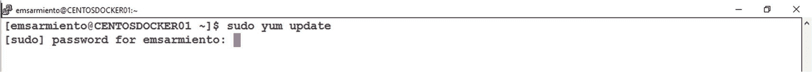
图 3-1
使用 `sudo` 运行 Linux 命令时的密码提示

作为一种安全最佳实践，这就是你在 Linux 中运行命令的方式。

根据你的 CentOS 机器的状态，运行 `yum update` 可能需要你下载所有必要的更新。图 3-2 显示了在系统上安装和升级所有必要软件包的提示。

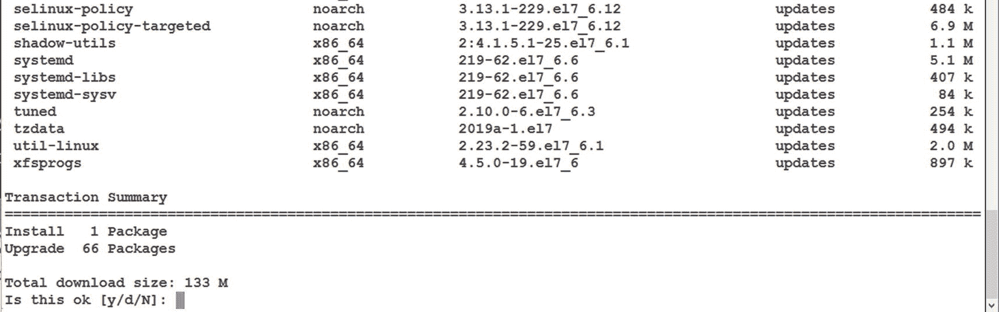
图 3-2
下载所有必要软件包的提示

输入 `y` 以下载并安装所有更新。

### 安装所需的依赖项

我喜欢 Linux 的一点是，使用包管理器会安装你指定的内容，包括所需的依赖项。这种做法减少了磁盘空间需求和潜在的受攻击面。所以，当你有一个像 Docker 这样依赖于其他软件包的软件包时，你需要么手动安装那些其他软件包，要么使用一个能自动安装依赖包的包管理器来安装 Docker。不过，你只需要安装所有软件包一次。

你需要安装 Docker 依赖的几个软件包。这些其他软件包是：

*   `yum-utils`：这更像是 `yum` 命令的一个扩展。它是一套与 `yum` 集成以执行诸如管理仓库、安装调试包、清理包等任务的工具集合。你可以把这看作是“打了激素的” `yum`。
*   `device-mapper-persistent-data`：这个包为 Linux 提供存储虚拟化和抽象能力。Docker 自己的 Device Mapper 存储驱动利用此包的功能进行高级卷和存储管理。`第 5 章` 会更详细地介绍使用 Docker 容器时文件系统如何工作。
*   `lvm2`：LVM2 或逻辑卷管理器包为 Linux 内核提供常见的逻辑卷管理功能，例如 RAID 配置、卷大小调整、卷快照等。可以把它看作是 Windows 的磁盘管理工具在 Linux 上的对应版本。

运行以下每一个 `yum install` 命令来安装所需的依赖项：

```
sudo yum install yum-utils
sudo yum install device-mapper-persistent-data
sudo yum install lvm2
```

如果你和我一样懒，可以运行下面这一条 `yum install` 命令来完成同样的事情：

```
sudo yum install yum-utils device-mapper-persistent-data lvm2
```


## 将 Docker 稳定版仓库添加到您的系统

在 Linux 中，仓库（或称为 repo）是您的机器获取并安装操作系统和应用程序更新的位置。可以将 `yum` 类比为 Apple iTunes，而仓库则类似于 Apple App Store。当您在手机上安装应用时，包管理器会负责定位仓库、安装、更新甚至删除应用。您无需担心应用从何处下载。

但由于您的系统除了预装的软件包外，不了解您想要安装的其他附加软件包，因此您必须定义仓库。这告诉 Linux 在安装过程中去哪里寻找该软件包。

运行以下 `yum-config-manager` 命令，将 Docker 稳定版仓库添加到您的系统：

```
sudo yum-config-manager --add-repo https://download.docker.com/linux/centos/docker-ce.repo
```

图 3-3 展示了从 URL 源下载 `docker-ce.repo` 文件并将其添加到 `/etc/yum.repos.d/` 目录的过程。

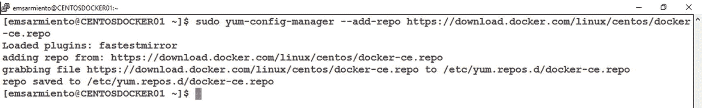

图 3-3
添加 Docker 社区版仓库

如果您好奇 `docker-ce.repo` 文件的内容，可以运行以下 `cat` 命令查看：

```
sudo cat /etc/yum.repos.d/docker-ce.repo
```

图 3-4 展示了 `docker-ce.repo` 文件的内容。它显示了适用于 CentOS Linux 的 Docker CE 软件包的 URL 源。

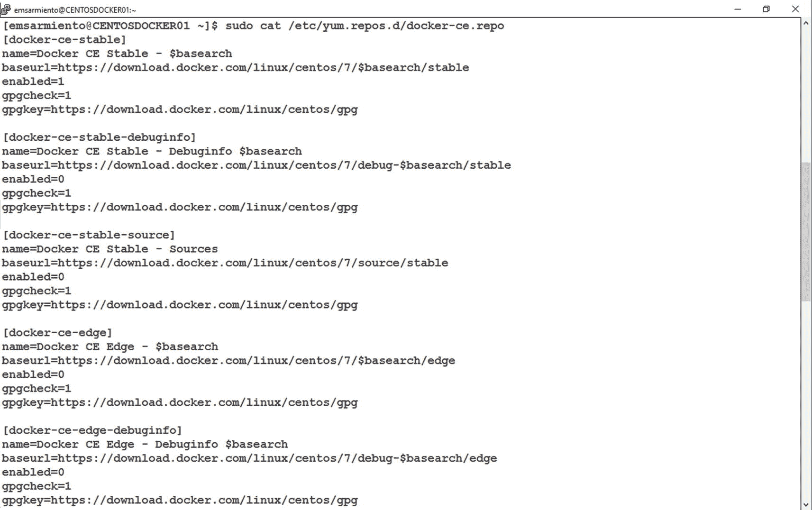

图 3-4
`docker-ce.repo` 文件

注意：您可能想知道为什么我们在 Linux 上使用 Docker CE（社区版），而不是像在 Windows Server 机器上那样使用 Docker EE（企业版）。Docker CE 是 Docker 的免费开源版本，您无需支付许可费或支持费用即可使用。这意味着您可以在 CentOS 这样的开源 Linux 发行版上部署 Docker 容器主机，而无需承担软件相关成本。在 Windows Server 机器上部署 Docker 容器主机则需要 Windows Server 许可证。既然您已经为 Windows Server 许可证付费，微软决定捆绑 Docker EE 而非 Docker CE。

## 安装 Docker CE

更新系统并添加 Docker CE 仓库后，您现在可以安装 Docker CE 软件包了。运行以下命令以下载并安装适用于 CentOS 的 Docker CE 安装包：

```
sudo yum install docker-ce
```

当提示时键入 `y`，从 Docker 仓库下载适用于 CentOS 的 GPG 密钥。

还有一些其他依赖软件包将与 Docker 一同安装。图 3-5 展示了作为安装 Docker 的一部分将要安装的软件包依赖列表。其中两个值得注意的软件包是 `docker-ce-cli`（Docker 客户端命令行界面）和 `containerd.io`（负责管理 Docker 主机上容器的完整生命周期）。

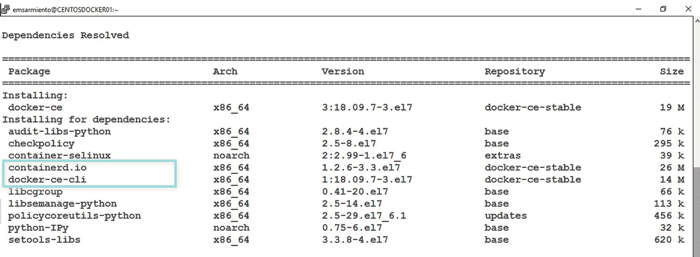

图 3-5
安装 Docker 时的依赖软件包列表

安装过程将在系统上创建一个名为 `docker` 的 Linux 守护进程。默认情况下，`docker` 守护进程是禁用的。运行以下 `systemctl` 命令检查 `docker` 守护进程的状态。图 3-6 显示了安装后 `docker` 守护进程的状态。`Active: inactive (dead)` 的状态一目了然。

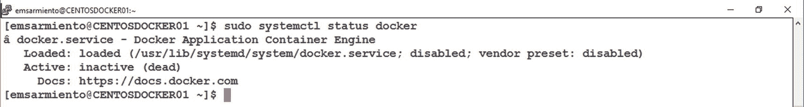

图 3-6
Docker 守护进程的状态

```
sudo systemctl status docker
```

## 启动 Docker 守护进程并设置开机自启

运行以下命令以启动 `docker` 守护进程：

```
sudo systemctl start docker
```

与在 Windows Server 上安装类似，您希望 `docker` 守护进程在服务器重启时自动启动。运行以下命令，使 `docker` 守护进程在服务器启动或重启时自动启动：

```
sudo systemctl enable docker
```

这次，当您重新运行相同的命令来检查状态时，您会看到 `Active: active (running)` 的状态。图 3-7 显示了带有部分日志的 `docker` 守护进程状态。

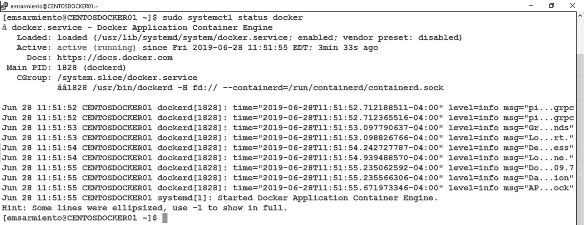

图 3-7
带有日志的 Docker 守护进程状态

我们将 Docker 安装的验证留待后续进行。

## 在 Ubuntu Linux 上安装 Docker

如果您决定在 Ubuntu 机器上安装 Docker，本节将概述该过程。虽然不同 Linux 发行版使用的命令有些差异，但过程是相似的。

### 更新 Ubuntu 系统软件包

如果 CentOS 使用 `yum` 进行包管理，那么基于 Debian 的 Linux 发行版（如 Ubuntu）则使用 `apt-get`。在安装 Docker 和其他依赖软件包之前，您需要更新系统。运行以下命令以更新您的 Ubuntu 系统：

```
sudo apt-get update
```

下一个命令是安装系统上当前已安装所有软件包的最新版本：

```
sudo apt-get upgrade
```

我第一次运行这两个命令时也有点困惑。也许您当时也有和我一样的疑问：*update 和 upgrade 有什么区别？* `apt-get update` 命令实际上并不安装系统上已安装软件包的新版本。它只是更新软件包信息，以便系统知道哪些需要升级。这就像在打电话验证新信息之前，先用新的号码和地址更新您的手机通讯录。由于软件包及其依赖关系可能会随时间变化——可能是因为错误修复、安全更新，甚至是元数据更改——您的系统可能会尝试下载一个已不存在或已移动到不同位置的软件包。`apt-get upgrade` 命令才是执行将所有系统上安装的软件包升级到其最新版本这一实际操作的命令。如果因为软件包依赖而需要新的软件包，它们也会被安装。这就是为什么在执行 `apt-get upgrade` 之前应该始终先执行 `apt-get update`。

### 安装通过 HTTPS 连接仓库所需的依赖项

与 CentOS 类似，您需要安装 Docker 所依赖的几个软件包。这些包用于通过 HTTPS 连接到仓库。

- `apt-transport-https`: Ubuntu 使用此包允许 `apt-get` 通过 HTTPS 下载软件包。
- `ca-certificates`: 此软件包包含一个公共证书颁发机构列表，也与 `apt-transport-https` 结合使用。
- `curl`: Client URL Request Library 的缩写，一个使用 URL 语法获取或发送文件的工具。我主要用它来从互联网下载文件，比如软件包的仓库文件。
- `gnupg-agent`: 用于管理机密（或私钥）。您需要在系统上添加 Docker 的官方 GPG 密钥，这需要妥善处理。
- `software-properties-common`: 一个用于管理软件包源的工具。没有它，您将不得不手动在系统上添加和/或删除软件包仓库。

运行以下命令以安装所需的依赖项：

```
sudo apt-get install apt-transport-https ca-certificates curl gnupg-agent software-properties-common
```

如果并非所有软件包都会被安装，请不要惊讶。其中一些可能已经通过 `apt-get upgrade` 命令更新过了。


### 添加 Docker 官方 GPG 密钥

在安装前验证软件包的完整性是确保其确实为开发者原始分发版本的方法之一。您当然不希望下载到被恶意修改并重新分发的文件。当然，这假设开发者已对软件包进行签名并提供了公钥。

大多数 Linux 软件包通过验证其 GPG 密钥来确认完整性。Docker 创建了他们自己的 GPG 密钥，用于签名其软件包，因此您可以在安装前验证其完整性。

使用以下 `curl` 命令将 Docker 官方 GPG 密钥下载并添加到 Ubuntu 系统中：

```
curl -fsSL https://download.docker.com/linux/ubuntu/gpg | sudo apt-key add -
```

通过管道操作符，`curl` 命令的输出被传递给 `apt-key` 命令，以将下载的密钥添加到系统的受信任密钥列表中。

您直接接受该密钥而不验证其是否确实来自 Docker 原始密钥是没有意义的。这就是指纹发挥作用的地方。Docker 在其文档中提供了指纹，以便您使用下载的密钥进行验证：

```
9DC8 5822 9FC7 DD38 854A E2D8 8D81 803C 0EBF CD88
```

您可以使用以下 `apt-key` 命令验证指纹，传入不带空格的指纹值。图 3-8 显示了您传递的指纹所匹配的密钥。

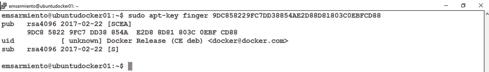

图 3-8：显示 Docker GPG 密钥指纹

```
sudo apt-key finger 9DC858229FC7DD38854AE2D88D81803C0EBFCD88
```

### 将 Docker 稳定仓库添加到您的系统

与 CentOS 类似，您需要将 Docker 稳定仓库添加到您的 Ubuntu 系统中。使用以下 `add-apt-repository` 命令执行此操作。命令中附加了 `-cs` 参数的 `lsb_release` 命令会显示包含代号短格式的 Linux 标准基（LSB）信息。在本例的 Ubuntu 发行版中，它是 `xenial`。

```
sudo add-apt-repository "deb [arch=amd64] https://download.docker.com/linux/ubuntu $(lsb_release -cs) stable"
```

此命令会将信息添加到 `/etc/apt/sources.list` 文件中。您可以通过使用以下 `cat` 命令显示 `/etc/apt/sources.list` 的内容来验证这一点。图 3-9 显示了用于 Ubuntu 的 Docker CE 软件包仓库的 URL 源。

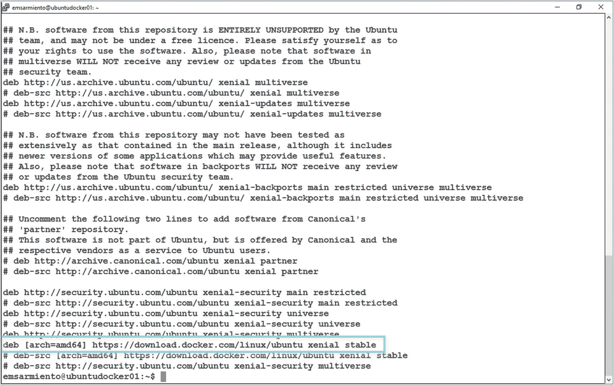

图 3-9：已添加到 /etc/apt/sources.list 的 Docker CE 仓库

```
sudo cat /etc/apt/sources.list
```

由于您通过安装额外的软件包并添加 Docker CE 仓库对 Ubuntu 系统进行了修改，因此您需要重新运行 `apt-get update` 命令：

```
sudo apt-get update
```

现在，您已准备好安装 Docker CE 软件包。

### 安装 Docker CE

CentOS 使用 `yum install` 下载并安装 Docker CE 软件包，而 Ubuntu 使用 `apt-get install`。

```
sudo apt-get install docker-ce
```

出现提示时输入 `y` 继续。就像在 CentOS 上安装 Docker CE 一样，其他软件包依赖项将与 `docker` 一起安装，包括 `docker-ce-cli` 和 `containerd.io`，如图 3-10 所示。

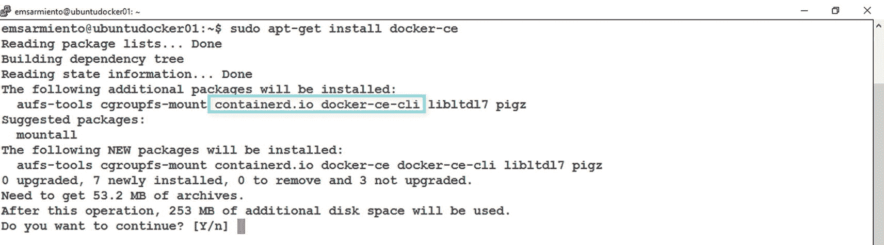

图 3-10：安装 Docker 时的依赖软件包列表

与 CentOS 不同，您无需手动配置 Docker 守护进程以在服务器启动时启动和启用。这作为安装过程的一部分已为您完成。

### 验证 Docker 引擎安装

现在 Docker CE 已安装在您的 Linux 机器上，其操作与任何操作系统基本相同。Docker 命令行界面和 Docker 命令在所有平台上都是相同的。您可以运行以下命令检查服务器上安装的 Docker 版本：

```
sudo docker version
```

图 3-11 显示了该命令在 Ubuntu 机器和 CentOS 机器上的并排输出，显示了 Docker 客户端和 Docker 引擎的版本。我使用了命令 `cat /etc/os-release | grep PRETTY_NAME` 来显示 Linux 发行版的友好名称。如您所见，版本是相同的。

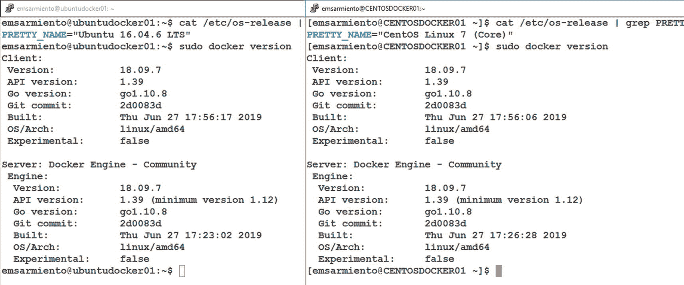

图 3-11：显示 Docker 客户端和 Docker 引擎的版本

不要在 Linux 上不加 `sudo` 运行 `docker` 命令。通常，从 Windows 平台转来的管理员会将他们的实践和思维方式带入 Linux 世界。然后他们疑惑为什么某些东西不工作。不带 `sudo` 运行 `docker version` 将返回错误消息，如图 3-12 所示。

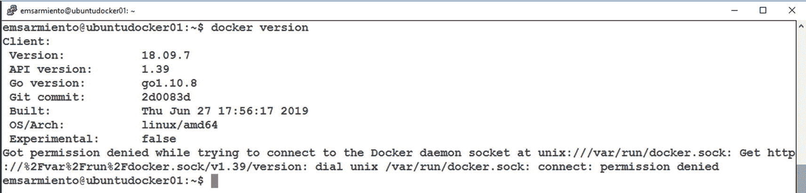

图 3-12：不带 sudo 运行 Docker 命令

您肯定不想最终像这样排查一个自认为的安装问题，花费数小时试图找出问题所在，结果却发现只是没有使用提升的权限运行命令。

运行以下命令以显示有关服务器上 Docker 安装的系统级信息。图 3-13 显示了该命令的输出。显然，Linux 系统提供的信息比 Windows 系统多得多。

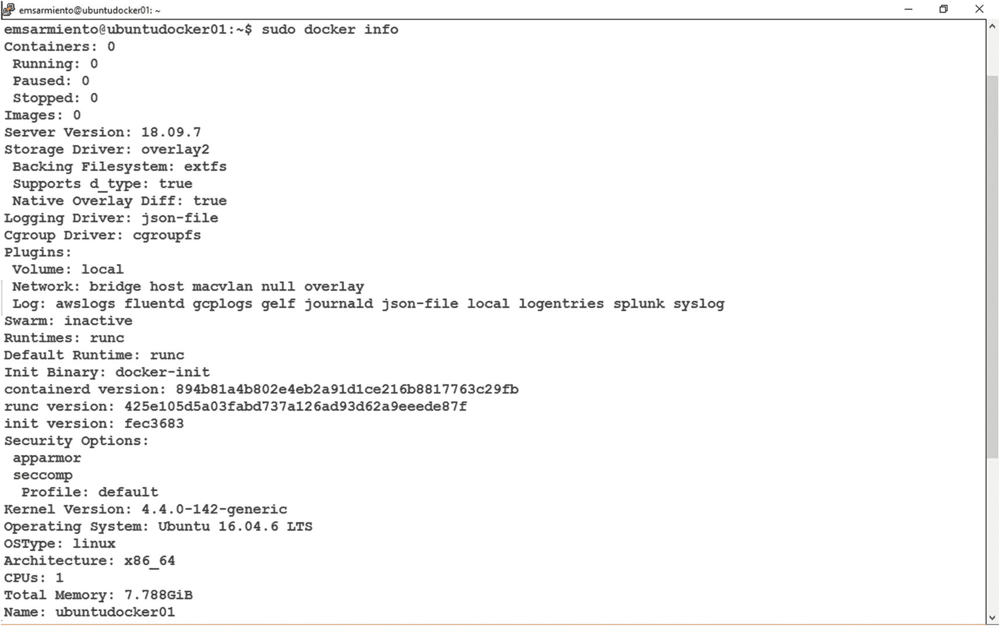

图 3-13：显示 Docker 安装的系统级信息

```
sudo docker info
```

您现在拥有一个在 Linux 上运行的、功能齐全的 Docker 容器主机。对于一个刚刚开始使用 Linux 的人来说，这已经很不错了。


## 摆脱 sudo？

积习难改（不，这不是下一部布鲁斯·威利斯电影的片名）。由于我职业生涯的大部分时间都在与 Windows 打交道，以至于每次在 Linux 上运行命令时，我仍然会忘记使用 `sudo`。我相信你也会这样。还记得图 3-12 中的错误信息吗？它可能很烦人。然而，避免使用 `root` 登录，并在你运行的每条命令中始终使用 `sudo`，是一个良好的安全实践。

不过，既然你刚开始接触 Linux，我就给你一个临时通行证来绕过这个小小的烦恼。不，我不会允许你通过 `root` 登录来逃避——这在我的书里是致命的原罪。我只允许你**暂时**在运行 `docker` 命令时不用 `sudo`。

**注意**
你需要使用 `sudo` 运行 `docker` 命令的原因在于，docker 守护进程绑定到的是一个 Unix 套接字，而不是一个 TCP/IP 端口（Unix 套接字通过消除 TCP/IP 所需的一些检查和操作——如路由——使得同一台机器内的进程间通信更快）。默认情况下，`root` 用户拥有该 Unix 套接字，其他用户访问它的唯一方式就是使用 `sudo`。这就是为什么 docker 守护进程总是以 `root` 身份运行。

要在不使用 `sudo` 的情况下运行 `docker` 命令，你需要：
1.  创建一个名为 `docker` 的组
2.  将你的用户账户添加到该组中

当 docker 守护进程启动时，`docker` 组的成员将能够访问 Unix 套接字。这就像旧版本 SQL Server 中的 `SQLServerMSSQLUser$instancename` 本地 Windows 组——该组的成员有权访问 SQL Server 服务。

运行以下 `groupadd` 命令来创建一个名为 `docker` 的组：
```
sudo groupadd docker
```
如果 `docker` 组已经存在，你会收到类似图 3-14 中的信息。
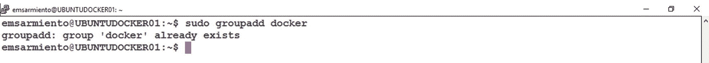
图 3-14 创建名为 docker 的组

如果是这种情况，请继续将你的用户账户添加到 `docker` 组。运行以下 `usermod` 命令来执行此操作：
```
sudo usermod -aG docker $USER
```
`-a` 参数用于将用户追加（或添加）到一个组（后面跟着 `G` 参数）。`$USER` 环境变量代表当前登录的用户（也就是你）。
就像在 Windows 中一样，你必须注销并重新登录才能使更改生效。然后，你就可以重新运行 `docker version` 和 `docker info` 命令，而无需使用 `sudo`。图 3-15 显示了使用我添加到 `docker` 组的用户账户运行 `docker info` 命令的输出。
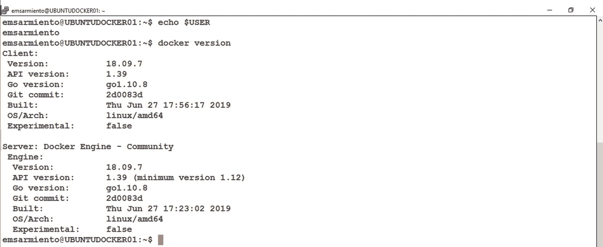
图 3-15 无需 sudo 运行 docker 命令

**警告**
请注意——安全是严肃的事情，我不会掉以轻心。只有受信任的用户，如管理员，才应该被添加到 `docker` 组。该组的任何成员都有权限控制 docker 守护进程。这意味着将某人添加到这个组，相当于授予他们永久的、无需密码保护的 `root` 访问权限。这比 `SQLServerMSSQLUser$instancename` 本地 Windows 组的权限更危险，因为它拥有 `root` 访问权限。很可怕，不是吗？
请务必阅读关于 Docker 安全的文档，特别是关于 `Docker 守护进程攻击面` 的部分，网址是 [`docs.docker.com/engine/security/security/`](https://docs.docker.com/engine/security/security/)。
并且别忘了记录所有添加到此组的用户，以便你跟踪成员是谁。

## 本章小结

本章带你逐步完成了将 CentOS 和 Ubuntu Linux 安装和配置为 Docker 容器主机的过程。它还向你介绍了一些基本的 Linux 命令，这些是你开始使用 Linux 和安装 Docker 所需的。下一章将全部关于 Docker 生态系统、构成其运作的不同组件以及它们如何协同工作。

