# 4. Docker 生态系统

> *相互依存应当与自给自足一样，成为人类的理想。*
>
> ——圣雄甘地

我一直对飞机着迷。小时候，我想成为一名飞行员环游世界。也许是前往新地方的兴奋感，或者是弄清楚复杂系统如何工作的挑战感。或者两者兼而有之。

在 2008 年感恩节等待登机时，我不禁想知道整个飞行旅行体验有多么复杂。如果你以前乘坐过商业航班，你就会明白我在说什么。当你在柜台办理登机手续时，航空公司的工作人员会递给你一张登机牌，并给你的行李贴上标签，以便它能送达最终目的地。你的登机牌上有航班的详细信息——登机口信息、座位分配、登机和起飞时间、乘客详情等。飞机将被分配一个登机口供乘客前往并登机。当你准备登机时，登机口工作人员会根据你的登机牌核对你的身份。当飞机即将离开登机口时，飞行员会检查他们的飞行数据计划，并核实其是否符合空中交通管制员的指示。如果一切按计划进行，飞机将离开登机口，飞往目的地（一位地勤人员在等待我们延误的航班时，好心分享了这些信息）。

每一个复杂的系统都是由协同工作的不同部分组成的。如果你只是产品或服务的消费者（比如航班服务），不知道其运作的复杂细节也没关系。你只需要知道足够多关于如何正确使用它的知识即可。但是，如果你将负责交付该产品或服务的一部分，那么无论是为了你自己还是使用它的人，你都有责任去理解它是如何工作的，特别是你负责的那一部分。

本章的目标是让你熟悉 Docker 这个复杂的系统。为了实现这个目标，我将向你介绍构成整个生态系统的不同组件，同时，介绍开始使用 Docker 所需的最常用命令。所以，准备好进行一次更偏向于“动手敲代码”的学习之旅吧。

**注意**
本章涵盖的示例命令将在 Windows PowerShell 命令行 shell 或 Linux 安全 shell（CentOS 或 Ubuntu）中展示，且不包含 `sudo` 命令（请参阅第 3 章中“摆脱 sudo？”部分）。这是为了说明 `docker` 命令的互操作性。但这并不意味着我允许你忽视在 Windows Server 和 Linux 服务器操作系统上运行命令的安全实践。记住，在 Linux 上，只有 `docker` 命令可以不用 `sudo` 运行。所有其他需要提升权限的命令仍然需要 `sudo`。


## 你好世界：Docker 版

我相信你在学习计算机编程语言时，都有过编写“hello world”的经历。我第一次接触“hello world”是在二十多年前，当时我在大学二年级，第一次学习计算机编程。我多希望那能说是我编程之旅的开端（我之所以能通过那门课，唯一原因是我最好的朋友帮我写了期末项目）。但它确实让我明白了“hello world”是什么以及它的用途——它是检验操作者是否知道如何使用该语言的一个测试。难怪每种编程语言都从显示“hello world”作为标准输出开始。

Docker 也不例外。虽然它并非真正的编程语言，但他们也采纳了“hello world”这个概念，并提出了自己的版本。但在我看来，他们创造自己版本“hello world”的方式极其出色。它不仅仅是在屏幕上显示一条简单的“hello world”信息，其版本还让你了解到 Docker 是如何工作的。在你的 Linux 系统上，运行以下命令看看我的意思：

```
docker run hello-world
```

图 4-1 展示了 Docker 版本的“hello world”。很精彩，不是吗？

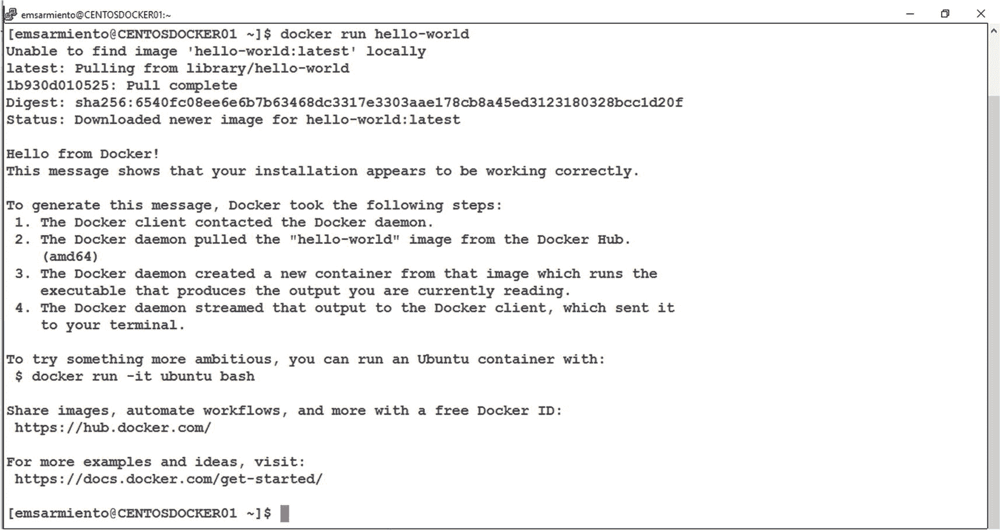

图 4-1

你好世界：Docker 版

不幸的是，同样的命令——`docker run hello-world`——在 Windows Server 2016 上的 Docker 中不再有效。这与命令无关，而完全与容器镜像的版本有关，我们将在后面的章节中介绍。即使你遵循 Docker 官方文档在 Windows Server 上安装 Docker Enterprise，运行相同的命令仍然会返回类似图 4-2 的信息。

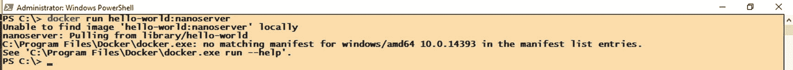

图 4-2

在 Windows Server 上运行“你好世界：Docker 版”

这是因为引入了微软的半年度通道（SAC）服务模型。用于构建微软版 Docker `hello-world`容器镜像的镜像已被 Windows Server 2016 弃用（请参考[`github.com/docker/for-win/issues/3775`](https://github.com/docker/for-win/issues/3775)）。别让我开始谈论这个服务模型让企业感到多么困惑。

为了获得与在 Linux 上运行的容器镜像相同的输出，请改用以下命令运行。注意标签的使用，这是一个专门定义使用哪个镜像来运行容器的标记。标签的用法将在后面的章节中更详细地介绍。

```
docker run hello-world:nanoserver-sac2016
```

图 4-3 展示了在 Windows Server 2016 上 Docker 版“hello world”的输出。如果 Windows Server 镜像的下载时间比 Linux 镜像长很多，不必惊讶。

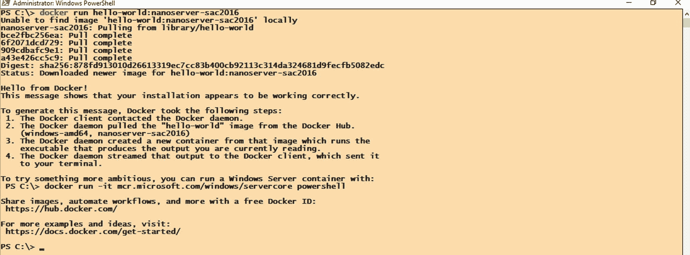

图 4-3

在 Windows Server 上成功运行的“你好世界：Docker 版”

除了你在前面章节中运行的 `docker version` 和 `docker info` 命令的输出之外，如果你得到了这个结果，就可以保证 Docker 在你的系统上正常工作。你通过了简单的完整性检查。但这并非本章的目标。让我们看看 Docker“hello world”的输出，以理解 Docker 的工作原理，并识别构成这个复杂系统的不同组件。

## Docker 如何运行容器

你运行的 `docker run hello-world` 命令是如何运行 Docker 容器的一个非常简单的例子。Docker 版的“hello world”解释了 Docker 实际是如何做到的。图 4-4 说明了运行 Docker 容器所涉及的流程。

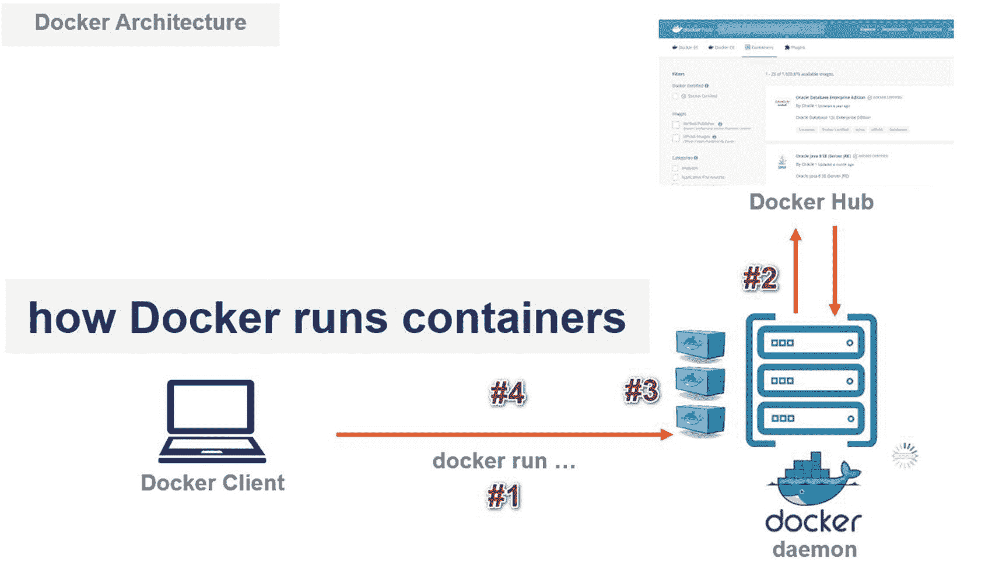

图 4-4

Docker 如何运行容器

以下是 Docker 运行容器的流程说明。此处使用 `hello-world` 容器为例，但无论什么容器，流程都是一样的。

1.  你从 Docker CLI 客户端运行 `docker run hello-world` 命令。
2.  Docker CLI 客户端向 Docker 守护进程发起 API 调用。在本例中，它传递 `run` 子命令，以 `hello-world` 容器镜像为模板来运行一个新容器（输出中的#1）。
3.  Docker 守护进程收到运行容器的请求后，首先检查其本地文件系统中是否已有 `hello-world` 容器镜像的本地副本。由于这是一个全新的安装，没有可用的本地镜像副本。
4.  因为没有 `hello-world` 容器镜像的本地副本，Docker 守护进程从 Docker Hub——一个公共的容器镜像仓库——搜索并拉取该镜像（输出中的#2）。
5.  下载完成后，Docker 守护进程基于 `hello-world` 镜像创建并运行了一个新容器（输出中的#3）。
6.  `hello-world` 容器完成其需要执行的任务后，容器退出或进入 `已停止` 状态（输出中的#4）。

现在你明白为什么我认为这个“hello world”例子很出色了吧。Docker 在他们的“hello world”版本中打包了如此多的信息，如果你能提出正确的问题，它真的能让你了解很多关于 Docker 如何工作以及其生态系统组成的细节。

## Docker 生态系统

我在前一节中使用了几个名称、术语和关键词来描述 Docker 如何运行一个简单的容器。但我还没有定义这些术语，所以我会在接下来的章节中做这件事。

### Docker CLI

让我们从你在图 4-4 输出#1 中可以推断出的内容开始：什么是 Docker CLI？Docker CLI（命令行界面）是你与 Docker 守护进程交互的入口。Docker 命令通过 Docker CLI 客户端执行并发送给 Docker 守护进程。你可以把它想象成 SQL Server 查询分析器（我希望微软能重新带来这个轻量级工具）或 SQL Server Management Studio。默认情况下，它与 Docker 守护进程一起安装在机器上。你在前面章节中运行的所有 `docker` 命令，从 Docker 主机的角度看，都是在本地执行的。在 Windows Server 机器上，你通过远程桌面登录，打开 Windows PowerShell，并运行了 `docker` 命令——这是在本地运行的。在 Linux 机器上，你发起了 SSH 会话进行远程连接，但一旦登录后，你就在本地运行了 `docker` 命令。这是我们在本书中将采用的方法。然而，没有人阻止你配置 Docker CLI 客户端以连接到远程 Docker 主机，这类似于在你的 Windows 客户端工作站上安装 SQL Server Management Studio 并连接到远程 SQL Server 实例。

### Docker 守护进程

Docker 守护进程（在 Windows 中是服务）是一个客户端-服务器应用程序，也是负责创建和运行 Docker 对象的运行时引擎。它是你与 Docker 交互的中心，也是开始了解 Docker 生态系统所有活动组件的最佳起点。你可以把它想象成 SQL Server 关系数据库引擎。Docker 守护进程通过 REST API 与 Docker CLI 客户端交互。由于默认安装将 Docker CLI 客户端与 Docker 守护进程安装在同一台机器上，Docker 引擎通常被认为拥有这三大主要组件——Docker 守护进程、REST API 和 Docker CLI 客户端。


## Docker 命令

`docker` 命令是通过 Docker CLI 客户端与 Docker 守护进程交互的基础命令。要执行 Docker 管理任务，你需要使用子命令或管理命令及其相应参数。探索所有不同子命令或管理命令的一个好方法是运行 `docker` 或 `docker help` 命令。图 4-5 显示了所有可用的选项和命令。完整的 docker 命令列表可在 Docker 文档 [*https://docs.docker.com/engine/reference/commandline/docker/*](https://docs.docker.com/engine/reference/commandline/docker/) 中找到。

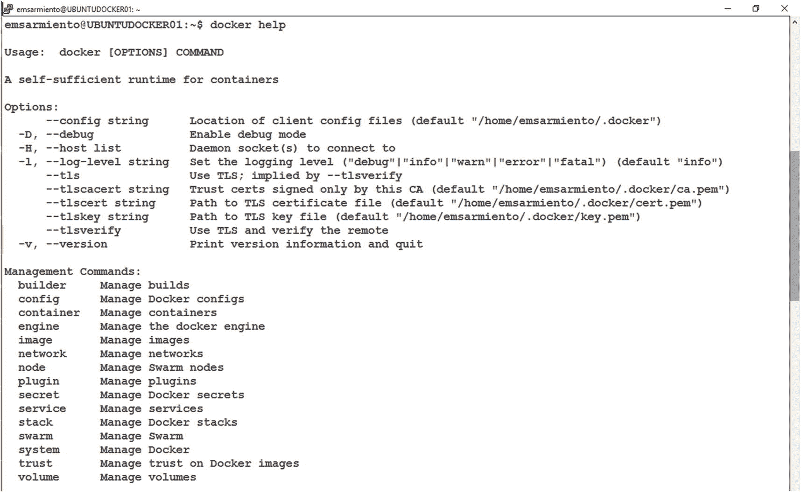
*图 4-5：显示所有可用的 Docker 选项和命令*

你已经使用过其中一些命令，例如 `docker run`、`docker version` 和 `docker info`。

不要操之过急。我们将在本书中使用其中几个选项和命令来执行 Docker 管理任务。

## Docker 镜像与容器

我第一次看到 *Docker 镜像* 这个术语时感到困惑，因为它通常与 *Docker 容器* 一起出现。我来帮你避免可能由这种混淆带来的麻烦。

Docker 镜像是用于创建应用程序容器的静态、*只读* 模板。它是运行应用程序所需的各种组件的非运行时表示。而 Docker 容器则是该镜像的一个运行时实例。当你运行 `docker run hello-world` 命令时，`hello-world` 就是 Docker 镜像的名称。你可以将 Docker 镜像想象成一个蓝图，就像汽车的工艺图。你根据想要的汽车（Docker 容器）外观和功能来创建蓝图（Docker 镜像）。蓝图确定后，你就可以基于它创建任意多份汽车实例。你可以自由更改汽车的外观——颜色、配件、内饰等——而无需修改蓝图。如果你决定对汽车进行重大修改，就必须回到绘图板重绘蓝图。

这只是一个关于 Docker 容器和 Docker 镜像是什么的概述，足以让你开始理解 Docker 生态系统的组成部分。*第* *5* *章* 将深入探讨它们的内部原理以及它们如何在文件系统中存储。

## Docker Hub

Docker Hub 是一个容器注册中心。它是 Docker, Inc. 提供的一个基于云的公共仓库，用于创建、测试、存储和分发 Docker 镜像。可以将其视为 Docker 镜像的 Apple App Store 或 Google Play 商店。Docker Hub 提供多项服务和功能：

*   *仓库*：你可以在此存储 Docker 镜像，无论是私有还是公共使用。
*   *团队和组织*：这是一种管理对仓库中存储的 Docker 镜像的权限和访问方式。你可以创建团队并分配用户，也可以创建一个包含团队和不同仓库的组织。
*   *官方镜像*：这是一组托管在 Docker Hub 上的精选 Docker 仓库，用于提供基础操作系统镜像、流行编程语言和平台的即用型镜像，以及如何使用它们的最佳实践参考。这些镜像存储在顶级仓库中（更多内容见“Docker 镜像命名惯例”部分），可以安全地假设它们来自可靠和值得信赖的来源。
*   *发布者镜像*：Docker Hub 托管来自软件供应商的 Docker 镜像，如 Microsoft、Oracle、Red Hat、IBM 等。这些镜像由相应供应商维护和支持。我们将在后面章节中使用的 Linux 上的 SQL Server 和 Windows 上的 SQL Server 容器就是发布者镜像的例子。
*   *构建*：这允许你从 Git 仓库（如 GitHub、GitLab 和 Bitbucket）自动构建并上传 Docker 镜像。
*   *Webhook*：这允许你通过自动化与其他服务集成，例如在成功上传 Docker 镜像到 Docker Hub 时触发自动化服务器。

Docker Hub 可通过 [*https://hub.docker.com/*](https://hub.docker.com/) 访问，并且是 Docker 引擎用于搜索、推送或拉取 Docker 镜像的默认容器注册中心。如果你想搜索要使用的特定 Docker 镜像，这是你的第一站。图 4-6 显示了在 Docker Hub 上搜索 SQL Server 的结果。

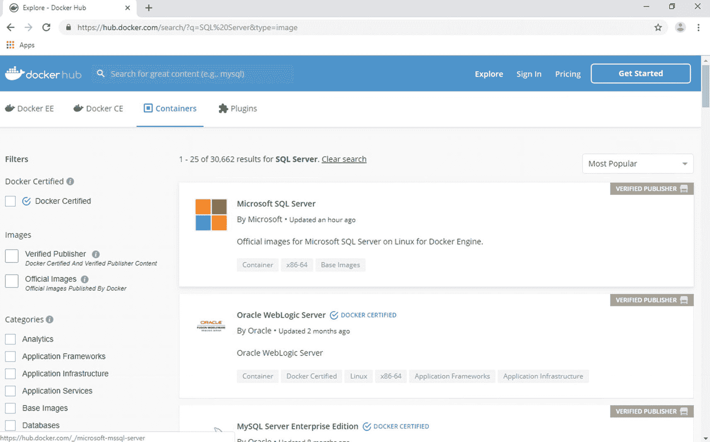
*图 4-6：在 Docker Hub 上搜索 SQL Server 的结果*

除了 Docker Hub，你还可以使用其他可用的公共容器注册中心。更流行的是来自主要云提供商的注册中心，如 Amazon Elastic Container Registry (ECR)、Microsoft Container Registry (MCR) 和 Google Container Registry (GCR)。你可以让 Docker 覆盖默认配置，与不同的公共容器注册中心一起工作。后面章节将展示一个例子。如果你不想使用公共容器注册中心，你可以在本地部署自己的私有容器注册中心。

与容器注册中心相关的一个术语是 *pull*（拉取）。Pull 只是下载的一个花哨说法。当 Docker 守护进程拉取了 `hello-world` 镜像时，只是意味着它从 Docker Hub 下载了该镜像并放入其本地文件系统。伴随着拉取（pull）这个词的是它的对应词——*push*（推送）。同样，这只是上传的一个花哨说法。

由于 Docker Hub 是一个公共仓库，你无需创建 Docker ID 即可拉取可用的 Docker 镜像。但是，如果你决定将自己定制的 Docker 镜像推送到 Docker Hub，你需要注册一个 Docker ID（如果你超出免费套餐，还需要准备好信用卡信息）。


## 探索 Docker Hub

我确实提到过，如果你打算使用特定的 Docker 镜像，Docker Hub 是你的第一站。但是，在你运行 Docker 版的“hello world”的输出中，你并没有看到网页浏览器打开、在 Docker Hub 上搜索 `hello-world` 镜像并发起拉取操作。此外，Linux 上没有图形用户界面。那么，你如何探索 Docker Hub 上有哪些可用的镜像呢？使用 `docker search` 命令，并为其传递适当的搜索词和参数。例如，如果你想在 Docker Hub 上搜索所有名称包含“microsoft”的镜像，可以运行以下命令，如图 4-7 所示：

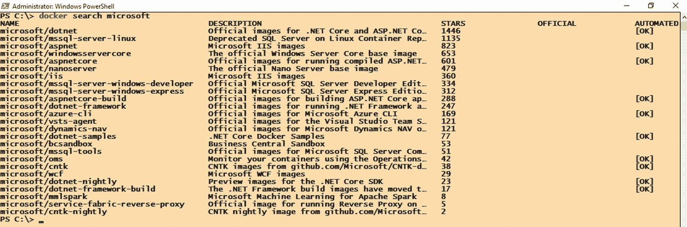

图 4-7

名称包含 microsoft 的 Docker 镜像的搜索结果

```
docker search microsoft
```

命令结果根据“星标”（stars）或流行度排序。从排名来看，Linux 上的 SQL Server 镜像似乎比 Windows 上的 ASP.NET Core 镜像更受欢迎，考虑到 .NET Core 比 SQL Server on Linux 早一年发布。

我希望 `docker search` 命令能像 Docker Hub 网站一样功能丰富，在那里我可以按发布者名称、是否是 Docker 认证镜像、或是 Windows 或 Linux 容器来搜索。但这不应阻止你利用 PowerShell 或 Linux 脚本超能力来操作和进一步过滤 `docker search` 得到的结果。假设你只想列出所有 SQL Server 特定的镜像。由于 `docker search` 命令的结果是一系列文本流，你可以使用 `Select-String` PowerShell cmdlet 来查找特定的字符串值。在你的 Windows Server 主机上运行以下 `docker search` 命令，使用 PowerShell 管道符与 `Select-String` cmdlet 来过滤结果，筛选出任何包含“sql”的项。图 4-8 显示了名称包含“microsoft”的所有 Docker 镜像，经过滤后只显示那些包含“sql”的。作为 SQL Server DBA，这些才是我们更感兴趣的。

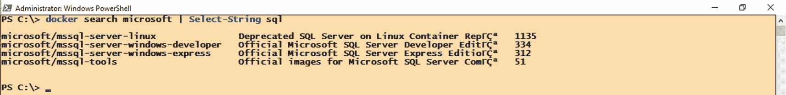

图 4-8

在 Windows 上，名称包含 microsoft 和 sql 的 Docker 镜像的搜索结果

```
docker search microsoft | Select-String sql
```

在 Linux 上，你可以使用 `grep` 命令实现相同的效果，如图 4-9 所示。

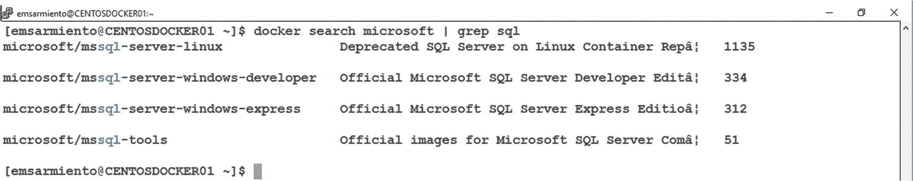

图 4-9

在 Linux 上，名称包含 microsoft 和 sql 的 Docker 镜像的搜索结果

```
docker search microsoft | grep sql
```

提示

这时你需要谨慎注意你工作的环境——Windows 还是 Linux。请记住，容器虚拟化的是底层操作系统。与其他只有 Linux 镜像在 Docker Hub 上可用的关系数据库管理系统不同，SQL Server 同时在 Windows 和 Linux 上可用。你肯定不想犯这样的错误：在 Windows Server 主机上拉取并运行一个 Linux 上的 SQL Server 镜像，反之亦然。这行不通。

## Docker 镜像命名约定

你可能已经迫不及待想在容器上使用 SQL Server 了，但请稍等片刻。我们很快就讲到。让我们先看看容器命名约定，因为在搜索、拉取、构建甚至推送 Docker 镜像时，这有助于你为成功做好准备。

与使用 SQL Server 类似，在安装过程中已经为你提供了一些默认的 Docker 配置设置。例如，默认的容器注册表就是 Docker Hub。当你运行 `docker run` 命令来执行 Docker 版的“hello world”时，你无需提供注册表名称。它直接使用了 Docker Hub。你可以选择使用其他公共容器注册表。但要做到这一点，你需要了解使用 Docker 镜像时所采用的命名约定。

Docker 镜像使用标准的命名约定进行引用。这是为了给使用镜像的用户提供可预测性。标准命名约定类似于 GitHub 仓库名称，使用以下格式：

`REGISTRY[:PORT]/REPO/IMAGE[:TAG]`

镜像名称由斜杠分隔的名称组件组成，前面可选择性地加上注册表主机名。注册表主机名必须符合标准 DNS 规则。如果未提供注册表主机名，则默认为 Docker Hub。Docker Hub 的完全限定主机名是 [`https://index.docker.io`](https://index.docker.io) 或简写为 `docker.io`。你可以在运行 `docker info` 时看到 `Registry:` 字段中显示此信息，如图 4-10 所示。

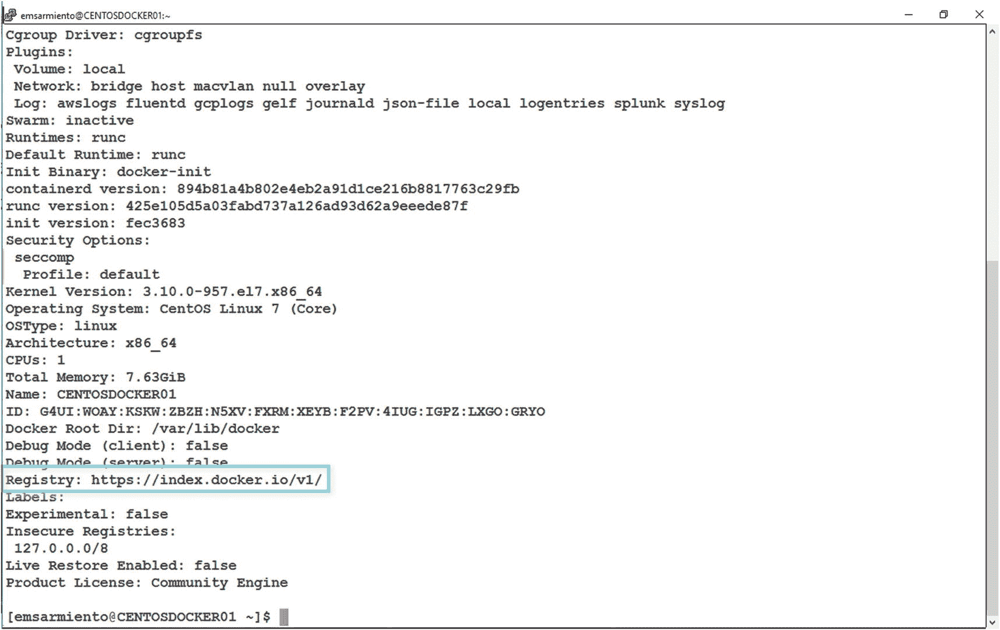

图 4-10

Docker Hub 的完全限定 DNS 主机名

你可以在 `docker` 命令中使用除 Docker Hub 以外的任何可用公共容器注册表及其对应的注册表主机名。以下是一些你可以选择的列表。具体用法取决于公共容器注册表的访问方式。

*   `Microsoft 容器注册表 (MCR)`：mcr.microsoft.com
*   `Amazon 弹性容器注册表 (ECR)`：dkr.<region>.amazonaws.com
*   `Google 容器注册表 (GCR)`：gcr.io

注册表主机名之后是仓库（简称 repo）名称。仓库结构取决于镜像在容器注册表上的存储方式。由于许多软件供应商使用 Docker Hub 作为公共容器注册表，一级仓库名称是软件公司的名称。例如，`docker.io/microsoft` 是 Docker Hub 上 Microsoft 的官方仓库。

接下来是镜像名称，它用于标识 Docker 镜像的内容。查看图 4-7 中 `docker search` 命令的结果，你可以看到以下内容：

*   `mssql-server-linux` 是包含 Linux 上 SQL Server 的镜像。
*   `windowsservercore` 是官方的 Windows Server Core 基础镜像。
*   `mssql-server-windows-express` 是包含 Windows 上 SQL Server Express 版的镜像。

但考虑到 SQL Server 现在拥有的众多版本、版本级别和操作系统组合——即使排除早于 SQL Server 2016 的版本——仅依赖镜像名称是不够的。如果你需要一个在 Windows Server 2016 上运行 SQL Server 2017 并安装了累积更新 5 的 Docker 镜像呢？

这就是 `标签` 发挥作用的地方。标签进一步标识 Docker 镜像的内容，并在可能的情况下提供额外的详细信息。当你运行容器或从仓库拉取镜像时，如果没有提供标签，Docker 会默认你想要带有 `latest` 标签的镜像，并假设该镜像存在。参考你在 Linux 上运行的 `docker run` 命令：

```
docker run hello-world
```

这等同于运行命令 `docker run hello-world:latest`，因为你没有在镜像名称后提供标签，而在 Windows 上运行的 `docker run` 命令在镜像名称中带有标签。


```
docker run hello-world:nanoserver-sac2016
```

这是因为带有 `latest` 标签的 `hello-world` Windows 容器镜像已不复存在——因此，才有了图 4-2 中先前的错误消息。

## Docker 镜像标签与命名约定

如你所见，标签使用户能更方便地进一步识别 Docker 镜像。当你开始创建自己的自定义镜像时，这一点变得尤为重要。你需要为用户提供尽可能多的信息，以便他们识别出所需的正确镜像。关于可用于 Linux 上的 SQL Server 镜像的可用标签列表，请参考图 4-11，该列表可在 [`https://hub.docker.com/_/microsoft-mssql-server`](https://hub.docker.com/_/microsoft-mssql-server) 获取。

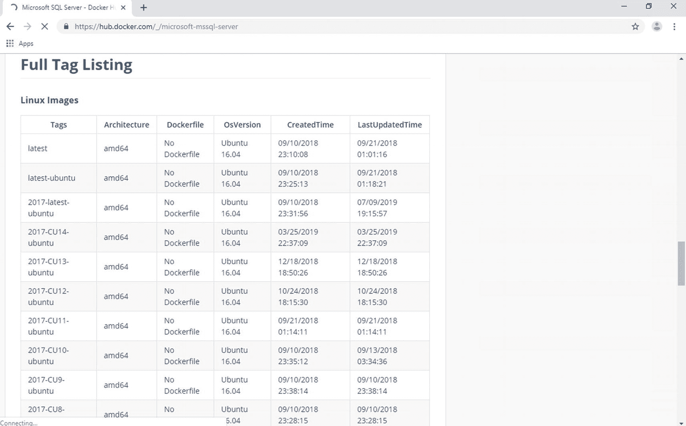
*图 4-11. Linux 上 SQL Server 镜像的可用标签*

**提示**

你需要指定标签的另一个原因是，你永远无法确定从公共容器注册表实际获取的 `latest` 镜像是什么。如果你查看图 4-11 中 Linux 上 SQL Server 镜像的标签，带有 `latest` 标签的镜像显示的 `LastUpdatedTime` 是 `09/21/2018 01:01:16`。然而，带有 `2017-latest-ubuntu` 标签的镜像，其 `LastUpdatedTime` 显示为 `07/09/2019 19:15:57`。那么，究竟哪个才是最新的？你可以拉取并运行 `latest` 和 `2017-latest-ubuntu` 两个镜像来找出答案。在撰写本文时，带有 `latest` 标签的镜像运行的是 SQL Server 2017 CU13，而带有 `2017-latest-ubuntu` 标签的镜像运行的是带有安全更新 (KB4505225) 的 SQL Server 2017 CU15。你肯定不希望拉取并部署一个与你测试和生产环境不兼容的 SQL Server 镜像。使用标签可以确保你得到真正所需的东西。

现在你已经了解了 Docker 镜像的命名约定是如何工作的，让我们来检查一下你在本章前面运行的 `docker` 命令。你在 Windows 上运行的 `docker run` 命令可以写成：

```
docker run docker.io/library/hello-world:nanoserver-sac2016
```

而在 Linux 上则是：

```
docker run docker.io/library/hello-world:latest
```

其中 `library` 是仓库名称。

为了让这一点更具现实意义，假设你想在 Linux Docker 主机上拉取一个 Linux 上的 SQL Server 镜像。为此，请运行以下命令。拉取镜像不会创建并运行容器，它只是将镜像存储在本地容器注册表的文件系统中。你可以选择拉取所有需要的镜像并将其存储在本地文件系统中。这样做有一个优点：运行容器时速度更快，因为 Docker 守护进程无需再等待镜像完全下载。

```
docker pull microsoft/mssql-server-linux
```

这个命令也可以写成：

```
docker pull docker.io/microsoft/mssql-server-linux:latest
```

你也可以通过 Microsoft 容器注册表 (MCR) 下载镜像：

```
docker pull mcr.microsoft.com/mssql/server:latest
```

鉴于这是 Microsoft 专用的公共注册表，并且他们有多个产品以 Docker 镜像形式提供，此时仓库名称代表的是产品名称（本例中是 `mssql`），而不是软件供应商的名称。

**注意**

因为 Docker Hub 是公共容器注册表的先驱，几乎所有软件供应商都将其镜像和文档放在其门户网站上。它已经成为获取 Docker 镜像的首选公共容器注册表——Docker Hub 同时托管元数据和镜像本身。随着软件供应商开始创建 Docker 源代码的分支并制作他们自己的版本，他们也创建了自己的公共容器注册表。为了避免任何破坏性变更并仍然提供无缝的用户体验，大多数软件供应商利用联合发布模型来保持 Docker Hub 上内容的更新。这正是 Microsoft 对 MCR 所做的。MCR 托管所有 Microsoft 镜像，并将元数据联合发布到 Docker Hub。每当 Microsoft 添加或更新 Windows 或 Linux 上的 SQL Server 镜像时，他们都会将元数据联合发布到 Docker Hub。当你从 Docker Hub 拉取 SQL Server 镜像时，你会被重定向到 MCR 获取镜像文件。遗憾的是，MCR 没有像 Docker Hub 那样的门户网站体验。因此，你仍然需要 Docker Hub 来搜索 Microsoft 镜像。你可以在本文博客中阅读有关 MCR 创建的更多信息：[`https://azure.microsoft.com/en-ca/blog/microsoft-syndicates-container-catalog/`](https://azure.microsoft.com/en-ca/blog/microsoft-syndicates-container-catalog/)

概念就讲这么多。了解了 Docker 生态系统中不同组件的工作原理后，是时候看看它们在实际中的表现了——以 SQL Server DBA 的风格。

## 在 Windows 容器上运行 SQL Server

有两种方式可以运行 Docker 容器：

1.  先使用 `docker pull` 命令拉取镜像，然后使用 `docker run` 命令运行它。
2.  直接使用 `docker run` 命令。如果镜像在本地文件系统中不存在，docker 守护进程会隐式地先拉取镜像然后再运行。

运行以下命令，在你的 Windows Docker 主机上拉取并运行带有 `latest` 标签的 `Windows 上的 SQL Server 2017 开发者版` 镜像。去拿点零食吧，因为拉取和运行的过程需要一些时间。

```
docker run -e "ACCEPT_EULA=Y" -e "SA_PASSWORD=mYSecUr3PAssw0rd" -p 1433:1433 --name sqldevwincon01 -d -h winsqldev01 microsoft/mssql-server-windows-developer
```

现在，这个 `docker run` 命令比我们本章开始时使用的 “hello world” 镜像要复杂一些。真正的乐趣从这里开始。

`docker run` 命令使用了以下参数。这些参数与你用于 Linux 服务器主机时相同：

*   `-e`: 设置所需的环境变量；这些变量特定于 SQL Server。`ACCEPT_EULA` 和 `SA_PASSWORD` 参数不言自明。我相信你每次安装 SQL Server 时都阅读了 EULA（最终用户许可协议）。
*   `-p`: 使用此格式 `ip:hostPort:containerPort` 将容器的 TCP 端口（或端口范围）发布到主机。这允许你从远程客户端连接到容器中的 SQL Server 实例，将主机上的 1433 端口映射到容器上的 1433 端口。
*   `--name`: 一个唯一的自定义名称，用于帮助识别容器，而不是系统生成的名称。这使你在执行额外任务时能轻松识别容器。
*   `-d`: 在分离模式（后台进程）下运行容器并打印容器 ID。这意味着在运行 `docker run` 命令后，容器仍在后台运行。使用此参数是因为 SQL Server 作为服务运行。没有此参数，容器将会运行，完成其任务后退出。
*   `-h`: 你希望分配给容器的服务器主机名。将 `-h` 和 `--name` 参数设置为相同的值，可以更容易地识别容器。

图 4-12 展示了在你的 Windows Server 主机上运行 `docker run` 命令的结果。

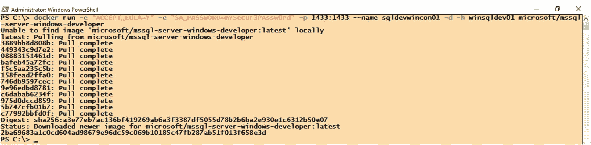
*图 4-12. 拉取并运行 Windows 上的 SQL Server 容器*

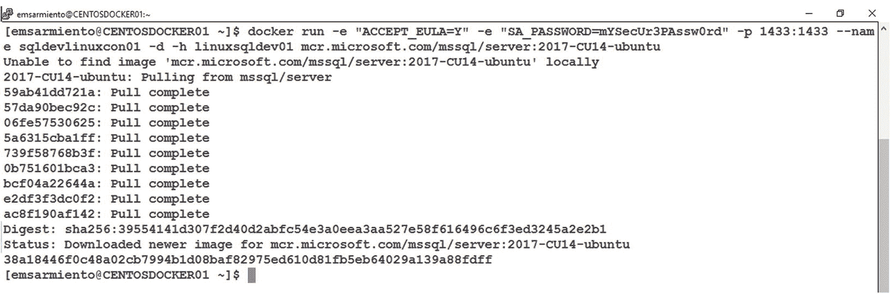
*图 4-13. 拉取并运行 Linux 上的 SQL Server 容器*

稍后你会明白为什么拉取镜像会花费一些时间。


## 在 Linux 容器上运行 SQL Server

运行以下命令，在你的 Linux Docker 主机上拉取并运行一个 `SQL Server 2017 Developer Edition with CU14 on Ubuntu Linux` 镜像。由于只有带 `latest` 标签的镜像在 Docker Hub 上可用，我们将使用 MCR 作为公共容器注册表。别担心，你可以在 Ubuntu 或 CentOS Linux Docker 主机上运行这个。而且你等待的时间不会像拉取 Windows 版 SQL Server 镜像时那么长。图 4-13 展示了在你的 Linux Docker 主机上运行 `docker run` 命令的结果。

```
docker run -e "ACCEPT_EULA=Y" -e "SA_PASSWORD=mYSecUr3PAssw0rd" -p 1433:1433 --name sqldevlinuxcon01 -d -h linuxsqldev01 mcr.microsoft.com/mssql/server:2017-CU14-ubuntu
```

**注意**

在第 3 章中，我讨论了将用户添加到 `docker` 组的安全影响。这是因为 Docker 守护进程以 `root` 身份运行。这意味着你在 Docker 主机上运行的任何容器都拥有 `root` 权限，不仅在容器内部，也在宿主机上。任何能够恶意获得容器访问权限的人都可以轻松地利用 Docker 主机。我确实说过这很可怕。不幸的是，以非 root 用户（也称为 `无根` 模式）运行 Docker 守护进程仍是一项实验性功能。你不会想在生产环境中使用实验性功能。微软不得不在这个限制下工作，因此在 Linux 容器上部署 SQL Server 是使用 `root` 完成的。SQL Server 2019 改变了这一点，允许以非 root 用户身份在 Linux 容器上运行 SQL Server。我将在第 10 章介绍如何以 `root` 或非 root 用户身份构建和运行 Linux 容器上的 SQL Server。

## 开始探索容器和镜像

所以，你拉取并运行了容器上的 SQL Server 镜像。你没有看到任何错误信息。或者也许你看到了。如果你想开始探索你拉取的镜像，可以运行 `docker images` 命令。这会让你明白为什么 Windows 版 SQL Server 镜像的拉取时间相比 Linux 版 SQL Server 镜像如此漫长，这也解释了为什么 Docker 版的 `hello world` 在 Windows 上运行比在 Linux 上花费更长时间。图 4-14 可能会让你震惊——它显示了在我的 Windows Server 主机和 Linux Server 主机上运行 `docker images` 命令的结果。

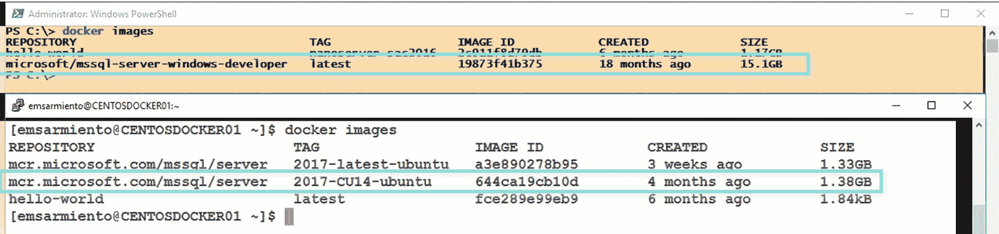

图 4-14：比较 Windows 版 SQL Server 与 Linux 版 SQL Server 镜像

仅仅因为在运行容器时没有看到任何错误信息，并不意味着一切正常。要查找所有正在运行的容器的状态，请运行 `docker ps` 命令。图 4-15 显示了我 Windows Server 和 Linux 服务器主机上当前正在运行的容器。

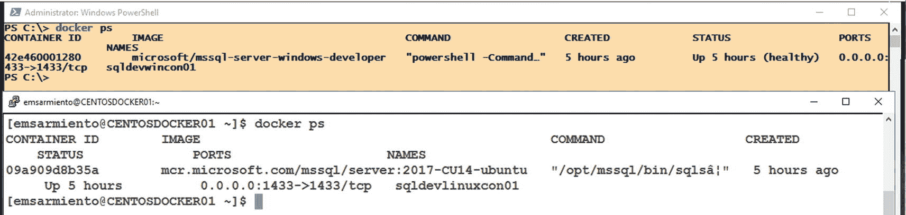

图 4-15：当前正在运行的 Docker 容器

`STATUS` 列告诉你容器当前是否正在运行。如果你刚刚运行的容器没有出现在这个列表中，并且你没有收到任何错误信息，这可能意味着它运行了一段时间后被终止了。一个已终止的容器可能意味着它预期要完成的工作已经完成（比如 `hello-world` 容器），或者容器内部发生了致命错误导致其停止。了解容器的功能是很重要的，这样你才能知道对它有什么预期。

运行 `docker ps -a` 命令会显示所有容器——无论是正在运行的还是已终止的。图 4-16 显示了我运行过的所有容器列表，包括状态为 Exited (0) 的已终止的 `hello-world` 容器。

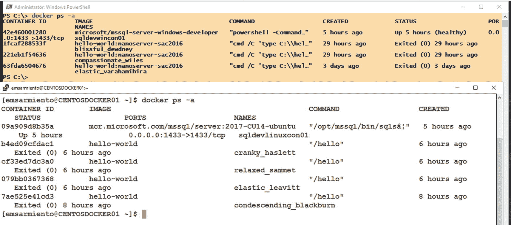

图 4-16：显示所有 Docker 容器——包括当前运行的和已终止的

在你处理容器的过程中，会经常运行这两个命令。但我们这里只是浅尝辄止。第 6 章将介绍使用这些命令的变体来执行基本的容器管理。


## 需要考虑的事项

通过运行几条命令就能在 Windows 和 Linux 容器上轻松拉取并运行一个 SQL Server，这种感觉是不是很棒？确实如此。但请不要过于兴奋。使用像 Docker 这样的新环境也带来了新的挑战，你需要对此有所了解。

### 许可证

第一个问题是许可证。我无意冒充许可专家，但我处理 SQL Server 许可事务已有多年，深知如何谈论它。你可能想知道你拉取的镜像中运行的是哪个版本的 SQL Server。无论是名称还是标签都没有像 Windows 容器版的 SQL Server 那样明确指出。该镜像默认是免费的**开发者版**。对于任何测试或学习目的，我坚持使用免费版本——开发者版和 Express 版。这样选择不会错。你可以通过在`docker run`命令中包含`MSSQL_PID`环境变量来选择其他版本，前提是你拥有这些版本的有效许可证。并且在生产环境中部署容器化的 SQL Server 时，务必咨询你的 Microsoft 许可专家。他们对此有最终决定权。

### 密码复杂性

第二个是`SA_PASSWORD`环境变量。`sysadmin`密码应满足[SQL Server 密码策略](https://docs.microsoft.com/en-us/sql/relational-databases/security/password-policy)中所述的复杂性要求。由于这是安装过程中的必需参数，不符合此策略将导致安装失败并使容器停止。

我第一次运行前述命令在 Linux 容器上运行 SQL Server 时，就通过惨痛教训明白了这一点。运行`docker run`命令并期待其正常工作后，我无法弄清楚为什么不能远程连接到 SQL Server 实例（我将在下一节更详细地讨论这一点）。我当时以为是防火墙端口未开放导致的。于是，我进行了常规的 PING 和 TELNET 测试。一无所获。我能够连接到 1433 端口一小会儿，但几分钟后，该端口就不再响应了。我检查了容器是否仍在运行，发现它在几分钟后就终止并退出了。这激起了我的好奇心，想知道到底发生了什么。查看日志后，我看到了如图 4-17 所示的 SQL Server 错误消息。

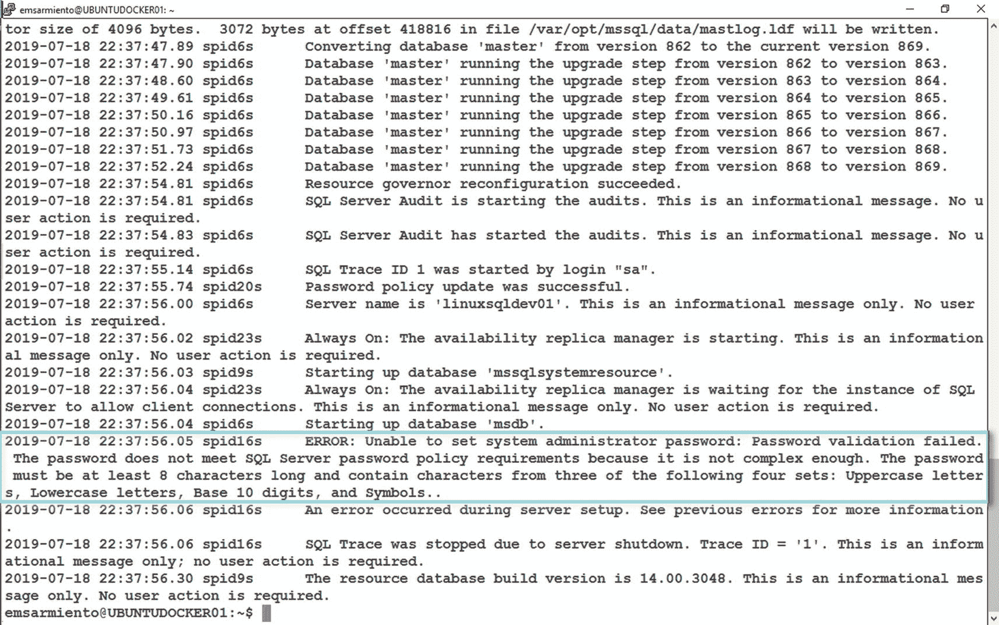
*图 4-17：来自容器日志的 SQL Server 错误日志*

我花了几个小时试图弄清楚为什么容器一运行就终止，最终才发现我的`sysadmin`密码不符合密码策略。

同样，使用对你的 shell 环境（如 PowerShell 或 SSH）有特殊含义的特殊字符，尤其是像下面的示例那样使用单引号而非双引号时，也可能导致问题：

```
docker run -e 'SA_PASSWORD=$Qlu=j&Q7a0N' ...
```

几年前我写了一个简单的 PowerShell 脚本来生成复杂密码。偶尔，该脚本会生成一个以特殊字符开头的密码，这个字符在我使用的 shell 环境中有特殊含义。以下是我曾用于创建 Linux 容器版 SQL Server 的其中一个密码。注意它以`$`字符开头。

```
$Qlu=j&Q7a0N
```

因为`$`字符在 PowerShell 和 Linux 中都有特殊含义（`$`字符代表变量表达式），当它作为`SA_PASSWORD`环境变量的值传递时，会被解释为变量表达式。它也不符合 SQL Server 的密码策略要求。

### 容器命名

最后是使用`--name`参数为容器分配名称。为容器恰当命名不仅是一个好习惯，也能避免四处忙乱地试图弄清楚`cranky_haslett`这个容器是什么以及它的用途。我在 Linux 主机上多次运行了`hello-world`容器，以展示系统自动生成的不同名称。如果不是镜像名称，我根本无法弄清楚`relaxed_sammet`容器是什么。关于一些非常有趣的系统生成名称列表，请参考图 4-18。

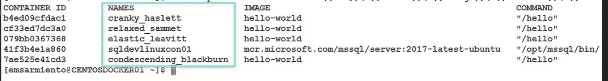
*图 4-18：系统生成的 Docker 容器名称*

如果你对 Docker 如何生成这些名称感到好奇，请参考其源代码：[`github.com/moby/moby/blob/master/pkg/namesgenerator/names-generator.go`](https://github.com/moby/moby/blob/master/pkg/namesgenerator/names-generator.go)。没有理由不在工作中寻找乐趣。


## 远程连接 SQL Server 实例

我通常不喜欢在生产服务器上安装任何不必要的客户端工具。事实上，自从 Windows Server Core 开始支持 SQL Server 数据库引擎以来，我就一直试图说服我的客户在上面安装它（虽然成功案例很少，但我至少尝试过）。我的目标是尽可能缩小服务器的暴露面，并阻止人们直接登录到服务器。这减少了攻击面，并最大限度地减少了人为错误和管理开销。我数不清有多少次，有人因为误以为自己登录的是测试服务器而不小心重启了生产服务器——或者有人使用专用的终端服务会话来运行一个简单的查询，从而阻止了其他管理员登录。

我的做法是，在一台客户端工作站上安装所有管理服务器所需的客户端工具——远程服务器管理工具（RSAT）、TELNET 客户端、SFTP 客户端、SQL Server Management Studio 等等。然后使用这台客户端工作站远程连接并管理服务器。此外，企业应用的部署通常也是如此，客户端远程连接到服务。

在单服务器部署中，连接到容器的最简单方法是利用 Docker 主机的 IP 地址或 DNS 名称（如果你有 DNS 服务器）。你在使用 `docker run` 时用到的 `-p` 参数，允许你使用 Docker 主机的 IP 地址远程访问容器，并将 Docker 主机上的指定端口映射到容器上的指定端口。在示例的 `docker run` 命令中，我们将主机的 1433 端口映射到容器的 1433 端口。

要找出主机的 IP 地址，你可以运行：

*   Windows 上运行 `ipconfig`
*   CentOS 或 Ubuntu 上运行 `ip addr`

在尝试连接到容器内的 SQL Server 实例之前，先进行基本的网络测试，比如 PING 和 TELNET。我总是从这两个测试开始，以确保连接问题与 SQL Server 无关。我不想浪费大量时间排查 SQL Server 问题，结果却发现是端口被防火墙规则阻止了。如果 PING 测试没有得到响应，我并不会总是假设服务宕机了。也可能只是网络管理员作为其安全策略的一部分禁用了 ICMP 响应。对 SQL Server 端口号进行 TELNET 测试会告诉我 SQL Server 是否正在监听。只有当我没有收到“无法打开到主机的连接”这样的错误消息时，我才会继续使用客户端应用程序进行测试。

启动 SQL Server Management Studio，使用你指定的 IP 地址和 `sysadmin` 凭据连接到 SQL Server Docker 容器。图 4-19 显示了一个简单查询的结果，用于显示实例名称和 SQL Server 版本。我在运行查询时使用了 SQLCMD 模式，这样在连接到远程 SQL Server 实例时就不必不断提供实例名称和凭据。

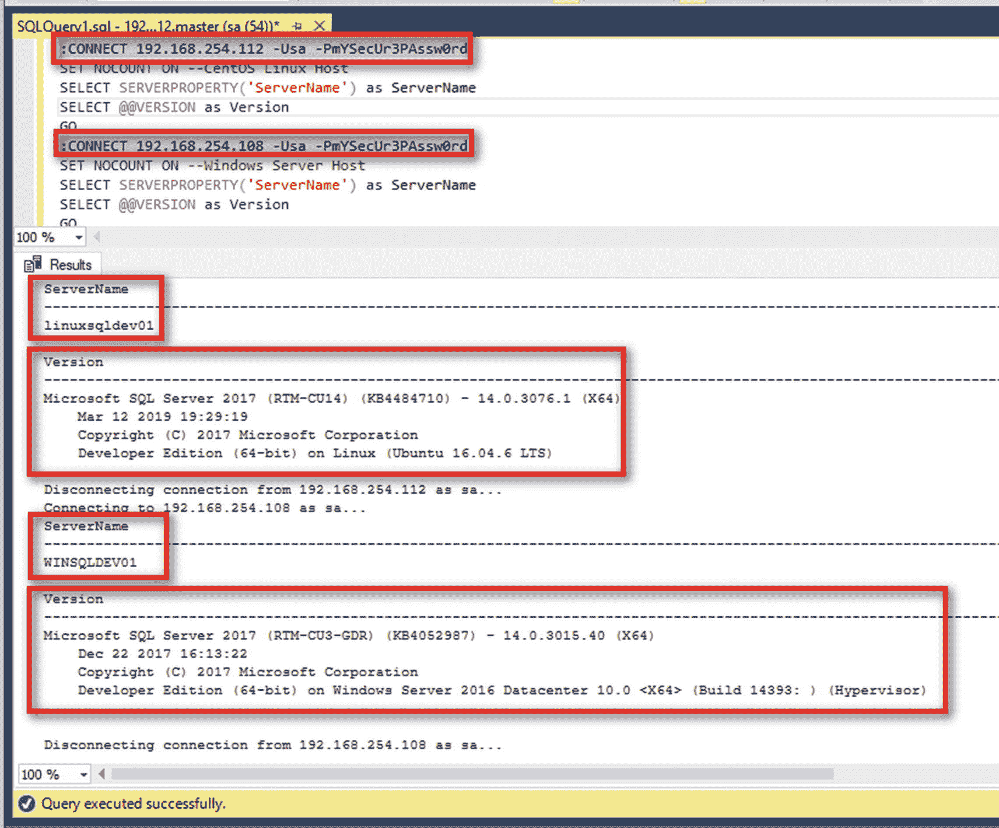
**图 4-19**
使用 SSMS 远程连接到容器上的 SQL Server

回想一下 `-h` 参数的用途，它用于反映服务器主机名——服务器主机名就是默认 SQL Server 实例的实例名称。此外，可用的 SQL Server on Linux 容器运行在 Ubuntu Linux 16.04.6 LTS 上，即使你的 Docker 主机是 CentOS Linux 7。

一旦你进入 SQL Server Management Studio，用户体验就是相同的。你不必在命令行中操作，也不必学习所有新的 SQL Server 命令行工具。你可以在一个熟悉的环境中，舒适地执行所有你曾经做过的管理任务。

## 容器的生命周期

运行 `hello-world` 容器让你对其生命周期有了一个简单的概述——从创建、执行到终止。请记住，容器只有在内部的主要进程仍在运行时才会存在——这就是为什么 `hello-world` 容器在屏幕上打印完整文本后立即退出。

一个容器会经历以下不同的状态，当你运行 `docker ps -a` 时，可以在 `STATUS` 列中看到它们：

*   `Created`：当你使用 `docker create` 命令创建了一个容器但尚未运行它时，就是这个状态，可能是为稍后运行做准备。
*   `Running`：容器正在启动并运行，执行其任务。
*   `Exited`：容器已经经过了 `RUNNING` 状态并完成了任务。由于其内部的主要进程不再运行，容器退出。
*   `Paused`：当你选择使用 `docker pause` 命令暂停一个正在运行的容器时的状态，这会挂起容器中所有正在运行的进程。
*   `Restarting`：一种容器状态，表示已配置了重启策略。你可以将其视为服务器重启，这是我们不希望 SQL Server 容器发生的事情。
*   `Dead`：当 Docker 守护进程尝试停止容器但失败时的状态。

可以认为运行 `docker run` 命令是运行 `docker create` 命令和 `docker start` 命令的组合。假设你想对 `hello-world` 容器分别使用 `docker create` 和 `docker start` 命令：

```
docker create hello-world
```

与 `docker run` 命令类似，这将返回容器 ID 值。你将这个值作为参数传递给 `docker start` 命令，包括 `-a` 参数，以将容器的输出附加到你的终端控制台。我通常在 `docker` 命令中只传递容器 ID 的前 12 个字符。图 4-20 展示了运行 `docker create` 和 `docker start` 作为运行 `docker run` 的替代方法。

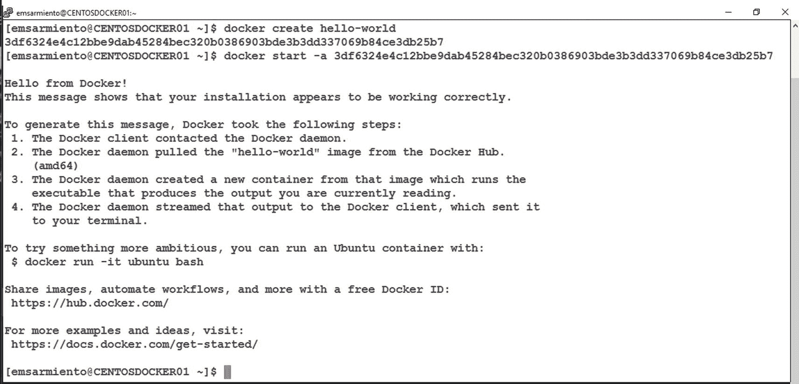
**图 4-20**
运行 `docker create` 和 `docker start` 命令

```
docker start -a 3df6324e4c12
```

我很少单独使用这两个命令，而只是依赖 `docker run` 命令来创建和运行容器。

容器的状态与虚拟机（VM）经历的不同状态相似——你可以随时启动、停止或暂停它们。而且很像虚拟机，当你停止容器时，运行在其中的进程也会变得不可用。容器及其关联的数据会保留在 Docker 主机的文件系统中，直到你显式移除它。移除容器并不会移除镜像。回想一下，容器是镜像的运行时实例。你可以从参考镜像中创建、启动、停止和移除任意数量的容器——这不会影响镜像本身。你可以从 Docker 主机删除该镜像。这样做会触发 Docker 守护进程在你决定再次运行它时，从配置的容器镜像仓库中拉取该镜像。我们将在第 5 章更详细地介绍镜像和容器的内部原理。

