# 总结

对构成 Docker 生态系统的不同组件有所了解，可以帮助你意识到运行一个容器需要什么。这为你开始在生产环境部署容器做好了准备。

我们已经了解了 Docker CLI 客户端的角色以及如何使用它来运行 Docker 命令。我们探讨了 Docker 守护进程如何成为你与 Docker 交互的核心。我们还研究了镜像与容器之间的区别，以及 Docker 守护进程如何与 Docker Hub 交互以拉取（以及在你开始创建自己的自定义镜像时推送）镜像。理解镜像命名约定可以帮助你同时使用公开可用的镜像和你将创建的镜像。

在容器上运行一个 SQL Server 并远程连接到它并非难事，特别是 Microsoft 已经提供了可用的镜像。并且一旦你连接到容器内的 SQL Server 实例，真的没有什么区别。你可以使用那些你多年来用于操作 SQL Server 的工具和命令。

在本章中，我向你介绍了一些 `docker` 命令，以帮助你开始使用容器。你肯定需要掌握这些命令，因为你将会经常用到它们：

*   `docker version`: 显示 Docker 版本信息；用于验证安装
*   `docker info`: 显示系统范围的信息；也用于验证安装和检查配置
*   `docker run`: 在一个新容器中运行一个命令，或者从 SQL Server 的角度来看，运行一个带有 SQL Server 实例的容器
*   `docker search`: 在 Docker Hub 中搜索可用的容器镜像
*   `docker pull`: 从容器注册表中拉取一个或一组镜像
*   `docker images`: 显示存储在 Docker 主机本地文件系统中的所有镜像
*   `docker ps`: 列出可用的容器

准备好迎接下一章，我们将更详细地从文件系统的角度来探讨镜像和容器。

## 5. Docker 镜像与容器

> “美：所有部分比例协调，使得无法增、删或改变，而不损害整体的和谐。”
>
> —莱昂·巴蒂斯塔·阿尔贝蒂

出生和成长在一个发展中国家自有其挑战，有趣的是，至少可以这么说。我们家属于中低收入阶层，只有一个挣钱的人。所以，像零食和看电影这样的事情被认为是奢侈。想象一下，我 8 岁时第一次走进麦当劳餐厅时的感受。

1984 年的一个夏日午后，我们的“提塔”（阿姨）带我和我哥哥去了麦当劳餐厅。我第一次接触开心乐园餐的经历平淡无奇—— regular burger（ regular 汉堡）配上薯条和一杯饮料，还附赠了一套乐高积木。就一个 8 岁的孩子而言，这是一顿附带玩具套餐的盛宴（事实上，当时的份量也很大）。我从阿姨的脸上看出，如果我们要求更多，她会非常乐意满足。我不需要任何说服。菜单上展示了一杯诱人的巧克力奶昔图片，是炎炎夏日的完美饮品。

当服务员准备我的奶昔时，我忍不住注意到旁边有一个巨大的 soda dispenser（苏打水机）。每个准备带饮料订单的服务员都会把一个空杯子放在其中一个分配器下面，按下其中一个可爱的小按钮，饮料就出来了。我幼小的大脑立刻充满了问题。饮料是从哪里来的？它怎么知道去哪里取水、可口可乐或根汁汽水？它怎么能把所有饮料都装进那个小机器里？机器后面是不是有个人，他唯一的工作就是给苏打水机加饮料？真的会下芝士汉堡雨吗？

当你在一家销售十几种或更多饮料的全球快餐连锁店工作时，了解像 soda dispenser（苏打水机）这样的机器如何工作是有帮助的。你想知道饮料供应商是谁，如何将正确的饮料罐连接到 soda dispenser（苏打水机），以及如果机器停止分配饮料该怎么办。我 8 岁时的问题，无论是针对那台苏打水机，还是现在处理 Docker 镜像和容器，都同样有效。

本章将从存储的角度介绍 Docker 镜像和容器的内部工作原理。我们将探讨镜像的构成、如何描述它们以及它们如何在文件系统中存储。你越了解 Docker 如何处理镜像，就越有能力设计自己的自定义镜像。

**注意**

除非另有说明，本章中的大部分示例都将与 Linux 相关。这将给你一个机会，在同时学习 Docker 镜像和容器的同时，提高你使用 Linux 文件系统的技能。


## 快速回顾（然后再深入一点…）

在上一章中，我从高层次概述了镜像与容器的区别。我将重复一遍，因为重复是掌握的关键。但由于本书更侧重于深入探讨镜像和容器，我们将更详细地探索这些概念。那么，开始吧。

一个 Docker 镜像是一个静态的、*只读*的模板，用于创建应用容器。它是运行应用程序所需的各种组件的非运行状态表示。镜像由一组按照文件系统层次结构组织的文件组成，其中包含应用文件、应用所需的操作系统依赖文件（如库）以及描述其内容的元数据。每个文件系统层仅仅是相对于前一层的差异集合，类似于一系列 SQL Server 事务日志备份，它们与完整的数据库备份一起构成了一个日志序列链，而完整备份即为基础镜像。回想一下你在上一章运行`docker pull`命令的情景。图 5-1 展示了对应于`docker pull`命令输出的、SQL Server on Linux 镜像的分层文件系统。不要认为那一堆系统生成的、64 个字符（通常显示为 12 位的短字符串）的十六进制字符串是无意义的。每条“Pull complete”消息都代表构成整个镜像的一个文件系统层。

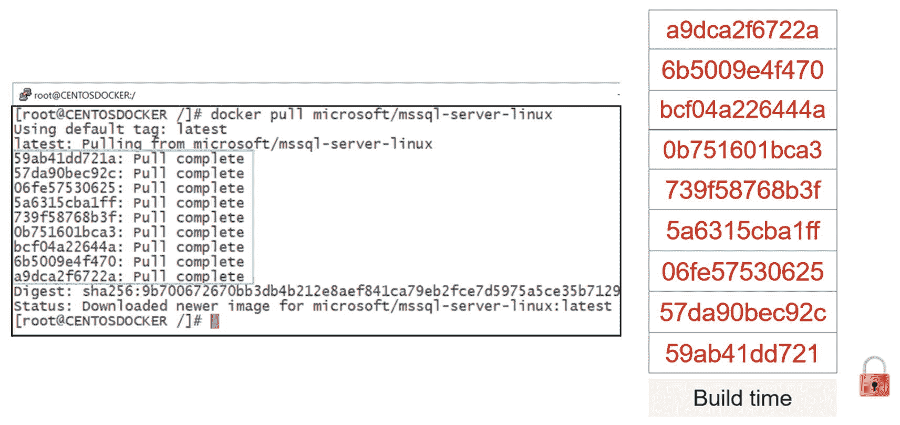

图 5-1

包含镜像层的 SQL Server on Linux 镜像

然而，一个 Docker 容器是该镜像的运行时实例。你创建和运行的每个 Docker 容器都将基于这个只读的镜像模板。你可以将 Docker 镜像视为蓝图，就像汽车的技术图纸。你根据你希望汽车（Docker 容器）的外观和功能来创建蓝图（Docker 镜像）。一旦蓝图最终确定，你就可以根据该蓝图创建任意数量的汽车实例。你可以自由地改变汽车的美学——颜色、配件、内饰等——而无需修改蓝图。如果你决定对汽车进行重大修改，你必须回到绘图板重新编写蓝图。

如果 Docker 镜像是只读模板，那么你如何可能运行需要对文件系统进行更改的容器呢？向只读介质写入数据就像试图向一次性写入的 CD-ROM 写入数据一样。第二次是行不通的（而且在当今世界，谁还用 CD-ROM 呢？）。当然，如果我们要修改只读模板内的文件，底下一定有些魔法在起作用。此外，一个只读数据库除了用于报告和分析之外，还有什么用处呢？即使是对 SQL Server 实例的简单配置更改也需要修改`master`数据库数据文件。

秘密在于，容器实际上是一个位于只读层之上的薄薄的可读写文件系统层。图 5-2 展示了 Docker 容器如何作为一个薄薄的可读写文件系统层，在只读层之上运行。`docker run`命令返回代表这个薄薄的可读写层的容器 ID。

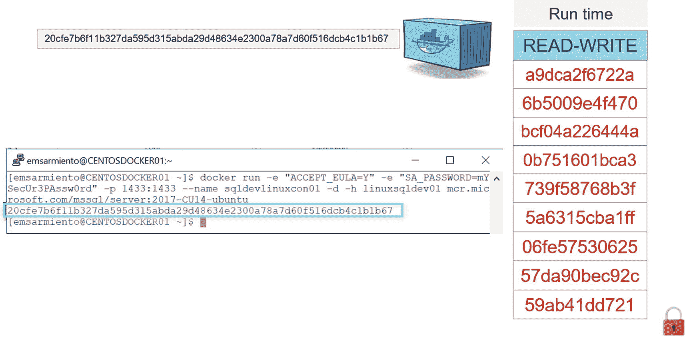

图 5-2

作为可读写文件系统层的 SQL Server on Linux 容器

这个可读写文件系统层类似于 Microsoft Hyper-V 中的差异磁盘和 VMWare 中的链接克隆的工作原理。你可以从同一个镜像创建任意多的容器，在镜像和容器之间形成一对多的关系。你对容器所做的任何更改都只发生在可读写文件系统层中，不会影响基础的只读层。这个薄薄的可读写层也解释了为什么容器比物理机或虚拟机启动得更快。与虚拟机不同，你不需要在容器中启动整个系统。你只是在启动它们，跳过了启动操作系统所需的所有进程。由于 Docker 主机的操作系统基础已经启动，容器所要做的就是创建可读写文件系统层并加载所有必要的文件来启动其中的应用程序。

既然我们已经确立了 Docker 容器实际上是一个运行在只读文件系统层之上的薄薄的可读写文件系统层这一事实，让我们开始更深入地挖掘一下。

## 拉取镜像的背后原理

在上一章中，“Docker 如何运行容器”一节让你了解了 Docker 生态系统中的不同组件如何协同工作以运行容器。第 4 步是 Docker 守护进程联系 Docker Hub 搜索并拉取镜像，为运行它做准备。但是，你是否想过 Docker Hub 如何知道你的 Docker 主机运行在什么平台上，以及如何提供正确的镜像呢？我指的是当你运行`docker info`命令时获得的平台信息，如图 5-3 所示。

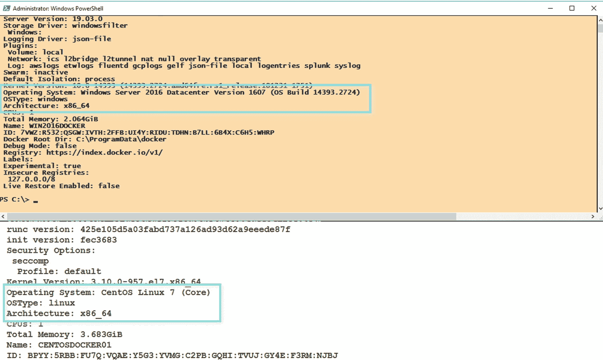

图 5-3

来自`docker info`命令的你的 Docker 主机平台信息

回想一下，在 Microsoft 废弃他们的`hello-world`镜像版本之前，我可以在 Windows Server 和 Linux Docker 主机上运行相同的`docker run hello-world`命令，并得到相同的输出。只要存在可用的镜像，Docker Hub 就会根据平台信息为你的 Docker 主机提供正确的镜像。

在上一章的第 4 步和第 5 步之间，有一些处理*清单（manifests）*的中间步骤。不要对清单是什么感到困惑。它只是一个描述镜像内容的 JSON 文件的华丽说法：构成镜像的文件系统层、它们的大小和摘要（digest）。图 5-4 介绍了这些中间步骤。

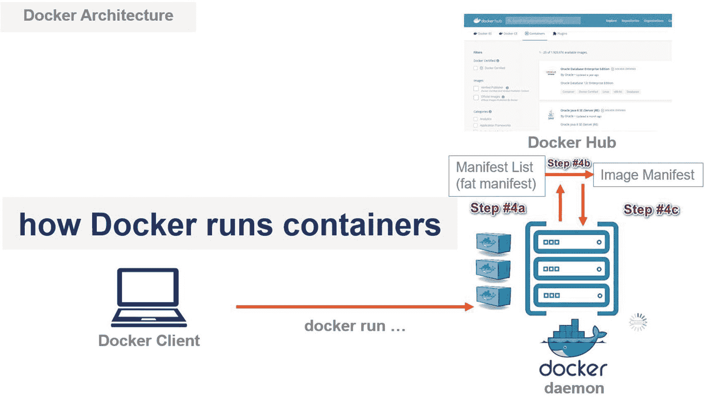

图 5-4

Docker Hub 根据清单发送正确的镜像

让我们探索第 4 步和第 5 步之间的中间步骤：

1.  如果 Docker 守护进程没有`hello-world`容器镜像的本地副本，它会在 Docker Hub 中搜索该镜像（第 4 步）。Docker 守护进程还发送平台信息——主要是操作系统和 CPU 架构——到 Docker Hub 并查询清单。
2.  如果存在一个“胖”清单，Docker Hub 会在其中搜索与 Docker 守护进程的平台信息（来自第 4a 步）匹配的部分，并将查询重定向到相应的镜像清单（第 4b 步）。
3.  解析镜像清单，读取构建镜像所需的相应文件系统层。然后，这些文件系统层被发送到 Docker 守护进程（第 4c 步）。
4.  一旦下载完成，Docker 守护进程就会基于`hello-world`镜像创建并运行一个新容器（第 5 步）。

使用胖清单允许像 Docker Hub 这样的镜像仓库向 Docker 主机提供正确的镜像。你肯定不希望一个 Linux Docker 主机从镜像仓库拉取一个基于 Windows 的镜像，对吧？那是无法工作的。


### 胖清单？

步骤 #4a 引入了所谓的“胖”清单。我其实不太清楚它为什么被称为“胖”清单，但官方术语是 `manifest list`。你可以把清单列表想象成“清单的清单”。拥有“胖”清单的理念是为了提供无缝的多架构支持用户体验，这正是 Java 曾经吹嘘的“一次编写，随处部署”原则的真正精髓。有了“胖”清单，我就不必再为寻找适用于当前平台的正确镜像名称和标签组合而担心了。例如，我可以在不同的操作系统和 CPU 架构上运行 `docker run hello-world` 命令。

让我们使用 `docker manifest` 命令来检查 `hello-world` 镜像的“胖”清单。由于这是一个实验性命令，你需要使用 `export` 命令启用 `DOCKER_CLI_EXPERIMENTAL` 环境变量。运行以下命令来查看 `hello-world` 镜像的清单列表。图 5-5 展示了 `hello-world` 镜像支持的不同架构片段以及定义它的字段。


图 5-5

hello-world 镜像的胖清单

```
export DOCKER_CLI_EXPERIMENTAL=enabled
docker manifest inspect hello-world
```

`hello-world` 镜像的“胖”清单告诉我们，我们可以在多种操作系统和 CPU 架构组合上运行容器——例如 x86 和 amd64 上的 Linux、Windows 10 Build 10.0.17134.885，以及 ARM 上的 Linux 等。想象一下在树莓派设备上运行 Docker 容器。

注意

我希望 SQL Server 容器也能如此。不幸的是，微软的文档明确指出，Windows Server 和 Linux 上的 SQL Server 2017 及更高版本仅支持“与 x64 兼容”的处理器类型。SQL Server 运行在像 DEC Alpha 这样的非 x64 平台上的日子已经一去不复返了。不过，Azure SQL Database Edge 对于基于 ARM 的 Linux 设备来说看起来很有前景。更多详情请查看 [*https://azure.microsoft.com/en-us/services/sql-database-edge/*](https://azure.microsoft.com/en-us/services/sql-database-edge/)。它仍处于开发的早期阶段。

以下是表明其为“胖”清单的字段：

*   `mediaType`：其值为 `application/vnd.docker.distribution.manifest.list.v2+json`。
*   `schemaVersion`：其值为 2。

“胖”清单是可选的——你可以在没有它的情况下创建 Docker 镜像。如果它不存在，则会跳过步骤 #4a，Docker 守护进程的查询会直接发送到镜像清单（步骤 #4b）。Linux 上的 SQL Server 镜像就是一个这样的例子。由于它是专门为 Linux on amd64 平台创建的，`mediaType` 字段将只显示一个镜像清单。请参考以下 `mediaType` 值以区分它与“胖”清单：

*   `"mediaType": "application/vnd.docker.distribution.manifest.v2+json"`

运行以下命令来检查 `SQL Server on Linux` 镜像的镜像清单。图 5-6 展示了 SQL Server on Linux 镜像清单的片段。

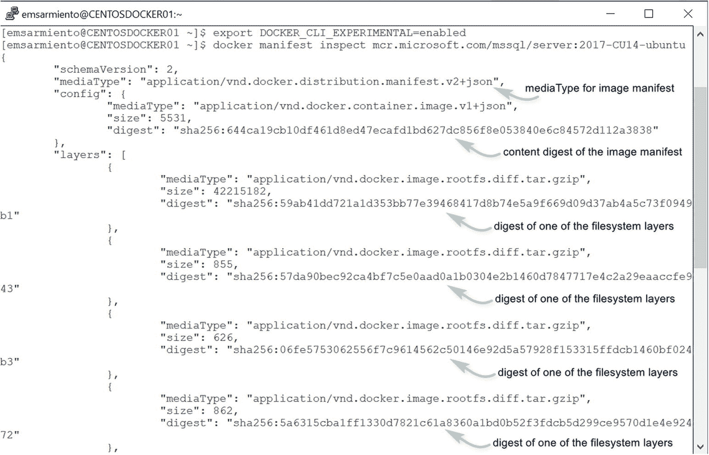

图 5-6

SQL Server on Linux 镜像的清单

```
export DOCKER_CLI_EXPERIMENTAL=enabled
docker manifest inspect mcr.microsoft.com/mssql/server:2017-CU14-ubuntu
```

我并不是说我喜欢处理 JSON 数据。但现实是，JSON 是一种非常流行的数据交换格式，以至于 SQL Server 从 2016 版开始就加入了对其的支持。好在还有替代工具。`mquery` 实用程序就是一种你可以用来查询 Docker 镜像是否具有“胖”清单的工具，而无需处理所有那些 JSON 数据。如果存在“胖”清单，它还会告诉你支持哪些其他平台。有关 `mquery` 实用程序的更多信息，请查看 [*https://github.com/estesp/mquery*](https://github.com/estesp/mquery)。

运行以下命令，使用 `mquery` 实用程序检查 SQL Server on Linux 镜像。请注意，这也会拉取包含该工具的相应镜像。图 5-7 显示了命令的输出，确认了 SQL Server on Linux 镜像没有“胖”清单（Manifest List: No），并且仅支持 amd64 平台上的 Linux。

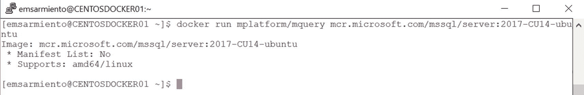

图 5-7

对 SQL Server on Linux 镜像运行 mquery 工具

```
docker run mplatform/mquery mcr.microsoft.com/mssql/server:2017-CU14-ubuntu
```

如果你对官方的 Linux Ubuntu 镜像运行该工具，你将看到它支持的不同平台，如图 5-8 所示。现在大多数 Docker 官方镜像都支持多架构。

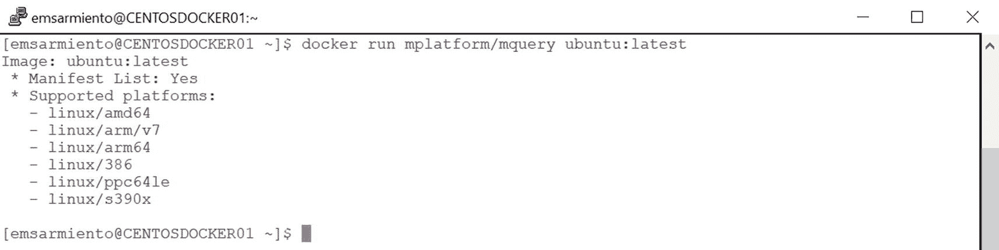

图 5-8

对官方 Ubuntu 镜像运行 mquery 工具


### 镜像清单

如果存在一个“胖”清单，其内部会有一个 `manifests` 字段，其中包含一个指向不同平台镜像清单的列表，就像指向镜像清单的指针。如果不存在，当你运行 `docker manifest inspect` 命令时，你得到的就是 `镜像清单`。镜像清单提供了构建镜像所需的不同文件系统层的详细信息，以及一个配置，该配置告诉 Docker 守护进程如何将所有层拼凑在一起以运行容器。你可以把不同的文件系统层看作乐高积木，把镜像清单看作搭建说明书（这就是我第一次吃到“开心乐园餐”时如此难忘的原因）。通用的乐高积木本身并不知道它们之间是如何关联的。只有搭建说明书拥有将它们全部连接起来的细节，这样你才能拼出一个星球大战千年隼号。你甚至可以用现有的积木（文件系统层）创建自己的乐高结构（Docker 镜像），只要你同时也创建了自己的搭建说明书（镜像清单）——即使说明书只存在于你的脑海中。从仓库中拉取 Docker 镜像的过程包括获取镜像清单和文件系统层。

运行以下 `docker inspect` 命令来探索 `hello-world` 镜像的低层级细节。请注意，你是在检查一个镜像，而不是容器。你可以使用 `docker inspect` 命令来检查镜像和容器。但此刻我们只对镜像感兴趣。

```
docker inspect hello-world
```

如果你在输出中向下滚动到 `Layers` 部分，它会告诉你这个镜像有多少个文件系统层。图 5-9 显示 `hello-world` 镜像只有一个文件系统层。

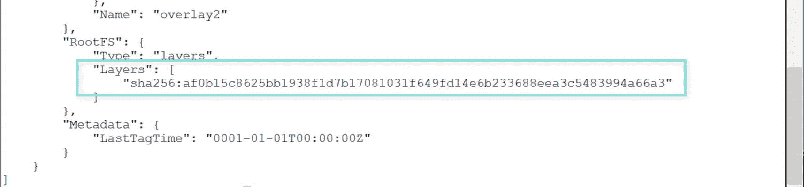

图 5-9

只有一个文件系统层的 hello-world 镜像

提示

不要混淆 `docker manifest inspect` 和 `docker inspect` 命令。它们可能都有相同的 `inspect` 子命令，但功能不同。如果你想探索一个清单——无论是“胖”清单还是镜像清单——请使用 `docker manifest inspect` 命令。如果你想探索 Docker 对象（如镜像或容器）的低层级细节，请使用 `docker inspect` 命令。可惜它们都以 JSON 数组返回结果。JSON 的普遍性真是无处不在。

回想一下图 5-10 所示的 `docker run hello-world` 命令的输出。它与从 Docker Hub 拉取的文件系统层的数量是一致的。

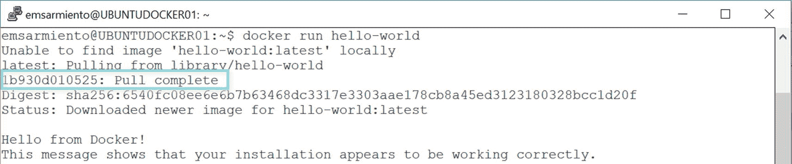

图 5-10

运行 hello-world 容器，拉取一个文件系统层

同样地，你可以运行以下命令来探索 SQL Server on Linux 镜像：

```
docker inspect mcr.microsoft.com/mssql/server:2017-CU14-ubuntu
```

图 5-11 显示了 `Layers` 部分有九个文件系统层，这也与图 5-1 所示的文件系统层数量一致。

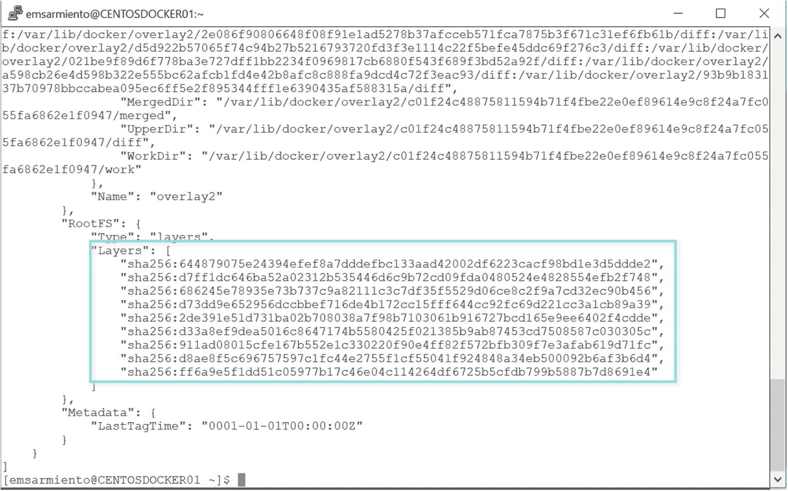

图 5-11

SQL Server on Linux 镜像的文件系统层

请访问 [`docs.docker.com/registry/spec/manifest-v2-2/`](https://docs.docker.com/registry/spec/manifest-v2-2/) 获取有关清单的更多信息。虽然对于我们使用容器上的 SQL Server 来说，只有镜像清单是相关的，但知道你可以让 Docker 容器在多个平台上运行，会让你了解到其可能性。谁知道呢，也许微软未来会决定在 x64 以外的其他平台上运行 SQL Server。

### 内容摘要

在广袤的互联网世界中，下载任何东西而不验证其完整性和真实性是不明智的。你无法知道内容是否被恶意篡改过，或是作为变更请求的一部分被修改过。这就是内容寻址存储概念的用武之地。内容寻址存储用于存储信息，以便可以根据其内容而非位置来检索。它使用根据内容生成的加密哈希函数的摘要。其工作原理是：根据文件（或 Docker 中的文件系统层）的内容生成一个哈希函数。生成的哈希被称为 `内容摘要`。由于内容摘要哈希值是文件系统层内容的哈希，改变层中的内容就需要改变内容摘要。

因此，当你运行 `docker pull` 或 `docker run` 命令时，内容摘要会作为返回码的一部分包含在内。Docker Hub 发送的文件系统层具有与镜像清单中定义的内容摘要相同的值。下载后，Docker 守护进程会重新运行哈希计算，并验证文件系统层的内容摘要是否与镜像清单中定义的一致。这保证了构成镜像的文件系统层的完整性和真实性，无论它们存储在哪里——无论是在 Docker Hub 上还是你自己的容器注册表中。


### 分发哈希

我本希望能告诉你，镜像清单中的摘要值与 `docker inspect` 命令输出的 `Layers` 部分所显示的值相同。那样我们就能通过直接查看镜像清单和 `Layers` 部分，轻松识别出哪个摘要对应哪个层。不幸的是，事情要复杂一些。只需看一下 Linux 版 SQL Server 镜像在镜像清单中的哈希值，并将其与 `Layers` 部分进行比较，如图 5-12 所示。

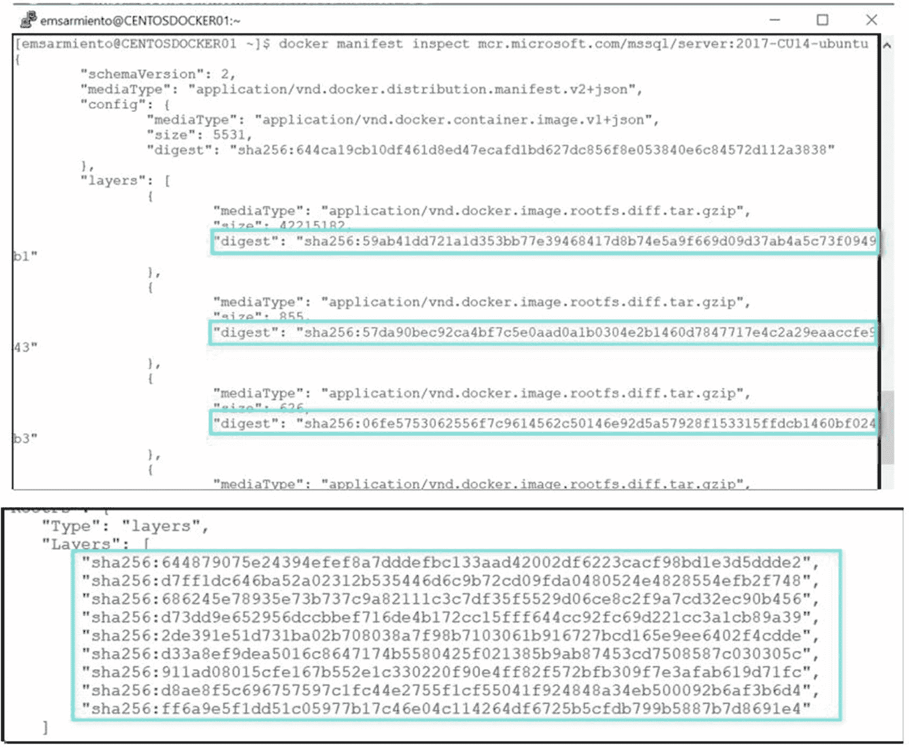

图 5-12
比较 Linux 版 SQL Server 镜像各层的摘要值

这是因为当你通过网络处理文件时，会实施某种形式的文件压缩，以改善网络带宽和存储空间需求。在互联网上处理其他类型的文件时也是如此。但是，压缩文件会改变其内容，因此也会改变其内容摘要。当然，当你推送和/或拉取文件系统层时，这就会成为问题，因为内容摘要不再匹配——哈希验证会失败。

为了解决这个问题，便生成了 `分发哈希`。分发哈希是在文件系统层被压缩后生成的。用于构建镜像的每一个文件系统层都会被压缩，并生成其分发哈希。每个文件系统层的分发哈希会被写入镜像清单。一旦分发哈希被写入镜像清单，镜像现在就可以被推送到 Docker Hub 或其他容器注册中心了。

当你为镜像运行 `docker inspect` 命令时，在 `Layers` 部分看到的哈希是未压缩的哈希——即文件系统层的内容摘要。同时，镜像清单的 `digest` 字段中的哈希值则是压缩后的文件系统层的哈希——即分发哈希。鉴于内容摘要和分发哈希在清单、Docker 镜像和文件系统层方面的工作细节，图 5-13 更好地展示了图 5-6 中所示的 Linux 版 SQL Server 镜像清单。同时，运行以下命令以显示 Linux 版 SQL Server 镜像的详细信息：

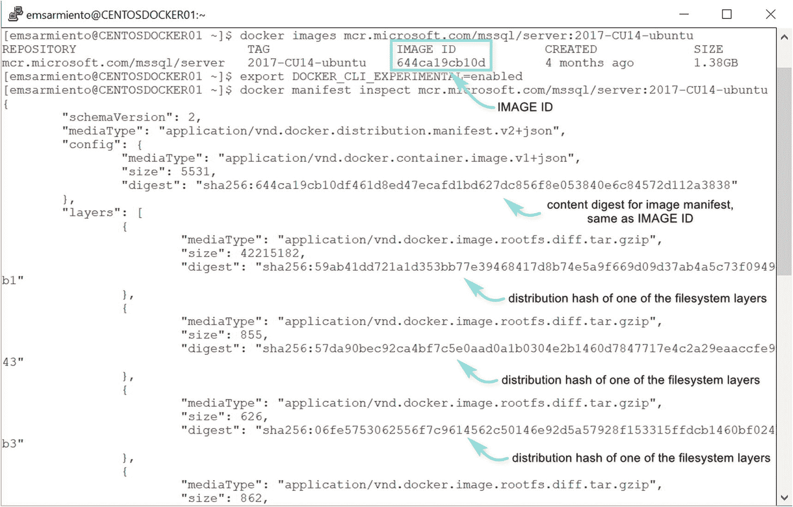

图 5-13
Linux 版 SQL Server 镜像的内容摘要与分发哈希

```
docker images mcr.microsoft.com/mssql/server:2017-CU14-ubuntu
```

## 你的 Docker 主机的本地文件系统

一旦构建镜像所需的文件系统层被下载到你的 Docker 主机的本地文件系统中，Docker 守护进程就会施展它的魔法，将这些部分组装起来，以便你可以运行容器。嗯，上述说法中只有组装部分是真实的。但当你真正思考底层发生了什么时，这可能看起来像魔法。让我们来看看促成这个魔法的不同组件。

### 联合文件系统

使用 Docker 容器以及它们如何与文件系统交互，需要理解 `联合文件系统`。联合文件系统允许你获取不同的文件系统层，并创建它们内容的联合体，其中最顶层会覆盖其下层中发现的任何同名文件。在不让你被技术细节淹没的情况下，我能描述它的最简单方式就像是在透明胶带上写点东西——比如 ABC。我可以在现有的胶带上面再粘一层透明胶带，上面写上完全不同的内容——比如 DEF。我再在最上面那层上粘另一层，写上不同的内容——比如 GHI。当我从顶部看这些透明胶带层时，我看到的会是一个写有 ABCDEFGHI 的单层，前提是你没有直接写在下层胶带上。从 Docker 的角度来看，所有这些透明胶带层就构成了一个镜像。无论有多少层，最终只有一个镜像。

联合文件系统的实现方式是通过存储驱动程序。在 Linux 中，最常见的是 OverlayFS 和 AUFS（在更名为高级多层统一文件系统之前，曾被称为 AnotherUnionFS）。AUFS 是早期 Docker 版本的默认存储驱动程序。较新的安装则利用 `overlay2`，这是 OverlayFS 的一个改进版本。


### 文件、目录名称与符号链接

由于从 Docker Hub 拉取的每个文件系统层都存储在 Docker 主机的本地文件系统中，了解它们的存储位置对你来说就很有意义，以便日后检查它们来执行管理任务，例如清理磁盘、管理镜像、移动文件等。你还需要了解这些文件是什么以及它们是如何被引用的。

文件系统层在本地磁盘上的位置取决于你所使用的存储驱动。在 Linux 主机上运行以下命令以查找已安装的存储驱动：

```
docker info | grep -w 'Storage Driver:'
```

在 Windows Server 主机上运行以下命令以查找已安装的存储驱动：

```
docker info | Select-String "Storage Driver"
```

图 5-14 分别展示了 Linux 和 Windows Server 主机的存储驱动。

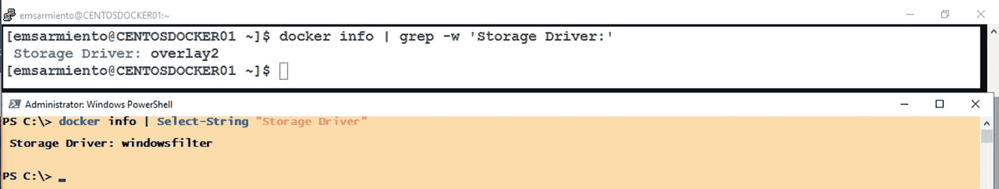

图 5-14

显示 Docker 存储驱动

在 Linux 主机上，如果你使用的是 AUFS，可以在 `/var/lib/docker/aufs` 目录找到文件系统层；如果你使用的是 overlay2，则在 `/var/lib/docker/overlay2` 目录。在 Windows Server 主机上，它位于 `C:\ProgramData\docker\windowsfilter`。请记住，`C:\ProgramData` 是一个隐藏文件夹，因此除非你配置了 Windows 资源管理器显示隐藏项目，否则可能看不到它。

让我们来探索一下 Linux 主机上的 `/var/lib/docker/overlay2` 目录内容。你需要 `sudo` 权限才能浏览 `/var/lib/docker` 目录及其下的所有内容。记得在命令前加上 `sudo`。为了简化命令，以下示例均以 `root` 用户运行。我还清理了我的 Linux 主机，因此它只包含 SQL Server on Linux 镜像。

参考图 5-15。我们将继续使用 `ls -l` 命令来列出 Linux 中的文件和目录。在 `overlay2` 目录内是九个以 64 个字符的十六进制字符串命名的目录。每个目录都代表 SQL Server on Linux 镜像的文件系统层。我也希望有一种简单的方法可以将这些目录名与你拉取镜像层时得到的镜像层哈希值关联起来。不幸的是，这些目录名既不是未压缩层的内容摘要，也不是它们的分发哈希值。它们基于一个随机生成的“缓存 ID”，Docker 守护进程用它来跟踪层内容在磁盘上的位置。让我们先把这个概念放一放，稍后再回来讨论。

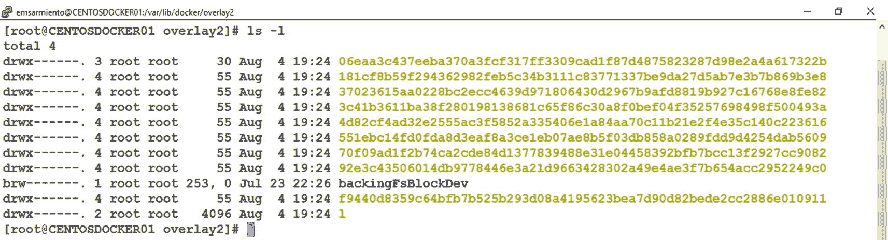

图 5-15

显示 /var/lib/docker/overlay2 目录

还有另一个名为 `l`（小写 L）的目录。该目录包含作为*符号链接*的缩短的层标识符。在 Linux 中，符号链接是一个文本文件，其内容是指向另一个文件或目录的路径（以绝对路径或相对路径形式），并且会影响路径名解析。可以将其视为 Windows 中的快捷方式。最大的区别在于，Linux 中的符号链接可以充当目录或文件的替代品，而 Windows 中的快捷方式只是一个普通文件，它包含对目标文件或文件夹的引用。图 5-16 展示了 `/var/lib/docker/overlay2/l` 目录的内容。

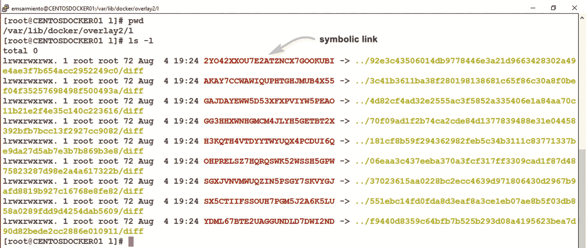

图 5-16

/var/lib/docker/overlay2/l 目录内部

这个 26 个字符的符号链接指向 `->` 之后的路径。例如，符号链接 `2YO42XXOU7E2ATZNCX7GOOKUBI` 指向 `92e3c43506014db9778446e3a21d9663428302a49e4ae3f7b654acc2952249c0/diff` 目录。到目前为止，一切顺利。

但请记住，这些不是哈希值。这些是 Docker 守护进程用来跟踪层内容在磁盘上位置的缓存 ID 值。要找出哪个目录映射到这个缓存 ID，我们需要在一个名为 `cache-id` 的文件中搜索这个缓存 ID 值。该文件包含存有文件系统层的目录名。而它位于 `/var/lib/docker/image/overlay2/layerdb/sha256` 目录下的其中一个子目录中。运行以下 `grep` 命令来搜索 `/var/lib/docker/image/overlay2/layerdb/sha256` 目录中包含你查找的缓存 ID 值的文件。对于符号链接 `2YO42XXOU7E2ATZNCX7GOOKUBI`，我将仅使用目录名的前 12 个字符。

```
grep -Ril "92e3c4350601"
```

以下参数与 `grep` 命令一起使用：

*   `R`：递归；我希望 `grep` 搜索目录及子目录内文件中的内容。
*   `i`：忽略大小写。
*   `l`：只显示文件名，而不是匹配结果。

图 5-17 展示了 `grep` 命令的输出。请注意，64 个字符的十六进制字符串目录名现在变成了文件系统层的内容摘要。你还得到了名为 `cache-id` 的文件。

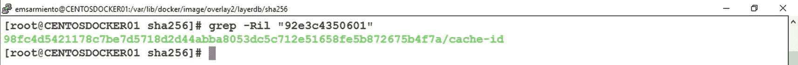

图 5-17

包含符号链接目录名的 cache-id 文件

运行以下 `cat` 命令以显示此 `cache-id` 文件的内容。请注意文件的路径。我是从 `/var/lib/docker/image/overlay2/layerdb/sha256` 目录内部运行该命令的。图 5-18 展示了代表目录名的缓存 ID 值。

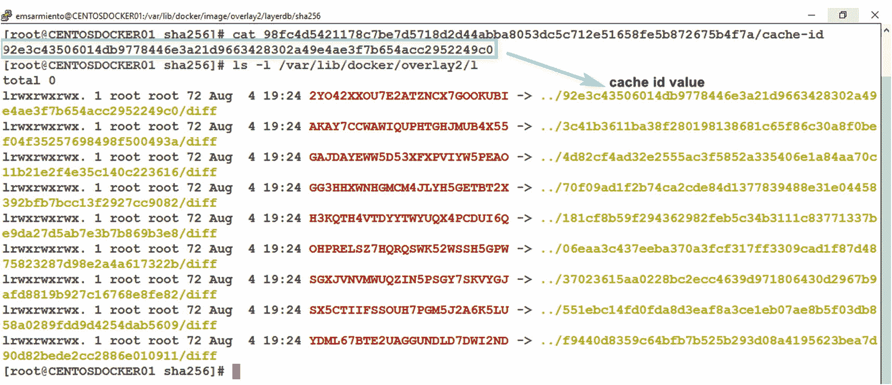

图 5-18

对应于目录名的 cache-id 值

```
cat 98fc4d5421178c7be7d5718d2d44abba8053dc5c712e51658fe5b872675b4f7a/cache-id
```

在探索这些目录和文件时，请务必使用你在 Linux 主机上获得的值。但在我们最终深入探究哈希值如何转换为缓存 ID、再转换为目录名等问题之前，我就此打住。目前，知道文件系统层在磁盘上的存储位置以及 Docker 守护进程如何跟踪它们的位置就足够了。如果你真想深入了解 Docker 的本地存储架构，请查阅 [*https://programmer.group/docker-learning-image-s-local-storage-architecture.html*](https://programmer.group/docker-learning-image-s-local-storage-architecture.html)。

还有一些其他文件需要了解：

*   `/var/lib/docker/image/overlay2/repositories.json`：存储本地磁盘上所有已拉取镜像的信息。
*   `/var/lib/docker/image/overlay2/imagedb/content/sha256/<hex value>`：此目录内的文件名是你拉取的镜像的镜像 ID；它们是运行某些 Docker 命令（如 `docker inspect` 和 `docker history`）时的基础。
*   `/var/lib/docker/image/overlay2/distribution/diffid-by-digest/sha256/<hex value>`：此目录内的文件名是文件系统层的内容摘要和分发哈希值（基于 `docker manifest inspect` 命令）之间的映射。

还有更多这样的文件和目录，其中大部分都未文档化。我将它们留给你自己去探索和研究。除非你确切知道它们的用途，否则不要随意改动它们。

注意

如果你决定删除并重新拉取 Docker 主机中的所有文件系统层和镜像，目录的名称可能会改变。不会改变的是文件系统层的哈希值。正是这些哈希值使得镜像具有不可变性。


## 拼接图层：组装镜像

一旦文件系统图层存储到磁盘并定义了标识符，Docker 守护进程就开始将它们拼接起来，以形成完整的镜像。清单（manifest）告诉 Docker 守护进程构建镜像和运行容器需要哪些文件系统图层。这也是存储驱动程序与 Docker 守护进程协作，构建不同文件系统图层统一视图的地方。我将描述如何使用 `overlay2` 存储驱动程序来完成此操作，因为它是 Linux 上的默认存储驱动程序。

你已经看到文件系统图层是如何以目录形式存储在 `/var/lib/docker/overlay2/` 目录中的，它们使用相应的缓存 ID 命名。回想图 5-1 中显示的构成 SQL Server on Linux 镜像的不同文件系统图层。该镜像中的最底层包含以下内容：

*   一个名为 `link` 的文件。它包含了缓存 ID 值与包含该图层内容的目录之间的符号链接。
*   一个名为 `diff` 的目录。它包含了该图层的内容。

镜像中的下一个及后续图层，除了包含 `link` 文件和 `diff` 目录外，还包含以下内容：

*   一个名为 `lower` 的文件。该文件包含指向下一层（父层）的符号链接。
*   一个名为 `merged` 的目录。这是一个视图，包含了其自身及其下方图层的统一内容。该目录是在一个代表读写层（容器）的新目录下创建的，而不是在只读文件系统图层下。
*   一个名为 `work` 的目录。`overlay2` 在内部使用的一个目录。

此外，Windows 没有 `l` 文件夹。`C:\ProgramData\docker\windowsfilter` 中的文件夹本身就是缓存 ID 值，而不是符号链接。除此之外，文件系统结构的其他部分都是相同的——只是它们位于 `C:\ProgramData\docker\` 下。

### 联合文件系统如何工作

为了更好地理解 Docker 如何利用存储驱动程序构建镜像，让我们使用 `mount` 命令创建目录作为图层，并将它们“挂载”为一个联合文件系统层。首先，创建目录——`lower`、`diff`、`merged`、`work`。请确保你使用自己的用户账户登录，这样就不会弄乱任何与 Docker 相关的文件和文件夹。运行以下命令，使用 `mkdir` 命令创建目录：

```
mkdir lower diff merged work
```

接下来，让我们在 `lower` 目录中创建一个文件。该目录将作为最底层/基础层。运行以下命令，创建一个名为 `fileInLower.txt` 的文件，其中包含指定文本：

```
echo "LOWER: This file is in the LOWER directory" > lower/fileInLower.txt
```

现在，运行以下 `mount` 命令来统一我们创建的目录：

```
sudo mount -t overlay -o lowerdir=lower,upperdir=diff,workdir=work none merged
```

我们使用 `overlay` 文件系统类型，并将 `merged` 目录作为统一视图的位置。由于我们挂载的不是设备而是一个目录，因此我们使用 `none` 作为占位符。要进行验证，请运行以下命令，显示你刚刚创建的挂载点，如图 5-19 所示：

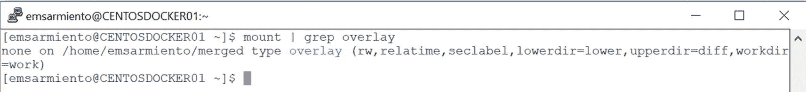

图 5-19：新创建挂载点的属性

```
mount | grep overlay
```

现在，在 `lower` 目录中有一个文件，并且有一个 `merged` 目录显示所有目录的统一视图。是时候测试联合文件系统了。在 `merged` 目录中创建一个新文件。

```
echo "MERGED: This file is in the MERGED directory" > merged/fileInMerged.txt
```

当你浏览 `merged` 目录的内容时，你将看到在 `lower` 目录中创建的文件和刚刚在 `merged` 目录中创建的文件，如图 5-20 所示。

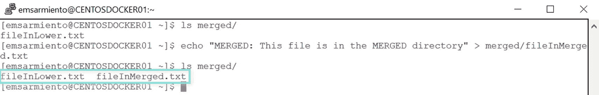

图 5-20：运行中的联合文件系统

这只是统一文件系统工作原理的一个方面，也是 Docker 如何利用它为容器创建可读写文件系统层的一个方面。你还需要了解其他方面，例如处理只读文件系统层和处理多个文件系统层。关于 OverlayFS 如何工作以及 Docker 如何利用它基于文件系统层构建镜像的一个很好的资源可以在这里找到：[*http://blog.programster.org/overlayfs*](http://blog.programster.org/overlayfs)。


### 遍历各层

让我们找到镜像中最底层的层以及其上的连续层。所有层都包含 `lower` 目录——最底层除外（如果它是最底层，当然就不需要了，这很合理）。我们可以利用这一信息，在 `/var/lib/docker/overlay2/` 目录中查找那个没有 `lower` 目录的目录。你可以像在 Windows 资源管理器中那样，手动搜索每个目录来找到那个没有 `lower` 目录（或者只有 `link` 文件和 `diff` 目录）的目录。但那很耗时。不如运行以下命令来完成：

```
find -maxdepth 1 -type d '!' -exec test -e "{}/lower" ';' -print
```

`find` 命令用于搜索 `/var/lib/docker/overlay2/` 目录，并使用了以下参数：

*   `maxdepth`：要遍历起点以下的层级数。值为 1 表示我们只想找下面一层的目录。
*   `type`：查找特定类型。值为 `d` 表示我们想要查找目录。
*   `!`：NOT 运算符。我们想对运算符后的条件进行求值，并检查其是否相反。在这个例子中，我们寻找的是**不**包含 `lower` 目录的文件夹。
*   `exec`：`find` 命令的参数，用于对匹配搜索表达式的文件或文件夹执行操作。
*   `test`：用于评估条件表达式。`-e` 参数评估 `lower` 目录是否存在。`{}` 代表当前正在处理的文件或目录的名称。
*   `print`：`find` 命令的参数，用于打印当前文件或目录的名称。

图 5-21 显示了运行该命令的结果。既然我们知道 `l` 目录包含符号链接，那么可以断定另一个目录就是最底层。你可以使用 `cat` 命令列出其内容来验证。注意，那里只有 `diff` 目录和 `link` 文件。另外，如果你查看 `link` 文件的内容，它会显示缓存 ID 值，该值是指向该目录的符号链接。

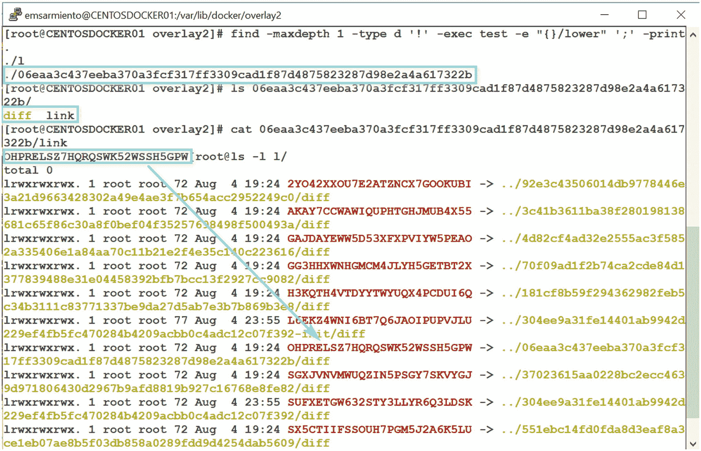

找到最底层之后，我们就可以开始搜索其他目录以找出连续的层。同样，你可以手动搜索，也可以使过程自动化。但如何知道紧挨着最底层之上的是哪个文件系统层呢？根据定义，最底层之上的下一个文件系统层的 `lower` 文件只包含一个指向其下方层（即最底层/基础层）的符号链接。再往上的层会有两个，以此类推。如果你查看 Linux 上 SQL Server 镜像的最顶层的 `lower` 文件，你会看到八个符号链接条目。图 5-22 显示了最顶层的 `lower` 文件。好吧，我作弊了，手动搜索了那个文件。但你不必这样做。

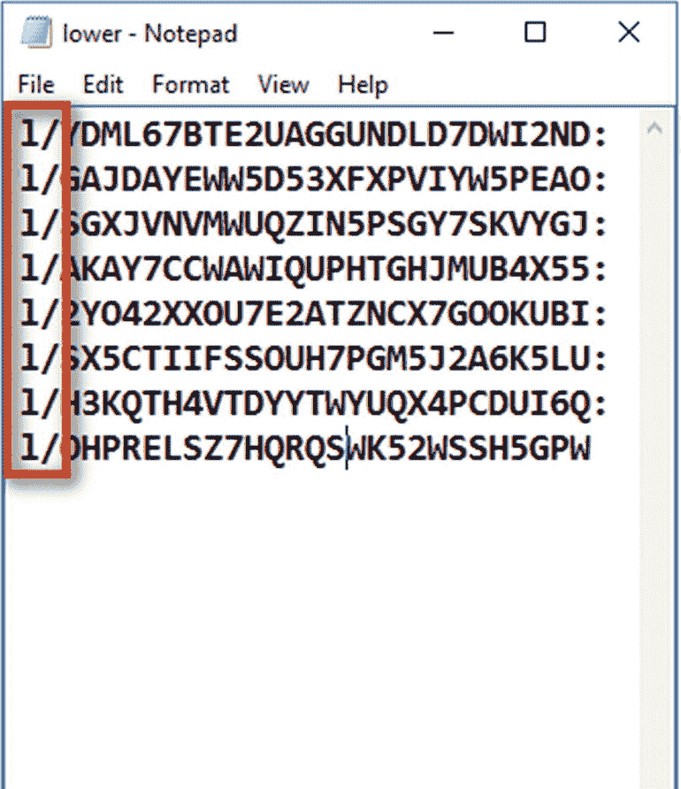

如果你观察文件内容，字符 `l/` 的存在位于符号链接之前，它指向符号链接所在目录的相对路径。我们可以利用这一点，通过计算每个 `lower` 文件中 `l/` 字符的数量，来弄清楚层层堆叠的文件系统层的顺序。运行以下命令即可。方法有点粗糙，但很有效。其概念类似于查找最底层，只是这个命令是在 `lower` 文件中搜索 `l/` 字符并显示每一行。图 5-23 显示了该命令的输出。

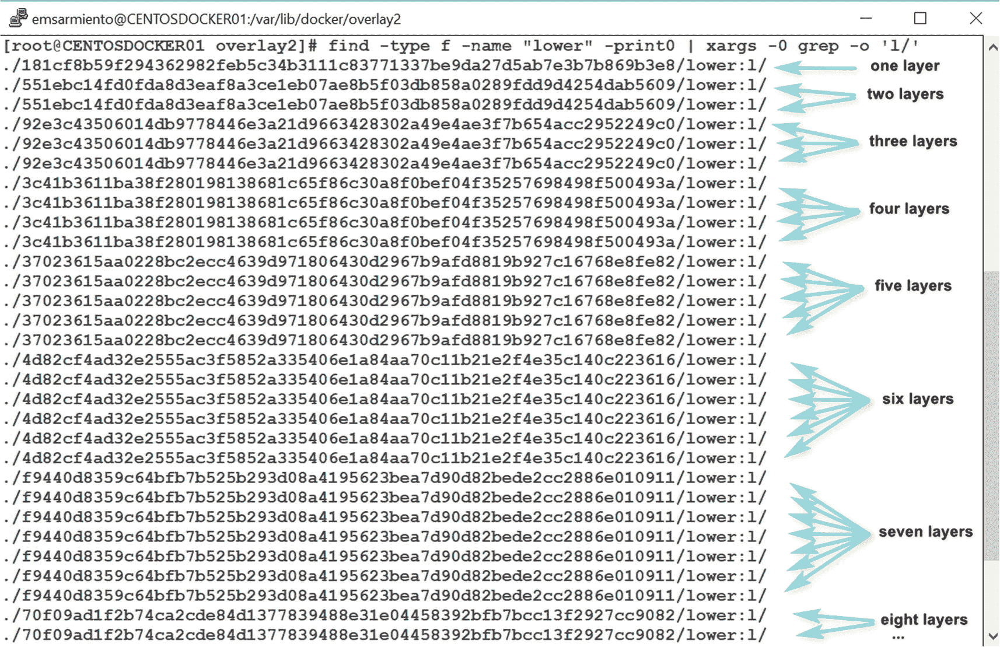

```
find -type f -name "lower" -print0 | xargs -0 grep -o 'l/'
```

使用目录名称重建图 5-1 中 Linux 上 SQL Server 镜像的文件系统层，结果如图 5-24 所示。

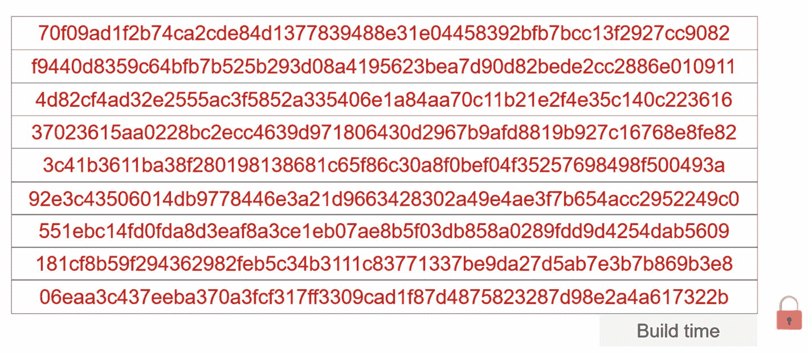


## 容器层

我们花了大量时间深入研究镜像的只读文件系统层，因为这为你理解作为容器的读写文件系统层打下了基础。回顾一下，容器本质上就是一个位于只读层之上的薄薄的读写层。在 Docker 守护进程根据目录内容构建好镜像的只读文件系统层之后，它会为容器创建这个薄薄的读写层。该读写层在 `/var/lib/docker/overlay2` 目录内创建，其文件结构和链接引用与只读层相同。

容器中的数据修改发生在这个读写层中。这是通过`写时复制`策略实现的。回想一下联合文件系统的工作原理。读写层的 `diff` 目录包含了容器的内容。如果你对任何一个只读文件系统层上存在的文件执行更改，联合文件系统将执行一个 `copy_up` 操作，将该文件从其所在文件系统层的 `diff` 目录复制到容器的 `diff` 目录中。文件一旦被复制，更改就会被执行。对该文件的后续更改将被写入读写层的 `diff` 目录。但是，与 SQL Server 不同——SQL Server 在记录被修改时，会将数据页（或区，取决于受影响的数据页数量）复制到数据库快照中——Docker 会复制整个文件。这使得它在处理像关系型数据库这样的大型、写密集型流程时效率低下。写入大量数据的容器将在读写层上需要更多的磁盘空间。处理关系型数据库等写密集型应用的存储需求将在第 7 章中讨论。

> 注意
>
> 我在这里使用 SQL Server 的数据库快照仅作为示例，以展示写时复制策略与容器的工作原理相似。然而，写入过程是相反的。对于 SQL Server 数据库快照，原始数据被写入快照中且不会被修改，从而为你提供数据库的某个时间点视图。而对于容器，原始文件被写入读写层，并且就是被修改的对象。

删除容器中的数据涉及在读写层的 `diff` 目录中创建一个 `whiteout` 文件。联合文件系统中的 `whiteout` 文件是一种特殊文件，带有 `.wh.` 扩展名，类似于你在办公用品店看到的白色修正带。这就像将文件涂成白色，从容器的角度看它似乎消失了。你看不到它，但它还在那里，就在白色涂层下面。

就像停止一个正在运行的虚拟机一样，停止容器并不会删除读写层。Docker 写入读写层的所有内容仍然保留在本地磁盘上。只有当你删除容器时，读写层的目录才会从磁盘上删除。想象一下，在你的容器内的 SQL Server 实例中创建用户数据库。数据和日志文件会在读写层上创建。如果你删除容器，SQL Server 的数据和日志文件也会被删除。我们需要能够以一种在容器外部处理 SQL Server 数据库的方式。我们将在第 7 章中更详细地讨论这一点。

