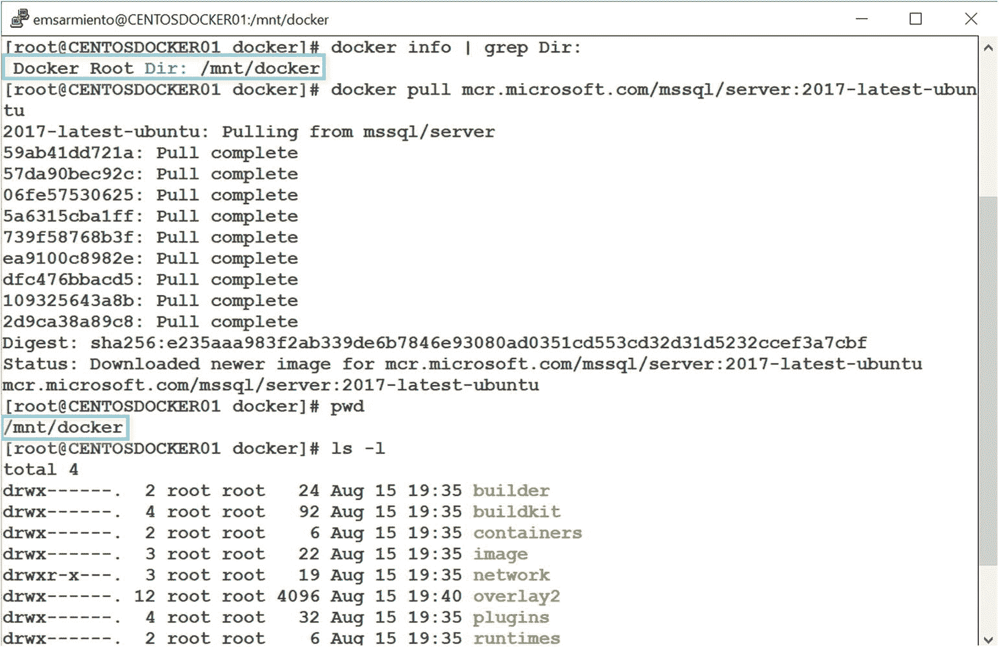
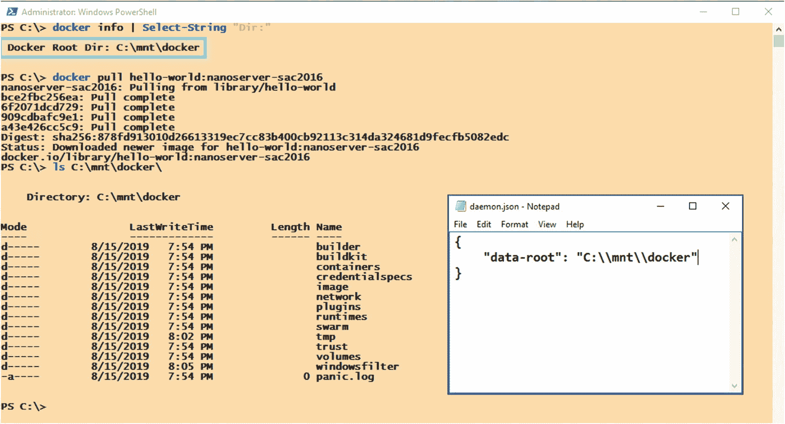
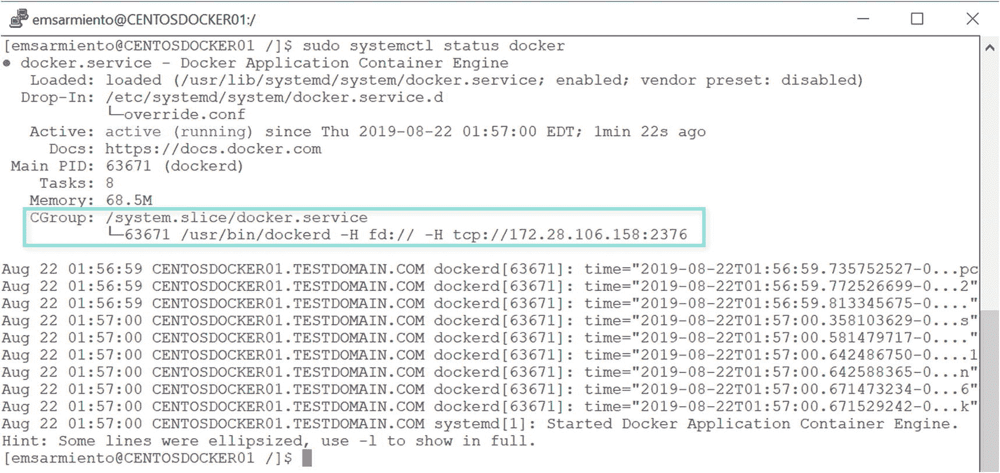

# 6. 管理和维护容器

> 永远不要害怕接手一个真正棘手的问题。当你解决它时，收益也会成倍增加。
>
> ——卡尔·格斯塔克

作为一名音乐家，使用数字音频工作站为创作音乐带来了很多机会。当我刚开始学习弹钢琴时，我只知道可以在键盘上演奏的 88 个不同的琴键。随着我逐渐加入不同的乐队演出，总是要求演出场地提供一台模拟立式钢琴变得不切实际。而且，在演出时携带一台 300 磅重的钢琴也是不可能的。那时我决定投资一台轻便的数字合成器。

有一次在准备我们的一场演出时，我注意到下一个乐队的键盘手架设了他的 MacBook Pro，并将其插入到数字合成器中。仅仅是一台 MacBook Pro 与乐器协同工作这个事实就引起了我的好奇心。我以前从未见过这种情况。我很确定他不是要在演出时写 Python 脚本。于是，我询问了他关于他的设备设置。他解释了 MacBook Pro 上的软件如何创造出不同的声音供他演奏时使用。他让我听了叠加了优美小提琴和弦乐的钢琴声，营造出一种宁静的感觉，仿佛在湖边度过一个安静的下午。一段琶音的电子音效能唤起欢快的感觉，让你忍不住想动起来。这是一个完全不同的音乐世界。我决定尝试一下，并在自己的 MacBook Pro 上试用了 Ableton Live 软件。我迷上了它。我开始制作自己的声音样本、音轨、循环乐段——任何能拓展我音乐创造力的东西。现在我的设备设置中除了数字合成器，还多了 MacBook Pro。

但是，使用任何新工具都会带来一系列新的挑战。我现在必须管理我的数字音频工作站创建的大型音频文件，四处移动它们以避免填满我的主硬盘。我还需要维护一份在不同场地和不同设备上演奏时所需的配置设置列表。而且，我创建的音频文件越多，就越需要妥善命名它们，以便我知道它们是什么以及如何使用。我最不希望发生的事情就是在演出过程中手忙脚乱地寻找一个急需的音频文件。

我确实说过，使用任何新的工具和技术都会带来一系列挑战。使用`docker`也是如此——或者你可能接触到的任何技术。本章将涵盖作为一名 Docker 管理者，你将执行的最常见任务，例如创建、启动和停止容器上的 SQL Server。在前面的章节中，你已经接触过一些我们将要使用的`docker`命令。所以，到这个阶段你应该已经熟悉了它们。我们还将探讨在默认设置之外对 Docker 守护进程进行配置更改。我不会涵盖任何 SQL Server 管理任务，因为我假设你已经熟悉这些了。毕竟，你是一名 SQL Server DBA，不是吗？

## 配置 Docker 守护进程

与默认的 SQL Server 安装类似，您从默认的 Docker 安装中获得的配置设置可以正常工作。但有一些您可以更改的配置设置，以提升作为 SQL Server 管理员使用 Docker 的整体体验。

有两种方法可以配置 Docker 守护进程。第一种是在启动 Docker 守护进程时使用标志，类似于在 SQL Server 中使用启动参数。第二种是使用 `daemon.json` 配置文件。

为了说明这两种选项的用法，假设您想测试新的 Docker 守护进程功能。除非您使用的是 Docker 守护进程的 Edge 通道——包含新功能但未经充分测试的版本——否则所有实验性功能都是关闭的。您肯定不希望在生产环境中部署非稳定版本。

### 使用 dockerd

要在启动 Docker 守护进程时启用标志，请运行 `dockerd` 命令并传递相应的标志。使用前面的例子来启用实验性功能，运行以下命令。与 Windows 服务类似，在运行此命令之前，Docker 守护进程应处于停止状态：

```
sudo dockerd –experimental
```

请注意使用 `dockerd` 命令启动 Docker 守护进程时使用 `sudo`——在 Linux 上您需要 `root` 权限。并且，与使用命令行启动 SQL Server 类似，在使用 `dockerd` 启动守护进程后，您需要打开另一个终端会话来与 Docker 交互。否则，当您退出当前终端会话时，可能会终止该进程。

在 Windows 上您可以执行相同的操作，但无需 `sudo`。

有关使用 `dockerd` 时可用的标志和选项的完整列表，请访问 [`docs.docker.com/engine/reference/commandline/dockerd/`](https://docs.docker.com/engine/reference/commandline/dockerd/)。在 Windows 上，可在 [`docs.microsoft.com/en-us/virtualization/windowscontainers/manage-docker/configure-docker-daemon#configure-docker-on-the-docker-service`](https://docs.microsoft.com/en-us/virtualization/windowscontainers/manage-docker/configure-docker-daemon#configure-docker-on-the-docker-service) 找到。

### 使用 daemon.json

`daemon.json` 文件包含您的 Docker 守护进程的配置设置。默认情况下，`daemon.json` 文件不存在。您必须手动创建它以在您的 Docker 守护进程上设置自定义配置。

在 Linux 上，该文件应存储在 `/etc/docker` 目录中。在 Windows 上，它应位于 `C:\ProgramData\docker\config` 文件夹中。

> **提示**
>
> 如果 `daemon.json` 文件已存在，请务必在修改前复制一份副本。在修改配置文件之前保留备份总是一个好主意。毕竟，如果配置更改没有产生预期效果，拥有一个可以用来回滚更改的备份比尝试记住您在更改前几分钟所做的操作要快得多。

您可以使用您喜欢的文本编辑器创建 `daemon.json` 文件，并将其复制到 Docker 主机上的相应目录。在 Linux 上，您需要 `root` 权限才能将文件复制到 `/etc/docker` 目录。

使用前面启用 Docker 守护进程实验性功能的相同示例，向其中添加以下内容：

```
{
  "experimental": true
}
```

创建并更新文件后，重新启动 Docker 守护进程。在 Linux 上运行以下命令来执行此操作：

```
sudo systemctl restart docker
```

在 Windows 上，这就像重新启动任何 Windows 服务一样。

> **提示**
>
> 处理 Linux 文件系统时不要感到不知所措。当您刚开始时，并不总是需要在命令行上操作。创建、复制或修改文件等任务可以使用基于 Windows 的应用程序完成。我为此使用一个名为 WinSCP 的工具。我将在 Windows 机器上使用文本编辑器创建文件，并使用 WinSCP 将其复制到 Linux 机器。在处理大多数配置设置时，您确实需要在 Linux 上拥有 `root` 权限。请参阅 *附录 A* 了解如何安装和配置 WinSCP 以连接到 Linux 机器。

如果您不需要在 Docker 守护进程上启用实验性功能，请务必还原更改。可以添加到 `daemon.json` 文件的配置选项的完整列表可在 [`docs.docker.com/engine/reference/commandline/dockerd/#daemon-configuration-file`](https://docs.docker.com/engine/reference/commandline/dockerd/#daemon-configuration-file) 找到。在 Windows 上，可在 [`docs.microsoft.com/en-us/virtualization/windowscontainers/manage-docker/configure-docker-daemon#configure-docker-with-a-configuration-file`](https://docs.microsoft.com/en-us/virtualization/windowscontainers/manage-docker/configure-docker-daemon#configure-docker-with-a-configuration-file) 找到。

这只是一个非常简单的例子，说明如何使用 `dockerd` 命令或 `daemon.json` 文件来更改您的 Docker 守护进程的配置。真正的价值在于知道如何使用这两种方法来配置 Docker 守护进程。

> **注意**
>
> 您可能想知道，“我该用哪一种来更改我的 Docker 守护进程配置？”要回答这个问题，请回想一下您在 SQL Server 中如何使用启动参数与 `sp_configure`。如果您要进行一次性更改（作为故障排除的一部分），您会在 SQL Server 中使用启动参数；例如使用 `-m` 参数进入单用户模式，使用 `-T` 指定跟踪标志，或使用 `-f` 以最小配置启动。如果您想进行永久性的配置更改，例如启用备份压缩、设置恢复间隔等，您会使用 `sp_configure`（尽管您可能会争辩说有些配置设置只能通过启动参数获得，而有些只能通过 `sp_configure` 获得）。类似地，对于一次性更改使用 `dockerd`，对于永久性更改使用 `daemon.json`。

## 更改默认镜像与容器目录

在使用 Docker 时，我遇到的最常见的问题之一就是磁盘空间管理。这难道不正是我们作为 SQL Server 数据库管理员也要面对的问题吗？你的数据库文件不断增长或备份文件占用过多空间，导致磁盘空间耗尽。这通常是由于疏忽或缺乏规划造成的。但对于像 Docker 这样的新兴技术——它们通常首先在开发和测试环境中被采用——在平台变得关键之前（还记得你是如何被迫将那些 Microsoft Access 数据库升级到 SQL Server 的吗？），规划甚至不会被考虑。当你刚起步时，磁盘空间不足可能不会给你带来太大问题。但最终，它会的。

回顾第 5 章，Docker 的默认根目录在 Linux 上是 `/var/lib/docker/overlay2` 目录，在 Windows 上是 `C:\ProgramData\docker\windowsfilter` 文件夹。你从 Docker Hub 拉取的 Docker 镜像以及容器文件都将存储在这些目录中。你可以通过修改 Linux 上的 `daemon.json` 文件并添加以下内容来更改这些默认位置：

```json
{
"data-root": "/mnt/docker",
"storage-driver": "overlay2"
}
```

`/mnt/docker` 目录将成为所有镜像和容器的新位置。确保在配置新的 Docker 根目录之前该目录已存在。

以下是在 Linux 上更改默认 Docker 根目录的步骤：

1.  停止 Docker 守护进程：

    ```bash
    sudo systemctl stop docker
    ```

2.  修改 `daemon.json` 文件以包含上述设置。

3.  启动 Docker 守护进程：

    ```bash
    sudo systemctl start docker
    ```

同样的步骤适用于 Windows。只需将 `/mnt/docker` 目录更改为一个有效的 Windows 目录，例如 `C:\\mnt\\docker`（注意使用两个反斜杠而不是一个，因为反斜杠字符在 Go 语言中有不同的解释），并删除 `"storage-driver": "overlay2"` 这一行。当然，使用服务管理控制台或命令行来停止和启动 Docker 服务。

你可以通过运行 `docker info` 命令，以及拉取一个新镜像并检查 `/mnt/docker/overlay2` 目录的内容来验证更改是否生效。图 6-1 显示了在 CentOS Linux 主机上的新 Docker 根目录。



图 6-1：CentOS Linux 主机上的新 Docker 根目录

图 6-2 显示了 Windows Server 主机上的新 Docker 根目录以及 `daemon.json` 文件的内容。



图 6-2：Windows Server 主机上的新 Docker 根目录

更改默认的 Docker 根目录会创建一个新的目录结构，但不会删除旧的结构。这也意味着 Docker 将不再知道包含所有已拉取镜像和已创建容器的旧目录——它们仍然在那里。如果你想要重用所有镜像层以避免再次拉取并回收磁盘空间，请在重启 Docker 守护进程之前，将整个 `/var/lib/docker` 目录移动到新目录中。否则，你将会复制镜像层并占用更多磁盘空间。配置新的根目录后，Docker 不会告诉你某个镜像是否已经存在——它已经不再感知旧的根目录了。

在 Linux 上使用以下命令将整个 `/var/lib/docker` 目录移动到新目录（在 Windows 上，则是简单的复制粘贴）。请确保在运行命令之前先创建目标目录。

```bash
mv /var/lib/docker/* /mnt/docker/
```

在步骤 #2 和 #3 之间添加此命令。如果是没有拉取过镜像的全新安装，则可以跳过此步骤。

## 停止并重启 Docker 守护进程

我可能有些超前，已经提到了停止并重启 Docker 守护进程，但并未演示。实际上，我在第 3 章“在 CentOS Linux 上安装 Docker”一节中已经介绍了如何启动 Docker 守护进程。学习这个命令对其他操作也很有用，比如停止和重启其他守护进程。另外，每当你对 Docker 做配置更改时，你都需要重启它。

运行以下命令以停止 Docker 守护进程：

```bash
sudo systemctl stop docker
```

运行以下命令以启动 Docker 守护进程：

```bash
sudo systemctl start docker
```

运行以下命令以重启 Docker 守护进程：

```bash
sudo systemctl restart docker
```

看，这很简单。

## 在 CentOS Linux 上为 Docker 守护进程配置远程访问

到目前为止，我们一直在使用 SSH 客户端远程连接到 Linux 主机上的 Docker 守护进程。虽然你可能认为这是“远程访问”，但 Docker CLI 客户端和 Docker 守护进程仍然在同一台主机上，这意味着两者是在本地交互。真正的远程访问是让你的 Docker CLI 客户端与远程的 Docker 守护进程交互，从另一台机器调用 Docker API。例如，在 Windows 机器上使用 Docker CLI 客户端连接到 Linux 主机上的 Docker 守护进程。默认情况下，Docker 守护进程绑定到 Unix 套接字而不是 TCP/IP 端口。为了能够远程访问 Docker 守护进程，你需要配置它监听一个 IP 地址和特定的端口号。

以下是在 Linux 上配置 Docker 守护进程远程访问所涉及过程的高级概述：

1.  使用 `systemd` 单元文件配置 Docker 守护进程的远程访问。
2.  通过配置双向 TLS 加密来保护 Docker 守护进程套接字。
3.  更新 `daemon.json` 以包含双向 TLS 加密的设置。
4.  启用防火墙端口以允许流量访问 Docker 守护进程。


## 使用 systemd 单元文件配置 Docker 守护进程的远程访问

我们将使用 `systemd` 来配置 Docker 守护进程的远程访问，而不是使用 `dockerd` 或 `daemon.json` 文件。Docker 文档提到了在 `daemon.json` 文件中设置 `hosts` 数组以允许远程访问 Docker 守护进程。遗憾的是，我已经根据文档测试了尽可能多的可能变体，但均未成功。因此，我尝试了文档中提到的其他方法。这就引出了使用 `systemd` 的方法。

`systemd` 提供了在 Linux 上控制程序和进程的标准流程。它是一个初始化系统和服务管理器，包含了按需启动守护进程、启动时的并行处理以及使用 Linux 控制组进行进程跟踪等功能。初始化系统是一个守护进程，在计算机启动时开始运行，并一直运行到计算机关机。在 `systemd` 中，一个 `单元` 指的是系统知道如何控制的任何资源。这些资源是通过称为单元文件的配置文件来定义的。你可以使用单元文件来定义这些资源在系统上的管理方式。除了使用 `dockerd` 标志和 `daemon.json` 外，Docker 守护进程也可以通过 `systemd` 单元文件进行配置。

**注意**

我没有将使用 `systemd` 作为配置 Docker 守护进程的方式包含在内，因为它需要了解 Linux 内部机制。由于 Docker 守护进程就像 Linux 上运行的任何其他守护进程一样，你使用 `systemd` 配置 Docker 的方式与配置其他守护进程的方式并无不同。但请务必非常小心。**只选择一种方式**来配置 Docker 守护进程。使用 `systemd`、`dockerd` 标志或 `daemon.json` 配置 Docker 可能会导致冲突，从而阻止 Docker 守护进程启动。

在此任务中，我们将使用 `systemd` 来修改默认的 Docker 配置：

1.  运行以下命令，使用 Linux 上的默认文本编辑器为 Docker 守护进程创建一个覆盖文件。覆盖文件是一种在不修改相应 `systemd` 单元文件的情况下更改守护进程行为的方法。`systemctl edit` 命令确保覆盖设置被正确加载。

```
sudo systemctl edit docker.service
```

2.  在文件中添加以下内容并保存：

```
[Service]
ExecStart=
ExecStart=/usr/bin/dockerd -H fd:// -H tcp://172.28.106.158:2376
```

将提供的 IP 地址替换为你的 CentOS Linux Docker 主机的 IP 地址。另外，Docker 守护进程默认监听的端口号是 2375（未加密）和 2376（加密）。端口 2376 将用于 Docker CLI 客户端与 Docker 守护进程之间的安全通信。

`-H` 标志将 Docker 守护进程绑定到一个监听套接字，可以是 Unix 套接字或 TCP/IP 端口。你可以指定多个 `-H` 标志来绑定多个套接字/端口，如示例所示。

对于 `ExecStart` 参数被指定两次，不要困惑。有些参数在设置新的覆盖值之前需要先被清除。`ExecStart` 参数就是其中之一。

3.  运行以下命令重新加载 `systemd` 单元文件：

```
sudo systemctl daemon-reload
```

4.  最后，重启 Docker 守护进程：

```
sudo systemctl restart docker
```

一旦完成，Docker 守护进程现在就被配置为监听一个 TCP/IP 端口，并且可以远程访问。你可以检查 Docker 守护进程的状态进行验证，如图 6-3 所示。



图 6-3
在 CentOS Linux Docker 主机上配置的 TCP 端口远程访问

此外，你可以使用以下 `netstat` 命令来验证 Docker 守护进程确实在监听端口 2376（如果你的 Linux 主机上没有安装 `netstat` 命令，请运行 `yum -y install net-tools` 命令来安装必要的软件包）：

```
sudo netstat -lntp | grep dockerd
```

你肯定需要知道如何使用 `vi` —— Linux 上的默认文本编辑器。否则，就在 Windows 上使用你喜欢的文本编辑器创建名为 `override.conf` 的覆盖文件。然后，你可以使用 WinSCP 将 `override.conf` 文件复制到 `/etc/systemd/system/docker.service.d/` 目录。如果你没有使用 `systemctl edit` 命令，则需要手动创建 `docker.service.d` 目录。

**提示**

在本章前面，我提到了使用带标志的 `dockerd` 或 `daemon.json` 文件来对 Docker 守护进程进行配置更改。我希望情况总是如此。但我使用开源软件的经验教会了我要预料到几个挑战。其中之一就是做事方式的不一致性。为远程访问配置 Docker 守护进程就是一个例子。在处理开源软件时，不一致性是意料之中的。我只是在设定合理的预期，以防你感到沮丧。


