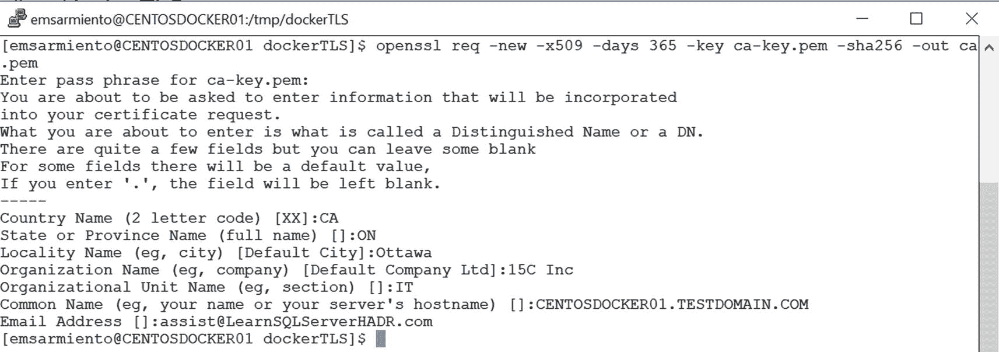
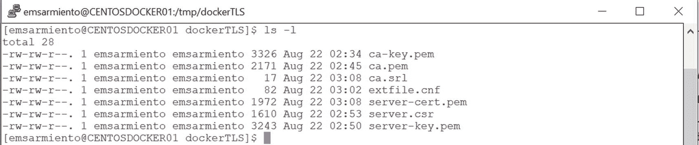
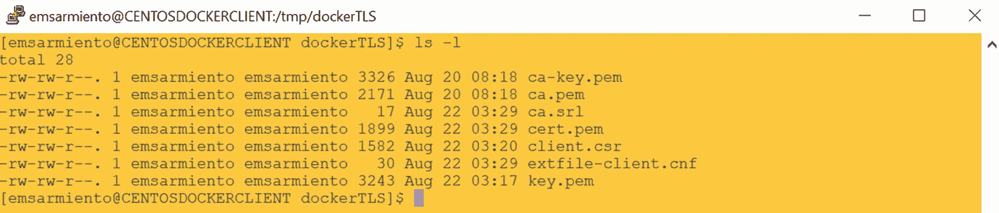

# 通过配置双向 TLS 加密来保护 Docker 守护进程套接字

既然 Docker 守护进程已在您的网络上可用，保护其免受不安全连接的影响便是您的责任。好消息是，Docker 守护进程只接受由受信任的证书颁发机构（CA）签署的证书所认证的客户端的连接。同样，Docker CLI 客户端也只连接到具有由该受信任 CA 签署的证书的 Docker 守护进程。如果您过去曾使用证书配置过 SQL Server 数据库镜像，那么此过程非常相似。在本示例中，我们将创建自己的证书，而不是使用来自受信任公共 CA 的证书。这不是在生产环境中会做的事情，但它确实能完成任务。

此过程将引导您为 Docker 守护进程配置双向 TLS 加密。在 CentOS Linux Docker 主机上：

1.  创建一个临时目录来存储 CA 私钥和公钥。稍后将引用此目录以指向证书的位置。

    ```
    mkdir /tmp/dockerTLS
    cd /tmp/dockerTLS
    ```

2.  运行以下 `openssl` 命令以创建 CA 私钥。系统提示时，提供私钥的密码短语。

    ```
    openssl genrsa -aes256 -out ca-key.pem 4096
    ```

3.  运行以下 `openssl` 命令以创建 CA 公钥。系统提示时，提供标识公钥的详细信息。图 6-4 提供了一个示例。对于 `Common Name` 字段，请务必提供您用于连接 Docker 守护进程的主机名，并且该主机名必须可在网络中解析。在此示例中，我的 CentOS Linux Docker 主机的完全限定域名（FQDN）是 `CENTOSDOCKER01.TESTDOMAIN.COM`。

    ```
    openssl req -new -x509 -days 365 -key ca-key.pem -sha256 -out ca.pem
    ```

    
    图 6-4 CA 公钥的详细信息

4.  运行以下 `openssl` 命令以创建服务器密钥：

    ```
    openssl genrsa -out server-key.pem 4096
    ```

5.  运行以下 `openssl` 命令以创建证书签名请求。确保 `Common Name` 值与您在步骤 3 中提供的 Docker 守护进程主机名相匹配。

    ```
    openssl req -subj "/CN=CENTOSDOCKER01.TESTDOMAIN.COM" -sha256 -new -key server-key.pem -out server.csr
    ```

6.  运行以下命令创建扩展配置文件。由于 TLS 连接可以通过 IP 地址和 FQDN 建立，因此在创建证书时需要指定 IP 地址。扩展配置文件将包含 Linux Docker 主机的 FQDN、其 IP 地址以及环回 IP 地址，以便您仍可以通过 TCP 端口本地连接到 Docker 守护进程。

    ```
    echo subjectAltName = DNS:CENTOSDOCKER01.TESTDOMAIN.COM,IP:172.28.106.158,IP:127.0.0.1 >> extfile.cnf
    ```

7.  运行以下命令追加扩展配置文件并添加扩展使用属性，使得 Docker 守护进程的密钥只能用于服务器认证：

    ```
    echo extendedKeyUsage = serverAuth >> extfile.cnf
    ```

8.  运行以下 `openssl` 命令，使用 CA 对公钥进行签名，并传入扩展配置文件：

    ```
    openssl x509 -req -days 365 -sha256 -in server.csr -CA ca.pem -CAkey ca-key.pem -CAcreateserial -out server-cert.pem -extfile extfile.cnf
    ```

您在 `/tmp/dockerTLS` 目录中应拥有以下文件，如图 6-5 所示。


图 6-5 完成所有步骤后创建的文件

现在我们准备好处理 Docker CLI 客户端了。在此示例中，Docker CLI 客户端也运行在一台名为 `CENTOSDOCKERCLIENT` 的 CentOS Linux 机器上。

在 CentOS Docker 客户端机器上：

1.  创建一个临时目录来存储 CA 私钥和公钥。稍后将引用此目录以指向证书的位置。

    ```
    mkdir /tmp/dockerTLS
    cd /tmp/dockerTLS
    ```

2.  运行以下 `openssl` 命令以创建客户端密钥：

    ```
    openssl genrsa -out key.pem 4096
    ```

3.  运行以下 `openssl` 命令以创建证书签名请求：

    ```
    openssl req -subj '/CN=client' -new -key key.pem -out client.csr
    ```

4.  运行以下命令创建一个扩展配置文件，以使客户端密钥适用于客户端认证：

    ```
    echo extendedKeyUsage = clientAuth > extfile-client.cnf
    ```

5.  将您在 Docker 守护进程主机上生成的 `ca.pem` 和 `ca-key.pem` 文件复制到客户端机器的 `/tmp/dockerTLS` 目录。您可以使用 WinSCP 或 Linux 上的 `scp` 命令来完成。您在 `/tmp/dockerTLS` 目录中应拥有以下文件，如图 6-6 所示。除非所有文件都可用，否则请勿进行下一步。

    
    图 6-6 完成所有步骤后创建的文件

6.  运行以下 `openssl` 命令生成已签名的证书，传入公钥、私钥和扩展配置文件。系统提示时，提供 CA 私钥的密码短语。

    ```
    openssl x509 -req -days 365 -sha256 -in client.csr -CA ca.pem -CAkey ca-key.pem -CAcreateserial -out cert.pem -extfile extfile-client.cnf
    ```

我们现在拥有了在 Docker CLI 客户端和远程 Docker 守护进程之间建立双向 TLS 加密所需的所有文件。但我们还没有完成。

## 更新 daemon.json 以包含双向 TLS 加密设置

我们必须告诉 Docker 守护进程强制执行加密和认证的远程连接。以下配置选项将被添加到 `daemon.json` 文件中：

*   `tlsverify`: 值为 `true` 时强制执行加密和认证的远程连接。
*   `tlscacert`: Docker 守护进程将仅信任由此 CA 签署的证书。
*   `tlscert`: TLS 证书文件的路径。
*   `tlskey`: TLS 密钥文件的路径。

将以下内容添加到 `daemon.json` 文件并保存。注意您在 Docker 主机上生成的文件的路径。

```
"tlscacert": "/tmp/dockerTLS/ca.pem",
"tlscert": "/tmp/dockerTLS/server-cert.pem",
"tlskey": "/tmp/dockerTLS/server-key.pem",
"tlsverify": true
```

更新 `daemon.json` 文件后，重启 Docker 守护进程：

```
sudo systemctl restart docker
```

## 启用防火墙端口以允许到 Docker 守护进程的流量

当您使用 Docker CLI 客户端本地连接到 Docker 守护进程时，您无需担心防火墙。这是因为您已经通过 SSH（在端口 22 上）登录到机器并在本地运行命令。启用对 Docker 守护进程的远程访问意味着您需要在 Linux 防火墙上打开端口 2376。

运行以下命令启用防火墙以允许端口 2376 上的远程连接。默认情况下，FirewallD 是 CentOS Linux 上可用的防火墙解决方案。

```
sudo firewall-cmd --zone=public --add-port=2376/tcp --permanent
```

运行以下命令重新加载新添加的防火墙规则：

```
sudo firewall-cmd --reload
```

启用防火墙端口后，使用 TELNET 测试到端口 2376 的连接。


