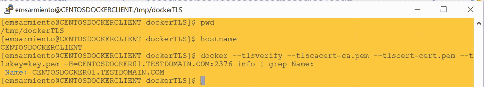
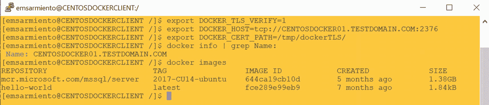
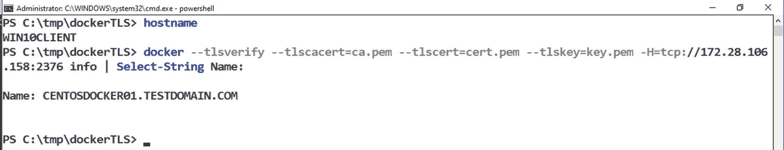
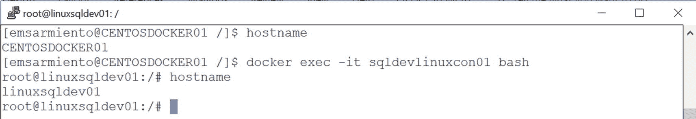
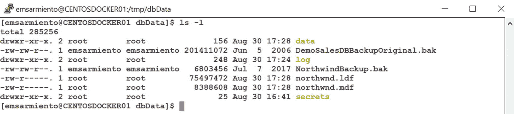
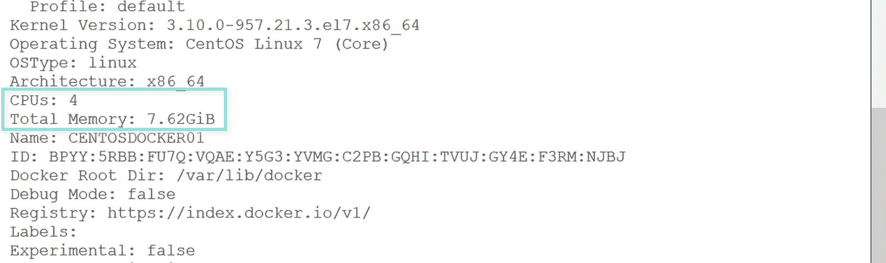
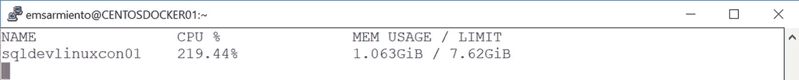
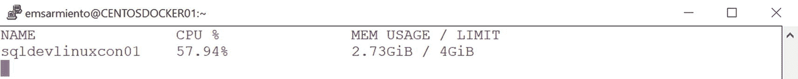

# Docker CLI 客户端配置与管理

## 测试远程客户端连接

当然，最终的测试是当你能够从一个 Docker CLI 客户端运行命令并连接到远程 Docker 主机时。运行以下命令连接到远程 Docker 主机。确保你位于`/tmp/dockerTLS`目录中，这样就不必提供公钥、签名证书和客户端密钥的绝对路径。

```
docker --tlsverify --tlscacert=ca.pem --tlscert=cert.pem --tlskey=key.pem -H=172.28.106.158:2376 info
```

`-H`参数指向远程 Docker 主机的 IP 地址。或者，你也可以使用主机名或 FQDN，前提是它可以在网络上解析。图 6-7 显示了在`CENTOSDOCKERCLIENT`上运行的 Docker CLI 客户端连接到在`CENTOSDOCKER01`上运行的远程 Docker 主机。



**图 6-7**

Docker CLI 客户端连接到远程 Docker 主机

你还可以通过在当前会话中使用`export`命令设置环境变量，避免在运行`docker`命令时反复提供远程连接相关参数。在运行任何`docker`命令之前，运行以下命令。图 6-8 显示了设置环境变量并运行`docker`命令连接到远程 Docker 主机。



**图 6-8**

设置环境变量以将 Docker CLI 客户端连接到远程 Docker 主机

```
export DOCKER_TLS_VERIFY=1
export DOCKER_HOST=tcp://172.28.106.158:2376
export DOCKER_CERT_PATH=/tmp/dockerTLS/
```

## 清理

在为 TLS 双向认证配置好客户端和服务器后，你不再需要证书签名请求。你可以继续删除客户端和服务器机器上的`client.csr`和`server.csr`文件。对于扩展配置文件`extfile-client.cnf`和`extfile.cnf`，也可以做同样的处理。

此外，为防止密钥被意外覆盖，移除它们的写入权限。在客户端机器上运行以下命令，使密钥仅对你的用户账户可读：

```
chmod -v 0400 ca-key.pem key.pem
```

类似地，在服务器机器上运行以下命令：

```
chmod -v 0400 ca-key.pem server-key.pem
```

你需要对证书做同样的处理，以防止它们被意外覆盖。在客户端机器上运行以下命令，使证书仅对你的用户账户可读：

```
chmod -v 0400 ca.pem cert.pem
```

类似地，在服务器机器上运行以下命令：

```
chmod -v 0400 ca.pem server-cert.pem
```

在 Windows 上配置 Docker CLI 客户端的过程是相同的。但由于 Windows 上原生不支持 OpenSSL，因此需要手动安装。请参考*附录 A*在 Windows 工作站上安装和配置 OpenSSL。

一旦你进入 OpenSSL 命令提示符，就可以运行与 Linux 相同的命令，但无需`openssl`命令。例如，命令`openssl genrsa -out key.pem 4096`应该写为`genrsa -out key.pem 4096`。图 6-9 显示了一台 Windows 10 机器运行 Docker CLI 客户端连接到 Linux Docker 主机。不过要注意`-H`参数，其格式类似于`DOCKER_HOST`环境变量中定义的格式。此外，不是使用`export`关键字，而是使用`set`关键字来定义环境变量。



**图 6-9**

Windows 10 主机上的 Docker CLI 客户端连接到远程 Linux Docker 主机

## 配置 Docker CLI Bash 自动补全

人们常说，最懒惰的 IT 专业人士是那些从开发者转行做系统管理员的人。根据我的经验，这话可能有点道理。我在 2005 年从 Visual Basic 转到了 C#.NET，因为 Visual Studio 有 IntelliSense。当 Monad（PowerShell 的原名）推出时，我立即将所有基于 VBScript 的管理脚本转换过来，以利用 PowerShell 命令 shell 中的 Tab 自动补全功能。我总是想着各种方法让我的工作更轻松。

这引导我配置 Docker CLI bash 自动补全。Bash 自动补全允许你在编写`docker`命令时使用 Tab 自动补全。虽然这原本是为开发者设计的，但你同样可以用它来简化 Docker 的管理。在使用 Docker 补全脚本之前，你需要先在你的 Linux 发行版上启用 bash 自动补全功能。

在 Ubuntu 上，运行以下命令刷新软件包数据库并安装 bash 自动补全包：

```
sudo apt update
sudo apt install bash-completion
```

在 CentOS 上，运行以下命令：

```
sudo yum -y install bash-completion
```

启用 bash 自动补全后，通过运行以下命令将 Docker 补全脚本放置到`/etc/bash_completion.d/`目录中。请确保每次更新 Docker 后都运行此命令：

```
sudo curl https://raw.githubusercontent.com/docker/docker-ce/master/components/cli/contrib/completion/bash/docker -o /etc/bash_completion.d/docker.sh
```

注销当前会话并重新登录。你可以尝试输入`docker images m`然后按 TAB 键。这可以为你节省输入 SQL Server on Linux 镜像名称`mcr.microsoft.com/mssql/server:2017-CU14-ubuntu`的时间。你还可以用它来显示特定命令的可用参数。例如，尝试运行`docker run –`然后按 TAB 键。它将显示`docker run`命令的所有可用参数。


## 启动和停止容器

你在第 4 章已经有过运行容器的体验。使用 `docker run` 命令是启动容器最快的方式。如果镜像在本地磁盘中不存在，它会先拉取镜像然后启动它。传递给 `docker run` 命令的不同参数决定了容器的运行方式。我们在第 4 章已经介绍了在容器上运行 SQL Server 时你会用到的最常见参数，因此请参考那些内容。

一个好的实践是，使用 `docker pull` 命令将所有需要的镜像预先拉取到你的 Docker 主机上，这样在运行或启动容器时就不会花费额外时间。一旦拉取完毕，你就可以使用 `docker create` 命令预创建容器。下面的命令创建一个 SQL Server on Linux 容器但不立即运行它。它与我们在第 4 章使用的命令几乎相同，只是没有 `-d` 参数（后台运行模式）。

```
docker create -e "ACCEPT_EULA=Y" -e "SA_PASSWORD=mYSecUr3PAssw0rd" -p 1433:1433 --name sqldevlinuxcon01 -h linuxsqldev01 mcr.microsoft.com/mssql/server:2017-CU14-ubuntu
```

仅运行 `docker ps` 命令，你不会看到已创建的容器。你需要使用 `docker ps` 命令的 `-a` 参数来显示所有容器，无论其状态如何。如果你想更精确地查看，可以使用 `docker ps` 命令的 `-f` 参数，根据特定条件进行过滤。下面的命令显示所有已创建的容器：

```
docker ps -a -f status=created
```

然后，你可以使用下面的 `docker start` 命令，只需传入容器名称或 ID：

```
docker start sqldevlinuxcon01
```

停止容器就像运行 `docker stop` 命令并传入容器名称或 ID 一样简单：

```
docker stop sqldevlinuxcon01
```

你可能会忍不住使用 `docker kill` 命令来强行终止一个正在运行的容器。请不要这样做。我们讨论的是一个容器上的 SQL Server 实例，而不仅仅是一个随机的应用程序。回想一下，SQL Server 必须正确关闭，以便提交或回滚所有事务，将所有脏页写入磁盘，然后在事务日志中写入一条记录。运行 `docker kill` 命令将阻止 SQL Server 执行干净的关闭过程，并可能导致数据丢失，甚至更糟的数据损坏。`docker stop` 命令会优雅地向容器内运行的进程（这里是 SQL Server）发送 SIGTERM 信号（终止请求）。这是在 Linux 环境下关闭 SQL Server 的正确方式。

另外，请记住，停止容器并不会将其从 Docker 主机上移除。这就是为什么你无法创建另一个同名容器的原因。如果你想创建一个使用之前用过的相同名称的新容器，你需要先删除旧的容器。

**提示**

你开始看到在 `docker run` 命令中使用 `--name` 参数的好处了。我们在 `docker start` 和 `docker stop` 命令中都使用了容器名称——sqldevlinuxcon01——而不是容器 ID。这使得操作容器更加容易，而不必依赖系统生成的 ID。在创建 SQL Server 容器时，始终在 `docker run` 命令中使用 `--name` 参数。

一个你可以使用的技巧是，使用 `-q` 参数显示所有容器及其对应的容器 ID，如下列命令所示：

```
docker ps -a -q
```

然后，你可以将这个命令的结果传递给 `docker start` 或 `docker stop` 命令，分别来启动或停止所有容器，如下所示：

```
docker start $(docker ps -a -q)
```

## 删除容器和镜像

如果你想清理你的 Docker 主机，删除旧的和不需要的容器，你需要使用 `docker rm` 命令。但是，你无法删除一个正在运行的容器。必须先停止容器，然后才能删除它，如下列命令所示：

```
docker stop sqldevlinuxcon01
docker rm sqldevlinuxcon01
```

互联网上（甚至 Docker 官方文档中）有很多示例演示了在 `docker rm` 命令中使用 `-f` 参数来同时停止和删除容器。请避免这种诱惑。在 `docker rm` 命令中使用 `-f` 参数类似于运行 `docker kill` 命令，会导致 SQL Server 突然终止。

处理镜像则是另一回事。记住，容器只是一个位于镜像只读文件系统层之上的读写文件系统层，这意味着你可以删除所有基于该镜像的容器而不影响镜像本身。然而，当你删除一个镜像后，除非通过再次从仓库拉取使该镜像在 Docker 主机上可用，否则你将无法再基于它创建新容器。同样地，当一个镜像正被一个运行中的容器使用时，你也无法删除它。你必须先停止并删除所有使用它的容器，然后才能删除该镜像。下面的命令展示了如何使用 `docker rmi` 命令删除镜像，遵循事件顺序——从停止和删除容器到删除镜像：

```
docker stop sqldevlinuxcon01
docker rm sqldevlinuxcon01
docker rmi mcr.microsoft.com/mssql/server:2017-CU14-ubuntu
```

## 与运行中的容器交互

我在第 4 章提到过，我不太喜欢登录到服务器并与它们直接交互。除非为了故障排除目的，我宁愿远程连接它们——对于容器也是如此。但如果确实需要，我会使用 `docker exec` 命令。这允许我在一个正在运行的容器内执行命令。假设我想在我现有的 SQL Server on Linux 容器内运行一个 bash shell，以便检查文件系统结构。运行下面的 `docker exec` 命令，带上 `-i`（交互）和 `-t`（伪终端）参数，并传入你想运行的命令（`bash`）。图 6-10 显示了终端如何从以我自己的身份登录的 `CENTOSDOCKER01`（我的 Linux Docker 主机名）变为以 root 身份登录的 `linuxsqldev01`（SQL Server on Linux 容器名）。我现在可以从操作系统层面与容器进行交互操作。



图 6-10 在运行中的容器上运行 bash

```
docker exec -it sqldevlinuxcon01 bash
```

类似地，你可以运行以下命令在 SQL Server on Windows 容器内启动一个 PowerShell 命令行：

```
docker exec -it sqldevwincon01 powershell
```

过去，终止 bash 或 PowerShell shell 也会终止容器。现在不会了。然而，通过按 `Ctrl+PQ` 退出交互式 shell 仍然是一个好习惯。


## 在主机和容器之间共享文件

可能会有一些情况，你需要将 Docker 主机上的文件与容器共享。例如，你可能希望还原 SQL Server 数据库的备份到容器内的 SQL Server 实例中。你可以将备份文件复制到 Docker 主机上的某个目录，并使其对容器可用。这正是 `docker run` 命令的 `-v` 或 `--volume` 参数的用武之地。首先，在你的 Linux Docker 主机上创建一个 `/tmp/dbData` 目录。然后，将你的数据库备份复制到该目录中。使用以下命令，将 Linux Docker 主机上的 `/tmp/dbData` 目录挂载到容器内的 `/var/opt/mssql` 目录。这和我们一直在使用的 `docker run` 命令相同，只是多了 `-v` 参数。

```
docker run -e "ACCEPT_EULA=Y" -e "SA_PASSWORD=mYSecUr3PAssw0rd" -p 1433:1433 --name sqldevlinuxcon01 -d -h linuxsqldev01 -v /tmp/dbData:/var/opt/mssql mcr.microsoft.com/mssql/server:2017-CU14-ubuntu
```

你可以将容器内的 `/var/opt/mssql` 目录看作是 Linux Docker 主机上的 `/tmp/dbData` 目录，就像一个网络共享文件夹。存储在容器内 `/var/opt/mssql` 目录中的任何数据都将持久化在 Linux Docker 主机的 `/tmp/dbData` 目录上，这意味着你可以删除 SQL Server 容器并保留你的数据库文件。你不仅在 Linux Docker 主机和容器之间共享了数据和文件，还持久化了容器内创建的数据。更多细节将在第 7 章介绍。

一旦 `/tmp/dbData` 目录被挂载到容器中，SQL Server 实例就可以访问其中的备份文件。然后，你就可以在容器内的 SQL Server 实例上还原备份了。当然，由于容器内的 `/var/opt/mssql` 目录指向 Linux Docker 主机上的 `/tmp/dbData` 目录，你创建的每个数据库也将存储在 `/tmp/dbData` 目录中。你可以通过还原数据库备份然后删除容器来测试这一点。图 6-11 显示了删除 SQL Server 容器后，Linux Docker 主机上 `/tmp/dbData` 目录的内容。



图 6-11 在 Linux Docker 主机和容器之间共享数据

在 Windows 上运行以下命令以创建一个容器，并将 Windows Docker 主机上的 `C:\dbData` 文件夹映射到容器内的 `C:\dbData` 文件夹。该文件夹不必存在于容器内部，它会在运行容器的过程中被创建。注意这里使用正斜杠 (/) 而不是反斜杠 (\) 来定义路径。过去，由于 Go 语言对字符的解释方式，只有正斜杠字符在定义路径时有效。现在，两种都可以使用。为了与 Windows 和 Linux 路径保持一致，我使用正斜杠。

```
docker run -e "ACCEPT_EULA=Y" -e "SA_PASSWORD=mYSecUr3PAssw0rd" –p 1433:1433 --name sqldevwincon01 -d -h winsqldev01 –v  C:/dbData:C:/dbData microsoft/mssql-server-windows-developer
```

另一种在主机和容器之间共享文件的方法是使用 `docker cp` 命令。使用相同的例子，如果你想将 Linux Docker 主机上的 `/tmp/dbData/NorthwindBackup.bak` 文件复制到 `sqldevlinuxcon01` 容器内，可以运行以下命令。你可以使用容器 ID 或容器名称，但我更喜欢使用容器名称，这样我能确切知道我在操作什么。

```
docker cp /tmp/dbData/NorthwindBackup.bak sqldevlinuxcon01:/var/opt/mssql/data
```

在 Windows 上，只需将路径替换为适当的 Windows 目录路径，并注意使用正斜杠代替反斜杠。

```
docker cp C:/dbData/NorthwindBackup.bak sqldevwincon01:C:/
```

你也可以反过来，使用以下命令将文件（本例中是 `testDB.bak` 文件）从容器复制到 Linux Docker 主机：

```
docker cp sqldevlinuxcon01:/var/opt/mssql/data/testDB.bak /tmp/dbData/
```

显然，在 Docker 主机和容器之间共享文件的方法不止一种。

## 配置容器资源

默认情况下，容器没有资源限制。它可以使用主机内核调度器允许的尽可能多的给定资源。就 SQL Server 而言，这不是一件好事。我们知道 SQL Server 会占用系统中所有可用的内存资源。同样，它会占用所有可用的 CPU 核心。想象一下这会对你的许可产生什么影响（如果这是测试环境，并且你只运行企业评估版、开发版或速成版，那问题不大）。但如果你已经为 Docker 主机上的所有 CPU 核心购买了许可，就不需要担心 SQL Server 的许可问题了。

配置容器消耗的 CPU 和内存资源的方式类似于为虚拟机分配资源。使用 `docker run` 命令，添加 `--cpus` 参数来指定容器可以使用的 CPU 资源数量，并添加 `--memory` 参数来设置内存上限（你可能会说这可以在 SQL Server 内部通过 `sp_configure` 完成，但如果在容器级别完成会好得多，因为你不能在同一个 Linux 主机上运行多个 SQL Server 实例）。在我的测试环境中，我的 Linux Docker 主机配置为拥有 4 个 CPU 核心和 8GB 内存，如图 6-12 所示。



图 6-12 为 Docker 主机配置的硬件资源

运行以下带有格式化参数的 `docker stats` 命令，可以显示我的 SQL Server on Linux 容器在运行多个查询时的 CPU 和内存利用率，如图 6-13 所示。显然，它占用了 Docker 主机上大部分的 CPU 和内存资源（使用了全部 7.62GB 内存）。



图 6-13 容器资源利用率

```
docker stats sqldevlinuxcon01 --format "table {{.Name}}\t{{.CPUPerc}}\t{{.MemUsage}}"
```

运行以下命令来创建并运行 SQL Server on Linux 容器，分别使用 `--cpus` 和 `--memory` 参数，仅分配 2 个 CPU 和 4GB 内存：

```
docker run -e "ACCEPT_EULA=Y" -e "    SA_PASSWORD=mYSecUr3PAssw0rd" -p 1433:1433 --name sqldevlinuxcon01 -d -h linuxsqldev01 --cpus="2" --memory=4g mcr.microsoft.com/mssql/server:2017-CU14-ubuntu
```

在限制了容器可以使用的 CPU 和内存资源量之后，在 SQL Server 实例上重新运行我的查询，使用 `docker stats` 命令显示新的资源利用率，如图 6-14 所示。当然，你的测试结果取决于许多不同的因素——硬件配置、SQL Server 实例配置、数据库架构、索引、查询等等。这只是为了演示如何配置容器资源利用率。



图 6-14 配置容器 CPU 和内存资源利用率后

配置容器资源利用率的更多方法请访问：[`docs.docker.com/config/containers/resource_constraints/`](https://docs.docker.com/config/containers/resource_constraints/)。


