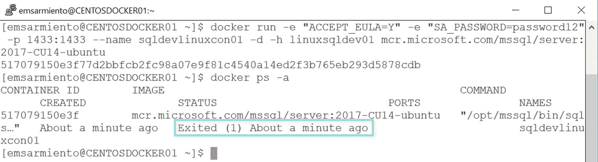
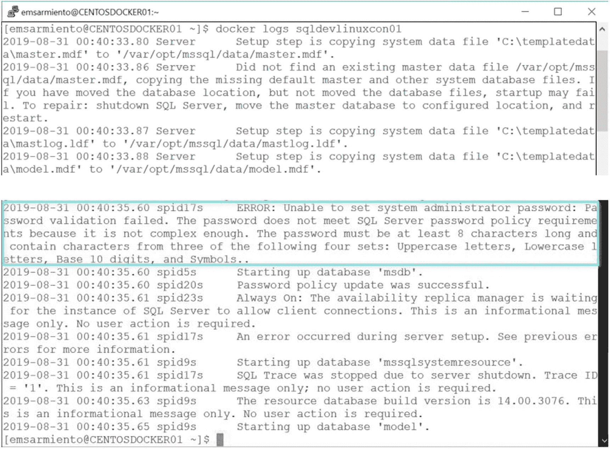
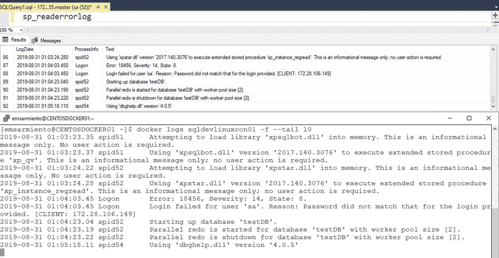

# 探索容器日志

在`第 4 章`中，我讨论了未能满足 SQL Server 密码复杂性策略如何可能导致容器无法启动。如果它运行在 Windows 或 Linux 主机上，我本可以轻松地使用文本编辑器打开 SQL Server 错误日志来检查可能的原因。但由于 SQL Server 错误日志位于容器内部，除非容器启动，或者将`/var/opt/mssql`目录挂载到 Linux Docker 主机上，否则我无法访问它。这就像试图访问一个已停止的虚拟机内部的 SQL Server 错误日志。好在 Docker 通过`docker logs`命令暴露了这些日志。

## 使用`docker logs`查看容器日志

以下命令将创建一个新的 Linux 上的 SQL Server 容器。请注意`SA_PASSWORD`参数值如何不符合 SQL Server 密码复杂性策略。

```
docker run -e "ACCEPT_EULA=Y" -e "SA_PASSWORD=password12" -p 1433:1433 --name sqldevlinuxcon01 -d -h linuxsqldev01 mcr.microsoft.com/mssql/server:2017-CU14-ubuntu
```

如果使用`docker ps -a`命令检查所有容器的状态，您会看到容器立即退出，如图 6-15 所示。



图 6-15：Linux 上的 SQL Server 容器在启动后立即终止

正如我在`第 4 章`中提到的，我花了很多时间试图找出导致容器停止的原因。直到我查看了日志，才发现真正的问题所在。使用`docker logs <容器名称>`命令可以查看容器内部生成的 SQL Server 错误日志，如图 6-16 所示。在发现真正的问题与`SA_PASSWORD`参数值有关后，我进行了必要的修改并重新运行了命令。



图 6-16：运行`docker logs`以探索 SQL Server 错误日志

## 关于 Windows 行为的重要说明

与 Linux 不同，在 Windows 上未能满足 SQL Server 密码复杂性策略不会终止容器，也不会在 SQL Server 错误日志中创建条目。容器将继续运行，但不允许您使用提供的`sa`凭据登录。您将需要运用您的 DBA 技能，使用`docker exec`命令以交互方式登录到容器，并在单用户模式下启动 SQL Server 实例，以便更改`sa`密码。

## 实时查看日志

您还可以使用带有`-f`参数的`docker logs`命令来实时查看 SQL Server 错误日志。我发现这在排查 SQL Server 相关问题时，比运行`sp_readerrorlog`要好得多，因为我可以在事情发生时准确看到正在发生的情况。这就像在 SQL Server 错误日志中拥有一个实时跟踪。图 6-17 并排展示了使用`sp_readerrorlog`和`docker logs`命令的情况。



图 6-17：使用`sp_readerrorlog`与`docker logs`命令探索 SQL Server 错误日志的对比

