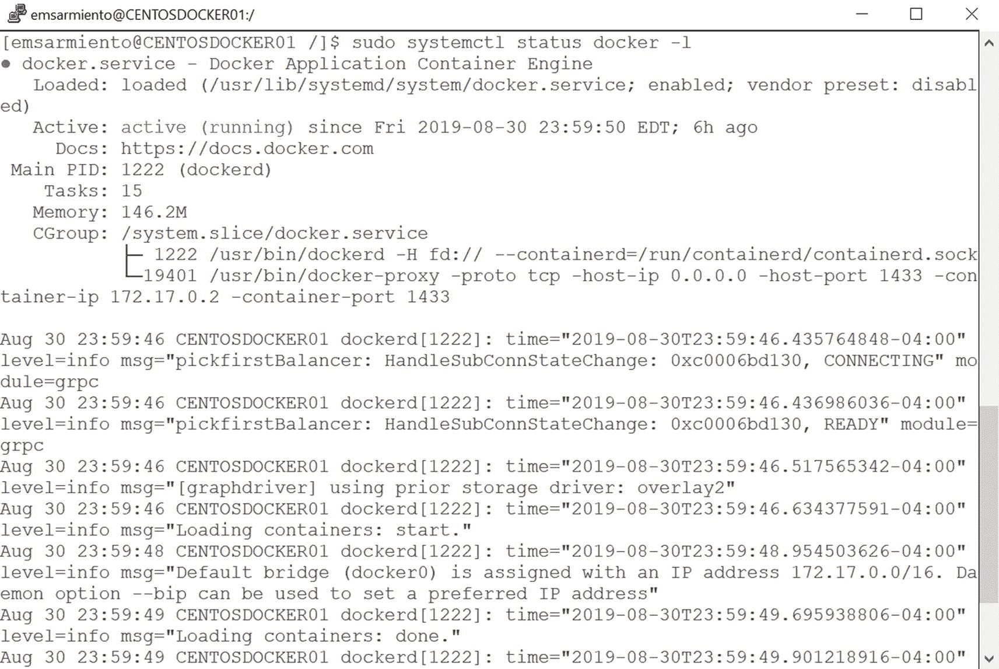
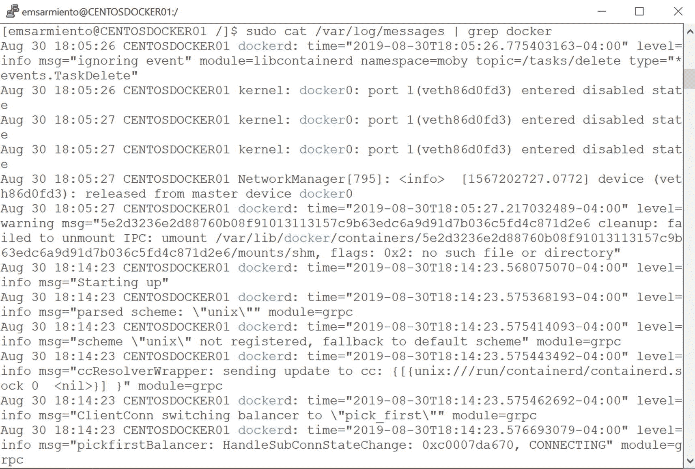

# 检查 Docker 守护进程的状态

了解 Docker 守护进程的状态也是确保其平稳运行的关键。在需要进行故障排除时，它也能引导您发现问题。在`第 3 章`于 Linux 主机上安装 Docker 守护进程后，我们做的一件事就是使用以下命令检查其状态。`-l`参数会显示完整消息，而不会用省略号截断。图 6-18 显示了 Linux 主机上 Docker 守护进程的状态。

```
sudo systemctl status docker -l
```



图 6-18：在 Linux 中显示 Docker 守护进程的状态

由于 Docker 就像其他任何 Linux 守护进程一样，它也会将其日志发送到`systemd`日志。您可以将`systemd`日志视为 Windows 事件日志。通过运行以下命令，您可以从`systemd`日志访问所有系统事件：

```
sudo journalctl
```

但是，鉴于它包含所有系统事件和日志，信息量可能有点大。我们只想要来自 Docker 守护进程的系统日志。要显示`systemd`日志中的 Docker 守护进程日志，请运行以下`journalctl`命令。如果需要显示每个条目的更详细信息，也可以传递`-o verbose`参数。

```
sudo journalctl -u docker
```

这些日志存储在 Ubuntu 的`/var/log/syslog`文件或 CentOS 的`/var/log/messages`文件中。您可以使用以下命令检索与 Docker 相关的事件。只需根据您的 Linux 发行版替换适当的文件名即可。图 6-19 显示了在 CentOS Docker 主机上运行该命令时显示的与 Docker 相关的事件。

```
sudo cat /var/log/messages | grep docker
```



图 6-19：在 Linux 中显示 Docker 守护进程的状态

在 Windows 主机上，由于事件被写入 Windows 事件日志，您可以筛选应用程序日志以仅显示来自`docker`的事件源。或者，您可以使用以下 PowerShell 命令：

```
Get-EventLog -LogName Application -Source Docker
```

