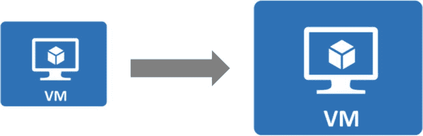
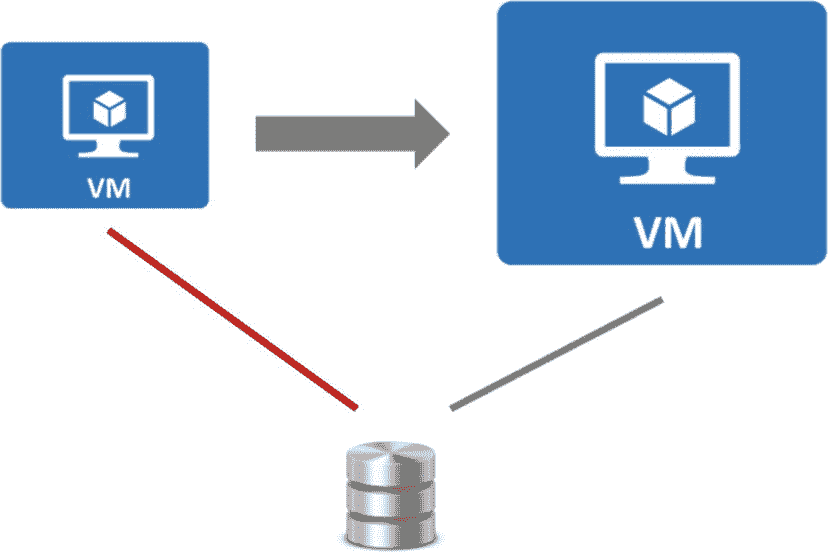
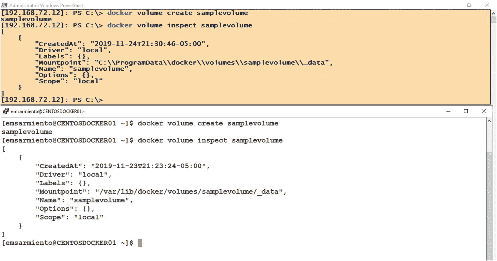
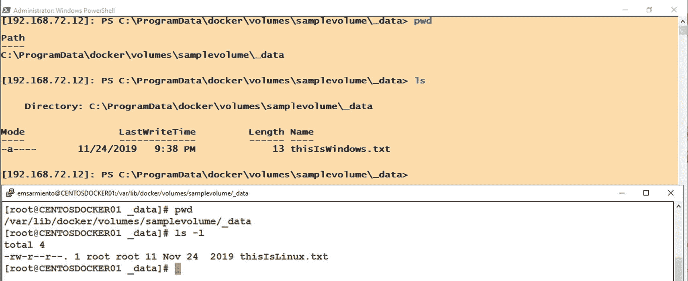
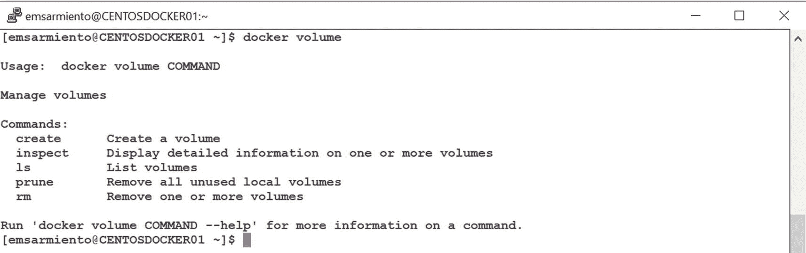
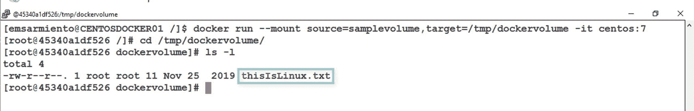
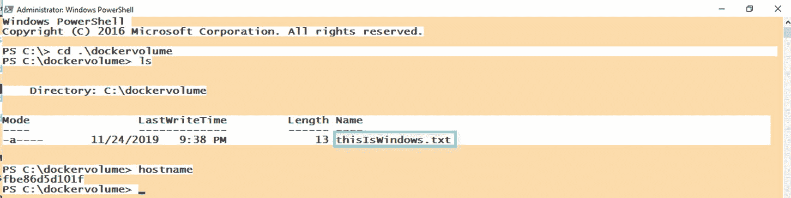
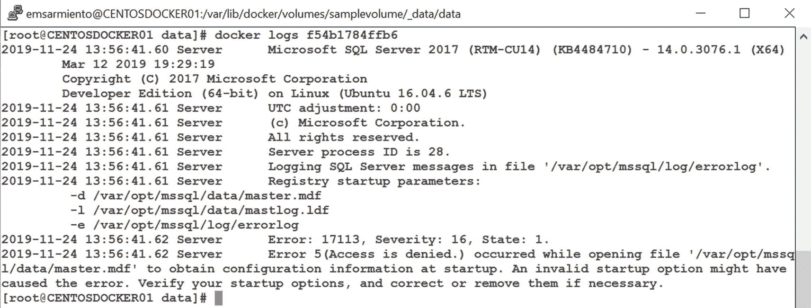

# 云服务商如何实现基础设施即服务

您是否曾好奇过，像亚马逊网络服务（AWS）、微软 Azure 或谷歌云平台这样的云服务商，如何能以极短的停机时间轻松扩展虚拟机的规模？他们会告诉您选择一个更大的虚拟机规格并重启机器。仅此而已。起初，我对这种“最小停机时间的扩展”方法持怀疑态度，因为它违背了我所知的关于升级和扩展服务器的一切认知。我作为数据中心工程师从事这项工作多年，这肯定不是几分钟就能完成的——尤其是对于拥有大型数据库的 SQL Server 而言。于是，我在微软 Azure 和 AWS 上都进行了尝试。图 7-1 展示了云服务商从概念上如何实现这种虚拟机的扩展方法。



*图 7-1：虚拟机如何在云端以最小停机时间进行扩展*

我感到震惊。它确实如文档所述那样有效。但我仍未完全信服。我结合自己所有关于扩展运行 SQL Server 数据库的服务器的知识，开始进行思想实验（您知道的，就是那种我们用来假装自己比普通数据库管理员聪明的实验）。以下是事实。

SQL Server 数据库本质上就是文件——`MDF`、`NDF`和`LDF`文件——数据库引擎通过访问这些文件来读写数据。这些文件存储在连接到具有计算资源（CPU 和内存）的服务器的存储子系统上。如果我需要扩展一台服务器以增加计算能力，并要求停机时间极短，我通常会有另一台安装了相同版本和版本的操作系统及 SQL Server 的服务器可用。然后，我会开始在机器之间复制数据库，使用`数据库镜像`或`日志传送`。如果有可用的存储资源，我会复制整个存储子系统——同时让目标机器上的 SQL Server 数据库引擎保持停止状态——而不仅仅是复制数据库。一旦准备好切换到扩展后的机器，我只需停止源机器，完成复制过程，然后在目标机器上启动 SQL Server 数据库引擎。停止源机器上的 SQL Server 数据库引擎会使其干净地关闭所有数据库，然后终止服务。这涉及提交或回滚事务、将所有脏页写入磁盘，然后在事务日志中写入一个条目。在目标机器上启动 SQL Server 数据库引擎会使其运行恢复过程——读取事务日志并在将数据库联机之前提交或回滚事务。自 SQL Server 诞生以来，它就是这样工作的。所以，这里没什么新东西。

**提示**

文章《Understanding Logging and Recovery in SQL Server》（理解 SQL Server 中的日志记录和恢复）包含了更多关于 SQL Server 在日志记录和恢复方面内部原理的信息。这是基础性信息，其概念也适用于除 SQL Server 之外的所有商业关系数据库管理系统。请访问 [`https://docs.microsoft.com/en-us/previous-versions/technet-magazine/dd392031(v=msdn.10)`](https://docs.microsoft.com/en-us/previous-versions/technet-magazine/dd392031%2528v%253Dmsdn.10%2529) 查阅该文章。

还记得我说的思想实验吗？如果不再需要为源和目标机器分别配备两个独立的存储子系统来存放数据库文件，而是简单地将存储与服务器解耦呢？如果存储不是直接连接到服务器，而我们只是有一个指向存储的指针呢？服务器可以访问远程存储，SQL Server 数据库引擎也可以访问这些文件。将计算与存储解耦，使您能够以最小的停机时间执行扩展过程，因为您所需要做的就是将新的计算资源指向旧的存储。这不已经在 SQL Server 2012 中可用了吗——将数据库文件存储在`SMB`文件共享中？SQL Server 2014 中呢——将数据库文件存储在`Azure Blob 存储`中？

**注意**

当被问及我跟上并掌握新技术的秘诀时，我通常的回答是“不要忘记旧的”。有趣的是，我们看到这些新技术特性要么是旧技术的改进，要么是旧技术的组合。以`SQL Server Always On 可用性组`为例。它是`数据库镜像`和`Windows Server 故障转移群集`的结合——这两者自 SQL Server 2005 起就已可用（故障转移群集则更早）。可读的辅助副本呢？它是`行版本控制`的实时实现，同样，这个特性自 SQL Server 2005 起就已可用。SQL Server 2008 中引入的`文件流`特性呢？它是`内存中 OLTP`的支柱。我可以没完没了地列举每个新版 SQL Server 引入的不同特性，并且我能找到它们在某个旧特性中的根源。要么是微软已经预见到了未来并正在引领市场走向他们的方向，要么是他们非常擅长最大化利用现有的技术投资。我认为这是一个绝妙的策略。我猜我的主日学老师甚至在 Oracle 与 Neo 进行那场对话之前就对技术有所了解。她一直告诉我《圣经》中一句非常著名的话：“已有的事，后必再有；已行的事，后必再行。日光之下，并无新事。”

啊，原来他们就是这样做的。图 7-2 展示了云服务商通过将计算与存储解耦，从概念上如何实现虚拟机的这种扩展方法。



*图 7-2：计算与存储解耦使得虚拟机能够以最小的停机时间进行扩展*

仔细想想，我们几十年来一直在使用这种方法，自从 2000 年代初`存储区域网络（SAN）`出现以来就是如此。服务器（计算）运行应用程序，而数据存储在其外部——即存储中。进行这个思想实验让我想起了 2006 年为一个大型 SQL Server 2000 `故障转移群集实例（FCI）`所做的迁移项目。由于 SQL Server `FCI`的计算与存储是解耦的，我们通过将其连接到现有的`SAN`并（当然经过适当验证后）将其加入群集，相当迅速地更换了其中一个有问题的故障转移群集节点。这也让我想起了 2010 年做的另一个数据中心迁移项目。遵循前面描述的工作流顺序，并在地理位置之间复制存储子系统，使我能够在不到一小时内将 400 多台 SQL Server 物理机从洛杉矶的一个数据中心迁移到拉斯维加斯的另一个数据中心。

由于虚拟机只是一个存储在磁盘上的文件系统格式，加上代表计算资源（CPU、内存、网络）的元数据，扩展起来就容易多了。只需将存储从旧虚拟机重定向到新虚拟机即可。云服务商可以在后台通过自动化的工作流过程完成这一切，包括在源和目标虚拟机上分别正确停止和启动 SQL Server 服务的步骤，只要底层硬件拥有支持新虚拟机的适当计算资源。


## Docker 卷

容器短暂且不可变的概念，与计算和存储解耦的设计，共同使得 Docker 能够运行像关系型数据库这样的有状态应用。尽管容器最初是为运行无状态应用而设计的，但将数据存储在容器之外，使你能够利用其短暂和不可变的特性，同时也能在你决定删除程序（我指的是容器）时保留数据。

回想第 5 章，容器由一个存储在 Docker 主机本地存储上的文件系统层组成。该文件系统层构成了容器本身，并与其生命周期绑定。文件系统层——包括你在其中存储的数据——在创建容器时被创建，在删除容器时被删除。非常直接，对吧？为了将计算与存储解耦，我们需要一个存在于容器之外的对象。这时就需要 Docker 卷。

Docker 卷是一个表示容器外部文件系统的对象。它是容器联合文件系统之外的一个目录，在 Docker 主机的文件系统上作为一个普通的目录存在。Docker 卷是持久化容器生成和使用的数据的首选方式。我喜欢把 Docker 卷想象成一个网络共享文件夹——它在操作系统（容器）内看起来像一个文件夹，但实际上是外部的。卷存在于容器之外，允许你向其中添加任意多的数据而不影响容器的大小，这对于 SQL Server 数据库来说是完美的。而且，因为它是一个存在于容器之外的对象，所以使用其专属的 `docker volume` 子命令进行管理。例如，如果你想创建一个 Docker 卷，可以运行以下命令。请务必提供一个有意义的名称。否则，Docker 会为它分配一个 64 字符的 GUID 值作为名称。我相信在读完第 5 章后，你肯定不想再看到更多那样的 64 字符 GUID 值名称了。

```
docker volume create samplevolume
```

默认情况下，创建 Docker 卷会在主机上创建一个目录，在 Linux 中位于 `/var/lib/docker/volumes`，在 Windows 中位于 `C:\ProgramData\docker\volumes`。

创建 Docker 卷后，你可以使用 `docker volume inspect` 命令检查其元数据：

```
docker volume inspect samplevolume
```

图 7-3 展示了在 Windows 主机和 Linux 主机上创建的 Docker 卷的元数据。请注意以下信息：



图 7-3
创建和检查 Docker 卷元数据

*   **驱动程序**：这显示了存储卷驱动程序的名称。默认情况下，Docker 会使用内置的 `local` 驱动创建卷。这意味着这些卷只在其创建所在的主机上的容器可用。
*   **挂载点**：这显示了 Docker 主机本地文件系统中目录的完整路径。当你将卷挂载到容器时，容器中生成的任何数据都将存储在这里。

因为 Docker 卷本质上只是文件系统层中的目录，我可以直接从主机向这些目录添加和修改文件，而无需运行容器。

**提示**

在 Linux 上工作时，请始终注意权限。在 Windows 中，我只需是本地管理员组的成员就可以访问 `C:\ProgramData\docker\volumes` 目录，但在 Linux 中情况并非如此。`root` 用户拥有 `/var/lib/docker/volumes` 目录（以及 `/var/lib/docker` 下的所有内容）。为了直接访问这些目录并进行任何更改，你需要拥有 `root` 权限。你可以切换到 `root` 用户，或者在命令前加上 `sudo`。

图 7-4 显示了我分别在 Linux 主机和 Windows 主机上复制到 Docker 卷中的一个简单文件。请记住，我当前没有任何正在运行的容器。



图 7-4
对 Docker 卷进行更改

你可以使用 `docker volume ls` 命令列出所有可用的 Docker 卷。最后，你可以使用 `docker volume rm` 命令删除特定的 Docker 卷，如下所示：

```
docker volume rm samplevolume
```

我不会删除这里创建的卷。我将在下一节中将其与一个容器一起使用并作为卷挂载。

你可以运行 `docker volume` 命令（如图 7-5 所示）来显示管理 Docker 卷的可用子命令列表。



图 7-5
列出管理 Docker 卷的所有命令

## 将卷挂载到容器

让我们使用上一节创建的 Docker 卷，并将其挂载到容器。对于 Linux 容器，我将使用 CentOS 7 镜像，并将 `samplevolume` 卷挂载到它。使用 `docker run` 命令的 `--mount` 参数，如下所示。我传入了 `-it` 参数（`i` 用于交互，`t` 用于伪 TTY 或终端会话），以便检查其内部的文件系统。`docker run` 命令的 `--mount` 参数使用易于理解的 `key=value` 对。在提供的示例中，`source` 是 Docker 卷的名称，`target` 是容器内的目录。

```
docker run --mount source=samplevolume,target=/tmp/dockervolume -it centos:7
```

你将看到在创建容器之前复制到卷中的 `thisIsLinux.txt` 文件。图 7-6 展示了从容器内部看到的该文件。



图 7-6
将卷挂载到 Linux 容器并显示其内容

对于 Windows 容器，我将使用 Windows Server 2016 Nano Server 镜像，并将 `samplevolume` 卷挂载到它。但我不使用 `docker run` 命令的 `--mount` 参数，而是使用 `-v`（或 `--volume`）参数。这是在 Windows Server 容器中挂载卷的支持方式。有关如何处理 Windows Server 容器中的持久存储，请参考 [*https://docs.microsoft.com/en-us/virtualization/windowscontainers/manage-containers/persistent-storage*](https://docs.microsoft.com/en-us/virtualization/windowscontainers/manage-containers/persistent-storage)。

```
docker run -v samplevolume:c:\dockervolume -it microsoft/nanoserver:sac2016 powershell
```

你将看到在创建容器之前复制到卷中的 `thisIsWindows.txt` 文件，如图 7-7 所示。



图 7-7
将卷挂载到 Windows 容器并显示其内容


### 选择 `-v` 还是 `--mount`

除了 Windows Server 容器和 Linux 容器之间的支持差异外，您可能想知道 `docker run` 命令的 `-v` 和 `--mount` 参数之间还有什么区别。 `-v` 参数出现得更早，因此您会在文档和在线资源中看到更多它的用法。 `--mount` 参数是在 Docker 17.06 版本中才引入的。最初，`-v` 参数用于独立容器，而 `--mount` 参数用于 Docker Swarm 中的服务。现在，您可以在两种场景下都使用 `--mount` 参数。此外，`--mount` 参数的语法通过显式使用 `key=value` 对，更易于理解。请看这个将卷挂载到 Linux 容器的示例 `docker run` 命令。

如果目录不存在，这两个参数都会在 Docker 主机上创建该目录。但它们不会告诉您您试图挂载到容器上的卷是否已经存在。这对于任何其他类型的应用程序来说都没问题，但对于 SQL Server 来说肯定不行。想象一个在 Linux 容器上运行的 SQL Server，它使用一个卷来存储系统数据库和用户数据库。如果您启动一个新容器并挂载另一个 SQL Server 容器已在使用的现有卷，您会收到一个 `Error 17113`，如图 7-8 所示，并附有 `Access is denied`（访问被拒绝）的错误信息。这是因为现有容器中的 `sqlservr` 进程已经对用于运行 SQL Server 实例的系统数据库文件持有独占锁。



图 7-8

将卷挂载到一个新的 SQL Server 容器，而该卷已被现有的 SQL Server 容器使用

除非您是在 Windows 容器（或就此而言，任何 Windows Server 容器）上部署 SQL Server，否则建议在新部署中使用 `--mount` 参数。更多信息，请参阅 Docker 关于使用卷的文档：[*https://docs.docker.com/storage/volumes/*](https://docs.docker.com/storage/volumes/)。

### 在容器之间共享卷？

在我研究如何在容器之间共享数据时，Docker 卷这个话题经常被提及。这并不奇怪，因为连 Docker 都推荐这样做。当您阅读关于使用卷的文档时，这是列出的优势之一：*卷可以在多个容器之间更安全地共享。*

等等，什么？Docker 容器运行时引擎的创造者 Docker，告诉你要使用卷以便在多个容器之间共享它们？你一定是在开玩笑吧！而且其他所有人也都这么说。

在完成了之前章节中提到的“最小化停机时间的向上扩展”方法的思考实验后，我决定再次整合我对 SQL Server 的了解，并审视关于 Docker 卷的这个说法是否合理。那么，我们来分析一下。SQL Server 数据库引擎会为访问数据库文件发起独占锁。它这样做是因为能够使用数据库的一部分前提是打开属于它的所有文件并执行恢复操作。如果 SQL Server 数据库引擎对所有数据库文件都持有独占锁，那么其他进程——比如另一个 SQL Server 数据库引擎——就不可能获得对同一组数据库文件的独占访问权。Microsoft 建议将 SQL Server 数据库文件排除在防病毒扫描之外是有原因的：就是为了确保在 SQL Server 进程需要使用这些文件时，它们没有被锁定。更别提那些绕过 SQL Server API 在执行备份时静默数据库文件的第三方工具了。那些你以为是来保护你的工具，恰恰就是造成灾难的元凶。

鉴于 SQL Server 进程需要对数据库文件持有独占锁，让多个 SQL Server 容器访问同一个卷是没有意义的。我重申一遍：让多个 SQL Server 容器访问同一个卷是没有意义的。还记得图 7-8 中的错误信息吗？我希望我已经说得很清楚了。

为 Docker 说句公道话，既然容器最初是为无状态应用程序设计的，那么让多个容器访问同一个卷的做法是完全合理的。假设你有一个所有应用程序通用的日志记录模块。该模块可以在一个容器中实现，并将日志文件写入一个可以在多个日志记录容器之间共享的卷中。由于大多数日志应用程序主要是写入密集型，读取访问非常少（除非在某个心情不佳的审计员突然要求提供详细审计报告时），将日志文件存储在单个卷中具有“单一事实来源”的好处。另外，你也不必进行那些提取-转换-加载（ETL）或提取-加载-转换（ELT）过程，因为所有数据都存储在一个地方——这个卷。

这一点值得重申：让多个 SQL Server 容器访问同一个卷是没有意义的。


