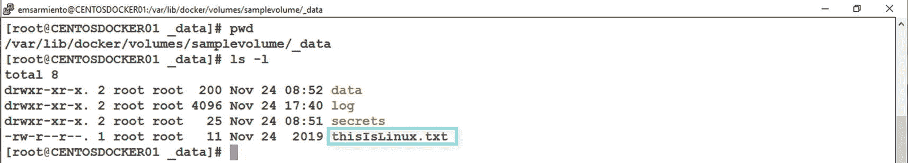
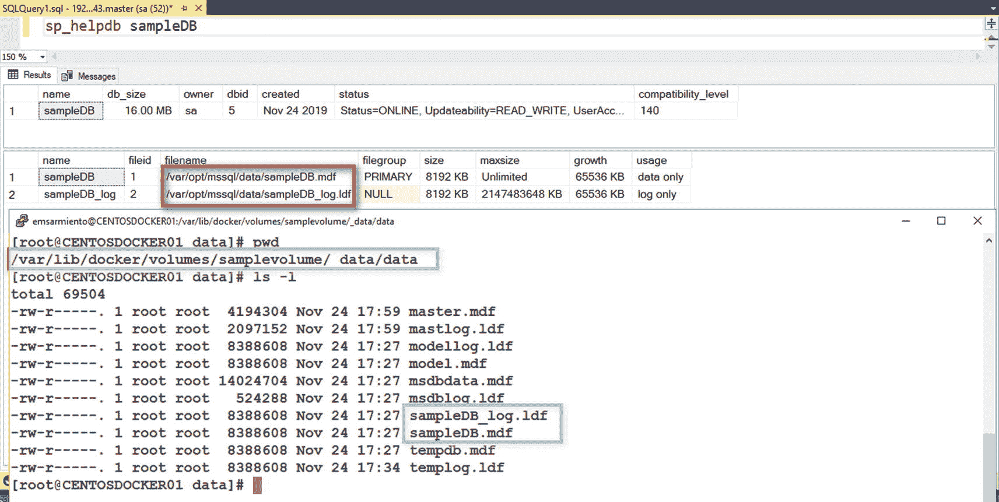
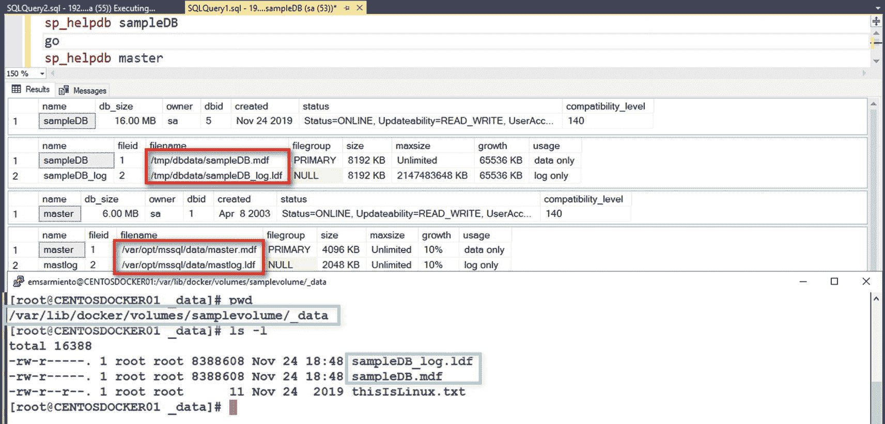
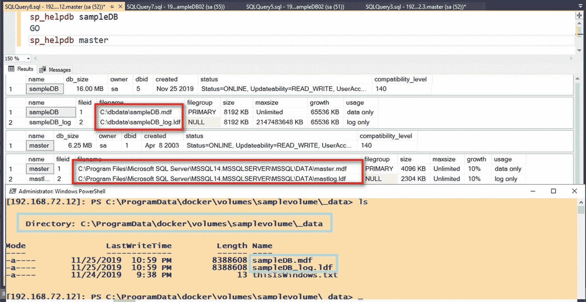
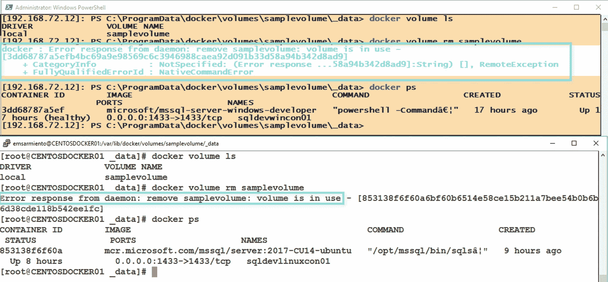
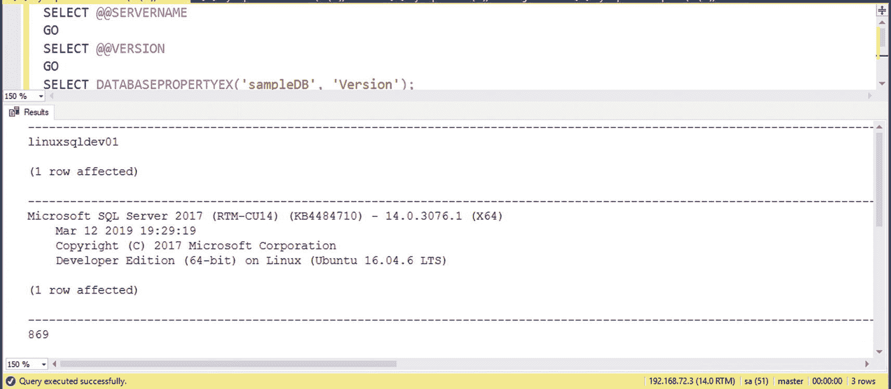
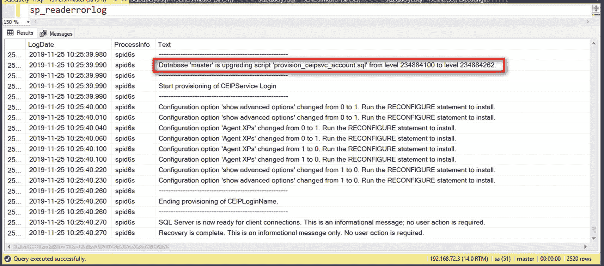
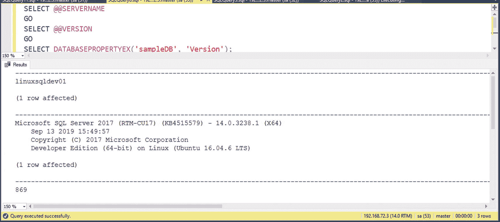

# 在容器中利用卷与 SQL Server

在第 6 章中，我在“在主机和容器之间共享文件”一节重点介绍了卷的使用。既然你已经理解了 Docker 卷及其工作原理，就很清楚这就是我们在容器中运行 SQL Server 时持久化数据的方式。

在 Linux 主机上运行以下命令，将已创建的卷`samplevolume`附加到 Linux 容器上的 SQL Server：

```bash
docker run -e "ACCEPT_EULA=Y" -e "SA_PASSWORD=mYSecUr3PAssw0rd" -p 1433:1433 --name sqldevlinuxcon01 -d -h linuxsqldev01 --mount source=samplevolume,target=/var/opt/mssql mcr.microsoft.com/mssql/server:2017-CU14-ubuntu
```

`/var/opt/mssql`目录是 Linux 中 SQL Server 的默认目录。该目录包含以下结构：

*   `data`：包含系统数据库文件、用户数据库文件和事务日志文件的目录
*   `log`：包含 SQL Server 错误日志文件、默认跟踪文件和默认扩展事件会话的目录
*   `secrets`：包含为 SQL Server 实例生成的服务主密钥的目录

在创建 Linux 容器上的 SQL Server 期间，`/var/opt/mssql`目录的内容作为安装过程的一部分被复制到容器中。因为我们告诉 Docker 将容器内的`/var/opt/mssql`目录挂载到`samplevolume`卷，所以该目录的内容会在 Docker 主机的本地文件系统中创建——即`/var/lib/docker/volumes/samplevolume/_data`。就像图 7-6 中一样，你会看到在容器创建前复制到卷中的`thisIsLinux.txt`文件。图 7-9 展示了从 Docker 主机文件系统内部看到的该文件以及`/var/opt/mssql`目录的内容。



图 7-9

挂载到 Linux 容器上 SQL Server 的卷的内容

容器启动并运行后，我可以在 SQL Server 中创建一个示例用户数据库，数据库文件将在`samplevolume`卷中创建。图 7-10 展示了从容器文件系统和 Docker 主机文件系统内部看到的数据库文件。是的，我确实创建了一个名为`sampleDB`的示例数据库。



图 7-10

在卷中创建的 SQL Server 数据库文件

## 将系统数据库和用户数据库放置在不同位置

请记住，由于 Linux 中 SQL Server 的默认目录是我们挂载到卷的位置，因此系统和用户数据库都将在同一位置创建。但没有任何限制阻止你保持系统数据库的默认数据库文件位置，而仅为用户数据库使用卷。在 Linux 主机上运行以下命令，将已创建的卷`samplevolume`附加到 Linux 容器上的 SQL Server，使用容器内的`/tmp/dbdata`目录作为用户数据库文件位置。请务必停止并删除现有的 Linux 容器上的 SQL Server，以便重用容器名称和端口号。

```bash
docker run -e "ACCEPT_EULA=Y" -e "SA_PASSWORD=mYSecUr3PAssw0rd" -p 1433:1433 --name sqldevlinuxcon01 -d -h linuxsqldev01 --mount source=samplevolume,target=/tmp/dbdata mcr.microsoft.com/mssql/server:2017-CU14-ubuntu
```

在我的示例中，我还清理了`samplevolume`卷中与 SQL Server 相关的内容，只保留了`thisIsLinux.txt`文件。删除容器不会删除卷的内容。请记住，卷存在于容器之外。我还使用了以下`CREATE DATABASE`命令来创建示例数据库。注意`target`目录——`/tmp/dbdata`的使用。

```sql
CREATE DATABASE [sampleDB]
ON PRIMARY
(NAME = N'sampleDB', FILENAME = N'/tmp/dbdata/sampleDB.mdf')
LOG ON
(NAME = N'sampleDB_log', FILENAME = N'/tmp/dbdata/sampleDB_log.ldf')
```

图 7-11 显示了默认 SQL Server 目录内的系统数据库和`samplevolume`卷内的示例用户数据库。



图 7-11

在卷中创建的 SQL Server 用户数据库

## 在 Windows 容器上配置卷

实际上，这就是 Windows 容器上 SQL Server 的配置方式。与 Linux 容器上 SQL Server 将整个`/var/opt/mssql`目录复制到容器不同，公开可用的 Windows 容器上的 SQL Server 仍然利用默认的 SQL Server 目录——`C:\Program Files\Microsoft SQL Server\MSSQL{nn}.MSSQL\`。将卷挂载到 Windows 容器上的 SQL Server 只会在容器文件系统内创建目标目录，它不会更改默认数据库文件位置，因为 SQL Server 实例已经安装好了。

在 Windows Server 主机上运行以下命令，将已创建的卷`samplevolume`附加到 Windows 容器上的 SQL Server，使用容器内的`C:/dbdata`目录。同样，请务必停止并删除现有的 Windows 容器上的 SQL Server，以便重用容器名称和端口号。

```powershell
docker run -e "ACCEPT_EULA=Y" -e "SA_PASSWORD=mYSecUr3PAssw0rd" -p 1433:1433 --name sqldevwincon01 -d -h winsqldev01 -v samplevolume:C:/dbdata microsoft/mssql-server-windows-developer
```

图 7-12 展示了 Windows 容器的等效情况：默认 SQL Server 目录内的系统数据库和`samplevolume`卷内的示例用户数据库。



图 7-12

在卷中创建的 SQL Server 用户数据库 - Windows 容器

## 自定义默认数据库位置

注意

你可以修改在容器上运行的 SQL Server 的默认 SQL Server 数据库文件位置——无论是 Windows 还是 Linux。你可以通过创建自定义 SQL Server 镜像来实现，而不是使用 Microsoft 提供的公开镜像。第 9 章和第 10 章分别介绍了如何为 Windows 和 Linux 创建自定义 SQL Server 镜像。

我见过客户这样部署 SQL Server 数据库——系统数据库存储在与用户数据库不同的位置。我也见过客户将 SQL Server 数据库——包括系统和用户——部署在同一位置。两种做法没有对错之分，也不是一种是最佳实践而另一种不是。但将系统和用户数据库保留在同一位置有一个好处。你将在下一节看到一个非常好的例子。

## 卷的删除和持久性

移除容器不会移除卷。因为卷存在于容器之外，你不必担心有人意外删除容器并抹掉其中的所有数据库——当然你也不必担心这个，因为它从未发生。

尽管卷是存在于容器之外的对象，但只要有一个现有容器正在使用它，你就无法删除该卷。祝你好运。Docker 知道卷何时附加到容器，并且不允许你移除它，即使你使用`docker volume rm`命令的`-f`参数也不行。图 7-13 显示了我尝试删除我的 Windows 和 Linux 容器上 SQL Server 正在使用的`samplevolume`卷的结果。错误消息还显示了正在使用它的容器的容器 ID 值。



图 7-13

Docker 阻止删除附加到正在运行容器的卷


确保您跟踪 SQL Server 容器使用的卷。您不希望将一个已被其他 SQL Server 容器使用的现有卷挂载到一个新容器上。即使在当今持续集成、持续交付和 DevOps 的世界中，恰当的流程和文档仍然无可替代。

## 智能 SQL Server 就地升级

过去我们更新或升级 SQL Server 的方式是下载累积更新（是的，从 SQL Server 2017 开始，微软不再发布服务包）并将其安装到 SQL Server 实例上。安装过程会停止 SQL Server 服务，应用二进制文件，然后重新启动 SQL Server 服务。这适用于 Windows 和 Linux 上的 SQL Server。

此过程存在风险，可能影响您的服务级别协议 (SLA)。首先，SQL Server 实例所需的停机时间取决于整个更新过程运行的时间长度。我过去见过 SQL Server 服务包安装耗时长达一小时甚至更久的情况。对于 SLA 要求非常严格的系统来说，这是无法接受的。其次，如果更新的安装未按计划进行，回滚过程可能从令人烦恼到绝对痛苦不等。还记得过去因为服务包安装失败而不得不恢复所有数据库备份的时候吗？

在上一节中，我提到了将系统数据库和用户数据库保存在同一位置的一个极大好处：快速更新 SQL Server 实例。还记得我们如何将计算与存储解耦吗？与其安装 SQL Server 更新，不如用新版本的 SQL Server 切换计算部分？让我来演示一下。

在 Linux 主机上运行以下命令，将创建的卷 `samplevolume02` 挂载到 SQL Server on Linux 容器。我们将把 SQL Server on Linux 的默认目录（`/var/opt/mssql`）挂载到该卷。再次提醒，请务必停止并移除现有的 SQL Server on Linux 容器，以便您可以重用容器名称和端口号。

```
docker run -e "ACCEPT_EULA=Y" -e "SA_PASSWORD=mYSecUr3PAssw0rd" -p 1433:1433 --name sqldevlinuxcon01 -d -h linuxsqldev01 --mount source=samplevolume02,target=/var/opt/mssql mcr.microsoft.com/mssql/server:2017-CU14-ubuntu
```

创建一个示例数据库，以便您可以验证系统数据库和用户数据库是否已创建并存储在 `samplevolume02` 卷中。图 7-14 显示了我所用镜像的 SQL Server 版本（SQL Server 2017 CU14，版本号 14.0.3076.1）以及示例数据库的数据库版本号（869）。



图 7-14

镜像的 SQL Server 版本和数据库版本号

为更新做准备，我将从 Microsoft Container Registry 拉取公开可用的 SQL Server 2017 CU17 镜像。这样，我就不必将拉取镜像所需的时间计入维护窗口。我的有效停机时间将只包括在容器之间切换和更新 SQL Server 的时间。

```
docker pull mcr.microsoft.com/mssql/server:2017-CU17-ubuntu
```

我将使用此镜像创建一个运行 SQL Server 2017 CU17 的新容器。此时，我的 SQL Server 2017 数据库仍在运行，并且没有经历任何停机。这里概述的流程就是我升级 SQL Server 2017 的方式：

1.  停止现有的 SQL Server on Linux 容器：

```
docker stop sqldevlinuxcon01
```

2.  创建一个新的 SQL Server on Linux 容器，赋予一个新名称 `sqldevlinuxcon02`，基于 SQL Server 2017 CU17 镜像。将 `samplevolume02` 卷挂载到这个新容器。我重用了相同的端口号和主机名。

```
docker run -e "ACCEPT_EULA=Y" -e "SA_PASSWORD=mYSecUr3PAssw0rd" -p 1433:1433 --name sqldevlinuxcon02 -d -h linuxsqldev01 --mount source=samplevolume02,target=/var/opt/mssql mcr.microsoft.com/mssql/server:2017-CU17-ubuntu
```

就这样，您的 SQL Server 2017 CU14 实例及所有数据库已更新为 SQL Server 2017 CU17。图 7-15 显示了包含更新过程痕迹的 SQL Server 错误日志。



图 7-15

更新容器时的 SQL Server 错误日志

重新运行图 7-14 中使用的相同查询，现在得到了一个不同的 SQL Server 版本号（14.0.3238.1），但数据库版本号相同，如图 7-16 所示。



图 7-16

已更新的 SQL Server on Linux 容器

注意

如果您决定将 SQL Server 2017 on Linux 容器升级到 SQL Server 2019，您需要从拥有一个非 root 用户运行的 SQL Server 2017 容器开始。微软修改了 SQL Server on Linux 容器的部署方式，以最小化安全风险。大多数 Docker 容器内的进程以 `root` 用户身份运行。容器中的 `root` 用户也是 Linux 主机上的同一个 `root` 用户。这基本上意味着如果容器被攻破，Linux 主机也会被攻破。还记得在 Windows 机器上拥有本地管理员权限的 SQL Server 服务账户吗？或者拥有 Active Directory 域管理员权限的那个？

升级现有的 SQL Server 2017 on Linux 容器并不像运行一个新的 SQL Server 2019 容器并将现有卷挂载到它那么简单。因为 SQL Server 2017 on Linux 容器默认以 `root` 身份运行，`root` 用户拥有卷中所有 SQL Server 文件夹和文件的所有权。为了使 SQL Server 能够启动，必须将文件夹和文件的所有权重新分配给非 root 用户。更多信息，请参阅构建和运行非 root SQL Server 2017 容器的过程：[*https://docs.microsoft.com/en-us/sql/linux/sql-server-linux-configure-docker?view=sql-server-2017#buildnonrootcontainer*](https://docs.microsoft.com/en-us/sql/linux/sql-server-linux-configure-docker%253Fview%253Dsql-server-2017%2523buildnonrootcontainer)。

我没有删除 SQL Server 2017 CU14 容器，这样我可以将其用作回滚计划。该容器仍然存在，处于 `Stopped` 状态。这就是我创建了一个新容器并赋予新名称 `sqldevlinuxcon02` 的原因——Docker 无法使用与现有容器相同的名称创建新容器，除非您像之前练习中那样删除旧容器再创建同名的新容器。如果更新过程失败，我可以像切换到 SQL Server 2017 CU17 容器一样快地回退到 SQL Server 2017 CU14 容器。

但请注意，老牌的备份仍然无可替代。虽然使用容器执行 SQL Server 更新非常容易且快速，但事实是，在停止现有容器和创建新容器之间，数据库文件并未被锁定。这可能会导致 Docker 主机上的其他进程在更新过程中获取对 SQL Server 数据库文件的独占锁。在进行更新之前，请使用原生 SQL Server 备份或任何受支持的 SQL Server on Linux VDI 客户端来备份数据库。


## 本章小结

在本章中，我指出了在容器上运行 SQL Server 时需要注意的一些事项。虽然容器最初是为无状态应用设计的，旨在具备短暂性和不可变性，但通过使用 Docker 卷将存储与计算解耦，使得容器能够运行像 SQL Server 这样的有状态应用。提供的示例展示了如何使用 Docker 卷存储 SQL Server 数据库，并利用它们执行诸如更新数据库引擎且停机时间最小化的运维任务。

下一章，我将介绍如何在 Linux 上操作 SQL Server，为你创建自己的 Linux 版 SQL Server 镜像做准备。作为一名 SQL Server DBA，我将假定你已具备 Windows 上 SQL Server 如何运作的基础知识，因此我只会重点说明其在 Linux 上运作的关键差异。

本章的结束语，我将引用 Oracle 留给 Neo 的那句话：“准时抵达彼处，你便有机会。” 当合适的时机来临，你的准备将为你铺平道路。

