# 第 8 章：在 Linux 上操作 SQL Server

> 策略繁多，原则寥寥；策略会变，原则永恒。
>
> ——约翰·C·麦克斯韦博士

当租车公司的工作人员把钥匙递给我时，她简要地解释说，他们现在只有手动挡汽车了。她看到我拿着北美驾照，就假设我不会开手动挡车。我不得不讲述我 15 岁时，哥哥用一辆 1986 年的铃木 Samurai 吉普车教我开车的故事。当我说起那辆吉普车时，她脸上顿时有了光彩——那是她小时候家里开的车。我猜，仅仅提到这辆吉普车就勾起了她与家人共度的奇妙童年回忆。

她办完了手续，并指引我去停车场取车。当我走近那辆车时，我注意到有些奇怪。“为什么人们都走在街道的另一边？”我问自己。又或许，是因为在飞机上待了将近 12 个小时，我还在试图适应这座城市。“只是时差反应罢了，”我告诉自己。但当我拉开车门时，事情变得更加诡异——这是一辆右舵车。这时我才意识到，这根本不奇怪。我在英国，这里的人们靠道路的另一边行驶。这才是他们的常态。

在道路的另一边开车，我其实没什么大问题。在新加坡生活三年半的经历，让我学会了如何应对在马路的另一边乘坐公交车、行走，甚至坐在汽车的副驾驶座上。“没什么大不了的，”我想，“能有多难？”我知道怎么开手动挡车，也知道如何在道路的另一边应对。我错了。开出那个停车场让我感觉自己又像个驾校学员了。熄火带来的挫败感，在即将驶近减速带时，在缓慢转弯时，甚至在启动汽车向前开时都会发生。你知道那种感觉吗？明明知道该怎么做——因为你这辈子都在这么做——却做不到？我花了大约两天时间才终于找到节奏，正常驾驶。我开始喜欢上这种感觉了。但是，然后，我就得还车了。

如果你整个职业生涯都在与 SQL Server 打交道，我能理解你甚至不愿考虑在 Linux 上运行它的抵触心理。你整个职业生涯都建立在 Windows 之上——你的工作电脑和你管理的服务器都是如此。你熟悉各种快捷方式，你编写了脚本，你非常擅长解决问题（这就是为什么在家庭节日聚会上你总是那个技术支持）。我猜你正想着加入那成千上万只懂管理 Windows 服务器的 IT 专业人士的退休大军。我并不怪你。大型企业在 Windows 服务器上运行着关键业务的 SQL Server 数据库。这已经占用了你大量时间。为什么要转向 Linux？

现实情况是，自微软在 2017 年宣布支持 SQL Server on Linux 以来，企业已经开始将其 SQL Server 数据库迁移到 Linux。鉴于 Docker 最初就是为 Linux 操作系统开发的，下一步合乎逻辑的举措就是在 Docker 容器上运行 SQL Server。因此，当你还在犹豫是否要看一眼那个企鹅图标时，你的职业生涯将取决于它。

本章涵盖在 Linux 上操作 SQL Server。我们将了解其架构和设置体验。我们将比较在 Windows 与 Linux 上运行 SQL Server 的异同。我们还将编写简单的 Linux `bash` 脚本。本章的目标是让你深入理解如何创建一个可部署为容器的自定义 Linux 版 SQL Server 镜像。我向你保证，这绝不会像在伦敦繁忙的街道上开手动挡车那样令人紧张和沮丧。

## SQL Server on Linux 架构

在第 1 章中，我讲述了在年度微软 MVP 峰会的一个高管圆桌会议上，我如何了解到赫尔辛基项目的往事。在那次宣布之后，我立即开始提问，关于 `SQL Server` 工程团队是如何成功完成将 `SQL Server` 移植到 `Linux` 这一几乎不可能的任务。我对 Oracle 的有限理解让我以为微软工程师必须重写整个代码库才能支持在 `Linux` 上运行 `SQL Server`。此外，Oracle 对 Windows 和 Linux 使用不同的代码库。工程团队是如何在如此短的时间内成功发布 Linux 版 `SQL Server` 的呢？


### 项目吊桥

我喜欢历史。我希望我在上学时就喜欢。但历史给予我们机会去学习并可能利用他人已经完成的工作。因此，我向 SQL Server 团队的一位工程师询问了这一切是如何开始的。在几瓶我们最喜欢的饮料陪伴下，他谈到了 `Project Drawbridge`，这是微软内部一个探索应用沙盒化概念的研究项目。虽然该项目运行于 2011 年，但应用沙盒化的概念并不新鲜。还记得 1979 年的 Unix V7 如何让进程在隔离环境中运行吗？这个概念就有那么古老。其背后的理念是限制（或隔离）特定代码可以执行的环境。该项目旨在为基于 Windows 的应用创建沙盒。它解决了与虚拟机监控程序相同类型的问题，但与完整的虚拟机相比，开销和磁盘占用要小得多。可以这样想：你可以从互联网上下载一个应用并安装到你的电脑上，而它不会接管你的操作系统。这与在移动设备上运行应用的概念相同。而且，无论设备和操作系统版本如何，你都能获得相同的用户体验。

`Project Drawbridge` 结合了两项核心技术——`library operating system`（库操作系统）和 `picoprocess`（微进程）。`library operating system` 是应用程序编程接口（API）和动态链接库（DLL）的集合，是应用运行所需从操作系统获得的东西。但它不是加载整个操作系统的副本，而是只加载一个包含应用所需功能的、重构过的操作系统版本，并在相同的地址空间（用户模式 vs 内核模式）中运行。现实情况是，虽然 Windows 操作系统提供了海量的功能和特性，但应用并不一定需要全部。想象一下迷你版的 Windows。`picoprocess` 是一个基于进程的隔离容器，具有最小的内核 API 表面。你可以把这两项核心技术想象成一栋大型公寓楼内的公寓单元。公寓单元（`picoprocess`）拥有租户（应用）在该空间生活所需的公用设施，如电、水和通风（`library operating system`）。但公寓单元无法独立存在。它必须存在于公寓大楼（计算机硬件加上操作系统）的上下文之中。租户可以来来往往，而不会打扰楼里的其他租户。而且，在公寓单元内让租户进出，比等待整栋公寓大楼建成要快得多。

这些公用设施连接到公寓大楼的主供应系统。但要让公用设施到达公寓大楼，你需要一个中央分配系统：电力的配电系统、水的泵和罐，以及集中的暖通空调系统。这使得公寓大楼的业主能够在需要时更换不同的公用事业公司。更换不同的公用事业公司对租户的影响微乎其微，甚至没有影响，除了他们公用事业账单上的费率可能发生变化。在 `Project Drawbridge` 的语境下，这就是 `platform abstraction layer (PAL)`（平台抽象层）。

注意

我极度简化了这些概念，以避免深入探讨它们实现的技术细节。我的目标不是探索操作系统如何工作的细节，而是在资源和时间限制下，提供足够的信息来解释在 Linux 上运行 SQL Server 是如何成为可能的。关于不同部分如何协同工作以实现这一目标的高层架构，有两个很好的资源：Channel 9 上的视频 `Drawbridge: A new form of virtualization for application sandboxing` [`channel9.msdn.com/Shows/Going+Deep/Drawbridge-An-Experimental-Library-Operating-System`](https://channel9.msdn.com/Shows/Going+Deep/Drawbridge-An-Experimental-Library-Operating-System) 以及已发表的研究论文 `Rethinking the Library OS from the Top Down` [www.microsoft.com/en-us/research/wp-content/uploads/2016/02/asplos2011-drawbridge.pdf](http://www.microsoft.com/en-us/research/wp-content/uploads/2016/02/asplos2011-drawbridge.pdf)。

当你开始思考时，`Project Drawbridge` 听起来非常像容器。

### SQLOS 和 SQLPAL

如果你担任 SQL Server DBA 有一段时间了，你可能还记得 SQL Server 2000 和 SQL Server 2005 之间架构上的重大变化。与其他应用一样，SQL Server 2000 及更早版本依赖 Windows 进行硬件资源管理——比如线程调度、内存管理和 I/O 处理。还记得著名的 `UMS.DLL`（SQL 用户模式调度程序 DLL）文件吗？这限制了 SQL Server 更好地处理硬件资源以实现可扩展性的能力，尤其是在 21 世纪初硬件能力飞速发展的背景下。为了利用硬件改进来提升性能和可扩展性，SQL Server 工程团队决定解除对 Windows 硬件资源管理的这种依赖。于是 `SQLOS` 应运而生。

`SQLOS` 是 SQL Server 尝试将硬件资源管理带入其用户模式进程的产物。它就像是 SQL Server 专属的面向 Windows 的 `PAL`。`SQLOS` 提供操作系统服务，如非抢占式调度、内存管理、异常处理等。你可以在 [`blogs.msdn.microsoft.com/slavao/2005/07/20/platform-layer-for-sql-server/`](https://blogs.msdn.microsoft.com/slavao/2005/07/20/platform-layer-for-sql-server/) 阅读关于 `SQLOS` 在 SQL Server 2005 中引入及其背后原理的更多信息。然而，尽管 `SQLOS` 提供了对 Windows 的抽象，它仍不是一个真正的操作系统抽象层。为了允许 SQL Server 在 Windows 以外的不同操作系统上运行，`SQLOS` 必须被重写，使其成为一个与操作系统无关的真正 `PAL`。

幸运的是，从事 `Project Drawbridge` 的团队已经有一个在 Linux 上移植好的粗略原型。鉴于存在的限制和约束，将 `Project Drawbridge` 和 `SQLOS` 中已有的组件，加上 Linux 上的粗略原型进行合并的想法，使得在 Linux 上移植 SQL Server 成为现实。谢天谢地，他们不必重写过去二十五年里为 SQL Server 编写的所有源代码。这项努力的成果是 `SQLOS` 的一个进化版本，它结合了来自 `Project Drawbridge` 的 `library operating system` 和 `SQLOS`。他们称之为 `SQL Platform Abstraction Layer (SQLPAL)`（SQL 平台抽象层）。这使得 SQL Server 团队能够将大部分为 Windows 编写的可执行 SQL Server 代码利用起来在 Linux 上运行。他们还创建了一个 `host extension layer`（宿主扩展层），这是一个直接与操作系统交互的抽象层。为了使 Windows 和 Linux 的所有体验保持一致，团队分别为 Windows 和 Linux 设计了 `host extension layer`。我猜这样做是为了更容易维护 SQL Server 的源代码，而不必关心底层操作系统是什么。鉴于所有这些使 SQL Server 在 Linux 上成为可能的细节，图 8-1 展示了我对这个架构非常高层级的解读。你会在文档中看到类似的图表，但我尽力用视觉方式来展示复杂性，以便更好地理解它们。

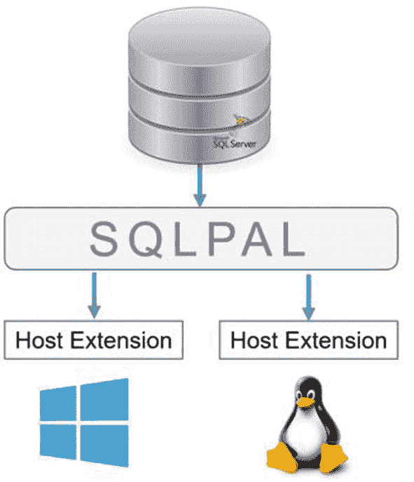

图 8-1

使 SQL Server 在 Linux 上成为现实的高层架构

我确信 Slava Oks 和他的团队在 2005 年研究 `SQLOS` 时，甚至没有想过将 SQL Server 移植到 Linux。它就这么神奇地发生了。

提示

Apress 书籍 `Pro SQL Server on Linux`（作者 Bob Ward）的第 1 章对此有更详细的介绍。


## SQL Server 在 Windows 与 Linux 上的差异

在阅读了上一节“Linux 上的 SQL Server 架构”后，很明显，运行在 Windows 上的 SQL Server 与运行在 Linux 上的 SQL Server 之间其实没有任何差异——它们使用的是相同的数据库引擎。SQL Server 工程团队竭尽全力在两个平台上使用相同的代码库。然而，由于 Windows 平台悠久的发展历史，SQL Server 在 Windows 上支持的功能肯定会多于 Linux。例如，当 SQL Server 2017 发布时，事务复制和合并复制尚不可用。事务复制在 SQL Server 2019 上已得到支持，但合并复制仍然不支持。随着后续版本的发布，你可以相信两个平台的功能将会趋于一致。这只是时间问题。请参阅文档[Linux 上的 SQL Server 2017](https://docs.microsoft.com/sql/linux/sql-server-linux-editions-and-components-2017)获取 SQL Server 2017 在 Linux 上支持功能的完整列表，以及[Linux 上的 SQL Server 2019](https://docs.microsoft.com/en-us/sql/linux/sql-server-linux-editions-and-components-2019)获取 SQL Server 2019 在 Linux 上的支持功能列表。

根据我的经验，你将遇到的最大差异会是你的个人体验。如果你整个职业生涯都在使用 SQL Server，并且习惯于在像微软管理控制台这样丰富的图形用户界面下工作并与操作系统交互，那么像运行 Docker 命令那样在命令行下工作可能会让你感到非常别扭。你会听到自己说：“这个任务在 Windows 上容易多了。”或者当你因为忘记申请`root`权限而无法运行命令时，你会一边敲击键盘一边低声咒骂几句“#&%@$#%!”。另一方面，如果你也一直在管理运行在 Linux 上的其他数据库平台，并编写 Shell 脚本来自动化枯燥的任务，那么在 Linux 上运行 SQL Server 对你来说会像天赐之物，你会纳闷为什么微软不早点这么做。你的个人体验、偏好甚至偏见都会凸显这些差异。但一旦你进入 SQL Server Management Studio，你就无法分辨出区别了。

## 在 Linux 上安装 SQL Server

大多数 SQL Server 数据库管理员会说，Windows 与 Linux 上的 SQL Server 之间最大的差异是安装体验。在 Linux 上，没有`setup.exe`，没有 SQL Server 安装中心，也没有`新建 SQL Server 独立安装或向现有安装添加功能`链接。你怎么点击、输入、拖动和选择呢？但是，如果你已经部署了数百甚至数千个 SQL Server 实例，我敢肯定你会讨厌这种向导驱动的安装体验。你可能已经有一个批处理文件，它调用`setup.exe`并传递安装 SQL Server 所需的所有参数。也许你有一个存储在中央存储库中的`ConfigurationFile.ini`文件，在运行`setup.exe`时会访问它。我仅在需要创建新的（或验证现有的）`ConfigurationFile.ini`文件或演示如何使用它来安装 SQL Server 时才会使用 SQL Server 安装中心。

本节分为两部分——手动安装 SQL Server 和使用脚本执行无人值守安装。目的是让你了解安装过程的工作原理，为创建自定义的 Linux SQL Server Docker 镜像做准备。不过，你完全可以按照以下步骤在物理机或虚拟机上自动化部署 Linux 上的 SQL Server。

### 手动安装

在第 3 章中，我指导你在两个不同的 Linux 发行版（CentOS 和 Ubuntu）上安装了 Docker。同样地，我将指导你在 CentOS 和 Ubuntu 上安装 SQL Server 的过程，这样你就可以创建一个可以在任一发行版上运行的自定义 Linux SQL Server Docker 镜像。回想一下，微软公开提供的 Linux SQL Server 镜像是使用 Ubuntu 创建的。你可能希望创建一个在红帽企业 Linux/RHEL（或像本书中使用的 CentOS）或 SUSE Linux 企业服务器上运行的自定义 Linux SQL Server Docker 镜像，以便可以在特定的 Linux 发行版上实现标准化。你可以在任何支持的 Linux 发行版上自由安装 SQL Server。这些支持的 Linux 发行版列表可在[Linux 上的 SQL Server：支持的平台](https://docs.microsoft.com/en-us/sql/linux/sql-server-linux-setup?view=sql-server-ver15#supportedplatforms)找到。

让我们从在 CentOS 上安装 SQL Server 开始。与在 Linux 上安装 Docker 类似，你需要告诉你的 Linux 系统从哪里下载微软 SQL Server Red Hat（因为 CentOS 基于 RHEL）仓库配置文件。请确保指定你要下载的 SQL Server 版本。运行以下命令以下载 SQL Server 2017 的 Microsoft SQL Server Red Hat 仓库配置文件：

```bash
sudo curl -o /etc/yum.repos.d/mssql-server.repo https://packages.microsoft.com/config/rhel/7/mssql-server-2017.repo
```

运行以下命令以下载 SQL Server 2019 的 Microsoft SQL Server Red Hat 仓库配置文件。注意细微的差别。给你个提示——是 SQL Server 的版本。

```bash
sudo curl -o /etc/yum.repos.d/mssql-server.repo https://packages.microsoft.com/config/rhel/7/mssql-server-2019.repo
```

下载仓库配置文件后，运行以下命令安装 SQL Server。这将下载适用于 RHEL 的 SQL Server 安装包（别担心，它们与 CentOS 兼容）。下载完成后，它将自动运行安装。

```bash
sudo yum install -y mssql-server
```

软件包安装完成后，运行带有以下`setup`参数的`/opt/mssql/bin/mssql-conf`脚本，使用默认配置配置 SQL Server。按照提示选择你的 SQL Server 版本并设置`sa`密码。

```bash
sudo /opt/mssql/bin/mssql-conf setup
```

请谨慎选择版本。如果你打算将其用于开发和测试目的，Developer Edition 是免费的，并且具有 Enterprise Edition 的所有功能。选择 Developer Edition 意味着你打算在生产环境中部署 Enterprise Edition。不要错误地将 Developer Edition 部署在开发环境中，最终由于许可成本而在生产环境中部署 Standard Edition。虽然 Windows 上的 SQL Server 2019 Standard Edition 在可用功能上几乎与 Enterprise Edition 不相上下，但 Linux 上的 SQL Server 并非如此。

就是这样。就这么简单。在 RHEL 或 CentOS 上安装 SQL Server 只需要运行三条命令。嗯，实际上如果你算上启用 SQL Server 守护程序在系统启动时启动的话是四条命令，这在 Ubuntu 系统上你也需要做。以下命令是如何启用的方法：

```bash
sudo systemctl enable mssql-server
```

另一方面，在 Ubuntu 上安装 SQL Server 包含额外的步骤，并且使用`apt-get`命令而不是`yum`命令。我们将从在本地 Ubuntu Linux 系统上导入公共 GPG 密钥开始。运行以下`curl`命令下载并导入公共 GPG 密钥：

```bash
curl https://packages.microsoft.com/keys/microsoft.asc | sudo apt-key add -
```


接下来，你需要将 Microsoft SQL Server Ubuntu 软件仓库添加到你的 Ubuntu Linux 系统中。以下命令专门适用于 SQL Server 2017：

```
sudo add-apt-repository "deb [arch=amd64] https://packages.microsoft.com/ubuntu/16.04/mssql-server-2017 xenial main"
```

以下命令专门适用于 SQL Server 2019：

```
sudo add-apt-repository "deb [arch=amd64] https://packages.microsoft.com/ubuntu/16.04/mssql-server-2019 xenial main"
```

注意

回想一下第 3 章描述的 `/etc/apt/sources.list` 文件。该文件包含了 APT 软件仓库的列表，即你想要在 Ubuntu Linux 系统上安装的软件包的位置。前面的命令只是在该文件中为 Microsoft SQL Server Ubuntu 软件包添加了一个条目。但你可能想知道这个值是从哪里来的。通过 `add-apt-repository` 命令添加到 `/etc/apt/sources.list` 文件中的值，来自于 `https://packages.microsoft.com/config/ubuntu/16.04/mssql-server-2017.list` 文件。你可以下载与你想要安装的 Ubuntu SQL Server 版本对应的特定列表文件。

在将 Microsoft SQL Server Ubuntu 软件仓库添加到 `/etc/apt/sources.list` 文件后，你可以运行以下命令来安装 SQL Server。因为你通过添加 Microsoft SQL Server Ubuntu 软件包仓库修改了你的 Ubuntu 系统，所以在安装 SQL Server 之前，你需要先运行 `apt-get update` 命令：

```
sudo apt-get update
sudo apt-get install -y mssql-server
```

软件包安装完成后，运行带有以下 `setup` 参数的 `mssql-conf` 脚本，以使用默认配置配置 SQL Server。根据提示选择你的 SQL Server 版本并设置 `sa` 密码。

```
sudo /opt/mssql/bin/mssql-conf setup
```

如果你观察安装过程，它包括运行一些命令和传递参数值。如果你能将这些步骤全部组合到一个脚本中，你就可以自动化安装过程，而不必手动输入对提示的响应。这就是无人参与安装背后的思想。

#### 无人参与安装

在 Linux 上执行 SQL Server 的无人参与安装需要了解如何在 Linux 中运行脚本。我将在后面的章节中保存关于如何在 Linux 上运行脚本的细节。本节将描述执行无人参与安装的脚本中包含哪些内容。

回想一下你如何在 CentOS 和 Ubuntu 系统上手动安装 SQL Server。你运行了几个包含参数的命令。如果你查看在 CentOS 和 Ubuntu 上安装 SQL Server 的命令——`sudo yum/apt-get install -y mssql-server`——你会看到一个 `-y` 参数。这是所有软件包管理器都使用的参数，它假定对安装过程中可能提出的任何问题的回答都是 `是`。这也允许用户无需用户交互即可执行安装。我通常在进行无人参与安装之前，会手动安装几次，以确切了解软件包要求我做什么需要*是/否*响应的操作。我当然不想遇到一个提示问“你最近杀过人吗？”，然后粗心地输入 `是`。我可能不是律师，但我尽力而为，在我的计算机或智能手机上安装软件时会仔细阅读细则。

类似地，在作为设置过程的一部分运行 `/opt/mssql/bin/mssql-conf` 脚本时，可以传递不同的参数。这些参数也称为 `环境变量`，在 `https://docs.microsoft.com/en-us/sql/linux/sql-server-linux-configure-environment-variables?view=sql-server-linux-2017` 中有针对 SQL Server 2017 的描述（SQL Server 2019 的列表类似）。回想一下在*第*4 章中传递给 `docker run` 命令的环境变量。它们是相同的环境变量，可用于在设置过程中配置 Linux 上的 SQL Server，从而无需用户交互。如果你注意到了手动安装过程，有三个提示需要用户输入：

*   `MSSQL_PID`：类似于在 Windows 上安装 SQL Server 时的 PID 参数——可以是产品 ID 或 SQL Server 版本。如果未指定，则默认为开发版。
*   `ACCEPT_EULA`：我相信你现在已经知道这个了。
*   `MSSQL_SA_PASSWORD`：`sa` 登录的复杂密码。

给定这三个环境变量，你可以运行带有其对应值的 `/opt/mssql/bin/mssql-conf` 脚本，如下所示：

```
sudo MSSQL_PID=Enterprise ACCEPT_EULA=Y MSSQL_SA_PASSWORD="mYSecUr3PAssw0rd" /opt/mssql/bin/mssql-conf setup
```

注意

我在 Microsoft 文档、博客文章和 GitHub 上的示例代码中看到过使用 `-n` 参数运行 `/opt/mssql/bin/mssql-conf` 脚本作为设置过程一部分的例子。一个例子可以在 `https://docs.microsoft.com/en-ca/sql/linux/sample-unattended-install-redhat?view=sql-server-ver15#sample-script` 找到。参考行 `echo Running mssql-conf setup...`，它显示了带有环境变量的 `/opt/mssql/bin/mssql-conf -n setup` 代码。`-n`（也是 `--noprompt`）参数不会提示用户，并在安装过程中使用环境变量或默认设置。我好奇的心想知道行为上是否有任何不同，所以我测试了带 `-n` 参数和不带 `-n` 参数运行命令。结果证明两者之间确实没有区别。因此，为了节省几次击键和几个字节的字符，我选择在我的无人参与安装中不使用 `-n` 参数。

将 CentOS Linux 系统上的所有命令组合起来以

*   下载 SQL Server 2017 的 Microsoft SQL Server Red Hat 仓库配置文件
*   下载并安装适用于 RHEL 的 SQL Server 安装包
*   运行带有 `setup` 参数和环境变量的 `/opt/mssql/bin/mssql-conf` 脚本
*   启用 SQL Server 守护进程在系统启动时启动

你的脚本将包含如下所示的命令：

```
sudo curl -o /etc/yum.repos.d/mssql-server.repo https://packages.microsoft.com/config/rhel/7/mssql-server-2017.repo
sudo yum install -y mssql-server
sudo MSSQL_PID=Developer ACCEPT_EULA=Y MSSQL_SA_PASSWORD="mYSecUr3PAssw0rd" /opt/mssql/bin/mssql-conf setup
sudo systemctl enable mssql-server
```

回顾在 Ubuntu Linux 系统上手动安装 SQL Server 的步骤，执行无人参与安装的相应脚本将包含如下所示的命令：

```
curl https://packages.microsoft.com/keys/microsoft.asc | sudo apt-key add -
sudo add-apt-repository "deb [arch=amd64] https://packages.microsoft.com/ubuntu/16.04/mssql-server-2017 xenial main"
sudo apt-get update
sudo apt-get install -y mssql-server
sudo MSSQL_PID=Developer ACCEPT_EULA=Y MSSQL_SA_PASSWORD="mYSecUr3PAssw0rd" /opt/mssql/bin/mssql-conf setup
sudo systemctl enable mssql-server
```

即使运行这些命令并提供以 `sudo` 身份运行它们的密码，也给了你某种形式的无人参与安装。但我们还没有完成。你必须等到本章后面才能拥有一个完全自动化的脚本，该脚本将在 Linux 上执行 SQL Server 的无人参与安装。


## 配置防火墙

根据您的 Linux 系统配置，您可能需要配置 Linux 防火墙以允许到 SQL Server 的远程连接。Linux 系统使用 `iptables`，这是一个基于规则的防火墙，预装在大多数 Linux 发行版中。它使用网络地址转换 (NAT) 和数据包过滤的概念来控制对系统的网络访问。但鉴于 Linux 的开源特性，许多人尝试构建实用程序和工具以使其管理变得更容易——因此，有了这些可用的实用程序。例如，在 RHEL 和 CentOS 7 及更高版本上，默认的系统防火墙是 `FirewallD`。`FirewallD` 通过 API 暴露 `iptables`，并允许管理员和开发人员使用一个名为 `firewall-cmd` 的命令行工具轻松配置防火墙设置。您可以从 [*https://firewalld.org/*](https://firewalld.org/) 了解更多关于 `FirewallD` 的信息。另一方面，Ubuntu 使用一个名为 `UFW`（uncomplicated firewall 的缩写）的命令行工具，它直接与 `iptables` 交互。您可以从 [*https://help.ubuntu.com/community/UFW*](https://help.ubuntu.com/community/UFW) 了解更多关于 `UFW` 的信息。有趣的是，如果您愿意，可以在 Ubuntu 系统上安装 `FirewallD`。这使得在这两个 Linux 发行版之间标准化管理系统防火墙变得更容易。但那样还有什么乐趣呢？我不会深入探讨 `iptables`、`firewalld`、`firewall-cmd` 和 `ufw` 的工作原理。我只会提供足够的信息，让您能够使用您特定发行版可用的工具配置到 Linux 上 SQL Server 的远程连接。

让我们从 CentOS 开始。首先，运行以下命令检查 `FirewallD` 是否正在运行。图 8-2 显示了 CentOS Linux 系统上运行中的 `FirewallD` 守护进程状态。

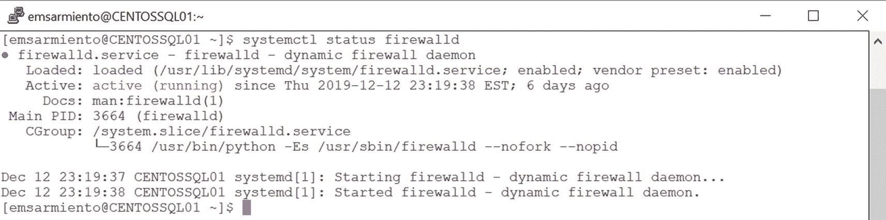

图 8-2

FirewallD 在 CentOS Linux 系统上运行

```
sudo systemctl status firewalld
```

接下来，运行以下带有相应参数的 `firewall-cmd` 命令以从防火墙打开 TCP 端口 1433：

```
sudo firewall-cmd --zone=public --add-port=1433/tcp --permanent
```

`FirewallD` 的一个关键特性是区域 (zone) 的概念。所有其他特性都绑定到一个区域，这描述了连接、接口或源地址绑定的信任级别。此命令使用的区域 `Public` 表示您不信任网络上的其他计算机，并且只允许到 TCP 端口 1433 的传入流量。`--permanent` 参数表示您希望永久应用此防火墙规则。但配置了它并不意味着它会自动应用，也不会在系统重启期间持久保存。`FirewallD` 中的另一个概念是运行时配置与永久配置的分离。运行时配置是防火墙当前用于管理规则的配置，在防火墙规则重新加载或系统重启时可能会丢失。永久配置存储在 `iptables` 中，并在系统启动或防火墙规则重新加载时加载。这意味着您可以临时更改防火墙规则并将其加载到运行时配置中。如果您移除 `--permanent` 参数，您将能够临时远程连接到 Linux 上的 SQL Server 实例。但一旦系统重启或防火墙规则重新加载，连接将被阻止，因为防火墙规则丢失了。此外，因为命令中使用了 `--permanent` 参数，防火墙规则仅作为永久配置存在，而不是运行时配置，并且不会立即生效。要应用防火墙规则，运行以下命令将其作为新的运行时配置重新加载：

```
sudo firewall-cmd --reload
```

在端口 1433 上对您的 CentOS Linux 系统进行简单的 TELNET 测试将验证防火墙规则是否已应用。您还可以运行以下命令显示防火墙中已打开端口的运行时配置。图 8-3 显示了已打开的 TCP 端口 1433。

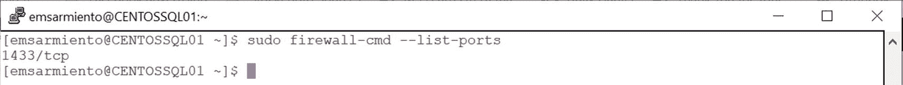

图 8-3

列出系统防火墙中已打开的端口

```
sudo firewall-cmd --list-ports
```

我不是说过我们会对 Ubuntu 系统使用不同的工具吗？运行以下命令检查 `UFW` 的状态。图 8-4 显示了 Ubuntu Linux 系统上 `UFW` 守护进程的状态。但与 `FirewallD` 不同，`UFW` 默认是禁用的。请注意 `Status: inactive` 消息。

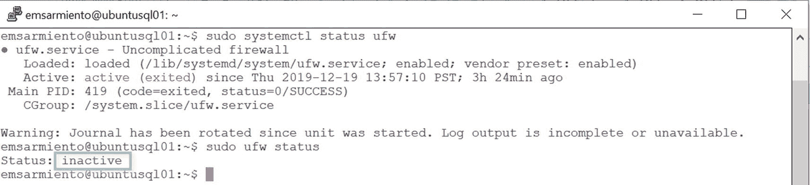

图 8-4

Ubuntu Linux 系统上的 UFW 默认被禁用

```
sudo systemctl status ufw
sudo ufw status
```

运行以下命令启用 `UFW`。当提示时，输入 `y` 表示 `Yes`。这将启用 `UFW` 并配置为在系统启动时启动。

```
sudo ufw enable
```

注意

关于 Ubuntu 上的 `UFW` 防火墙的一句警告。前面的章节允许您通过 SSH 客户端连接到您的 Ubuntu Linux 系统。这是因为防火墙默认是禁用的，系统对任何远程连接都是完全开放的——包括端口 22 上的 SSH。这与 CentOS Linux 不同，后者的防火墙是启用的，除了通过 SSH 的远程连接外，阻止所有访问。在 Ubuntu Linux 系统上启用 `UFW` 后，除非您为其定义防火墙规则，否则将不允许任何其他连接。这也意味着您现有的 SSH 会话仅在您仍然连接时有效。一旦您断开连接，您将被锁定在外。不要犯这样的错误：在未启用防火墙端口 22 的情况下关闭您现有的 SSH 连接。运行此命令以允许 SSH 连接：`sudo ufw allow 22/tcp`。要验证，请启动另一个 SSH 会话并确认您可以连接。

启用 `UFW` 并允许 SSH 连接后，您现在可以通过运行以下命令从防火墙打开 TCP 端口 1433。图 8-5 显示了已打开的端口号——22 用于 SSH，1433 用于 SQL Server。

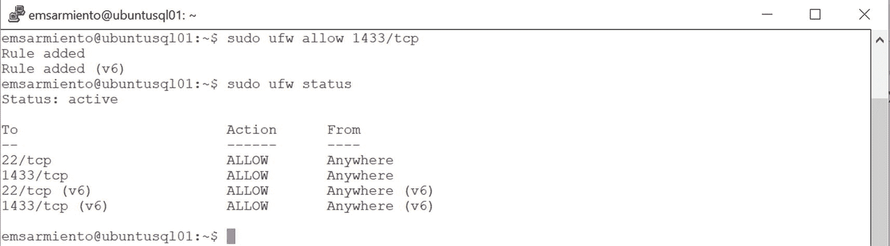

图 8-5

UFW 显示所有已打开的端口

```
sudo ufw allow 1433/tcp
```

正如我在 *第* *4* *章* 中提到的，最终测试是当您可以通过 SQL Server Management Studio 远程连接到 Linux 上的 SQL Server 实例时。


## Linux 防火墙与 Docker 注意事项

我本想在 **第 4 章** 介绍 Linux 防火墙时稍作提及，因为当时正在介绍如何在 Docker 上运行 SQL Server 并远程连接。此外，为了访问资源，你也需要能够远程连接到服务器。但如果你注意观察，之前的章节都没有涉及创建防火墙规则和开放端口号以访问容器内的 SQL Server 实例。因此，我在此替你提出一个显而易见的问题：如果 CentOS Linux 系统默认启用了 **FirewallD**，它不应该阻止除 SSH 外的所有连接吗？而如果我在 Ubuntu Linux 系统上启用了 **UFW**，它不也应该阻止除我明确允许之外的所有连接吗？不过，你可能不太关心 Ubuntu 上的 **UFW**，因为它默认是禁用的。

答案在于 Docker 在幕后施展的“魔法”。还记得我说过 **iptables** 是大多数 Linux 发行版上基于规则的防火墙吗？每次你创建一个 Docker 容器并在 `docker run` 命令中使用 `-p` 参数配置端口映射时，Docker 都会直接在 **iptables** 中创建一个防火墙规则作为你实现的一部分。Docker 在 RHEL/CentOS 上不使用 **FirewallD**，在 Ubuntu 上也不使用 **UFW**，因此当你使用这些工具时，你不会看到任何关于区域、端口号或服务的信息。图 8-6 展示了在我的 CentOS Docker 主机上已开放的端口和服务列表。请注意，`firewall-cmd` 仅在可用服务列表中显示 `ssh` 和 `dhcpv6-client`（用于从 DHCP 服务器获取 IP 地址）。然而，查询 **iptables** 显示了一个映射：从任意源（0.0.0.0/0 IP 地址范围）到 IP 地址 172.18.0.2（这是我 CentOS Docker 主机上分配给 `docker0` 网络接口的 IP 地址，我将在 **第 11 章** 中更详细地介绍）的 TCP 端口 1433。在 Ubuntu Docker 主机上查询 **iptables** 时，你会看到同样的规则。

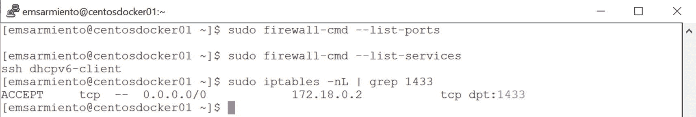

**图 8-6**
在 CentOS Docker 主机上，为端口 1433 在 FirewallD 和 iptables 中显示的开放端口及允许的服务

你可以在 [*https://docs.docker.com/network/iptables/*](https://docs.docker.com/network/iptables/) 阅读更多关于 Docker 实现的这种防火墙规则“魔法”。他们明确强调不要修改 Docker 在你的 **iptables** 中创建的防火墙规则。如果你的安全策略禁止从任何源访问 Docker 容器内的 SQL Server 实例，请咨询你的网络工程师如何正确控制网络流量。

## 在 Linux 上配置 SQL Server

虽然大多数开箱即用的安装设置没有问题，但你可能希望标准化 SQL Server 部署，以符合你们的内部最佳实践，或者只是为了证明你比普通 SQL Server DBA 更聪明。我们在 Windows 上使用 SQL Server 安装中心做过这件事，创建一个 `ConfigurationFile.ini` 文件并用它来部署具有所需配置设置的多个 SQL Server 实例。我们也曾手动使用 SQL Server 配置管理器对每个实例进行配置。在 Linux 上的 SQL Server，我们该如何做呢？

`/opt/mssql/bin/mssql-conf` 脚本可用于为你的 Linux 上的 SQL Server 安装设置不同的配置。但除了在安装过程中使用它，我还没有真正描述过这个脚本的用法。让我们以 Linux 的方式更详细地探讨这个脚本。我在 **第 3 章** 简要提到了使用 Linux `man`（manual 的缩写）页面。虽然现在由于互联网资源丰富，我很少使用 `man` 页面来查阅文档，但在某些情况下，我确实无法在网上找到关于特定命令的信息。这个脚本就是其中之一。运行以下命令以显示如何使用此脚本：

```
man mssql-conf
```

图 8-7 显示了使用此脚本时的不同选项。

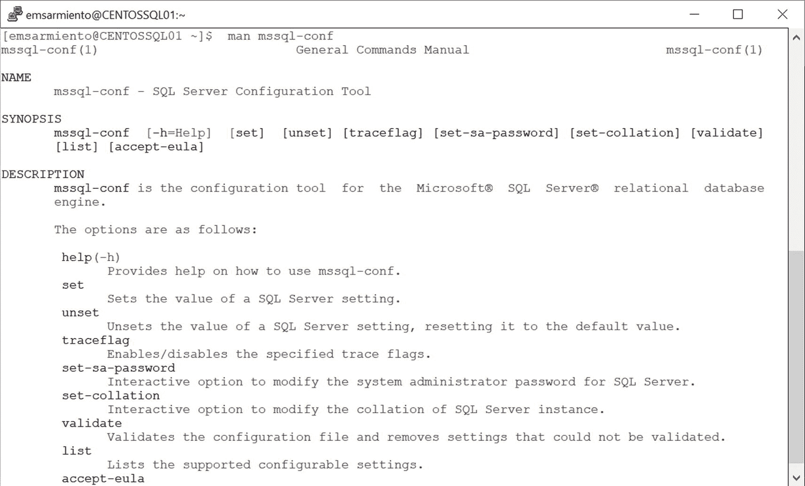

**图 8-7**
mssql-conf 的 man 页面

使用 `list` 参数显示所有不同的可配置设置，如图 8-8 所示：

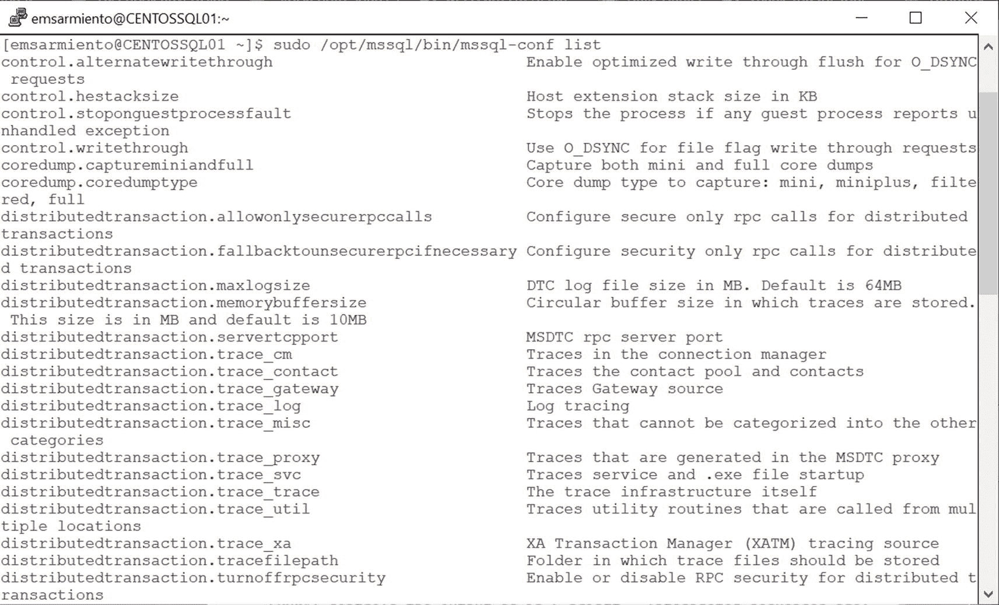

**图 8-8**
Linux 上 SQL Server 的可配置设置列表

```
sudo /opt/mssql/bin/mssql-conf list
```

这些是 SQL Server 实例上无法通过 T-SQL 完成的可配置设置。让我们用这些设置来展示如何更改一些最常见的 SQL Server 实例配置设置。下文展示的设置都需要重启 SQL Server 守护进程，因此我会在最后再执行重启步骤，只展示如何完成所有配置更改。

### 启用 SQL Server Agent

默认情况下，SQL Server Agent 在安装后是禁用的。实际上，在 SQL Server 2017 累积更新 4 之前，你必须使用不同的包单独安装 SQL Server Agent。我猜社区和 Microsoft MVP 的反馈（或抱怨）导致 SQL Server 产品团队将 SQL Server Agent 包含在 `mssql-server` 包中。试想一下，如果需要分别更新 SQL Server 数据库引擎和 SQL Server Agent。即使有适当的变更管理流程，任何人也有可能因为这不是我们 DBA 更新 SQL Server 的常规操作而忘记更新 SQL Server Agent。这样，你的补丁级别最终可能会在两者之间不同。我认为将 SQL Server Agent 作为安装 SQL Server 的一部分是一个很棒的主意。

运行以下命令以启用 SQL Server Agent：

```
sudo /opt/mssql/bin/mssql-conf set sqlagent.enabled true
```

### 配置默认数据库数据和日志目录

数据库数据和日志文件的默认目录是 `/var/opt/mssql/data`。你可能希望配置一个包含固态硬盘的专用存储阵列，并将其挂载为 Linux 系统上的一个目录。但在将一个目录配置为默认数据库数据和日志目录之前，必须先创建它，并将所有权更改为 `mssql` 用户和 `mssql` 组。运行以下命令创建一个名为 `/tmp/dbdata` 的新目录：

```
sudo mkdir /tmp/dbdata
```

接下来，运行以下命令将目录的所有权更改为 `mssql` 用户：

```
sudo chown mssql /tmp/dbdata
```

你还需要通过运行以下命令将目录的组所有权更改为 `mssql` 组：

```
sudo chgrp mssql /tmp/dbdata
```

目录创建并分配所有权后，你现在可以使用以下命令将默认数据库数据和日志目录设置为新位置：

```
sudo /opt/mssql/bin/mssql-conf set filelocation.defaultdatadir /tmp/dbdata
sudo /opt/mssql/bin/mssql-conf set filelocation.defaultlogdir /tmp/dbdata
```


#### 配置默认数据库备份目录

默认的数据库备份目录与默认的数据库数据和日志目录相同，都是 `/var/opt/mssql/data`。出于灾难恢复的目的，我喜欢将数据库和备份分开存放。与配置默认数据库数据和日志目录类似，您需要先创建目录，并将所有权更改为 `mssql` 用户和 `mssql` 组。让我们使用 `/tmp/dbbackup` 目录作为默认数据库备份目录。运行以下命令以执行必要的配置更改：

```
sudo mkdir /tmp/dbbackup
sudo chown mssql /tmp/dbbackup
sudo chgrp mssql /tmp/dbbackup
sudo /opt/mssql/bin/mssql-conf set filelocation.defaultbackupdir /tmp/dbbackup
```

注意

如果您好奇 `mssql` 用户和 `mssql` 组是什么，它们是分配给 SQL Server 非二进制文件的非交互式登录和组。可以将其视为 Windows 上的 SQL Server 服务账户。非交互式登录在后台运行 SQL Server 进程。但与通常的 Windows SQL Server 服务账户不同（除非将其配置为 *作为服务登录*，否则您可以使用该账户及其凭据登录 Windows 机器），非交互式登录将无法登录并从 shell 运行命令。此外，您无法将其更改为任何其他用户账户。我希望这在未来的版本中有所改变。

#### 启用跟踪标志

在部署新的 SQL Server 实例时，我启用的跟踪标志之一是跟踪标志 `3226`。这会抑制 SQL Server 错误日志和系统事件日志中每一个成功的备份条目。过去，我需要从我们的监控服务器中过滤成功的备份消息，以避免每次备份作业完成时都收到警报。这个跟踪标志真是救星。运行以下命令在 SQL Server 实例上启用跟踪标志 `3226`：

```
sudo /opt/mssql/bin/mssql-conf traceflag 3226 on
```

由于所有这些设置都需要重启 SQL Server 守护进程，所以一次性完成所有操作并在配置结束时重启 SQL Server 是合理的。运行以下命令以重启 SQL Server：

```
sudo systemctl restart mssql-server
```

#### 查看所有实例级配置设置

我希望能有一个简单的命令来显示所有实例级配置设置，而不是通过编程方式查询 SQL Server 管理对象 (SMO)。如果您想回顾刚刚进行的所有配置设置怎么办？嗯，为此您必须手动读取 `/var/opt/mssql/mssql.conf` 文件。SQL Server 将您所做的配置更改存储在此文件中，并在启动时读取以加载除默认值之外的配置设置。我认为这比通过编程方式查询 SMO 更好。运行以下命令以查看 SQL Server 实例的所有配置设置。图 8-9 显示了本节中设置的实例级配置设置。

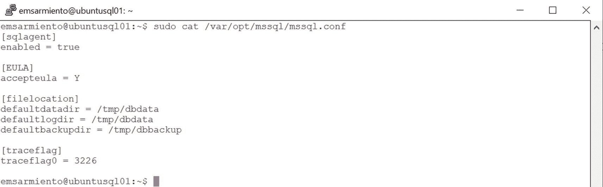

图 8-9

查看 Linux 上 SQL Server 的已配置设置

```
sudo cat /var/opt/mssql/mssql.conf
```

`/var/opt/mssql/mssql.conf` 文件就像任何其他文本文件一样，您可以使用喜欢的文本编辑器进行修改。该文件的格式可在 [*https://docs.microsoft.com/en-us/sql/linux/sql-server-linux-configure-mssql-conf?view=sql-server-ver15#mssql-conf-format*](https://docs.microsoft.com/en-us/sql/linux/sql-server-linux-configure-mssql-conf%253Fview%253Dsql-server-ver15%2523mssql-conf-format) 找到。如果您决定手动修改配置文件，则需要重启 SQL Server 守护进程才能使更改生效。

我并不太喜欢手动修改文件格式，因为解析器在处理不必要字符时可能非常严格。此外，我们是人类，难免会犯错。我修改 YAML、JSON 和 XML 文件的经验也不少，一个简单的错误，比如在文件中引入多余的字符，可能会花费大量时间排查问题。“Fat finger”（误触）这个词在我们这行是存在的，这是有原因的。我总是使用像 `/opt/mssql/bin/mssql-conf` 脚本这样的支持工具来更改文件。图 8-10 展示了在 `/var/opt/mssql/mssql.conf` 文件中误触多打一个字符带来的副作用。重启 SQL Server 守护进程并没有告诉我加载配置文件中存储的设置时出错。此外，如果读取配置文件时出错，解析器只会忽略它并加载默认值。我不得不运行命令 `sudo /opt/mssql/bin/mssql-conf validate` 才发现配置有错误。您能猜出是什么错误吗？

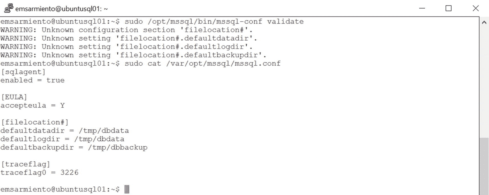

图 8-10

手动修改 `/var/opt/mssql/mssql.conf` 文件可能导致的潜在错误

### 处理文件系统

Linux 是一个基于文件的操作系统。对于习惯了 Windows 操作系统的人来说，这个概念有点难以理解。在 Windows 上，我们处理注册表、系统服务、硬件设备（如网络适配器）的表示等等。在 Linux（或通常的 Unix）中，一切都是文件。您的硬盘由一个设备文件表示。配置设置存储在文件中。甚至包含文件的目录也是一种特殊类型的文件，您可以使用文本编辑器读取。回想一下自从第 3 章以来您所做的一切——它们都引用了一个文件：仓库文件、软件包文件、容器使用的文件系统层、容器清单文件、符号链接文件、`daemon.json` 文件等等。如果您想让一个应用程序的行为有所不同，您只需要修改其相应的配置文件（前提是您确切知道自己在做什么）。


#### Linux 文件系统中的重要目录

要使用基于文件的操作系统，你需要了解文件系统的一些基础知识。这将帮助你正确导航和与目录及文件交互，以执行诸如移动文件、修改配置文件等任务。以下是 Linux 文件系统中一些重要的目录列表：

*   `/`：根目录。Linux 中的一切都位于此目录之下。它类似于 Windows 中的 `C:\` 目录。
*   `/bin`：此目录包含系统管理员和非特权用户都使用的基本用户二进制程序（程序）。像 `cat`、`ls`、`rm` 等命令以及像 `bash` 这样的 Shell 都位于此目录中。
*   `/boot`：显然，此目录包含引导 Linux 系统所需的一切，除了引导时不需要的配置文件。
*   `/dev`：此目录包含特殊文件或设备文件。我之前提到过，Linux 中的硬盘表示为设备文件，并存储在此目录中。
*   `/etc`：此目录包含系统配置文件，被认为是你的 Linux 系统的指挥中心。你的 Linux 系统的行为和操作都存储在此目录的配置文件中。因此，请小心处理此目录中的文件，因为随意改动可能导致系统不稳定甚至无法启动。
*   `/home`：此目录包含所有用户的 `home` 目录，类似于 Windows 中的 `C:\Users` 目录。当你登录 Linux 系统时，系统会在 `/home` 目录下创建一个以你的用户名命名的目录，你对此目录拥有完全的、不受限制的访问权限。你的 `home` 目录也包含你的个人配置文件。
*   `/lib`：此目录包含系统所需的有用库文件（供应用程序或系统正确执行时使用的文件）。
*   `/media`：此目录包含可移动媒体（如 CD-ROM）的子目录。我确信你在服务器上已经好几年没用过这些东西了。
*   `/opt`：此目录包含不属于默认安装的附加软件包。
*   `/root`：这是 `root` 用户专用的 `home` 目录。注意，它不在 `/home` 目录中。
*   `/sbin`：类似于 `/bin` 目录，但包含通常用于系统管理的基本二进制程序，通常需要 `root` 权限。
*   `/srv`：此目录包含 Web 和 FTP 等服务的数据。与 SQL Server 无关。
*   `/tmp`：此目录包含临时文件，通常在系统重启时被删除。
*   `/usr`：此目录包含用户使用的应用程序和文件。
*   `/var`：此目录包含可变数据，如系统日志文件、假脱机文件以及任何在 Linux 系统正常运行期间可能更改的内容。

当你查看在 SQL Server 安装过程中创建的不同目录时，你会开始明白它们位置背后的目的。常见的有：

*   `/opt/mssql/bin`：包含 SQL Server 二进制文件、`mssql-conf` 脚本以及其他用于处理 SQL Server 转储文件的脚本的目录。
*   `/var/opt/mssql`：包含 SQL Server 数据和日志文件、secrets 以及 `mssql.conf` 配置文件的目录。`/opt` 中软件包的可变数据必须安装在 `/var/opt/<子目录>` 中。因为 MDF、LDF、错误日志文件、扩展事件等都是 SQL Server 数据库引擎运行时随时间变化的可变数据。

#### 文件权限

Linux 中的文件权限在管理以及应用程序配置中扮演着重要角色。你已经看到，将权限提升到 `root` 允许你执行某些管理任务，甚至打开或修改文件。但是，如果你不知道 `ls -l` 命令输出的含义，阅读它可能会让人不知所措。让我们从分析图 8-11 所示的 `/var/opt/mssql/` 和 `/opt/mssql/bin` 目录的 `ls -l` 命令输出开始。注意使用 `sudo` 来列出 `/var/opt/mssql` 目录的内容。

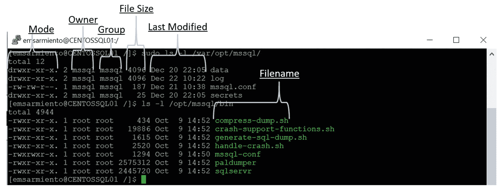

图 8-11

`ls -l` 命令的输出

所有其他属性——`owner`（所有者）、`group`（组）、`file size`（文件大小）、`last modified`（最后修改时间）和 `filename`（文件名）——都容易理解。真正困扰我的是 `mode`（模式）属性。它就像某种只有说克林贡语的人才能理解的代码。让我们更深入地分解 `mode` 属性，看看它如何影响文件和目录，如图 8-12 所示。

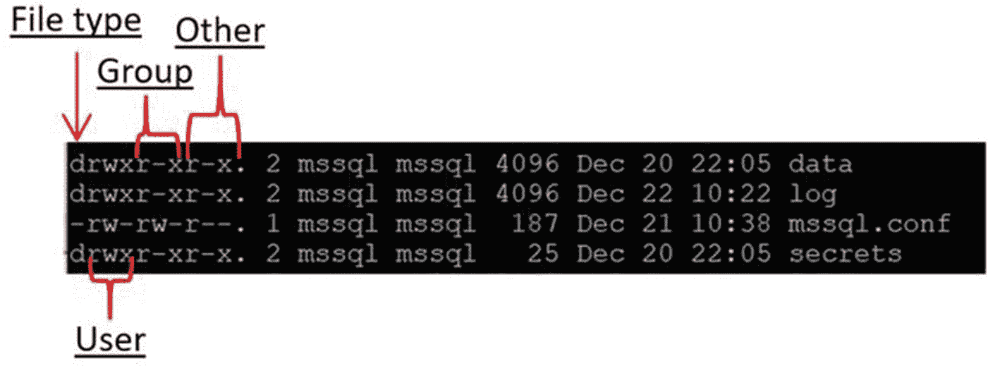

图 8-12

文件和目录的模式属性

`mode` 中的第一个字符代表类型。一个连字符 (`-`) 表示它是一个包含数据的普通文件，比如 `mssql.conf` 配置文件。一个 "d" 表示一个目录，比如 `data`、`log` 和 `secrets` 目录。请记住，Linux 中的一切都是文件，甚至目录也是。特殊文件，例如目录，由非连字符字符（如字母）标识。回想一下 *第* *5* *章* 中提到的符号链接文件，由 "l" 字符表示。

`mode` 属性中的接下来三个字符代表用户权限。让我们看看我们可以分配给文件或目录的不同权限：

*   `r`：读。对于文件，此权限允许用户读取内容。对于目录，此权限允许用户查看文件的名称。
*   `w`：写。对于文件，此权限允许用户修改和删除文件。对于目录，`写`权限允许用户删除目录、修改其内容（在其中创建、删除和重命名文件）以及修改用户可读文件的内容。
*   `x`：执行。对于文件，此权限允许用户执行文件（用户还必须具有读权限），应为可执行程序和脚本设置此权限。对于目录，此权限允许用户访问目录中的文件（包括其元数据）。

参考图 8-12，`mssql` 用户对 `secrets` 目录拥有 `读`、`写` 和 `执行` 权限，但对 `mssql.conf` 文件只有 `读` 和 `写` 权限（`mssql.conf` 文件是一个包含数据的普通文本文件，而不是像 `/opt/mssql/bin/mssql-conf` 文件那样的脚本）。

`mode` 属性中的再接下来三个字符代表文件组所有者的权限。参考图 8-12，`mssql` 组（及其成员）对 `secrets` 目录拥有 `读` 和 `执行` 权限，对 `mssql.conf` 文件拥有 `读` 和 `写` 权限。

`mode` 属性中的最后三个字符代表所有其他用户的权限，通常称为其他用户。参考图 8-12，所有其他用户对 `secrets` 目录拥有 `读` 和 `执行` 权限，但对 `mssql.conf` 文件只有 `读` 权限。


## 为文件和目录分配权限

处理权限问题意味着我们也需要了解两种最常用的命令，用于分配适当的权限。`chown`（change owner 的缩写）是用于更改文件或目录所有权的命令。`chmod`（change mode 的缩写）是用于更改文件或目录对于所有者、所属组和其他用户的读、写和执行权限的命令。使用`chmod`分配权限有两种方式——第一种是使用字母数字字符（也称为符号模式），如`r`、`w`和`x`；第二种是使用八进制模式（你以为你已经逃过了将十进制转换为八进制的基础计算机课程？）。

### 更改所有者和所属组

参考更改默认数据库备份目录的操作。创建目录后，你需要将其所有者更改为`mssql`用户。因为是你最初创建了这个目录，所以你的用户账户（以及你所属的组）拥有它。你希望`mssql`用户拥有对新的备份目录的读写权限，这样你的数据库备份才不会失败。因此，命令如下：

```bash
sudo chown mssql /tmp/dbbackup
```

这里还有一个有用的命令。`chgrp`（change group 的缩写）命令用于更改文件或目录的所属组。以下命令将新的备份目录的所属组更改为`mssql`组：

```bash
sudo chgrp mssql /tmp/dbbackup
```

如果你只更改了文件或目录的所有者而没有更改所属组，可能会出现权限不一致的情况，特别是当用户账户与所属组的权限不同时。用户账户可以被分配更精细的权限，但这需要更多工作。这就是 Windows 中存在安全组的原因。更好的做法是创建一个安全组，为其分配权限，然后只需向该组中添加或从中移除用户即可。在`mssql`组的情况下，只有`mssql`用户在其中，为了保持一致性，将目录同时分配给该用户和该组是合理的。

### 分配执行权限

让我们回到为文件和目录分配权限的问题上。如果你想创建一个名为`automateSQLinstall.sh`的 shell 脚本，用于自动化和配置在 Linux 上安装 SQL Server，你需要使用（`+`）运算符为该文件分配`执行`（`x`）权限。请注意，使用（`-`）运算符将撤销权限。以下命令展示了一个简单的方法：

```bash
chmod +x automateSQLinstall.sh
```

这样做意味着授予你的用户账户、你所属的组以及所有其他用户`执行`权限。图 8-13 显示了为文件分配`执行`权限后的有效权限。

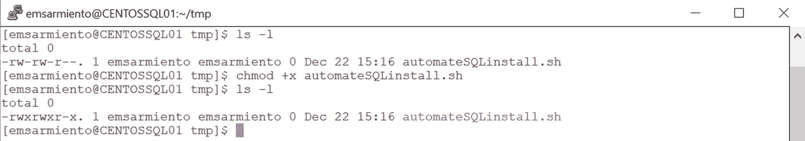

图 8-13

让我们解读文件上的有效权限。（`-`）符号告诉我这是一个普通文件。在运行`chmod +x automateSQLinstall.sh`命令之前，名为`emsarmiento`的用户和组只对该文件拥有`读`和`写`权限。之所以如此，是因为用户创建了该文件，作为副作用而拥有它。但如果你注意到，该用户对文件没有`执行`权限。与 Windows 中具有特定文件扩展名（如`.vbs`或`.exe`）的脚本会自动标记为可执行不同，Linux 中的文件扩展名没有任何意义。你必须告诉 Linux 该文件需要被执行，特定用户才能运行它。运行`chmod`命令后，名为`emsarmiento`的用户和组现在对该文件拥有了`读`、`写`和`执行`权限。此外，Linux 在适用的情况下会自动分配隐式权限。即使我只授予了`执行`权限，`其他`组也被授予了`读`权限。这是因为用户在读写或执行文件或目录之前，需要先能够读取它。

以下是一种更明确地授予文件`执行`权限的方式，其中`u=所有者`，`g=所属组`，`o=其他`：

```bash
chmod u+x,g+x,o+x automateSQLinstall.sh
```

或者这样：

```bash
chmod u=rwx,g=rwx,o=rx automateSQLinstall.sh
```

显然，有几种方法可以实现这个目标。而这甚至还没有涉及八进制模式。那么，让我们继续。

### 使用八进制模式

在八进制模式中，数字代表权限，如下所示：

*   4 = 读
*   2 = 写
*   1 = 执行

这些值范围从 0 到 7。将这些数字转换为对应的权限：

*   0 = `---`
*   1 = `--x`
*   2 = `-w-`
*   3 = `-wx`
*   4 = `r--`
*   5 = `r-x`
*   6 = `rw-`
*   7 = `rwx`

从 0 到 7 的每个数字都可以分配给`所有者`、`所属组`和`其他`列。如果你想为文件分配`执行`权限，以下命令使用八进制模式实现这一点：

```bash
chmod 775 automateSQLinstall.sh
```

> **注意：** 本章无意深入探讨 Linux 文件系统和权限操作。这个主题本身就需要单独的一整章来讨论。本节的目标是为本章及其他章节中命令的使用方式和原因提供参考。但正如你所见，这个主题是使用 Linux 的核心。请记住，Linux 中的一切都是文件，必须为特定的系统进程和应用程序分配适当的权限才能运行。除非你确切知道自己在做什么，否则不要随意改动`/var/opt`目录下的权限。我强烈建议探索 Apress 出版社提供的一些关于 Linux 文件系统和权限管理的书籍，以进行深入学习。


## 编写简单的 Linux Bash 脚本

我在前几部分所做的，仅仅是为创建一个在 Linux 上自动安装 SQL Server 的脚本提供了框架。实际上，本章的标题本应是*为在 Linux 上自动化安装 SQL Server 做准备*。但是，每当我需要处理客户编写的、执行特定任务的自动化脚本时，总会看到一些人一脸茫然，他们完全不知道脚本是如何编写的，也不清楚脚本执行了哪些不同的任务。很多时候，这些脚本只是将网上找到的代码片段拼接在一起。别误会，如果你知道代码片段的功能、测试过它，并且做了恰当的文档记录，那么将网上找到的代码片段拼接起来并没有什么错。尽管我非常相信并倡导自动化，但我更加强调流程的重要性。当我担任数据中心工程师时，我几乎不怎么坐在电脑前。我要么是坐在办公桌前用纸笔，要么是在白板上绘制定义流程的工作图。这是因为良好的自动化建立在坚实的流程基础之上。所以，当我们进行季度灾难恢复演练时，我们只需要运行自动化脚本并监控结果即可。如果某个特定流程需要改进，我们会回到绘图板，进行修改以满足我们的恢复目标和服务级别协议。我们这种以流程为导向的自动化，是一个非常精简但高效的团队能够管理数百台服务器的关键所在。

现在我们已经掌握了在 Linux 上安装和配置 SQL Server 的框架，是时候编写自动化脚本了。但在编写之前，我们需要知道如何编写脚本以及如何执行它。

### 什么是 Bash 脚本？

一个*Bash 脚本*是一个包含一系列命令的纯文本文件。它被称为 Bash 脚本，是因为这些命令是使用 Bash（**B**ourne **A**gain **Sh**ell）来解释的。Bash 是大多数 Linux 发行版的默认 Shell。事实上，你可以在 Linux 命令提示符下运行命令 `echo $0` 来进行检查。Bash 脚本本身是一种功能齐全的编程语言。这意味着你可以定义编程结构，例如变量、函数以及 shell 命令的条件执行。任何可以从命令行运行的命令都可以在 Bash 脚本中使用。通常，Bash 脚本使用 `.sh` 文件扩展名，以明确表明它是一个 Shell 脚本。但正如我在前一节提到的，Linux 并不真正关心文件扩展名。但我们人类关心。拥有某种形式的标识可以让我们无需打开文件就能立即知道它的用途。

### 创建脚本文件

在你的电脑上创建一个简单的文本文件。你是在 Linux 还是 Windows 电脑上创建它，其实并不重要。如果你能在 Windows 上创建文件，稍后复制到 Linux 机器上，目前就足够了。一旦你习惯了使用 `vi` 或 `nano` 等工具在 Linux 上创建和修改文件，你就可以在 Linux Shell 终端内编写脚本了。我在 Linux 上使用 `vi`，因为它是默认安装的。

文件的第一行是告诉解释器这是一个可执行文件。它被称为 *shebang*（或 hashbang），它就是指向 Bash 解释器的绝对路径。文件的第一行应包含以下命令：

```
#!/bin/bash
```

从这里开始，你可以编写任何你想在脚本内部运行的命令。回想一下我们在前几部分概述的在 Linux 上安装和配置 SQL Server 的任务序列。在一个 CentOS Linux 系统上：

*   下载用于 SQL Server 2017 的 Microsoft SQL Server Red Hat 仓库配置文件。
*   下载并安装适用于 RHEL 的 SQL Server 安装包。
*   使用 `setup` 参数和环境变量运行 `/opt/mssql/bin/mssql-conf` 脚本。
*   启用 SQL Server 守护进程在系统启动时自动启动。
*   配置 Linux 防火墙以允许到 1433 端口的流量。
*   启用 SQL Server Agent。
*   更改默认的数据和日志文件目录。
*   更改默认的备份目录。
*   启用跟踪标志 3226。
*   重启 SQL Server 以使配置更改生效。

请注意任务的顺序。命令需要满足依赖项的要求。例如，除非 SQL Server 已经安装，否则我无法配置它。如果软件包尚未下载，我就无法安装它。除非仓库文件已经存在于系统上，否则我无法正确下载软件包。你明白这个意思了。

### 脚本示例

结合我们用来完成列表中每一项任务的所有命令，你的脚本应该看起来像这样（针对 CentOS/RHEL）：

```
#!/bin/bash
sudo curl -o /etc/yum.repos.d/mssql-server.repo https://packages.microsoft.com/config/rhel/7/mssql-server-2017.repo
sudo yum install -y mssql-server
sudo MSSQL_PID=Developer ACCEPT_EULA=Y MSSQL_SA_PASSWORD="mYSecUr3PAssw0rd" /opt/mssql/bin/mssql-conf setup
sudo systemctl enable mssql-server
sudo firewall-cmd --zone=public --add-port=1433/tcp --permanent
sudo firewall-cmd --reload
sudo /opt/mssql/bin/mssql-conf set sqlagent.enabled true
sudo mkdir /tmp/dbdata
sudo chown mssql /tmp/dbdata
sudo chgrp mssql /tmp/dbdata
sudo /opt/mssql/bin/mssql-conf set filelocation.defaultdatadir /tmp/dbdata
sudo /opt/mssql/bin/mssql-conf set filelocation.defaultlogdir /tmp/dbdata
sudo mkdir /tmp/dbbackup
sudo chown mssql /tmp/dbbackup
sudo chgrp mssql /tmp/dbbackup
sudo /opt/mssql/bin/mssql-conf set filelocation.defaultbackupdir /tmp/dbbackup
sudo /opt/mssql/bin/mssql-conf traceflag 3226 on
sudo systemctl restart mssql-server
```

我通常会在我的脚本上写注释，让其他人知道它在做什么。为了简洁，我在这里省略了它们。适用于 Ubuntu 的对应脚本如下所示：

```
#!/bin/bash
curl https://packages.microsoft.com/keys/microsoft.asc | sudo apt-key add -
sudo add-apt-repository "deb [arch=amd64] https://packages.microsoft.com/ubuntu/16.04/mssql-server-2017 xenial main"
sudo apt-get update
sudo apt-get install -y mssql-server
sudo MSSQL_PID=Developer ACCEPT_EULA=Y MSSQL_SA_PASSWORD="mYSecUr3PAssw0rd" /opt/mssql/bin/mssql-conf setup
sudo systemctl enable mssql-server
sudo ufw --force enable
sudo ufw allow 22/tcp
sudo ufw allow 1433/tcp
sudo /opt/mssql/bin/mssql-conf set sqlagent.enabled true
sudo mkdir /tmp/dbdata
sudo chown mssql /tmp/dbdata
sudo chgrp mssql /tmp/dbdata
sudo /opt/mssql/bin/mssql-conf set filelocation.defaultdatadir /tmp/dbdata
sudo /opt/mssql/bin/mssql-conf set filelocation.defaultlogdir /tmp/dbdata
sudo mkdir /tmp/dbbackup
sudo chown mssql /tmp/dbbackup
sudo chgrp mssql /tmp/dbbackup
sudo /opt/mssql/bin/mssql-conf set filelocation.defaultbackupdir /tmp/dbbackup
sudo /opt/mssql/bin/mssql-conf traceflag 3226 on
sudo systemctl restart mssql-server
```

### 设置执行权限

将脚本保存为 `automateSQLinstall.sh`。如果你在 Windows 机器上创建了脚本，只需将其复制到你的 Linux `home` 目录中。一旦它在你的 `home` 目录中，你就可以使用以下命令为该文件分配 `execute`（执行）权限：

```
chmod +x automateSQLinstall.sh
```


### 运行脚本

由于脚本中的某些命令需要 `root` 权限，因此你必须以 `root` 权限来运行它。你可以在运行脚本前切换到 `root` 用户，或者使用 `sudo` 来运行。我更倾向于使用 `sudo` 运行，这样可以避免在以 `root` 身份运行时误操作。

运行以下命令来执行脚本。请注意，脚本文件名前带有 “`./`” 字符：

```bash
sudo ./automateSQLinstall.sh
```

其他人则会在脚本文件名前加上 `bash`，如下所示：

```bash
sudo bash automateSQLinstall.sh
```

我更喜欢第一个命令，因为它类似于在 Windows 上运行 PowerShell 脚本。

另一种避免使用 `root` 权限运行的方法是，将脚本的所有权更改为 `root`，以避免密码提示。运行以下命令将脚本所有权更改为 `root` 并授予文件 `execute` 权限：

```bash
sudo chown root:root automateSQLinstall.sh
sudo chmod 775 automateSQLinstall.sh
```

现在，运行脚本，见证奇迹发生。图 8-14 展示了脚本执行后完成的所有配置设置。

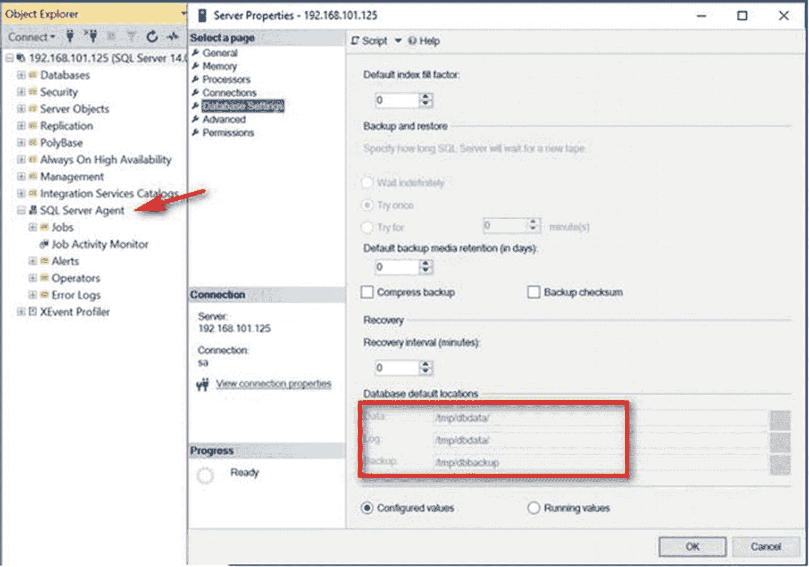

图 8-14：验证脚本执行后的配置变更

### 向脚本传递参数

虽然脚本能按预期工作，但我不喜欢在文件中硬编码密码的想法。任何能拿到脚本文件的人都可以读取 `sa` 登录的密码，这可能会危及 SQL Server 实例的安全。如果我们将 `sa` 登录密码作为命令行参数传递给脚本，会怎样呢？

像其他命令行脚本一样，bash 脚本也接受命令行参数。所有命令行参数都可以通过其位置编号使用 `$` 来访问。请看以下示例命令：

```bash
sudo ./automateSQLinstall.sh mYSecUr3PAssw0rd enterprise
```

这里我调用了 `automateSQLinstall.sh` 文件，并向它传递了两个命令行参数——`mYSecUr3PAssw0rd` 和 `enterprise`。你可能已经猜到，第一个参数是 `sa` 登录密码，第二个是 SQL Server 版本。在脚本内部，可以使用它们的位置编号来访问这些参数值。`mYSecUr3PAssw0rd` 参数值可以通过 `$1` 访问，而 `enterprise` 参数值可以通过 `$2` 访问。我可以使用以下代码片段在脚本内部将这些参数值声明为变量：

```bash
#VARIABLES
MSSQL_SA_PASSWORD=$1
MSSQL_PID=$2
```

然后，我可以使用命令行参数值，通过相应的环境变量来运行 `/opt/mssql/bin/mssql-conf` 脚本，如下所示：

```bash
sudo MSSQL_PID=$MSSQL_PID ACCEPT_EULA=Y MSSQL_SA_PASSWORD=$MSSQL_SA_PASSWORD /opt/mssql/bin/mssql-conf setup
```

### 在 Bash 脚本中添加条件逻辑

既然我们正在使脚本动态化并传递命令行参数值，我们就需要验证用户输入。回想一下，安装 SQL Server 时 `sa` 登录密码是一个必需参数。我们将添加条件逻辑来评估用户是否提供了 `sa` 登录密码的值。执行此操作的代码片段如下所示：

```bash
#Check if the sa password string is null or has zero length
if [ -z $MSSQL_SA_PASSWORD ]
then
echo Environment variable MSSQL_SA_PASSWORD must be set for unattended install
exit 1
fi
```

一个简单的 `if...then` 条件语句评估 `$MSSQL_SA_PASSWORD` 参数值是否为 null 或长度为零。退出代码 `1` 会将脚本执行状态设置为失败，并导致其中止。验证 `sa` 登录密码还有更多内容，例如复杂性要求，包括最小密码长度、大写、小写、非字母数字字符以及十进制数字的包含。这只是一个简单示例，用于验证用户是否为 `sa` 登录密码提供了值。

那么版本（edition）呢？由于我们最初为版本提供了一个环境变量，因此我们需要为其提供一个值。这意味着我们也需要评估用户是否在命令行参数中提供了值。以下代码片段展示了如何操作。这里，如果用户没有提供任何内容，我们会设置一个默认值——在本例中是开发者版（Developer Edition）：

```bash
#Check if the edition parameter is null or has zero length
if [ -z $MSSQL_PID ]
then
MSSQL_PID=Developer
fi
```

以下是一个针对 RHEL/CentOS Linux 系统的更新版脚本，其中包含了参数值和条件逻辑评估：

```bash
#!/bin/bash
### VARIABLES
MSSQL_SA_PASSWORD=$1
MSSQL_PID=$2
if [ -z $MSSQL_SA_PASSWORD ]
then
echo Environment variable MSSQL_SA_PASSWORD must be set for unattended install
exit 1
fi
if [ -z $MSSQL_PID ]
then
MSSQL_PID=Developer
fi
sudo curl -o /etc/yum.repos.d/mssql-server.repo https://packages.microsoft.com/config/rhel/7/mssql-server-2017.repo
sudo yum install -y mssql-server
sudo MSSQL_PID=$MSSQL_PID ACCEPT_EULA=Y MSSQL_SA_PASSWORD=$MSSQL_SA_PASSWORD /opt/mssql/bin/mssql-conf setup
sudo systemctl enable mssql-server
sudo firewall-cmd --zone=public --add-port=1433/tcp --permanent
sudo firewall-cmd --reload
sudo /opt/mssql/bin/mssql-conf set sqlagent.enabled true
sudo mkdir /tmp/dbdata
sudo chown mssql /tmp/dbdata
sudo chgrp mssql /tmp/dbdata
sudo /opt/mssql/bin/mssql-conf set filelocation.defaultdatadir /tmp/dbdata
sudo /opt/mssql/bin/mssql-conf set filelocation.defaultlogdir /tmp/dbdata
sudo mkdir /tmp/dbbackup
sudo chown mssql /tmp/dbbackup
sudo chgrp mssql /tmp/dbbackup
sudo /opt/mssql/bin/mssql-conf set filelocation.defaultbackupdir /tmp/dbbackup
sudo /opt/mssql/bin/mssql-conf traceflag 3226 on
sudo systemctl restart mssql-server
```

以下是 Ubuntu 中相应的脚本：

```bash
#!/bin/bash
#VARIABLES
MSSQL_SA_PASSWORD=$1
MSSQL_PID=$2
if [ -z $MSSQL_SA_PASSWORD ]
then
echo Environment variable MSSQL_SA_PASSWORD must be set for unattended install
exit 1
fi
if [ -z $MSSQL_PID ]
then
MSSQL_PID=Developer
fi
curl https://packages.microsoft.com/keys/microsoft.asc | sudo apt-key add -
sudo add-apt-repository "deb [arch=amd64] https://packages.microsoft.com/ubuntu/16.04/mssql-server-2017 xenial main"
sudo apt-get update
sudo apt-get install -y mssql-server
sudo MSSQL_PID=$MSSQL_PID ACCEPT_EULA=Y MSSQL_SA_PASSWORD=$MSSQL_SA_PASSWORD /opt/mssql/bin/mssql-conf setup
sudo systemctl enable mssql-server
sudo ufw --force enable
sudo ufw allow 22/tcp
sudo ufw allow 1433/tcp
sudo /opt/mssql/bin/mssql-conf set sqlagent.enabled true
sudo mkdir /tmp/dbdata
sudo chown mssql /tmp/dbdata
sudo chgrp mssql /tmp/dbdata
sudo /opt/mssql/bin/mssql-conf set filelocation.defaultdatadir /tmp/dbdata
sudo /opt/mssql/bin/mssql-conf set filelocation.defaultlogdir /tmp/dbdata
sudo mkdir /tmp/dbbackup
sudo chown mssql /tmp/dbbackup
sudo chgrp mssql /tmp/dbbackup
sudo /opt/mssql/bin/mssql-conf set filelocation.defaultbackupdir /tmp/dbbackup
sudo /opt/mssql/bin/mssql-conf traceflag 3226 on
sudo systemctl restart mssql-server
```

你现在可以像下面这样使用位置命令行参数来运行脚本：

```bash
sudo ./automateSQLinstall.sh mYSecUr3PAssw0rd enterprise
```

再次，坐好，放松，见证奇迹发生。


