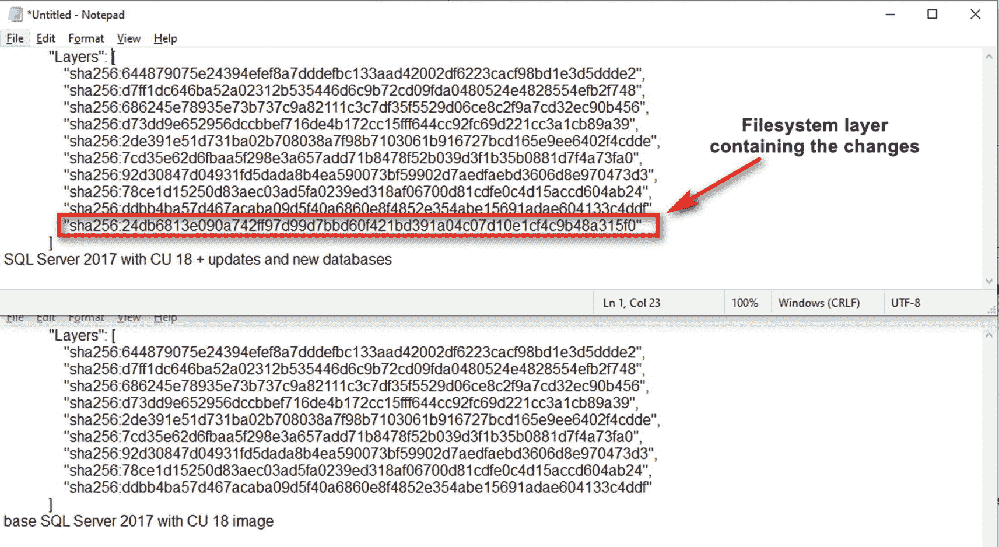
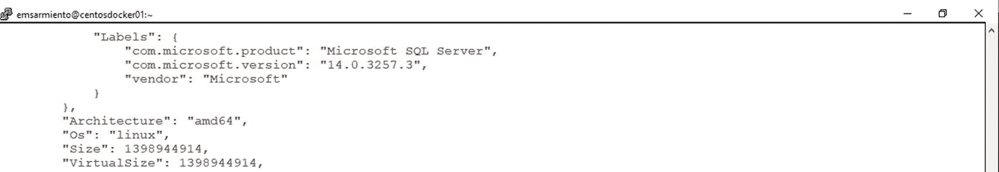
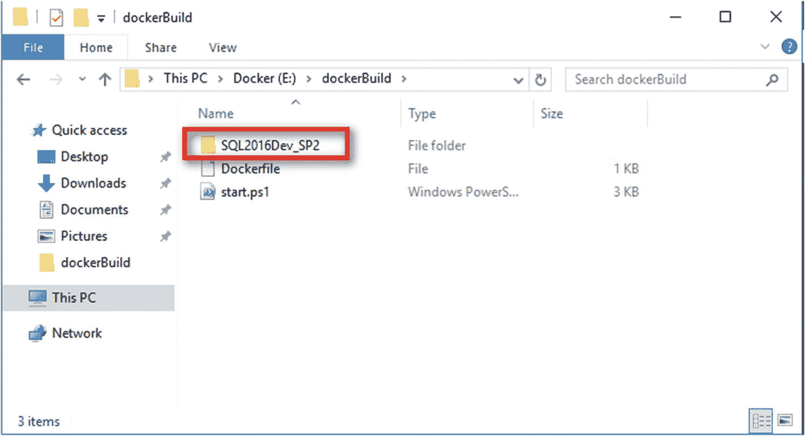

# 9. 在 Windows 上创建自定义 SQL Server 容器镜像

> *当然，仅仅因为某件事是传统，并不构成去做的理由。*
>
> ——雷蒙尼·斯尼奇，《空白之书》

上私立学校意味着要遵守某些着装规范——带有校徽的白色有领衬衫、海军蓝正装裤和黑色皮鞋。无论刮风下雨，都必须穿校服。想象一下，在季风暴雨中，你背着一个装满所有书本和笔记本的 15 磅重背包穿过校园。无论你的现成皮鞋质量有多好，它们都撑不过一个学期。更糟糕的是，九年级的男生在课间休息时喜欢打闹和奔跑。每当我抱怨磨坏的皮鞋时，妈妈都会狠狠地责骂我。

直到我哥哥的朋友向我们介绍了定制皮鞋。菲律宾鞋都的一位老人决定开创自己的事业，用升级改造的飞机轮胎作为鞋底制作定制皮鞋。我不知道他是怎么想到用升级改造的飞机轮胎做鞋底的，也不知道他从哪里弄来的轮胎（我相当确定他并没有到处闯入机场去割破飞机轮胎来获取它们）。但我们可不想错过这个机会。我们拜访了那位老人，量了尺寸，并被告知要等两周，因为做这些鞋需要这么长时间——漫长的两周。对于一个青少年来说，那感觉像永恒一样漫长。但我们必须等待。另外，如果你好奇的话，我们确实付了鞋钱。它们的价格几乎是以前买的现成皮鞋的两倍。

拿到我的鞋后，我立刻穿上并开始奔跑。我想看看它们是否符合我的期望。结果让我印象深刻。我每天都穿着它们。它们虽然不像我之前的皮鞋那么舒适，但确实满足了我的需求。它们撑过了好几个学年，三年前我去我妈妈家时还看到了它们。我已经穿不下了，但它们看起来仍然很棒，还能穿。这证明，你可以找到专门满足你需求的东西——无论是找到能提供它的人，还是自己动手制作。

我们在前几章中使用的容器都是来自 Docker Hub 或 Microsoft Container Registry (MCR) 等注册表的公开可用镜像。在某些情况下，你可能需要遵循公司标准、满足合规性要求或仅仅是标准化部署的自定义构建镜像。在 Windows 方面，一个例子可能是在 Windows Server 2016 容器上构建带有 Service Pack 2 的 SQL Server 2016。只有 Windows 容器上的 SQL Server 2017 是微软公开提供的。在 Linux 方面，也许你希望将容器操作系统标准化为 Red Hat Enterprise（或 CentOS）Linux，而不是 Ubuntu。

本章将介绍如何创建可部署为容器的自定义 SQL Server on Windows 镜像。我们将学习使用 `Dockerfile`，这是一个文本文件，包含用户在命令行上可以运行的所有命令，以创建自定义的 Docker 镜像。创建自定义 Docker 镜像后，我们将部署一个容器并连接到它，以验证它是否满足我们所有的定制要求。

## 创建自定义 Docker 镜像

有两种方法可以创建自定义 Docker 镜像。第一种是更新一个正在运行的容器，并使用 `docker commit` 命令来创建一个包含这些更改的新镜像。这里的想法是，你想修改一个基础镜像，并将其用作新的自定义镜像的参考。

让我们使用公开可用的 SQL Server on Linux Docker 镜像。别混淆了。本章仍然专注于 Windows。我只是用 Linux Docker 镜像作为例子来简化说明。稍后你会明白为什么。你可以在这些容器中添加数据库并进行必要的修改。完成后，你可以运行以下 `docker commit` 命令来基于更改后的容器创建一个新镜像，其中 `sqldevlinuxcon01` 是正在运行的容器的名称，`sqlserver2017-cu18-ubuntu-16.04-with-dbs:v2.0` 是新镜像的名称。作为最佳实践，我为镜像添加了一个标签，以便我可以轻松识别它是什么。

```
docker commit sqldevlinuxcon01 sqlserver2017-cu18-ubuntu-16.04-with-dbs:v2.0
```

回顾*第* *5**章*。运行此命令将创建一个新的文件系统层，其中包含你所做的更改。如果你对这个新镜像运行 `docker inspect` 命令，并与来自 MCR 的镜像进行比较，你会看到新的文件系统层，如图 9-1 所示。其他所有内容看起来都一样。



图 9-1

添加到包含更改的镜像中的新文件系统层

你可以使用这个新镜像来创建包含额外更改的容器。看看下面这个使用新创建镜像的 `docker run` 命令：

```
docker run -e "ACCEPT_EULA=Y" -e "SA_PASSWORD=mYSecUr3PAssw0rd" -p 1413:1433 --name sqldevlinuxcon03 -d -h linuxsqldev01 sqlserver2017-cu18-ubuntu-16.04-with-dbs:v2.0
```

这里有一个问题：commit 操作不会包含挂载到容器内的卷中存储的任何数据。如果 `sqldevlinuxcon01` 容器挂载在一个 Docker 卷上，并且你的用户数据库是在该卷中创建和存储的，那么这些都不会被包含进来。这是我**不**使用 `docker commit` 命令来创建自定义 Docker 镜像的主要原因之一。


## 探索 `Dockerfile`

第二种——也是推荐的——创建自定义 Docker 镜像的方法是使用 `Dockerfile`。`Dockerfile` 本质上是一个文本文件，其中包含了用户可以在命令行上运行的所有命令，用以构建自定义的 Docker 镜像。这就像使用 `ConfigurationFile.ini` 文件，通过相同的配置来部署 SQL Server。我喜欢把 `Dockerfile` 想象成一份食材清单，你需要它来制作一个配方（你的 Docker 镜像），然后别人可以使用这个配方来烘焙一个蛋糕（你的容器）。你可以从不同来源获取食材，并用它们来制作配方。你可以把你的配方交给任何有耐心和创意的人去烘焙蛋糕（嘿，我得为开发者们说点好话）。

与编写脚本类似，`Dockerfile` 包含一系列顺序列出的命令、指令或参数，这些指令将对您选择的基础 Docker 镜像执行操作，以创建一个自定义镜像。而且因为它包含了镜像构建的详细信息，对于那些想了解镜像是如何构建的人来说，它是一份很好的文档。当我刚开始时，我花了很多时间阅读 [`https://github.com/microsoft/mssql-docker`](https://github.com/microsoft/mssql-docker) 上不同 SQL Server 镜像的 `Dockerfile` 参考资料。这让我了解了如何使用我首选的操作系统平台和 SQL Server 版本来构建我自己的自定义 SQL Server 镜像。另外，我旅行时晚上睡不好，所以我觉得读技术文档会有帮助。结果并没有。

你可以将 `Dockerfile` 存储在像 GitHub 这样的版本控制系统上，这样你就可以跟踪团队中不同成员所做的更改。因为我们正在构建一个包含所需操作系统和配置的 SQL Server 环境，你可以将 `Dockerfile` 视为一种实现*基础设施即代码*的方式。

### 文件本身

我确实说过 `Dockerfile` 只是一个文本文件。你可以使用你喜欢的文本编辑器来创建和编写 `Dockerfile`。我通常在 Windows 工作站上用 Notepad++ 开始编写。完成后，我会将其复制到 Windows Docker 主机、Linux Docker 主机或任何安装了 Docker CLI 客户端的机器上。

我觉得 `Dockerfile` 真正烦人的一点是文件名本身。它必须严格命名为 `Dockerfile`，首字母 "D" 大写，是一个没有空格的单词，并且没有文件扩展名。如果你使用的文本编辑器默认保存文件时带有 ".txt" 扩展名，请务必删除它。我记不清有多少次我不得不排查我的 `Dockerfile` 到底哪里出了问题，结果发现只是文件有扩展名。这就是我喜欢用 Notepad++ 的原因。

**提示**

不过，如果你想统一文件命名规范，实际上可以使用不同的文件名和扩展名。例如，你可以使用 `Dockerfile` 作为生产环境文件，而 `dockerFile.dev` 用于开发环境。这里的想法是，即使对于代码文件，你也要有合适的文档管理策略。毕竟，代码文件也可以被视为文档。你不仅想要跟踪和管理代码变更，还希望对它们进行适当的分类，这样团队中就不会有人意外部署仍在开发中的代码。无论你是在自动化代码审查还是实施持续集成，都没关系。一个能最大限度减少人为错误的适当流程有助于改进 DevOps 实践。在本章后面，你将看到一个如何使用不同文件名来构建自定义 Docker 镜像的示例。

`Dockerfile` 的格式如下所示：

```
#注释
INSTRUCTION 参数
```

`INSTRUCTION`（指令）不区分大小写，我觉得这很有趣，考虑到 Docker 最初是为 Linux 构建的。然而，惯例是将 `INSTRUCTION` 大写，以便与参数轻易区分开。让我们看看你可以在 `Dockerfile` 中包含的不同指令。我将在这里定义这些指令，尽管并非所有指令都会用于创建 Windows 上的自定义 SQL Server 镜像。其中一些将用于 Linux 上的 SQL Server。

### `FROM` 指令

`Dockerfile` 必须以 `FROM` 指令开头，尽管你可以争辩说它可以以注释开头。`FROM` 指令指定了你想要开始构建的基础 Docker 镜像（双关语）。它可以是基础操作系统的镜像，也可以是你想要在其上构建的现有镜像。当你构建自定义的“黄金镜像”时，`FROM` 指令引用一个基础操作系统镜像。以下是 `FROM` 指令，告诉 `Dockerfile` 使用 Windows Server 2016 Core OS Build 14393.2972。可用的 Windows Server Core 镜像列表可在 [`https://hub.docker.com/_/microsoft-windows-servercore`](https://hub.docker.com/_/microsoft-windows-servercore) 获取。

```
FROM mcr.microsoft.com/windows/servercore:10.0.14393.2972
```

与运行 `docker run` 命令类似，如果在构建期间 `FROM` 指令中的镜像在 Docker 主机上本地不存在，它将在创建自定义镜像之前从公共仓库中拉取。

### `LABEL` 指令

`LABEL` 指令是一个键值对，用于向镜像添加元数据。可以将其视为关于自定义镜像的附加注释——它使用了什么基础镜像、上面运行什么应用程序、版本是什么等等。以下是一个如何编写多行 `LABEL` 指令的示例：

```
LABEL name="Windows Server 2016 上的 SQL Server 2016 SP2"
LABEL version="1.00.00"
LABEL environment="dev/test"
LABEL maintainer="theawesomedbateam@testdomain.com"
```

当你对正在检查的镜像运行 `docker inspect` 命令时，这些信息会显示在输出的 `Labels`（标签）部分，如图 9-2 所示。



图 9-2
拥有多个 `LABEL` 指令的 Linux 上 SQL Server 镜像元数据

就像任何类型的文档一样，你需要定义标准。你不希望你的一些 `Dockerfile` 文件使用 `LABEL` 指令，而其余的却使用注释。我建议在一种情况下将 `LABEL` 指令作为标准：当使用你自定义镜像的人无法访问 `Dockerfile` 时。


### RUN 指令

显然，`RUN` 指令用于执行命令。这将是你最常用的指令之一。你可以使用其两种形式中的任意一种来使用 `RUN` 指令：

*   `SHELL` 形式：命令在操作系统的默认命令 shell 中运行——在 Linux 上是 `/bin/sh -c`，在 Windows 上是 `cmd /S /C`。
*   `EXEC` 形式：命令直接调用可执行文件，而不调用命令 shell。使用 EXEC 形式可以防止传递给命令 shell 的字符串发生可能的破坏性更改，这在命令行中进行字符串操作时很常见。

`RUN` 指令并非唯一拥有两种形式的指令。你将在本章后面的章节中看到，其他指令也同时具有 SHELL 和 EXEC 形式。

以下是使用 SHELL 形式的 `RUN` 指令的示例。该命令将使用 PowerShell 命令 shell（而不是默认的 `cmd.exe` shell）并将 `MSSQLSERVER` 服务的启动类型设置为自动。如果你想知道的话，Windows 容器仍然使用服务，这与 Linux 容器不同，后者只需运行一个进程。

```
RUN powershell -Command (Set-Service MSSQLSERVER -StartupType Automatic)
```

等效的 EXEC 形式的 `RUN` 指令如下所示：

```
RUN ["powershell", "-Command", "Set-Service MSSQLSERVER -StartupType Automatic"]
```

SHELL 和 EXEC 形式之间的区别在于 `RUN` 指令的执行方式。在 SHELL 形式中，命令在默认 shell 的上下文中运行。在 EXEC 形式中，命令被显式运行。使用前面的 `RUN` 指令示例，SHELL 形式将在 Docker 镜像中运行以下命令：

```
cmd /S /C powershell -Command (Set-Service MSSQLSERVER -StartupType Automatic)
```

相反，在 EXEC 形式中，命令显式执行。当然，我们假设命令的路径已在系统环境变量中定义。

```
powershell -Command (Set-Service MSSQLSERVER -StartupType Automatic)
```

只要你能使用基础镜像层运行它，你就可以使用 `RUN` 指令执行不同的命令——下载文件、创建目录、配置设置等等。你可以利用基础镜像的能力和 shell 环境的功能来做任何你想做的事情。

`RUN` 指令将在当前镜像之上的一个新的可读写文件系统层中执行任何命令。这是一个基于现有镜像创建的新的、临时的容器。一旦命令完成，结果将被提交到镜像，就像使用 `docker commit` 命令所做的那样。这将显示为一个新的文件系统层，如图 9-1 所示。这个新镜像成为 `Dockerfile` 中下一个指令的起点。然后临时容器将被移除。还记得*第 5* 章中关于乐高积木的比喻吗？

### COPY 指令

`COPY` 指令从源位置复制新文件或目录，并将它们添加到容器文件系统中的指定路径。与 `RUN` 指令类似，它也有两种形式：

*   `COPY <源路径> <目标路径>`
*   `COPY ["<源路径>", "<目标路径>"]`

第二种形式用于路径中包含空格的情况，例如 `C:/Program Files/Microsoft SQL Server`，这主要适用于 Windows 而非 Linux。文件和目录必须位于相对于 `Dockerfile` 的路径中，并且 `<目标路径>` 需要使用正斜杠进行引用（即使在 Windows 上，也要考虑 Linux 风格）。以下是一个 `COPY` 指令示例，用于将存储 `Dockerfile` 的机器上的 SQL Server 2016 Developer Edition with Service Pack 2 安装介质复制到 C:/SQL2016Dev_SP2 目录：

```
COPY /SQL2016Dev_SP2 C:/SQL2016Dev_SP2
```

注意

我刚开始时感到困惑的一件事是 Docker for Windows 文档中（包括来自 Docker 和 Microsoft 的文档）对正斜杠的使用。例如，你需要将 `C:\Windows\System32\cmd.exe` 写成 `C:/Windows/System32/cmd.exe`。我们在 Windows 中一直使用反斜杠（`\`）作为路径分隔符。但由于 Docker 最初是为 Linux 创建的，它遵循 Linux 的约定，使用正斜杠（`/`）作为路径分隔符。如果你想在 Docker 中使用反斜杠，你需要正确地转义它。这是因为反斜杠字符在 Linux 中被用作转义字符。如果你想坚持在 Windows 中的做法，你需要“转义转义字符”。前面的例子需要写成 `C:\\Windows\\System32\\cmd.exe`。或者直接使用正斜杠代替。

`<源路径>` 必须在构建上下文内部。如果你将 `Dockerfile` 存储在 Windows 机器上的 `E:/dockerBuild` 目录中（该机器具有 Docker CLI 客户端），那么 `SQL2016Dev_SP2` 目录应该在该目录内部。如果 `<源路径>` 是一个目录（如示例中所示），则仅复制其内容——包括文件系统元数据——而不复制目录本身。图 9-3 展示了 Windows Docker 主机上构建上下文的文件系统结构。本章稍后我将解释 `start.ps1` PowerShell 脚本的用途。



图 9-3

Windows Docker 主机上构建上下文的文件系统结构

在 Linux 上，你可以将 `chown` 命令与 `COPY` 指令一起传递，格式为 `COPY [--chown=<用户>:<组>] <源路径>... <目标路径>`。这很有用，因为默认的 `COPY` 指令总是分配 UID 和 GID 值为 0 —— 即用户和组都等于 `root`。遵循最小权限原则，我们不想将所有内容都分配给 `root`。然而，只要容器不是以 `root` 身份运行，让 `root` 拥有容器内的文件和目录所有权是可以的。*第 10* 章提供了一个构建在 Linux 上运行 SQL Server 并以 `非 root` 用户身份运行的自定义 Docker 镜像的示例。


### ADD 指令

`ADD` 指令与 `COPY` 指令类似，但除了仅在文件系统之间复制外，还具有额外的功能。你可以使用 `ADD` 指令从一个带有 URL 的远程位置进行复制。假设你想将 `start.ps1` PowerShell 脚本从 [`github.com/microsoft/mssql-docker/blob/master/windows/mssql-server-windows-developer/start.ps1`](https://github.com/microsoft/mssql-docker/blob/master/windows/mssql-server-windows-developer/start.ps1) 复制到你 Windows 上自定义 SQL Server 镜像的 `C:/` 目录下。你可以使用以下 `ADD` 指令：

```
ADD https://github.com/microsoft/mssql-docker/blob/master/windows/mssql-server-windows-developer/start.ps1 /
```

你可能已经猜到了 `start.ps1` PowerShell 脚本的用途。如果你查看在 [`github.com/microsoft/mssql-docker/blob/master/windows/mssql-server-windows-developer/dockerfile`](https://github.com/microsoft/mssql-docker/blob/master/windows/mssql-server-windows-developer/dockerfile) 提供的用于创建 Windows 上自定义 SQL Server 镜像的 `Dockerfile`，你会发现该 `start.ps1` PowerShell 脚本是在最后一个指令——即 `CMD` 指令中被调用的。

我更倾向于在本地提供文件，而不是从 URL 复制。我想确保我使用的文件——无论是脚本还是安装文件——都没有任何潜在的文件损坏错误。我希望在将它们纳入任何自动化流程之前，能先在本地文件系统中手动测试它们。事实上，在我过去构建用于部署不同版本和版本的 SQL Server 的自动化流程时，所有安装介质都已提前下载到网络文件共享中并经过手动测试。这样可以避免因为某个 CAB 文件损坏而导致安装失败，从而省去了排查故障的麻烦。我相信你过去在安装 SQL Server 时也遇到过这种情况。

### SHELL 指令

`SHELL` 指令允许覆盖用于命令 shell 形式的默认 shell。在 Windows 容器上使用此指令更为常见，因为 Windows 同时拥有 `cmd.exe` 和 `powershell.exe` 两种 shell。Windows 的默认 shell 是 `cmd.exe`。作为一个 PowerShell 爱好者，我更喜欢在 Windows 上使用 `SHELL` 指令，这样我就能充分利用使命令执行更简便的内置 cmdlet。`SHELL` 指令以 `SHELL ["executable", "parameters"]` 的形式编写。将 `RUN` 指令中使用的示例改写为使用 `SHELL` 指令：

```
SHELL ["powershell", "-Command", "Set-Service MSSQLSERVER -StartupType Automatic"]
```

如果你在 `Dockerfile` 中有一系列想要运行的 PowerShell 命令，这会使事情变得简单得多。假设你想在安装完成后从容器中删除 `SQL2016Dev_SP2` 目录。你可以使用 `SHELL` 指令定义默认 shell，并使用 `RUN` 指令来执行 PowerShell 命令：

```
#将 PowerShell 设置为命令 shell
SHELL ["powershell", "-Command"]
#运行 Set-Service PowerShell cmdlet 来配置 MSSQLSERVER
RUN Set-Service MSSQLSERVER -StartupType Automatic
#运行 Remove-Item PowerShell cmdlet 来删除目录
RUN Remove-Item -Path C:/SQL2016Dev_SP2 -Recurse -Force
```

显然，在构建镜像时利用 PowerShell，使用 `SHELL` 指令比使用 `RUN` 指令更高效。尽管你可能开始认为 `SHELL` 指令是专门为 Windows 容器编写的，但你也可以在 Linux 上使用它来切换到不同的 shell。但是，当默认 shell 已经能完成你需要的大部分工作时，为什么还要在 Linux 容器内这样做呢？

### CMD 指令

`CMD` 指令允许你在使用 `docker run` 命令运行容器时设置一个默认命令和默认参数。如果在运行容器时你没有提供命令，就会执行此指令。但是，如果你选择用特定的命令运行容器，它就会被覆盖。与你可以在 `Dockerfile` 中拥有多个的 `RUN` 和 `SHELL` 指令不同，只有最后一个 `CMD` 指令会被评估。拥有多个 `CMD` 指令是没有意义的。另外，你希望 `CMD` 指令执行某些会持续运行而不会退出的操作。如果你执行一个完成后就退出的命令，容器也会随之终止。你不希望 `CMD` 指令在 Windows 中运行像 `NET START MSSQLSERVER` 这样的服务，因为它会在命令完成后退出，并随之终止容器。想在容器内以服务方式运行 SQL Server，这样可不行。

`CMD` 指令不是两种，而是有三种形式：

*   `CMD ["executable", "param1", "param2"]`（`EXEC` 形式，这是推荐的形式）
*   `CMD ["param1", "param2"]`（作为 `ENTRYPOINT` 的默认参数）
*   `CMD command param1 param2`（`SHELL` 形式）

如果你想在 `Dockerfile` 中将最后一条指令设为运行一个名为 `start.ps1` 的 PowerShell 脚本，以下是以 `EXEC` 形式表示的 `CMD` 指令。这假设你已经在运行该脚本之前将其复制到了镜像内部。

```
CMD ["powershell", "-Command", "C:/start.ps1"]
```

以 `SHELL` 形式运行 `CMD` 指令会使其行为类似于 `SHELL` 形式的 `RUN` 指令，使用默认的操作系统命令 shell。如果你想运行自己的命令，你需要将命令表达为一个 JSON 数组，传入可执行文件的完整路径并用双引号括起来——除非你使用了 `WORKDIR` 指令。以下是使用 `CMD` 指令运行一个名为 `sampleConsole.exe` 的 .NET 控制台应用程序的示例：

```
CMD ["C:/sampleConsole.exe", "--run"]
```

正如我提到的，在运行容器时，你可以覆盖在 `CMD` 指令中定义的默认命令。例如，使用 `docker run` 命令运行 Windows Server 2016 Core Docker 镜像会在创建后立即终止容器。我找不到创建此镜像的参考 `Dockerfile` 来查看其中的 `CMD` 指令，但它确实会在创建后终止。如果我想让容器保持运行，我可以向容器传递一个不会退出的命令，以覆盖 `CMD` 指令中写的任何内容。以下是向 `docker run` 命令传递 `ping localhost -t` 命令的示例：

```
docker run mcr.microsoft.com/windows/servercore:ltsc2016 ping localhost -t
```


## ENTRYPOINT 指令

仿佛拥有 `RUN`、`SHELL` 和 `CMD` 指令还不够，现在又多了一个要加入列表的：`ENTRYPOINT` 指令。`ENTRYPOINT` 指令用于将正在运行的容器视作一个可执行文件。这通常在你希望容器作为一个特定可执行文件的便携式封装，而不期望用户在运行时覆盖该可执行文件时使用。如果你希望容器每次运行相同的可执行文件，这将非常有用。这意味着你无法使用 `docker run` 命令覆盖该命令。但是，任何添加到 `docker run` 命令末尾的内容都会被追加到 `ENTRYPOINT` 指令中定义的命令后面。我曾经认为 `ENTRYPOINT` 指令对 SQL Server 容器没什么用，直到我意识到，如果你希望限制容器只能运行 SQL Server 而不能运行其他东西，并且可能需要在启动时传递参数，就可以使用它。此外，没有什么能阻止你覆盖 Windows 中运行 `start.ps1` PowerShell 脚本的 `CMD` 指令，而只运行 `ipconfig` 命令。或者在 Linux 中覆盖运行 SQL Server 进程的指令，而只运行 `bash`。当然，这样做也意味着在你重启容器并且不覆盖 `CMD` 指令之前，SQL Server 将不再运行。

与 `RUN` 指令类似，`ENTRYPOINT` 指令有两种形式，EXEC 形式（首选）和 SHELL 形式。以下是一个在 Windows 中使用 EXEC 形式的 `ENTRYPOINT` 指令来运行 SQL Server 可执行文件的示例。只需将 `{nn}` 替换为你正在运行的 SQL Server 版本号：

```dockerfile
ENTRYPOINT ["C:/Program Files/Microsoft SQL Server/MSSQL{nn}.MSSQLSERVER/MSSQL/Binn/sqlservr.exe"]
```

## CMD vs. RUN vs. SHELL vs. ENTRYPOINT

在创建 `Dockerfile` 时，选择这些不同的指令可能会令人困惑。请记住以下几点：

*   一个 `Dockerfile` 中只能有一个有效的 `CMD` 指令——只有最后一个会被评估。如果你想让你的容器覆盖 `CMD` 指令中定义的命令，请使用此指令。
*   使用 `RUN` 指令来运行命令以构建你的自定义 Docker 镜像。
*   如果你想更改默认的命令 shell 并将其用于大多数命令，请使用 `SHELL` 指令。
*   使用 `ENTRYPOINT` 指令来防止用户覆盖你希望容器运行的可执行文件。
*   你可以在 `Dockerfile` 中将 `ENTRYPOINT` 指令与 `CMD` 指令结合使用。这样做时，`CMD` 指令中的字符串将被追加到 `ENTRYPOINT` 指令之后。`CMD` 指令必须是 `Dockerfile` 中的最后一条指令。
*   你可以使用 `ENTRYPOINT` 或 `CMD` 指令来运行一个进程或一个脚本。如果你正在运行一个脚本，请确保它运行的是一个不会退出的进程或命令。

这样做的好处是，构建自定义 SQL Server 镜像不需要太多的配置设置。你只需要一个基础镜像和 SQL Server 安装文件，然后在安装后配置 SQL Server 实例，就一切就绪了。当我们开始编写 `Dockerfile` 时，你会看到这些指令是如何一起使用的。

## WORKDIR 指令

`WORKDIR` 指令为其他指令（如 `RUN`、`CMD`、`ENTRYPOINT`、`COPY` 和 `ADD`）设置一个工作目录。如果构建过程中目标镜像中不存在 `WORKDIR`，则会创建它。当你希望从自定义路径运行可执行文件或脚本时，它非常有用——定义 `WORKDIR`，然后相对于它运行可执行文件。你可以将其视为在构建过程中在容器内部执行 `cd` 命令。如果你的可执行文件路径非常长（例如 Windows 上 SQL Server 的默认安装目录），并且你不想在整个 `Dockerfile` 中重复它，这也很有用。然而，使用 `ENV` 指令来定义路径更为合适，因为通常将路径定义为环境变量。以下是一个在构建过程中使用 `WORKDIR` 指令将工作目录设置为 `C:/` 的示例：

```dockerfile
WORKDIR /
```

再次强调，在 Windows 中执行此操作时，考虑 Linux 的思维方式有助于最小化转义字符的使用。明白了吗？

## ENV 指令

`ENV` 指令是一个键值对，用于设置一个持久的环境变量，该变量在构建时和容器运行时都可用。还记得你一直在 `docker run` 命令中使用的 `-e` 参数吗？

`ENV` 指令有两种形式：

*   `ENV <key> <value>`
*   `ENV <key>=<value>`

我更喜欢使用第二种形式——`ENV <key>=<value>`——因为它更加明确。它还允许在一行中设置多个键值对。以下是一个为 SQL Server EULA 设置键值对并分配 `sa` 登录密码的示例。我选择将它们显示在多行中以示区分：

```dockerfile
ENV SA_PASSWORD="y0urSecUr3PAssw0rd"
ENV ACCEPT_EULA="Y"
```

但它们也可以合并为一行，如下所示：

```dockerfile
ENV SA_PASSWORD="y0urSecUr3PAssw0rd" ACCEPT_EULA="Y"
```


## 使用转义字符

我不知道你怎么想，但我不喜欢将长命令拆分成多行。我的大脑更倾向于把命令看成单行形式，无论它有多长，就像直接在命令行里输入一样。回想第 8 章中用于创建 Linux 上 SQL Server 自动化安装脚本的命令，每一条命令都是单行写成的——尤其是调用`/opt/mssql/bin/mssql-conf`的那一条。

然而，有些人不喜欢将很长的命令写在单行里。他们将其拆分成较小的部分，以便在屏幕的单页内可读。就好像他们的终端窗口或命令行 Shell 不会自动将文本换行到下一行。我并不怪他们。长时间盯着电脑屏幕可能导致所谓的数字眼疲劳（我非正式的研究也表明这会影响理智）。而转义字符就能在这里派上用场。

你可以在 Linux 和 PowerShell 中使用转义字符。在 Linux 中，使用反斜杠（`\`）来转义下一个字符，使其不被 Shell 解释。这常用于将长命令行写成多行。下面是一个使用反斜杠编写命令来配置 Linux 上的 SQL Server 并传递所需参数的示例：

```
sudo MSSQL_PID=$MSSQL_PID ACCEPT_EULA=Y \
MSSQL_SA_PASSWORD=$MSSQL_SA_PASSWORD \
/opt/mssql/bin/mssql-conf setup
```

如果你想在`Dockerfile`内部传递所需参数，而不是在`docker run`命令中，你可以对`RUN`指令做同样的事情。我更喜欢用`docker run`命令来传递参数。

```
RUN sudo MSSQL_PID=$MSSQL_PID ACCEPT_EULA=Y \
MSSQL_SA_PASSWORD=$MSSQL_SA_PASSWORD \
/opt/mssql/bin/mssql-conf setup
```

PowerShell 使用反引号（`` ` ``）操作符将一条很长的命令写成多行。假设你想重写`SHELL`指令部分使用的 PowerShell 命令示例，以便在设置`StartupType`属性之前先检查 MSSQLSERVER 服务是否存在；你可以使用下面这个`RUN`指令示例来实现：

```
RUN Get-Service | Where {$_.Name -eq "MSSQLSERVER"} | `
Set-Service -StartupType Automatic
```

此外，你可以在`Dockerfile`内部定义一个转义字符。这在 Windows 上尤其有用，因为目录路径分隔符是反斜杠——与`Dockerfile`中默认的转义字符相同。这就是为什么你使用双反斜杠`C:\\Windows\\System32\\cmd.exe`而不是单反斜杠的原因。你可以通过定义一个解析器指令来更改`Dockerfile`中默认的转义字符。下面的指令将`Dockerfile`中默认的转义字符从反斜杠改为反引号。这使得它与 PowerShell 保持一致。

```
# escape=`
```

解析器指令是可选的。但如果你决定使用它们，它们必须写在`Dockerfile`的顶部，甚至要在`FROM`指令之前。

既然我们已经掌握了为构建 Windows 上的自定义 SQL Server 镜像编写`Dockerfile`所需的知识，是时候将所有部分整合在一起了。

## 使用 Dockerfile 整合所有部分

我在第 8 章提到过，我非常热衷于流程。因此，我概述了以下流程来创建一个基于 Windows Server 2016 Core 的自定义 SQL Server 2016 开发者版镜像。这些步骤是模仿了[`github.com/microsoft/mssql-docker/blob/master/windows/mssql-server-windows-developer/dockerfile`](https://github.com/microsoft/mssql-docker/blob/master/windows/mssql-server-windows-developer/dockerfile)中的 Dockerfile，以捕获在 Windows 上创建自定义 SQL Server 镜像所需的步骤。对流程有一个高层次的概览，可以让你优化和改进这些步骤，并可能用你自己的命令和脚本替换它们。

1.  从微软容器注册表（Microsoft Container Registry）中公开可用的 Windows Server 2016 Core 10.0.14393.2972 基础镜像开始。
2.  在镜像内部创建一个临时目录来存放 SQL Server 2016 开发者版的安装文件。
3.  将 SQL Server 2016 开发者版的安装文件从你的机器复制到镜像中。
4.  通过命令行安装 SQL Server 2016。
5.  将 SQL Server 服务启动类型设置为自动。
6.  从镜像中删除临时的 SQL Server 2016 开发者版安装介质文件夹。
7.  将命令 Shell 切换到 PowerShell，为运行脚本`start.ps1`做准备。
8.  将 PowerShell 脚本`start.ps1`复制到镜像的根目录——C:/。
9.  为 PowerShell 脚本执行设置当前工作目录。
10. 当容器启动时运行 PowerShell 脚本`start.ps1`。

我在本章中已经多次提到 PowerShell 脚本`start.ps1`。这个脚本做了几件事：

*   检查三个参数——`sa`登录密码、EULA 接受确认，以及如果你有想附加到 SQL Server 实例的数据库文件时 Azure Blob 存储的位置。
*   如果使用了 Docker secrets 来存储`sa`登录密码，则利用它。
*   进入一个无限循环，这样当你运行容器时脚本不会终止。

我只需要第一点中不包括从 Azure Blob 存储附加数据库的部分。但我使用这个脚本来演示如何利用`Dockerfile`中的不同指令来构建你的自定义镜像。你可以从[`github.com/Microsoft/mssql-docker/blob/master/windows/mssql-server-windows/start.ps1`](https://github.com/Microsoft/mssql-docker/blob/master/windows/mssql-server-windows/start.ps1)下载这个脚本。

为安装做准备，我从[`go.microsoft.com/fwlink/?LinkID=799009`](http://go.microsoft.com/fwlink/?LinkID=799009)下载了带有 Service Pack 2 的 SQL Server 2016 开发者版安装介质。由你决定下载 ISO 文件还是 CAB 文件。只需确保你将安装文件正确地提取到一个名为`SQL2016Dev_SP2`的目录中。如果你想添加最新的累积更新，请在安装前将其整合到安装介质中，并在从命令行安装 SQL Server 时使用`/UpdateSource`参数。请参考下面步骤 4 中的`RUN`指令。请遵循图 9-3 所示的文件系统结构。

以下是用于构建基于 Windows Server 2016 Core 的自定义 SQL Server 2016 开发者版（带 Service Pack 2 累积更新 11）镜像的`Dockerfile`。我将使用项目编号作为步骤，并在注释中标识它们：


