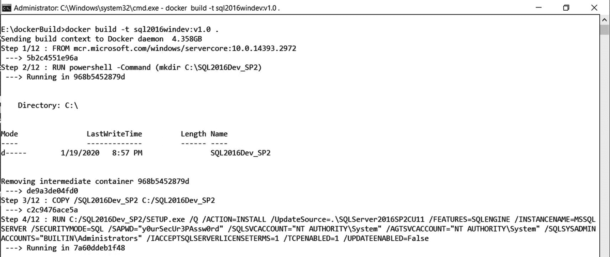
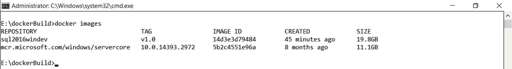
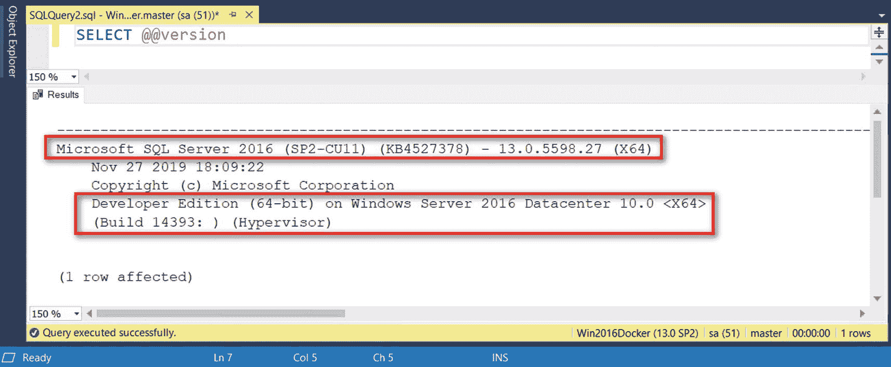
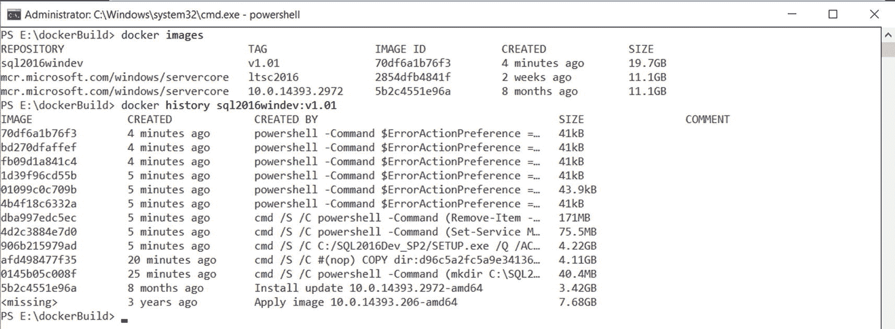
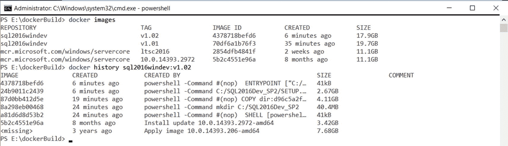

# 在 Windows 上构建自定义 SQL Server Docker 镜像

```
#Step 1
FROM mcr.microsoft.com/windows/servercore:10.0.14393.2972
#Step 2
RUN powershell -Command (mkdir C:\SQL2016Dev_SP2)
#Step 3
COPY /SQL2016Dev_SP2 C:/SQL2016Dev_SP2
#Step 4
RUN C:/SQL2016Dev_SP2/SETUP.exe /Q /ACTION=INSTALL /UPDATEENABLED=True /UPDATESOURCE=./SQLServer2016SP2CU11 /FEATURES=SQLENGINE /INSTANCENAME=MSSQLSERVER /SECURITYMODE=SQL /SAPWD="y0urSecUr3PAssw0rd" /SQLSVCACCOUNT="NT AUTHORITY\System" /AGTSVCACCOUNT="NT AUTHORITY\System" /SQLSYSADMINACCOUNTS="BUILTIN\Administrators" /IACCEPTSQLSERVERLICENSETERMS=1 /TCPENABLED=1
#Step 5
RUN powershell -Command (Set-Service MSSQLSERVER -StartupType Automatic)
#Step 6
RUN powershell -Command (Remove-Item -Path C:/SQL2016Dev_SP2 -Recurse -Force)
#Step 7
SHELL ["powershell", "-Command", "$ErrorActionPreference = 'Stop'; $ProgressPreference = 'SilentlyContinue';"]
#Step 8
COPY /start.ps1 /
#Step 9
WORKDIR /
ENV SA_PASSWORD "y0urSecUr3PAssw0rd"
ENV ACCEPT_EULA "Y"
#Step 10
CMD ./start -sa_password $env:SA_PASSWORD -ACCEPT_EULA $env:ACCEPT_EULA -Verbose
```

仅仅查看 `Dockerfile` 中的指令，你已经能看出一些潜在的优化改进点。我们稍后再讨论这些。现在，是时候在 Windows 容器上构建我们的自定义 SQL Server 了。

## 构建 Windows 镜像上的自定义 SQL Server

将 `Dockerfile` 文件与 `SQL2016Dev_SP2` 目录以及 `start.ps1` PowerShell 脚本一起保存在 `<驱动器>:\dockerBuild` 目录中。你将在该目录的上下文中运行以下 `docker build` 命令。我们将新镜像命名为 `sql2016windev` 并打上 `v1.0` 标签。`docker build` 命令末尾的点（`.`）指定了路径。在本例中，`docker build` 命令将查看当前路径，并相对于当前路径评估 `Dockerfile` 内的所有指令。如果未明确指定，它还会告知 `docker build` 命令在该路径下查找名为 `Dockerfile` 的文件。

```
docker build -t sql2016windev:v1.0 .
```

图 9-4 显示了 `docker build` 命令输出的前几行。


图 9-4: docker build 命令的输出

请注意以下几点：

*   消息“将构建上下文发送到 Docker 守护进程 4.358GB”字面意思与其表述完全一致。Docker CLI 客户端正在将 `<驱动器>:\dockerBuild` 目录的全部内容发送给 Docker 守护进程。我创建 `<驱动器>:\dockerBuild` 目录并将其用作构建自定义镜像的路径，是因为我只想将此目录的内容复制到 Docker 守护进程。如果你在根目录（`<驱动器>:\`）上运行 `docker build` 命令，它会将根目录下的所有内容复制到 Docker 守护进程。你肯定不希望自己的私人 MP3 文件、简历或照片集最终出现在别人的容器里，对吧？

*   步骤 1/12。我们 `Dockerfile` 里不是只有 10 个步骤吗？为什么 `docker build` 命令识别出了 12 个？这是因为每一条指令都会创建一个步骤，包括步骤 10 之前的两条 `ENV` 指令。而且我们甚至还没有添加 `LABEL` 指令。

*   在步骤 2/12，消息“---> 在 968b5452879d 中运行”告诉你，这是 `RUN` 指令为此步骤运行命令而创建的临时容器。

*   在步骤 2/12，消息“---> 正在移除中间容器 968b5452879d”告诉你，此步骤创建的临时容器已被删除，其变更已提交以创建一个新镜像。这个新的文件系统层名为“de9a3de04fd0”。

*   通过命令行安装 SQL Server 时传递给 `SETUP.EXE` 命令的参数来源于 [*https://docs.microsoft.com/en-us/sql/database-engine/install-windows/install-sql-server-from-the-command-prompt?view=sql-server-ver15*](https://docs.microsoft.com/en-us/sql/database-engine/install-windows/install-sql-server-from-the-command-prompt%253Fview%253Dsql-server-ver15)。

*   每一条指令，包括 `ENV` 指令，都会创建一个文件系统层。

*   你会感到困倦。你的眼皮越来越重。现在，清醒一下。

构建完成后，你现在就可以使用这个自定义镜像来创建和运行一个新容器了。运行 `docker images` 命令查看新构建的镜像。图 9-5 显示了我的 Docker 主机中可用的镜像列表，包括刚构建的那个。Windows 容器的大小是我尽可能避免使用它们的主要原因。


图 9-5: 列出新构建的自定义 Docker 镜像

运行以下命令开始使用这个自定义镜像。图 9-6 展示了验证构建的 Windows 容器上的自定义 SQL Server——运行在 Windows Server 2016 Core 内部版本 14393.2972 上的 SQL Server 2016 Service Pack 2 Cumulative Update 11。


图 9-6: 验证 Windows 上的自定义 SQL Server Docker 镜像

```
docker run -e 'ACCEPT_EULA=Y' -e 'SA_PASSWORD=y0urSecUr3PAssw0rd' -p 1433:1433 --name sql-windevcon01 -d -h windevsql01 sql2016windev:v1.0
```

还记得我说过你可以为 `Dockerfile` 使用不同的文件名吗？假设你想将其命名为 `dockerFile.dev`，以表明这是开发人员使用的文件，而 `Dockerfile` 将严格用于生产环境（嗯，从开发人员的角度来看是生产环境）。你可以使用 `docker build` 命令的 `-f` 参数来指定要使用的文件名。下面的示例命令使用 `dockerFile.dev` 文件构建自定义镜像。点（`.`）字符仍然告诉 `docker build` 命令使用当前路径。

```
docker build -t sql2016windev:v1.01 -f dockerFile.dev .
```

你也可以向 `docker build` 命令传递绝对路径或 URL。下面的示例命令使用微软从 GitHub 提供的 `Dockerfile` 来构建一个以非 root 用户身份运行的自定义 SQL Server on Linux 镜像。我不能使用微软提供的 Windows 的 `Dockerfile` 来构建自定义 SQL Server on Windows 镜像，因为它没有更新——`FROM` 指令仍然指向一个过时的 Windows Server Core 镜像。

```
docker build -t sql2017linuxnonroot:v1.0  https://raw.githubusercontent.com/microsoft/mssql-docker/master/linux/preview/examples/mssql-server-linux-non-root/Dockerfile
```

请记住，`Dockerfile` 中的指令将在当前构建路径的上下文中执行。确保 `COPY` 或 `ADD` 指令中定义的所有依赖项，如脚本、安装文件等，都是可用的。

一旦你构建了自己的自定义镜像，你现在就可以将其用作创建其他自定义镜像的基础镜像。例如，你可以在你的 `Dockerfile` 的 `FROM` 指令中引用新构建的镜像，如下所示：

```
FROM sql2016windev:v1.01
```

**注意：** 如果你在微软提供的 SQL Server on Windows Docker 镜像的基础上构建自定义镜像，请记住它们在生产环境中**不受支持**。这在 [*https://hub.docker.com/r/microsoft/mssql-server-windows-developer/*](https://hub.docker.com/r/microsoft/mssql-server-windows-developer/) 的“预期用途”部分有重点说明。这也是为什么我更倾向于创建自己的自定义 Docker 镜像，本例中是一个运行在 Windows Server 2016 上的 SQL Server 2016 镜像。如果你决定将其部署到生产环境，请确保你运行的是受支持的 Windows Server 和 SQL Server 版本。Windows Server 2008 和 Windows Server 2008 R2 已不再处于扩展支持期。别费心了。


## 优化 Dockerfile

有几种方法可以优化镜像构建过程及最终生成的 Docker 镜像。我最关心的问题之一是文件系统层的大小。正是 Windows Server 2016 Core 基础镜像那 11.1GB 的大小，让我避免使用 Windows 容器。而这还仅仅是操作系统本身。公开可用的 Linux 版 SQL Server 镜像大小为 1.4GB。更不用说 Windows 上 SQL Server 安装文件的大小了。图 9-7 展示了针对自定义 Windows 版 SQL Server 镜像执行 `docker history` 命令的结果。



图 9-7

列出自定义 Windows 版 SQL Server Docker 镜像的不同文件系统层

这些文件大小会影响作为构建过程和容器运行时一部分的文件系统层的拉取和推送速度。在我的测试环境中，仅使用自定义 `Dockerfile` 运行 `docker build` 命令平均就需要 25 分钟。虽然你不会每小时都运行 `docker build` 命令，但你仍然需要考虑镜像大小和磁盘空间需求。

优化 `Dockerfile` 的两种常见方法是减少指令数量和减小文件系统层的大小。但在我们探讨减少指令数量之前，先看看是否可以识别出一些可以合并到其他指令中的现有命令。看一下第 5 步：

```
#Step 5
RUN powershell -Command (Set-Service MSSQLSERVER -StartupType Automatic)
```

它只是调用 PowerShell 命令行并将 `MSSQLSERVER` 服务的启动类型设置为 `自动`。我们可以将此指令合并，作为 `/SQLSVCSTARTUPTYPE` 参数包含在第 4 步中，第 4 步大致如下所示（重点在最后一个参数）：

```
#Step 4
RUN C:/SQL2016Dev_SP2/SETUP.exe /Q /ACTION=INSTALL /UPDATEENABLED=True /UPDATESOURCE=./SQLServer2016SP2CU11 /FEATURES=SQLENGINE /INSTANCENAME=MSSQLSERVER /SECURITYMODE=SQL /SAPWD="y0urSecUr3PAssw0rd" /SQLSVCACCOUNT="NT AUTHORITY\System" /AGTSVCACCOUNT="NT AUTHORITY\System" /SQLSYSADMINACCOUNTS="BUILTIN\Administrators" /IACCEPTSQLSERVERLICENSETERMS=1 /TCPENABLED=1 /SQLSVCSTARTUPTYPE="Automatic"
```

提示

我喜欢使用 `ConfigurationFile.ini` 文件来替代 SQL Server 安装命令行参数，从而缩短第 4 步。如果你选择这样做，请务必将 `ConfigurationFile.ini` 文件复制到 `SQL2016Dev_SP2` 目录内，并将其作为命令行参数的一部分调用。并且在自动化之前进行验证。

移除第 5 步所节省的空间——根据图 9-7 是 75.5MB——相对于镜像的总体大小来说微不足道。但这只是一个开始。评估现有指令，看看能否将它们合并到其他指令中。一旦你穷尽了所有可以合并到其他指令中的可能指令，就该组合相关的指令了。

看看第 4 和第 6 步。两者都使用了 `RUN` 指令。并且由于第 2 步也是一个 PowerShell 命令，为什么不使用 PowerShell 作为默认命令行呢？我们可以在第 1 步之后引入一个新的 `SHELL` 指令，如下所示：

```
SHELL ["powershell", "-Command"]
```

因为我们可以将第 4 步作为 PowerShell 命令调用，所以我们可以使用分号 (`;`) 将其与第 6 步合并，如下所示，将其变成一个单独的 `RUN` 指令。我还把 `setup.exe` 参数值中使用的双引号替换为单引号，以避免字符串被错误解释。我不想让双引号在 PowerShell 中被解释为特殊字符。

```
#Step 4 and 6 combined in a single line
RUN C:/SQL2016Dev_SP2/SETUP.exe /Q /ACTION=INSTALL /UPDATEENABLED=True /UPDATESOURCE=./SQLServer2016SP2CU11 /FEATURES=SQLENGINE /INSTANCENAME=MSSQLSERVER /SECURITYMODE=SQL /SAPWD='y0urSecUr3PAssw0rd' /SQLSVCACCOUNT='NT AUTHORITY\System' /AGTSVCACCOUNT='NT AUTHORITY\System' /SQLSYSADMINACCOUNTS='BUILTIN\Administrators' /IACCEPTSQLSERVERLICENSETERMS=1 /TCPENABLED=1 /SQLSVCSTARTUPTYPE='Automatic' ; Remove-Item -Path C:/SQL2016Dev_SP2 -Recurse -Force
```

了解不同的 Windows 命令和 PowerShell cmdlet 将有助于你知道哪些 `RUN` 指令可以合并。请参考 Windows 命令列表 [*https://docs.microsoft.com/en-us/windows-server/administration/windows-commands/windows-commands*](https://docs.microsoft.com/en-us/windows-server/administration/windows-commands/windows-commands)。你也可以运行 `Get-Command` PowerShell cmdlet 来检索你的 Windows 安装中所有原生的 PowerShell cmdlet。

还有什么？我们可以移除第 7、8、9 步以及两个 `ENV` 指令。我真的不喜欢 `start.ps1` PowerShell 脚本，因为我已经在 `setup.exe` 中提供了所需的参数——`SA_PASSWORD` 和 `ACCEPT_EULA`——分别对应 `/SAPWD` 和 `/IACCEPTSQLSERVERLICENSETERMS`。另外，我没有任何需要附加的 Azure Blob 存储上的示例数据库。而且，我可以用 `ENTRYPOINT` 指令调用 SQL Server 可执行文件来替换第 10 步。以下是经过修改、精简后的 `Dockerfile` 的样子：

```
#Step 1
FROM mcr.microsoft.com/windows/servercore:10.0.14393.2972
#Step 1A – switch the default command shell to PowerShell
SHELL ["powershell", "-Command"]
#Step 2
RUN mkdir C:/SQL2016Dev_SP2
#Step 3
COPY /SQL2016Dev_SP2 C:/SQL2016Dev_SP2
#Step 4 and 6 combined in a single line
RUN C:/SQL2016Dev_SP2/SETUP.exe /Q /ACTION=INSTALL /UPDATEENABLED=True /UPDATESOURCE=./SQLServer2016SP2CU11 /FEATURES=SQLENGINE /INSTANCENAME=MSSQLSERVER /SECURITYMODE=SQL /SAPWD='y0urSecUr3PAssw0rd' /SQLSVCACCOUNT='NT AUTHORITY\System' /AGTSVCACCOUNT='NT AUTHORITY\System' /SQLSYSADMINACCOUNTS='BUILTIN\Administrators' /IACCEPTSQLSERVERLICENSETERMS=1 /TCPENABLED=1 /SQLSVCSTARTUPTYPE='Automatic' ; Remove-Item -Path C:/SQL2016Dev_SP2 -Recurse -Force
#New Step 10
ENTRYPOINT ["C:/Program Files/Microsoft SQL Server/MSSQL13.MSSQLSERVER/MSSQL/Binn/sqlservr.exe"]
```

图 9-8 展示了更新后的自定义 Windows 版 SQL Server 镜像的 `docker history` 命令结果，包括使用原始镜像和使用修改后 `Dockerfile` 的新镜像之间的大小差异。我们将镜像大小从 19.7GB 减少到 17.9GB，指令数量从 12 条减少到 6 条。还不错。



图 9-8

列出修改 Dockerfile 后的镜像大小及不同的文件系统层

就像我说的，我们对 Windows Server 2016 Core 基础镜像的大小确实做不了太多。它就是那个样子。你可以通过使用 LTSC2016 镜像来再减少一个镜像层，但你仍然在处理一个 11.1GB 大小的镜像。

我已经向你提供了几种减少指令数量以优化 `Dockerfile` 及其生成镜像的方法。将其作为一个练习尝试一下，并思考其他可以合并或组合指令的方法。
提示


如果在运行 `docker build` 命令时遇到任何问题，最终会产生一个已停止的容器。该容器代表了构建失败的那一步。如果你希望保持环境整洁，没有不需要的容器，请务必在修复问题并重新运行构建之前删除这些已停止的容器。使用 `docker ps -a` 命令来显示失败步骤中使用的容器，并使用 `docker rm` 命令来删除它。你也可以使用针对特定 Docker 对象的 `prune` 子命令。例如，你可以运行 `docker image prune` 命令来删除所有未被标记且未被任何容器引用的镜像（也称为悬空镜像）。你还可以运行 `docker container prune` 命令来删除已停止的容器。有关清理未使用的 Docker 对象的更多信息，请参考 [`docs.docker.com/config/pruning/`](https://docs.docker.com/config/pruning/)。

## 本章小结

本章为使用 `Dockerfile` 构建自定义 Docker 镜像奠定了基础。只要你了解基础操作系统和想要运行的应用程序，就可以参考本章内容来构建任何自定义的 Docker 镜像。虽然提供的示例是用于构建 Windows 上的自定义 SQL Server 镜像，但其使用的 `Dockerfile` 和指令是相同的。你可以将运行在 Windows Server Core 上的自定义 ASP.NET Core 应用程序或运行在 Linux 上的 .NET Core 应用程序容器化。关于 `Dockerfile` 的更多信息，请访问 [`docs.docker.com/engine/reference/builder/`](https://docs.docker.com/engine/reference/builder/)。在下一章中，我们将探讨创建自定义的 Linux 上的 SQL Server 镜像。虽然步骤与构建 Windows 上的自定义 SQL Server 镜像相似，但 *第 [8] 章* 中提供的在 Linux 上安装和配置 SQL Server 的概念将作为一个模式。我们会稍作调整，加入运行包含额外自定义内容的脚本，例如创建用户数据库或从备份中恢复。

