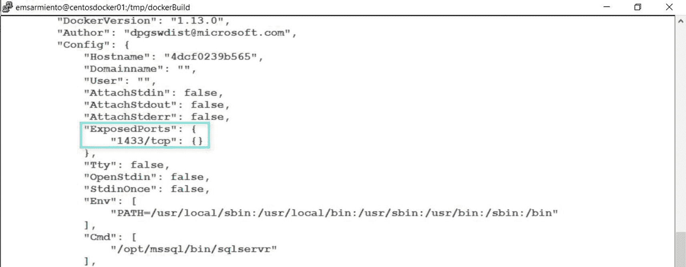

# 10. 创建自定义 SQL Server on Linux 容器镜像

> *学习新技术——或者任何事物的秘诀，就是永远不要忘记你已经掌握的知识。*
>
> —Edwin M. Sarmiento

在上一章中，你学习了如何结合 `Dockerfile` 中的不同指令来创建一个自定义的 Windows 上的 SQL Server 容器。我们将运用前一章所学的内容来创建一个自定义的 Linux 上的 SQL Server Docker 镜像。但由于 Linux 与 Windows 略有不同，我将介绍一些额外的 `Dockerfile` 指令。我还将更详细地介绍如何进一步自定义你的 Linux 上 SQL Server 镜像，为在开发或生产环境中部署做准备。那么，让我们开始吧。

## 额外的 `Dockerfile` 指令

如果你分析上一章创建的 `Dockerfile`，所使用的指令是基于我们对在 Windows 环境中安装和配置 SQL Server 的理解。在 *第 [8] 章* 中，我们探讨了如何自动化在 Linux 上安装 SQL Server。我们将把用于自动化在 Linux 上安装和配置 SQL Server 的 bash 脚本转化为一个 `Dockerfile`。但在这样做之前，让我们看看一些需要考虑的额外指令。

### `EXPOSE` 指令

`EXPOSE` 指令告诉 Docker 守护进程，基于该镜像运行的容器将在运行时侦听指定的网络端口。默认是 TCP，但你可以选择定义容器是否使用 UDP 端口。`EXPOSE` 指令的格式如下所示。我相信你明白为什么使用这个特定的端口号。

```
EXPOSE 1433
```

我曾经认为 `EXPOSE` 指令旨在发布容器在运行时将侦听的端口。毕竟，在计算机网络的语境中，“expose”不就是这个意思吗？但事实并非如此。`EXPOSE` 指令仅仅是一个“提示”，用于告诉镜像用户在创建和运行容器时哪个端口是有用的。Docker 守护进程本身并不会对该指令做任何处理。事实上，如果你正在构建一个 Linux 上的自定义 SQL Server 镜像，只要镜像的用户知道这是 SQL Server 的默认配置并且它侦听端口 1433，你可以完全忽略 `EXPOSE` 指令——就像我们在 Windows 上的 SQL Server 镜像中所做的那样。

我确信你明白我接下来要说什么。这就像拿到一部没有用户手册的智能手机（尽管你可能会争辩说没人真的看用户手册）。如果你知道如何使用智能手机，就不需要手册。但如果你不知道呢？这时候用户手册就派上用场了。`EXPOSE` 指令充当了关于 Docker 镜像的额外元数据。当你对正在检查的镜像运行 `docker inspect` 命令时，可以在 `Config` 部分下查看 `ExposedPorts` 的值，如图 10-1 所示。



图 10-1

一个公开可用的 Linux 上 SQL Server 镜像的 `ExposedPorts` 值

真正发布容器内应用程序将侦听的端口的是 `docker run` 命令的 `-p` 参数。回顾下面所示的 `docker run` 命令，重点关注 `-p` 参数：

```
docker run -e "ACCEPT_EULA=Y" -e "SA_PASSWORD=mYSecUr3PAssw0rd" --name sqldevlinuxcon01 -p 1433:1433 -d -h linuxsqldev01 mcr.microsoft.com/mssql/server:2017-CU14-ubuntu
```

这就是我们使用 `-p` 参数的原因——为了暴露容器内部 SQL Server 的端口号，这样我们就可以通过端口映射，使用 Docker 主机的端口号来访问它。但是，如果我们从未使用过 SQL Server，或者对 SQL Server 一无所知，我们就不会知道它默认侦听哪个端口号——因此，就需要使用 `EXPOSE` 指令。

`EXPOSE` 指令的另一个用途是，如果你决定将 SQL Server 配置为使用一个非默认端口，比如 5000 端口。`EXPOSE` 指令可以告诉用户在运行容器时应该发布哪个端口。但 `EXPOSE` 指令在你的 `Dockerfile` 中的真正价值在于，它允许容器在不使用 `docker run` 命令的 `-p` 参数来发布其端口号的情况下相互通信。在 *第 [11] 章* 中，我将更详细地介绍 Docker 网络。


