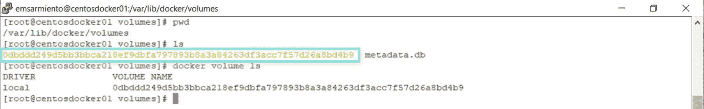
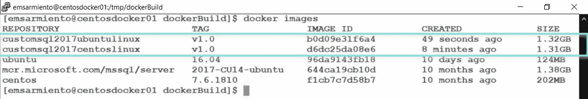
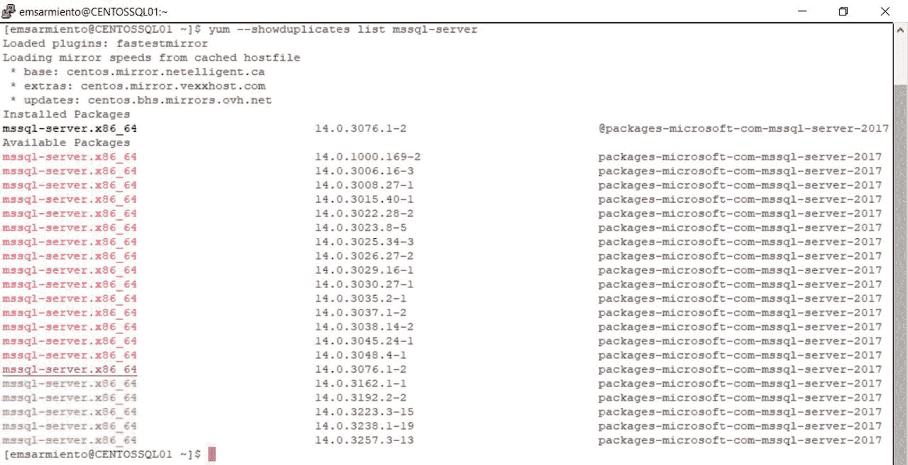

# 构建自定义的 Linux 版 SQL Server 镜像

### VOLUME 指令

`VOLUME` 指令在容器内创建一个指定名称的挂载点，并将其标记为保存外部挂载的卷。`VOLUME` 指令的格式如下所示：

```dockerfile
VOLUME /var/opt/mssql/data
``

这些挂载点是在你首次从镜像运行容器时动态生成的，因为无法保证在你打算运行容器的 Docker 主机上该卷一定是可用的。并且，由于 Docker 容器具有可移植性的特点，运行时创建的 Docker 卷在宿主机的 `/var/lib/docker/volumes` 目录下会有一个类似 GUID 的名称——你无法指定一个有意义的名称。这些 Docker 卷被称为 `anonymous` 卷，因为由 Docker 决定文件和目录的存储位置。随着时间的推移，访问该卷可能会变得困难。鉴于我们已经有了命名卷，匿名卷如今已不常用。回顾第 7 章的“Docker 卷”部分，了解如何配置供容器上的 SQL Server 使用的卷。图 10-2 显示了当你从一个包含 `VOLUME` 指令的镜像运行容器时创建的 Docker 卷的名称。



### USER 指令

回到 SQL Server 2017，`USER` 指令其实并没有太大意义，因为当时公开可用的 Linux 版 SQL Server 镜像被配置为以 `root` 身份运行。鉴于 `root` 用户可以执行任何操作，以 `root` 身份运行容器意味着任何能够恶意访问容器的人都可以进一步入侵主机。出于安全原因，我们不希望发生这种情况。因此，我们希望以权限受限的用户身份运行容器。

`USER` 指令设置运行容器时使用的用户名（或 UID），以及可选的用户组（或 GID）。但为了实现这一点，自定义镜像需要有限制 `CMD` 或 `ENTRYPOINT` 指令执行的指令。`USER` 指令的格式如下所示：

```dockerfile
USER mssql
``

我们将在本章后面更详细地探讨这一点。现在，让我们开始构建自定义的 Linux 版 SQL Server 镜像。

我们将把 `Dockerfile` 保存在 Linux Docker 主机的 `/tmp/dockerBuild` 目录中。但在创建 `Dockerfile` 之前，让我们先定义在 CentOS Linux 镜像中安装和配置 SQL Server 2017 实例的步骤：

1.  从公开可用的 CentOS Linux 7.6.1810 开始。请记住，CentOS 并非受支持的 Linux 发行版。我仅仅是将其用作构建开发环境的示例。如果你想在生产环境中部署 Linux 版 SQL Server 容器，你的基础 Linux 镜像应选择受支持的发行版之一——Red Hat Enterprise Linux、SUSE 或 Ubuntu。
2.  创建一个包含 SQL Server 2017 安装包位置的 `repo` 文件。
3.  安装 SQL Server 2017 包。
4.  配置 Linux 上的 SQL Server 2017。
5.  为运行 SQL Server 进程设置工作目录。
6.  运行 SQL Server 进程。

在创建 `Dockerfile` 的过程中，第 4 步将包含更多细节。重要的是，我们对创建自定义 Linux 版 SQL Server 镜像需要做的事情有了一个高层概览。让我们将前面概述的六个步骤转化为一个 `Dockerfile`。我将使用项目编号作为步骤，并在注释中加以标识。为简洁起见，我省略了 `LABEL` 指令，但请确保在你创建的每个 `Dockerfile` 中都包含它们：

```dockerfile
#Step 1
FROM centos:7.6.1810
#Step 2
RUN curl -o /etc/yum.repos.d/mssql-server.repo https://packages.microsoft.com/config/rhel/7/mssql-server-2017.repo
#Step 3
RUN yum install -y mssql-server
#Step 4
#创建 /var/opt/mssql/data 目录以存储数据库
RUN mkdir -p /var/opt/mssql/data
#递归更改 /var/opt/mssql 和 /etc/pwd 内部目录和文件的权限
#从用户权限更改为组权限
RUN chmod -R g=u /var/opt/mssql /etc/passwd
#告知用户此容器将使用的端口
EXPOSE 1433
#Step 5
ENV PATH=${PATH}:/opt/mssql/bin
#Step 6
CMD sqlservr
```

以下展示了使用 Ubuntu Linux 16.04 基础镜像的相应 `Dockerfile`。它会给你一些提示，说明为什么我更喜欢 RHEL/CentOS 而不是 Ubuntu。参考第 3 章在 Ubuntu 中安装所需依赖项的步骤以及第 8 章在 Ubuntu 上安装 SQL Server 的步骤。我将它们列为步骤 1a 和 1b：

```dockerfile
#Step 1
FROM ubuntu:16.04
#Step 1a–安装安装 SQL Server 所需的 Ubuntu 软件包
RUN apt-get update && apt-get install -y curl apt-utils apt-transport-https software-properties-common
#Step 1b-下载并安装 SQL Server 的公共 GPG 密钥
RUN curl https://packages.microsoft.com/keys/microsoft.asc | apt-key add -
#Step 2
RUN add-apt-repository "deb [arch=amd64] https://packages.microsoft.com/ubuntu/16.04/mssql-server-2017 xenial main"
RUN apt-get update
#Step 3
RUN apt-get install -y mssql-server
#Step 4
RUN mkdir -p /var/opt/mssql/data
RUN chmod -R g=u /var/opt/mssql /etc/passwd
EXPOSE 1433
#Step 5
ENV PATH=${PATH}:/opt/mssql/bin
#Step 6
CMD sqlservr
```

如果你想安装 SQL Server 2019，请将第 2 步替换为相应的 `repo` 文件。使用以下 `docker build` 命令构建自定义镜像：

```bash
docker build -t customsql2017centoslinux:v1.0 .
```

我是不是说过我更喜欢使用 Linux 版 SQL Server 镜像？那是因为它们构建所需时间更短，占用的存储空间也更少。图 10-3 显示了这个自定义 Linux 版 SQL Server 镜像的大小——1.3+GB，而前一章创建的 Windows 版 SQL Server 镜像则为 17.9GB。看看 CentOS Linux 7.6.1810 和 Ubuntu Linux 16.04 基础镜像的大小。



相当直接，不是吗？我们可以在此基础上，添加第 8 章中所做的配置设置作为第 4 步的额外指令，例如启用 SQL Server Agent、设置跟踪标志等。我们不需要更改数据库和备份文件的默认位置，因为我们可以运行一个容器并将 `/var/opt/mssql` 目录挂载到一个 Docker 卷。此外，配置防火墙也不是必需的，当你运行容器时，Docker 会自动更新 `iptables`。我们唯一需要担心的是在启动时设置跟踪标志——而且只有在你确实需要时才这样做。我们可以用 `ENTRYPOINT` 指令替换第 6 步的 `CMD` 指令，并将 SQL Server 启动参数作为 `docker run` 命令的一部分传递。

让我们看看通过更改 `Dockerfile` 来调整我们的自定义 Linux 版 SQL Server 镜像的几种方法。我只会介绍对特定步骤的更改，以便你可以根据自己的需要随意尝试这些更改。


### 安装特定的 SQL Server 版本

如果你注意到了，我们一直都在安装我们想要的最新版 SQL Server——包括最新的更新（在撰写本文时，SQL Server 2017 是 CU19，SQL Server 2019 是 CU1）。虽然强烈建议始终保持 SQL Server 安装更新，但你可能需要一个特定的版本，因为那是你已在应用程序中测试过的版本。假设你想安装 SQL Server 2017 CU14，因为你想要构建的标准化镜像需要这个特定版本。你当然不希望创建一个包含高于 CU14 版本的自定义 Linux 版 SQL Server 镜像。你可以修改步骤 3 来安装一个指向你想要安装的 SQL Server 版本的特定软件包。你可以从 [`packages.microsoft.com/rhel/7/mssql-server-2017/`](https://packages.microsoft.com/rhel/7/mssql-server-2017/)（适用于 RHEL 和 CentOS 7）或 [`packages.microsoft.com/ubuntu/16.04/mssql-server-2017/pool/main/m/mssql-server/`](https://packages.microsoft.com/ubuntu/16.04/mssql-server-2017/pool/main/m/mssql-server/)（适用于 Ubuntu 16.04）查看特定的 SQL Server 2017 软件包。或者你可以运行以下命令列出所有可用的软件包：

```
yum --showduplicates list mssql-server #for RHEL/CentOS
apt -a list mssql-server #for Ubuntu
```

此命令的结果取决于你在步骤 2 中定义的 `repo` 文件。图 10-4 显示了 RHEL 上所有可用的 SQL Server 2017 软件包。



图 10-4：RHEL 上 SQL Server 2017 的不同软件包

你可以使用以下命令安装 SQL Server 2017 CU14：

```
sudo yum install -y mssql-server-14.0.3076.1-2 #for RHEL/CentOS
sudo apt-get install -y mssql-server=14.0.3076.1-2 #for Ubuntu
```

你现在需要做的就是将 `Dockerfile` 中的步骤 3 替换为以下命令，并替换为你正在使用的 Linux 发行版对应的包管理命令：

```
#Step 3
RUN yum install -y mssql-server-14.0.3076.1-2 #for RHEL/CentOS
RUN apt-get install -y mssql-server=14.0.3076.1-2 #for Ubuntu
```

### 创建以非 root 用户身份运行的自定义镜像

我参加了微软 MVP Anthony Nocentino 在 2019 年 PASS 大会上关于 Kubernetes 架构的演讲，因为这是我在如此大型的会议上唯一能百分百确定能和他见面的方式。如今的大多数交流都是虚拟的——通过电子邮件、即时通讯、社交媒体、电话或电话会议。但没有什么能比得上面对面交流。说我老派也好，但面对面的交流是我们建立高质量人际关系的方式。只要有机会，我都会尽力与家人、朋友和熟人面对面交流。

当他结束演讲进入问答环节时，观众席中有人走上前来，为他的演示失败道歉。她说她一直在四处走动，参加专注于 Linux 的 Docker 相关会议，并询问演讲者为什么他们的演示会失败。她恰好是 SQL Server 团队的一名开发人员，负责更新 Linux 版 SQL Server 2019 的 Docker 镜像。由于 SQL Server 2019 在 PASS 大会周正式发布，他们也发布了所有更新的 Linux 版 SQL Server 2019 Docker 镜像，并引入了他们所做的更改：运行非 `root` 容器。

正如我在前面章节中反复提到的，以 `root` 身份运行容器存在安全风险。遵循最小权限原则，我们可以创建一个以非 `root` 身份运行的自定义 Linux 版 SQL Server 镜像。公开可用的 Linux 版 SQL Server 2017 镜像都是在假设容器将以 `root` 身份运行的前提下创建的。随着 SQL Server 2019 的发布，微软也发布了一个 `Dockerfile`，其中包含对现有公共镜像的修改，使其能够以非 `root` 用户身份运行容器。请在此处查看 `Dockerfile`：[`github.com/microsoft/mssql-docker/blob/master/linux/preview/examples/mssql-server-linux-non-root/Dockerfile`](https://github.com/microsoft/mssql-docker/blob/master/linux/preview/examples/mssql-server-linux-non-root/Dockerfile)。我们将探讨其中的附加指令及其作用。请参考 `Dockerfile` 的行号。

**第 10 行**: `RUN useradd -M -s /bin/bash -u 10001 -g 0 mssql`

这条指令运行 `useradd` 命令，向现有的 Linux 版 SQL Server 2017 镜像中添加一个名为 `mssql` 的新用户。`-M` 参数将跳过为新用户创建主目录。`-s` 参数指定使用 `/bin/bash` 作为用户的登录 shell。`-u` 参数指定用户的 UID 值——10001——而 `-g` 参数指定 GID 值，0。请记住，此用户是在容器内部创建的，而不是在主机上创建的。

**提示**

在我对 SQL Server 2019（以及 Ubuntu 上的 SQL Server 2017）的测试中，这条指令可能导致镜像构建过程失败——但在 RHEL/CentOS 上的 SQL Server 2017 却没有出现这种情况，我觉得这很奇怪。Linux 版 SQL Server 安装过程的一部分就是创建名为 `mssql` 的用户和组。`UID` 和 `用户名` 值必须是唯一的。由于 `mssql` 用户已存在（尽管 UID 不同），该命令会失败。添加已存在的用户会抛出错误并导致镜像构建失败。请相应地进行测试。在创建自定义的 Linux 版 SQL Server 2019（或 Ubuntu 上的 SQL Server 2017）镜像时，可以省略此行。但是，这样做意味着接受在安装过程中创建的具有不同 UID 值 (999) 的 `mssql` 用户。此 UID 值可能已存在于你的 Linux Docker 主机上，并可能导致关于究竟是谁在运行容器的混淆。请参阅图 10-10。另一个选择是将其命名为其他名称，但使用 10001 UID 值。

**第 11 行**: `RUN mkdir -p -m 770 /var/opt/mssql && chgrp -R 0 /var/opt/mssql`


此指令运行 `mkdir` 命令以创建一个新目录 `/var/opt/mssql`，并使用 `-m` 参数赋予 770 权限——所有者具有读写执行（RWX）权限，组具有读写执行（RWX）权限，其他用户无权限。`&&` 字符仅仅是追加了 `chgrp` 命令，而非创建一个新的 `RUN` 指令。这看起来与第 4 步很像，但权限设置更为精细。另外，追加命令而不是创建另一个指令是一种优化技巧，我们可以在 `Dockerfile` 中实施。

注意：如果你遵循 `Dockerfile` 中的命令顺序，是隐式地由 `root` 用户创建了 `/var/opt/mssql` 目录。这意味着运行 `chgrp` 命令只是从 `root` 分配了相同的组权限。如果我们指派 `mssql` 用户来运行 `sqlservr` 进程，这种方式就行不通了。我们要么让 `mssql` 用户创建 `/var/opt/mssql` 目录，要么使用命令 `chown -R mssql:0 /var/opt/mssql` 显式地将所有权更改为 `mssql` 用户。微软提供的可用 `Dockerfile` 是有效的，但该镜像是从一个现有的 SQL Server on Linux 镜像构建的（注意 `FROM` 指令并非一个基础操作系统镜像）。我不确定他们用于构建基础镜像的脚本是否已经包含了将 `mssql` 用户设为 SQL Server 目录所有者的步骤。

我重写了该指令，以显式地将 `/var/opt/mssql` 目录的所有权分配给 `mssql` 用户，如下所示。我还对其进行了优化，并将多个命令合并到一个 `RUN` 指令中，而不是使用多行：

```
RUN mkdir -p -m 770 /opt/mssql && chown -R mssql:0 /opt/mssql && chgrp -R 0 /opt/mssql
```

**第 15 行**: `RUN setcap ‘cap_net_bind_service+ep’ /opt/mssql/bin/sqlservr`

此指令运行 `setcap` 命令以在文件上设置 Linux capabilities，本例中是 `sqlservr` 可执行文件。`cap_net_bind_service` capability 允许 `sqlservr` 可执行文件绑定到低端口号（1024 以下的任何端口），而无需以 `root` 身份运行。`+ep` 表示我们正在分配（`+` 操作符）`Explicit`（显式）和 `Permitted`（允许）的 capabilities。

注意：Linux capabilities 是一个安全概念。它们为一个进程提供可用 `root` 权限的一个子集。你不想授予一个进程完整的 `root` 权限（例如，docker 容器进程），否则你将面临该进程被利用并接管整个机器的风险。一个进程可能需要特殊权限来执行其功能，但直接授予其 `root` 访问权限有点过分了。因此，你授予 Linux 进程其工作所需的适当 capability。第 15 行的示例授予了 `sqlservr` 进程 `cap_net_bind_service` capability，以便将其绑定到低端口号。这比授予其 `root` 权限要安全得多。

**第 19 行**: `RUN setcap ‘cap_sys_ptrace+ep’ /opt/mssql/bin/paldumper`

与第 15 行类似，此指令运行 `setcap` 命令，为 `paldumper` 文件设置 `cap_sys_ptrace` capability。你大概可以从它的名字猜出这个文件是什么——它是一个 SQL Server 实用工具，用于生成核心转储，主要用于故障排除。这必须显式定义，因为我们将不再以 `root` 身份运行容器，然而我们又需要 `root` 权限来执行故障排除。

**第 20 行**: `RUN setcap ‘cap_sys_ptrace+ep’ /usr/bin/gdb`

这与第 19 行类似，但针对的是 `gdb` 文件，它是 GNU 调试器的缩写，是 Linux 最常用的调试实用工具。

**第 25 行**: `RUN mkdir -p /etc/ld.so.conf.d && touch /etc/ld.so.conf.d/mssql.conf`

此指令使用 `touch` 命令创建一个 SQL Server 将使用的 `ldconfig` 文件——`mssql.conf`。`ldconfig` 命令用于为共享库创建必要的链接和缓存。共享库是程序启动时加载的库。这些共享库的位置存储在环境变量 `LD_LIBRARY_PATH` 中。接下来的几个指令将进一步解释为何需要此步骤。

**第 26 行**: `RUN echo -e "# mssql libs\n/opt/mssql/lib" >> /etc/ld.so.conf.d/mssql.conf`

在第 25 行的基础上，一行包含 `# mssql libs\n/opt/mssql/lib` 的新内容被添加到 `/etc/ld.so.conf.d/mssql.conf` 文件中。系统会读取 `mssql.conf` 文件以搜索所使用的共享库位置，在本例中是 `libs` 和 `/opt/mssql/lib`（`\n` 用于引入新行）。这样做的原因是，先前指令中使用的 `setcap` 命令移除了 `LD_LIBRARY_PATH` 和其他控制动态链接的环境变量。这是出于安全原因。由于你将使用非 `root` 用户运行容器，所有不安全的环境变量都将被移除，导致在故障排除期间运行 `paldumper` 和 `gdb` 变得无效。

**第 27 行**: `RUN ldconfig`

此指令运行 `ldconfig` 命令以应用第 25 和 26 行中创建的配置设置。

**第 29 行**: `USER mssql`

此指令将 `mssql` 设置为运行容器时的用户。

以下的 `Dockerfile` 集成了这些行，以创建一个以非 `root` 用户运行的基于 CentOS Linux 的自定义 SQL Server 镜像。我添加了步骤和行号作为注释，以标识添加的指令：

```
#步骤 1
FROM centos:7.6.1810
#步骤 2
RUN curl -o /etc/yum.repos.d/mssql-server.repo https://packages.microsoft.com/config/rhel/7/mssql-server-2017.repo
#步骤 3
RUN yum install -y mssql-server
#第 10 行–如果你在 Ubuntu 上安装 SQL Server 2019 或 SQL Server 2017，
#请更改为其他用户，例如 mssql2
RUN useradd -M -s /bin/bash -u 10001 -g 0 mssql
#修改的第 11 行
RUN mkdir -p -m 770 /opt/mssql && chown -R mssql:0 /opt/mssql && chgrp -R 0 /opt/mssql
#第 15、19 和 20 行
RUN setcap 'cap_net_bind_service+ep' /opt/mssql/bin/sqlservr
RUN setcap 'cap_sys_ptrace+ep' /opt/mssql/bin/paldumper
RUN setcap 'cap_sys_ptrace+ep' /usr/bin/gdb
#第 25、26 和 27 行
RUN mkdir -p /etc/ld.so.conf.d && touch /etc/ld.so.conf.d/mssql.conf
RUN echo -e "# mssql libs\n/opt/mssql/lib" >> /etc/ld.so.conf.d/mssql.conf
RUN ldconfig
#告知用户此容器将使用的端口
EXPOSE 1433
#第 29 行
USER mssql
#步骤 5
ENV PATH=${PATH}:/opt/mssql/bin
#步骤 6
CMD sqlservr
```

保存 `Dockerfile` 并构建镜像。完成后，你便可以使用这个自定义的 SQL Server on Linux 镜像来以非 `root` 身份运行容器。


