# 以非 root 用户运行容器

默认情况下，使用 `docker run` 命令运行容器会以 `root` 用户身份运行。但既然你构建的自定义镜像不再以 `root` 身份运行，那么从该自定义镜像运行容器意味着，虽然 `root` 仍然拥有容器的读写文件系统层（Docker 守护进程以 `root` 身份运行并创建该读写层），但容器进程本身不再以 `root` 身份运行。运行以下 `docker container inspect` 命令以检查容器的读写文件系统层。我使用了 `--format` 参数来让 `docker container inspect` 命令的输出保持简洁，只显示包含读写文件系统层的 `UpperDir` 目录——请将 `sqldevlinuxcon01` 替换为你的容器名称。有关文件系统层及其位置的快速回顾，请参阅第 5 章。

```
docker container inspect sqldevlinuxcon01 --format '{{.GraphDriver.Data.UpperDir}}'
```

**提示**

`--format` 参数对于仅从 `docker container inspect` 或任何返回 JSON 输出的 `docker` 命令的输出中筛选你需要的信息非常方便。实际上，所有 `docker` 命令都返回 JSON 输出，这就是为什么很多命令都带有 `--format` 参数。只不过最常见的命令已经预设了模板。由于 Docker 是使用 Go 语言编写的，你可以通过应用 Golang 包模板来自行格式化 JSON 输出。请参阅 [*https://golang.org/pkg/text/template/*](https://golang.org/pkg/text/template/) 了解 Golang 包模板。

你可以将这个输出作为参数传递给 `ls` 命令，以查看目录的所有者，如下所示。务必在命令前加上 `sudo`，因为 `root` 拥有 `/var/lib/docker` 目录。图 10-5 显示了目录的所有者——仍然是 `root`。

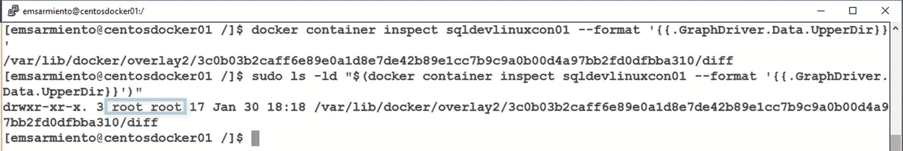

图 10-5
root 仍然拥有容器的文件系统层

```
sudo ls -ld "$(docker container inspect sqldevlinuxcon01 --format '{{.GraphDriver.Data.UpperDir}}')"
```

但是，如果你使用以下命令从 Linux Docker 主机查看运行 `sqlservr` 的进程，你会发现它不再以 `root` 身份运行。图 10-6 显示运行 `sqlservr` 进程的用户 ID 是 `UID 10001`。这就是我们在 `Dockerfile` 的 `第 10 行` 创建 `mssql` 用户时分配的用户 ID。

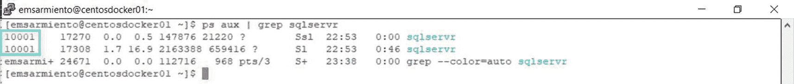

图 10-6
在 Linux Docker 主机上，UID 10001 运行 sqlservr 进程

```
ps aux | grep sqlservr
```

你可以通过运行以下 `docker exec` 命令来确认容器也以 `mssql` 用户身份运行：

```
docker exec -it sqldevlinuxcon01 ps aux | grep sqlservr
```

你也可以运行以下 `docker container inspect` 命令：

```
docker container inspect sqldevlinuxcon01 --format '{{.Config.User}} {{.Name}}'
```

图 10-7 显示了在容器内部运行 `sqlservr` 进程的 `mssql` 用户。

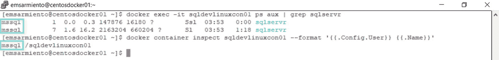

图 10-7
mssql 用户在容器内运行 sqlservr 进程

检查容器的读写文件系统层中文件和目录的所有权可以证实这一点，如图 10-8 所示。

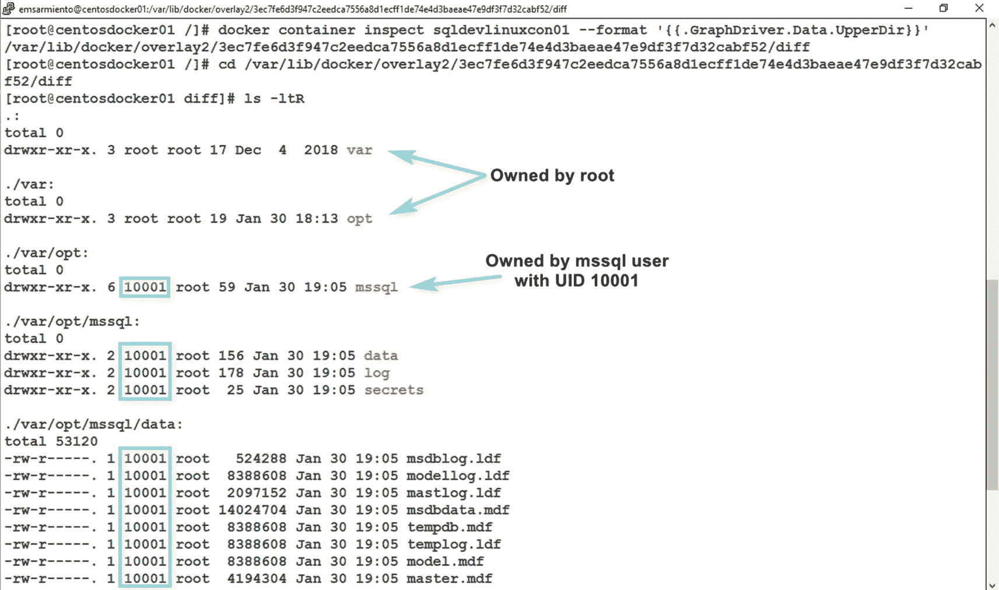

图 10-8
UID 为 10001 的 mssql 用户拥有这些目录

在图 10-6 和 10-8 中仅显示用户 ID 值的原因是，我们在 Linux Docker 主机上没有创建具有相应用户 ID 值的 `mssql` 用户。我强烈建议在 Linux Docker 主机上创建具有相同 UID 值的 `mssql` 用户，这样你就可以轻松地将其映射到容器内运行的用户。使用以下命令在 Linux Docker 主机上创建用户：

```
sudo useradd -M -s /bin/bash -u 10001 -g 0 mssql
```

重新运行用于生成图 10-6 的命令，将不再显示 UID 值，而是显示一个用户友好的名称。

你需要非常小心的一件事是，在容器内创建用户帐户时为其分配的 UID 值。微软决定为 `mssql` 用户使用 UID 10001 是有原因的——这个值足够大，可以防止在 Linux Docker 主机上发生任何可能的冲突。请记住，容器与 Docker 主机共享同一个内核。Linux 内核负责管理 UID 和 GID 空间，并用它们来确定是否应授予权限。当我们在 `Dockerfile` 的 `第 10 行` 创建 `mssql` 用户时，系统会根据 Linux 内核检查该 UID 是否已存在。如果已存在，则直接使用现有的 UID。如果不存在，则会在一个仅在容器上下文中存在的隔离 UID 空间中创建它。当容器被创建时，Docker 守护进程通过 `root` 用户在 Linux Docker 主机上创建读写文件系统层。当我们授予 `mssql` 用户对 `/var/opt/mssql` 目录的所有权时，Docker 主机的 Linux 内核会检查进程是否有权修改该目录内的文件。用于检查的是 UID 值，而不是用户名。这就是为什么图 10-8 显示的是 UID 值而不是用户名。但是，如果 Docker 主机中已有的 Linux 用户具有与你容器内所用相同的 UID 值，那么 Linux Docker 主机上的该用户将胜出。图 10-9 演示了这一点。在我的 Linux Docker 主机上，Linux 用户 `emsarmiento` 的 UID 值为 1000。我在 `Dockerfile` 的 `第 10 行` 操作失误，为 `mssql` 用户分配了 UID 值 1000——与用户 `emsarmiento` 相同——而不是 10001。

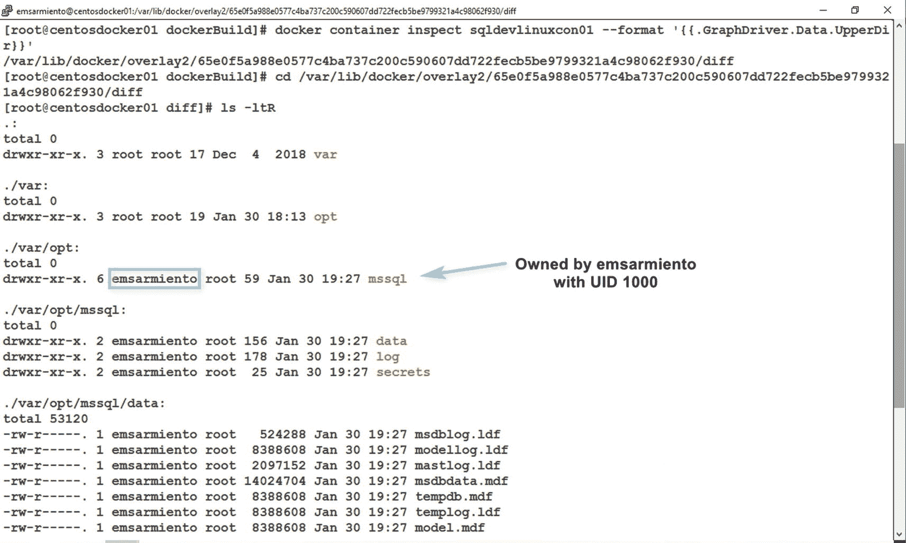

图 10-9
拥有目录的是 UID 为 1000 的 emsarmiento 用户，而不是 mssql

你可以通过检查在容器内部和 Linux Docker 主机上运行的 SQL Server 进程来确认这一点。图 10-10 显示容器中使用的 UID 与 Linux Docker 主机上的相同。你可能因为用户名不同而认为它们是不同的用户。事实是，它们是同一个 UID。

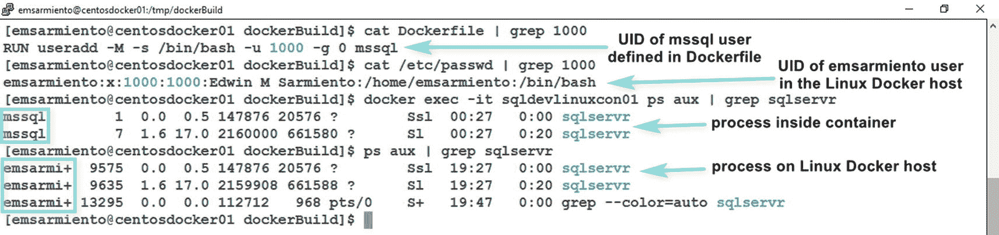

图 10-10
在容器上使用已存在于 Linux Docker 主机上的 UID 的影响

**提示**

在构建自定义 Docker 镜像时，务必妥善记录你创建的所有用户。这不仅有助于以非 `root` 身份运行容器，也对安全性和审计工作大有裨益。在有独立团队管理 Docker 基础设施的大型企业中，告知他们有非 `root` 用户在运行容器，可以帮助他们回答审计员提出的安全相关问题。

## 非 root 用户与 Docker 卷

在第 7 章中，我们讨论了将 SQL Server 数据库存储在 Docker 卷中以实现数据持久化。但当时，Docker 卷内创建的目录由 `root` 用户拥有。图 10-11 展示了一个以 `root` 身份运行的 SQL Server 2017 on Linux 镜像，它利用 Docker 卷时的目录结构和所有权。

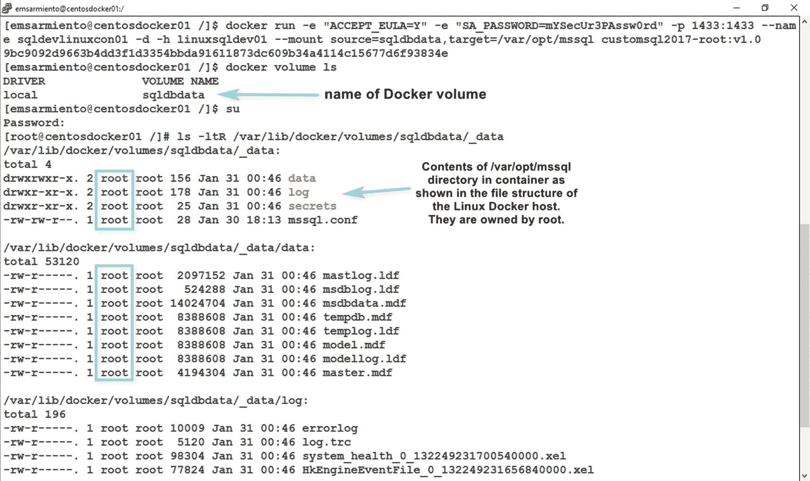

图 10-11

当容器以 root 身份运行时，Docker 卷上的文件系统所有权

按照第 7 章中概述的步骤，将一个以 `root` 身份运行的容器智能更新或升级为另一个不以 `root` 身份运行的容器，你最终会遇到如图 10-12 所示的 `Permission denied (13)` 错误。看来并不那么智能，对吧？

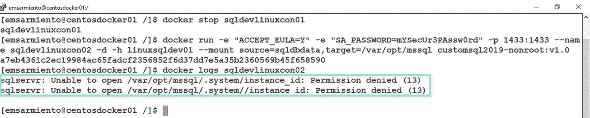

图 10-12

当非 root 容器尝试访问时，Docker 卷上的文件系统所有权错误

这是因为非 `root` 容器内的 `sqlservr` 进程正试图访问 Docker 卷中由 `root` 用户拥有的数据库文件。这就像在 Windows 上使用特定的 Active Directory 域账户运行 SQL Server，然后将该服务账户更改为另一个对系统数据库和用户数据库没有读写访问权限的账户一样——SQL Server 将无法启动。

**提示**

如果你以前这样做过但没有遇到此问题，你为什么要授予 SQL Server 服务账户管理员权限？你应该限制 SQL Server 服务账户的权限，而不是给它无限制的访问权限。我厌倦了看到 SQL Server 服务账户以 Active Directory 域管理员身份运行。不要成为那样的 DBA。请遵循此 Microsoft 文档中的指南为 Windows 上的 SQL Server 配置服务账户：`https://docs.microsoft.com/en-us/sql/database-engine/configure-windows/configure-windows-service-accounts-and-permissions?view=sql-server-ver15#Serv_Perm`。

现在你知道为什么来自 SQL Server 团队的开发者在 PASS Summit 上围绕着做 SQL Server on Linux 容器演讲的演讲者跑来跑去——并道歉了吧。她知道这是一个定时炸弹。她是对的。每一个演示如何对 SQL Server on Linux 容器进行就地升级的演讲者都失败了。

对以 `root` 身份运行的容器进行就地更新或升级的方法是，首先授予非 `root` 用户对 Docker 卷中目录的权限。以下是对执行智能就地更新或升级容器步骤的修改版本。这假设你知道自定义镜像中定义的非 `root` 用户。

1.  停止容器。

2.  将 Docker 卷内 SQL Server 目录和文件的所有权分配给非 `root` 用户。

在继续更新或升级容器之前，你需要将非 `root` 用户设置为 Docker 卷内文件的新所有者。假设你没有 `root` 权限来更改映射到 Docker 卷的目录，你可以创建一个临时容器来完成此操作。以下 `docker run` 命令使用 Alpine Linux 镜像运行一个容器；挂载 Docker 卷并运行 `chown` 命令，将目录和文件所有权更改为 UID 值为 10001 的 `mssql` 用户。我使用 Alpine Linux 镜像因为它非常轻量级。此外，我只需要它来运行 `chown` 命令。我使用了 UID 值而不是用户名，以防它尚未在 Linux Docker 主机上创建。`sqldbdata` 是 Docker 卷的名称。

```
#运行一个临时的 Alpine Linux 容器，挂载 Docker 卷，
#并运行 chown 命令
docker run --name temp -d --mount source=sqldbdata,target=/data alpine chown -R 10001:0 /data
#移除临时容器
docker rm temp -f
```

**提示**

你也可以在 Linux Docker 主机上直接更改目录和文件的所有权。唯一的挑战是需要 `root` 权限来更改映射到文件系统中 Docker 卷的目录。默认情况下，Docker 卷创建在 `/var/lib/docker/volumes` 目录中。你可以对 `/var/lib/docker/volumes/sqldbdata/_data` 目录运行相同的 `chown` 命令。你需要 `root` 权限才能执行此操作。

3.  使用新名称 `sqldevlinuxcon02` 创建一个新的 SQL Server on Linux 容器，基于以非 `root` 用户身份运行的自定义 SQL Server on Linux 镜像。将相同的卷 `sqldbdata` 挂载到这个新容器，并重用相同的端口号和主机名。

```
docker run -e "ACCEPT_EULA=Y" -e "SA_PASSWORD=mYSecUr3PAssw0rd" -p 1433:1433 --name sqldevlinuxcon02 -d -h linuxsqldev01 --mount source=sqldbdata,target=/var/opt/mssql customsql2019-nonroot:v1.0
```

请记住，一旦你升级——从 SQL Server 2017 到 SQL Server 2019——就无法回头。这与更新具有相同版本但不同 CU 的容器不同，如果事情没有按计划进行，你可以回滚到之前的版本。好的旧式、经过验证的备份确实是无可替代的。

## 优化 Dockerfile

让我们在*第 9 章*关于优化*Dockerfile*的内容基础上继续。然而，当你查看镜像大小时，其实并没有太多可优化的空间。图 10-13 展示了自定义的 SQL Server 2017 on Linux 镜像的层结构，该镜像以非 `root` 用户运行，你可以通过 `docker history` 命令查看。

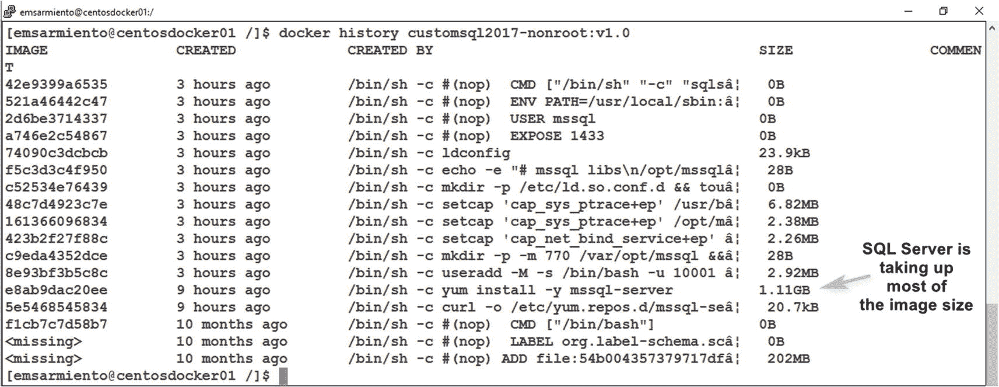

**图 10-13**

列出自定义 SQL Server on Linux Docker 镜像的不同文件系统层

最大的层是包含安装 SQL Server 指令的层。对于这一层，我们确实无能为力，除非你想采用我们在自定义 SQL Server on Windows 镜像中所做的那样，删除安装文件。方法是在使用以下指令安装 SQL Server 后，清空 `yum cache`：

```
RUN yum cache all
```

但是，与其添加另一条指令，不如将其附加到第 3 行，如下列命令所示，这样不会创建额外的镜像层：

```
#Step 3
RUN yum install -y mssql-server && yum cache all
```

**提示**

在 Linux 中，你可以在单行中运行多个命令，就像 `#Step 3` 中的例子一样。你甚至可以在单行中组合多个不同的命令，只需用连接符将它们分开即可。这被称为“命令链”，即在单行中拼接多个命令。在前面的例子中，使用了 `&&` 操作符。还有其他命令链操作符可用，例如分号操作符 `;`，但为了简单起见，在*Dockerfiles*中我们将坚持使用 `&&` 操作符。

这不会节省大量空间，大概 80MB 左右。SQL Server on Linux 的安装包不像 SQL Server on Windows 安装文件那么大。

你可能想做的另一件事是将第 25、26 和 27 行合并为一个 `RUN` 指令。但由于这些只是为 `sqlservr`、`paldumper` 和 `gdb` 添加功能，将它们合并到一个 `RUN` 指令中并不会真正节省空间，只是减少了镜像层的数量。

你可以消除第 5 步中的 `ENV` 指令，并将其包含在第 6 步的 `CMD` 指令中，如下所示：

```
CMD ["/opt/mssql/bin/sqlservr"]
```

但这只是一个表面上的优化——减少了镜像层的数量，但没有减小镜像大小。我留给你去创建一个以非 root 用户运行的自定义 SQL Server on Linux 镜像，并尽可能优化它。

## 在 Dockerfile 中运行脚本

到目前为止，我们构建的自定义 SQL Server on Linux 镜像都是为生产环境部署而设计的。请注意，我没有包含安装 SQL Server 命令行工具。正如我在*第 4 章*中提到的，我不喜欢在生产服务器上安装任何不必要的东西，包括客户端工具。对于开发环境，我只安装真正需要的东西，比如 SQL Server 命令行工具。

### 安装 SQL Server 命令行实用工具

要在 Linux 上安装 SQL Server 命令行工具，需要下载一个不同的 `repo` 文件。你可以在*Dockerfile*的第 2 步包含以下命令：

```
#For RHEL/CentOS
curl -o /etc/yum.repos.d/msprod.repo https://packages.microsoft.com/config/rhel/7/prod.repo
#For Ubuntu
add-apt-repository "deb [arch=amd64] https://packages.microsoft.com/ubuntu/16.04/prod xenial main"
```

更新后的*Dockerfile*第 2 步看起来像下面这样，优化为一个 `RUN` 指令：

```
#For RHEL/CentOS
RUN curl -o /etc/yum.repos.d/mssql-server.repo https://packages.microsoft.com/config/rhel/7/mssql-server-2017.repo && curl -o /etc/yum.repos.d/msprod.repo https://packages.microsoft.com/config/rhel/7/prod.repo
#For Ubuntu
RUN add-apt-repository "deb [arch=amd64] https://packages.microsoft.com/ubuntu/16.04/mssql-server-2017 xenial main" && add-apt-repository "deb [arch=amd64] https://packages.microsoft.com/ubuntu/16.04/prod xenial main"
```

更新后的第 3 步现在将包括在 Linux 上安装 SQL Server 命令行工具，如下所示。你需要传递 `ACCEPT_EULA` 参数，值为 `Y`，以便在安装过程中自动响应 EULA 提示。当我们只安装 SQL Server 时不需要这个，因为我们将其作为 `docker run` 命令的参数传递。

```
#For RHEL/CentOS
RUN ACCEPT_EULA=Y yum install -y mssql-server mssql-tools unixODBC-devel
#For Ubuntu
RUN ACCEPT_EULA=Y apt-get install -y mssql-server mssql-tools unixODBC-devel
```

由于 SQL Server 命令行工具存储在不同的目录中，你需要更新第 5 步，添加一个额外的路径，如下所示：

```
ENV PATH=${PATH}:/opt/mssql/bin:/opt/mssql-tools/bin
```

在自定义 SQL Server on Linux 镜像上安装了 SQL Server 命令行工具后，你就可以在部署用于开发环境的容器时运行不同的 T-SQL 脚本了。


### 编写用于检查备份的 Bash 脚本

以下是部署 SQL Server 到开发环境的一个常见用例。假设你希望将数据库备份复制到 Docker 卷中，并在部署自定义的 Linux 版 SQL Server 镜像时还原它们。任何将映射到 Docker 卷的 SQL Server on Linux 容器启动的用户，都将自动拥有这些可用的用户数据库。让我们从将数据库备份复制到 Docker 卷开始：

1.  创建一个名为 `sqldbdata` 的 Docker 卷：
    ```
    docker volume create sqldbdata
    ```
2.  将数据库备份复制到 Docker 卷中。

有多种方法可以将文件复制到 Docker 卷。但由于我们假设你没有 `root` 权限，因此我们将创建一个临时容器来完成此操作。这样做是可行的，因为默认情况下，容器以 `root` 用户的安全上下文运行，除非你专门配置源镜像以非 `root` 身份运行。同时，这也假设你所有的 SQL Server 数据库备份文件都位于当前工作目录中。

1.  将 Docker 卷的所有权更改为非 `root` 用户：
    ```
    #使用临时容器运行 chown 命令
    #以更改 Docker 卷中文件的所有权
    docker exec temp chown -R 10001:0 /data
    #使用后删除临时容器
    docker rm temp -f
    ```
    ```
    #使用 Alpine Linux 镜像创建一个临时容器
    #只是为了能够将文件复制到 Docker 卷中
    docker run --name temp -d -v sqldbdata:/data alpine sleep 10000
    #从包含 SQL Server 数据库备份的当前工作目录
    #复制文件到 Docker 卷
    docker cp . temp:/data
    ```

你可以创建多个 Docker 卷，每个卷包含一份数据库备份副本，然后只需告诉用户将特定卷挂载到他们的容器上。这实际上取决于你的部署策略。

由于你现在在自定义的 Linux 版 SQL Server 镜像中拥有了 SQL Server 命令行工具，你可以运行 `sqlcmd` 来执行 T-SQL 脚本，从而在容器内完成任何 DBA 想要的操作。你可以编写自己的 T-SQL 脚本来检查数据库备份并还原它们，然后通过 `sqlcmd` 调用该脚本。以下是一个 Bash 脚本片段，它遍历指定目录中的数据库备份并还原它们：
```
#遍历 Docker 卷中的所有 BAK 文件
#/var/opt/mssql 挂载在 Docker volume=sqldbdata 上
for files in /var/opt/mssql/*.bak
do
/opt/mssql-tools/bin/sqlcmd -S localhost -U sa -P $SA_PASSWORD -d master -Q "RESTORE DATABASE [${files:15:-4}] FROM DISK ='$files'"
done
```

我相信你认出了这个带有 `RESTORE DATABASE` 命令的 `sqlcmd` 调用。你可能过去在 Windows 上用批处理文件做过类似的事情。为了演示，我保持了脚本的简洁，但你可以尽情发挥你的 T-SQL 脚本。数据库备份文件的命名格式为 `databaseName.bak`，并且都是从采用默认配置的 Linux 版 SQL Server 实例中获取的。这样，在运行 `RESTORE DATABASE` 命令时，我们就不需要指定 `WITH MOVE` 选项。方括号内的 `${files:15:-4}` 执行字符串操作以提取数据库名称。由于容器中的 `/var/opt/mssql` 目录将映射到 Docker 卷，备份文件的完整路径将采用 `/var/opt/mssql/databaseName.bak` 的形式。数据库名称之前有 15 个字符 (`/var/opt/mssql/`)，其后有 4 个字符 (`.bak`)。`$` 符号指的是名为 `files` 的变量，该变量包含备份文件的完整路径。对于指定目录中的每个备份文件，脚本将生成并运行相应的 `sqlcmd` 命令，如下所示。请不要取笑我，我仍在使用经典的 Northwind 数据库作为示例。
```
/opt/mssql-tools/bin/sqlcmd -S localhost -U sa -P $SA_PASSWORD -d master -Q "RESTORE DATABASE [Northwind] FROM DISK ='/var/opt/mssql/Northwind.bak'"
```

我还在脚本中 `RESTORE DATABASE` 命令运行前加入了一个 `sleep` 命令。还记得*第 7 章*中的原地升级吗？即使是新部署的 SQL Server on Linux 容器，看起来也会像一次升级，因为它从 RTM 版本开始。这需要时间。`sleep` 命令考虑到了这一点，它会等待大约 2 分钟，直到升级过程完成后再运行 RESTORE DATABASE 命令。如果你愿意，可以增加等待时间。这是一个快速但不够优雅的方法，不过也有其他方法，例如读取 SQL Server 错误日志以检查特定文本，如下代码片段所示：
```
#检查 SQL Server 错误日志，查看恢复是否完成
while ! grep "Recovery is complete. This is an informational message only. No user action is required" /var/opt/mssql/log/errorlog
do sleep 10; done
```

以下是用于检查数据库备份并还原它们的完整 Bash 脚本：
```
#!/bin/bash
#让脚本等待升级过程完成
sleep 120
#遍历 Docker 卷中的所有 BAK 文件
#目录 /var/opt/mssql/data 挂载在 Docker 卷上
for f in /var/opt/mssql/*.bak
do
/opt/mssql-tools/bin/sqlcmd -S localhost -U sa -P $SA_PASSWORD -d master -Q "RESTORE DATABASE [${f:15:-4}] FROM DISK ='$f'"
done
```

将此脚本命名为 `checkbackups_restore.sh`。你稍后会需要用到它。

注意

与*第 8 章*中我们在 Linux 主机上为 Bash 脚本文件分配 `execute` 权限不同，这里你不需要这样做。为 Bash 脚本文件分配 `execute` 权限的操作将在自定义的 Docker 镜像内部完成。正如你将在下一节看到的，我们将在 `Dockerfile` 中添加一条额外的指令。

你还需要另一个 Bash 脚本。你可以称之为“启动”脚本。它的作用是调用 `checkbackups_restore.sh` 脚本，并在该脚本在后台执行的同时，调用 `sqlservr` 进程。回想一下，`Dockerfile` 中的最后一条指令应该是某种不会终止的命令。否则，容器也会终止。因此，为了运行 `checkbackups_restore.sh` 脚本并启动 `sqlservr` 进程，我们需要从一个启动脚本中调用它们两个。以下是启动 Bash 脚本的代码。你可以将其保存为 `startup.sh`：
```
#!/bin/bash
#启动脚本，从 Docker 卷还原所有数据库备份；
#在后台运行脚本
/tmp/startup/checkbackups_restore.sh &
# 启动 SQL Server
/opt/mssql/bin/sqlservr
```

观察这个启动脚本，你会发现它是在 `/tmp/startup` 目录内部被调用的。这意味着启动脚本和 `checkbackups_restore.sh` 脚本都应该位于容器内部一个名为 `/tmp/startup` 的目录中。这也意味着我们需要创建 `/tmp/startup` 目录，并授予 `checkbackups_restore.sh` 和 `startup.sh` 脚本 `execute` 权限。这让你对新的 `Dockerfile` 会是什么样子有了概念。另外，脚本后的 “&” 符号表示让它在后台运行。


### 在最后一个指令中运行 Bash 脚本

现在我们已经有了必要的脚本，可以将启动脚本作为 `Dockerfile` 中的最后一个指令来调用，如下所示：

```
CMD ["/tmp/startup/startup.sh"]
```

以下是更新后的 `Dockerfile`（带注释）。请注意，这个新的自定义镜像基于另一个已安装 SQL Server 命令行工具并以非 `root` 用户身份运行的自定义 SQL Server 2017 on Linux 镜像构建。

```
#起始于自定义的 SQL Server 2017 on Linux 镜像
#以非 root 用户身份运行，且包含命令行工具
#注意：请使用正确的 Docker 镜像名称
FROM customsql2017oncentoswithtools-nonroot:v1.0
#创建工作目录
RUN mkdir -p /tmp/startup
#将 bash 脚本复制到工作目录
# 并指定 mssql 用户为所有者
COPY --chown=mssql:0 . /tmp/startup
#为 bash 脚本授予可执行权限
RUN chmod +x /tmp/startup/checkbackups_restore.sh
RUN chmod +x /tmp/startup/startup.sh
#运行启动脚本 startup.sh
CMD ["/tmp/startup/startup.sh"]
```

将 `Dockerfile`、`checkbackups_restore.sh` 和 `startup.sh` 文件保存在一个目录中，并使用该目录作为此新自定义镜像的构建上下文。你只希望这三个文件被复制到自定义镜像中，仅此而已。图 10-14 展示了包含这些文件的目录结构。

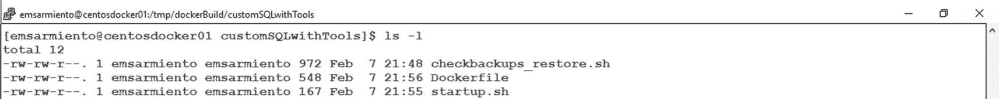

图 10-14

用于构建自定义镜像的目录结构和文件

运行以下命令来构建这个新的自定义镜像：

```
docker build -t customsql2017oncentos4dev-nonroot:v1.0 .
```

现在，进行最终测试，使用以下 `docker run` 命令，基于此自定义镜像运行一个新容器。请确保使用正确的镜像名称。

```
docker run -e "ACCEPT_EULA=Y" -e "SA_PASSWORD=mYSecUr3PAssw0rd" -p 1433:1433 --name sqldevlinuxcon01 --mount source=sqldbdata,target=/var/opt/mssql -d -h linuxsqldev01 customsql2017oncentos4dev-nonroot:v1.0
```

将 Docker 卷 `sqldbdata` 映射到容器，意味着备份文件现在可以被容器访问。在启动期间，容器将运行 `startup.sh` 脚本，该脚本会调用 `checkbackups_restore.sh` 脚本来遍历 `/var/opt/mssql` 目录中的 BAK 文件。因为我们是从已经安装了 SQL Server 命令行工具并运行着 `sqlservr` 进程的 `customsql2017oncentoswithtools-nonroot:v1.0` 自定义镜像开始的，所以我们可以调用 `sqlcmd` 并向其传递 `RESTORE DATABASE` 命令，以从备份中恢复数据库。

相当酷，你觉得呢？

**注意**

为了展示如何通过以非 `root` 身份运行的容器来自动化部署带有用户数据库的 SQL Server 实例，我可能简化了一些流程。正如我在前面章节中提到的，我对安全问题非常重视，这一点很明显。而且，在处理开发环境中恢复数据库备份（尤其是那些来自生产环境的备份）方面，我显然忽略了很多细节。你不仅需要限制对生产环境和开发环境的访问，还需要实施方法来混淆敏感数据。我完全理解开发人员需要使用真实数据来进行适当的测试。但这并不意味着我们可以直接从生产环境拿备份并在开发环境中恢复。应该包含在备份之前就对数据进行混淆处理的流程。或者使用一台专门用于为开发环境混淆数据的服务器。你肯定不想因为安全泄露事件而出现在明天的新闻头条上。

## 多阶段构建

我曾犹豫是否要包含本节内容，因为它更关乎开发者而非 DBA。但自从我开始做 `SQL Server DBA 的 Docker 容器指南` 研讨会以来，我收到了大量关于多阶段构建及其是什么的问题。本节将从高层次概述什么是多阶段构建以及如何使用它们。请耐心读完本章。假装你是一个正在阅读此文的开发者。我知道，这对你要求有点高。

多阶段构建的想法源于编写、测试和编译应用程序的开发实践。多阶段构建用于优化构建并减小 Docker 镜像的大小，而不会增加复杂性。并且你只需要一个 `Dockerfile` 就能完成这件事。想象一下，一个开发者在自己的工作站上编写代码。虽然工作站上有开发工具，但生产环境只需要编译后的代码。你肯定不希望开发工具包含在应用最终的自定义镜像中。容器化应用的一个主要副作用是会产生巨大的镜像，其中包含源代码、编译后的代码，有时甚至还有开发工具（不过，我怀疑它们是否有 SQL Server on Windows 镜像那么大）。看看下面的示例 `Dockerfile`。我使用了来自 [*https://github.com/microsoft/sqllinuxlabs/tree/master/containers/mssql-aspcore-example/mssql-aspcore-example-app/belgrade-product-catalog-demo*](https://github.com/microsoft/sqllinuxlabs/tree/master/containers/mssql-aspcore-example/mssql-aspcore-example-app/belgrade-product-catalog-demo) 的示例代码来创建自定义镜像。

```
#使用带有 SDK 的 .NET Core on Linux 镜像
FROM mcr.microsoft.com/dotnet/core/sdk:2.2
WORKDIR /app
#复制 csproj 文件并作为独立层还原
COPY belgrade-product-catalog-demo/*.csproj ./belgrade-product-catalog-demo/
RUN dotnet restore ./belgrade-product-catalog-demo/
#复制所有其他文件并构建应用
COPY belgrade-product-catalog-demo/. ./belgrade-product-catalog-demo/
WORKDIR /app/belgrade-product-catalog-demo
RUN dotnet publish -c Release -o out
```

构建此自定义镜像将产生一个很大的镜像尺寸，甚至比我安装了 SQL Server 命令行工具的自定义 SQL Server on Linux 镜像还要大。图 10-15 显示了这个自定义 ASP.NET Web 应用镜像的大小。

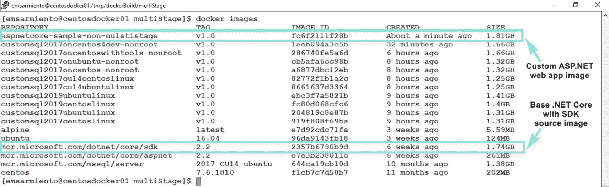

图 10-15

带有 SDK 的自定义 ASP.NET Web 应用镜像的大小

这个 1.81GB 的镜像包含了 .NET SDK、源代码和编译后的代码。为了部署到生产环境，我们只需要编译后的代码和依赖项——即 `RUN` 指令中指定的 `out` 目录中的所有内容。如果我们只使用此自定义镜像的输出，而不是包含开发项目附带的所有内容，会怎样？这就是多阶段构建的用武之地。看看下面这个新的 `Dockerfile`。我加入了步骤编号来解释 `Dockerfile` 中发生了什么：

```
#步骤 1：使用带有 SDK 的 .NET Core on Linux 镜像
FROM mcr.microsoft.com/dotnet/core/sdk:2.2 AS build
#步骤 2
WORKDIR /app
#步骤 3：复制 csproj 文件并作为独立层还原
COPY belgrade-product-catalog-demo/*.csproj ./belgrade-product-catalog-demo/
#步骤 4
RUN dotnet restore ./belgrade-product-catalog-demo/
#步骤 5 复制所有其他文件并构建应用
COPY belgrade-product-catalog-demo/. ./belgrade-product-catalog-demo/
#步骤 6
WORKDIR /app/belgrade-product-catalog-demo
RUN dotnet publish -c Release -o out
#步骤 7：
FROM mcr.microsoft.com/dotnet/core/aspnet:2.2 AS runtime
#步骤 8
WORKDIR /app
#步骤 9
COPY --from=build /app/belgrade-product-catalog-demo/out ./
#步骤 10
EXPOSE 5000
#步骤 11
ENTRYPOINT ["dotnet", "belgrade-product-catalog-demo.dll"]
```


