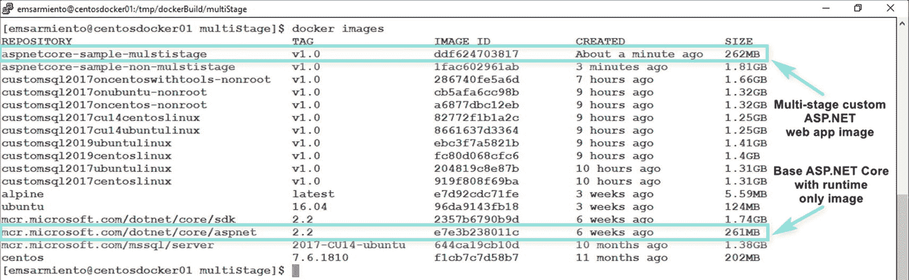

# Docker 多阶段构建与 Docker Compose 概述

你可能会注意到存在两个`FROM`指令。是的，如果你的目标是进行多阶段构建，可以在一个`Dockerfile`中使用任意多个`FROM`指令。每个`FROM`指令都有一个从 0 开始的索引作为引用。步骤 1 可以被称为 0，而步骤 7 可以被称为 1。为了便于引用，通常使用别名。步骤 1 被命名为`build`，而步骤 7 被命名为`runtime`。在整个`Dockerfile`中，你可以通过索引或别名来引用这些构建阶段。在步骤 6 中，`RUN`指令的输出是一个名为`out`的目录，其中包含编译好的代码及其依赖项。由于这正是运行 Web 应用所需的一切，我们将使用步骤 6 的输出来构建另一个自定义镜像。在步骤 7 中，运行 ASP.NET Core Web 应用所需的基础镜像，比包含 SDK 的.NET Core 镜像要小得多，如图 10-16 所示。步骤 9 简单地将步骤 6 生成的`out`目录复制到这个新镜像中。它使用`COPY --from`从一个单独的镜像而非本地文件系统进行复制。这个源镜像可以位于本地文件系统，也可以来自 Docker Hub 或 Microsoft Container Registry 等公共注册中心。步骤 10 和 11 你可能现在看起来很熟悉了。看看由多阶段构建生成的自定义镜像：262MB 对比 1.81GB。镜像大小的差异是巨大的。而且我们这里只看了一个镜像。想象一下，如果要处理一个基于微服务架构设计的多容器应用。

图 10-16
仅包含编译代码、依赖项和运行时的自定义 ASP.NET Web 应用镜像大小

正如我所说，这只是对如何使用多阶段构建的一个高级概述。如果你想了解更多关于多阶段构建的信息，请参考 [*https://docs.docker.com/develop/develop-images/multistage-build/*](https://docs.docker.com/develop/develop-images/multistage-build/)。在 SQL Server 领域，我们只有一个应用——SQL Server 数据库引擎。我们不需要为了部署一个数据库而构建多容器应用。如果你在考虑像 SQL Server Always On 可用性组或 SQL Server 复制这样的多实例架构，它们需要部署到超越单个 Linux Docker 主机的高可用性平台。Kubernetes 是部署此类架构的事实上的高可用性和容器编排平台。虽然我很想介绍一点 Kubernetes 的内容，但这已经超出了本书的范围。不过，它将是你在掌握 Docker 容器之后的下一步学习路径。

