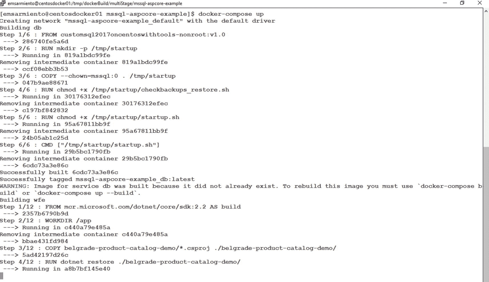

# Docker Compose 与 YAML 文件

去年，我举办的“SQL Server DBA 的 Docker 容器指南”研讨会的一位与会者问我，为什么在我的示例和演示中没有使用 YAML 文件和 Docker Compose。与多阶段构建类似，这是另一个用于运行和管理多容器应用程序的工具。虽然 SQL Server DBA 不需要处理它，但既然我已经介绍了多阶段构建，不妨也包含这部分内容。

还记得 XML 曾经风靡一时吗？我记得在 SQL Server 认证考试中，需要处理任何与 XML 相关的考题。当我参与 SQL Server 2008 的考题编写过程时，我尽力否决任何与 XML 相关的内容——因为那时，关系数据库引擎并不是存储非关系数据的理想选择。然后 JSON 出现了。无论 Jason 是谁，他很幸运被选作这种新数据交换格式的代称。几年前，我们团队中有一位名叫 Jason 的同事负责为 Microsoft Azure 数据平台认证考试编写考题。每当我们谈论 JSON 时，都会会心一笑。XML 和 JSON 都被用来标准化数据格式，因此 DBA 需要学习如何处理它们。

YAML 代表“YAML Ain’t Markup Language”。与 XML 和 JSON 一样，YAML 也用于标准化数据格式。Docker 和 Kubernetes 分别使用 YAML 来配置容器和 Pod。这意味着你需要使用`Dockerfile`来自定义镜像，并使用 YAML 文件来描述构成你应用的不同容器和服务。但与只需要一个`Dockerfile`文件就能构建镜像不同，在 Docker 中处理 YAML 文件需要安装 Docker Compose。

## 安装 Docker Compose

Docker Compose 仍然依赖于 Docker 引擎来执行其任务。因此，你可以直接在你的 Linux Docker 主机所在的同一台机器上安装 Docker Compose，也可以在可以远程连接到 Docker 主机的开发机上安装。以下说明假设你将在与 Linux Docker 主机相同的机器上安装 Docker Compose。

运行以下命令以下载当前稳定版的 Docker Compose。注意，它正在将文件复制到`/usr/local/bin`目录，该目录用于存放普通用户也可以运行的程序：

```bash
sudo curl -L "https://github.com/docker/compose/releases/download/1.25.3/docker-compose-$(uname -s)-$(uname -m)" -o /usr/local/bin/docker-compose
```

下载 Docker Compose 软件包后，就像处理 bash 脚本一样，给该文件赋予可执行权限：

```bash
sudo chmod +x /usr/local/bin/docker-compose
```

测试 Docker Compose 是否正确安装的一个简单方法是运行以下命令。截至本文撰写时，当前的稳定版本是`1.25.3`。

```bash
docker-compose --version
```

现在我们已经安装了 Docker Compose，让我们看看如何利用它和 YAML 文件来部署多容器应用程序。


### 为多容器应用创建 YAML 文件

我将使用来自 [`github.com/microsoft/sqllinuxlabs/tree/master/containers/mssql-aspcore-example`](https://github.com/microsoft/sqllinuxlabs/tree/master/containers/mssql-aspcore-example) 的示例来演示。如果你好奇的话，我在多阶段构建中使用的 ASP.NET Web 应用就来源于此。该应用包含一个简单的两层应用——一个运行在 ASP.NET Core 上的 Web 前端，连接到一个后端 SQL Server 数据库——两个应用，两个容器。请下载所有内容以便跟随操作。

我使用了在“在 Dockerfile 内运行脚本”一节中创建的自定义 SQL Server on Linux 镜像，以在容器内运行 bash 脚本，该脚本从 `db-init.sql` 脚本创建用户数据库。以下代码是我们将用于 YAML 文件的内容：

```yaml
version: "3"
services:
wfe:
build: ./mssql-aspcore-example-app
ports:
- "8080:5000"
depends_on:
- db
db:
build: ./mssql-aspcore-example-db
environment:
SA_PASSWORD: "mYSecUr3PAssw0rd"
ACCEPT_EULA: "Y"
ports:
- "1500:1433"
```

让我们分析这个 YAML 文件，以理解它的作用：

*   `version`: 行描述了 Compose 文件将用于语法验证的版本号。版本 3 适用于 Docker 引擎版本 1.13.0 及更高。
*   `services`: 行描述了我们将为这个多容器应用运行的不同服务——`wfe` 和 `db` 服务。`db` 服务的命名方式是为了映射到 `appsettings.json` 文件中定义的数据库连接字符串。
*   `build`: 行类似于运行 `docker build` 命令。你是在告诉 Docker Compose 在 `./mssql-aspcore-example-app` 目录中查找 `Dockerfile` 来为 `wfe` 服务构建镜像，并在 `./mssql-aspcore-example-db` 中为 `db` 服务查找。
*   `ports`: 行类似于 `docker run` 命令中的 `-p` 参数，用于将容器的 TCP 端口发布到主机。`wfe` 服务将使用 Linux Docker 主机上的 8080 端口，该端口将映射到容器上的 5000 端口。`db` 服务将使用 1500 端口。你也可以选择移除 `db` 服务上的 `ports` 定义，它将默认为 1433 端口。
*   `depends_on`: 行将一个服务设置为当前块定义的容器的依赖项。在这个例子中，`wfe` 服务依赖于 `db` 服务。因此，Docker Compose 将在启动 `wfe` 服务之前首先启动（或运行包含 `db` 服务的）容器。这就像在启动 SQL Server Agent 服务之前先启动 SQL Server 服务。停止服务时，行为是相反的。然而，Docker Compose 不会等待容器完全准备好才启动依赖容器。它只等到容器正在运行。回想一下，创建一个新的 SQL Server on Linux 容器就像执行升级一样，因为所有东西都是从 RTM 版本开始的。你必须考虑容器完全准备好之前的延迟——这就是为什么我使用了带脚本的自定义 SQL Server on Linux 镜像。
*   `environment`: 行类似于 `docker run` 命令的 `-e` 参数。这里，我们传递了两个环境变量，这些变量是我们在容器上运行 SQL Server 实例时一直传递给 `docker run` 命令的。

想象一下，当你处理多容器应用时，这会有多么强大。你可以用一个 YAML 文件来描述整个架构。将文件保存为 `docker-compose.yml`——这是 Docker Compose 引用的默认文件名，就像 `Dockerfile` 一样。但先别急。由于格式问题，处理 YAML 文件可能很棘手。我有时不得不使用像 [`codebeautify.org/yaml-validator`](https://codebeautify.org/yaml-validator) 这样的 YAML 解析器，以确保我遇到的任何错误与格式无关。完成后，运行以下命令。`up` 子命令用于构建、（重新）创建、启动容器并将其附加到服务。图 10-17 展示了 `docker-compose` 命令正在执行的操作。



图 10-17：Docker Compose 执行状态

```bash
docker-compose up
```

Docker Compose 在执行期间会完成以下任务：

1.  Docker 将为两个容器创建一个 `bridge` 网络以便相互通信。默认情况下，Docker Compose 会为你的应用创建一个单独的 docker 网络。我们将在第 11 章更详细地讨论 Docker 网络。
2.  Docker 根据它们对应的 `Dockerfile` 构建 `wfe` 和 `db` 镜像。因为 `wfe` 依赖于 `db`，所以 `db` 镜像将首先被构建。Docker 仅在镜像尚不存在时才会构建它。如果已存在，它将直接使用可用的镜像。默认情况下，镜像名称将采用 `directoryName_service:latest` 的形式。`wfe` 的镜像名称将是 `mssql-aspcore-example_wfe:latest`，而 `db` 的镜像名称将是 `mssql-aspcore-example_db:latest`。
3.  构建镜像后，Docker 基于这些镜像创建并启动相应的容器。它将首先创建并运行 `db` 容器，然后是 `wfe` 容器，如 YAML 文件中所定义。容器名称将采用 `imageName_1` 的格式——`wfe` 为 `mssql-aspcore-example_wfe_1`，`db` 为 `mssql-aspcore-example_db_1`。

Docker Compose 允许你完成所有这些操作，而无需单独运行 `docker network create`、`docker build` 和 `docker run` 命令。而我们这里只处理两个容器。想象一下需要处理更多容器的情况。而且它还允许你通过 YAML 文件将基础设施定义为代码。

#### 注意
因为容器是在你当前的终端中交互式运行的，你不能简单地用 Ctrl+C 退出——这也会停止容器。你可以打开另一个终端会话来探索和管理容器。

在本节中，我几乎没有触及 Docker Compose 功能的皮毛。请参考 [`docs.docker.com/compose/`](https://docs.docker.com/compose/) 获取关于如何利用它处理多容器应用的更多信息。但就像我说的，作为 SQL Server DBA，如果你只需要部署 SQL Server 数据库，你将不会处理多容器应用。至少，当开发者提到一些关于 Docker Compose 的事情时，你现在心里有数了。

## 本章小结

本章是前一章关于创建自定义 SQL Server on Docker 镜像的延伸。尽管在第 9 章已经涵盖了基础知识，但我决定涵盖更多主题是有原因的。如果你注意到了，本书的大部分内容都围绕着 Linux 上的 Docker。微软已经全力投入 Linux，而 SQL Server 就是证明。这在很大程度上说明了 SQL Server 未来的走向，以及它将如何影响你作为 DBA 的职业生涯。我预见未来大多数 SQL Server 部署都将在 Linux 上进行，无论是物理机、虚拟机还是容器中。因此，本章结合了你从之前章节中学到的关于同时使用 Linux 和 Docker 的一切知识——从在 Linux 上安装 SQL Server 到编写 bash 脚本。我的目标是为你迎接那个未来做好准备。

但我们还没完成。下一章将涵盖 Docker 网络的基础知识，并更详细地探讨我提到的 `bridge` 网络。


