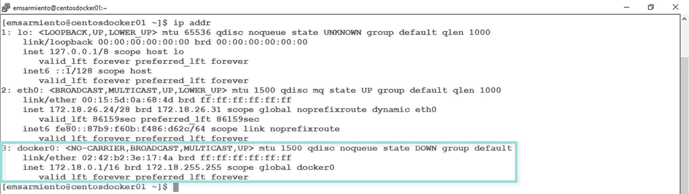

# 11. 面向 SQL Server 数据库管理员的 Docker 网络指南

> *任何领域的专家都曾是个初学者。*
>
> —佚名

我们 IT 专业人士在社交活动方面并不那么在行。与其在谈话中为填补沉默而搜肠刮肚、感到无比尴尬，我们更愿意待在办公桌前解决和排查技术问题。但是社交活动，特别是专业活动，为个人和职业成长提供了机会，让我们能与志同道合的人建立联系。

我记得 2007 年在科罗拉多州丹佛市参加的第一次 PASS 峰会。那是我在北美参加的第一个专业活动，我真不知道会发生什么。我知道自己要做演讲，所以需要了解活动组织者是谁以及我那场会议所需的后勤信息。除了懂 T-SQL 语言，至少我还知道如何用英语交流以应对各种情况，不至于成为那个在社交上很尴尬的亚洲人——直到我在活动上被介绍给几位 SQL Server MVP。那正是我冒险之旅的开始。MVP 们让我感觉像家人一样，对我照顾有加，并为我介绍了许多促进我个人和职业成长的机会。与 SQL Server 专家 Aaron Bertrand 的一局台球，确立了我是个“好人”的形象，因为据他说，我让他赢了（并非所有来自菲律宾的人都是台球大师）。正是在其中一次谈话中，我被介绍给了 MSSQLTips.com 的创始人。我的一位朋友将我介绍给了微软的项目经理 Dandy Weyn，直到今天，她依然为我提供咨询机会。与 SQL Server 专家 Adam Machanic 的一次交谈，让我认识了一家在 2008 年帮助我移居加拿大的公司。

**建立连接确实能打开大量的机会之门**。对于 Docker 容器来说也是如此。本章将带你进入容器网络的世界，目标是让你了解足够的细节，从而能将运行在容器中的 SQL Server 连接到其他服务和应用程序。由于本书不涵盖多主机部署，因此内容将仅限于单主机部署。学完本章后，你无需取代你的网络工程师，但你会了解他们所知的一部分知识，足以在将容器内的 SQL Server 与外部世界连接时，与他们进行有深度的对话。此外，即便提供了这些细节，从网络专家的角度来看，我们仍然停留在非常高的层面。

## docker0 网桥

自第 4 章以来，你已经在不知不觉中使用了 Docker 网络。你能从远程机器访问容器内的 SQL Server 数据库这一事实，就证明了其有效性。第 8 章让你初步了解了其工作原理：Docker 在 Linux 上操作`iptables`，以允许通过`docker run`命令的`-p`参数发布端口的流量进出容器。第 10 章在你使用 Docker Compose 创建多容器应用时，向你介绍了`bridge`网络。现在，让我们进一步探索使所有这些连接成为可能的 Docker 网络组件。

Docker 的默认安装会在主机上创建一个名为`docker0`的 Linux 网桥网络。从本书开始，我们就一直在使用这个网桥网络。在 Linux 中，网桥网络用于连接两个或多个网段，其工作方式很像网络交换机。该网桥网络根据主机的 MAC 地址，在连接到其上的网络之间转发流量。在 Windows 上，与之对应的是`nat`网络——即网络地址转换（Network Address Translation）的缩写。你可以把网桥网络想象成一个在连接两个不同国家的桥梁上工作的移民官。我将以美加边境为例进一步说明，因为我经常驾车往返于纽约州和安大略省之间，通过连接两国的桥梁。移民官的职责是检查护照上盖的旅行签证（目的地的 MAC 地址），允许车内人员通过边境。如果个人没有适当的旅行签证，他们将不被允许通过。如果你熟悉虚拟化领域的网络术语，可以将网桥网络视为一个`vSwitch`或虚拟交换机。在 Windows 上，`docker0`的实现是一个利用 Windows 主机网络服务（HNS）的 Hyper-V 虚拟交换机。

在`docker0`网桥之上，是一个网络驱动的实现，该驱动可以根据 Docker 主机的操作系统进行定制，其工作方式类似于设备驱动。这就是 Docker 与主机操作系统通信以实现网络功能的方式，从而允许容器连接到网络。还记得第 8 章中如何更新 Linux 上的`iptables`以允许流量进出运行中的容器吗？那就是网络驱动通过 Docker 命令与`docker0`网桥进行通信。Docker 上实现的驱动类型描述了使其工作所使用的网络驱动。由于我们只涵盖单主机部署，因此我们将只关注`bridge`网络。而默认的 Docker 网桥网络名称也恰好叫`bridge`，这是多么方便啊！

`bridge`网络拥有一个与之关联的私有 IP 地址和子网。分配给`bridge`网络的子网是从以下列表中选择的第一个无冲突子网：`172.[17-31].42.1/16`、`10.[0-255].42.1/16`、`192.168.[42-44].1/24`。你可以通过在 Linux 上运行`ip addr`命令或在 Windows 上运行`ipconfig`来检查这一点。图 11-1 显示了我的 CentOS Linux Docker 主机上`docker0`网桥的详细信息。请记住，这映射到 Docker 的`bridge`网络。

**图 11-1**

作为 CentOS Linux 主机网络接口显示的 docker0 网桥

