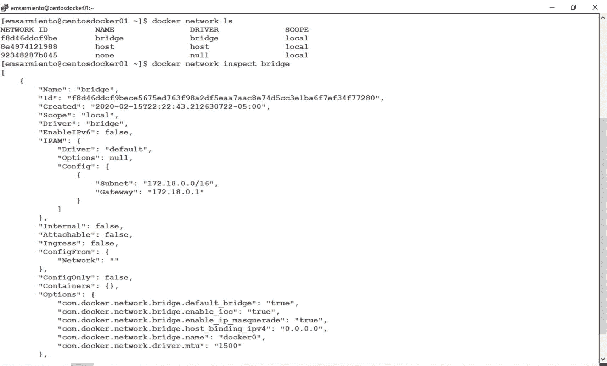
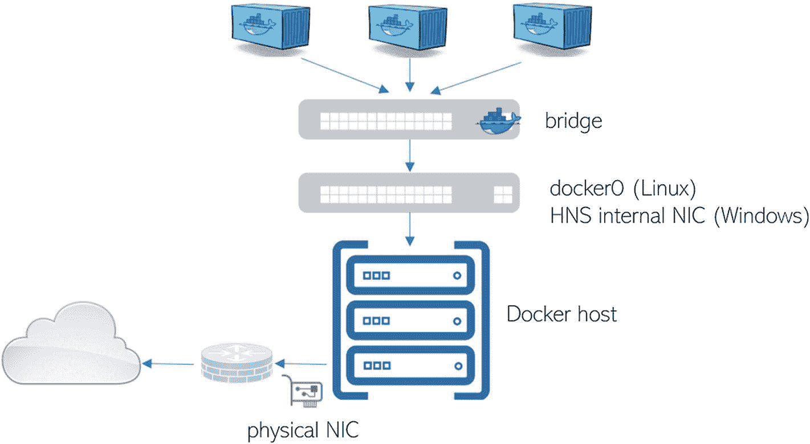
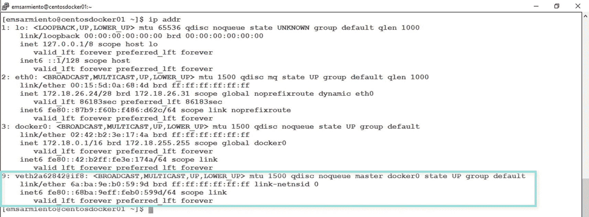
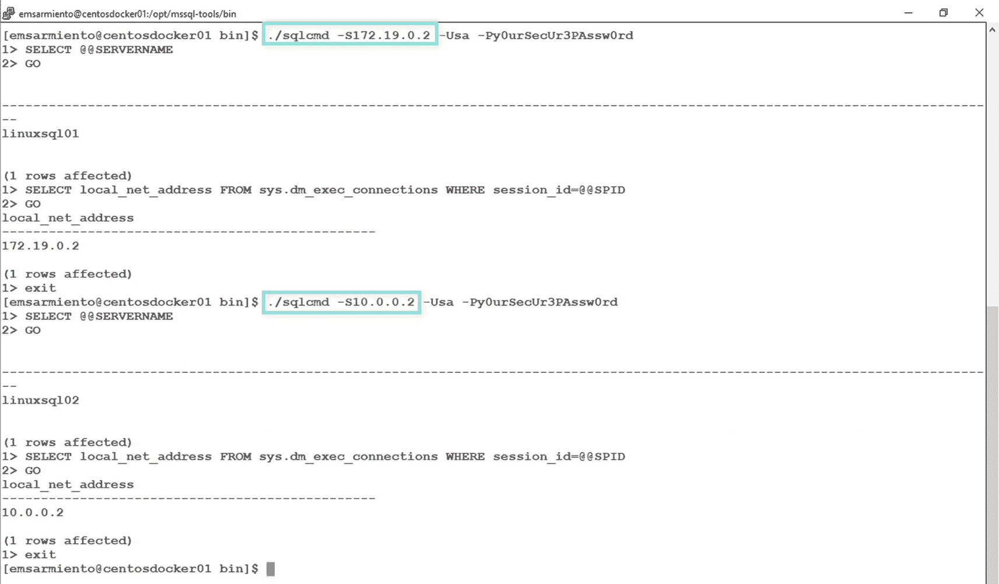
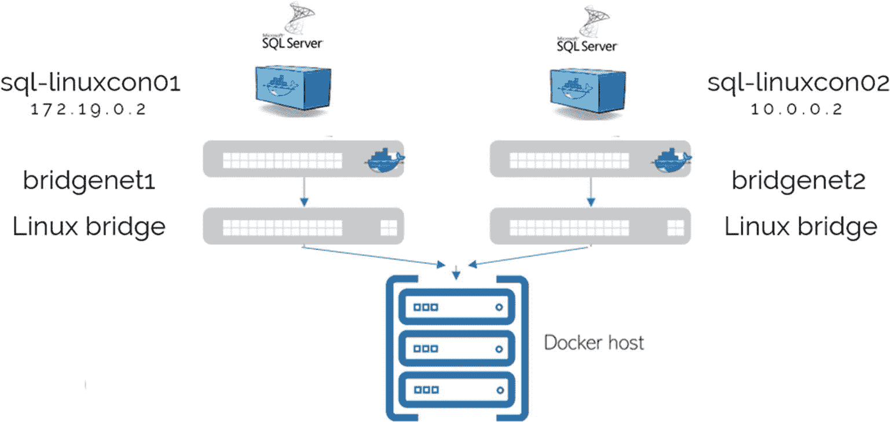
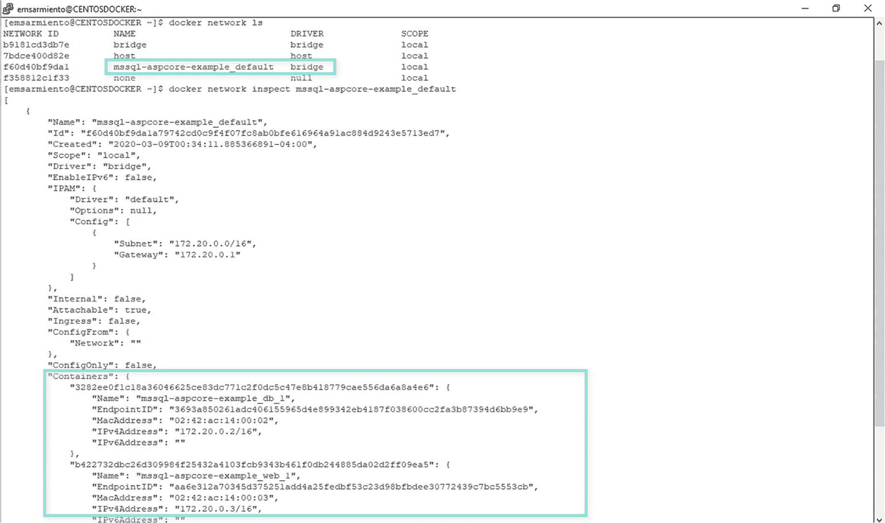
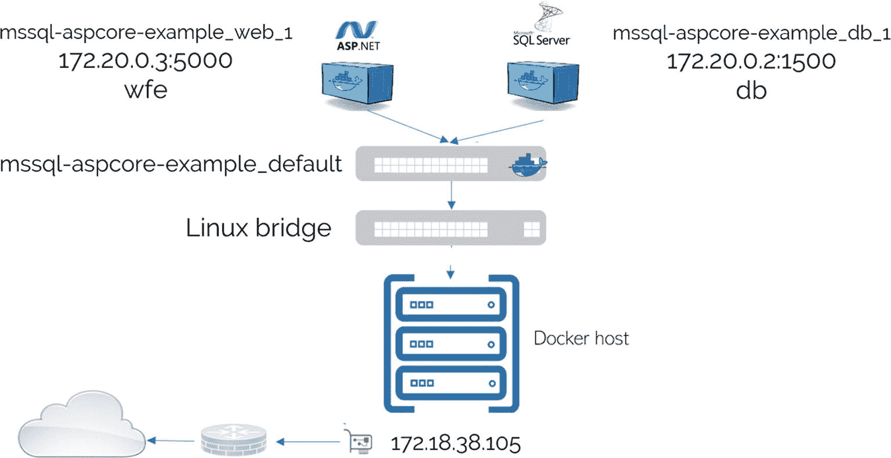

# Docker 网络基础：Bridge 网络与虚拟适配器

所有连接到此 `bridge` 网络的容器都将获得其关联网络内的 IP 地址。在我的 Linux Docker 主机上，每个容器都将拥有 `172.18.0.0/16` 网络内的 IP 地址。默认情况下，所有容器都启用了网络连接，允许它们建立到其他容器或其他外部服务（包括互联网）的传出连接。

如果在 `docker run` 命令中未指定 `--network` 参数，它会自动将容器连接到 `docker0` 网桥。由于我们实际上并未创建任何其他桥接网络，也没有在使用的任何 `docker run` 命令中添加 `--network` 参数，正是 `bridge` 网络使所有网络连接成为可能，将连接到它的容器以及连接到外部网络的主机和服务连接起来。

此外，请注意 `state DOWN` 值。这意味着没有正在运行的容器连接到它。如果有正在运行的容器连接，该状态将变为 `state UP`。

## 查看与检查网络

如前所述，Docker 在默认安装中提供了网络驱动程序，其中 `bridge` 驱动程序映射到 `docker0` 网桥。你可以使用 `docker network ls` 命令来显示可用的 Docker 网络。要检查名为 `bridge` 的网络，可以运行 `docker network inspect bridge` 命令。


*图 11-2：默认 Docker 安装附带的可用网络以及名为 bridge 的网络的详细信息*

> **注意**
> Docker 网络有其专属的子命令 `docker network` 来管理 Docker 网络。这允许你创建、检查、列出、删除、连接和断开网络。在本章中，我们将使用其中几个子命令来说明其用法。`docker network` 命令的完整列表可在 Docker 文档中找到：[`docs.docker.com/engine/reference/commandline/network/`](https://docs.docker.com/engine/reference/commandline/network/)。

查看 `Options` 下的 `com.docker.network.bridge.name` 值。我相信你现在能认出这个名字了。另外，如果你查看 `Containers` 选项，它当前是空的。它只会在容器运行时，填充连接到它的容器名称。

## 虚拟网络适配器

默认情况下，Docker 每次启动容器时都会创建一对虚拟网络适配器，一端通过 `bridge` 网络连接到主机系统，另一端连接到正在运行的容器。


*图 11-3：连接到物理网络的正在运行的容器的网络示意图*

> **提示**
> 没有什么能阻止你创建一个像物理或虚拟机一样具有多个网络接口的容器。如果你想将容器配置为连接到两个或多个网络的多宿主机，这很有用。我们将保持简单，只使用一个网络接口。毕竟，学完本章后你也不会因此替换掉你的网络工程师。

让我们在启动容器后探索 Docker 主机上的网络接口列表。图 11-4 显示在我的 Linux Docker 主机上，一个名为 `veth2a62842@if8` 的新虚拟网络接口连接到了一个正在运行的容器。显然，在你的 Docker 主机上名称会不同。你的 Docker 主机上创建的虚拟网络接口数量将取决于当前正在运行的容器数量。此外，如果你停止并重新启动同一个容器，名称也会改变。随着运行中的容器连接到 `docker0` 网桥，该值现在变为 `state UP`。


*图 11-4：Docker 主机上新创建的与运行容器关联的虚拟网络接口*

查看网络示意图，连接到 `bridge` 网络的运行容器现在可以连接到连接到它的其他容器，以及 Docker 主机外部可用服务和应用程序。

## 端口处理与暴露：通过容器在 Linux 上运行多个 SQL Server 实例

自本书前几章起，我们一直在使用 `docker run` 命令的 `-p` 参数。在 第 10 章 中，我们也介绍了 `Dockerfile` 中 `EXPOSE` 指令的用途。从容器外部或 Docker 主机本地访问容器内应用程序的方式，是使用 `docker run` 命令的 `-p` 参数，它将容器的端口号映射到主机的端口号。如果我们不这样做，容器将只能被连接到同一个 Docker 网络（即 `bridge` 网络）的其他容器访问。请思考一下这一点。到目前为止，我们在本书中创建的每个 SQL Server 容器默认都附加到了 `bridge` 网络。而且直到 第 10 章 创建多容器应用之前，我们都只创建单个容器。如果我们在每次使用 `docker run` 命令时都没有提供 `-p` 参数，那么我们的 SQL Server 实例将完全被隔离——从而变得毫无用处。容器可能在监听 1433 端口，但如果该端口没有发布到 Docker 主机上，我们就无法远程访问它。虽然从安全角度来看，这是最安全的 SQL Server 实例。只是你将无法使用它。

端口映射是将容器发布到外部网络上的其他服务和应用程序的好方法。然而，你会看到很多文章和博客文章告诉不要进行端口映射，因为它不具备可扩展性。一旦主机上的某个端口已经映射到某个容器，它就不再对其他容器可用。尽管端口号范围在 1024 到 65535 之间，但如果你想连接到远程容器而不仅仅是使用默认值，就必须明确定义端口号。一个例子是当你在容器中运行 Web 应用程序时。端口 80 和 443 分别是通过 HTTP 或 HTTPS 连接到 Web 应用程序的默认端口号。如果你在单个 Docker 主机上运行多个 Web 应用容器，你需要将其他容器映射到不同的、非标准的端口号。而像我这样的普通人可能知道，也可能不知道这些非标准端口号。

对于 SQL Server 也是同样的情况。使用 SQL Server 的工作人员知道他们可以通过端口 1433 访问它。应用程序连接字符串使用默认端口号，因此你很少会看到明确指定端口号的连接字符串。但同样真实的是，使用 SQL Server 的人员了解命名实例以及它们如何利用非标准端口号。事实上，虽然微软不支持在 Linux 上运行多个 SQL Server 实例，但绕过这一限制的方法是在 Docker 主机上运行多个 SQL Server 容器，并将每个容器映射到不同的端口号。以下是在同一个 Linux Docker 主机上运行两个 SQL Server 容器的示例，其中一个使用默认端口 1433，另一个使用端口 5000。我重点标出了 `-p` 参数的使用以说明这一点。

```
docker run -e 'ACCEPT_EULA=Y' -e 'SA_PASSWORD=y0urSecUr3PAssw0rd' -p 1433:1433 --name sql-linuxcon01 -d -h linuxsql01 mcr.microsoft.com/mssql/server:2017-latest
docker run -e 'ACCEPT_EULA=Y' -e 'SA_PASSWORD=y0urSecUr3PAssw0rd' -p 5000:1433 --name sql-linuxcon02 -d -h linuxsql02 mcr.microsoft.com/mssql/server:2017-latest
```

对于使用 SQL Server 的人员来说，这很正常。通过利用命名实例，我们可以在同一主机上运行任意数量的 SQL Server 实例（嗯，从技术上讲，最大支持数量是 50）。事实上，这就是许多客户在虚拟化技术普及之前降低许可成本的方式。使得在单个主机上运行多个 SQL Server 实例成为可能的概念，正是我们可以在 Linux 主机上运行多个 SQL Server 实例的方式——通过容器和端口映射。更好的是，你现在不再受限于同一主机上最多 50 个 SQL Server 实例的限制。只要你的 Docker 主机上有可用的端口和资源，你就可以运行任意多个实例。

## 在多个容器上使用相同端口

在同一 Docker 主机上运行的多个容器上利用默认 SQL Server 端口号的另一种方法是，为每个容器创建不同的 Docker 网络。由于每个 Docker 网络将拥有自己的 IP 地址范围和子网，因此可以为每个容器分配一个唯一的 IP 地址，从而允许所有容器都使用 1433 端口。请记住，TCP 或 UDP 端口是 IP 地址加端口号的唯一组合。如果我们为不同的主机（或者在本例中是不同的容器）分配不同的 IP 地址，就可以重用相同的端口号。以下是使用 `bridge` 驱动程序创建用户定义的 Docker 网络并为来自该用户定义网络的容器分配特定 IP 地址的示例：

```
#步骤 1：创建一个名为 bridgenet1 的用户定义网络
docker network create -d bridge --subnet 172.19.0.1/24 bridgenet1
#步骤 2：运行一个容器并将其连接到 bridgenet1
docker run --network bridgenet1 -e 'ACCEPT_EULA=Y' -e 'SA_PASSWORD=y0urSecUr3PAssw0rd' --ip="172.19.0.2" --name sql-linuxcon01 -d -h linuxsql01 mcr.microsoft.com/mssql/server:2017-latest
#步骤 3：创建一个名为 bridgenet2 的用户定义网络
docker network create -d bridge --subnet 10.0.0.1/16 bridgenet2
#步骤 4：运行一个容器并将其连接到 bridgenet2
docker run --network bridgenet2 -e 'ACCEPT_EULA=Y' -e 'SA_PASSWORD=y0urSecUr3PAssw0rd' --ip="10.0.0.2" --name sql-linuxcon02 -d -h linuxsql02 mcr.microsoft.com/mssql/server:2017-latest
```

让我们来探究一下这段示例代码，了解它的作用。在步骤 1 中，我们使用 `-d` 参数创建了一个名为 `bridgenet1` 的 Docker 网络，该参数指定使用 `bridge` 驱动程序来定义它。`--subnet` 参数定义了 IP 地址范围和子网掩码——`172.19.0.1/24`。任何连接到此网络的容器都将拥有此特定范围内的 IP 地址。在步骤 2 中，我们创建并运行了一个新的 SQL Server on Linux 容器。请注意这里使用了 `--network` 和 `--ip` 参数，而非通常的 `-p` 参数。在这里，我们告诉 Docker 将此容器连接到 `bridgenet1` 网络，并为其分配 `172.19.0.2` 的 IP 地址，而不是依赖 `bridge` 网络来分配 IP 地址（Docker 守护进程有效地充当 DHCP 服务器，为连接到 `bridge` 网络的容器提供 IP 地址）。我们在步骤 3 和 4 中执行了相同的操作。图 11-5 显示了在创建用户定义的 Docker 网络并将容器连接到它们之后，Docker 主机的 TCP/IP 属性。


图 11-5
创建用户定义的网络并将容器连接到它们之后，Docker 主机的 TCP/IP 设置

请注意以下几点：

*   `docker0` 网桥状态为 `DOWN`，因为没有正在运行的容器连接到它。
*   创建了两个名为 `br-a65abe44e690` 和 `br-944424a1e3a4` 的新 Linux 网桥。它们分别对应于 `bridgenet1` 和 `bridgenet2`。同样，在您的 Docker 主机上名称会有所不同。
*   同样地，创建了两个名为 `veth41f58c2@if59` 和 `veth478416d@if62` 的新虚拟网络适配器。回想一下，Docker 每次启动容器时都会创建一对虚拟网络适配器，一端通过网桥网络连接到主机系统，另一端连接到正在运行的容器。这些虚拟网络适配器分别对应于连接到 `bridgenet1` 和 `bridgenet2` 的容器。

您可以通过使用它们各自的 IP 地址连接到容器上相应的 SQL Server 实例来测试这一点，如图 11-6 所示。



图 11-6
使用不同的 IP 地址连接到同一 Docker 主机上的容器中的 SQL Server

**注意**
请记住，虽然可以通过 IP 地址访问容器，但您只能从 Docker 主机连接到它们。这是因为只有 Docker 主机知道这些新的 IP 地址。为了远程访问它们，您需要配置从网络上的客户端机器到 Docker 主机的适当路由。请咨询您的网络管理员，了解如何正确配置此路由以远程访问这些容器。

这是互联网服务提供商在互联网早期使用的一个非常古老的技巧，当时 Web 服务器托管着数百个甚至更多的网站，每个网站都有自己的域名和 IP 地址。与其启动数百个 Web 服务器，不如为单个 Web 服务器分配多个 IP 地址更具成本效益。SQL Server 在命名实例中采用了这一技巧，要么在单个数据库服务器上附加多个网络适配器，要么为单个网络适配器分配多个 IP 地址。这使得可以使用 1433 端口连接到同一主机上的多个 SQL Server 命名实例——概念相同，实现方式不同。然而，除非您对 TCP/IP 的基础知识有扎实的掌握，或者与懂这方面的系统管理员合作，否则我不推荐这样做。对于像这样的复杂实现，排查网络连接问题可能会非常麻烦。


## 容器间通信

`docker0` 桥接网络是 Docker *bridge* 网络的一个例子。虽然我们已经介绍过 *bridge* 网络是什么以及能做什么，但 `docker0` 桥接网络有些特殊。让我们来看看基于 *bridge* 网络的容器间通信是如何实现的。

将容器连接到 *bridge* 网络，可以让它们利用 Docker 主机上的网络能力。就像任何网络交换机一样，连接到桥接网络的容器可以相互通信。然而，它们与其他连接到不同桥接网络的容器是完全隔离的。图 11-7 展示了我们在上一节中创建的用户定义桥接网络的网络示意图。



**图 11-7**
上一节创建的用户定义桥接网络的网络示意图

因为它们位于两个隔离的网络上，所以 `sql-linuxcon01` 无法与 `sql-linuxcon02` 通信，反之亦然。根据网络管理员的设计方式，实施网络分段有多种原因——安全隔离是最常见的原因之一，此外还有合规性、服务质量（QoS）等。将容器部署在不同的用户定义桥接网络上也是同样的道理。请与您的网络管理员讨论网络设计，这是了解网络为何如此设计的好机会。但无论网络设计简单还是复杂，服务与应用都需要相互通信。这就是网络路由和 DNS 等其他网络服务的用武之地。

假设我们使用默认的 `docker0` 桥接网络创建了两个容器。我提到过 `docker0` 桥接网络有些特殊，因为连接到它的容器虽然可以相互通信，但只能通过 IP 地址进行，不能使用主机名。相比之下，连接到用户定义桥接网络的容器可以利用内置的 DNS 服务，允许它们使用 IP 地址、主机名或别名进行通信。请回忆第 10 章“Docker Compose 和 YAML 文件”一节中提供的示例。以下 YAML 文件描述了构成多容器应用所需的两个容器的部分网络组件：

```
version: "3"
services:
  wfe:
    build: ./mssql-aspcore-example-app
    ports:
      - "5000:5000"
    depends_on:
      - db
  db:
    build: ./mssql-aspcore-example-db
    environment:
      SA_PASSWORD: "mySecUr3PAssw0rd"
      ACCEPT_EULA: "Y"
    ports:
      - "1500:1433"
```

这个多容器应用由两个服务组成——`wfe` 服务和 `db` 服务。如果您查看 ASP.NET Core 应用的 `appsettings.json` 文件，数据库连接字符串指定了数据库服务器。我特意强调了一下数据库服务器名称：

```
"ConnectionStrings": {
  "BelgradeDemo": "Server=db;Database=ProductCatalog;User ID=WebLogin; password=SQLPass1234!"
}
```

那么，ASP.NET Core 应用是如何知道它需要连接的 SQL Server on Linux 容器就是数据库服务器呢？当您运行 Docker Compose 来构建多容器应用时，Docker 首先要做的是创建一个名为 `<projectName>_default` 的用户定义桥接网络。由于项目名称是 `mssql-aspcore-example`，所以用户定义的桥接网络被命名为 `mssql-aspcore-example_default`。图 11-8 显示了作为多容器应用一部分创建的用户定义桥接网络。它还显示了两个容器——对应 `wfe` 的 `mssql-aspcore-example_wfe_1` 和对应 `db` 的 `mssql-aspcore-example_db_1`——连接到该桥接网络及其对应的 IP 地址。到目前为止一切顺利。



**图 11-8**
作为多容器应用一部分创建的用户定义桥接网络

但我们还没有回答这个问题：*ASP.NET Core 应用是如何知道它需要连接的 SQL Server on Linux 容器就是数据库服务器？* 因为两个容器连接到同一个用户定义的桥接网络，`wfe` 容器能够通过 YAML 文件中定义的服务名访问 `db` 容器。用户定义的桥接网络提供 DNS 名称或别名解析，在本例中，就是 YAML 文件中为服务定义的别名。由于容器是使用 Docker Compose 创建的，因此没有提供主机名，这与我们使用 `docker run` 命令并传递 `-h` 参数时不同。Docker 会为容器分配容器 ID 作为主机名。但是，借助为服务定义的别名，并且两个容器连接到同一个用户定义的桥接网络，它们可以使用 DNS 名称（或者在本例中是别名解析）进行通信。如果您决定将 YAML 文件中的服务名称从 `db` 更改为 `dbserver`，那么您也需要修改 `appsettings.json` 文件中的连接字符串值。


## 整合应用

结合我们在*第 10 章*中构建的多容器应用，让我们通过探索不同组件如何协同工作来理解 Docker 网络栈，并整合我们在本书中涵盖的所有内容。图 11-9 展示了这个多容器应用的网络示意图。



图 11-9
多容器应用的网络示意图

由于容器运行在单个 Docker 主机上：

*   两个容器都连接到用户定义的桥接网络`mssql-aspcore-example_default`，并将被分配到如图 11-8 所示的子网`172.20.0.0/16`中的一个 IP 地址。IP 地址范围取决于分配给用户定义的桥接网络的地址。

*   两个容器都可以使用 Docker 主机的 IP 地址及其相应的端口进行远程访问。`wfe`容器可以通过`http://172.18.38.105:5000`从任何浏览器访问，而`db`容器可以通过`172.18.38.105:1500`使用你喜欢的 SQL Server 工具（SSMS、Azure Data Studio、sqlcmd、Visual Studio 等）访问。即使不修改默认的 Linux 防火墙规则，这也是可能的，因为 Docker 守护进程在后台修改了`iptables`。回顾*第 8 章*中“关于 Linux 防火墙和 Docker 的注意事项”一节。

*   用户定义的桥接网络`mssql-aspcore-example_default`为从外部网络进入容器的流量提供网络地址转换。这允许多个容器通过单个 IP 地址（即 Docker 主机的 IP 地址）访问外部网络，反之亦然。对`wfe`在`http://172.18.38.105:5000`的浏览器请求将被重定向到`wfe`的内部 IP 地址的`5000`端口——`http://172.20.0.3:5000`。类似地，对`db`在`172.18.38.105:1500`的数据库请求将被重定向到`db`的内部 IP 地址的`1433`端口——`172.20.0.2:1433`。

*   因为它们连接到用户定义的桥接网络，容器可以使用 IP 地址、主机名或别名相互通信。因此，数据库连接字符串只需引用服务（或别名）名称即可工作。如果它们连接到默认的`docker0`桥接网络，则只能使用 IP 地址进行通信，这可能导致数据库调用失败。

*   由于端口被发布并映射到 Docker 主机，两个容器都可以远程访问。你可以通过移除端口映射来限制对`db`容器的远程访问。如果这样做，你仍然可以从`wfe`容器或 Docker 主机访问`db`容器。

*   我们需要在此停止，以免你最终接手了网络管理员的工作。

由于容器的 IP 地址没有显式定义，你可以使用`docker inspect`命令来获取它们的 IP 地址，如下所示，传入容器名称或 ID 值：

```
docker inspect <container_name_or_id> | grep IPAddress
```

但你可能不想对所有运行中的容器手动执行此操作。以下命令将显示所有运行中的容器及其对应的 IP 地址：

```
docker inspect --format='{{.Name}} {{range .NetworkSettings.Networks}}{{.IPAddress}}{{end}}' $(docker ps -q)
```

请记住，这仅涵盖单主机网络。要了解更多可与 Docker 一起使用的其他类型的网络驱动程序，请查看 Docker 网络概述：`https://docs.docker.com/network/`。

