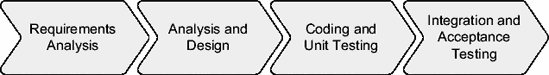

# 关于 OakTable 网络

就其本身而言，OakTable 网络不过是一群喜欢与志同道合的人交流、保持联系的人——即那些对 Oracle 数据库技术持有科学方法（和探究精神）的人。

这一切始于 1998 年的某个时候。当时，包括 Anjo Kolk、Cary Millsap、James Morle 在内的几位 Oracle 专家，开始以各种借口每年聚会一两次。每个人会带一瓶苏格兰威士忌或波本威士忌，作为回报，他们可以在我家的某个地板上睡觉。

我们大部分时间都围坐在我的餐桌旁，周围散落着电脑、线缆、纸张和其他东西，讨论 Oracle，讲述轶事，并试验新的、更好的数据库操作方法。到了 2002 年春天，整个事情发展壮大了。一天晚上，我意识到有 16 位世界知名的 Oracle 专家围坐在我的餐桌旁。我们三四个人挤一个房间睡觉，甚至早上还得借用邻居的淋浴间。Anjo Kolk 建议我们称自己为"OakTable 网络"（以我的餐桌命名），大约两分钟后，`http://www.OakTable.net`就被注册了。

现在，James Morle 和他的妻子 Elain 共同维护这个网站。尽管它更新内容的速度可能不如应有的那么频繁，但至少在提供链接、名称等方面还是有用的。我们也用它来发布"挑战"问题及答案。

"挑战"是我们偶尔在会议期间进行的活动。向我们提出任何（技术性的）关于 Oracle 的问题，如果我们无法在 24 小时内找到答案（无论是肯定、否定还是一个解决方案），那么提问者将获得一件 T 恤，上面印着他或她战胜了 OakTable。

然而，"挑战"的使用不如我们期望的那么频繁，可能是因为看起来我们想被那些找不到答案的问题挑战。但事实恰恰相反——我们的目的是回答任何人的问题，无论这些问题看起来多么"简单"或"容易"。

## 成员

我最近读了《`Operation Certain Death`》这本书，讲的是英国特种部队在塞拉利昂的一次行动。我想非常明确地说明，OakTable 成员的身体素质绝对无法与特种部队相提并论。事实上，完全不能。

但书中作者观察到，特种部队士兵都完全信奉一条格言：只要思考得足够长久和深入，任何事情都可以用两根橡皮筋和一段绳子完成。换句话说，永远、永远不要放弃。

这让我想到我在 OakTable 成员身上也观察到的特质：他们都相信总存在多一个选择，总存在多一种看待事物的方式。这可能需要与另一位成员聊聊，甚至可能需要一次"中国式议会"（冗长辩论），但放弃一个问题的想法确实是不可接受的，除非你被命令这样做。

所以，想象一下，让一群具有这种态度（并且对彼此怀有极大尊重）的人聚在一起，哪怕只有几天。这永远不会无聊，你很少会看到他们像我们所说的那样，处于"空闲等待事件"中。

想象一下，站在哥本哈根 OracleWorld 展厅冰冷、灰色的水泥地上，意识到我们没有付费租用地毯或任何东西，只有 6 米乘 6 米的水泥地。嗯，结果英特尔的人有多余的超高质量的仿真草皮地毯，但他们需要啤酒。是 Gary Goodman 在半小时内促成了这笔交易。

然后，Johannes Djernes 看到 BMC 的人搬运他们所有先进的展览用品进来，放在两个每个尺寸为 2.5 米乘 1 米乘 1 米的板条箱里。两箱啤酒之后，我们借到了空箱子。接着 Johannes 出去买了各种零碎物品，几小时内，我们就搭起了整个展览区最高的塔（5 米高）。它可能也是最丑的，但人们注意到了它。

在同一活动中，James Morle 像狮子一样奋力拼搏，使用一台 NetApp 存储设备、一张 Linux 启动 CD 和任何碰巧路过的人的笔记本电脑，建立了世界上最大的笔记本电脑 RAC 集群。这是一个巨大的成功，但如果没有 James 以及像 Michael Möller 和 Morten Egan 等其他人的"永不放弃"态度，这是绝对不可能完成的。

由 James Morle、Cary Millsap、Anjo Kolk、Steve Adams、Jonathan Lewis 和我本人组成的委员会，审核新 OakTable 成员的建议。现在成员数量已超过 70 人，我毫不怀疑我们将继续吸纳具有探究精神、科学态度、"永不放弃"精神的成员——这正是这个非凡人群的标志。

## 政治立场

你多久听到一次"Oracle 说……"或者"Oracle Support 承诺……"这样的说法？嗯，大多数时候，并不是 Oracle 公司作为一个整体"说"了什么，而是某个有观点或想法的个体。我知道这一点，因为我在 Oracle Support 工作了十年，听到自己的话后来被当作 Oracle 公司（或至少是 Oracle Denmark）的话重复，确实是一种奇怪的感觉。

OakTable 也是一样。我们不作为一个单一实体行动，而是作为个体。一些（技术）观点可能是共享的，但这只是幸运的巧合。除了思想应该被分享、猜测应该通过不断测试和突破界限来消除之外，对成员的个人行为或态度没有任何指导方针。

在同行之间公开分享思想并追求科学方法，这正是 OakTable 网络的全部意义所在。在这些目标上，不可能也不应该有任何妥协。

## 书籍

在英国 Kenilworth 的一次 Oracle SIG 会议期间的一天，James Morle 在喝 Larson 干邑白兰地时，提出了 BAARF 党（反对任何 RAID 五/四/呃……免费）的想法。就在同一天晚上，我们与 Apress 的 Tony Davis 共进晚餐，James 当时提出了这个名为 OakTable Press 的出版品牌的想法。Tony 认为这是个绝妙的主意，几天后它就成为了现实。

其理念是让 OakTable 成员要么撰写书籍，要么至少在书籍在这个品牌下出版前进行审阅。一本书至少需要两位 OakTable 成员审阅并认可才能出版。

除了您现在手中的这本书，目前的目录包括以下书籍：

> *`Expert Oracle JDBC Programming`*：Oracle 和 Java 专家 R.M. Menon 展示了如何构建通过 JDBC 访问 Oracle 的可扩展、高性能的 Java 应用程序。Menon 没有采取与数据库无关的方法，而是向您展示如何为 Oracle 编写特定的 JDBC 代码，并且写得很好，确保您能够利用 Oracle 数据库平台所提供的全部丰富功能。
>
> *`Mastering Oracle PL/SQL: Practical Solutions`*：Connor McDonald 等人向您展示如何编写在重负载、多用户环境下运行快速且不会崩溃的 PL/SQL 代码。
>
> *`Oracle Insights: Tales of the Oak Table`*：一群 OakTable 成员（包括我）讲述了一系列我们使用 Oracle 软件的经历（好的和坏的）：它过去在哪里，将走向何方，如何（以及如何不）成功使用它，以及一些当基本设计原则被忽视时可能发生的可怕故事。
>
> *`Peoplesoft for the Oracle DBA`*：David Kurtz 为任何负责维护 PeopleSoft 应用程序的 Oracle DBA 提供了一份"生存指南"。本书向您展示了如何使用 PeopleSoft 工具集有效地实施常见的 Oracle 数据库管理技术，如何分析应用程序活动，以及如何获取关键数据以追踪性能不佳的原因。

我们希望 OakTable Press 出版的每一本书都能具备我们所推崇的品质：科学、严谨、准确、创新且读来饶有趣味。归根结底，我们期望每一本书都能成为尽其所能助力您生活更轻松的实用工具。

Miracle A/S ([`www.miracleas.dk`](http://www.miracleas.dk)) 董事总经理，OakTable 网络联合创始人
莫根斯·诺加德 (Mogens Nørgaard)

## 第一部分
基础

*Chi non fa e' fondamenti prima, gli potrebbe con una grande virtú farli poi, ancora che si faccino con disagio dello architettore e periculo dello edifizio.*

*凡事先不打好根基者，日后或可凭其卓绝能力补建，但此举将给建筑师带来麻烦，并危及建筑本身*.¹

尼科洛·马基雅维利，《君主论》，1532 年。

* * *

1. 由 W. K. Marriott 翻译。网址：[`www.gutenberg.org/files/1232/1232-h/1232-h.htm`](http://www.gutenberg.org/files/1232/1232-h/1232-h.htm)。

### 第一章
性能问题

**性**能调优往往在应用开发完成之后才开始。这很不幸，因为它暗示着性能不如应用的其他关键需求重要。然而，性能绝非可有可无；它是应用的一个关键属性。糟糕的性能不仅会影响应用的接受度，通常还会因生产力下降而导致投资回报率降低。事实上，正如 20 世纪 80 年代初的几项 IBM 研究所示，性能与用户生产力之间存在着密切关联。研究表明，随着系统交易率的提高，用户的思考时间和错误率呈一对一的下降。这归因于用户因等待时间过长而导致的注意力分散。此外，性能不佳的应用会导致软件、硬件和维护成本上升。基于这些原因，本章将讨论为何规划性能至关重要，以及如何识别应用何时出现了性能问题。随后，本章将介绍如何在运行中的系统上处理性能问题。

#### 是否需要规划性能？

在软件工程中，采用不同的模型来管理开发项目。无论使用的是像瀑布模型那样的顺序生命周期，还是像统一软件开发过程那样的迭代生命周期，应用开发都会经历若干共同阶段（参见图 1-1）。这些阶段在开发项目中可能出现一次（瀑布模型）或多次（迭代模型）。

`图 1-1`. 应用开发的基本阶段

如果仔细思考每个阶段需要执行的任务，你可能会注意到性能是贯穿每个阶段的内在要素。尽管如此，真正的开发团队却常常忽略性能——至少直到性能问题出现为止。而那时可能为时已晚。因此，在接下来的章节中，我将阐述下次开发应用时，从性能角度看不应忘记的要点。

##### 需求分析

简言之，*需求分析*定义了应用的目标，从而明确了其预期达成的效果。进行需求分析时，通常会采访若干利益相关者。这很有必要，因为仅靠一人很难定义所有的业务和技术需求。既然需求来源多样，就必须仔细分析，尤其要找出潜在的矛盾之处。执行需求分析时，至关重要的一点是，不仅要关注应用必须提供的功能，还要仔细定义这些功能的使用方式。对于每一项具体功能，必须了解预期有多少用户¹会与之交互，他们预计使用的频率，以及单次使用的预期响应时间。换言之，必须定义预期的性能指标。

**响应时间**

请求进入系统或功能单元到离开该系统或功能单元之间的时间间隔称为*响应时间*。响应时间可进一步细分为系统处理请求所需的时间（称为*服务时间*）和请求等待处理的时间（称为*等待时间*）。

`响应时间 = 服务时间 + 等待时间`

如果认为请求在用户执行操作（如点击按钮）时进入系统，并在用户收到该操作的响应时离开系统，那么这个间隔可称为*用户响应时间*。换言之，用户响应时间是从用户视角出发处理请求所需的时间。

在某些情况下，例如对于 Web 应用，考虑用户响应时间并不常见，因为通常无法在请求到达应用的首个组件（通常是 Web 服务器）之前对其进行跟踪。此外，多数情况下无法保证用户响应时间，因为应用提供方不负责用户应用（通常是浏览器）与应用首个组件之间的网络。在这种情况下，测量并保证请求进入系统首个组件到离开该组件之间的时间间隔更为合理。这个耗时称为*系统响应时间*。

表 1-1 展示了`JPetStore`² 提供的典型操作的性能指标。对于每个操作，给出了进入系统的请求中有 90%和 99.99%所能保证的系统响应时间。大多数情况下，为所有请求（即 100%）保证性能要么不可能，要么成本过高。因此，通常的做法是定义少数请求可能无法达到要求的响应时间。由于系统工作负载在一天中有所变化，最大到达率指定了两个数值。在此特定场景中，预计白天交易率最高，但在其他情况下——例如，若批处理作业安排在夜间——情况可能不同。

**表 1-1.** *网店提供的典型操作的性能指标*

| **操作** | **最大响应时间 (秒)** |  | **最大到达率 (交易/分钟)** |  |
| :--- | :--- | :--- | :--- | :--- |
|  | **90%** | **99.99%** | **0–7 时** | **8–23 时** |
| 注册/修改个人资料 | 2 | 5 | 1 | 2 |
| 登录/登出 | 0.5 | 1 | 5 | 20 |
| 搜索产品 | 1 | 2 | 60 | 240 |
| 显示产品概览 | 1 | 2 | 30 | 120 |
| 显示产品详情 | 1.5 | 3 | 10 | 36 |
| 向购物车添加/更新/移除产品 | 1 | 2 | 4 | 12 |
| 显示购物车 | 1 | 3 | 8 | 32 |
| 提交/确认订单 | 1 | 2 | 2 | 8 |
| 显示订单 | 2 | 5 | 4 | 16 |

这些性能需求不仅在应用开发的后续阶段中至关重要（正如你将在后续章节中看到的），而且之后你还可以将它们作为定义**服务等级协议**以及进行容量规划的基础。

## 服务等级协议

`服务等级协议` 是一份合同，用于明确界定服务提供者与服务消费者之间的关系。它描述了所提供的服务、其正常运行时间和停机时间的可用性级别、响应时间、客户支持水平，以及当服务提供者未能履行协议时的应对措施。

就响应时间定义服务等级协议，仅在能够验证其履行情况时才有意义。它们要求定义清晰且可衡量的性能指标及其相关目标。这些性能指标通常被称为`关键性能指标`。理想情况下，应使用监控工具来收集、存储和评估它们。实际上，其目的不仅是在目标未达成时发出标记，还要保留日志以供报告和容量规划之用。要收集这些性能指标，你可以使用两种主要技术。第一种是利用检测代码的输出（更多信息请参阅第 3 章）。第二种是使用监控工具，通过应用合成事务来检查应用程序（参见本章后面的“响应时间监控”部分）。

### 分析与设计

基于需求，架构师能够设计解决方案。最初，为了定义架构，考虑所有需求是至关重要的。事实上，一个必须处理高工作负载的应用程序，从一开始就必须为实现这一需求而设计。如果采用了并行化、分布式计算或结果复用等技术，情况尤其如此。例如，设计一个旨在支持少数用户每分钟执行十几笔交易的客户端/服务器应用程序，与设计一个旨在支持数千用户每秒执行数百笔交易的分布式应用程序，是截然不同的。

有时，需求也会通过限制对特定资源的使用来影响架构。例如，对于需要通过极慢的网络连接到服务器的移动设备的应用程序，其架构必须被设计为能够支持高延迟和低吞吐量。作为一般规则，架构师不仅要预见解决方案中可能出现的瓶颈，还要判断这些瓶颈是否会危及需求的实现。如果架构师没有足够的信息来进行这种关键的先验估计，则应开发一个甚至多个原型。在这方面，如果没有在上一阶段收集的性能数据，就很难做出明智的决策。所谓明智的决策，我指的是那些能够以最小的投资——简单问题用简单方案，复杂问题用优雅方案——支持预期工作负载的架构/设计决策。

### 编码与单元测试

开发者编写的代码应具备以下特征：

*健壮性*：

应对意外情况的能力是任何软件都应具备的特性，这基于代码的质量。要做到这一点，定期进行单元测试至关重要。如果你选择迭代生命周期，这一点就更加重要。事实上，在此类模型中，快速重构现有代码的能力是必不可少的。例如，当一个例程被调用时，如果参数值不在允许值列表中，它仍应能够处理而不至于崩溃。如有必要，还应生成有意义的错误消息。

*清晰性*：

长期可读且有文档记录的代码，比编写拙劣的代码更易于维护（且成本更低）。例如，开发者将多个操作压缩在一行难以理解的代码中，这是展示其聪明才智的错误方式。

*速度*：

代码应优化为尽可能快地运行，尤其是在预期高工作负载的情况下。例如，应避免不必要的操作以及低效或不合适的算法。

*精明的资源利用*：

代码应尽可能高效地利用可用资源。请注意，这并不总是意味着使用最少的资源。例如，一个采用并行化的应用程序所需的资源比所有操作都串行化的应用程序要多得多，但在某些情况下，并行化可能是处理高工作负载的唯一方法。

*可检测性*：

检测的目的有两方面。首先，当功能或性能问题出现时（它们肯定会出现），它便于分析这些问题。其次，这是添加战略性代码以提供应用程序性能信息的合适位置。例如，添加代码来提供执行特定操作所需时间的信息通常相当简单。这是一种简单而有效的方法，用于验证应用程序是否能满足必要的性能要求。

不仅其中一些特性相互冲突，而且预算通常有限（有时*非常*有限）。因此，似乎有必要在这些特性之间确定优先级，并在可用预算内实现期望需求之间找到良好的平衡，这往往是合理的。

