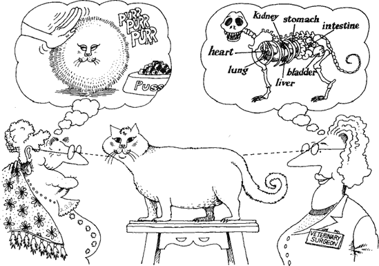
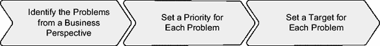
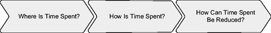
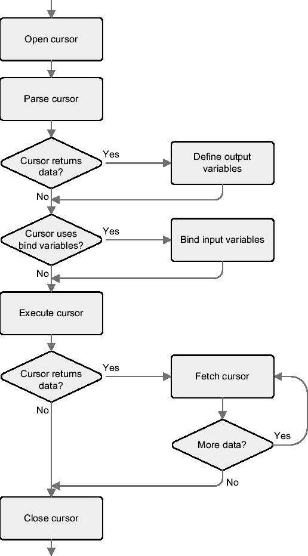
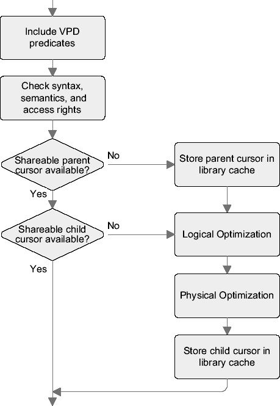

# 强迫性调优紊乱症

从前，大多数数据库管理员都患有一种称为`强迫性调优紊乱症`的疾病。³ 这种疾病的症状是过度检查许多与性能相关的统计信息（其中大部分是基于比率的），以及无法专注于真正重要的事情。他们简单地认为，通过应用一些“简单”的规则，就可以调优他们的数据库。历史告诉我们，结果并不总是如预期那样好。为什么会出现这种情况呢？嗯，所有用于检查给定比率（或值）是否可接受的规则，都是独立于用户体验定义的。换句话说，假阴性或假阳性是常态而非例外。更糟糕的是，大量的时间都花在了这些任务上。

例如，时不时地会有数据库管理员问我这样的问题：“在我们其中一个数据库上，我注意到在锁存器 `X` 上有大量的等待。我能做些什么来减少或者最好是消除这种等待？”我的典型回答是：“你的用户因为在这个特定的锁存器上等待而抱怨吗？当然没有。所以，别担心它。相反，去问问他们应用程序遇到了什么问题。然后，通过分析这些问题，你就会发现锁存器 `X` 上的等待是否与它们有关。”我将在下一节详细阐述这一点。

尽管我从未担任过数据库管理员，但我必须承认我也曾饱受`强迫性调优紊乱症`之苦。如今，和大多数其他人一样，我已经克服了这种疾病。不幸的是，就像任何严重的疾病一样，它需要很长时间才能完全消失。有些人根本没有意识到自己被感染了。另一些人意识到了，但在多年成瘾之后，承认如此大的错误并打破习惯总是困难的。

## 你如何处理性能问题？

简单来说，应用程序的目的是为使用它的业务提供效益。因此，优化应用程序性能的原因是为了最大化这种效益。这并不意味着最大化性能，而是找到成本与性能之间的最佳平衡点。事实上，一项优化任务所涉及的努力，应始终能从你期望从中获得的效益中得到补偿。这意味着从业务角度来看，性能优化可能并不总是有意义的。

### 业务视角 vs. 系统视角

你优化应用程序的性能是为了给业务带来效益，因此，在处理性能问题时，你必须在深入应用程序细节之前，先理解业务问题和需求。图 1-2 展示了具有`业务视角`的人（即用户）与具有`系统视角`的人（即工程师）之间的典型差异。



`图 1-2. 不同的观察者可能有完全不同的视角`。⁴

重要的是要认识到这两种视角之间存在因果关系。虽然结果必须从业务视角来识别，但原因必须从系统视角来确定。所以，如果你不想去排查不存在或不相关的问题（`强迫性调优紊乱症`），从业务视角理解问题是什么至关重要——即使这需要更细致的工作。

### 问题分类

处理性能问题时，第一步是从业务视角识别它们，并为每个问题设定优先级和目标，如图 1-3 所示。



`图 1-3. 对性能问题进行分类时要执行的任务`

业务问题无法通过查看系统统计信息来发现。它们必须从业务视角来识别。如果实施了服务级别协议的监控，那么性能问题显然是通过查看未达到预期的操作来识别的。否则，除了与用户或负责应用程序的人员交谈外，别无他法。此类讨论可以得出一个操作列表，例如注册新用户、运行报告或加载一批数据，这些操作被认为是缓慢的。

一旦你知道了有问题的操作，就是给它们设定优先级的时候了。为此，可以问这样的问题：“如果我们只能处理五个问题，应该处理哪几个？”当然，理想是解决所有问题，但有时时间或预算是有限的。此外，不可能排除那些解决不同问题所需的措施相互冲突的情况。需要强调的是，设定优先级时，当前的性能可能无关紧要。例如，如果你处理一组报告，并不总是最慢的那个优先级最高。可能最快的那个也是执行最频繁的那个。因此，它可能具有最高优先级，应该首先被优化。再次强调，是业务需求在驱动你。

对于每个操作，你应该为优化设定一个可量化的目标，例如“当点击`创建用户`按钮时，处理时间最多持续两秒。”如果有性能要求甚至服务级别协议，那么目标可能已经明确了。否则，你必须再次考虑业务需求来确定目标。请注意，没有目标，你就不知道什么时候该停止寻找更好的解决方案。换句话说，优化可能是无止境的。记住，努力应该始终与效益相平衡。

### 解决问题

对整个系统进行故障排除比对单个组件进行故障排除要复杂得多。因此，只要可能，你应该一次处理一个问题。只需拿着问题列表，按照它们的优先级级别逐一处理。

对于每个问题，必须回答图 1-4 中所示的三个问题：

*时间花在哪里了？* 首先，你必须识别时间去哪儿了。例如，如果一个特定的操作需要十秒钟，你必须找出这十秒中的大部分时间消耗在哪个模块或组件上。

*时间是如何花费的？* 一旦你知道了时间去哪儿了，你就必须找出时间是如何花费的。例如，你可能发现应用程序在 `CPU` 上花费了 4.2 秒，在 `I/O` 操作上花费了 0.4 秒，在等待来自另一个组件的消息出队上花费了 5.1 秒。

*如何减少花费的时间？* 最后，是时候找出如何使操作更快了。为此，必须专注于处理中最耗时的部分。例如，如果 `I/O` 操作占总处理时间的 4%，那么开始调优它们就没有意义，即使它们非常慢。



`图 1-4. 要对性能问题进行故障排除，你需要回答这三个问题。`

重要的是要注意，得益于有益的副作用，有时为解决特定问题而实施的措施也会解决另一个问题。当然，相反的情况也可能发生。所采取的措施可能会引入新问题。因此，仔细考虑特定修复可能带来的所有可能的副作用至关重要。显然，所有变更在投入生产之前都必须经过仔细测试。


### 转至第 2 章

在本章中，我们探讨了处理性能问题的一些关键议题：为何必须在正确的时机以系统化的方法处理性能问题，为何理解业务需求和问题至关重要，以及为何必须就何为“良好性能”达成共识。

在描述如何解答图 1-4 中的三个问题之前，我有必要先介绍一些将在本书后续部分使用的关键概念。为此，第 2 章将描述数据库引擎执行 SQL 语句的处理过程。此外，我将定义几个常用术语。

* * *

1. 请注意，用户并不总是人类。例如，如果你在为 Web 服务定义需求，很可能只有其他应用程序会使用它。

2. JPetStore 是 Spring Framework 等提供的示例应用程序。请访问[`www.springframework.org`](http://www.springframework.org)下载它或获取更多信息。

3. 这个绝妙的术语由 Gaya Krishna Vaidyanatha 首次提出。你可以在《*Oracle Insights: Tales of the Oak Table*》（Apress, 2004）一书中找到相关的讨论。

4. Booch, Grady, 《*Object-Oriented Analysis and Design with Applications*》, 第 42 页 (Addison Wesley Longman, Inc., 1994)。经 Grady Booch 许可转载。保留所有权利。

### 第 2 章 核心概念

**本**章的目标是双重的。首先，为了避免不必要的混淆，我将介绍一些贯穿本书反复使用的术语。最重要的包括*选择率*（selectivity）和*基数*（cardinality）、*软解析*（soft parse）和*硬解析*（hard parse），以及*绑定变量窥探*（bind variable peeking）和*扩展游标共享*（extended cursor sharing）。其次，我将描述 SQL 语句的生命周期。换句话说，我将描述为执行 SQL 语句而进行的操作。在此讨论中，将特别关注解析过程。

### 选择率与基数

*选择率*（`selectivity`）是一个介于 0 和 1 之间的值，表示由某个操作过滤掉的行的比例。例如，如果一个访问操作从表中读取了 120 行，并应用过滤器后返回了 18 行，则选择率为 0.15（18/120）。选择率也可以用百分比表示，因此 0.15 也可以表示为 15%。操作返回的行数称为*基数*（`cardinality`）。公式 2-1 展示了选择率与基数之间的关系。在此公式中，`num_rows`是处理的行数。

```
基数 = 选择率 · num_rows
```

**公式 2-1** *选择率与基数的关系*

* * *

**注意** 在某些出版物中，术语*基数*（`cardinality`）指的是特定列中存储的不同值的数量。我从不以这种方式使用*基数*这个术语。

* * *

让我们看几个基于脚本 `selectivity.sql` 的例子。在下面的查询中，访问表的操作的选择率是 1。这是因为没有应用`WHERE`子句，因此查询返回了表中存储的所有行（10,000 行）。

```
SQL> SELECT * FROM t;
...
10000 rows selected.
```

在下面的查询中，访问表的操作的选择率是 0.2601（从 10,000 行中返回了 2,601 行）：

```
SQL> SELECT * FROM t WHERE n1 BETWEEN 6000 AND 7000;
...
2601 rows selected.
```

在下面的查询中，访问表的操作的选择率是 0（从 10,000 行中返回了 0 行）：

```
SQL> SELECT * FROM t WHERE n1 = 19;
no rows selected.
```

在前面的三个例子中，与访问表操作相关的选择率是通过查询返回的行数除以表中存储的行数来计算的。这是可行的，因为这三个查询不包含导致聚合的操作。一旦查询在`SELECT`子句中包含`GROUP BY`子句或分组函数，执行计划中就至少包含一个聚合操作。下面的查询说明了这一点（注意分组函数`sum`的存在）：

```
SQL> SELECT sum(n2) FROM t WHERE n1 BETWEEN 6000 AND 7000;
   SUM(N2)
----------
     70846
1 row selected.
```

在这种情况下，无法根据查询返回的行数（本例中是 1）来计算访问操作的选择率。相反，应该执行类似下面的查询，以找出执行聚合操作处理了多少行。这里，访问操作的选择率是 0.2601（2,601/10,000）。

```
SQL> SELECT count(*) FROM t WHERE n1 BETWEEN 6000 AND 7000;
   COUNT(*)
----------
      2601
1 row selected.
```

正如你将在后面，特别是第 9 章中看到的，了解操作的选择率有助于你确定最高效的访问路径。


## 游标生命周期

理解游标生命周期是优化执行 SQL 语句的应用程序所需的知识。以下是处理游标期间执行的步骤：

*打开游标*：

在与会话关联的服务器进程的服务器端私有内存中，为游标分配内存结构，即*用户全局区*（`UGA`）。注意，此时还没有 SQL 语句与游标关联。

*解析游标*：

一个 SQL 语句与游标关联。其包含执行计划（描述 SQL 引擎将如何执行 SQL 语句）的解析表示被加载到共享池中，具体是在库缓存中。`UGA` 中的结构被更新，以存储指向库缓存中可共享游标位置的指针。下一节将更详细地描述解析过程。

*定义输出变量*：

如果 SQL 语句返回数据，则必须定义接收数据的变量。这不仅对于查询是必要的，对于使用 `RETURNING` 子句的 `DELETE`、`INSERT` 和 `UPDATE` 语句也是必要的。

*绑定输入变量*：

如果 SQL 语句使用绑定变量，则必须提供它们的值。绑定期间不执行检查。如果传递了无效数据，则在执行期间会引发运行时错误。

*执行游标*：

执行 SQL 语句。但要小心，因为数据库引擎在此阶段并不总是执行任何有意义的操作。事实上，对于许多类型的查询，真正的处理通常会延迟到提取阶段。

*提取游标*：

如果 SQL 语句返回数据，此步骤会检索它。特别是对于查询，此步骤是执行大部分处理的地方。对于查询，行可能是部分提取的。换句话说，游标可能在所有行被提取之前关闭。

*关闭游标*：

释放 `UGA` 中与游标关联的资源，从而使其可用于其他游标。库缓存中的可共享游标不会被删除。它保留在那里，希望将来能被重用。

为了更好地理解这个过程，最好将每个步骤按照图 2-1 所示的顺序单独执行。然而，在实践中，会应用不同的优化技术来加快处理速度。（我将在第 8 章中提供有关这些技术的更多信息。）目前，只要知道这是事情通常的运作方式即可。



**图 2-1.** *游标的生命周期*

根据你使用的编程环境或技术，图 2-1 中描述的不同步骤可能是隐式或显式执行的。为了明确区分，请查看脚本 `lifecycle.sql` 中提供的以下两个 PL/SQL 块。它们目的相同（从表 `emp` 中读取一行），但编码方式却大不相同。

第一个是使用包 `dbms_sql` 的 PL/SQL 块，它显式编写了图 2-1 所示的每一步：

```sql
DECLARE
  l_ename emp.ename%TYPE := 'SCOTT';
  l_empno emp.empno%TYPE;
  l_cursor INTEGER;
  l_retval INTEGER;
BEGIN
  l_cursor := dbms_sql.open_cursor;
  dbms_sql.parse(l_cursor, 'SELECT empno FROM emp WHERE ename = :ename', 1);
  dbms_sql.define_column(l_cursor, 1, l_empno);
  dbms_sql.bind_variable(l_cursor, ':ename', l_ename);
  l_retval := dbms_sql.execute(l_cursor);
  IF dbms_sql.fetch_rows(l_cursor) > 0
  THEN
    dbms_sql.column_value(l_cursor, 1, l_empno);
  END IF;
  dbms_sql.close_cursor(l_cursor);
END;
```

第二个是利用隐式游标的 PL/SQL 块；基本上，PL/SQL 块将游标的控制权委托给 PL/SQL 编译器：

```sql
DECLARE
  l_ename emp.ename%TYPE := 'SCOTT';
  l_empno emp.empno%TYPE;
BEGIN
  SELECT empno INTO l_empno
  FROM emp
  WHERE ename = l_ename;
END;
```

大多数情况下，编译器所做的工作是没问题的。然而，有时你需要对处理过程中执行的不同步骤有更多的控制。因此，你不能总是使用隐式游标。例如，在两个 PL/SQL 块之间，有一个细微但重要的区别。无论查询返回多少行，第一个块都不会生成异常。相反，如果返回零行或多行，第二个块会生成一个异常。

## 解析过程如何工作

上一节描述了游标的生命周期，本节重点介绍解析阶段。此阶段执行的步骤如图 2-2 所示：

*包含 VPD 谓词*：

如果正在使用虚拟专用数据库（`VPD`，以前称为*行级安全*）并且对于被解析的 SQL 语句中引用的某个表处于活动状态，则安全策略生成的谓词将包含在其 `WHERE` 子句中。

*检查语法、语义和访问权限*：

此步骤不仅确保 SQL 语句书写正确，还确保 SQL 语句引用的所有对象都存在，并且当前解析它的用户具有访问它们所需的权限。

*将父游标存储在库缓存中*：

每当还没有可用的可共享父游标时，会从库缓存中分配一些内存，并在其中存储一个新的父游标。与父游标关联的关键信息是 SQL 语句的文本。

*逻辑优化*：

在此阶段，通过应用不同的转换技术，生成新的、语义等效的 SQL 语句。这样做增加了考虑的执行计划数量，即*搜索空间*。目的是探索如果没有此类转换就不会考虑的执行计划。

*物理优化*：

在此阶段，执行 several operations。首先，为逻辑优化产生的每个 SQL 语句生成相关的执行计划。然后，根据数据字典中的统计信息或通过动态采样收集的统计信息，为每个执行计划关联一个成本。最后，选择成本最低的执行计划。简而言之，查询优化器探索搜索空间以找到最高效的执行计划。

*将子游标存储在库缓存中*：

分配一些内存，可共享的子游标存储在其中并与父游标关联。与子游标关联的关键元素是执行计划和执行环境。

一旦存储在库缓存中，父游标和子游标就分别通过视图 `v$sqlarea` 和 `v$sql` 对外公开。游标通过三列来标识：`address`、`hash_value` 和 `child_number`。使用 `address` 和 `hash_value` 来标识父游标；使用所有三个值来标识子游标。此外，从 Oracle Database 10*g* 开始，也可以并且更常见的是使用 `sql_id` 来代替 `address` 和 `hash_value` 这一对值达到相同目的。

当有可用的可共享父游标和子游标时，因此只执行前两个操作，这种解析称为*软解析*。当执行所有操作时，称为*硬解析*。



**图 2-2.** *解析阶段执行的步骤*


从性能角度来看，应尽可能避免硬解析。这正是数据库引擎在库缓存中存储可共享游标的原因。这样一来，属于该实例的每个进程都可以复用它们。硬解析成本高昂有两个原因。首先，逻辑和物理优化是极其消耗 CPU 的操作。其次，在库缓存中存储父游标和子游标需要内存。由于库缓存在所有会话间共享，库缓存中的内存分配必须是串行化的。实际上，在能够分配父游标和子游标所需的内存之前，必须先获得保护共享池的某个锁存器之一。即使软解析的影响远小于硬解析，最好也避免软解析，因为它们同样涉及某种程度的串行化。实际上，为了搜索一个可共享的父游标，必须获得保护库缓存的某个锁存器。总之，应尽可能避免软解析和硬解析，因为它们会限制应用程序的可扩展性。

### 可共享游标

解析操作的结果是在库缓存中存储一个父游标和一个子游标。显然，将它们存储在共享内存区域中的目的是允许复用，从而避免硬解析。因此，有必要讨论在什么情况下可以复用父游标或子游标。为了说明父游标和子游标共享的工作原理，本节将基于脚本 `sharable_cursors.sql` 介绍两个示例。

第一个示例的目的是展示父游标无法被共享的情况。与父游标相关的关键信息是 SQL 语句的文本。因此，如果几个 SQL 语句的文本完全相同，它们将共享同一个父游标。这是最基本的要求。然而，存在一个例外，我将在第 8 章中描述。在以下示例中，执行了四个 SQL 语句。其中两个文本相同。另外两个仅因大小写字母或空格而有所不同。

`SQL> SELECT * FROM t WHERE n = 1234;`

`SQL> select * from t where n = 1234;`

`SQL> SELECT * FROM t WHERE n=1234;`

`SQL> SELECT * FROM t WHERE n = 1234;`

通过视图 `v$sqlarea`，可以确认创建了三个不同的父游标。同时注意每个游标的执行次数。

```sql
SELECT sql_id, sql_text, executions
  FROM v$sqlarea
 WHERE sql_text LIKE '%1234';
```

```
SQL_ID        SQL_TEXT                                  EXECUTIONS
------------- ---------------------------------------- ----------
2254m1487jg50 select * from t where n = 1234                     1
g9y3jtp6ru4cb SELECT * FROM t WHERE n = 1234                     2
7n8p5s2udfdsn SELECT  *  FROM  t  WHERE  n=1234                  1
```

第二个示例的目的是展示父游标可以共享，但子游标不能共享的情况。与子游标相关的关键信息是执行计划及其相关的执行环境。执行环境很重要，因为如果它发生变化，执行计划也可能随之改变。因此，多个 SQL 语句只有在共享相同的父游标且其执行环境兼容的情况下，才能共享同一个子游标。为了说明这一点，使用两个不同的初始化参数 `optimizer_mode` 值来执行同一个 SQL 语句：

```sql
ALTER SESSION SET optimizer_mode = all_rows;
```

```sql
SELECT count(*) FROM t;
```

```
  COUNT(*)
----------
      1000
```

```sql
ALTER SESSION SET optimizer_mode = first_rows_10;
```

```sql
SELECT count(*) FROM t;
```

```
  COUNT(*)
----------
      1000
```

结果是创建了一个父游标 (`5tjqf7sx5dzmj`) 和两个子游标（0 和 1）。同样关键的是要注意，两个子游标具有相同的执行计划（`plan_hash_value` 列的值相同）。这很好地说明，创建新的子游标是因为出现了新的独立执行环境，而不是因为生成了另一个执行计划。

```sql
SELECT sql_id, child_number, sql_text, optimizer_mode, plan_hash_value
  FROM v$sql
 WHERE sql_id = (SELECT prev_sql_id
                   FROM v$session
                  WHERE sid = sys_context('userenv','sid'));
```

```
SQL_ID        CHILD_NUMBER SQL_TEXT               OPTIMIZER_MODE PLAN_HASH_VALUE
------------- ------------ ---------------------- -------------- ---------------
5tjqf7sx5dzmj            0 SELECT count(*) FROM t ALL_ROWS       2966233522
5tjqf7sx5dzmj            1 SELECT count(*) FROM t FIRST_ROWS     2966233522
```

要了解是哪个不匹配导致了多个子游标，可以查询视图 `v$sql_shared_cursor`。在其中，对于每个子游标（除了第一个，即 0），你可能会发现为什么无法共享先前创建的子游标。对于多种类型的不兼容性（在 Oracle Database 11*g* 中有 60 种），都有一列被设置为 `N`（无不匹配）或 `Y`（不匹配）。通过以下查询，可以确认在前面的例子中，第二个子游标的不匹配是因为优化器模式不同。但请注意，该视图并非在所有情况下都能提供原因：

```sql
SELECT child_number, optimizer_mode_mismatch
  FROM v$sql_shared_cursor
 WHERE sql_id = '5tjqf7sx5dzmj';
```

```
CHILD_NUMBER OPTIMIZER_MODE_MISMATCH
------------ -----------------------
           0 N
           1 Y
```

在实践中，由非共享父游标引起的硬解析比由非共享子游标引起的要常见得多。事实上，通常情况下，每个父游标的子游标数量很少。如果父游标无法共享，则意味着 SQL 语句的文本在不断变化。如果 SQL 语句是动态生成的，或者使用了字面量而非绑定变量，就会发生这种情况。通常，动态生成的 SQL 语句无法避免。另一方面，通常可以使用绑定变量。不幸的是，使用它们并不总是好事。下面对绑定变量利弊的讨论将帮助你理解何时适合使用它们，何时不适合。


