# 第二部分
## 识别

*让我们解决问题，伙计们。不要因为猜测让事情变得更糟。*

—尤金·F·克兰兹¹

**当**一个应用程序出现性能问题时，首要任务显而易见：识别问题的根本原因。不幸的是，这往往才是真正麻烦的开始。在一个典型的场景中，所有人都在寻找性能问题的根源，开发者责怪数据库性能差，数据库管理员则责怪开发者滥用数据库，以及存储子系统管理员——因为他们昂贵的硬件本应提供更好的性能。而随着应用程序及其支持基础设施复杂性的增加，这种混乱局面也会愈演愈烈。

第三章介绍了适用于不同软件层的各种识别方法。本部分的目的是介绍并采用一种避免猜测的方法论，以确定瓶颈所在，且毋庸置疑。

* * *

1. 此引文出自罗恩·霍华德执导的电影《阿波罗 13 号》。大约在著名台词“休斯顿，我们遇到麻烦了”之后三分钟可以听到。

### 第三章
#### 识别性能问题

**我**们经常听到类似“数据库有性能问题！”这样的话。有时这是真的，有时并非如此。就我个人而言，我对这类说法本身没有意见。然而，问题在于人们往往在没有首先深入调查的情况下就做出这种论断。换句话说，问题在于未经仔细分析就得出结论。要识别性能问题，绝对需要一种开放的方法。我们必须基于证据做出判断，而不是根据意见、感觉和先入之见来评判实际情况。

本章旨在描述一个分析路线图，你可以用它来找出时间花费在何处以及如何花费的。事实上，这正是我自己在调查客户性能问题时使用的方法。

视图 `v$sql_cs_selectivity` 显示了与每个子游标的每个谓词相关的选择性范围。实际上，数据库引擎不会为每个绑定变量值都创建一个新的子游标。相反，它将具有大致相同选择性（因此应产生相同执行计划）的值分组在一起。

```
`CHILD_NUMBER PEEKED EXECUTIONS ROWS_PROCESSED BUFFER_GETS`
`------------ ------ ---------- -------------- -----------`
`           0 Y               1             19           3`
`           1 Y               1            990          19`
`           2 Y               1             19           3`
```

```
SQL> SELECT child_number, predicate, low, high
  2  FROM v$sql_cs_selectivity
  3  WHERE sql_id = '7h6n1xkn8trkd'
  4  ORDER BY child_number;
CHILD_NUMBER PREDICATE LOW HIGH
------------ --------- ---------- ----------
           1 <ID    0.890991   1.088989
           2 <ID    0.008108   0.009910
```

总之，为了提高查询优化器生成高效执行计划的可能性，你不应使用绑定变量。绑定变量窥探可能有所帮助。但不幸的是，能否生成高效的执行计划有时全凭运气。唯一的例外是当 Oracle 数据库 11*g* 的新扩展游标共享功能能自动识别出该问题时。

## 最佳实践

任何功能都只有在其使用带来的优势超过劣势时才应使用。在某些情况下，很容易决定。例如，对于没有 `WHERE` 子句的 SQL 语句（例如，简单的 `INSERT` 语句），没有理由不使用绑定变量。另一方面，每当直方图为查询优化器提供重要信息时，应不惜一切代价避免使用绑定变量。否则，极有可能受到绑定变量窥探的负面影响。在所有其他情况下，情况甚至更不明朗。尽管如此，仍可以考虑两种主要情况：

*处理少量数据的 SQL 语句*：

当处理少量数据时，解析时间可能接近甚至高于执行时间。在这种情况下，使用绑定变量通常是个好主意。对于预期会频繁执行的 SQL 语句尤其如此。通常，此类 SQL 语句用于数据录入系统（通常称为 OLTP 系统）。

*处理大量数据的 SQL 语句*：

当处理大量数据时，解析时间通常比执行时间低好几个数量级。在这种情况下，使用绑定变量不仅对整体响应时间无关紧要，还会增加查询优化器生成极低效执行计划的风险。因此，不应使用绑定变量。通常，此类 SQL 语句用于批处理作业、报表目的，或者在数据仓库环境中由 OLAP 工具使用。

### 读写数据块

为了读取和写入属于数据文件的数据块，数据库引擎利用多种类型的 I/O 操作（参见图 2-3）：

*逻辑读*：

当服务器进程访问位于缓冲区高速缓存中的块时，它会执行逻辑读。请注意，逻辑读既用于读取数据，也用于向块写入数据。

*物理读*：

当服务器进程需要一个尚不在缓冲区高速缓存中的块时，它会执行物理读。因此，它会打开数据文件，读取该块，并将其存储在缓冲区高速缓存中。

*物理写*：

服务器进程不执行物理写。它们只修改存储在缓冲区高速缓存中的块。然后，数据库写入器进程（一个后台进程）负责将修改后的块（也称为*脏块*）存储到数据文件中。

*直接读*：

在一些特定情况下（我将在第 11 章中描述），服务器进程能够直接从数据文件中读取块。当使用此方法时，块不是加载到缓冲区高速缓存，而是直接传输到进程的私有内存中。

*直接写*：

在一些特定情况下（我将在第 11 章中描述），服务器进程能够直接将块写入数据文件。

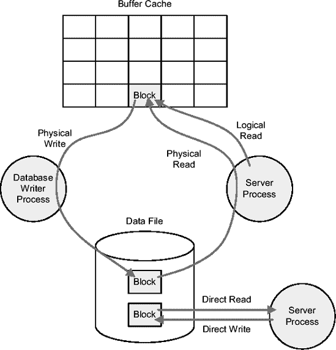

**图 2-3.** *数据库引擎利用多种类型的 I/O 操作。*

### 迈向第三章

本章描述了数据库引擎在解析和执行 SQL 语句时执行的操作。特别关注了使用绑定变量相关的利弊。此外，本章还介绍了一些常用术语。

第三章致力于回答图 1-4 中提出的前两个问题：

*   时间花费在哪里？
*   时间是如何花费的？

简而言之，本章将描述找出问题所在及其原因的方法。既然通常不能不修复性能问题，那么也就不能不正确回答这些问题。当然，如果你不知道是什么导致了问题，你将无法解决它。


##### 分而治之

目前，对于需要 Oracle 等数据库的应用程序而言，多层架构是软件开发的*事实上的*标准。在最简单的情况下，至少会实现两层（也称为客户端/服务器）。大多数时候，则分为三层：表示层、逻辑层和数据层。图 3-1 展示了一个用于部署 Web 应用程序的典型基础设施。通常，出于安全性或工作负载管理的考虑，组件也会分布在多台机器上。

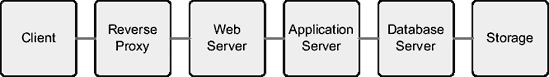

**图 3-1.** *一个典型的 Web 应用程序由部署在多个系统上的多个组件构成。*

对性能问题的分析，应从收集您所关注请求执行的端到端性能数据开始（请记住，一次排查一个问题比排查整个系统要容易得多）。为了通过多层基础设施进行处理，一个请求可能会经过多个组件。然而，并非在所有情况下，所有组件都会参与特定请求的处理。例如，如果在 Web 服务器层启用了缓存，请求可能直接由 Web 服务器提供服务，而无需转发到应用服务器。当然，这同样适用于应用服务器或数据库服务器。

理想情况下，为了全面分析性能问题，我们应该收集所有参与处理的组件的详细信息。在某些情况下，尤其是当涉及许多组件时，可能需要收集大量数据，这可能需要花费大量时间进行分析。因此，*分而治之*的方法通常是处理问题的唯一高效¹途径。其思路是：首先通过将端到端响应时间分解为其主要组成部分来开始分析（参见图 3-2 的示例），然后仅在有必要时才收集详细信息。换句话说，您应该收集最少的必要数据来识别性能问题。

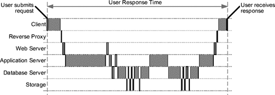

**图 3-2.** *一个请求的响应时间被分解为所有主要组成部分。组件间的通信延迟已忽略。*

一旦您知道了涉及哪些组件以及每个组件花费了多少时间，您就可以通过仅针对最耗时的组件有选择地收集额外信息，来进一步分析问题。例如，根据图 3-2，您应该只关注应用服务器和数据库服务器。对那些仅占响应时间很小部分的组件进行全面分析是没有意义的。

根据您用来收集性能数据的工具或技术的不同，在许多情况下，您可能无法像图 3-2 所示那样，完全分解每个组件的响应时间。此外，这通常也是不必要的。事实上，即使是部分分析，如图 3-3 所示，对于识别哪些组件可能（或不可能）是响应时间的主要责任者也是有用的。

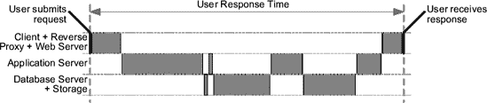

**图 3-3.** *请求的响应时间被部分分解到各组件*

既然您已经了解了为什么建议使用分而治之的方法来识别性能问题，现在让我们来看一个相当详细的分析路线图，您可以将其应用于此目的。

## 分析路线图

图 3-4 总结了分析路线图。这里的初步分析，要么通过利用应用程序的插桩能力，要么通过对应用程序代码进行简要的（通常在调用级别）剖析来完成（如前一节所述，最初不需要详细的剖析）。目的是将响应时间分解为三个主要类别：

*   未在数据库层运行的应用程序代码
*   数据库层及其底层存储
*   支持应用程序的所有未包含在前两类中的组件（例如，网络设备）

如果主要的时间消耗者是应用程序代码，则通过进行详细的（通常在行级别）剖析来继续分析，以找到导致大量响应时间的组件。如果该分析指向一小部分代码，那么您就找到了需要调优的部分，并且很可能有直接的方法来修复它。否则，如果响应时间分布在代码的很大一部分上，这通常意味着问题是由设计决策引起的，因此可能需要进行完整的重新设计。如果设计本身没有问题，那么很可能是运行应用程序的机器配置不足。

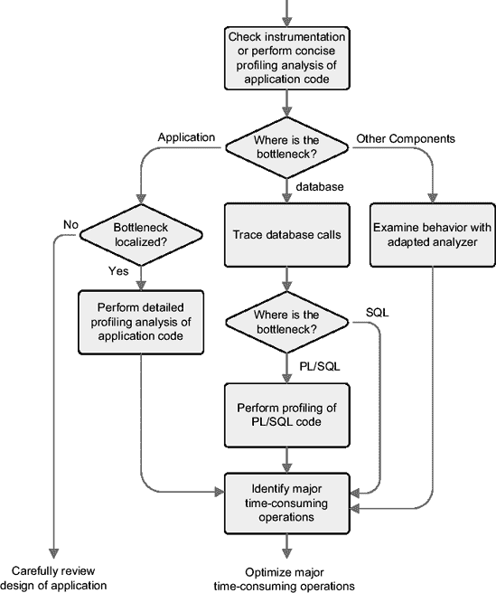

**图 3-4.** *识别性能问题包括几个必须按特定顺序执行的步骤。*

如果主要的时间消耗者是数据库，则通过跟踪数据库调用来继续分析。第一步的目的是找出哪种类型的语句（SQL 或 PL/SQL）是响应时间的主要贡献者。如果分析指向 SQL 语句，那么最初用于确定问题是源于 SQL 还是 PL/SQL 的跟踪文件，已经包含详细分析所需的所有信息。否则，如果 PL/SQL 被质疑，则应对 PL/SQL 代码进行剖析分析。其目的和用于剖析及评估结果的方法，基本与前面针对应用程序代码的描述相同。

### 时间模型统计

从 Oracle 数据库 10*g*开始，您还可以通过查看*时间模型统计信息*来识别应用程序将大部分时间花在哪种数据库操作上。这些信息通过 `v$sys_time_model` 和 `v$sess_time_model` 视图分别在实例和会话级别公开。例如，以下查询显示了一个特定会话如何花费其处理时间：78.8%的时间用于执行 PL/SQL 代码，20.8%的时间用于执行 SQL 语句。请注意，百分比是基于 `DB time` 的值计算的，`DB time` 是处理用户调用所花费的总耗时。

```sql
SQL> WITH
  2     db_time AS (SELECT sid, value
  3                 FROM v$sess_time_model
  4                 WHERE sid = 144
  5                 AND stat_name = 'DB time')
  6  SELECT stm.stat_name AS statistic,
  7         trunc(stm.value/1000000,3) AS seconds,
  8         trunc(stm.value/tot.value*100,1) AS "%"
  9  FROM v$sess_time_model stm, db_time tot
 10 WHERE stm.sid = tot.sid
 11 AND stm.stat_name <> 'DB time'
 12 AND stm.value > 0
 13 ORDER BY stm.value DESC;

STATISTIC                                     SECONDS       %
------------------------------------------- -------- ------
DB CPU                                         15.150   85.5
PL/SQL execution elapsed time                  13.955   78.8
inbound PL/SQL rpc elapsed time               13.955   78.8
sql execute elapsed time                       3.697   20.8
parse time elapsed                             0.202    1.1
hard parse elapsed time                        0.198    1.1
connection management call elapsed time         0.025    0.1
```


此可能性未包含在图 3-4 所描述的分析路线图中，因为它仅提供概览，而在实际操作中，你需要追踪数据库调用才能确切知晓正在发生什么。此外，`DB 时间`仅代表数据库处理时间。因此，数据库等待用户调用所花费的时间未被计入。换言之，仅凭时间模型统计提供的信息，无法判断问题位于数据库内部还是外部。

如果主要的时间消耗来自另一个组件，后续步骤很大程度上取决于该组件的类型。无论如何，核心思路始终一致：使用能够提供该特定组件运行计时信息的工具。例如，如果两台机器之间的通信非常缓慢，建议使用网络分析器监控它们之间的通信。你可以这样做，例如，来检查数据包是否走了正确的路径，而非出人意料的绕路。我将不再进一步讨论此类分析，因为它们并不常见，而且通常不由负责应用程序性能的人员执行。

> **注意** 如果你有机会使用能够整合来自所有层级的详细信息的端到端分析器，那么使用此分析路线图意义不大。事实上，此类分析器可以轻松分解响应时间，并通过易于使用的图形用户界面逐层深入分析。话虽如此，这类工具通常不可用；因此，必须应用不同的工具和技术来识别性能问题。这正是图 3-4 所示的路线图非常有帮助的地方。

本章剩余部分，在详细介绍数据库引擎可用的插桩、分析和追踪功能的同时，也提供了可用于支持分析的工具示例。请注意，还存在许多其他提供相同或类似功能的优秀工具。虽然工具的选择并非关键，但其使用却至关重要。最终目的是向你展示此类工具如何增强你快速且高效地识别性能问题的能力。

### 插桩与分析对比

要收集关于性能问题的事实，基本上只有以下两种方法可用：

*插桩*：

当应用程序被适当开发时，它会被插桩以提供性能数据等信息。在正常情况下，插桩代码会被停用，或将其输出保持在最低限度以节省资源。然而，在运行时，应该能够激活或增加其提供的信息量。一个良好插桩的例子是 Oracle 的 SQL 跟踪（本章稍后将详细介绍）。默认情况下它是停用的，但当激活时，它会提供包含 SQL 语句执行详细信息的跟踪文件。

*分析*：

分析器是一种性能分析工具，针对正在运行的应用程序，记录已执行的操作、执行操作所花费的时间以及系统资源（例如 CPU 和内存）的利用率。一些分析器在调用级别收集数据，另一些则在行级别收集。性能数据通过按指定间隔对应用程序状态进行采样，或通过自动对代码或可执行文件进行插桩来收集。尽管前者的开销小得多，但后者收集的数据要准确得多。

一般而言，调查性能问题需要这两种方法。然而，如果有良好的插桩可用，则较少使用分析。表 3-1 总结了这两种技术的优缺点。

不言而喻，你只能在插桩可用时才能利用它。不幸的是，在某些情况下，实践中往往如此，分析常常是唯一可用的选择。

**表 3-1.** 插桩与分析的优缺点

| **技术** | **优点** | **缺点** |
| --- | --- | --- |
| 插桩 | 可以为关键业务操作添加计时信息。可用时，无需部署新代码即可动态激活。
可提供上下文信息（例如关于用户或会话的信息）。 | 必须手动实现。仅覆盖单个组件；没有响应时间的端到端视图。
通常，输出格式取决于编写插桩代码的开发者。 |
| 分析 | 始终可用于覆盖整个应用程序。多层分析器提供响应时间的端到端视图。 | 可能成本高昂，尤其是多层分析器。并非总能（快速）部署到生产环境。
工作在行级别的分析器可能伴随非常高的开销。 |


### 插桩

简而言之，实现插桩代码是为了将应用程序的行为外部化。为了识别性能问题，我们尤其需要了解：执行了哪些操作、操作的顺序、处理了多少数据、操作执行的次数以及操作消耗的时间。在某些情况下（例如大型作业），了解消耗了多少资源也很有用。由于调用级别或行级别的信息已由性能分析工具提供，因此使用插桩时，你应特别关注与业务相关的操作以及组件（层）之间的交互。此外，如果一个请求需要在同一组件内进行复杂处理，明智的做法可能是提供处理过程中主要步骤的响应时间。换句话说，要有效利用插桩代码，你应该将其添加到代码中的战略位置。

让我们看一个例子。在 第 1 章 简要介绍的 JPetStore 应用程序中，有一个名为 *登录* 的操作，图 3-5 显示了该操作的序列图。基于此图，插桩应至少提供以下信息：

*   从响应请求的 `FrameworkServlet` servlet² 的角度来看，请求的系统响应时间。这是与业务相关的操作。
*   数据访问对象 `AccountDao` 与数据库交互的 SQL 语句和响应时间。这是中间层与数据库层之间的交互。
*   请求和与数据库交互的开始和结束时间戳。

有了这些值以及用户响应时间（如果你能访问该应用程序，可以轻松地用秒表测量），你可以像图 3-3 那样分解响应时间。

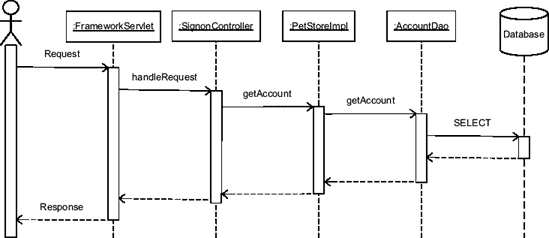

**图 3-5.** JPetStore 登录操作的序列图

在实践中，你并不能随心所欲地轻松添加插桩代码。在图 3-5 的情况下，你有两个问题。第一个问题是 servlet `FrameworkServlet` 是由 Spring 框架提供的类。因此，你不想修改它。第二个问题是数据访问对象 `AccountDao` 只是一个被持久化框架（这里是 iBatis）使用的接口。因此，你也不能向其添加代码。对于第一个问题，你可以创建一个继承自 `FrameworkServlet` 的自定义 servlet，只需添加插桩代码即可。对于第二个问题，为了简单起见，你可以决定对调用持久化框架进行插桩。这应该不成问题，因为数据库本身已经进行了插桩，因此在必要时，你能够确定持久化框架本身的开销。

现在你已经了解了如何决定在哪里添加插桩代码，接下来可以看一个如何在应用程序代码中实现的具体示例。之后，你将研究一个 Oracle 特定的数据库调用插桩。

#### 应用程序代码

如第 1 章所述，每个应用程序都应该进行插桩。换句话说，问题不在于是否应该做，而在于*如何*做。这是架构师在新应用程序开发之初应做出的重要决定。虽然插桩代码通常是利用应用程序其余代码使用的日志功能实现的，但也可以使用其他技术，例如 Java 管理扩展 (JMX)。如果考虑使用日志功能，最有效的方式是使用现成的日志框架。由于编写一个快速灵活的日志框架并不容易，这实际上可以节省大量的开发时间。事实上，日志记录的主要缺点在于，如果实现不当，它会减慢应用程序的速度。为避免这种情况，开发者不仅要注意限制日志的详细程度，还应使用高效的日志框架来实现它。

Apache 日志服务项目³提供了非常好的日志框架示例。该项目的核心是 log4j，一个用 Java 编写的日志框架。由于其成功，并已被移植到其他编程语言，如 C++、.NET、Perl、PHP 和 PL/SQL，我将在此提供一个基于 log4j 和 Java 的示例。事实上，正如本章描述的其他工具一样，目的是为你提供示例，说明也可用于其他环境的技术，而不是仅提供关于某一个特定工具的全面深入信息。

例如，如果你想对图 3-5 中描述的 servlet `SignonController` 的 `handleRequest` 方法的响应时间进行插桩，你可以编写如下代码：

```
public ModelAndView handleRequest(HttpServletRequest request,
                                  HttpServletResponse response) throws Exception
{
    if (logger == null)
    {
        logger = Log4jLoggingHelper.getLog4jServerLogger();
    }

    if (logger.isInfoEnabled())
    {
        long beginTimeMillis = System.currentTimeMillis();
    }

    ModelAndView ret = null;
    String username = request.getParameter("username");

    // 此处是处理请求的代码...

    if (logger.isInfoEnabled())
    {
        long endTimeMillis = System.currentTimeMillis();
        logger.info("Signon(" + username + ") response time " +
                    (endTimeMillis-beginTimeMillis) + " ms");
    }

    return ret;
}
```

简而言之，插桩代码在方法开始时获取一个时间戳，在方法结束时再获取一个时间戳，然后记录一条提供用户名和执行耗时的消息。此外，它还检查记录器是否已初始化。请注意，`Log4jLoggingHelper` 类是 BEA WebLogic 特有的，而非 log4j 的一部分。这是在测试中使用的。

即使代码片段很直接，也有一些要点需要注意：


*   开始测量时间，例如在本例中通过调用 `currentTimeMillis` 方法在被检测方法的最开始处执行。你永远不知道什么情况会导致即使是简单的初始化代码也会消耗时间。
*   日志记录框架应支持不同级别的消息。以 log4j 为例，它提供了以下级别（按详细程度递增排序）：致命（fatal）、错误（error）、警告（warning）、信息（information）和调试（debug）。你可以通过调用以下方法之一来设置级别：`fatal`、`error`、`warn`、`info` 和 `debug`。换句话说，每个级别都有其对应的方法。通过将消息放在不同的级别，你可以通过启用或禁用特定级别来明确选择日志记录的详细程度。如果你只想在调查性能问题时启用检测，这会很有用。
*   即使日志工具知道启用了哪些级别的日志记录，如果特定级别的日志未启用，最好也不要调用日志记录方法（例如 `info`）。通常，通过调用像 `isInfoEnabled` 这样的方法来检查特定级别的日志是否启用，然后仅在必要时调用日志记录方法，速度会快得多。这可能会带来巨大的差异。例如，在我的测试服务器上，调用 `isInfoEnabled` 大约需要 10 纳秒，而如前面代码片段所示调用 `info` 并提供参数大约需要 350 纳秒（我使用 `LoggingPerf.java` 类来测量这些统计数据）。另一种减少检测开销的技术是在编译时移除日志代码。然而，这不是首选技术，因为在需要动态重新编译代码的情况下通常不可能实现。此外，正如你刚才看到的，一行不生成任何消息的检测代码的开销确实非常小。
*   在此示例中，生成的消息类似于 `Signon(JPS1907) response time 24 ms`。这对人类来说是好的，但如果你计划用另一个程序解析该消息以检查服务级别协议，那么更结构化的形式（例如 XML）会更合适。

## 数据库调用

本节描述如何正确地对数据库调用进行检测，以便向数据库引擎提供关于它们将被执行的应用程序上下文的信息。请注意，这种类型的检测与你上一节看到的非常不同。事实上，数据库调用不仅应该像应用程序的任何其他部分一样被检测，而且数据库本身已经能够生成关于它执行的数据库调用的详细信息。你将在本章后面看到更多相关内容。此处描述的检测类型的目的是向数据库提供有关使用它的用户或应用程序的信息。这是必要的，因为数据库通常很少（甚至没有）关于应用程序代码、会话和最终用户之间关系的信息。考虑以下常见情况：

*   数据库不知道应用程序代码的哪个部分正在通过会话执行 SQL 语句。例如，数据库无法确定哪个模块、类或报告正通过给定会话运行特定的 SQL 语句。
*   当应用程序通过使用技术用户打开的连接池连接到数据库，并且未使用代理用户时，最终用户身份验证通常由应用程序本身执行。因此，数据库不知道哪个最终用户正在使用哪个会话。

出于这些原因，数据库引擎提供了将以下属性动态关联到数据库会话的机会：

*客户端标识符*：

这是一个长度为 64 个字符的字符串，用于标识客户端，尽管不是明确无误的。

*客户端信息*：

这是一个长度为 64 个字符的字符串，用于描述客户端。

*模块名称*：

这是一个长度为 48 个字符的字符串，用于描述当前使用会话的模块。

*操作名称*：

这是一个长度为 32 个字符的字符串，用于描述正在处理的操作。

从 Oracle Database 10*g* 开始，对于通过数据库链接打开的会话，只有客户端标识符属性会自动传播到远程会话。因此，在 Oracle9*i* 中以及对于 Oracle Database 10*g* 中的其他属性，必须显式设置它们。

它们的值通过视图 `v$session` 和上下文 `userenv`（仅模块名称和操作名称自 Oracle Database 10*g* 起）对外暴露。请注意，其他显示 SQL 语句的视图（例如 `v$sql`）也包含 `module` 和 `action` 列。有一点需要注意：属性与特定会话相关联，但给定的 SQL 语句可以在具有不同模块名称或操作名称的会话之间共享。动态性能视图显示的值是在首次解析该 SQL 语句的会话中，在解析时设置的。如果不小心，这可能会产生误导。

既然你已经了解了可用的属性，让我们看看如何设置这些值。第一种方法，PL/SQL，是唯一不依赖于用于连接数据库的接口的方法。因此，它可以在大多数情况下使用。接下来的三种——OCI、JDBC 和 ODP.NET——只能与特定接口一起使用。使用这些接口设置属性的主要优点是，值被添加到下一个数据库调用中，而不是产生额外的往返通信（这正是调用 PL/SQL 所做的）。因此，使用它们设置属性的开销可以忽略不计。

### PL/SQL

要设置客户端标识符，你需要使用包 `dbms_session` 中的过程 `set_identifier`。在某些情况下，例如当客户端标识符与全局上下文和连接池一起使用时，可能需要清除与给定会话关联的值。如果是这种情况，你可以使用过程 `clear_identifier`。


要设置客户端信息、模块名称和操作名称，你需要使用包 `dbms_application_info` 中的过程 `set_client_info`、`set_module` 和 `set_action`。为简便起见，过程 `set_module` 不仅接受模块名称，也接受操作名称。

以下示例（摘自脚本 `session_info.sql` 生成的输出）展示了如何设置这四种属性，以及如何通过上下文 `userenv` 和视图 `v$session` 查询其内容：

```
SQL> BEGIN
  2    dbms_session.set_identifier(client_id=>'helicon.antognini.ch');
  3    dbms_application_info.set_client_info(client_info=>'Linux x86_64');
  4    dbms_application_info.set_module(module_name=>'session_info.sql',
  5                                     action_name=>'test session information');
  6  END;
  7  /

SQL> SELECT sys_context('userenv','client_identifier') AS client_identifier,
  2         sys_context('userenv','client_info') AS client_info,
  3         sys_context('userenv','module') AS module_name,
  4         sys_context('userenv','action') AS action_name
  5  FROM dual;

CLIENT_IDENTIFIER      CLIENT_INFO  MODULE_NAME       ACTION_NAME
--------------------- ------------- ----------------- --------------
---------
helicon.antognini.ch  Linux x86_64  session_info.sql   test session information

SQL> SELECT client_identifier,
  2         client_info,
  3         module AS module_name,
  4         action AS action_name
  5  FROM v$session
  6  WHERE sid = sys_context('userenv','sid');

CLIENT_IDENTIFIER     CLIENT_INFO      MODULE_NAME       ACTION_NAME
--------------------- ------------- ----------------- -------------------------
helicon.antognini.ch  Linux x86_64   session_info.sql   test session information
```

### OCI

要设置属性，需使用函数 `OCIAttrSet`。第三个参数指定属性值。第五个参数通过以下常量之一指定要设置的属性：

*   `OCI_ATTR_CLIENT_IDENTIFIER`
*   `OCI_ATTR_CLIENT_INFO`
*   `OCI_ATTR_MODULE`
*   `OCI_ATTR_ACTION`

请注意，除 `OCI_ATTR_CLIENT_IDENTIFIER` 外，这些属性仅从 Oracle Database 10g 起可用。

以下代码片段展示了如何调用函数 `OCIAttrSet` 来设置属性客户端标识符。C 程序 `session_attributes.c` 提供了一个完整示例。

```
text *client_id = "helicon.antognini.ch";
OCIAttrSet(ses,                        // 会话句柄
           OCI_HTYPE_SESSION,          // 正在修改的句柄类型
           client_id,                  // 属性值
           strlen(client_id),          // 属性值的大小
           OCI_ATTR_CLIENT_IDENTIFIER, // 正在设置的属性
           err);                       // 错误句柄
```

### JDBC

要设置客户端标识符、模块名称和操作名称，需使用接口 `OracleConnection` 提供的方法 `setEndToEndMetrics`。不支持设置客户端信息属性。通过一个字符串数组将一个或多个属性传递给该方法。数组中的位置（由以下常量定义）决定了设置哪个属性：

*   `END_TO_END_CLIENTID_INDEX`
*   `END_TO_END_MODULE_INDEX`
*   `END_TO_END_ACTION_INDEX`

以下代码片段展示了如何定义包含属性的数组以及如何调用方法 `setEndToEndMetrics`。Java 类 `SessionAttributes.java` 提供了一个完整示例。

```
metrics = new String[OracleConnection.END_TO_END_STATE_INDEX_MAX];
metrics[OracleConnection.END_TO_END_CLIENTID_INDEX] = "helicon.antognini.ch";
metrics[OracleConnection.END_TO_END_MODULE_INDEX] = "SessionAttributes.java";
metrics[OracleConnection.END_TO_END_ACTION_INDEX] = "test session information";
((OracleConnection)connection).setEndToEndMetrics(metrics, (short)0);
```

请注意，方法 `setEndToEndMetrics` 仅从 Oracle Database 10g 起在 JDBC 驱动中可用，不能用于 Oracle9i 数据库。在 Oracle9i 中，你可以使用方法 `setClientIdentifier` 设置客户端标识符，尽管此方法在 Oracle Database 10g 中因引入方法 `setEndToEndMetrics` 而已被弃用。

### ODP.NET

要设置客户端标识符，需使用类 `OracleConnection` 的属性 `ClientId`。对于所有其他属性，没有可用的属性。然而，ODP.NET 会自动将模块名称设置为正在执行的程序集的名称。当调用方法 `Close` 时，`ClientId` 会被设置为 `null`，以防止池化连接接管 `ClientId` 设置。请注意，此属性仅从 Oracle Database 10g Release 2 起可用。

以下代码片段展示了如何设置属性 `ClientId`。C# 类 `SessionAttributes.cs` 提供了一个完整示例。

```
connection.ClientId = "helicon.antognini.ch";
```

## 分析应用程序代码

一个优秀的开发环境应该提供集成的性能分析器。大多数环境确实如此。主要问题并非所有性能分析器都能适用于所有情况。要么它们不支持软件栈中的所有组件，要么就是它们根本不支持所需的数据收集模式。因此，在实践中可能会用到与开发环境非集成的性能分析器。这在你处理的并非客户端/服务器应用程序时尤其如此。

以下是性能分析器应具备的关键功能：

*   支持分布式应用程序的能力，例如运行在不同服务器上的 J2EE 组件。请注意，这并不意味着它应支持端到端性能分析。它仅意味着该工具有能力独立于代码执行位置来启用性能分析。
*   能够执行调用级别和代码行级别的性能分析。前者用于简明性能分析，后者用于详细性能分析。
*   能够有选择地为应用程序代码的某部分或仅针对特定请求启用或禁用性能分析器。这对于代码行级别的性能分析尤为重要。

最后两点的主要目的是尽可能避免与代码行级别性能分析器相关的高开销。实际上，正如前面“分析路线图”部分所述，只有当插桩或调用级别性能分析定位到代码的特定部分时，才应使用代码行级别的性能分析。当性能分析直接在资源已经紧张的生产系统上执行时，这一点尤其重要。

在接下来的两节中，你将了解两款满足前述要求的产品。第一款是调用级别的性能分析器，在某种程度上支持端到端性能分析。第二款是用于为代码特定部分收集更详细信息的性能分析器。请记住，工具并非核心，技术才是。这里介绍它们只是为了让你了解此类工具能为你做什么。如果在实际场景中遇到其他工具，这也不是问题。原理是相通的。为了演示这一点，我们将再次使用示例应用程序 JPetStore。


#### 简要性能剖析

本节简要介绍的分析器是 Quest Software 的 `PerformaSure`，它是一款用于分析分布式环境中事务的 `J2EE` 性能诊断工具。它提供了一个端到端、以事务为中心的性能视图，展现了终端用户所体验到的情况。即使它只对 Java 堆栈提供完整细节，但它允许分解处理该请求的所有组件的请求响应时间。`PerformaSure` 非常易于使用，并且广泛支持最重要的操作系统、Web 服务器和应用服务器。

在此特别提及 `PerformaSure`，仅仅是因为我个人在使用它为客户分析性能问题时有过积极的体验。市场上类似的工具（仅举几例）包括 `Optimizeit Enterprise Suite` (Borland)、`Vantage Analyzer` (Compuware Corporation)、`dynaTrace Diagnostics` (dynaTrace software)、`Grid Control` (Oracle Corporation) 以及 `i³` (Symantec Corporation)。

### PerformaSure 组件

`PerformaSure` 有三个主要组件：代理（agents）、`Nexus` 和 `Workstation`。

代理收集性能数据并将其发送到 `Nexus`。由于收集性能剖析信息依赖于被监控的组件，因此提供了三种不同的代理：

*   一个`系统代理`收集有关操作系统的性能数据，例如 CPU、内存、磁盘和网络的利用率。每台机器部署一个。
*   一个`Web 服务器代理`收集有关 Web 服务器的性能数据。例如，它收集被请求的页面，以及每个页面的响应时间和点击次数。每个 Web 服务器部署一个。
*   一个`应用服务器代理`收集有关应用服务器的详细性能数据，例如活动会话数、每个 servlet 的响应时间和调用速率、执行的 SQL 语句以及 Java 虚拟机的内存使用情况。每个应用服务器部署一个。

每种类型的代理都使用供应商提供的 API 来收集有关被监控组件的性能数据。此外，`应用服务器代理`还使用字节码检测来收集调用级别的性能数据。

### 字节码检测

```
在编译 Java 代码的大部分时间里，并不会生成本地机器代码。换句话说，编译后没有可执行文件可用。相反，会生成字节码，这些字节码必须由 Java 虚拟机进行解释。这正是 Java 应用程序可移植的原因。

字节码检测的目标是将代码注入到已编译的 Java 应用程序中。例如，如果你想了解执行一个特定方法需要多长时间，从概念上讲，原始方法会被重命名，并在它的位置注入一个包装器，该包装器会调用原始方法并包含检测代码。
```

`Nexus` 是 `PerformaSure` 的核心组件。在收集性能剖析信息时，它不仅存储从代理接收的性能数据，更重要的是，它为每个请求重建端到端的执行路径。收集完成后，`Workstation` 将 `Nexus` 用作分析引擎。

`Workstation` 是 `PerformaSure` 的展示工具。它不仅用于管理和分析收集到的数据，还用于启动和停止数据收集以及管理用户。为了进行分析，它提供了不同的浏览器。

图 3-6 展示了在这些不同组件在我的测试环境中是如何部署的。在三个负载测试客户端和服务器上，各有一个`系统代理`（S）。在 Web 服务器和应用服务器上，分别有一个`Web 服务器代理`（W）和一个`应用服务器代理`（A）。`Nexus` 和 `Workstation` 安装在一台单独的机器上。为了用真实负载对应用程序进行压力测试，还安装了一个名为 `Grinder` 的负载测试工具。

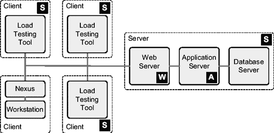


**图 3-6.** *PerformaSure 在测试基础设施上的部署*

`PerformaSure` 不是一款监控工具。你无法用它直接检查系统的负载。相反，负载必须在一段时间内被记录下来，当记录完成后，记录的信息会通过 `Workstation` 进行分析。记录和分析这两个阶段将在接下来的两节中进一步讨论。

## THE GRINDER

`The Grinder` 是一个 Java 负载测试框架，它能够（以及其他功能）模拟网络浏览器。通过一个图形化控制台，可以协调分布在多台机器上的多个工作进程。为了生成负载，每个工作进程在一个或多个线程中执行 `Jython` 测试脚本。对于此处使用的模拟，如图 3-6 所示，在三台机器上启动了工作进程。在每台机器上，启动了 10 个工作进程，每个进程执行 10 个线程。基本上，通过这种配置，模拟了 300 个并发用户在使用 `JPetStore`。每台机器 100 个用户可能看起来是一个非常高的数字，因此客户端机器应该非常强大。实际上，一个典型的网页用户不仅在客户端消耗的 CPU 时间很少，而且其网络带宽也是有限的。

用于负载测试的 `Jython` 测试脚本可以通过框架同样提供的 `TCP Proxy` 来生成。使用它，可以录制真实用户执行的请求，并将其作为测试脚本提供。除了请求本身，测试脚本还会重现请求之间的睡眠间隔并处理诸如 Cookie 之类的会话信息。当然，你可以修改通过 `TCP Proxy` 生成的测试脚本以更好地模拟真实负载。例如，我的测试脚本是使用单个账户录制的，但我的 `JPetStore` 数据库包含 100,000 个账户。为了解决这个问题，我修改了测试脚本，让每个线程随机选择使用哪个账户来执行 `登录` 操作。

`The Grinder` 基于 `BSD 风格` 的开源许可证提供。更多信息，请参阅 [`http://grinder.sourceforge.net`](http://grinder.sourceforge.net)。

### 录制会话

根据 `PerformaSure` 的使用位置和所需信息量，你可以配置它记录或多或少的的数据。这将直接影响数据收集相关的开销。例如，如果你正在生产系统上开始一项新的调查，那么从收集相对较少的信息开始是有意义的，并且除非你确切知道要查找什么，否则只收集关于选定数量的请求的信息。请记住，正如第 1 章所讨论的，你需要知道你正在调查的问题是什么。然后，基于此初步分析，你可以决定是否有必要为系统的全部或仅部分收集更深入的信息。

使用 `PerformaSure`，你可以通过以下技术来确定收集的信息量：

*   一个录制级别指定了哪些应用类被插桩。提供了两个级别：`组件详细信息`（默认）和 `完整详细信息`。使用 `组件详细信息` 时，只有预定义的核心类集合被插桩。使用 `完整详细信息` 时，所有类都被插桩。
*   除了录制级别，还可以明确地将特定类或包包含在插桩中或从插桩中排除。
*   当进入系统的请求数量非常大或录制时间间隔很长时，记录每一个请求就不值得了。在这种情况下，可以对进入系统的请求进行采样。
*   可以启用 `代理` 和 `Nexus` 之间的过滤，以明确包含或排除特定请求。这种过滤器通过对请求的 URL 应用正则表达式来实现。

除了减少收集的信息量之外，`Nexus` 还会将请求聚合到时间片中。一个时间片的长度可以在 1 秒到 30 分钟之间配置。最好选择一个能提供几百个时间片的长度。例如，如果录制持续几分钟，1-10 秒的范围可能就合适。另一方面，如果录制持续一小时，30-60 秒的范围可能更合适。

对于下一节处理的会话录制，我使用了一秒的时间片（录制持续了五分钟），并选择了 `组件详细信息` 级别。注意，我没有为类或请求定义任何形式的过滤。

### 分析会话

分析应从检查你所调查的操作的响应时间开始。如果你没有专注于特定的请求（这并不好），你可以看看平均耗时更长的请求。例如，图 3-7 显示了在会话开始附近 50 秒内执行的请求。对于每个请求，从左到右在图 3-7 中，显示了 URL、调用次数、平均响应时间、最大响应时间和所有调用的总响应时间。在这第一个概览中，有趣的是注意平均响应时间和总响应时间的图形化表示。

处理涉及的两个层使用了两种不同的颜色（此处显示为两种灰度）：应用层和数据库层。通过将鼠标移到该图形表示上，你可以获得在两层中花费时间的详细信息。对于最慢的请求（`登录` 操作），平均而言，781 毫秒中的 91.3% 由应用层花费，8.7% 由数据库层花费。

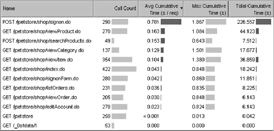

**图 3-7.** *所有请求的响应时间概览*

如果你将图 3-7 提供的响应时间与表 1-1 中描述的目标进行比较，你会发现除了 `登录` 外，所有操作都达到了要求的性能指标。在这种情况下，分析应该只聚焦于这个特定操作的响应时间。这正是图 3-8 所展示的：对于每个时间片（在此例中是每秒钟），一个堆叠条形图显示了在该特定时间段内完成的所有请求中，处理该特定操作平均花费了多少时间。此图使用了与图 3-7 相同的颜色来分解各层之间的响应时间。例如，对于（通过*滑块*）选定的时间片，响应时间为 819 毫秒，其中 86.5% 在应用层，13.5% 在数据库层。

如果需要，你还可以将某个请求的响应时间与录制期间收集的众多指标之一关联起来。图 3-9 显示了 `登录` 操作的响应时间与系统处理的总请求数、数据库执行的 SQL 语句数以及服务器 CPU 负载的对比，所有这些都是针对同一个时间段。

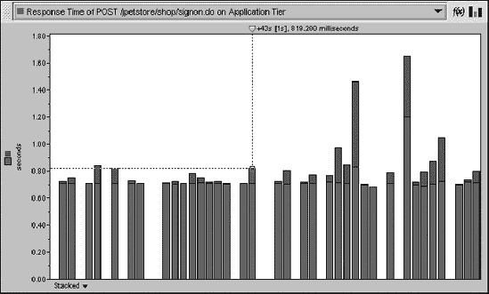

**图 3-8.** *登录操作的响应时间*

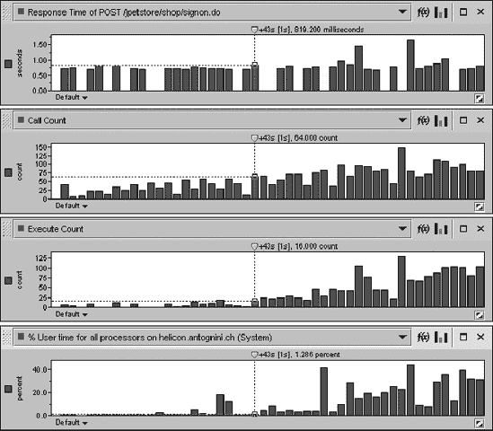

**图 3-9.** *登录操作的响应时间与其他指标的关联*


在实践中，与获取特定请求执行的详细信息相比，这些相关性是次要的。为此，也可以查看在处理请求或时间片期间执行了哪些操作。这被称为**请求树**。图 3-10 显示了动作“登录”的请求树。树的根节点（在此情况下是一个 HTTP 请求，称为入口点）位于左侧。其他节点要么是类，要么是处理过程中执行的 SQL 语句。请注意，对于每个类或 SQL 语句，你都可以看到已执行的方法。你还可以看到该请求是由一个 servlet 的 `doPost` 方法处理的，该方法又使用一个数据库连接来执行一次查询。在此情况下，颜色也很重要。它们显示操作是从哪个层级执行的，并被用来突出显示哪些操作主要对响应时间负责。只需看一眼请求树，就足以知道应用程序的哪个部分正在拖慢处理速度。

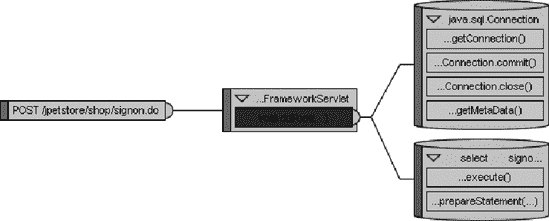

**图 3-10.** 动作“登录”的请求树

通过将鼠标悬停在请求上，可以获取每个操作的详细信息。图 3-11 显示了 `doPost` 方法和 SQL 语句的详细信息。对于方法，会提供每次请求的响应时间和执行次数。对于 SQL 语句，会提供 SQL 语句本身的文本、响应时间和每次请求的执行次数。在请求树中，还可以通过查看 `prepareStatement` 和 `execute` 方法的执行次数，来显示一个 SQL 语句被解析和执行了多少次。这非常有用，因为经常能看到特定 SQL 语句被不必要地反复解析或执行的情况。

总之，检查 PerformaSure 提供的信息（图 3-7），你会发现，平均每次“登录”动作的请求耗时 781 毫秒。从图 3-11 来看，其中最大的部分由 `doPost` 方法占用：774 毫秒。其余时间花在了其他操作上。例如，图 3-11 中显示的 SQL 语句平均耗时 3 毫秒。由于瓶颈明确位于应用层，使用路线图（图 3-4）作为指导，可以看到需要在代码行级别对应用进行详细的分析。这将在下一节中介绍。

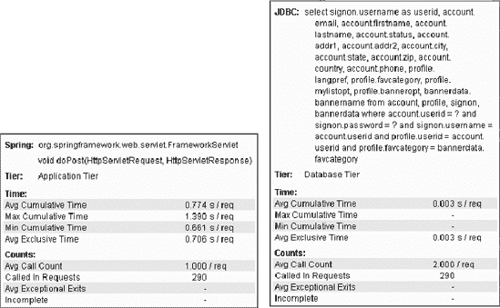

**图 3-11.** 动作 `doPost` 及动作“登录”期间执行的一个 SQL 语句的详细信息

### 详细分析

遗憾的是，PerformaSure 无法帮助你进行详细分析。事实上，它不支持代码行级别的分析。你需要另一个工具。Quest Software 为此推荐了 JProbe，它包含用于分析代码、分析内存分配和代码覆盖率的 Java 工具。请注意，PerformaSure 和 JProbe 只有轻微的集成。

接下来的几节将简要介绍构成 JProbe 的组件，以及如何记录一个会话并分析收集到的信息。

### JProbe 组件

JProbe 有两个主要组件：分析引擎和控制台。分析引擎运行在应用的 Java 虚拟机内部，它通过 Java 虚拟机工具接口（JVMTI）⁴ 收集分析数据，并将其发送到控制台。除了提供启用和禁用记录的功能外，你还可以使用 JProbe 控制台来分析收集到的分析数据。如图 3-12 所示，为了支持分布式环境，JProbe 将数据收集层和呈现层分离。

请注意，为了充分利用 JVMPI，Java 代码应编译时包含完整的调试信息。

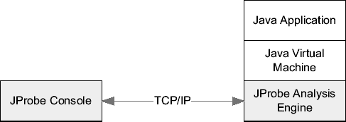

**图 3-12.** JProbe 组件：分析引擎和控制台

### 记录会话

使用 JProbe 时，你希望收集应用程序一小部分的详细信息。为此，通常不需要用真实负载来施压应用程序。更好的做法是手动执行要分析的动作一次或几次。在这个案例中，动作“登录”在记录处于活动状态时只执行了一次。

由于在上一节中你已经进行了简要的分析，并且已经部分识别了性能问题。你现在可以将分析限制在图 3-13 所示的类：

*   PerformaSure 识别出的类的所有方法：`FrameworkServlet`。注意，这个类是 Spring 框架的一部分。因此，只应进行方法级别的分析。
*   包 `org.springframework.samples.jpetstore` 中的所有类，这是应用程序代码。对于这部分，将进行代码行级别的分析。

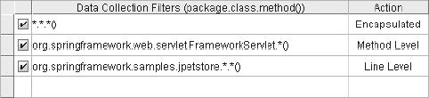

**图 3-13.** JProbe 允许选择你需要分析数据的类和方法。

记住，限制分析范围对于避免不必要的开销非常重要，尤其是在处理代码行级别的分析和 CPU 密集型操作时。

### 分析会话

会话的分析从检查调用图开始，如图 3-14 所示。基本上，它是图 3-10 更为详细的表示。利用 JProbe 控台的缩放功能，还可以获得更易读的调用图。和在 PerformaSure 中一样，颜色扮演着重要角色，突出了最耗时的操作。这样，即使是大型调用图也可以被有效处理。

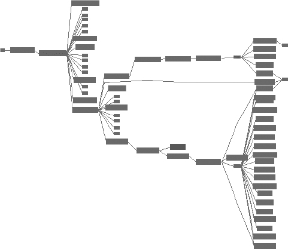

**图 3-14.** 动作“登录”的整体调用图

为了进一步简化分析，一个称为“仅显示焦点路径”的功能可以自动修剪所有与最耗时调用没有直接关系的调用。将其应用于整体调用图（图 3-14），你会得到结果调用图和相关统计数据（图 3-15）。可以提取以下信息：


## 方法调用链分析

*   方法 `FrameworkServlet.doPost` 接收请求，处理时间约为 0 毫秒。
*   方法 `FrameworkServlet.processRequest` 从方法 `FrameworkServlet.doPost` 调用，处理时间约为 2 毫秒，约占总响应时间的 0.3%。
*   方法 `SignonController.handleRequest` 从方法 `FrameworkServlet.processRequest` 调用，处理时间约为 0 毫秒。
*   方法 `PetStoreFacade.getAccount` 从方法 `SignonController.handleRequest` 调用，处理时间约为 1 毫秒，约占总响应时间的 0.1%。
*   方法 `PetStoreImpl.getAccount` 从方法 `PetStoreFacade.getAccount` 调用，处理时间约为 0 毫秒。
*   方法 `Thread.sleep` 从方法 `PetStoreImpl.getAccount` 调用，处理时间约为 668 毫秒，约占响应时间的 96.3%。

要定位调用 `sleep` 方法的代码位置，您可以查看方法 `getAccount` 的源代码和行级统计信息，如 图 3-16 所示。

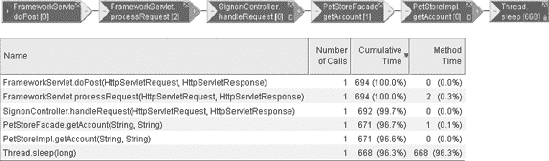

`图 3-15.` 仅关键路径的调用图及相关统计

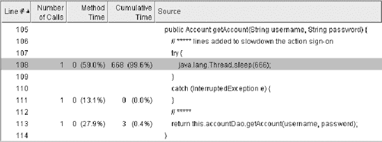

`图 3-16.` 方法 `getAccount` 的行级统计

在这个案例中，我在原始的 JPetStore 应用程序中添加了对 `Thread.sleep` 的特定调用，以减慢登录操作的速度。请注意，这是一个虚构的例子。在真实案例中，性能分析器会指出，例如，由于循环而反复执行的代码部分、访问同步点的暂停，或者耗时较长的调用。但值得注意的是，在我们这个虚构的例子中，能够快速找到不仅是最慢的操作，而且是导致此行为的代码行。

## 追踪数据库调用

基于我们在 图 3-4 中描述的路线图，如果插桩或简明的性能分析表明瓶颈位于数据库中，则有必要更仔细地审视应用程序与数据库之间的交互。Oracle 数据库引擎是一个高度可监测的软件，得益于一个称为 *SQL 跟踪* 的功能，它能够提供详细的跟踪文件，其中不仅包含已执行的 SQL 语句列表，还包含有关其处理的深入性能数据。

图 3-17 展示了追踪数据库调用的基本阶段。接下来的章节在解释 SQL 跟踪是什么之后，将详细讨论每个阶段。

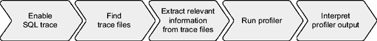

`图 3-17.` 追踪数据库调用的基本阶段

### SQL 跟踪

如 第 2 章 所述，为了处理 SQL 语句，数据库引擎（具体来说是 SQL 引擎）会执行数据库调用（解析、执行、获取）。对于每个数据库调用，如 图 3-18 所总结的，SQL 引擎要么

*   通过使用 CPU 自行进行一些处理；
*   利用其他资源（例如磁盘）；或者
*   必须通过一个同步点，该点是保证数据库引擎多用户能力所必需的（例如，一个门锁）。

SQL 跟踪的目的有两个：首先，提供信息以将响应时间分解为服务时间和等待时间；其次，提供有关所用资源和同步点的详细信息。所有这些关于 SQL 引擎与其他组件之间每次交互的信息都被写入一个跟踪文件。请注意，在 图 3-18 中，CPU、资源 X 和同步点 Y 的归属是人为设定的。这样做的原因是为了展示每次调用都可能以不同的方式使用数据库引擎。

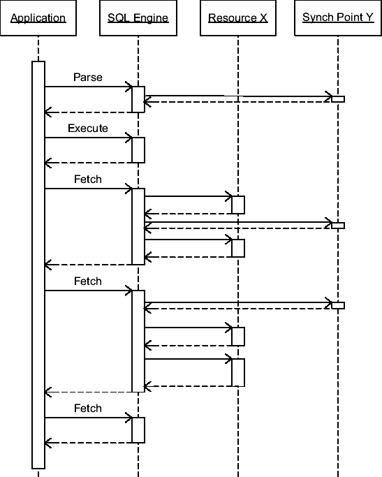

`图 3-18.` 描述 SQL 引擎与其他组件交互的序列图

尽管本章稍后将更详细地介绍，但让我们简要看一下 SQL 跟踪提供的信息类型示例，以及可以从中提取的信息（在本例中通过 TKPROF 工具）。这包括 SQL 语句的文本、一些执行统计信息、处理过程中发生的等待，以及解析阶段的信息，如生成的执行计划。请注意，此类信息是针对应用程序执行的每个 SQL 语句，以及递归地由数据库引擎本身执行的语句提供的。

```sql
SELECT CUST_ID, EXTRACT(YEAR FROM TIME_ID), SUM(AMOUNT_SOLD)
FROM SH.SALES
WHERE CHANNEL_ID = :B1
GROUP BY CUST_ID, EXTRACT(YEAR FROM TIME_ID)
call     count       cpu    elapsed       disk      query    current        rows
------- ------  -------- ---------- ---------- ---------- ----------  ----------
Parse        1      0.00       0.00          0          0          0           0
Execute      1      0.00       0.00          0          0          0           0
Fetch      164      1.12       1.90       2588       1720          0       16348
------- ------  -------- ---------- ---------- ---------- ----------  ----------
total      166      1.13       1.90       2588       1720          0       16348

Misses in library cache during parse: 0
Optimizer mode: ALL_ROWS
Parsing user id: 28 (SH) (recursive depth: 1)

Rows   Row Source Operation
------ ---------------------------------------------------
16348 HASH GROUP BY
540328 PARTITION RANGE ALL PARTITION: 1 28
540328 TABLE ACCESS FULL SALES PARTITION: 1 28

Elapsed times include waiting on following events:
   Event waited on                             Times  Max. Wait  Total Waited
   ----------------------------------------   Waited  ----------  ------------
   db file sequential read                        30       0.01          0.07
   db file scattered read                        225       0.02          0.64
   direct path write temp                        941       0.00          0.00
   direct path read temp                         941       0.01          0.05
```

正如我所说，前面的示例是由一个名为 `TKPROF` 的工具生成的。它并不是 SQL 跟踪的输出。实际上，SQL 跟踪输出的是存储有关组件之间交互的原始信息的文本文件。以下是与前面示例相关的跟踪文件摘录。通常，对于每次调用或等待，跟踪文件中至少有一行。

