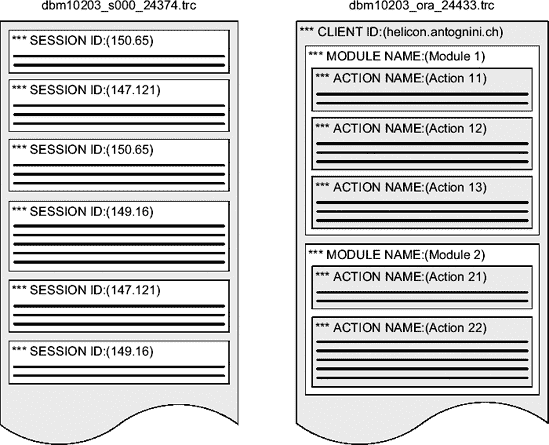

# Oracle SQL 跟踪的启用与禁用

## 客户端级别

视图 `dba_enabled_traces` 显示了为哪个客户端标识符启用了 SQL 跟踪，以及通过过程 `client_id_trace_enable` 启用它时使用的参数。例如，在通过之前的 PL/SQL 调用启用 SQL 跟踪后，会得到以下信息：

```sql
SQL> SELECT primary_id AS client_id, waits, binds
  2  FROM dba_enabled_traces
  3  WHERE trace_type = 'CLIENT_ID';

CLIENT_ID             WAITS BINDS
--------------------- ----- -----
helicon.antognini.ch  TRUE  FALSE
```

以下 PL/SQL 调用会为所有具有指定客户端标识符的会话禁用 SQL 跟踪。参数 `client_id` 没有默认值。

```sql
dbms_monitor.client_id_trace_disable(client_id => 'helicon.antognini.ch')
```

## 组件级别

要为通过服务名、模块名和操作名指定的组件启用和禁用 SQL 跟踪，包 `dbms_monitor` 分别提供了过程 `serv_mod_act_trace_enable` 和 `serv_mod_act_trace_disable`。为了充分利用这些过程，您必须设置会话属性、模块名和操作名。

以下 PL/SQL 调用在级别 8 为所有使用指定属性的会话启用 SQL 跟踪。唯一没有默认值的参数是第一个：`service_name`。[⁶] 参数 `module_name` 和 `action_name` 的默认值分别是 `any_module` 和 `any_action`。对于两者，`NULL` 都是有效值。如果指定了参数 `action_name`，则也必须指定参数 `module_name`。否则将引发 ORA-13859 错误。参数 `waits` 默认为 `TRUE`，参数 `binds` 默认为 `FALSE`。如果使用 Real Application Clusters，可以通过参数 `instance_name` 将跟踪限制在单个实例上。默认情况下，SQL 跟踪对所有实例启用。请注意，参数 `service_name`、`module_name`、`action_name` 和 `instance_name` 是区分大小写的。

```sql
dbms_monitor.serv_mod_act_trace_enable(service_name   => 'DBM10203.antognini.ch',
                                       module_name   => 'mymodule',
                                       action_name   => 'myaction',
                                       waits         => TRUE,
                                       binds         => FALSE,
                                       instance_name => NULL)
```

与客户端级别的 SQL 跟踪一样，视图 `dba_enabled_traces` 显示了为哪个组件启用了 SQL 跟踪，以及通过过程 `serv_mod_act_trace_enable` 启用它时使用的参数。使用之前的 PL/SQL 调用启用 SQL 跟踪后，您会获得以下信息。请注意，如果在启用 SQL 跟踪时未指定所有三个属性（即服务名、模块名和操作名），则列 `trace_type` 将根据使用的参数设置为 `SERVICE` 或 `SERVICE_MODULE`。

```sql
SQL> SELECT primary_id AS service_name, qualifier_id1 AS module_name,
  2         qualifier_id2 AS action_name, waits, binds
  3  FROM dba_enabled_traces
  4  WHERE trace_type = 'SERVICE_MODULE_ACTION';

SERVICE_NAME           MODULE_NAME   ACTION_NAME WAITS BINDS
---------------------- ------------ ------------ ----- -----
DBM10203.antognini.ch  mymodule     myaction     TRUE  FALSE
```

以下 PL/SQL 调用会禁用所有使用指定会话属性的会话的 SQL 跟踪。所有参数都具有与过程 `serv_mod_act_trace_enable` 相同的默认值和行为。

```sql
dbms_monitor.serv_mod_act_trace_disable(service_name   => 'DBM10203.antognini.ch',
                                        module_name    => 'mymodule',
                                        action_name    => 'myaction',
                                        instance_name  => NULL)
```

## 数据库级别

从 Oracle Database 10*g* Release 2 开始，为了为连接到数据库的所有会话（后台进程创建的会话除外）启用和禁用 SQL 跟踪，包 `dbms_monitor` 分别提供了过程 `database_trace_enable` 和 `database_trace_disable`。

以下 PL/SQL 调用为数据库在级别 12 启用 SQL 跟踪。所有参数都有默认值。参数 `waits` 默认为 `TRUE`，参数 `binds` 默认为 `FALSE`。在 Real Application Clusters 的情况下，通过使用参数 `instance_name`，可以将跟踪限制在单个实例上。如果参数 `instance_name` 设置为 `NULL`（这也是默认值），则 SQL 跟踪对所有实例启用。再次注意，参数 `instance_name` 是区分大小写的。

```sql
dbms_monitor.database_trace_enable(waits =>          TRUE,
                                   binds =>          TRUE,
                                   instance_name =>  NULL)
```

与客户端和组件级别的 SQL 跟踪一样，视图 `dba_enabled_traces` 显示了为哪个实例启用了 SQL 跟踪，以及通过过程 `database_trace_enable` 启用它时使用的参数。

```sql
SQL> SELECT instance_name, waits, binds
  2  FROM dba_enabled_traces
  3  WHERE trace_type = 'DATABASE';

INSTANCE_NAME     WAITS BINDS
----------------- ----- -----
                  TRUE  TRUE
```

以下 PL/SQL 调用为数据库禁用 SQL 跟踪。如果参数 `instance_name` 设置为 `NULL`（这也是默认值），则所有实例的 SQL 跟踪都会被禁用。

```sql
dbms_monitor.database_trace_disable(instance_name => NULL)
```

## 触发 SQL 跟踪

在前面的章节中，您已经看到了启用和禁用 SQL 跟踪的不同方法。在最简单的情况下，您手动在 SQL*Plus 中执行所示的 SQL 语句或 PL/SQL 调用。然而，有时需要自动触发 SQL 跟踪。这里的“自动”意味着必须在某个地方添加代码。

最简单的方法是在数据库级别创建一个登录触发器。为了避免为所有用户启用 SQL 跟踪，我通常建议创建一个角色（在以下示例中名为 `sql_trace`）并仅临时授予用于测试的用户。自然地，也可以为单个模式定义触发器，或执行其他检查，例如基于 `userenv` 上下文。请注意，除了启用 SQL 跟踪外，最好也设置与 SQL 跟踪相关的其他参数（本章后面将详细介绍）。

```sql
CREATE ROLE sql_trace;

CREATE OR REPLACE TRIGGER enable_sql_trace AFTER LOGON ON DATABASE
BEGIN
  IF (dbms_session.is_role_enabled('SQL_TRACE'))
  THEN
    EXECUTE IMMEDIATE 'ALTER SESSION SET timed_statistics = TRUE';
    EXECUTE IMMEDIATE 'ALTER SESSION SET max_dump_file_size = unlimited';
    dbms_monitor.session_trace_enable;
  END IF;
END;
/
```

另一种方法是在应用程序中直接添加一些启用 SQL 跟踪的代码。还需要添加某种参数化来触发该代码。胖客户端应用程序的命令行参数或 Web 应用程序的额外 HTTP 参数就是例子。

## 跟踪文件中的时间信息

动态初始化参数 `timed_statistics` 可以设置为 `TRUE` 或 `FALSE`，它控制跟踪文件中时间信息（如耗时和 CPU 时间）的可用性。如果设置为 `TRUE`，则时间信息会添加到跟踪文件中。如果设置为 `FALSE`，则应该没有这些信息；但是，根据您所使用的端口，它们可能部分可用。`timed_statistics` 的默认值取决于另一个初始化参数：`statistics_level`。如果 `statistics_level` 设置为 `basic`，`timed_statistics` 默认为 `FALSE`。否则，`timed_statistics` 默认为 `TRUE`。


一般来说，如果时间信息不可用，跟踪文件就没什么用。因此，在启用 SQL 跟踪之前，请确保将参数设置为 `TRUE`。例如，您可以通过执行以下 SQL 语句来做到这一点：

`ALTER SESSION SET timed_statistics = TRUE`

## 动态初始化参数

有些初始化参数是静态的，另一些则是动态的。当参数是动态的时，意味着它们可以在不重启实例的情况下更改。在动态初始化参数中，有些只能在会话级别更改，有些只能在系统级别更改，还有一些则可以在会话和系统级别更改。要分别在会话和系统级别更改初始化参数，需使用 SQL 语句 `ALTER SESSION` 和 `ALTER SYSTEM`。在实例级别更改的初始化参数会立即生效，或者仅对修改后创建的会话生效。视图 `v$parameter`，或者更准确地说，其列 `isses_modifiable` 和 `issys_modifiable`，提供了关于初始化参数可在何种情况下被更改的信息。

## 限制跟踪文件的大小

通常，您可能不太关心限制跟踪文件的大小。但如果确实有必要，可以在会话或系统级别设置动态初始化参数 `max_dump_file_size`。一个数值后跟 *K* 或 *M* 后缀，用于以千字节或兆字节为单位指定跟踪文件的最大尺寸。如果不需要限制，可以如下面的 SQL 语句所示，将该参数设置为 `unlimited`：

`ALTER SESSION SET max_dump_file_size = unlimited`

## 查找跟踪文件

跟踪文件由在数据库服务器上运行的数据库引擎服务器进程生成。这意味着它们被写入到数据库服务器可访问的磁盘上。根据生成跟踪文件的进程类型，它们被写入两个不同的目录：

*   专用服务器进程在通过初始化参数 `user_dump_dest` 配置的目录中创建跟踪文件。
*   后台进程在通过初始化参数 `background_dump_dest` 配置的目录中创建跟踪文件。

请注意，以下被认为是后台进程：列在 `v$bgprocess` 中的进程、调度程序进程（D*nnn*）、共享服务器进程（S*nnn*）、并行从属进程（P*nnn*）、作业队列进程（J*nnn*）、高级队列进程（Q*nnn*）、MMON 从属进程（M*nnn*）以及 ASM 相关进程（O*nnn*）。进程类型可在视图 `v$session` 的 `type` 列中找到。

从 Oracle 数据库 11*g* 开始，随着自动诊断资料库的引入，初始化参数 `user_dump_dest` 和 `background_dump_dest` 已被弃用，转而使用初始化参数 `diagnostic_dest`。由于新的初始化参数仅设置基础目录，您可以使用视图 `v$diag_info` 来获取跟踪文件的确切位置。以下查询展示了初始化参数的值与跟踪文件位置之间的差异：

`SQL> SELECT value FROM v$parameter WHERE name = 'diagnostic_dest';`

`VALUE`
`----------------------------------------------------------------------`
`/u00/app/oracle`

`SQL> SELECT value FROM v$diag_info WHERE name = 'Diag Trace';`

`VALUE`
`----------------------------------------------------------------------`
`/u00/app/oracle/diag/rdbms/dbm11106/DBM11106/trace`

跟踪文件本身的名称曾经是版本和平台相关的。然而，自 Oracle9*i* 起，对于最常见的平台，它具有以下结构：

`{实例名}_{进程名}_{进程 ID}.trc`

分解如下：

`实例名`:

这是初始化参数 `instance_name` 的小写形式。请注意，在真正的应用集群环境中，这与初始化参数 `db_name` 不同。它可在视图 `v$instance` 的 `instance_name` 列中找到。

`进程名`:

这是生成跟踪文件的进程名称的小写形式。对于专用服务器进程，使用名称 `ora`。对于共享服务器进程，它可在视图 `v$dispatcher` 或 `v$shared_server` 的 `name` 列中找到。对于并行从属进程，它可在视图 `v$px_process` 的 `server_name` 列中找到。对于大多数其他后台进程，它可在视图 `v$bgprocess` 的 `name` 列中找到。

`进程 ID`:

这是操作系统级别的进程标识符。其值可在视图 `v$process` 的 `spid` 列中找到。

基于这里提供的信息，可以编写一个类似下面的查询，以找出每个用户会话关联的跟踪文件名（您可以在脚本 `map_session_to_tracefile.sql` 中找到此查询）。请注意，在下面的输出中，有一行的服务器类型等于 `NONE`。当通过共享服务器进程连接的会话没有执行 SQL 语句时，就会发生这种情况。因此，它没有与共享服务器进程关联，而是与调度程序服务器进程关联。

```sql
SQL> SELECT s.sid,
  2         s.server,
  3         lower(
  4           CASE
  5             WHEN s.server IN ('DEDICATED','SHARED') THEN
  6               i.instance_name || '_' ||
  7               nvl(pp.server_name, nvl(ss.name, 'ora')) || '_' ||
  8               p.spid || '.trc'
  9             ELSE NULL
10           END
11         ) AS trace_file_name
12  FROM v$instance i,
13       v$session s,
14       v$process p,
15       v$px_process pp,
16       v$shared_server ss
17  WHERE s.paddr = p.addr
18  AND s.sid = pp.sid (+)
19  AND s.paddr = ss.paddr(+)
20  AND s.type = 'USER'
21  ORDER BY s.sid;
```

```
      SID  SERVER    TRACE_FILE_NAME
---------- --------- --------------------------------------
       145 DEDICATED dbm10203_ora_24387.trc
       146 DEDICATED dbm10203_ora_24380.trc
       147 NONE
       149 DEDICATED dbm10203_ora_24260.trc
       150 SHARED dbm10203_s000_24374.trc
```

从 Oracle 数据库 11*g* 开始，对于当前会话，使用视图 `v$diag_info` 会容易得多，如下所示：

`SQL> SELECT value FROM v$diag_info WHERE name = 'Default Trace File';`

```
VALUE
------------------------------------------------------------------------
/u00/app/oracle/diag/rdbms/dbm11106/DBM11106/trace/DBM11106_ora_9429.trc
```

为了更容易找到正确的跟踪文件，也可以使用初始化参数 `tracefile_identifier`。实际上，通过该参数，您可以向跟踪文件名添加最多 255 个字符的自定义标识符。有了它，跟踪文件名结构变为：

`{实例名}_{进程名}_{进程 ID}_{跟踪文件标识符}.trc`

请注意，此方法仅适用于专用服务器进程。同样值得注意的是，每次会话动态更改该参数的值时，都会自动创建一个新的跟踪文件。参数 `tracefile_identifier` 的值可在视图 `v$process` 的 `traceid` 列中找到。不过要小心：这只对设置该参数的同一个会话成立。所有其他会话看到的该值都是 `NULL`。

既然您已经了解了什么是 SQL 跟踪、如何配置、启用和禁用它，以及在哪里找到它生成的跟踪文件，接下来让我们讨论它们的结构以及一些用于分析并利用其内容的工具。

## 跟踪文件是否包含机密信息？


默认情况下，并非所有人都能访问跟踪文件。这是合理的，因为它们可能包含机密信息。实际上，跟踪文件中既会包含可能带有数据（字面值）的 SQL 语句，也会包含绑定变量的值。从根本上说，这意味着存储在数据库中的每一段数据都有可能被写入跟踪文件。

例如，在 Unix/Linux 系统上，跟踪文件属于运行数据库引擎二进制文件的用户和组，默认权限是 `-rw-r-----`。换句话说，只有与运行数据库引擎的用户属于同一个组的用户才能读取这些跟踪文件。

然而，如果某些用户为了完成某项任务已经需要访问数据库中的数据，那么阻止他们访问跟踪文件实在没有充分的理由。事实上，从安全角度来看，跟踪文件仅对那些无法访问数据库的用户才是有用的信息来源。因此，数据库引擎提供了一个名为 `_trace_files_public` 的未公开参数。默认情况下，该参数设置为 `FALSE`。如果设置为 `TRUE`，则跟踪文件将对所有能够访问系统的用户设置为可读。由于该参数不是动态的，更改其值需要重启实例。

例如，在 Unix/Linux 系统上，如果 `_trace_files_public` 设置为 `TRUE`，默认权限将变为 `-rw-r--r--`。这样，所有用户都能读取跟踪文件。

从安全角度来看，只有在访问数据库服务器不受限制的情况下，将参数 `_trace_files_public` 设置为 `TRUE` 才会带来问题。在提供对跟踪文件的简单访问时，通常还会通过 SMB、NFS 或 HTTP 接口共享包含这些文件的目录。无论哪种情况，出于显而易见的原因，应尽可能避免每次需要跟踪文件时都要求 DBA 手动发送。

### 跟踪文件的结构

一个跟踪文件包含有关特定进程执行的数据库调用的信息。实际上，当操作系统级别的进程 ID 被重用时，一个跟踪文件也可能包含来自多个进程的信息。由于一个进程可能用于不同的会话（例如，对于共享服务器或并行从属进程），并且每个会话可能具有不同的会话属性（例如，模块名和操作名），因此一个跟踪文件可以分成几个逻辑部分。图 3-19 提供了一个示例（两个跟踪文件均可与其他本章文件一起下载）。



图 3-19. 跟踪文件可能由几个逻辑部分组成。左侧是一个包含来自三个会话信息的共享服务器跟踪文件。右侧是一个包含来自一个客户端、两个模块和五个动作信息的专用服务器跟踪文件。

图 3-19 中右侧所示跟踪文件的结构可以通过以下 PL/SQL 块生成：

```
BEGIN
  dbms_session.set_identifier(client_id=>'helicon.antognini.ch');
  dbms_application_info.set_module(module_name=>'Module 1',
                                   action_name=>'Action 11');
  -- code module 1, action 11
  dbms_application_info.set_module(module_name=>'Module 1',
                                   action_name=>'Action 12');
  -- code module 1, action 12
  dbms_application_info.set_module(module_name=>'Module 1',
                                   action_name=>'Action 13');
  -- code module 1, action 13
  dbms_application_info.set_module(module_name=>'Module 2',
                                   action_name=>'Action 21');
-- code module 2, action 21
  dbms_application_info.set_module(module_name=>'Module 2',
                                   action_name=>'Action 22');
  -- code module 2, action 22
END;
```

在 图 3-19 中用来标记各部分的、以三个星号（`***`）开头的标签，正是跟踪文件中使用的标签。与跟踪文件的不同之处在于，数据库引擎不仅会为每个部分重复其中一些标签，而且还会添加一个时间戳。下面的跟踪文件片段展示了由上述 PL/SQL 块生成的内容示例：

```
...
*** ACTION NAME:(Action 11) 2007-07-11 10:59:01.582
*** MODULE NAME:(Module 1) 2007-07-11 10:59:01.582
*** CLIENT ID:(helicon.antognini.ch) 2007-07-11 10:59:01.582
...
...
*** ACTION NAME:(Action 12) 2007-07-11 10:59:03.583
*** MODULE NAME:(Module 1) 2007-07-11 10:59:03.583
...
...
*** ACTION NAME:(Action 13) 2007-07-11 10:59:04.585
*** MODULE NAME:(Module 1) 2007-07-11 10:59:04.585
...
...
*** ACTION NAME:(Action 21) 2007-07-11 10:59:05.585
*** MODULE NAME:(Module 2) 2007-07-11 10:59:05.585
...
...
*** ACTION NAME:(Action 22) 2007-07-11 10:59:06.586
*** MODULE NAME:(Module 2) 2007-07-11 10:59:06.586
...
...
```

从 Oracle Database 10*g* 开始，跟踪文件在这方面的格式发生了变化。在之前的版本中，不仅客户端 ID 完全缺失，而且用于模块名和操作名的标签也不同。下面的跟踪文件片段展示了在 Oracle9*i* 及更早版本中，对于相同的 PL/SQL 块，信息是如何提供的：

```
...
APPNAME mod='Module 1' mh=262111370 act='Action 11' ah=810452301
...
...
APPNAME mod='Module 1' mh=262111370 act='Action 12' ah=3880529476
...
...
APPNAME mod='Module 1' mh=262111370 act='Action 13' ah=3117839477
...
...
APPNAME mod='Module 2' mh=2889377500 act='Action 21' ah=3726166056
...
...
APPNAME mod='Module 2' mh=2889377500 act='Action 22' ah=1514258714
...
...
```

您之前看到的逻辑会话标签非常有用，因为借助它们，可以提取与您需求相关的信息。例如，如果您正在调查与特定操作相关的性能问题，您可以隔离出跟踪文件中与其相关的部分。您可以使用下一节介绍的工具 `TRCSESS` 来完成此操作。


### 使用 TRCSESS

您可以使用命令行工具 `TRCSESS`（自 Oracle 数据库 10*g* 起可用），它可根据前面描述的逻辑节区，从一个或多个跟踪文件中提取部分信息。要获取其参数的完整列表，请在不带参数的情况下运行它。

```
trcsess [output=<输出文件名>] [session=<会话 ID>] [clientid=<客户端 ID>]
        [service=<服务名>] [action=<操作名>] [module=<模块名>]
        <跟踪文件名>
```

```
output=<输出文件名> 输出目标，默认为标准输出。
session=<会话 ID> 要跟踪的会话。
会话 ID 是会话索引和会话序列号的组合，例如 8.13。
clientid=<客户端 ID> 要跟踪的客户端 ID。
service=<服务名> 要跟踪的服务。
action=<操作名> 要跟踪的操作。
module=<模块名> 要跟踪的模块。
<trace_file_names> 空格分隔的跟踪文件列表，支持通配符 '*'。
```

如您所见，可以指定会话、客户端 ID、服务名、模块名和操作名作为参数。例如，要从跟踪文件 `dbm10203_ora_24433.trc` 中提取关于 *操作 12* 的信息，并将输出写入名为 `action12.trc` 的新跟踪文件，您可以使用以下命令：

```
trcsess output=action12.trc action="操作 12" dbm10203_ora_24433.trc
```

请记住，参数 `clientid`、`service`、`action` 和 `module` 是**区分大小写**的。此工具也支持早期版本生成的跟踪文件。然而，正如您在前一节所见，问题在于直到 Oracle9*i*，只有会话标识使用了与 Oracle Database 10*g* 及更高版本相同的标签。要解决此问题，您可以使用首选的脚本语言将旧标签转换为新格式。例如，您可以使用某个有用的 Unix 命令行工具来完成此操作。在这种情况下，我个人会选择 `awk`。以下脚本的目的非常简单：如果一行以标签 `APPNAME` 开头，则将该行转换为新格式；否则，输入将直接回显到输出。

```
BEGIN {
   FS = "="
}
/^APPNAME/ {
   module = substr($2,2,index($2,"' mh")-2)
   action = substr($4,2,index($4,"' ah")-2)
   if (action) printf "*** 操作名:(%s) 0\n", action
   if (module) printf "*** 模块名:(%s) 0\n", module
}
!/^APPNAME/ {
   print $0
}
```

这个名为 `trcsess.awk` 的脚本执行起来如下所示：

```
awk -f trcsess.awk m9208_ora_5823.trc > m9208_ora_5823.trc2
```

### 分析器

一旦您确定了正确的跟踪文件，或者可能已经使用 `TRCSESS` 截取了其中一部分，就该分析内容了。为此，您需要使用分析器。它的目的是基于原始跟踪文件的内容生成格式化的输出。Oracle 随数据库和客户端二进制文件分发了这样一个分析器。它的名字是 `TKPROF`（代表*跟踪内核分析器*）。尽管它提供的输出在几种情况下可能有用，但有时对于快速识别性能问题并不够充分。奇怪的是，Oracle 低估了此类工具的重要性，因此自 Oracle7 引入以来，对其改进甚微。不过，现在有许多商业和免费的分析器可用。我自己也开发了一个免费的分析器，名为 `TVD$XTAT`。其他您可能考虑的分析器包括 Hotsos Profiler、itfprof SQL Analyzer 和 `OraSRP`。甚至 Oracle（通过 MetaLink）也提出了另一个分析器，名为 Trace Analyzer。

在接下来的两节中，我将描述其中两种分析器。首先，我将介绍 `TKPROF`。尽管存在不足，它是唯一一个总是可用的分析器。事实上，在并非所有情况下您都允许在数据库服务器上安装另一个分析器或将跟踪文件下载到另一台机器。在这种情况下，它可能很有用。介绍完 `TKPROF` 后，我将描述我自己的分析器。解释基于以下 PL/SQL 块执行期间生成的跟踪文件：

```
DECLARE
   l_channel_id sh.sales.channel_id%TYPE := 3;
BEGIN
   FOR c IN (SELECT cust_id, extract(YEAR FROM time_id), sum(amount_sold)
             FROM sh.sales
             WHERE channel_id = l_channel_id
             GROUP BY cust_id, extract(YEAR FROM time_id))
   LOOP
      NULL;
   END LOOP;
END;
```

##### 使用 TKPROF

`TKPROF` 是一个命令行工具。它的主要目的是接受原始跟踪文件作为输入，并生成格式化的文本文件作为输出。此外，它还能够生成用于将数据加载到数据库中的 SQL 脚本，尽管此功能很少使用。

最简单的分析仅需指定输入和输出文件即可执行。在以下示例中，输入文件是 `DBM11106_ora_6334.trc`，输出文件是 `DBM11106_ora_6334.txt`。即使输出文件的默认扩展名是 `prf`，我个人总是使用 `txt`。在我看来，最好使用对每个人都有意义并且通常能被任何操作系统正确识别的扩展名。

```
tkprof DBM11106_ora_6334.trc DBM11106_ora_6334.txt
```

不带其他参数进行分析仅在处理非常小的跟踪文件时有帮助。在大多数情况下，为了获得更好的输出，您必须指定几个参数。

**TKPROF 参数**

如果您不带参数运行 `TKPROF`，您将获得其参数的完整列表以及每个参数的简短描述：

```
用法: tkprof 跟踪文件 输出文件 [explain= ] [table= ]
              [print= ] [insert= ] [sys= ] [sort= ]
   table=模式名.表名   与 'explain=' 选项一起使用 '模式名.表名'。
   explain=用户/密码    连接到 ORACLE 并执行 EXPLAIN PLAN。
   print=整数    仅列出前 '整数' 个 SQL 语句。
   aggregate=yes|no
   insert=文件名  在 INSERT 语句内列出 SQL 语句和数据。
   sys=no           TKPROF 不列出作为用户 SYS 运行的 SQL 语句。
   record=文件名  记录在跟踪文件中找到的非递归语句。
   waits=yes|no     记录在跟踪文件中找到的任何等待事件的摘要。
   sort=选项      以下排序选项中的零个或多个的组合：
      prscnt  解析被调用的次数
      prscpu  解析占用的 CPU 时间
      prsela  解析用时
      prsdsk  解析期间的磁盘读次数
      prsqry  解析期间一致性读的缓冲区数量
      prscu   解析期间当前读的缓冲区数量
      prsmis  解析期间库缓存未命中的次数
      execnt  执行被调用的次数
      execpu  执行占用的 CPU 时间
      exeela  执行用时
      exedsk  执行期间的磁盘读次数
      exeqry  执行期间一致性读的缓冲区数量
      execu   执行期间当前读的缓冲区数量
      exerow  执行期间处理的行数
      exemis  执行期间库缓存未命中的次数
      fchcnt  提取被调用的次数
      fchcpu  提取占用的 CPU 时间
      fchela  提取用时
      fchdsk  提取期间的磁盘读次数
      fchqry  提取期间一致性读的缓冲区数量
      fchcu   提取期间当前读的缓冲区数量
      fchrow  提取的行数
      userid  解析游标的用户的用户 ID
```

每个参数的功能如下：


*   `explain` 指示 TKPROF 为在跟踪文件中找到的每条 SQL 语句提供执行计划。这是通过执行 SQL 语句 `EXPLAIN PLAN` 来完成的（关于此 SQL 语句的详细信息，请参见第 6 章）。显然，为了执行 SQL 语句，需要连接到数据库。因此，该参数用于指定用户、密码，以及（如果需要）连接字符串。可接受的格式是 `explain=user/password@connect_string` 和 `explain=user/password`。请注意，为了最大化获得正确执行计划的机会，您应该指定一个能够访问相同对象的用户，并确保所有查询优化器初始化参数都设置为与生成跟踪文件时所用相同的值。您还应该警惕被应用程序或登录触发器在运行时更改的初始化参数。不言而喻，如果能使用相同的用户，那就更好了。无论如何，即使满足了所有前述条件，由于 `EXPLAIN PLAN` 生成的执行计划不一定与实际执行计划匹配（原因将在第 6 章中解释），因此**不建议**指定 `explain` 参数。如果指定了无效的用户、密码或连接字符串，跟踪文件将被处理，但不会出现任何交互式错误消息。相反，紧接着输出文件头部之后，会发现类似下面的错误：
    ```
    error connecting to database using: scott/lion
    ORA-01017: invalid username/password; logon denied
    EXPLAIN PLAN option disabled.
    ```
*   `table` 参数仅与 `explain` 参数一起使用。其目的实际上是指定 SQL 语句 `EXPLAIN PLAN` 用来生成执行计划的表。通常可以避免指定它，因为 TKPROF 会在用于分析的模式中自动创建并删除一个名为 `prof$plan_table` 的计划表。无论如何，如果用户无法创建表（例如，因为缺少 `CREATE TABLE` 权限），则必须指定 `table` 参数。例如，要指定必须使用用户 `system` 拥有的表 `plan_table`，则该参数必须设置为 `table=system.plan_table`。执行分析的用户必须对指定表拥有 `SELECT, INSERT` 和 `DELETE` 权限。同样，在这种情况下，错误也只会在输出文件中提供。

`Caution` 在 Oracle Database 10*g* Release 1 中，由于 bug 3451410，TKPROF 无法自动创建计划表。相反，紧接着输出文件头部之后，会发现错误 ORA-00922。此问题在 MetaLink 注意事项 `Tkprof Fails With Error In Create Table Of Explain Plan: Ora-922` (293481.1) 中有描述。

*   `print` 用于限制输出文件中提供的 SQL 语句数量。默认情况下没有限制。只有与 `sort` 参数（稍后描述）一起指定此参数才有意义。例如，若只想获取 10 条 SQL 语句，则必须将参数设置为 `print=10`。
*   `aggregate` 指定 TKPROF 是否分别处理具有相同文本的 SQL 语句。默认情况下，情况并非如此。换句话说，所有属于特定 SQL 语句的信息都会被聚合。请注意，无论跟踪文件中存在多少条 SQL 语句，都会执行此聚合操作。如同任何聚合操作一样，这会导致信息丢失。在这种情况下，一个拥有多个具有不同执行计划的子游标的游标也将被视为单个 SQL 语句处理。尽管默认值在许多情况下是好的，但有时指定 `aggregate=no` 并能够查看单个 SQL 语句会更好。
*   `insert` 指示 TKPROF 生成一个 SQL 脚本，该脚本可用于将所有信息存储到数据库中。SQL 脚本的名称由参数本身指定，如 `insert=load.sql`。
*   `sys` 指定由用户 `sys` 执行的 SQL 语句（例如，在解析操作期间针对数据字典的递归查询）是否写入输出文件。默认值为 `yes`，但大多数时候我更喜欢将其设置为 `no`，以避免输出文件中出现不必要的信息。之所以不必要，是因为您通常无法控制由用户 `sys` 递归执行的 SQL 语句。
*   `record` 指示 TKPROF 生成一个 SQL 脚本，其中包含在跟踪文件中找到的所有非递归语句。SQL 脚本的名称由参数本身指定（例如，`record=replay.sql`）。根据文档，此功能可用于手动重放 SQL 语句。由于不处理绑定变量，这通常是不可行的。
*   `waits` 决定有关等待事件的信息是否添加到输出文件中。默认情况下会添加。就个人而言，我认为没有充分的理由指定 `waits=no`，从而导致输出文件中缺少非常重要的等待事件。
*   `sort` 指定 SQL 语句写入输出文件的顺序。默认情况下，是它们在跟踪文件中出现的顺序。基本上，通过指定提供的选项之一，您可以根据资源利用率（例如，调用次数、CPU 时间和物理读取次数）或响应时间（即，耗时）对输出进行排序。正如您可以从大多数选项（例如，耗时）中看到的，每种数据库调用类型都有一个可用的值：例如，`prsela` 表示解析游标所花费的时间，`exeela` 表示执行游标所花费的时间，`fchela` 表示从游标中获取行所花费的时间。即使您有许多选择和组合，但只有一种排序方式对于调查性能问题真正有用：响应时间。因此，您应该指定 `sort=prsela,exeela,fchela`。当您指定一个逗号分隔的值列表时，TKPROF 会对作为参数传递的选项的值进行求和。即使这些选项彼此不兼容，也会发生这种情况。请注意，当一个跟踪文件包含多个会话并指定了 `aggregate=no` 时，SQL 语句会针对每个会话独立排序。

基于刚刚提供的信息，我个人通常运行 TKPROF 时使用的参数如下例所示：

`tkprof {输入跟踪文件} {输出文件} sys=no sort=prsela,exeela,fchela`

既然您已经了解了如何使用 TKPROF 分析跟踪文件，接下来让我们看一下它生成的输出文件。

**解读 TKPROF 输出**


分析工作通过指定以下参数完成。请注意，这并非您刚才被建议采用的操作方式。此举仅用于展示特定输出结果。需注意，此跟踪文件、输出文件及本章其他相关文件均可下载。

```
tkprof DBM11106_ora_9813.trc DBM11106_ora_9813.txt
       sort=prsela,exeela,fchela print=3 explain=sh/sh aggregate=no
```

输出文件以一个头部信息开头。其中大部分信息是*静态的*，但仍包含有用内容：跟踪文件的名称、用于生成输出文件的 `sort` 参数值，以及标识被跟踪会话的一行信息。最后这项信息仅在指定了 `aggregate=no` 参数时才会提供。请注意，当跟踪文件包含多个会话且指定了 `aggregate=no` 参数时，此头部信息会重复出现，并用作不同会话 SQL 语句之间的分隔符。

```
TKPROF: Release 11.1.0.6.0 - Production on Tue Feb 29 10:37:08 2008

Copyright (c) 1982, 2007, Oracle. All rights reserved.

Trace file: DBM11106_ora_6334.trc
Sort options: prsela exeela fchela
********************************************************************************
count     = number of times OCI procedure was executed
cpu       = cpu time in seconds executing
elapsed   = elapsed time in seconds executing
disk      = number of physical reads of buffers from disk
query     = number of buffers gotten for consistent read
current   = number of buffers gotten in current mode (usually for update)
rows      = number of rows processed by the fetch or execute call
--------------------------------------------------------------------------------

*** SESSION ID:(90.6) 2008-02-29 07:43:11.461
```

在连接数据库或生成执行计划时发生的任何错误都会紧接在此头部信息之后添加。

头部信息之后，针对每条 SQL 语句会给出以下信息：SQL 语句文本、执行统计信息、解析相关信息、执行计划以及等待事件。执行计划和等待事件是可选的，仅当它们存储在跟踪文件中时才会被报告。请记住，执行计划仅在游标关闭时存储，而等待事件仅当其发生且等待事件跟踪功能启用时才会存储。

在某些情况下，SQL 语句的文本会被格式化。遗憾的是，负责此操作的代码并非在所有情况下都能提供正确的格式。例如，在本例中，函数 `extract` 的关键字 `FROM` 就与 SQL 语句的 `FROM` 子句混淆了。请注意，SQL 语句的 ID 仅在 Oracle Database 11g 及更高版本中才提供。

```
SQL ID : g4h8jndhd8vst
SELECT CUST_ID, EXTRACT(YEAR
FROM
TIME_ID), SUM(AMOUNT_SOLD) FROM SH.SALES WHERE CHANNEL_ID = :B1 GROUP BY
  CUST_ID, EXTRACT(YEAR FROM TIME_ID)
```

执行统计信息以表格形式提供了按数据库调用类型聚合的数据。对于每种调用类型，会给出以下性能指标：

*   `count` 是数据库调用执行的次数。
*   `cpu` 是处理数据库调用所消耗的总 CPU 时间（以秒为单位）。
*   `elapsed` 是处理数据库调用所消耗的总耗时（以秒为单位）。如果此值高于 CPU 时间，则下方执行统计信息中关于等待事件的部分会提供有关所等待的资源或同步点的信息。
*   `disk` 是通过物理读取读取的块数。请注意，这不是物理 I/O 操作的次数。物理 I/O 操作的次数在关于等待事件的部分给出。如果此值大于逻辑读取数（`disk` > `query` + `current`），则意味着块溢出到了临时表空间。在这种情况下，您可以看到至少有 870 个块（2,590–1,720–0）是从临时表空间中读取的。这一点稍后将由行源操作统计信息和等待事件统计信息证实。
*   `query` 是在一致模式下通过逻辑读取从缓冲区高速缓存中读取的块数。通常，此类逻辑读取由查询使用。
*   `current` 是在当前模式下通过逻辑读取从缓冲区高速缓存中读取的块数。通常，此类逻辑读取由 `INSERT`、`DELETE`、`MERGE` 和 `UPDATE` 语句使用。
*   `rows` 是处理的行数。对于查询，这是提取的行数。对于 `INSERT`、`DELETE`、`MERGE` 和 `UPDATE` 语句，这是受影响的行数。在本例中，值得注意的是在 164 次提取调用中总共提取了 16,348 行。这意味着平均每次调用提取了约 100 行。请注意，100 是自 Oracle Database 10g 起在 PL/SQL 中使用的预取大小。（关于预取大小的详细信息，请参阅第 11 章。）

```
call     count      cpu    elapsed       disk      query    current       rows
------- ------ -------- ---------- ---------- ---------- ---------- ----------
Parse        1     0.00       0.00          0          0          0          0
Execute      1     0.04       0.19          0          0          0          0
Fetch      164     1.09       4.50       2590       1720          0      16348
------- ------ -------- ---------- ---------- ---------- ---------- ----------
total      166     1.13       4.70       2590       1720          0      16348
```

接下来的几行总结了关于解析的基本信息。前两个值（`Misses in library cache`）提供了在解析和执行调用期间发生的硬解析次数。如果在执行调用期间未发生硬解析，则该特定行将不会出现。同时会显示优化器模式以及解析 SQL 语句的用户。请注意，在本例中用户名 `ops$cha` 仅在指定了 `explain` 参数时才会提供，否则只显示用户 ID（本例中为 33）。最后一项信息是递归深度，它仅针对递归 SQL 语句提供。由应用程序直接执行的 SQL 语句深度为 0。深度 `n`（本例中为 1）仅表示另一条深度为 `n-1`（本例中为 0）的 SQL 语句执行了此语句。在我们的示例中，深度为 0 的 SQL 语句是由 SQL*Plus 执行的 PL/SQL 块。

```
Misses in library cache during parse: 1
Misses in library cache during execute: 1
Optimizer mode: ALL_ROWS
Parsing user id: 33  (OPS$CHA)   (recursive depth: 1)
```


在了解了关于解析的一般信息之后，您可能会看到执行计划。实际上，如果指定了参数 `explain`，则有可能看到两种执行计划。第一种被不准确地称为“行源操作”，它是当游标关闭时写入跟踪文件的执行计划——并且前提是游标在跟踪处于活动状态时关闭。这意味着，如果应用程序在不关闭的情况下重用游标，那么被重用的游标的执行计划将不会写入跟踪文件。第二种称为“执行计划”，仅在指定参数 `explain` 时由 TKPROF 生成。由于它是稍后生成的，因此不一定与第一个匹配。无论如何，如果您看到两者之间存在差异，第一个是正确的。

第 6 章 描述了如何读取执行计划；这里我只描述 TKPROF 的特殊性。两个执行计划都在 `Rows` 列中提供了执行计划中每个操作返回的行数（注意：不是处理的行数——请务必小心）。在这个例子中，知道表 `sales` 包含 918,843 行，而根据跟踪文件只有 540,328 行被返回，这意味着 `WHERE` 子句中的谓词过滤了大约 41% 的行。之后，`GROUP BY` 子句将结果集进一步减少到 16,348 行。

对于每个行源操作，还可能提供以下运行时统计信息：
*   `cr` 是以一致模式通过逻辑读取读取的块数。
*   `pr` 是通过磁盘物理读取读取的块数。
*   `pw` 是通过磁盘物理写入写入的块数。
*   `time` 是处理该操作所花费的总耗时（以微秒为单位）。请注意，此统计信息提供的值并非总是非常精确。实际上，为了减少开销，可能会对其使用采样。
*   `cost` 是该操作的估计成本。此值仅在 Oracle Database 11*g* 及以上版本可用。
*   `size` 是该操作返回的数据量的估计值（以字节为单位）。此值仅在 Oracle Database 11*g* 及以上版本可用。
*   `card` 是该操作返回的行数的估计值。此值仅在 Oracle Database 11*g* 及以上版本可用。

请注意，除 `card` 外，这些值都是累积的；也就是说，它们包含了子行源操作的值。例如，在操作 `HASH GROUP BY` 期间溢出到临时表空间的块数是 941 (2,590–1,649)。根据之前的执行统计信息（参见关于 "disk" 列的讨论），您只能估计至少有 870。由于多出了 71 个块 (941–870)，这意味着有 71 个与溢出到临时表空间无关的块未在缓冲区缓存中找到。这个数字也与操作 `TABLE ACCESS FULL` 提供的运行时统计信息相符。实际上，逻辑读取和物理读取之间的差是 71 (1,720–1,649)。

```
Rows   Row Source Operation
------ ---------------------------------------------------
16348   HASH GROUP BY (cr=1720 pr=2590 pw=2590 time=79 us cost=9990 size=11217129
                        card=534149)
540328   PARTITION RANGE ALL PARTITION: 1 28 (cr=1720 pr=1649 pw=1649 time=7744 us
                                               cost=496 size=11217129 card=534149)
540328    TABLE ACCESS FULL SALES PARTITION: 1 28 (cr=1720 pr=1649 pw=1649
                                                    time=4756 us cost=496
                                                    size=11217129 card=534149)
```

```
Rows   Execution Plan
------ ---------------------------------------------------
     0 SELECT STATEMENT MODE: ALL_ROWS
16348  HASH (GROUP BY)
540328   PARTITION RANGE (ALL) PARTITION: START=1 STOP=28
540328    TABLE ACCESS MODE: ANALYZED (FULL) OF 'SALES' (TABLE)
               PARTITION: START=1 STOP=28
```

下一节总结了 SQL 语句等待的等待事件。为每种类型的等待事件提供以下值：
*   `Times Waited` 是等待事件发生的次数。
*   `Max. Wait` 是单次等待事件的最大等待时间（秒）。
*   `Total Waited` 是等待事件的总等待时间（秒）。理想情况下，所有等待事件的等待时间之和应等于执行统计信息提供的耗时与 CPU 时间之差。如果可用，这个差值被称为 *未计入时间*。

**未计入时间**

SQL 跟踪提供了数据库在执行每个操作上花费多少时间的信息。理想情况下，计算应该非常精确。不幸的是，很少能找到一个为每一秒都提供确切信息的跟踪文件。每当实际耗时与跟踪文件中记录的时间之间存在差异时，就存在 *未计入时间*：
`未计入时间 = 实际耗时 – 已计入时间`

未计入时间最常见的原因如下：
*   最明显的是跟踪文件中缺少计时信息或等待事件。当参数 `timed_statistics` 设置为 `FALSE` 时会发生前者。当 SQL 跟踪在级别 1 或 4 被激活时会发生后者。在这两种情况下，未计入时间始终为正值。自然，正确启用扩展 SQL 跟踪将有助于您避免这些问题。
*   一般来说，一个进程可能处于三种状态：在 CPU 上运行、等待对设备发出的请求得到满足，或在运行队列中等待 CPU。插桩代码能够计算在前两种状态下花费的时间，但对在运行队列中等待花费了多少时间没有线索。因此，在 CPU 资源匮乏的情况下，未计入时间（始终为正值）可能会相当长。基本上，您只能通过两种方式避免此问题：要么增加可用的 CPU 时间，要么降低 CPU 利用率。
*   插桩代码执行的时间测量是精确的。然而，由于计算机系统中计时器的实现，每次测量都存在微小的量化误差。特别是当被测量的事件非常短时，这些量化误差可能导致明显的未计入时间。就其性质而言，量化误差可能导致未计入时间为正值或负值。不幸的是，您对此无能为力。然而，在实践中，这个问题很少是造成大量未计入时间的原因，因为正误差倾向于抵消负误差。
*   如果您可以消除这里列出的其他三个可能的原因，那么问题很可能是因为插桩代码没有覆盖整个代码。例如，写入跟踪文件本身就没有被计入。这通常不是问题。但是，如果跟踪文件被写入到性能不佳的设备，或者生成的跟踪信息量非常大，这可能会导致显著的开销。在这种情况下，未计入时间将始终为正值。要避免此问题，您应该简单地将跟踪文件写入能够承受必要吞吐量的设备上。在某些罕见情况下，您可能被迫将跟踪文件放在 RAM 磁盘上。


## 等待事件分析与执行统计

由于这些值是高度聚合的，它们只能帮助你了解你正在等待哪种资源类型。例如，根据以下信息，几乎所有的等待时间都花在了执行物理读上。事实上，`db file sequential read`是与单块读相关的等待事件，而`db file scattered read`是与多块读相关的等待事件（关于多块读的更多信息在第 5 章中给出）。此外，`direct path write temp`和`direct path read temp`等待与溢出到临时表空间的操作相关。请注意，等待次数（941）恰好与之前在行源操作中提供的`HASH GROUP BY`操作的物理写次数相匹配。

```
Elapsed times include waiting on following events:
  Event waited on                             Times  Max. Wait  Total Waited
  ----------------------------------------   Waited  ----------  ------------
  db file sequential read                       32       0.02         0.13
  db file scattered read                       225       0.04         1.76
  direct path write temp                       941       0.04         0.40
  direct path read temp                        941       0.03         1.00
```

在分析等待事件时，关键是要知道它们与哪些操作相关。幸运的是，即使有数百种等待事件类型，最常出现的通常也只有少数几种。你可以在*Oracle Database Reference*手册的附录中找到其中大多数的简要描述。

分析继续进行到下一个 SQL 语句。由于信息的结构与之前相同，我只在输出文件中出现新的或本质不同的内容时才进行注释。

```
DECLARE
  l_channel_id sh.sales.channel_id%TYPE := 3;
BEGIN
  FOR c IN (SELECT cust_id, extract(YEAR FROM time_id), sum(amount_sold)
            FROM sh.sales
            WHERE channel_id = l_channel_id
            GROUP BY cust_id, extract(YEAR FROM time_id))
  LOOP
    NULL;
  END LOOP;
END;
```

对 PL/SQL 调用的执行统计是有限的。没有关于物理读和逻辑读的信息。这是因为递归 SQL 语句（例如，之前分析的查询）消耗的资源没有与父 SQL 语句关联。这意味着对于每个 SQL 语句，你只会看到该 SQL 语句本身使用的资源。

```
call     count       cpu    elapsed       disk      query    current        rows
------- ------  -------- ---------- ---------- ---------- ----------  ----------
Parse        1      0.00       0.04          0          0          0           0
Execute      1      0.00       0.00          0          0          0           1
Fetch        0      0.00       0.00          0          0          0           0
------- ------  -------- ---------- ---------- ---------- ----------  ----------
total        2      0.01       0.05          0          0          0           1
```

由于该 PL/SQL 块不是由数据库递归执行的，因此不显示递归深度（递归深度为 0）。同时，也没有可用的执行计划。

```
Misses in library cache during parse: 1
Optimizer mode: ALL_ROWS
Parsing user id: 33 (OPS$CHA)
```

数据库在指示网络层向客户端发送数据时等待`SQL*Net message to client`（注意，通过网络发送数据所需的实际时间不包括在内），而在等待客户端数据时，数据库等待`SQL*Net message from client`。因此，对于 SQL*Net 层执行的每次往返，你都应该看到一对这样的等待事件。请注意，较低层执行的往返次数可能不同。例如，由于数据包大小较小，在网络层（例如 IP）执行更多往返次数的情况并不少见。

```
Elapsed times include waiting on following events:
Event waited on                             Times  Max. Wait  Total Waited
----------------------------------------   Waited  ----------  ------------
SQL*Net message to client                       1       0.00         0.00
SQL*Net message from client                     1       0.00         0.00
```

下一个 SQL 语句由数据库引擎递归执行，以获取有关正在使用的对象的信息（例如，对象统计信息）。其中，查询优化器使用此类信息来确定最高效的执行计划。你可以确认此 SQL 语句是由数据库引擎执行的，因为解析它的用户是`SYS`。由于递归深度为 2，你可以推断这个 SQL 语句是用于解析深度为 1 的 SQL 语句的，换句话说，就是这个输出文件中的第一个 SQL 语句。

```
SQL ID : 18tv0vxvb6u85
select dimobj#, col#
from
dimattr$ where detailobj#=:1 union select dimobj#, col# from dimjoinkey$
  where detailobj#=:1 union select dimobj#, col# from dimlevelkey$ where
  detailobj#=:1 order by 2, 1

call     count       cpu    elapsed       disk      query    current        rows
------- ------  -------- ---------- ---------- ---------- ----------  ----------
Parse        1      0.00       0.00          0          0          0           0
Execute      1      0.00       0.00          0          0          0           0
Fetch        1      0.00       0.03          5          7          0           0
------- ------  -------- ---------- ---------- ---------- ----------  ----------
total        3      0.01       0.04          5          7          0           0

Misses in library cache during parse: 1
Misses in library cache during execute: 1
Optimizer mode: CHOOSE
Parsing user id: SYS (recursive depth: 2)
```

由于用户`SH`没有此 SQL 语句中引用对象的权限，因此仅显示行源操作。有关执行 SQL 语句`EXPLAIN PLAN`所需权限的详细信息，请参见第 6 章。

```
Rows   Row Source Operation
------ ---------------------------------------------------
     0 SORT UNIQUE (cr=7 pr=5 pw=5 time=0 us cost=9 size=234 card=18)
     0  UNION-ALL (cr=7 pr=5 pw=5 time=0 us)
     0   TABLE ACCESS BY INDEX ROWID DIMATTR$ (cr=1 pr=1 pw=1 time=0 us cost=2
                                                  size=156 card=12)
     0    INDEX RANGE SCAN I_DIMATTR$_2 (cr=1 pr=1 pw=1 time=0 us cost=1
                                          size=0 card=12)(object id 954)
     0   TABLE ACCESS FULL DIMJOINKEY$ (cr=3 pr=2 pw=2 time=0 us cost=2
                                          size=13 card=1)
     0   TABLE ACCESS FULL DIMLEVELKEY$ (cr=3 pr=2 pw=2 time=0 us cost=2
                                           size=65 card=5)

Elapsed times include waiting on following events:
  Event waited on                             Times  Max. Wait  Total Waited
  ----------------------------------------   Waited  ----------  ------------
  db file sequential read                        5       0.02         0.03
```


报告所有 SQL 语句后，您可以看到执行统计信息以及解析和等待事件的整体汇总。这部分唯一值得注意的是，非递归 SQL 语句与递归 SQL 语句是分开列出的。

`所有非递归语句的整体汇总`

```
call     count      cpu    elapsed       disk      query    current       rows
------- ------  -------- ---------- ---------- ---------- ---------- ----------
Parse        1     0.00       0.04          0          0          0          0
Execute      2     0.01       0.01         13         55          0          2
Fetch        0     0.00       0.00          0          0          0          0
------- ------  -------- ---------- ---------- ---------- ---------- ----------
total        3     0.02       0.05         13         55          0          2

解析期间库缓存缺失次数: 1

耗时包括等待以下事件：
  等待的事件                             等待次数  最大等待时间  总等待时间
  ----------------------------------------  ----------  ------------
  SQL*Net message to client                       2        0.00          0.00
  SQL*Net message from client                     2        0.00          0.00
  log file sync                                   2        0.00          0.00
```

`所有递归语句的整体汇总`

```
call     count      cpu    elapsed       disk      query    current       rows
------- ------  -------- ---------- ---------- ---------- ---------- ----------
Parse      313     0.01       0.02          0          0          0          0
Execute    999     0.24       0.45          1          3          4          1
Fetch     1914     1.17       5.13       2733       5294          0      19202
------- ------  -------- ---------- ---------- ---------- ---------- ----------
total     3226     1.43       5.60       2734       5297          4      19203

解析期间库缓存缺失次数: 48
执行期间库缓存缺失次数: 48

耗时包括等待以下事件：
  等待的事件                             等待次数  最大等待时间  总等待时间
  ----------------------------------------  ----------  ------------
  db file sequential read                       176        0.02          0.70
  db file scattered read                        225        0.04          1.76
  direct path write temp                        941        0.04          0.40
  direct path read temp                         941        0.03          1.00
```

下面几行总结了属于当前会话的 SQL 语句数量、其中有多少是由数据库引擎递归执行的，以及其中有多少执行了 SQL 语句 `EXPLAIN PLAN`：

```
会话中用户 SQL 语句数量: 3。
会话中内部 SQL 语句数量: 979。
会话中 SQL 语句总数: 982。
  在此会话中解释了 1 条语句。
```

输出文件的末尾提供了关于跟踪文件的整体信息。首先，您可以看到跟踪文件的名称、其版本以及用于分析的 `sort` 参数的值。然后，给出了会话总数和 SQL 语句总数。在此特定案例中，由于指定了参数 `print=3`，您可以推断输出文件中缺少 979 (982–3) 条 SQL 语句。还提供了用于执行 SQL 语句 `EXPLAIN PLAN` 的表的信息。最后，显示了跟踪文件包含的行数，并且从 Oracle Database 10*g* 开始，您可以看到所有 SQL 语句的总耗时。我个人更倾向于在输出文件的开头而不是末尾看到这最后一部分信息。这是因为每次我打开 TKPROF 输出文件时，在做其他事情之前，我都会先瞥一眼这最后一行。了解整个跟踪文件花费了多少时间是至关重要的：没有它，您就无法判断一个 SQL 语句对总响应时间影响的幅度。

```
跟踪文件: DBM11106_ora_9813.trc
跟踪文件兼容性: 11.01.00
排序选项: prsela exeela fchela
       跟踪文件中的会话数: 1。
       跟踪文件中用户 SQL 语句数: 3。
跟踪文件中内部 SQL 语句数: 979。
跟踪文件中 SQL 语句总数: 982。
跟踪文件中唯一 SQL 语句数: 52。
  使用模式解释了 1 条 SQL 语句:
     SH.prof$plan_table
       使用了默认表。
       表已创建。
       表已删除。
跟踪文件行数: 21035。
    跟踪文件总耗时（秒）: 5。
```

##### 使用 TVD$XTAT

Trivadis 扩展跟踪文件分析工具 (`TVD$XTAT`) 是一个命令行工具。与 `TKPROF` 类似，其主要目的是将原始跟踪文件作为输入，并生成格式化的文件作为输出。输出文件可以是 HTML 或文本文件。

最简单的分析只需指定输入和输出文件即可执行。在以下示例中，输入文件是 `DBM11106_ora_6334.trc`，输出文件是 `DBM11106_ora_6334.html`：

```
tvdxtat -i DBM11106_ora_6334.trc -o DBM11106_ora_6334.html
```

## 为什么 TKPROF 不够用？

1999 年末，我第一次接触到扩展 SQL 跟踪，通过 MetaLink 笔记 *Interpreting Raw SQL_TRACE and DBMS_SUPPORT.START_TRACE output* (39817.1)。从一开始，就很清楚它提供的信息对于理解应用程序连接到 Oracle 数据库引擎时在做什么至关重要。与此同时，我非常失望的是，当时没有工具可用于分析扩展 SQL 跟踪文件以利用其内容。我应该指出，当时的 `TKPROF` 并未提供关于等待事件的信息。在花费太多时间手动从原始跟踪文件中提取信息后，我决定编写自己的分析工具：`TVD$XTAT`。

目前，`TKPROF` 提供了关于等待事件的信息，但它仍然存在三个在 `TVD$XTAT` 中已解决的主要问题：

*   一旦指定了 `sort` 参数，SQL 语句之间的关系就会丢失。
*   数据仅以聚合形式提供。因此，有用的信息会丢失。
*   不提供关于绑定变量的信息。

## 安装

要安装 `TVD$XTAT`，您需要执行以下操作：

1.  从 [`top.antognini.ch`](http://top.antognini.ch) 下载（免费软件）`TVD$XTAT`。
2.  将发行版文件解压缩到您选择的空目录中。
3.  在用于启动 `TVD$XTAT` 的 shell 脚本（`tvdxtat.cmd` 或 `tvdxtat.sh`，取决于您的操作系统）中，修改变量 `java_home` 和 `tvdxtat_home`。前者引用安装了 Java 运行时环境（版本 1.4.1 或更高）的目录。后者引用解压缩发行版文件的目录。
4.  可选地，更改命令行参数的默认值。为此，您需要修改存储在子目录 `config` 中的文件 `tvdxtat.properties`。通过自定义默认配置，您可以避免每次运行 `TVD$XTAT` 时都指定所有参数。
5.  可选地，更改日志记录配置。为此，您必须修改存储在目录 `config` 中的文件 `logging.properties`。默认情况下，`TVD$XTAT` 显示错误和警告。然而，通常不需要更改这些默认设置。

## TVD$XTAT 参数

如果您运行不带参数的 `TVD$XTAT`，您会获得一个可用参数的完整列表以及每个参数的简短描述。请注意，对于每个参数，都有一个短表示形式（例如，`-c`）和一个长表示形式（例如，`--cleanup`）。


