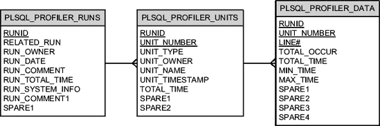
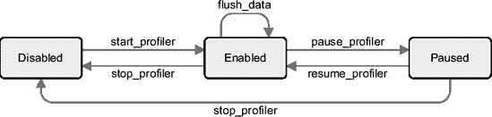
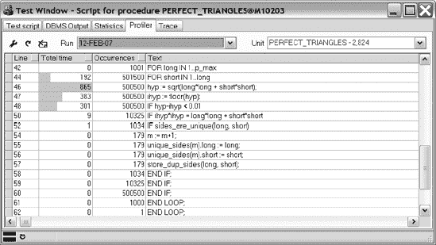
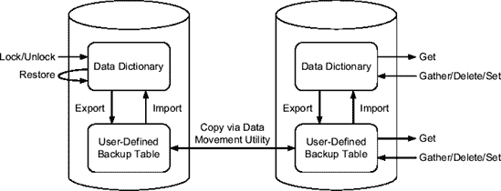

# SQL 跟踪文件分析报告

## 绑定变量

SQL 语句使用了绑定变量。因此，如果它被记录在跟踪文件中，`TVD$XTAT` 将会显示其数据类型和值。如果执行了多次，绑定变量会被分组（按数据类型和值），并提供与每组相关的执行次数。

```
绑定变量
--------------

执行次数  绑定号  数据类型  值
---------- ----- --------- ------
1          1     NUMBER    3
```

## 执行计划

接下来，如果跟踪文件中可用，您将在输出中找到执行计划。其格式与 `TKPROF` 生成的输出几乎相同。

```
执行计划
--------------

优化器模式 ALL_ROWS

行数     操作
-------- --------------------------------------------------------------------------
16,348   HASH GROUP BY (cr=1720 pr=2590 pw=2590 time=79 us cost=9990 size=11217129
                     card=534149)
540,328   PARTITION RANGE ALL 分区: 1 28 (cr=1720 pr=1649 pw=1649 time=7744 us
                                       cost=496 size=11217129 card=534149)
540,328    TABLE ACCESS FULL SALES 分区: 1 28 (cr=1720 pr=1649 pw=1649
                                             time=4756 us cost=496
                                             size=11217129 card=534149)
```

## 执行统计

与所有 SQL 语句一样，执行计划之后是执行统计信息、资源使用情况分析，以及（如果可用）第 2 级的递归 SQL 语句（您当前正在查看的是第 1 级的 SQL 语句）。在这种情况下，您可以看到递归 SQL 语句仅占响应时间的约 15%。实际上，SQL 语句 2 占用了 5.476 秒中的 4.703 秒。

### 包含递归语句的数据库调用统计

```
包含递归语句的数据库调用统计
--------------------------------------------------

调用      次数  未命中    CPU    已用时    物理 IO  逻辑 IO  一致性读  当前行    行数
-------- ------ ------- ------ -------- ------ ------ ----------- -------- -------
解析         1       1  0.000    0.000      0      0           0        0       0
执行         1       1  0.326    0.972    136  3,519       3,519        0       0
获取       164       0  1.093    4.503  2,590  1,720       1,720        0  16,348
-------- ------ ------- ------ -------- ------ ------ ----------- -------- -------
总计       166       2  1.419    `5.476`  2,726  5,239       5,239        0  16,348
```

### 不包含递归语句的数据库调用统计

```
不包含递归语句的数据库调用统计
-----------------------------------------------------
调用      次数  未命中    CPU    已用时    物理 IO  逻辑 IO  一致性读  当前行    行数
-------- ------ ------- ------ -------- ------ ------ ----------- -------- -------
解析         1       1  0.000    0.000      0      0           0        0       0
执行         1       1  0.045    0.199      0      0           0        0       0
获取       164       0  1.093    4.503  2,590  1,720       1,720        0  16,348
-------- ------ ------- ------ -------- ------ ------ ----------- -------- -------
总计       166       2  1.138    `4.703`  2,590  1,720       1,720        0  16,348
```

## 资源使用情况分析

```
资源使用情况分析
----------------------

                               总计           事件数  每个事件
组件                      已用时长        %       的持续时间
--------------------------- --------- -------- ---------- -------------
db file scattered read          1.769   33.831        225         0.008
CPU                             1.138   21.759        n/a           n/a
direct path read temp           1.005   19.211        941         0.001
递归语句                        0.775   `14.812`        n/a           n/a
direct path write temp          0.408    7.796        941         0.000
db file sequential read         0.136    2.592         32         0.004
--------------------------- --------- --------
总计                            5.229  100.000
```

执行了 33 条递归语句。

```
                                总计
语句 ID 类型                    已用时长       %
------------ ----------------------- -------- -------
3            SELECT (SYS recursive)     0.135   2.591
4            SELECT (SYS recursive)     0.102   1.948
...
...
117          SELECT (SYS recursive)     0.000   0.000
118          SELECT (SYS recursive)     0.000   0.000
------------ ----------------------- -------- -------
总计                                 0.487   9.319
```

## 等待事件详细信息

在迄今为止显示的资源使用情况分析中，等待事件只是进行了汇总。为了获得更多信息，会为资源使用情况分析中的每个组件提供类似下面的直方图。在此案例中，统计数据与 SQL 语句 2 的等待事件 `db file scattered read` 相关。请注意等待事件是如何按其持续时间（`Duration` 列）分组的。例如，您可以看到约 49% 的等待事件持续时间在 256 到 512 微秒之间。由于磁盘物理读取一些块至少需要几毫秒，这意味着大约一半的 I/O 操作是由操作系统或 I/O 子系统缓存服务的。由于等待事件 `db file scattered read` 与多块读取相关，查看每次 I/O 操作读取的平均块数（`Blocks per Event` 列）也可能是有用的。

```
总计        事件数          每个事件         每个事件
持续时间[μs] 持续时间      %    事件数    %    持续时间[μs] 块数      块数
------------- -------- ------- --------- ------- ------------ ------ ----------
< 256            0.000   0.027         2   0.889          242      8      4.000
< 512            0.041   2.345       111  `49.333`          374    798      7.189
< 1024           0.005   0.300         8   3.556          663     58      7.250
< 2048           0.001   0.069         1   0.444        1,222      7      7.000
< 4096           0.009   0.487         3   1.333        2,872     22      7.333
< 8192           0.078   4.415        11   4.889        7,100     77      7.000
< 16384          0.482  27.220        41  18.222       11,745    295      7.195
< 32768          0.957  54.090        43  19.111       22,253    316      7.349
< 65536          0.195  11.046         5   2.222       39,084     36      7.200
------------- -------- ------- --------- ------- ------------ ------ ----------
总计             1.769 100.000       225 100.000        7,863  1,617      7.187
```

如果启用了详细信息的显示（使用 `wait` 参数实现），可能会在前面的直方图之外提供进一步的详细信息。这在很大程度上取决于等待事件的类型。实际上，对于许多事件，不会生成额外信息。与 I/O 操作相关的等待事件通常在文件级别提供信息。例如，下表显示了与 SQL 语句 2 的等待事件 `db file scattered read` 相关的统计数据。在此示例中，您可以看到在 1.769 秒内，对数据文件 4 执行了 225 次 I/O 操作。这意味着每次 I/O 操作平均持续 7.863 毫秒（请注意，表中以微秒显示此值）。

```
总计           事件数                     每个事件
文件   已用时长      %     事件数       %    块数       %     持续时间[μs]
----- --------- -------- ---------- ------- ------- -------- -------------
4         1.769  100.000        225  100.000   1,617  100.000         7,863
```

## 结论

总而言之，即使执行了大量 SQL 语句（总共 182 条），SQL 语句 2 也是响应时间的主要贡献者。因此，为了改进性能，应避免或优化该 SQL 语句的执行。


### 分析 PL/SQL 代码

要分析 PL/SQL 代码，数据库引擎通过 `dbms_profiler` 包提供了一个 API。利用这个包，可以启用或禁用集成在 PL/SQL 引擎中的分析器，其作用范围限于当前会话。在启用期间，对于执行的每一行代码，会收集以下信息：

*   该行代码被执行的总次数
*   执行该行代码所花费的总时间
*   执行该行代码所花费的最少和最多时间

收集操作在会话级别进行，适用于用户拥有 `CREATE` 权限的所有 PL/SQL 单元。换句话说，仅拥有执行某个 PL/SQL 单元的权限不足以使用分析器。为了最大化收集的信息量，应将 PL/SQL 单元以调试模式编译。由于原生编译的 PL/SQL 单元不由 PL/SQL 引擎执行，因此不会为它们收集分析数据。

分析数据存储在如 图 3-20 所示的数据库表中。`plsql_profiler_runs` 表提供了有关已执行的分析会话的信息。`plsql_profiler_units` 表提供了每次运行所执行的单元列表。`plsql_profiler_data` 表则提供了前面描述的、针对每一行已执行代码的分析数据。



**图 3-20.** *分析器将收集的信息存储在三个数据库表中。注意，主键由带下划线的列组成。*

#### 安装分析器

要安装 `dbms_profiler` 包，请以 `sys` 用户身份执行 `profload.sql` 脚本：

`CONNECT / AS SYSDBA`
`@?/rdbms/admin/profload.sql`

该脚本还会创建一个公共同义词，并将 `EXECUTE` 对象权限授予 `PUBLIC`。从 Oracle Database 10*g* 开始，`dbms_profiler` 包应该已经可用，因为用于创建新数据库的主要脚本之一（`catproc.sql`）会执行 `profload.sql` 脚本。

#### 安装输出表

该包以执行它的用户的权限运行。因此，输出表不一定需要由 `sys` 用户创建。可以像下面这样，由数据库管理员一次性安装输出表，并提供必要的同义词和权限供使用；也可以由每个用户在其自己的模式中安装：

`CONNECT / AS SYSDBA`
`@?/rdbms/admin/proftab.sql`

`CREATE PUBLIC SYNONYM plsql_profiler_runs FOR plsql_profiler_runs;`
`CREATE PUBLIC SYNONYM plsql_profiler_units FOR plsql_profiler_units;`
`CREATE PUBLIC SYNONYM plsql_profiler_data FOR plsql_profiler_data;`
`CREATE PUBLIC SYNONYM plsql_profiler_runnumber FOR plsql_profiler_runnumber;`
`GRANT SELECT, INSERT, UPDATE, DELETE ON plsql_profiler_runs TO PUBLIC;`
`GRANT SELECT, INSERT, UPDATE, DELETE ON plsql_profiler_units TO PUBLIC;`
`GRANT SELECT, INSERT, UPDATE, DELETE ON plsql_profiler_data TO PUBLIC;`
`GRANT SELECT ON plsql_profiler_runnumber TO PUBLIC;`

#### 收集分析数据

分析开始于调用 `start_profiler` 例程以启用分析器。在分析器启用期间，会为 PL/SQL 引擎执行的代码收集分析数据。除非通过调用 `flush_data` 例程显式刷新，否则在分析器启用期间，分析数据不会存储到输出表中。调用 `stop_profiler` 例程会禁用分析器，并执行一次隐式刷新。此外，可以通过分别调用 `pause_profiler` 和 `resume_profiler` 例程来暂停和恢复分析器。图 3-21 展示了分析器的状态以及 `dbms_profiler` 中可用于触发状态变化的可用例程。



**图 3-21.** *分析器状态图。`dbms_profiler` 包提供了用于改变分析器状态——禁用、启用或暂停——的例程。*

图 3-21 中显示的每个例程都以函数或过程的形式提供。函数返回处理结果状态（0 = 成功）。过程在出错时引发异常。除了 `start_profiler` 例程接受两个描述分析会话的注释作为参数外，所有其他例程都是无参数的。

以下示例展示了一个针对分析 `perfect_triangles` 过程的最小化运行。该过程的代码可在 `perfect_triangles.sql` 脚本中找到。注意，在禁用分析器时选定的 `runid` 将在下一节中用于引用存储在输出表中的分析数据。

```sql
SQL> ALTER PROCEDURE perfect_triangles COMPILE DEBUG;

SQL> SELECT dbms_profiler.start_profiler AS status
  2  FROM dual;

    STATUS
----------
         0

SQL> execute perfect_triangles(1000)
SQL> SELECT dbms_profiler.stop_profiler() AS status,
  2         plsql_profiler_runnumber.currval AS runid
  3  FROM dual;

    STATUS      RUNID
----------
 ----------
         0         41
```

如果无法手动启动该包，也可以创建以下数据库事件触发器，为整个会话自动启用和禁用分析器。创建这些触发器的代码可在 `dbms_profiler_triggers.sql` 脚本中找到。为避免为所有用户启用分析器，我通常建议创建一个角色，并仅临时将权限授予需要测试的用户。当然，也可以仅为单个模式定义触发器，或者进行其他检查，例如基于 `userenv` 上下文。

```sql
CREATE ROLE profile;

CREATE OR REPLACE TRIGGER start_profiler AFTER LOGON ON DATABASE
BEGIN
  IF (dbms_session.is_role_enabled('PROFILE'))
  THEN
    dbms_profiler.start_profiler();
  END IF;
END;
/

CREATE OR REPLACE TRIGGER stop_profiler BEFORE LOGOFF ON DATABASE
BEGIN
  IF (dbms_session.is_role_enabled('PROFILE'))
  THEN
    dbms_profiler.stop_profiler();
  END IF;
END;
/
```


#### 报告分析数据

当分析会话结束后，就该报告分析器生成的数据了。这是通过使用 SQL 语句查询输出表来实现的，如下例所示。以下内容摘自 `dbms_profiler.sql` 脚本的输出。查询仅提供了响应时间的百分比，原因有二：第一，我们通常关注的是找出代码中最慢的部分；第二，计时信息，尤其是在代码受 CPU 限制时，并不十分可靠。事实上，对于受 CPU 限制的处理，分析器的开销可能非常高。在这个具体案例中，代码确实受 CPU 限制，处理时间从 1 秒增加到了 5 秒。在这 5 秒中，只有 2.8 秒被分析器记录。

```sql
SQL> COL line FORMAT 9,999 HEADING LINE#
SQL> COL total_occur FORMAT 9,999,999 HEADING EXEC#
SQL> COL time FORMAT 9,990.9 HEADING TIME%
SQL> COL text FORMAT A100 HEADING CODE

SQL> SELECT s.line,
  2         round(ratio_to_report(p.total_time) OVER ()*100,1) AS time,
  3         total_occur,
  4         s.text
  5  FROM all_source s,
  6       (SELECT u.unit_owner, u.unit_name, u.unit_type,
  7               d.line#, d.total_time, d.total_occur
  8        FROM plsql_profiler_units u, plsql_profiler_data d
  9        WHERE u.runid = &runid
 10        AND d.runid = u.runid
 11        AND d.unit_number = u.unit_number) p
 12  WHERE s.owner = p.unit_owner (+)
 13  AND s.name = p.unit_name (+)
 14  AND s.type = p.unit_type (+)
 15  AND s.line = p.line# (+)
 16  AND s.owner = '&owner'
 17  AND s.name = '&name'
 18  ORDER BY s.line;
输入 runid 的值: 41
输入 owner 的值: OPS$CHA
输入 name 的值: PERFECT_TRIANGLES
```

```
LINE#     TIME%      EXEC# CODE
------ -------- ---------- --------------------------------------------------------
     1      0.0          1 PROCEDURE perfect_triangles(p_max IN INTEGER) IS
...
    42      0.0      1,001 FOR long IN 1..p_max
    43                     LOOP
    44      6.8    501,500   FOR short IN 1..long
    45                       LOOP
    46     30.6    500,500     hyp := sqrt(long*long + short*short);
    47     13.6    500,500     ihyp := floor(hyp);
    48     10.7    500,500     IF hyp-ihyp < 0.01
    49                         THEN
    50      0.3     10,325       IF ihyp*ihyp = long*long + short*short
    51                           THEN
    52      0.1      1,034         IF sides_are_unique(long, short)
    53                             THEN
    54      0.0        179           m := m+1;
    55      0.0        179           unique_sides(m).long := long;
    56      0.0        179           unique_sides(m).short := short;
    57      0.0        179           store_dup_sides(long, short);
    58      0.0      1,034         END IF;
    59      0.0     10,325       END IF;
    60      0.0    500,500     END IF;
    61      0.0      1,000  END LOOP;
    62      0.0          1 END LOOP;
...
    69      0.0          1 END perfect_triangles;
```

#### 图形界面方式

除了前面章节介绍的手动方法外，还可以使用第三方产品中提供的图形界面。`PL/SQL Developer` (Allround Automations)、`SQLDetective` (Conquest Software)、`Rapid SQL` (Embarcadero)、`SQL Insight` (Isidian) 或 `Toad` 和 `SQL Navigator` (Quest Software) 等主要供应商都提供了这样的界面。所有这些工具都可以用来分析代码，通常是在运行测试前勾选一个复选框或点击一个按钮，或者直接分析输出表的内容。

例如，图 3-22 展示了 `PL/SQL Developer` 为前面章节所述的分析会话所提供的信息。注意 `Total Time` 列中的图形化表示，它突出了主要的耗时代码行。



**图 3-22.** *在 PL/SQL Developer 中显示的分析数据*

### 转到 第 4 章

本章提供了一个识别性能问题的详细分析路线图，并讨论了可与之配合使用的多种工具和技术。拥有一个分析路线图确实非常有帮助。然而，说到底，它只是众多方法中的一种。无论如何，最重要的一点是，只有采用系统化的方法来处理性能问题，才能快速、成功地定位问题。这一点我再怎么强调也不为过。

话虽如此，最终目标并非调查性能问题，而是从一开始就避免它们。根据我的经验，性能问题主要有两个原因：未为性能而设计应用，以及查询优化器配置不当。后者至关重要，因为数据库执行的每条 SQL 语句都会经过查询优化器。在接下来的两章中，你将看到应如何进行这样的配置。

* * *

1. 在处理性能问题时，你不仅要优化正在分析的应用程序，还必须优化你自己的操作。换句话说，你应该尽可能快地识别和解决问题。

2. `servlet` 是一种响应来自 Web 客户端请求的 Java 程序。它在 J2EE 应用服务器中运行。

3. 参见 [`logging.apache.org`](http://logging.apache.org) 获取更多信息。

4. `JVMTI` 是自 J2SE 1.5.0 起新提供的接口。在 J2SE 1.4.2 之前，`JProbe` 使用的是 Java 虚拟机分析器接口 (`JVMPI`)。

5. 这里的 `未文档化` 是指数据库引擎的官方文档没有提供关于这些方法的信息。例如，一些 MetaLink 说明，如 *EVENT: 10046 "enable SQL statement tracing (including binds/waits)"* (21154.1)，以及许多非 Oracle 出版的论文或书籍都对它们进行了详细描述。

6. `服务名称` 是与数据库关联的逻辑名称。它通过初始化参数 `service_names` 进行配置。一个数据库可以有多个服务名称。

7. 这在多个 AIX、HP-UX、Linux、Solaris、Tru64 和 Windows 系统上已明确验证。在更小众的平台（例如 OpenVMS）上则存在差异。

8. 参见 [`method-r.com`](http://method-r.com) 获取更多信息。该产品最初由 Hotsos ([`www.hotsos.com`](http://www.hotsos.com)) 开发。截至 2008 年 4 月 1 日，该产品由 Cary Millsap 的 Method R Corporation 拥有、维护和支持，但 Hotsos 仍有权销售它。

9. 参见 [`www.ubtools.com`](http://www.ubtools.com) 获取更多信息。

10. 参见 [`www.oracledba.ru/orasrp`](http://www.oracledba.ru/orasrp) 获取更多信息。

11. 参见 MetaLink 说明 *Trace Analyzer TRCANLZR* (224270.1) 获取更多信息。


## 第三部分
查询优化器

*善用你掌控之力，接受其余发生之事。*
爱比克泰德¹

在 SQL 引擎处理之前，发送到数据库的每一条 SQL 语句都必须被转换为一个执行计划。实际上，应用程序仅通过 SQL 语句指定**需要处理什么数据**，而非**如何处理**。查询优化器的目标不仅是向 SQL 引擎交付描述如何处理数据的执行计划，更重要的是，交付高效的执行计划。若未能做到这一点，可能导致极差的性能。正是由于这个原因，一本关于数据库性能的书籍必须讨论查询优化器。

然而，本部分的目的并非全面介绍查询优化器的内部工作原理。其他资源，如乔纳森·刘易斯的《*基于成本的 Oracle*》(Apress, 2006)，已在这方面做得非常出色。相反，这里提出了一种非常实用的方法，旨在描述你必须了解的查询优化器核心特性。第四章讨论查询优化器使用的统计信息。第五章描述影响查询优化器行为的初始化参数以及如何设置它们。由于你迟早会遇到性能不佳的 SQL 语句，第六章概述了获取执行计划的不同方法，以及如何阅读它们并识别低效的计划。最后，第七章描述了几种 SQL 调优技术。

在继续阅读第四章之前，有一个非常重要的说明：直至 Oracle9*i*，主要有两种优化器可用，即*基于规则的优化器*（RBO）和*基于成本的优化器*（CBO）。自 Oracle Database 10*g*起，不再支持基于规则的优化器，因此，本书将不作介绍。在本书中，当你看到术语*查询优化器*时，我始终指的是基于成本的优化器。

* * *

1. [`www.quotationspage.com/quote/2525.html`](http://www.quotationspage.com/quote/2525.html)

### 第四章
系统与对象统计信息

系统与对象统计信息至关重要，因为它们描述了运行数据库引擎的系统以及存储在数据库中的数据。事实上，一个只知晓待处理 SQL 语句和 SQL 语句所引用对象结构的查询优化器，是无法提供高效的执行计划的。简而言之，它必须能够量化待处理数据的数量。

本章的目标有两方面。首先，描述可用的系统与对象统计信息。关于查询优化器如何利用它们，这里仅针对少数情况进行说明。大多数统计信息的用途将在第五章中解释。这是因为查询优化器会同时使用统计信息和初始化参数。其次，本章描述如何收集系统与对象统计信息。在实践中，这意味着描述包 `dbms_stats`。

#### 包 `dbms_stats` 概览

过去，对象统计信息是通过 SQL 语句 `ANALYZE` 来收集的。现在情况已非如此。为了向后兼容，SQL 语句 `ANALYZE` 仍可用于收集对象统计信息。自 Oracle9*i*起，建议你使用包 `dbms_stats`。事实上，包 `dbms_stats` 不仅提供了更多功能，在某些情况下还能提供更好的统计信息。例如，SQL 语句 `ANALYZE` 对统计信息收集的控制较少，不支持外部表，并且对于分区对象，它仅收集每个段的统计信息，并在对象（表或索引）级别估算统计信息。基于这些原因，本章将不介绍 SQL 语句 `ANALYZE`。

重要的是要认识到，包 `dbms_stats` 提供了一套全面的程序和函数来管理**系统统计信息**和**对象统计信息**。对于对象统计信息，由于数据库中存在大量对象，你还可以在不同粒度级别上管理它们。实际上，你可以选择管理整个数据库、数据字典、单个模式、单个表、单个索引或单个表/索引分区的对象统计信息。

默认情况下，包 `dbms_stats` 会修改数据字典。然而，对于它的大多数程序和函数，也可以在数据字典之外操作用户定义的表。这就是我所说的*备份表*。由于管理统计信息远不止是简单地收集它们，包 `dbms_stats` 具有以下特性（参见图 4-1）：

*   收集统计信息并将其存储在数据字典或备份表中
*   锁定和解锁存储在数据字典中的统计信息
*   恢复数据字典中的统计信息
*   删除存储在数据字典或备份表中的统计信息
*   将统计信息从数据字典导出到备份表
*   将统计信息从备份表导入到数据字典
*   获取（提取）存储在数据字典或备份表中的统计信息
*   设置（修改）存储在数据字典或备份表中的统计信息

请注意，在数据库之间移动统计信息是通过通用的数据移动工具（例如，Data Pump）执行的，而不是通过包 `dbms_stats` 本身。



**图 4-1.** 包 `dbms_stats` 提供了一套管理统计信息和对象统计信息的全面功能。

根据你想要执行的操作和粒度，表 4-1 显示了包 `dbms_stats` 提供了不同的程序和函数。例如，如果你想操作单个模式，包 `dbms_stats` 提供了 `gather_schema_stats`、`delete_schema_stats`、`lock_schema_stats`、`unlock_schema_stats`、`restore_schema_stats`、`export_schema_stats` 和 `import_schema_stats`。

**表 4-1.** 包 `dbms_stats` 提供的功能

| **功能** | **数据库** | **字典**^* | **模式** | **表**^(**) | **索引**^(**) | **系统** |
| --- | --- | --- | --- | --- | --- | --- |
| 收集/删除 |  |  |  |  |  |  |
| 锁定/解锁^* |  |  |  |  |  |  |
| 恢复^* |  |  |  |  |  |  |
| 导出/导入 |  |  |  |  |  |  |
| 获取/设置 |  |  |  |  |  |  |

^*自 Oracle Database 10g 起可用。*
^(**)*对于分区对象，可以将处理限制在单个分区上。*


