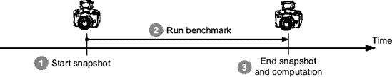
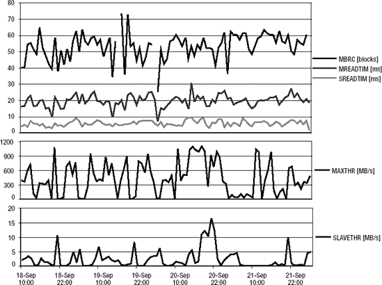
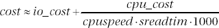
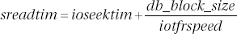
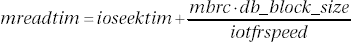

# 系统统计信息

## 数据字典

系统统计信息存储在数据字典表`aux_stats$`中。遗憾的是，没有可用的数据字典视图来公开这些信息。在此表中，最多可能存在三组行，通过`sname`列的以下值进行区分：

*   `SYSSTATS_INFO` 是包含系统统计信息状态及其收集时间的集合。如果收集正确，状态设置为`COMPLETED`。如果在收集统计信息过程中出现问题，状态设置为`BADSTATS`，此时查询优化器将不使用这些系统统计信息。在收集工作负载统计信息期间，还可能看到另外两个值：`MANUALGATHERING`和`AUTOGATHERING`。此外，直至 Oracle9*i*，当收集了非工作负载统计信息时，状态设置为`NOWORKLOAD`。
    ```
    SQL> SELECT pname, pval1, pval2
      2 FROM sys.aux_stats$
      3 WHERE sname = 'SYSSTATS_INFO';
    
    PNAME                PVAL1 PVAL2
    --------------- ---------- --------------------
    STATUS                     COMPLETED
    DSTART                     04-04-2007 14:26
    DSTOP                      04-04-2007 14:36
    FLAGS                    1
    ```
*   `SYSSTATS_MAIN` 是包含系统统计信息本身的集合。关于它们的详细信息将在接下来的两节中提供。
    ```
    SQL> SELECT pname, pval1
      2 FROM sys.aux_stats$
      3 WHERE sname = 'SYSSTATS_MAIN';
    
    PNAME                  PVAL1
    --------------- ------------
    CPUSPEEDNW            1617.6
    IOSEEKTIM               10.0
    IOTFRSPEED            4096.0
    SREADTIM                 1.3
    MREADTIM                 7.8
    CPUSPEED              1620.0
    MBRC                     7.0
    MAXTHR           473982976.0
    SLAVETHR           1781760.0
    ```
*   `SYSSTATS_TEMP` 是包含用于计算系统统计信息的值的集合。仅在收集工作负载统计信息期间可用。

由于单个数据库只存在一组统计信息，因此 RAC 系统的所有实例都使用相同的系统统计信息。因此，如果节点的规模或负载不均衡，必须仔细决定在哪个节点上收集系统统计信息。

系统统计信息是使用包`dbms_stats`中的过程`gather_system_stats`收集的。默认情况下，执行此过程的权限授予`public`。因此，每个用户都可以收集系统统计信息。然而，要更改存储在数据字典中的系统统计信息，需要`gather_system_statistics`角色，或对数据字典表`aux_stats$`的直接授权。默认情况下，`gather_system_statistics`角色是通过`dba`角色提供的。


## 无负载统计信息

如前所述，数据库引擎支持两种类型的系统统计信息：无负载统计信息和负载统计信息。从 Oracle Database *10g* 开始，无负载统计信息始终可用。如果您显式删除了它们，它们会在下一次数据库启动时自动重新收集。在 Oracle9*i* 中，即使收集了统计信息，也不会有统计数据存储在数据字典中。只有 `aux_stats$` 表中的 `status` 列会被设置为 `NOWORKLOAD`。

您在空闲系统上收集无负载统计信息，因为数据库引擎使用一个合成基准测试来生成用于衡量系统性能的负载。为了测量 CPU 速度，很可能在循环中执行某种校准操作。为了测量 I/O 性能，会对数据库的几个数据文件执行不同大小的读取操作。

要收集无负载统计信息，您需要将过程 `gather_system_stats` 的参数 `gathering_mode` 设置为 `noworkload`，如下例所示：

`dbms_stats.gather_system_stats(gathering_mode => 'noworkload')`

收集统计信息通常需要不到一分钟的时间，并且会计算表 4-2 中列出的统计信息。奇怪的是，有时需要多次重复收集统计信息；否则，将使用默认值（这些默认值同样在表 4-2 中列出）。虽然很难确切知道这里发生了什么，但我推测这是一种合理性检查，会丢弃那些意义不大的统计信息。

**表 4-2.** *存储在数据字典中的无负载统计信息*

| **名称** | **描述** |
| --- | --- |
| `CPUSPEEDNW` | 单个 CPU 每秒能够处理的操作次数（以百万计）。 |
| `IOSEEKTIM` | 在磁盘上定位数据所需的平均时间（以毫秒为单位）。默认值为 10。 |
| `IOTFRSPEED` | 从磁盘传输数据的平均速率（字节/毫秒）。默认值为 4,096。 |

## 负载统计信息

负载统计信息仅在显式收集时才可用。要收集它们，您不能使用空闲系统，因为数据库引擎必须利用常规的数据库负载来测量 I/O 子系统的性能。另一方面，测量 CPU 速度的方法与无负载统计信息的方法相同。如图 4-2 所示，收集负载统计信息是一个三步活动。其思路是，要计算某个操作的平均耗时，需要知道该操作执行的次数以及执行它所花费的时间。例如，使用以下 SQL 语句，我能够以与 `dbms_stats` 包相同的方式，从我的一个测试数据库中计算出单块读取的平均时间（6.2 毫秒）：

```sql
SQL> SELECT sum(singleblkrds) AS count, sum(singleblkrdtim)*10 AS time_ms
   2 FROM v$filestat;

     COUNT    TIME_MS
---------- ----------
     22893      36760

SQL> REMARK 运行基准测试以生成一些 I/O 操作...

SQL> SELECT sum(singleblkrds) AS count, sum(singleblkrdtim)*10 AS time_ms
   2 FROM v$filestat;

     COUNT    TIME_MS
---------- ----------
     54956     236430

SQL> SELECT round((236430-36760)/(54956-22893),1) AS avg_tim_singleblkrd
   2 FROM dual;

AVG_TIM_SINGLEBLKRD
-------------------
                 6.2
```



**图 4-2.** *要收集（计算）系统统计信息，需要使用多个性能指标的两次快照。*

图 4-2 中说明的三个步骤如下：

1.  获取多个性能指标的快照并将其存储在数据字典表 `aux_stats$` 中（对于这些行，`sname` 列被设置为 `SYSSTATS_TEMP`）。此步骤通过将过程 `gather_system_stats` 的参数 `gathering_mode` 设置为 `start` 来完成，如下列命令所示：
    `dbms_stats.gather_system_stats(gathering_mode => 'start')`
2.  数据库引擎不控制数据库负载。因此，在进行下一次快照之前，必须等待足够的时间以覆盖一个具有代表性的负载期。很难提供关于这个等待时间的通用建议，但通常至少等待 30 分钟。
3.  进行第二次快照。此步骤通过将过程 `gather_system_stats` 的参数 `gathering_mode` 设置为 `stop` 来完成，如下列命令所示：
    `dbms_stats.gather_system_stats(gathering_mode => 'stop')`
4.  然后，基于两次快照的性能统计信息，计算出表 4-3 中列出的系统统计信息。如果某个 I/O 统计信息无法计算，则将其设置为 `NULL`（从 Oracle Database *10g* 开始）或 -1（在 Oracle9*i* 中）。

**表 4-3.** *存储在数据字典中的负载统计信息*

| **名称** | **描述** |
| --- | --- |
| `CPUSPEED` | 单个 CPU 每秒能够处理的操作次数（以百万计） |
| `SREADTIM` | 执行单块读取操作所需的平均时间（以毫秒为单位） |
| `MREADTIM` | 执行多块读取操作所需的平均时间（以毫秒为单位） |
| `MBRC` | 在一次多块读取操作中读取的平均块数 |
| `MAXTHR` | 整个系统的最大 I/O 吞吐量（字节/秒） |
| `SLAVETHR` | 并行处理从进程的平均 I/O 吞吐量（字节/秒） |


为避免手动获取结束快照，也可以将过程 `gather_system_stats` 的参数 `gathering_mode` 设置为 `interval`。使用此参数，起始快照会立即获取，而结束快照则计划在由第二个名为 `interval` 的参数指定的分钟数之后执行。以下命令指定统计信息的收集应持续 30 分钟：

```
dbms_stats.gather_system_stats(gathering_mode => 'interval',
                               interval       => 30)
```

请注意，执行上述命令并不需要花费 30 分钟。它只是获取起始快照并调度一个作业来获取结束快照。在 Oracle Database 10g Release 1 及更早版本中，使用的是旧版调度器（由 `dbms_job` 包管理）。从 Database 10g Release 2 开始，使用的是新版调度器（由 `dbms_scheduler` 包管理）。你可以分别通过查询视图 `user_jobs` 和 `user_scheduler_jobs` 来查看该作业。

我们收集系统统计信息时的主要问题是选择收集时段。事实上，大多数系统的负载都不是恒定不变的，因此，除了 `cpuspeed` 之外，工作负载统计信息的演变同样不稳定。图 4-3 展示了我在一个生产系统上测量到的工作负载统计信息演变情况。为了生成这些图表，我以大约一小时的间隔收集了四天的工作负载统计信息。有关我为此目的使用的 SQL 语句示例，请查阅脚本 `system_stats_history.sql` 和 `system_stats_history_job.sql`。



**图 4-3.** 在大多数系统上，工作负载统计信息的演变绝非恒定。

为避免在无法代表负载的时段收集工作负载统计信息，我认为只有两种方法。要么我们在一个持续数天的时段内收集工作负载统计信息，要么我们可以像图 4-3 那样生成图表以获取有意义的数值。我通常建议采用后者，因为同时我们也能获得对系统的有用视图。例如，基于图 4-3 所示的图表，我建议对 `mbrc`、`mreadtim`、`sreadtim` 和 `cpuspeed` 使用平均值，而对 `maxthr` 和 `slavethr` 使用最大值。然后，可以使用类似以下的 PL/SQL 块来手动设置工作负载统计信息。请注意，在用过程 `set_system_stats` 设置工作负载统计信息之前，需先用过程 `delete_system_stats` 删除旧的系统统计信息集。

```
BEGIN
   dbms_stats.delete_system_stats();
   dbms_stats.set_system_stats(pname => 'CPUSPEED', pvalue => 772);
   dbms_stats.set_system_stats(pname => 'SREADTIM', pvalue => 5.5);
   dbms_stats.set_system_stats(pname => 'MREADTIM', pvalue => 19.4);
   dbms_stats.set_system_stats(pname => 'MBRC',     pvalue => 53);
   dbms_stats.set_system_stats(pname => 'MAXTHR',   pvalue => 1136136192);
   dbms_stats.set_system_stats(pname => 'SLAVETHR', pvalue => 16870400);
END;
```

如果一天或一周的不同时间段需要不同的工作负载统计信息集，也可以使用此方法。然而，必须指出的是，我从未遇到过需要一套以上工作负载统计信息的情况。

你可能已经察觉到，我不建议定期收集 noworkload 统计信息。我觉得最好固定它们的值，并将其视为初始化参数。

#### 对查询优化器的影响

当系统统计信息可用时，查询优化器会计算两个成本：I/O 成本和 CPU 成本。第 5 章描述了如何为最重要的访问路径计算 I/O 成本。关于 CPU 成本的计算，可用的信息很少。不过，我们可以想象，查询优化器会为每个操作关联一个 CPU 成本。例如，正如 Joze Senegacnik 所指出的，从 Oracle Database 10g Release 2 开始，使用公式 4-1 来计算访问一个列的 CPU 成本。

```
cpu_cost = column_position · 20
```

**公式 4-1.** 访问一个列的估计 CPU 成本取决于它在表中的位置。该公式给出的是访问一行的成本。如果访问多行，CPU 成本会成比例增加。第 12 章提供了关于为什么列的位置相关的进一步信息。

下面的示例（摘自脚本 `cpu_cost_column_access.sql`）展示了公式 4-1 的实际应用。创建了一个有九列的表，插入了一行，然后使用 SQL 语句 `EXPLAIN PLAN` 显示独立访问这九列的 CPU 成本。有关此 SQL 语句的详细信息，请参阅第 6 章。请注意，访问表有一个初始 CPU 成本 35,757，然后对于每个后续列，CPU 成本增加 20。同时，I/O 成本是恒定的。这是合理的，因为所有列都存储在同一个数据库块中，因此读取它们所需的物理读取次数对于所有查询都是相同的。

```
SQL> CREATE TABLE t (c1 NUMBER, c2 NUMBER, c3 NUMBER,
   2                 c4 NUMBER, c5 NUMBER, c6 NUMBER,
   3                 c7 NUMBER, c8 NUMBER, c9 NUMBER);

SQL> INSERT INTO t VALUES (1, 2, 3, 4, 5, 6, 7, 8, 9);
SQL> EXPLAIN PLAN SET STATEMENT_ID 'c1' FOR SELECT c1 FROM t;
SQL> EXPLAIN PLAN SET STATEMENT_ID 'c2' FOR SELECT c2 FROM t;
SQL> EXPLAIN PLAN SET STATEMENT_ID 'c3' FOR SELECT c3 FROM t;
SQL> EXPLAIN PLAN SET STATEMENT_ID 'c4' FOR SELECT c4 FROM t;
SQL> EXPLAIN PLAN SET STATEMENT_ID 'c5' FOR SELECT c5 FROM t;
SQL> EXPLAIN PLAN SET STATEMENT_ID 'c6' FOR SELECT c6 FROM t;
SQL> EXPLAIN PLAN SET STATEMENT_ID 'c7' FOR SELECT c7 FROM t;
SQL> EXPLAIN PLAN SET STATEMENT_ID 'c8' FOR SELECT c8 FROM t;
SQL> EXPLAIN PLAN SET STATEMENT_ID 'c9' FOR SELECT c9 FROM t;

SQL> SELECT statement_id, cpu_cost AS total_cpu_cost,
   2        cpu_cost-lag(cpu_cost) OVER (ORDER BY statement_id) AS cpu_cost_1_coll,
   3        io_cost
   4 FROM plan_table
   5 WHERE id = 0
   6 ORDER BY statement_id;

STATEMENT_ID TOTAL_CPU_COST CPU_COST_1_COLL IO_COST
------------ -------------- --------------- -------
c1                    35757                       3
c2                    35777                  20   3
c3                    35797                  20   3
c4                    35817                  20   3
c5                    35837                  20   3
c6                    35857                  20   3
c7                    35877                  20   3
c8                    35897                  20   3
c9                    35917                  20   3
```

I/O 成本和 CPU 成本使用不同的度量单位表示。显然，不能简单地将两者相加来计算 SQL 语句的总成本。为了解决这个问题，查询优化器使用工作负载统计信息代入公式 4-2³。简单来说，就是将 CPU 成本转换为每秒可执行的单块读取次数。




### 对象统计

**公式 4-2.** *总体成本基于 I/O 成本和 CPU 成本。*

要计算无工作负载统计信息时的总体成本，公式 4-2 中的 `cpuspeed` 会被替换为 `cpuspeednw`，而 `sreadtim` 则根据公式 4-3 计算得出。



**公式 4-3.** *如有必要，`sreadtim` 基于无工作负载统计信息和数据库的块大小计算得出。*

一般来说，如果存在工作负载统计信息，查询优化器会使用它们，而忽略无工作负载统计信息。您应该注意，查询优化器会执行多项完整性检查，这些检查可能会禁用或部分替换工作负载统计信息。

*   当 `sreadtim`、`mreadtim` 或 `mbrc` 中任一项不可用时，查询优化器会忽略工作负载统计信息。
*   当 `mreadtim` 小于或等于 `sreadtim` 时，`sreadtim` 和 `mreadtim` 的值将分别使用公式 4-3 和公式 4-4 重新计算。



**公式 4-4.** *基于无工作负载统计信息和数据库块大小计算 `mreadtim`。*

系统统计信息使查询优化器能够感知数据库引擎运行所在的系统环境。这意味着它们对于成功配置至关重要。换句话说，强烈建议始终使用它们。我还建议冻结它们以保持稳定性。当然，在发生重大硬件或软件变更时，应重新计算系统统计信息，因此需要检查整个配置。出于检查目的，也可以定期将它们收集到备份表中（即使用 `gather_system_stats` 过程的 `statown` 和 `stattab` 参数），并验证当前值与数据字典中存储的值是否存在重大差异。

### 对象统计

对象统计信息描述了存储在数据库中的数据。例如，它们会告诉查询优化器表中存储了多少行数据。没有这些定量信息，查询优化器永远无法做出正确的决策，例如为小表或大表（结果集）找到合适的连接方法。为了说明这一点，请考虑以下示例。假设我问您，从特定地点回家最快的交通方式是什么。是开车、坐火车还是坐飞机？为什么不骑自行车呢？关键在于，如果不考虑我的实际位置和我的家在哪里，您无法得出有意义的答案。同样，没有对象统计信息，查询优化器也面临同样的问题。它根本无法生成有意义的执行计划。

接下来的章节将首先描述有哪些对象统计信息可用，以及在数据字典中的哪些位置可以找到它们。然后，我将介绍用于收集、比较、锁定和删除统计信息的 `dbms_stats` 包的功能。接着，我将根据可用功能描述一些我用来管理对象统计信息的策略。

***

**注意：** 数据库引擎通过 `ASSOCIATE STATISTICS` SQL 语句，允许将用户定义的统计信息与列、函数、包、类型、域索引和索引类型关联起来。虽然在实践中这项技术很少使用，但在需要时，这是一个非常强大的功能。因此，此处将不作介绍。有关信息，请参考 *Data Cartridge Developer's Guide* 手册。

***

#### 有哪些可用的对象统计信息？

对象统计信息分为三种类型：表统计信息、列统计信息和索引统计信息。每种类型又最多有三个子类型：表/索引级统计信息、分区级统计信息和子分区级统计信息。显而易见，分区和子分区统计信息仅当对象分别进行了分区和子分区时才存在。

对象统计信息显示在表 4-4 列出的数据字典视图中。当然，每个视图也有对应的 `dba` 和 `all` 版本，例如 `dba_tables` 和 `all_tables`。

**表 4-4.** *显示关系表对象统计信息的数据字典视图*

| **对象** | **表/索引级统计信息** | **分区级统计信息** | **子分区级统计信息** |
| --- | --- | --- | --- |
| 表 | `user_tab_statistics`, `user_tables`^* | `user_tab_statistics`, `user_tab_partitions`^* | `user_tab_statistics`, `user_tab_subpartitions`^* |
| 列 | `user_tab_col_statistics`, `user_tab_histograms` | `user_part_col_statistics`, `user_part_histograms` | `user_subpart_col_statistics`, `user_subpart_histograms` |
| 索引 | `user_ind_statistics`, `user_indexes`^* | `user_ind_statistics`, `user_ind_partitions`^* | `user_ind_statistics`, `user_ind_subpartitions`^* |
| *^* 这些视图主要在 Oracle9i 及之前的版本中使用。这是因为视图 `user_tab_statistics` 和 `user_ind_statistics` 仅从 Oracle Database 10g 开始才可用。* |

本节的其余部分将描述数据字典中可用的最重要的对象统计信息。为此，我使用以下 SQL 语句创建了一个测试表。这些 SQL 语句以及本节中的所有其他查询，都可以在脚本 `object_statistics.sql` 中找到。

```sql
CREATE TABLE t
AS
SELECT rownum AS id,
       round(dbms_random.normal*1000) AS val1,
       100+round(ln(rownum/3.25+2)) AS val2,
       100+round(ln(rownum/3.25+2)) AS val3,
       dbms_random.string('p',250) AS pad
FROM all_objects
WHERE rownum <= 1000
ORDER BY dbms_random.value;

UPDATE t SET val1 = NULL WHERE val1 < 0;

ALTER TABLE t ADD CONSTRAINT t_pk PRIMARY KEY (id);

CREATE INDEX t_val1_i ON t (val1);
CREATE INDEX t_val2_i ON t (val2);

BEGIN
   dbms_stats.gather_table_stats(ownname          => user,
                                 tabname          => 'T',
                                 estimate_percent => 100,
                                 method_opt       => 'for all columns size skewonly',
                                 cascade          => TRUE);
END;
/
```

#### 表统计信息

以下查询展示了如何获取表最重要的表统计信息：

```sql
SQL> SELECT num_rows, blocks, empty_blocks, avg_space, chain_cnt, avg_row_len
   2 FROM user_tab_statistics
   3 WHERE table_name = 'T';

   NUM_ROWS     BLOCKS EMPTY_BLOCKS  AVG_SPACE  CHAIN_CNT AVG_ROW_LEN
---------- ---------- ------------ ---------- ---------- -----------
      1000         44            0          0          0         265
```

以下是对该查询返回的表统计信息的解释：

*   `num_rows` 是表中的行数。
*   `blocks` 是表中高水位线以下的块数。
*   `empty_blocks` 是表中高水位线以上的块数。此值不由 `dbms_stats` 包计算，被设置为 0。
*   `avg_space` 是表数据块中的平均空闲空间（以字节为单位）。此值不由 `dbms_stats` 包计算，被设置为 0。
*   `chain_cnt` 是表中被链接或迁移到另一个块的行的总数（链接行和迁移行将在第 12 章 中描述）。此值不由 `dbms_stats` 包计算，被设置为 0。
*   `avg_row_len` 是表中一行的平均大小（以字节为单位）。


