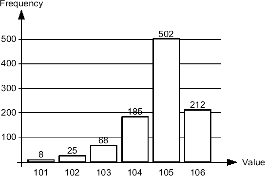
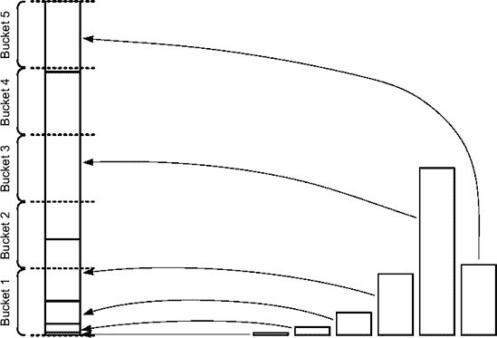
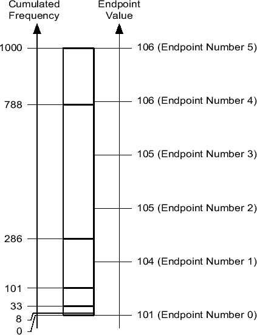

# 直方图：频率直方图与高度平衡直方图

## 频率直方图

频率直方图是大多数人理解术语“直方图”时所指的概念。图 4-4 是这种类型的一个示例，它展示了上一个查询返回数据的常见图形化表示。



**图 4-4.** 基于存储在列 `val2` 中的数据集的频率直方图的图形化表示。

数据字典中存储的频率直方图与此表示类似。主要区别在于，它使用的是累积频率而非频率。以下查询展示了这两种值之间的区别（注意列 `endpoint_number` 就是累积频率）：

```sql
SQL> SELECT endpoint_value, endpoint_number,
  2        endpoint_number - lag(endpoint_number,1,0)
  3                          OVER (ORDER BY endpoint_number) AS frequency
  4 FROM user_tab_histograms
  5 WHERE table_name = 'T'
  6 AND column_name = 'VAL2'
  7 ORDER BY endpoint_number;

ENDPOINT_VALUE ENDPOINT_NUMBER  FREQUENCY
-------------- --------------- ----------
           101               8          8
           102              33         25
           103             101         68
           104             286        185
           105             788        502
           106            1000        212
```

频率直方图的基本特征如下：

*   桶的数量（换句话说，类别的数量）与不同值的数量相同。对于每个桶，在视图 `user_tab_histograms` 中都有一行可用。
*   列 `endpoint_value` 提供了值本身。由于此列的数据类型是 `NUMBER`，因此基于非数字数据类型（如 `VARCHAR2, CHAR, NVARCHAR2, NCHAR, RAW`）的列必须进行转换。为此，仅使用前导的 6 个字节（而不是字符！）。这意味着直方图中存储的值仅根据前导部分进行区分。因此，固定前缀可能会影响直方图的有效性。对于多字节字符集尤其如此，其中 6 个字节可能仅对应 3 个字符。
*   列 `endpoint_number` 提供了该值的累积频率。要获得频率本身，必须从前一行的 `endpoint_number` 列值中减去。

以下示例展示了当存在频率直方图时，查询优化器如何利用它来精确估计查询（*基数*）在列 `val2` 上带有谓词时返回的行数。关于 SQL 语句 `EXPLAIN PLAN` 的详细信息在第 6 章中提供。

```sql
SQL> EXPLAIN PLAN SET STATEMENT_ID '101' FOR SELECT * FROM t WHERE val2 = 101;
SQL> EXPLAIN PLAN SET STATEMENT_ID '102' FOR SELECT * FROM t WHERE val2 = 102;
SQL> EXPLAIN PLAN SET STATEMENT_ID '103' FOR SELECT * FROM t WHERE val2 = 103;
SQL> EXPLAIN PLAN SET STATEMENT_ID '104' FOR SELECT * FROM t WHERE val2 = 104;
SQL> EXPLAIN PLAN SET STATEMENT_ID '105' FOR SELECT * FROM t WHERE val2 = 105;
SQL> EXPLAIN PLAN SET STATEMENT_ID '106' FOR SELECT * FROM t WHERE val2 = 106;

SQL> SELECT statement_id, cardinality
  2 FROM plan_table
  3 WHERE id = 0;

STATEMENT_ID CARDINALITY
------------ -----------
101                    8
102                   25
103                   68
104                  185
105                  502
106                  212
```

## 高度平衡直方图

当不同值的数量大于允许的最大桶数（254）时，就不能使用频率直方图，因为它们每个桶只支持一个值。这就是高度平衡直方图变得有用的地方。

要创建高度平衡直方图，可以思考以下过程。首先，创建一个频率直方图。然后，如图 4-5 所示，将频率直方图的值堆叠起来。最后，将这堆值分成若干个高度完全相同的桶。例如，在图 4-5 中，这堆值被分成五个桶。



**图 4-5.** 将频率直方图转换为高度平衡直方图

以下查询是如何为列 `val2` 生成这样一个高度平衡直方图的示例。图 4-6 展示了它返回数据的图形化表示。注意每个桶的端点值是分割发生点的值。此外，还添加了一个桶 0 来存储最小值。

```sql
SQL> SELECT count(*), max(val2) AS endpoint_value, endpoint_number
  2 FROM (
  3   SELECT val2, ntile(5) OVER (ORDER BY val2) AS endpoint_number
  4   FROM t
  5 )
  6 GROUP BY endpoint_number
  7 ORDER BY endpoint_number;

COUNT(*) ENDPOINT_VALUE ENDPOINT_NUMBER
-------- -------------- --------------
     200            104              1
     200            105              2
     200            105              3
     200            106              4
     200            106              5
```



**图 4-6.** 基于存储在列 `val2` 中的数据集的直方图的图形化表示

对于图 4-6 的情况，以下查询显示了数据字典中存储的高度平衡直方图。有趣的是，并非所有桶都被存储。发生这种情况是因为几个具有相同端点值的相邻桶没有用处。结果是一种压缩。实际上，从这些数据可以推断出桶 2 的端点值是 105，桶 4 的端点值是 106。在直方图中出现多次的值被称为*流行值*。

```sql
SQL> SELECT endpoint_value, endpoint_number
  2 FROM user_tab_histograms
  3 WHERE table_name = 'T'
  4 AND column_name = 'VAL2'
  5 ORDER BY endpoint_number;

ENDPOINT_VALUE ENDPOINT_NUMBER
-------------- ---------------
           101               0
           104               1
           105               3
           106               5
```

以下是高度平衡直方图的主要特征：

*   桶的数量少于不同值的数量。对于每个桶（除非它们被压缩），在视图 `user_tab_histograms` 中都有一行带有端点号可用。此外，端点号 0 表示最小值。
*   列 `endpoint_value` 给出了值本身。由于列的数据类型是 `NUMBER`，因此非数字数据类型（如 `VARCHAR2, CHAR, NVARCHAR2, NCHAR, RAW`）必须进行转换。为此，仅使用前导的 6 个字节（而不是字符！）。
*   列 `endpoint_number` 给出了桶号。
*   直方图不存储值的频率。

以下示例显示了当高度平衡直方图就位时，查询优化器执行的估计。请注意，与频率直方图相比，其精度较低。


