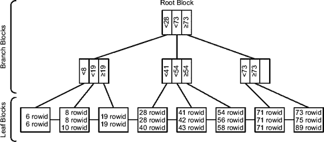
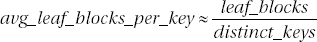
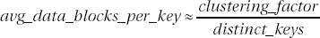

# 扩展统计

前两节描述的列统计信息和直方图仅在列的**在谓词中使用时未被修改**的情况下才有帮助。例如，如果使用谓词`country='Switzerland'`，并且列`country`具有列统计信息和直方图，那么查询优化器应该能够正确估计其选择性。这是因为列统计信息和直方图描述了列`country`本身。另一方面，如果使用谓词`upper(country)='SWITZERLAND'`，查询优化器就不再能够直接从对象统计信息和直方图中推断选择性。当谓词引用多个列时，也会出现类似的问题。例如，如果我对一个包含来自世界各地人员的表应用谓词`country='Denmark' AND language='Danish'`，那么对于该表中的大多数行来说，这两个限制很可能适用于相同的行。事实上，大多数讲丹麦语的人住在丹麦，而大多数住在丹麦的人讲丹麦语。换句话说，这两个限制几乎是冗余的。这样的列通常被称为`correlated columns`，这对查询优化器构成了挑战。这是因为没有对象统计信息或直方图描述数据之间的这种依赖关系，换句话说，查询优化器实际上假设存储在不同列中的数据是相互独立的。

从 Oracle 数据库 11g 开始，可以收集表达式或列组上的对象统计信息和直方图来解决这类问题。这些新的统计信息被称为`扩展统计`。基本上，其过程是基于表达式或列组创建一个隐藏列，称为`扩展`。然后，在其上收集常规的对象统计信息和直方图。

定义是通过`dbms_stats`包中的`create_extended_stats`函数完成的。例如，以下查询创建了两个扩展。第一个基于`upper(pad)`，第二个是由列`val2`和`val3`组成的列组。在测试表中，这些列包含完全相同的值；换句话说，这些列是高度相关的。在定义时，如下所示，表达式或列组必须用括号括起来。注意，该函数返回一个系统生成的扩展名称（一个以`SYS_STU`开头的 30 字节名称）。

```
SELECT dbms_stats.create_extended_stats(ownname => user,
                                        tabname => 'T',
                                        extension => '(upper(pad))'),
       dbms_stats.create_extended_stats(ownname => user,
                                        tabname => 'T',
                                        extension => '(val2,val3)')
FROM dual
```

显然，一旦创建了扩展，数据字典就会提供有关它们的信息。以下基于视图`user_stat_extensions`的查询显示了测试表的现有扩展。也存在`dba`和`all`版本。

```
SQL> SELECT extension_name, extension
  2 FROM user_stat_extensions
  3 WHERE table_name = 'T';

EXTENSION_NAME                     EXTENSION
---------------------------------- ---------------
SYS_STU0KSQX64#I01CKJ5FPGFK3W9     (UPPER("PAD"))
SYS_STUPS77EFBJCOTDFMHM8CHP7Q1     ("VAL2","VAL3")
```

如下一个查询的输出所示，隐藏列与扩展具有相同的名称。还要注意扩展的定义是如何添加到列信息中的。

```
SQL> SELECT column_name, data_type, hidden_column, data_default
  2 FROM user_tab_cols
  3 WHERE table_name = 'T'
  4 ORDER BY column_id;
```


`COLUMN_NAME                     DATA_TYPE HIDDEN DATA_DEFAULT`
`------------------------------ --------- ------ -------------------------`
`ID                             NUMBER    NO`
`VAL1                           NUMBER    NO`
`VAL2                           NUMBER    NO`
`VAL3                           NUMBER    NO`
`PAD                            VARCHAR2  NO`
`SYS_STU0KSQX64#I01CKJ5FPGFK3W9 VARCHAR2  YES    UPPER("PAD")`
`SYS_STUPS77EFBJCOTDFMHM8CHP7Q1 NUMBER    YES    SYS_OP_COMBINED_HASH("VAL2","VAL3")`

***

**注意** 由于针对一组列的扩展统计信息是基于哈希函数 (`sys_op_combined_hash`) 的，因此它们仅对基于相等性的谓词有效。换句话说，查询优化器无法利用它们来处理基于 `BETWEEN`、`<` 或 `>` 等运算符的谓词。

***

要删除一个扩展，可以使用 `dbms_stats` 包中提供的 `drop_extended_stats` 过程。在以下示例中，PL/SQL 块删除了先前创建的两个扩展：
```
BEGIN
   dbms_stats.drop_extended_stats(ownname   => user,
                                  tabname   => 'T',
                                  extension => '(upper(pad))');
   dbms_stats.drop_extended_stats(ownname   => user,
                                  tabname   => 'T',
                                  extension => '(val2,val3)');
END;
```

值得注意的是，扩展统计基于 Oracle Database 11g 的另一项特性，称为*虚拟列*。虚拟列是不存储数据，而仅根据其他列的表达式生成其内容的列。在应用程序频繁使用给定表达式的情况下，这很有帮助。一个典型的例子是对 `VARCHAR2` 列应用 `upper` 函数或对 `DATE` 列应用 `trunc` 函数。如果这些表达式被频繁使用，那么直接在表中定义它们是合理的，如以下示例所示。正如你将在第 9 章中看到的，虚拟列也可以被索引。
```
SQL> CREATE TABLE persons (
   2   name VARCHAR2(100),
   3   name_upper AS (upper(name))
   4 );
```
```
SQL> INSERT INTO persons (name) VALUES ('Michelle');
```
```
SQL> SELECT name
   2 FROM persons
   3 WHERE name_upper = 'MICHELLE';
```
```
NAME
----------
Michelle
```

重要的是要认识到，无论虚拟列如何定义，对象统计信息和直方图通常都会被收集。这样，查询优化器就能获得关于数据的额外统计信息。

**索引统计信息**

在描述索引统计信息之前，让我们根据图 4-7 简要回顾一下索引的结构。顶部的块称为*根块*。这是每次查找开始的地方。根块引用*分支块*。请注意，根块也被视为一个分支块。每个分支块又引用另一级分支块，或者像图 4-7 中那样，引用*叶块*。叶块存储键（在本例中，是一些介于 6 和 89 之间的数值）以及引用数据的 rowid。对于给定的索引，从根块到每个叶块之间的分支块数量总是相同的。换句话说，索引总是平衡的。请注意，为了支持对值范围的查找（例如，所有介于 25 和 45 之间的值），叶块是链接在一起的。

并非所有索引都有这三种类型的块。事实上，只有当根块无法存储所有叶块的引用时，分支块才会存在。此外，如果索引非常小，它可能只包含一个块，该块包含了通常存储在根块和叶块中的所有数据。



**图 4-7.** *索引结构基于 B^+-树。*

以下查询展示了如何获取表的最重要索引统计信息：
```
SQL> SELECT index_name AS name,
   2        blevel,
   3        leaf_blocks AS leaf_blks,
   4        distinct_keys AS dst_keys,
   5        num_rows,
   6        clustering_factor AS clust_fact,
   7        avg_leaf_blocks_per_key AS leaf_per_key,
   8        avg_data_blocks_per_key AS data_per_key
   9 FROM user_ind_statistics
  10 WHERE table_name = 'T';
```
```
NAME       BLEVEL LEAF_BLKS DST_KEYS NUM_ROWS CLUST_FACT LEAF_PER_KEY DATA_PER_KEY
---------- ------ --------- -------- -------- ---------- ------------ ------------
T_VAL2_I        1         2        6     1000        153            1           25
T_VAL1_I        1         2      431      497        479            1            1
T_PK            1         2     1000     1000        980            1            1
```

此查询返回的索引统计信息如下：

*   `blevel` 是为了访问一个叶块而需要读取的分支块数量（包括根块）。
*   `leaf_blocks` 是索引的叶块数量。
*   `distinct_keys` 是索引中不同键的数量。
*   `num_rows` 是索引中的键数量。对于主键，此值与 `distinct_keys` 相同。
*   `clustering_factor` 表示有多少相邻的索引条目不指向表中的同一个数据块。如果表和索引的排序方式相似，则聚簇因子较低。最小值是表中非空数据块的数量。如果表和索引的排序方式不同，则聚簇因子较高。最大值是索引中的键数量。我将在第 9 章中讨论这些统计信息对性能的影响。以下 PL/SQL 函数（可在脚本 `clustering_factor.sql` 中找到）说明了其计算方式。请注意，此函数仅适用于单列 B 树索引。
```
CREATE OR REPLACE FUNCTION clustering_factor (
   p_owner IN VARCHAR2,
   p_table_name IN VARCHAR2,
   p_column_name IN VARCHAR2
) RETURN NUMBER IS
   l_cursor             SYS_REFCURSOR;
   l_clustering_factor  BINARY_INTEGER := 0;
   l_block_nr           BINARY_INTEGER := 0;
   l_previous_block_nr  BINARY_INTEGER := 0;
   l_file_nr            BINARY_INTEGER := 0;
   l_previous_file_nr   BINARY_INTEGER := 0;
BEGIN
   OPEN l_cursor FOR
     'SELECT dbms_rowid.rowid_block_number(rowid) block_nr, '||
     '       dbms_rowid.rowid_to_absolute_fno(rowid, '''||
                                      p_owner||''','''||
                                      p_table_name||''') file_nr '||
     'FROM '||p_owner||'.'||p_table_name||' '||
     'WHERE '||p_column_name||' IS NOT NULL '||
     'ORDER BY ' || p_column_name;
LOOP
   FETCH l_cursor INTO l_block_nr, l_file_nr;
   EXIT WHEN l_cursor%NOTFOUND;
   IF (l_previous_block_nr <> l_block_nr OR l_previous_file_nr <> l_file_nr)
   THEN
     l_clustering_factor := l_clustering_factor + 1;
   END IF;
     l_previous_block_nr := l_block_nr;
     l_previous_file_nr := l_file_nr;
   END LOOP;
   CLOSE l_cursor;
   RETURN l_clustering_factor;
END;
```

注意它生成的值与数据字典中存储的统计信息如何匹配：
```
SQL> SELECT i.index_name, i.clustering_factor,
   2        clustering_factor(user, i.table_name, ic.column_name) AS my_clstf
   3 FROM user_indexes i, user_ind_columns ic
   4 WHERE i.table_name = 'T'
   5 AND i.index_name = ic.index_name;
```
```
   INDEX_NAME   CLUSTERING_FACTOR  MY_CLSTF
------------- ------------------- ---------
T_PK                           980       980
T_VAL1_I                       479       479
T_VAL2_I                       153       153
```


值得一提的是，对于位图索引，并不会计算真正的聚簇因子。实际上，它被设置为索引中的键数量（即统计信息 `num_rows`）。

*   `avg_leaf_blocks_per_key` 是指存储单个键的平均叶块数量。该值是使用公式 4-5 从其他统计信息推导而来的。



**公式 4-5。** *计算存储单个键的平均叶块数量*

*   `avg_data_blocks_per_key` 是指单个键所引用的表中数据块的平均数量。该值是使用公式 4-6 从其他统计信息推导而来的。



**公式 4-6。** *计算单个键所引用的平均数据块数量*

#### 收集对象统计信息

直到 Oracle9*i*，都是由 DBA 负责收集对象统计信息。实际上，默认情况下，没有可用的对象统计信息。从 Oracle Database 10*g* 开始，在创建数据库时，会创建并调度一个旨在自动收集对象统计信息的作业。这是一件好事，因为拥有最新的对象统计信息应该是常态，而非例外。

#### 使用包 `dbms_stats` 收集统计信息

要收集对象统计信息，包 `dbms_stats` 包含了多个过程。之所以有多个过程，是因为根据情况不同，收集统计信息的过程应针对整个数据库、数据字典、某个方案或单个对象进行。

*   `gather_database_stats` 为整个数据库收集对象统计信息。
*   `gather_dictionary_stats` 为数据字典收集对象统计信息。请注意，数据字典不仅包括存储在 `sys` 方案中的对象，还包括 Oracle 为可选组件安装的其他方案。此过程仅在 Oracle Database 10*g* 及以上版本可用。
*   `gather_fixed_objects_stats` 为数据字典中包含的称为*固定表*的特定对象收集对象统计信息。要了解此过程处理哪些表，您可以使用以下查询。此过程仅在 Oracle Database 10*g* 及以上版本可用。
    ```sql
    SELECT name
    FROM v$fixed_table
    WHERE type = 'TABLE'
    ```
*   `gather_schema_stats` 为整个方案收集对象统计信息。
*   `gather_table_stats` 为一个表收集对象统计信息，并可选择为其索引也收集统计信息。
*   `gather_index_stats` 为一个索引收集对象统计信息。

这些过程提供了多个参数，这些参数可以分为三大类。第一组参数用于指定目标对象，第二组用于指定收集选项，第三组用于指定在覆盖当前统计信息之前是否备份它们。表 4-5 总结了哪些参数可用于哪些过程。接下来的三个小节将详细描述每个参数的范围和用法。

**表 4-5。** *用于收集对象统计信息的过程参数*

| **参数** | **数据库** | **字典** | **固定对象** | **方案** | **表** | **索引** |
| --- | --- | --- | --- | --- | --- | --- |
| **目标对象** |  |  |  |  |  |  |
| `ownname` |  |  |  |  |  |  |
| `indname` |  |  |  |  |  |  |
| `tabname` |  |  |  |  |  |  |
| `partname` |  |  |  |  |  |  |
| `comp_id` |  |  |  |  |  |  |
| `granularity` |  |  |  |  |  |  |
| `cascade` |  |  |  |  |  |  |
| `gather_sys` |  |  |  |  |  |  |
| `gather_temp` |  |  |  |  |  |  |
| `options` |  |  |  |  |  |  |
| `objlist` |  |  |  |  |  |  |
| `force` |  |  |  |  |  |  |
| `obj_filter_list` |  |  |  |  |  |  |
| **收集选项** |  |  |  |  |  |  |
| `estimate_percent` |  |  |  |  |  |  |
| `block_sample` |  |  |  |  |  |  |
| `method_opt` |  |  |  |  |  |  |
| `degree` |  |  |  |  |  |  |
| `no_invalidate` |  |  |  |  |  |  |
| **备份表** |  |  |  |  |  |  |
| `stattab` |  |  |  |  |  |  |
| `statid` |  |  |  |  |  |  |
| `statown` |  |  |  |  |  |  |

#### 目标对象

目标对象参数指定了您为其收集对象统计信息的对象。


以下是排版后的内容：

`ownname` 指定要处理的方案名称。此参数是强制性的。
`indname` 指定要处理的索引名称。此参数是强制性的。
`tabname` 指定要处理的表名称。此参数是强制性的。
`partname` 指定要处理的分区或子分区名称。如果未指定值，则会收集所有分区的对象统计信息。默认值为 `NULL`。
`comp_id` 指定要处理的组件的 ID。由于无法使用组件 ID 来收集统计信息，因此它会在内部转换为一个方案列表。要了解为给定组件处理了哪些方案，可以使用以下查询。⁴ 请注意，方案 `sys` 和 `system` 总是会被处理，与本参数无关。如果指定了无效值，则不会返回错误消息，并且方案 `sys` 和 `system` 会按常规处理。使用默认值 `NULL` 时，会处理所有组件。

```sql
SQL> SELECT u.name AS schema_name, r.cid AS comp_id, r.cname AS comp_name
  2  FROM sys.user$ u,
  3       (SELECT schema#, cid, cname
  4       FROM sys.registry$
  5       WHERE status IN (1,3,5)
  6       AND namespace = 'SERVER'
  7       UNION ALL
  8       SELECT s.schema#, s.cid, cname
  9       FROM sys.registry$ r, sys.registry$schemas s
 10       WHERE r.status IN (1,3,5)
 11       AND r.namespace = 'SERVER'
 12       AND r.cid = s.cid) r
 13  WHERE u.user# = r.schema#
 14 ORDER BY u.name, r.cid;

SCHEMA_NAME        COMP_ID COMP_NAME
------------------ ------- ------------------------------
CTXSYS             CONTEXT Oracle Text
DMSYS              ODM     Oracle Data Mining
EXFSYS             EXF     Oracle Expression Filter
EXFSYS             RUL     Oracle Rule Manager
OLAPSYS            AMD     OLAP Catalog
ORDPLUGINS         ORDIM   Oracle interMedia
ORDSYS             ORDIM   Oracle interMedia
SI_INFORMTN_SCHEMA ORDIM   Oracle interMedia
SYS                APS     OLAP Analytic Workspace
SYS                CATALOG Oracle Database Catalog Views
SYS                CATJAVA Oracle Database Java Packages
SYS                JAVAVM  JServer JAVA Virtual Machine
SYS                XML     Oracle XDK
SYS                XOQ     Oracle OLAP API
SYSMAN             EM      Oracle Enterprise Manager
WKPROXY            WK      Oracle Ultra Search
WKSYS              WK      Oracle Ultra Search
WK_TEST            WK      Oracle Ultra Search
WMSYS              OWM     Oracle Workspace Manager
XDB                XDB     Oracle XML Database
```

`granularity` 指定处理分区对象统计信息的级别。此参数接受 表 4-6 中列出的值。直至 Oracle9*i*，默认值为 `DEFAULT`，而从 Oracle Database 10*g* 开始，默认值为 `AUTO`（此默认值可以更改；请参阅本章后面的“配置 dbms_stats 包：10*g* 方式”和“配置 dbms_stats 包：11*g* 方式”部分）。

**表 4-6. 参数 `granularity` 接受的值**

| **值** | **含义** |
| --- | --- |
| `all` | 收集对象、分区和子分区统计信息。此值仅从 Oracle Database 10*g* 开始可用。 |
| `auto` | 收集对象和分区统计信息。仅当表按列表或范围进行子分区时，才会收集子分区统计信息。 |
| `default` | 收集对象和分区统计信息。此值仅在 Oracle9*i* 及之前版本可用。从 Oracle Database 10*g* 开始，它被 `global and partition` 取代。 |
| `global` | 仅收集对象统计信息。 |
| `global and partition` | 收集对象和分区统计信息。此值仅从 Oracle Database 10*g* 开始可用。 |
| `partition` | 仅收集分区统计信息。 |
| `subpartition` | 仅收集子分区统计信息。 |

`cascade` 指定是否处理索引。此参数接受值 `TRUE`、`FALSE` 和 `dbms_stats.auto_cascade`。后者是一个计算结果为 `NULL` 的常量，让数据库引擎决定是否收集索引统计信息。直至 Oracle9*i*，默认值为 `FALSE`，而从 Oracle Database 10*g* 开始，默认值为 `dbms_stats.auto_cascade`（此默认值可以更改；请参阅本章后面的“配置 dbms_stats 包：10*g* 方式”和“配置 dbms_stats 包：11*g* 方式”部分）。
`gather_sys` 指定是否处理方案 `sys`。此参数接受值 `TRUE` 和 `FALSE`。默认值为 `FALSE`。
`gather_temp` 指定是否处理临时表。由于包 `dbms_stats` 在处理开始时会执行 `COMMIT`，因此只能处理使用 `on commit preserve rows` 创建的临时表。此参数接受值 `TRUE` 和 `FALSE`。默认值为 `FALSE`。
`options` 指定处理哪些对象以及是否处理对象。此参数接受 表 4-7 中列出的值。默认值为 `gather`。

**表 4-7. 参数 `options` 接受的值**

| **值** | **含义** |
| --- | --- |
| `gather` | 处理所有对象。 |
| `gather auto` | 让过程不仅确定要处理的对象，还确定如何处理它们。指定此值时，除 `ownname`、`objlist`、`stattab`、`statid` 和 `statown` 外的所有参数都会被忽略。 |
| `gather stale` | 仅处理对象统计信息已过时的对象。注意：没有对象统计信息的对象不被视为过时。 |
| `gather empty` | 仅处理没有对象统计信息的对象。 |
| `list auto` | 列出将使用 `gather auto` 选项处理的对象。 |
| `list stale` | 列出将使用 `gather stale` 选项处理的对象。 |
| `list empty` | 列出将使用 `gather empty` 选项处理的对象。 |

**对象统计信息的过时性**

要识别对象统计信息是否过时，数据库引擎会计算每个对象通过 SQL 语句修改的行数。该计数的结果通过数据字典视图 `all_tab_modifications`、`dba_tab_modifications` 和 `user_tab_modifications` 对外提供。以下是一个查询示例：

```sql
SQL> SELECT inserts, updates, deletes, truncated
   2 FROM user_tab_modifications
   3 WHERE table_name = 'T';

INSERTS    UPDATES    DELETES TRUNCATED
---------- ---------- ---------- ----------
       775      16636         66 NO
```


基于这些信息，`dbms_stats` 包能够判断与特定对象关联的统计信息是否已**过时**。在 Oracle Database 10*g* 及更早版本中，如果有至少 10% 的行被修改，则认为统计信息已过时。从 Oracle Database 11*g* 开始，您可以通过参数 `stale_percent` 配置此阈值。其默认值为 10%。本章后面的“配置 dbms_stats 包：11*g* 方法”一节将展示如何更改它。

在 Oracle9*i* 中，计数功能仅在表级别显式指定时才会启用。具体来说，这是通过在 `CREATE TABLE` 或 `ALTER TABLE` 语句中指定 `monitoring` 选项来实现的。为了轻松地为整个模式（甚至整个数据库）启用此功能，`dbms_stats` 包分别提供了 `alter_schema_tab_monitoring` 和 `alter_database_tab_monitoring` 过程。请注意，这些过程只是对所有可用表执行 `ALTER TABLE` 语句。换句话说，此设置对之后创建的表没有影响。

从 Oracle Database 10*g* 开始，`monitoring` 选项**已弃用**。计数功能由初始化参数 `statistics_level` 在数据库范围内控制。如果它设置为 `typical`（默认值）或 `all`，则会启用计数。

*   `objlist` 根据参数 `options` 的值，返回已处理或**将**处理的对象列表。这是一个基于 `dbms_stats` 包中定义的类型的输出参数。例如，以下 PL/SQL 块展示了如何显示已处理对象的列表：

    ```sql
    SQL> DECLARE
      2    l_objlist dbms_stats.objecttab;
      3    l_index PLS_INTEGER;
      4  BEGIN
      5    dbms_stats.gather_schema_stats(ownname => 'HR',
      6                                   objlist => l_objlist);
      7    l_index := l_objlist.FIRST;
      8    WHILE l_index IS NOT NULL
      9    LOOP
     10      dbms_output.put(l_objlist(l_index).ownname || '.');
     11      dbms_output.put_line(l_objlist(l_index).objname);
     12      l_index := l_objlist.next(l_index);
     13    END LOOP;
     14  END;
     15  /
    HR.COUNTRIES
    HR.DEPARTMENTS
    HR.EMPLOYEES
    HR.JOBS
    HR.JOB_HISTORY
    HR.LOCATIONS
    HR.REGIONS
    ```

*   `force` 指定是否覆盖已锁定的统计信息。如果此参数设置为 `FALSE`，而正在执行的设计用于处理单个表或索引的过程，则会引发错误 (`ORA-20005`)。此参数接受值 `TRUE` 和 `FALSE`。它仅从 Oracle Database 10*g* Release 2 开始可用。您将在本章后面的“锁定对象统计信息”一节中找到有关锁定统计信息的更多信息。

*   `obj_filter_list` 指定仅收集满足作为参数传递的过滤器中**至少一个**的对象的统计信息。它基于 `dbms_stats` 包本身定义的 `objecttab` 类型，并且仅从 Oracle Database 11*g* 开始可用。以下 PL/SQL 块展示了如何为模式 HR 的所有表以及模式 `SH` 中名称以字母 `C` 开头的所有表收集统计信息：

    ```sql
    DECLARE
          l_filter dbms_stats.objecttab := dbms_stats.objecttab();
    BEGIN
          l_filter.extend(2);
          l_filter(1).ownname := 'HR';
          l_filter(2).ownname := 'SH';
          l_filter(2).objname := 'C%';
          dbms_stats.gather_database_stats(obj_filter_list => l_filter,
                                           options         => 'gather');
    END;
    ```

## 收集选项

表 4-5 中列出的收集选项参数指定了统计信息收集的进行方式、收集哪些种类的列统计信息，以及相关的 SQL 游标是否失效。选项如下：

*   `estimate_percent` 指定是否使用采样来收集统计信息。有效值是介于 0.000001 和 100 之间的十进制数字。值 100 以及值 `NULL` 表示不采样。常量 `dbms_stats.auto_sample_size`（计算结果为 0）让过程自行确定样本大小。从 Oracle Database 11*g* 开始，推荐使用此值。顺便提一下，不支持对外部表进行采样。重要的是要理解，此参数指定的值仅是用于收集统计信息的最小百分比。事实上，如下例所示，如果指定的估计百分比被认为太小，该值可能会自动增加。在 Oracle9*i* 及更早版本中，默认值为 `NULL`；从 Oracle Database 10*g* 开始，默认值为 `dbms_stats.auto_sample_size`（此默认值可以更改；参见本章后面的“配置 dbms_stats 包：10*g* 方法”和“配置 dbms_stats 包：11*g* 方法”两节）。为了加快对象统计信息的收集，请使用较小的估计百分比；通常小于 10% 的值是合适的。对于大表，即使是 0.5%、0.1% 或更少也可能合适。如果您不确定选择，只需尝试不同的估计百分比并比较收集到的统计信息。这样，您可能会找到性能和准确性之间的最佳折中方案。由于当在数据库或模式级别执行统计信息收集时，太小的值会自动增加，因此估计百分比应针对最大的表来选择。

    ```sql
    SQL> BEGIN
      2    dbms_stats.gather_schema_stats(ownname          => user,
      3                                   estimate_percent => 0.5);
      4  END;
      5  /
    ```

    ```sql
    SQL> SELECT table_name, sample_size, num_rows,
      2         round(sample_size/num_rows*100,1) AS "%"
      3  FROM user_tables
      4  WHERE num_rows > 0
      5  ORDER BY table_name;

    TABLE_NAME                     SAMPLE_SIZE   NUM_ROWS       %
    ------------------------------ ----------- ---------- -------
    CAL_MONTH_SALES_MV                      48         48   100.0
    CHANNELS                                 5          5   100.0
    COSTS                                 5410      81799     6.6
    COUNTRIES                               23         23   100.0
    CUSTOMERS                             4700      55648     8.4
    FWEEK_PSCAT_SALES_MV                  5262      11155    47.2
    PRODUCTS                                72         72   100.0
    PROMOTIONS                             503        503   100.0
    SALES                                 4602     920400     0.5
    SUPPLEMENTARY_DEMOGRAPHICS            3739       4487    83.3
    TIMES                                 1826       1826   100.0
    ```

*   `block_sample` 指定是使用行采样还是块采样来收集统计信息。行采样更准确，而块采样更快。因此，只有在确定数据是随机分布的情况下才应使用块采样。此参数接受值 `TRUE` 和 `FALSE`。默认值为 `FALSE`。

*   `method_opt` 不仅指定是否收集直方图，还指定在创建直方图时应使用的最大桶数。此外，此参数也可用于完全禁用列统计信息的收集。提供了以下收集模式：⁵


