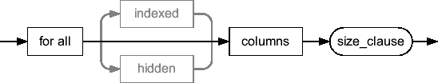
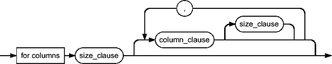

# 收集列统计信息和直方图

*   收集不包含直方图的列统计信息。为此，必须指定 `NULL` 或空字符串。
    *   为所有⁶列收集列统计信息和直方图。所有直方图都使用参数 `size_clause` 的完全相同的值创建。语法如 图 4-8 所示。例如，使用值 `for all columns size 200` 将为每一列创建一个最多包含 200 个桶的直方图。
    *   仅为列的子集或为所有列收集列统计信息和直方图，但为参数 `size_clause` 指定不同的值。语法如 图 4-9 所示。例如，使用值 `for columns size 200 col1, col2, col3, col4 size 1, col5 size 1`，将为五列收集列统计信息，但只为 `col1`、`col2` 和 `col3` 列收集最多包含 200 个桶的直方图。

在 Oracle9*i* 及之前版本中，默认值为 `for all columns size 1`；从 Oracle Database 10*g* 开始，默认值为 `for all columns size auto`（此默认值可以更改；参见本章后面的“配置 dbms_stats 包：10*g* 方式”和“配置 dbms_stats 包：11*g* 方式”部分）。为简便起见，请使用 `size skewonly` 或 `size auto`。如果速度太慢或选择的桶数不合适（或根本未创建所需的直方图），请手动指定列列表。

*   `degree` 指定在收集单个对象的统计信息时使用的从属进程数。要使用对象级别定义的并行度，请指定值 `NULL`。要让过程自行确定并行度，请指定常量 `dbms_stats.default_degree`。默认值为 `NULL`（从 Oracle Database 10*g* 开始，此默认值可以更改；参见本章后面的“配置 dbms_stats 包：10*g* 方式”和“配置 dbms_stats 包：11*g* 方式”部分）。请注意，多个对象的处理是串行化的。这意味着并行化仅对加速大型对象的统计信息收集有用。要同时并行处理多个对象，需要手动并行化（即启动多个作业）。有关并行处理的详细信息，请参阅第 11 章。对象统计信息的并行收集仅在企业版中可用。
*   `no_invalidate` 指定是否使依赖于被处理对象的游标无效。此参数接受值 `TRUE`、`FALSE` 和 `dbms_stats.auto_invalidate`。当参数设置为 `TRUE` 时，依赖于已更改对象统计信息的游标不会被无效化，因此可能会照常使用。另一方面，如果设置为 `FALSE`，则所有游标都会立即无效化。使用值 `dbms_stats.auto_invalidate`（这是一个计算结果为 `NULL` 的常量）时，游标会在一段时间内逐渐无效化。最后一种可能性对于避免重新解析峰值很有用。在 Oracle9*i* 及之前版本中，默认值为 `FALSE`；从 Oracle Database 10*g* 开始，默认值为 `dbms_stats.auto_invalidate`（此默认值可以更改；参见本章后面的“配置 dbms_stats 包：10*g* 方式”和“配置 dbms_stats 包：11*g* 方式”部分）。

**图 4-8.** 使用参数 `size_clause` 的单个值为所有列收集列统计信息和直方图（参见表 4-8）

**图 4-9.** 仅为列的子集或为所有列收集列统计信息和直方图，但为参数 `size_clause` 指定不同的值（参见表 4-8）。对于未明确指定 `size_clause` 的列，将使用默认的 `size_clause`（第一个）。如果未指定任何列，则根本不收集任何列统计信息。`column_clause` 可以是列名、扩展名或扩展。如果指定了不存在的扩展，则会自动创建一个新的扩展。

**表 4-8.** 参数 `size_clause` 接受的值

| **值** | **含义** |
| --- | --- |
| `size 1..254` | 该值指定桶的最大数量。如果指定 `size 1`，则不创建直方图。在任何情况下，都会正常收集列统计信息。 |
| `size skewonly` | 仅为数据倾斜的列收集直方图。桶的数量由系统自动确定。 |
| `size auto` | 仅为数据倾斜的列（如 `skewonly`）收集直方图，此外，这些列还必须在 `WHERE` 子句中被引用过。第二个条件基于 *列使用历史记录*。桶的数量由系统自动确定。 |
| `size repeat` | 刷新可用的直方图。 |

