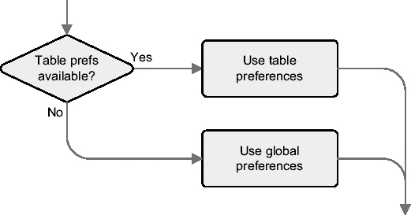

# 备份表

表 4-5 中列出的备份表参数受所有用于收集对象统计信息的过程支持。它们指示 `dbms_stats` 包在用新的统计信息覆盖数据字典中的现有统计信息之前，先将当前统计信息备份到一个备份表中。参数如下：


*   `stattab` 指定一个位于数据字典之外的表，用于存储统计信息。默认值为 `NULL`。
*   `statid` 是一个可选的标识符，用于识别存储在 `stattab` 参数指定的表中的多组对象统计信息。虽然过去支持使用任意字符串作为此标识符，但从 Oracle Database 10*g* Release 2 开始，仅支持有效的 Oracle 标识符⁸。不过，此限制已被向后移植到之前的版本中。例如，它适用于 9.2.0.8 版本（但不适用于 9.2.0.7 或 10.1.0.5）。默认值为 `NULL`。
*   `statown` 指定 `stattab` 参数所指定表的所有者。默认值为 `NULL`，因此会使用当前用户。

如何创建和删除备份表在“创建和删除备份表”一节中描述。

## 配置 dbms_stats 包：10*g* 方式

在 Oracle Database 10*g* 中，你可以更改参数 `cascade`、`estimate_percent`、`degree`、`method_opt`、`no_invalidate` 和 `granularity` 的默认值。之所以可能，是因为这些默认值不再硬编码在过程的签名中，而是在运行时从数据字典中提取。过程 `set_param` 可用于设置默认值。要执行它，你需要 `analyze any dictionary` 和 `analyze any` 系统权限。函数 `get_param` 用于获取默认值。以下示例展示了如何使用它们。注意 `pname` 是参数名，`pval` 是参数值。

```sql
SQL> execute dbms_output.put_line(dbms_stats.get_param(pname => 'CASCADE'))
DBMS_STATS.AUTO_CASCADE

SQL> execute dbms_stats.set_param(pname => 'CASCADE',pval =>'TRUE')

SQL> execute dbms_output.put_line(dbms_stats.get_param(pname => 'CASCADE'))
TRUE
```

另一个可以用此方法设置的参数是 `autostats_target`。此参数仅由作业 `gather_stats_job`（本章稍后描述）使用，以确定统计信息收集必须处理哪些对象。表 4-9 列出了可用的值。默认值为 `AUTO`。

### 表 4-9. `autostats_target` 参数接受的值

| **值** | **含义** |
| --- | --- |
| `ALL` | 处理所有对象。 |
| `AUTO` | 由作业决定处理哪些对象。 |
| `ORACLE` | 仅处理属于数据字典的对象。 |

要获取所有参数的默认值，而无需多次执行函数 `get_param`，你可以使用以下查询：⁹

```sql
SQL> SELECT sname AS parameter, nvl(spare4,sval1) AS default_value
  2  FROM sys.optstat_hist_control$
  3  WHERE sname IN ('CASCADE','ESTIMATE_PERCENT','DEGREE',
  4                  'METHOD_OPT','NO_INVALIDATE','GRANULARITY');
PARAMETER        DEFAULT_VALUE
---------------- ---------------------------
CASCADE          DBMS_STATS.AUTO_CASCADE
ESTIMATE_PERCENT DBMS_STATS.AUTO_SAMPLE_SIZE
DEGREE           NULL
METHOD_OPT       FOR ALL COLUMNS SIZE AUTO
NO_INVALIDATE    DBMS_STATS.AUTO_INVALIDATE
GRANULARITY      AUTO
```

要将默认值恢复到原始设置，`dbms_stats` 包提供了过程 `reset_param_defaults`。

## 配置 dbms_stats 包：11*g* 方式

在 Oracle Database 11*g* 中，设置参数默认值（称为 `preferences`）的概念相比 Oracle Database 10*g* 得到了显著增强。事实上，你不仅能够像在 Oracle Database 10*g* 中那样设置全局默认值，还能够设置模式和表级别的默认值。此外，对于全局默认值，数据字典对象和用户定义对象之间是分离的。这些增强的一个结果是，函数 `get_param` 以及过程 `set_param` 和 `reset_param_defaults`（在 Oracle Database 10*g* 中引入并在上一节描述）已经过时。

你可以更改参数 `cascade`、`estimate_percent`、`degree`、`method_opt`、`no_invalidate`、`granularity`、`publish`、`incremental` 和 `stale_percent` 的默认值。要更改它们，`dbms_stats` 包中提供了以下过程：

*   `set_global_prefs` 设置全局首选项。它替代了过程 `set_param`。
*   `set_database_prefs` 设置数据库首选项。全局和数据库首选项之间的区别在于，后者不用于数据字典对象。换句话说，数据库首选项仅用于用户定义对象。
*   `set_schema_prefs` 设置特定模式的首选项。
*   `set_table_prefs` 设置特定表的首选项。

重要的是要注意，过程 `set_database_prefs` 和 `set_schema_prefs` 并不直接将首选项存储在数据字典中。相反，它们在调用过程时被转换为数据库或模式中所有可用对象的表首选项。实际上，只存在全局和表首选项。基本上，过程 `set_database_prefs` 和 `set_schema_prefs` 只是过程 `set_table_prefs` 的简单封装。这意味着全局首选项将用于新表。

以下 PL/SQL 块展示了如何为参数 `cascade` 设置不同的值。注意 `pname` 是参数名，`pvalue` 是参数值，`ownname` 是所有者，`tabname` 是表名。再次强调，要小心，因为在此类 PL/SQL 块中调用的顺序至关重要。实际上，每次调用都会覆盖先前调用所做的定义。

```sql
BEGIN
  dbms_stats.set_database_prefs(pname  => 'CASCADE',
                                pvalue => 'DBMS_STATS.AUTO_CASCADE');
  dbms_stats.set_schema_prefs(ownname => 'SCOTT',
                              pname   => 'CASCADE',
                              pvalue  => 'FALSE');
  dbms_stats.set_table_prefs(ownname => 'SCOTT',
                             tabname => 'EMP',
                             pname   => 'CASCADE',
                             pvalue  => 'TRUE');
END;
```

要获取当前设置，可以使用函数 `get_prefs`，它替代了函数 `get_param`。以下查询展示了对前面 PL/SQL 块执行设置的效果。注意 `pname` 是参数名，`ownname` 是所有者名称，`tabname` 是表名称。如你所见，根据指定的参数，函数会返回特定级别的值。这种首选项的查找过程如图 4-10 所示。

```sql
SQL> SELECT dbms_stats.get_prefs(pname => 'cascade') AS global,
  2         dbms_stats.get_prefs(pname   => 'cascade',
  3                              ownname => 'SCOTT',
  4                              tabname =>'EMP') AS emp,
  5         dbms_stats.get_prefs(pname   => 'cascade',
  6                              ownname => 'SCOTT',
  7                              tabname =>'DEPT') AS dept
  8  FROM dual;

GLOBAL                     EMP        DEPT
-------------------------  ---------- ----------
DBMS_STATS.AUTO_CASCADE    TRUE       FALSE
```




**图 4-10.** 在查找首选项时，表设置优先于全局首选项。

要获取全局首选项而无需多次执行 `get_param` 函数（如前一节所述），可以查询内部数据字典表 `optstat_hist_control$`。要获取表的首选项，也可以运行以下查询。请注意，即使在前面的 PL/SQL 块中配置是在模式级别进行的，数据字典视图 `dba_tab_stat_prefs` 也会显示该设置。

```sql
SQL> SELECT table_name, preference_name, preference_value
  2  FROM dba_tab_stat_prefs
  3  WHERE owner = 'SCOTT'
  4  AND table_name IN ('EMP','DEPT')
  5  ORDER BY table_name, preference_name;

TABLE_NAME PREFERENCE_NAME PREFERENCE_VALUE
---------- --------------- ----------------
DEPT       CASCADE         FALSE
EMP        CASCADE         TRUE
```

要清除首选项，`dbms_stats` 包提供了以下过程：

*   `reset_global_pref_defaults` 将全局首选项重置为默认值。
*   `delete_database_prefs` 删除数据库级别的首选项。
*   `delete_schema_prefs` 删除模式级别的首选项。
*   `delete_table_prefs` 删除表级别的首选项。

以下调用展示了如何删除模式 `scott` 的首选项：

```sql
dbms_stats.delete_schema_prefs(ownname => 'SCOTT',
                               pname   => 'CASCADE')
```

要在全局和数据库级别执行这些过程，您需要同时拥有系统权限 `analyze any dictionary` 和 `analyze any`。要在模式或表级别执行这些过程，您需要以所有者身份连接或拥有系统权限 `analyze any`。

## 处理待处理统计信息

通常，一旦统计信息收集完成，对象统计信息就会被发布（即提供）给查询优化器。这意味着无法（例如出于测试目的）在收集统计信息时不覆盖当前的对象统计信息。当然，测试数据库应用于测试目的，但有时可能无法做到这一点；您可能希望在生产环境中进行。一个例子是测试数据库中存储的数据与生产数据库中的数据不同。

从 Oracle Database *11g* 开始，可以将收集统计信息与发布它们分开，并且可以使用未发布的对象统计信息（称为 *pending statistics*）进行测试。以下是步骤（脚本 `pending_object_statistics.sql` 中提供了完整示例）：

1.  通过将首选项 `publish` 设置为 `FALSE`（默认值为 `TRUE`）来禁用自动发布。如前一节所述，对于其他首选项，这可以在全局、数据库、模式或表级别完成。以下示例展示了如何为当前用户的表 `t` 进行设置：
    ```sql
    dbms_stats.set_table_prefs(ownname => user,
                               tabname => 'T',
                               pname   => 'PUBLISH',
                               pvalue  => 'FALSE')
    ```
2.  为当前用户的表 `t` 收集对象统计信息。由于此表的首选项 `publish` 设置为 `FALSE`，新收集的对象统计信息不会被发布。这意味着查询优化器将继续使用收集之前的可用统计信息。同时，依赖于该表的游标不会被失效。
    ```sql
    dbms_stats.gather_table_stats(ownname => user, tabname => 'T')
    ```
3.  要测试新对象统计信息对一组 SQL 语句或应用程序的影响，您可以在会话级别将动态初始化参数 `optimizer_use_pending_statistics` 设置为 `TRUE`。在此设置下，待处理统计信息仅对当前会话可用。
    ```sql
    ALTER SESSION SET optimizer_use_pending_statistics = TRUE
    ```
4.  如果测试成功，可以通过调用过程 `publish_pending_stats` 来发布待处理统计信息（换句话说，使其对所有用户可用）。以下示例展示了如何为单个表执行此操作。如果参数 `tabname` 设置为 `NULL`，则会发布指定模式的所有待处理统计信息。此过程还有两个附加参数。第三个参数 `no_invalidate` 控制依赖于修改后对象统计信息的游标是否失效。第四个参数 `force` 用于覆盖统计信息的潜在锁（本章后面的“锁定对象统计信息”一节描述了此类锁）。其默认值为 `FALSE`，这意味着默认情况下锁会被遵守。
    ```sql
    dbms_stats.publish_pending_stats(ownname => user, tabname => 'T')
    ```
5.  如果测试不成功，您可以通过调用过程 `delete_pending_stats` 删除待处理统计信息。如果未指定参数 `tabname` 或其设置为 `NULL`，则会删除由 `ownname` 参数指定的整个模式的待处理统计信息。
    ```sql
    dbms_stats.delete_pending_stats(ownname => user, tabname => 'T')
    ```

要执行过程 `publish_pending_stats` 和 `delete_pending_stats`，您需要以所有者身份连接或拥有系统权限 `analyze any`。

如果您有兴趣了解待处理统计信息的值，以下数据字典视图提供了所有必要的信息。每个视图都有对应的 `dba` 和 `all` 版本。

*   `user_tab_pending_stats` 显示待处理的表统计信息。
*   `user_ind_pending_stats` 显示待处理的索引统计信息。
*   `user_col_pending_stats` 显示待处理的列统计信息。
*   `user_tab_histgrm_pending_stats` 显示待处理的直方图。

这些数据字典视图的内容和结构分别与 `user_tab_statistics`、`user_ind_statistics`、`user_tab_col_statistics` 和 `user_tab_histograms` 相似。

## 调度统计信息收集：10g 方式

作业 `gather_stats_job` 是使用调度程序（Scheduler）进行调度的。¹⁰ 当前配置（在以下示例中是 Oracle Database 10*g* 的默认配置）可以通过以下查询显示。输出由脚本 `dbms_stats_job_10g.sql` 生成。

```sql
SQL> SELECT program_name, schedule_name, schedule_type, enabled, state
  2  FROM dba_scheduler_jobs
  3  WHERE owner = 'SYS'
  4  AND job_name = 'GATHER_STATS_JOB';
```


