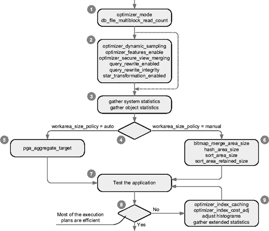

# Oracle 数据库统计信息收集调度配置

## Oracle Database 10g

以下查询展示了 Oracle Database 10g 中默认的统计信息收集作业配置。

```sql
PROGRAM_NAME      SCHEDULE_NAME            SCHEDULE_TYPE   ENABLED STATE
----------------- ------------------------ --------------- ---------
GATHER_STATS_PROG MAINTENANCE_WINDOW_GROUP WINDOW_GROUP    TRUE    SCHEDULED
```

```sql
SQL> SELECT program_action, number_of_arguments, enabled
  2  FROM dba_scheduler_programs
  3  WHERE owner = 'SYS'
  4  AND program_name = 'GATHER_STATS_PROG';

PROGRAM_ACTION                                   NUMBER_OF_ARGUMENTS ENABLED
----------------------------------------------- ------------------- -------
dbms_stats.gather_database_stats_job_proc                           0 TRUE
```

```sql
SQL> SELECT w.window_name, w.repeat_interval, w.duration, w.enabled
  2  FROM dba_scheduler_wingroup_members m, dba_scheduler_windows w
  3  WHERE m.window_name = w.window_name
  4  AND m.window_group_name = 'MAINTENANCE_WINDOW_GROUP';

WINDOW_NAME      REPEAT_INTERVAL                           DURATION      ENABLED
---------------- ----------------------------------------- ------------- -------
WEEKNIGHT_WINDOW freq=daily;byday=MON,TUE,WED,THU,FRI; +000 08:00:00 TRUE
                 byhour=22;byminute=0; bysecond=0
WEEKEND_WINDOW   freq=daily;byday=SAT;byhour=0;byminut +002 00:00:00 TRUE
                 e=0;bysecond=0
```

### 配置摘要

*   该作业执行程序`gather_stats_prog`，并能够运行在窗口组`maintenance_window_group`内。
*   程序`gather_stats_prog`无参数地调用包`dbms_stats`中的过程`gather_database_stats_job_proc`。由于没有向其传递参数，改变其行为的唯一方法是更改包`dbms_stats`的默认配置，如本章前面的“配置 dbms_stats 包：10g 方式”一节所述。请注意，此过程未记录在案，并标记为“仅供内部使用”。
*   窗口组`maintenance_window_group`有两个成员：窗口`weeknight_window`和窗口`weekend_window`。前者每周一至周五每晚开放八小时。后者在周六和周日开放。对象统计信息的收集发生在这两个窗口之一打开时。
*   作业、程序和窗口均已启用。

### 修改调度配置

应检查默认调度的开放时间和持续时间，并在必要时进行更改以匹配预期的统计信息收集频率。如果可能，它们应与低利用率时间段匹配。

每次作业因窗口关闭而停止时，都会生成一个跟踪文件，其中包含所有未处理对象的列表。以下是此类跟踪文件的摘录：

```
GATHER_STATS_JOB: Stopped by Scheduler.
Consider increasing the maintenance window duration if this happens frequently.
The following objects/segments were not analyzed due to timeout:
  TABLE: "SH"."SALES"."SALES_1995"
  TABLE: "SH"."SALES"."SALES_1996"
  TABLE: "SH"."SALES"."SALES_H1_1997"
...
  TABLE: "SYS"."WRI$_OPTSTAT_AUX_HISTORY"""
  TABLE: "SYS"."WRI$_ADV_OBJECTS"."
  TABLE: "SYS"."WRI$_OPTSTAT_HISTGRM_HISTORY"""
error 1013 in job queue process
ORA-01013:user requested cancel of current operation
```

### 启用或禁用作业

要启用或禁用作业`gather_stats_job`，可以使用以下 PL/SQL 调用：

```sql
dbms_scheduler.enable(name => 'sys.gather_stats_job')
dbms_scheduler.disable(name => 'sys.gather_stats_job')
```

默认情况下，只有用户`sys`能够执行它们。其他用户需要`alter`对象特权。执行以下 SQL 语句后，用户`system`将能够更改或删除作业`gather_stats_job`：

```sql
GRANT ALTER ON gather_stats_job TO system
```

## Oracle Database 11g

### 调度统计信息收集：11g 方式

从 Oracle Database 11g 开始，对象统计信息的收集被集成到使用 Scheduler 安排的自动化维护任务中。因此，在 Oracle Database 10g 中使用的作业`gather_stats_job`不再存在。当前配置（在以下示例中是 Oracle Database 11g 的默认配置）可以通过以下查询查看。输出由脚本`dbms_stats_job_11g.sql`生成。

```sql
SQL> SELECT task_name, status
  2  FROM dba_autotask_task
  3  WHERE client_name = 'auto optimizer stats collection';

TASK_NAME         STATUS
----------------- -------
gather_stats_prog ENABLED
```

```sql
SQL> SELECT program_action, number_of_arguments, enabled
  2  FROM dba_scheduler_programs
  3  WHERE owner = 'SYS'
  4  AND program_name = 'GATHER_STATS_PROG';

PROGRAM_ACTION                                   NUMBER_OF_ARGUMENTS ENABLED
----------------------------------------------- ------------------- -------
dbms_stats.gather_database_stats_job_proc                           0 TRUE
```

```sql
SQL> SELECT w.window_name, w.repeat_interval, w.duration, w.enabled
  2  FROM dba_autotask_window_clients c, dba_scheduler_windows w
  3  WHERE c.window_name = w.window_name
  4  AND c.optimizer_stats = 'ENABLED';

WINDOW_NAME      REPEAT_INTERVAL                             DURATION      ENABLED
---------------- ------------------------------------------- ------------- -------
MONDAY_WINDOW    freq=daily;byday=MON;byhour=22;byminute=0; +000 04:00:00 TRUE
                 bysecond=0
TUESDAY_WINDOW   freq=daily;byday=TUE;byhour=22;byminute=0; +000 04:00:00 TRUE
                 bysecond=0
WEDNESDAY_WINDOW freq=daily;byday=WED;byhour=22;byminute=0; +000 04:00:00 TRUE
                 bysecond=0
THURSDAY_WINDOW  freq=daily;byday=THU;byhour=22;byminute=0; +000 04:00:00 TRUE
                 bysecond=0
FRIDAY_WINDOW    freq=daily;byday=FRI;byhour=22;byminute=0; +000 04:00:00 TRUE
                 bysecond=0
SATURDAY_WINDOW  freq=daily;byday=SAT;byhour=6;byminute=0;  +000 20:00:00 TRUE
                 bysecond=0
SUNDAY_WINDOW    freq=daily;byday=SUN;byhour=6;byminute=0;  +000 20:00:00 TRUE
                 bysecond=0
```

### 配置摘要

*   程序`gather_stats_prog`无参数地调用包`dbms_stats`中的过程`gather_database_stats_job_proc`。由于没有向其传递参数，改变其行为的唯一方法是更改包`dbms_stats`的默认配置，如本章前面的“配置 dbms_stats 包：11g 方式”一节所述。请注意，此过程未记录在案，并标记为“仅供内部使用”。
*   自动维护任务使用的窗口组有七个成员，每周一天。从周一到周五，它每天开放四小时。对于周六和周日，它每天开放 20 小时。对象统计信息的收集发生在这些窗口之一打开时。
*   维护任务、程序和窗口均已启用。

### 修改调度配置

应检查默认调度的开放时间和持续时间，并在必要时进行更改以匹配预期的统计信息收集频率。如果可能，它们应与低利用率时间段匹配。

### 启用或禁用维护任务

要完全启用或禁用维护任务，可以使用以下 PL/SQL 调用。通过将参数`windows_name`设置为非`NULL`值，也可以仅针对单个窗口启用或禁用维护任务。

```sql
dbms_auto_task_admin.enable(client_name => 'auto optimizer stats collection',
                            operation   => NULL,
                            window_name => NULL)
```

```sql
dbms_auto_task_admin.disable(client_name => 'auto optimizer stats collection',
                             operation   => NULL,
                             window_name => NULL)
```


#### 锁定对象统计信息

在某些情况下，你希望确保数据库某部分的对象统计信息无法被更改，这可能是因为无法收集统计信息（例如由于缺陷），或者出于某些原因你必须使用非最新的对象统计信息。

自 Oracle Database 10*g* 起，可以显式地锁定对象统计信息。你可以通过执行 `dbms_stats` 包中的以下某个过程来实现。请注意，这些锁与常规的数据库锁无关。实际上，它们是在数据字典中设置于表级别的简单标志。

## 锁定统计信息

*   `lock_schema_stats` 锁定属于某个模式的所有表的对象统计信息：
    `dbms_stats.lock_schema_stats(ownname => user)`
*   `lock_table_stats` 锁定单个表的对象统计信息：
    `dbms_stats.lock_table_stats(ownname => user, tabname => 'T')`

## 解锁统计信息

自然，也可以移除这些锁。这是通过执行以下某个过程完成的：

*   `unlock_schema_stats` 移除属于某个模式的所有表的对象统计信息的锁；即使是通过 `lock_table_stats` 过程设置的锁也会被移除：
    `dbms_stats.unlock_schema_stats(ownname => user)`
*   `unlock_table_stats` 移除单个表的对象统计信息的锁：
    `dbms_stats.unlock_table_stats(ownname => user, tabname => 'T')`

要执行这四个过程，你需要以所有者身份连接，或者拥有 `analyze any` 系统权限。

## 行为和错误

当表的对象统计信息被锁定时，所有依赖于该表的对象统计信息（包括表统计信息、列统计信息、直方图以及所有依赖索引上的索引统计信息）都被视为已锁定。

当表的对象统计信息被锁定时，`dbms_stats` 包中修改单个表对象统计信息的过程（例如 `gather_table_stats`）会引发错误（`ORA-20005`）。相比之下，操作多个表的过程（例如 `gather_schema_stats`）会跳过被锁定的表。自 Oracle Database 10*g* Release 2 起，大多数修改对象统计信息的过程可以通过将参数 `force` 设置为 `TRUE` 来覆盖锁定。

## 示例：锁定与覆盖

以下示例演示了此行为（完整示例请参见脚本 `lock_statistics.sql`）：

```
SQL> BEGIN
  2    dbms_stats.lock_schema_stats(ownname => user);
  3  END;
  4  /

SQL> BEGIN
  2    dbms_stats.gather_table_stats(ownname => user,
  3                                  tabname => 'T');
  4  END;
  5  /
BEGIN
*
ERROR at line 1:
ORA-20005: object statistics are locked (stattype = ALL)
ORA-06512: at "SYS.DBMS_STATS",line 17806
ORA-06512: at "SYS.DBMS_STATS", line 17827
ORA-06512: at line 2

SQL> BEGIN
  2    dbms_stats.gather_table_stats(ownname => user,
  3                                  tabname => 'T',
  4                                  force   => TRUE);
  5  END;
  6  /
SQL> BEGIN
  2    dbms_stats.gather_schema_stats(ownname => user);
  3  END;
  4  /
```

## 检查哪些表被锁定

要了解哪些表被锁定，你可以使用类似以下的查询：

```
SQL> SELECT table_name
  2  FROM user_tab_statistics
  3  WHERE stattype_locked IS NOT NULL;

TABLE_NAME
--------------------
T
```

## 对其他工具的影响

请注意，`dbms_stats` 包并不是唯一收集对象统计信息并因此受对象统计信息锁定影响的工具。实际上，SQL 命令 `ANALYZE`、`CREATE INDEX` 和 `ALTER INDEX` 也会收集对象统计信息。第一个命令在被显式指示时收集对象统计信息。后两个命令默认自 Oracle Database 10*g* 起（参见侧边栏 "`COMPUTE STATISTICS CLAUSE`"），每次构建索引时都会收集统计信息。因此，当表的对象统计信息被锁定时，这些 SQL 语句可能会失败。

以下示例（是前一个示例的延续）展示了此行为：

```
SQL> ANALYZE TABLE t COMPUTE STATISTICS;
ANALYZE TABLE t COMPUTE STATISTICS
*
ERROR at line 1:
ORA-38029: object statistics are locked

SQL> CREATE INDEX t_i ON t (pad) COMPUTE STATISTICS;
CREATE INDEX t_i ON t (pad) COMPUTE STATISTICS
                        *
ERROR at line 1:
ORA-38029: object statistics are locked

SQL> CREATE INDEX t_i ON t (pad);

SQL> ALTER INDEX t_pk REBUILD COMPUTE STATISTICS;
ALTER INDEX t_pk REBUILD COMPUTE STATISTICS
*
ERROR at line 1:
ORA-38029: object statistics are locked

SQL> ALTER INDEX t_pk REBUILD;
```

`COMPUTE STATISTICS CLAUSE`

你可以将 `COMPUTE STATISTICS` 子句添加到 SQL 语句 `CREATE INDEX` 和 `ALTER INDEX` 中。它指示它们在创建或重建索引时收集索引统计信息并将其存储在数据字典中。这很有用，因为在执行这些 SQL 语句时收集统计信息的开销可以忽略不计。在 Oracle9*i* 中，仅当指定了此子句时才执行统计信息的收集。自 Oracle Database 10*g* 起，只要统计信息未被锁定，默认就会收集它们，这意味着 `COMPUTE STATISTICS` 子句已弃用，仅用于向后兼容。


#### 比较对象统计信息

在以下三种常见情况下，您最终会为同一个对象拥有几组对象统计信息：

*   当您指示包 `dbms_stats`（通过参数 `statown`、`stattab` 和 `statid`）在用户自定义的表中备份当前统计信息时。
*   从 Oracle Database `10g` 开始，每当使用包 `dbms_stats` 收集统计信息时。在这种情况下，该包会自动保留对象统计信息的历史记录，而不是在收集到新集合时简单地覆盖它们。您可以在本章后面的“统计信息历史”一节中找到有关如何管理该历史的更多信息。
*   从 Oracle Database `11g` 开始，当您收集待定统计信息时。

想要知道两组对象统计信息之间有什么不同是很正常的。从 Oracle Database `10g` 补丁集 `10.2.0.4` 开始，您不再需要自己编写查询来进行此类比较。您可以简单地利用包 `dbms_stats` 中的新函数。

以下示例（摘自脚本 `comparing_object_statistics.sql` 的输出）展示了您将获得的报告类型。请注意，在第一部分中，您可以看到用于比较的参数：模式名和表名、两个源（A 和 B）的定义以及一个阈值。最后一个参数指定是否仅显示两组统计信息之间差异（百分比）超过指定阈值的统计信息。例如，如果您有两个值 100 和 115，则仅当阈值设置为 15 或更小时，它们才被视为不同。默认值为 `10`。要显示所有统计信息，可以使用值 `0`。

`###############################################################################`

`STATISTICS DIFFERENCE REPORT FOR:`
`.................................`

`TABLE        : T`
`OWNER        : OPS$CHA`
`SOURCE A     : Current Statistics in dictionary`
`SOURCE B     : Statistics as of 30-NOV-00 01.00.00.000000 AM +02:00`
`PCTTHRESHOLD : 10`
`~~~~~~~~~~~~~~~~~~~~~~~~~~~~~~~~~~~~~~~~~~~~~~~~~~~~~~~~~~~~~~~~~~~~~~~~~~~~~~~`

`TABLE / (SUB)PARTITION STATISTICS DIFFERENCE:`
`.............................................`

`OBJECTNAME                  TYP SRC ROWS    BLOCKS    ROWLEN     SAMPSIZE`
`...............................................................................`

`T                           T   A   10096   66        37         5099`
`                                B   12584   87        3.7603E+01 5332`
`~~~~~~~~~~~~~~~~~~~~~~~~~~~~~~~~~~~~~~~~~~~~~~~~~~~~~~~~~~~~~~~~~~~~~~~~~~~~~~~`

`COLUMN STATISTICS DIFFERENCE:`
`.............................`

`COLUMN_NAME    SRC NDV    DENSITY    HIST NULLS    LEN MIN   MAX    SAMPSIZ`
`...............................................................................`

`ID             A   9902   .000100989 NO   0        4   C102  C302   5001`
`               B   12546  .000079706 NO   0        5   C102  C3026  5316`
`VAL1           A   3155   .000458085 YES  0        5   3D434 C22A1  5140`
`               B   3114   .000480769 YES  0        5   3D434 C2255  5303`
`VAL2           A   9      .000050114 YES  0        3   C10C  C114   5039`
`               B   9      .000039482 YES  0        3   C10C  C114   5366`
`~~~~~~~~~~~~~~~~~~~~~~~~~~~~~~~~~~~~~~~~~~~~~~~~~~~~~~~~~~~~~~~~~~~~~~~~~~~~~~~`

`INDEX / (SUB)PARTITION STATISTICS DIFFERENCE:`
`.............................................`

`OBJECTNAME    TYP SRC ROWS    LEAFBLK DISTKEY LF/KY DB/KY CLF       LVL SAMPSIZ`
`...............................................................................`

`                           INDEX: T_PK`
`                           ...........`

`T_PK          I   A   10000   20      10000   1     1     9820      1   10000`
`                  B   12500   28      12500   1     1     12148     NUL 12500`
`###############################################################################`

以下是包 `dbms_stats` 中可用的函数：

*   `diff_table_stats_in_stattab` 将在备份表（由参数 `ownname` 和 `tabname` 指定）中找到的对象统计信息与当前对象统计信息或在另一个备份表中找到的另一组进行比较。参数 `stattab1`、`statid1` 和 `stattab1own` 用于指定第一个备份表。第二个备份表（可选）由参数 `stattab2`、`statid2` 和 `stattab2own` 指定。如果未指定第二个备份表或设置为 `NULL`，则将当前对象统计信息与第一个备份表中的对象统计信息进行比较。以下示例将表 `t` 的当前对象统计信息与存储在备份表 `mystats` 中的一组名为 `set1` 的对象统计信息进行比较：
    ```
    dbms_stats.diff_table_stats_in_stattab(ownname      => user,
                                           tabname      => 'T',
                                           stattab1     => 'MYSTATS',
                                           statid1      => 'SET1',
                                           stattab1own  => user,
                                           pctthreshold => 10)
    ```
*   `diff_table_stats_in_history` 将一个表的当前对象统计信息，或来自历史记录的一组统计信息，与来自历史记录的其他对象统计信息进行比较。参数 `time1` 和 `time2` 用于指定使用哪些统计信息。如果未指定参数 `time2` 或设置为 `NULL`，则将当前对象统计信息与来自历史记录的另一组进行比较。以下示例将表 `t` 的当前对象统计信息与一天前的对象统计信息（例如，在夜间执行统计信息收集之前）进行比较：
    ```
    dbms_stats.diff_table_stats_in_history(ownname      => user,
                                           tabname      => 'T',
                                           time1        => systimestamp – 1,
                                           time2        => NULL,
                                           pctthreshold => 10)
    ```
*   `diff_table_stats_in_pending` 将一个表的当前对象统计信息，或来自历史记录的一组统计信息，与待定统计信息进行比较。要指定存储在历史记录中的对象统计信息，请提供参数 `time_stamp`。如果此参数设置为 `NULL`（默认值），则将当前对象统计信息与待定统计信息进行比较。以下示例将表 `t` 的当前统计信息与待定统计信息进行比较：
    ```
    dbms_stats.diff_table_stats_in_pending(ownname      => user,
                                           tabname      => 'T',
                                           time_stamp   => NULL,
                                           pctthreshold => 10)
    ```


#### 删除对象统计信息

您可以从数据字典中删除对象统计信息。除测试目的外，通常无需这样做。然而，有时可能希望某张表不包含统计信息，以便利用**动态采样**（该功能在第 5 章中介绍）。在这种情况下，`dbms_stats`包中提供了以下过程：
* `delete_database_stats`
* `delete_dictionary_stats`
* `delete_fixed_objects_stats`
* `delete_schema_stats`
* `delete_table_stats`
* `delete_column_stats`
* `delete_index_stats`

如您所见，对于每个`gather_*_stats`过程，都有一个对应的`delete_*_stats`过程。前者收集对象统计信息，后者删除对象统计信息。唯一的例外是`delete_column_stats`过程。顾名思义，它用于删除列统计信息和直方图。

表 4-10 总结了这些过程各自可用的参数。其中大多数参数是相同的，因此其含义与`gather_*_stats`过程使用的参数相同。这里我将只描述之前过程未描述过的参数：
* `cascade_parts` 指定是否删除所有底层分区的统计信息。此参数接受 `TRUE` 和 `FALSE` 值。默认值为 `TRUE`。
* `cascade_columns` 指定是否同时删除列统计信息。此参数接受 `TRUE` 和 `FALSE` 值。默认值为 `TRUE`。
* `cascade_indexes` 指定是否同时删除索引统计信息。此参数接受 `TRUE` 和 `FALSE` 值。默认值为 `TRUE`。
* `col_stat_type` 指定要删除的统计信息类型。如果设置为 `ALL`，则删除列统计信息和直方图。如果设置为 `HISTOGRAM`，则仅删除直方图。默认值为 `ALL`。此参数自 Oracle Database 11g 起可用。

以下调用展示了如何仅删除单个列的直方图（完整示例见脚本 `delete_histogram.sql`），而不修改其他统计信息：

```sql
dbms_stats.delete_column_stats(ownname       => user,
                               tabname       => 'T',
                               colname       => 'VAL',
                               col_stat_type => 'HISTOGRAM')
```

### 表 4-10. 用于删除对象统计信息的过程的参数

| `参数` | `数据库` | `数据字典` | `固定对象` | `方案` | `表` | `列` | `索引` |
| --- | --- | --- | --- | --- | --- | --- | --- |
| **目标对象** |  |  |  |  |  |  |  |
| `ownname` |  |  |  |  |  |  |  |
| `indname` |  |  |  |  |  |  |  |
| `tabname` |  |  |  |  |  |  |  |
| `colname` |  |  |  |  |  |  |  |
| `partname` |  |  |  |  |  |  |  |
| `cascade_parts` |  |  |  |  |  |  |  |
| `cascade_columns` |  |  |  |  |  |  |  |
| `cascade_indexes` |  |  |  |  |  |  |  |
| `col_stat_type` |  |  |  |  |  |  |  |
| `force` |  |  |  |  |  |  |  |
| **删除选项** |  |  |  |  |  |  |  |
| `no_invalidate` |  |  |  |  |  |  |  |
| **备份表** |  |  |  |  |  |  |  |
| `stattab` |  |  |  |  |  |  |  |
| `statid` |  |  |  |  |  |  |  |
| `statown` |  |  |  |  |  |  |  |


#### 保持对象统计信息最新的策略

`dbms_stats` 软件包提供了许多用于管理对象统计信息的功能。问题是，我们应该如何以及何时使用它们来实现成功的配置？这个问题很难回答。可能不存在确切的答案。换句话说，没有一种方法可以适用于所有情况。让我们探讨如何处理这个问题。

一般规则，也可能是最重要的规则是，查询优化器需要描述数据库中存储数据的对象统计信息。因此，当数据发生变化时，对象统计信息也应随之改变。正如你可能理解的那样，我是定期收集对象统计信息的倡导者。反对这种做法的人认为，如果数据库运行良好，就没有必要重新收集对象统计信息。这种方法的问题在于，对象统计信息往往依赖于实际数据。例如，一个经常变化的统计信息是列的低/高值。诚然，在典型表中，变化的统计信息并不多，但通常那些发生变化的统计信息至关重要，因为它们在应用程序中被反复使用。在实践中，我遇到的由过时的对象统计信息引起的问题，远比相反情况多得多。

显然，对从不变化的数据收集对象统计信息是没有意义的。只应该重新收集过时的对象统计信息。因此，利用记录每个表上发生修改次数的功能至关重要。这样，我们只为那些经历了大量修改的表重新收集对象统计信息。默认情况下，当超过 10%的行发生变化时，表就被认为是过时的。这是一个不错的默认值。从 Oracle Database 11*g*开始，如果需要，可以更改此值。

收集统计信息的频率也是一个见仁见智的问题。我见过从每小时到每月甚至更不频繁的成功案例。这实际上取决于你的数据。无论如何，当使用表的过时程度作为重新收集对象统计信息的依据时，间隔时间过长可能导致过时对象过多，进而导致收集统计信息所需时间过长。因此，我喜欢频繁安排它们（以分散负载）并尽可能缩短单次运行时间。如果你的系统有每日或每周的低使用率时段，那么在这些时段安排运行通常是个好主意。如果你的系统是真正的 7×24 小时系统，那么使用非常频繁的日程安排（每天多次）以尽可能分散负载通常更好。

如果由于某些充分的理由不应在某些表上收集对象统计信息，从 Oracle Database 10*g*开始，你应该锁定它们。这样，定期收集对象统计信息的作业将直接跳过它们。这比完全停用整个数据库的作业要好得多。不幸的是，直到 Oracle9*i*，都没有一个简单的功能可以实现相同的目标。作为变通方法，如果你安排一个作业，利用表监控来触发整个模式甚至整个数据库的统计信息收集，你可以在特定表上禁用表监控。这样，统计信息收集将不会在它们上面进行。

如果你有加载或修改大量数据的作业，你不应该等待预定的统计信息收集。只需将针对已修改对象的统计信息收集作为作业本身的一部分。换句话说，如果你知道某些东西已经发生了重大变化，应立即触发统计信息收集。

从 Oracle Database 10*g*开始，你应该尽可能利用默认的收集作业。为了使其符合你的要求，你应该检查并在必要时更改默认配置。由于从 Oracle Database 11*g*开始才能在对象级别进行配置，如果你对某些表有特殊要求，你应该安排一个作业在默认作业之前处理它们。这样，默认作业（只处理那些统计信息过时的表）就会直接跳过它们。锁定也有助于确保只有特定的作业才能在那些关键表上重新收集对象统计信息。

如果收集统计信息导致低效的执行计划，你可以做两件事。第一是通过恢复在收集统计信息之前成功使用的对象统计信息来解决问题。第二是找出查询优化器为何使用新的对象统计信息生成了低效的执行计划。为此，你首先应该检查新收集的统计信息是否正确地描述了数据。例如，采样结合新的数据分布可能会导致不同的直方图。如果对象统计信息本身不好，那么问题就出在收集过程本身，或者可能是收集时使用的某个参数。如果对象统计信息实际上是好的，那么还有另外两种可能的原因：要么是查询优化器配置不正确，要么是查询优化器出错了。你对后者几乎没有控制权，但你应该能够为前者找到解决方案。无论如何，你应该避免过于草率地认为收集对象统计信息本身就有问题，并因此停止定期收集它们。

最佳实践是使用`dbms_stats`软件包收集对象统计信息。然而，在某些情况下，正确的对象统计信息可能会误导查询优化器。一个常见的例子是需要长期在线保留历史数据的数据（例如，在瑞士，某些类型的数据必须至少保留十年）。在这种情况下，如果数据分布随时间变化不大，由`dbms_stats`软件包收集的对象统计信息应该是合适的。相反，如果数据分布强烈依赖于时间段，并且应用程序经常只访问数据的一个子集，那么手动修改（即，伪造）对象统计信息以描述最相关的数据可能是有意义的。换句话说，如果你知道`dbms_stats`软件包忽略或无法发现的信息，通过伪造对象统计信息来告知查询优化器是合理的。

## 公共服务

以下部分描述了`dbms_stats`软件包的几个服务，这些服务既用于系统统计信息，也用于对象统计信息。


## 统计信息历史记录

自 Oracle Database 10*g* 起，当通过 `dbms_stats` 包收集系统统计信息或对象统计信息时，系统不会简单地用新统计信息覆盖当前统计信息，而是将当前统计信息保存在其他数据字典表中。这些表会记录在保留期内发生的所有更改历史。其目的是，当新的统计信息导致低效的执行计划时，能够恢复旧的统计信息。

在 Oracle9*i* 之前，你也可以通过利用备份表来实现这种历史记录。尽管如此，`dbms_stats` 包能自动处理这一点，这是一件好事。

### 保留期与清除

统计信息会在历史记录中保留一段指定的时间，称为保留期。默认值是 31 天。你可以通过调用 `dbms_stats` 包中的函数 `get_stats_history_retention` 来显示当前值，如下所示：

```sql
SQL> SELECT dbms_stats.get_stats_history_retention() AS retention
  2  FROM dual;

RETENTION
----------
        31
```

要更改保留期，`dbms_stats` 包提供了过程 `alter_stats_history_retention`。以下示例将保留期设置为 14 天：

```sql
dbms_stats.alter_stats_history_retention(retention => 14)
```

请注意，对于过程 `alter_stats_history_retention`，以下值具有特殊含义：

*   `NULL`：将保留期设置为默认值。
*   `0`：禁用历史记录。
*   `-1`：禁用历史记录的清除。

当初始化参数 `statistics_level` 设置为 `typical`（默认值）或 `all` 时，超过保留期的旧统计信息会被自动清除。当需要手动清除时，`dbms_stats` 包提供了过程 `purge_stats`。以下调用会清除历史记录中超过 14 天的所有统计信息：

```sql
dbms_stats.purge_stats(before_timestamp => systimestamp-14)
```

要执行过程 `alter_stats_history_retention` 和 `purge_stats`，你需要拥有系统权限 `analyze any dictionary`。

### 视图

如果你有兴趣了解给定表的对象统计信息是何时被修改的，数据字典视图 `user_tab_stats_history` 提供了所有必要的信息。当然，也存在该视图的 `dba` 和 `all` 版本。

下面是一个例子。通过以下查询，可以显示 `sys` 模式中表 `tab$` 的对象统计信息何时被修改：

```sql
SQL> SELECT stats_update_time
  2  FROM dba_tab_stats_history
  3  WHERE owner = 'SYS' and table_name = 'TAB$';

STATS_UPDATE_TIME
-------------------------------------------------
05-MAY-07 06.58.48.005969 AM +02:00
11-MAY-07 10.01.00.898243 PM +02:00
```

### 恢复统计信息

在必要时，可以从历史记录中恢复统计信息。为此，`dbms_stats` 包提供了以下过程：

*   `restore_database_stats`：恢复整个数据库的对象统计信息。
*   `restore_dictionary_stats`：恢复数据字典的对象统计信息。
*   `restore_fixed_objects_stats`：恢复固定表的对象统计信息。
*   `restore_system_stats`：恢复系统统计信息。
*   `restore_schema_stats`：恢复单个模式的对象统计信息。
*   `restore_table_stats`：恢复单个表的对象统计信息。

除了指定目标的参数（例如，过程 `restore_table_stats` 的模式名和表名参数）外，所有这些过程都提供以下参数：

*   `as_of_timestamp`：恢复特定时间点正在使用的统计信息。
*   `force`：指定是否应覆盖锁定的统计信息。请注意，统计信息上的锁是历史记录的一部分。这意味着关于统计信息是否被锁定的信息也会随恢复操作一起恢复。默认值为 `FALSE`。
*   `no_invalidate`：指定依赖于被覆盖统计信息的游标是否失效。此参数接受值 `TRUE`、`FALSE` 和 `dbms_stats.auto_invalidate`。默认值为 `dbms_stats.auto_invalidate`。

以下调用将模式 `SH` 的对象统计信息恢复到一天前正在使用的值。由于参数 `force` 设置为 `TRUE`，即使统计信息当前被锁定，也会执行恢复。

```sql
dbms_stats.restore_schema_stats(ownname         => 'SH',
                                as_of_timestamp => systimestamp – 1,
                                force           => TRUE)
```

## 创建和删除备份表

在本章中，我已经讨论了如何利用备份表。本节描述如何创建和删除一个备份表。

要创建备份表，`dbms_stats` 包提供了过程 `create_stat_table`。如下例所示，创建过程只需指定备份表的所有者（通过参数 `ownname`）和名称（通过参数 `stattab`）。此外，可选参数 `tblspace` 指定了在哪个表空间中创建该表。如果未指定 `tblspace` 参数，默认情况下，该表将创建在用户的默认表空间中。

```sql
dbms_stats.create_stat_table(ownname  => user,
                             stattab  => 'MYSTATS',
                             tblspace => 'USERS')
```

由于备份表用于存储不同类型的信息，其大多数列都是通用的。例如，有 12 列用于存储数值，命名为 `n1` . . . `n12`，以及 5 列用于存储字符串值，命名为 `c1` . . . `c5`。

要删除表，`dbms_stats` 包提供了过程 `drop_stat_table`。你也可以使用常规的 `DROP TABLE` 命令来删除它。

```sql
dbms_stats.drop_stat_table(ownname => user,
                           stattab => 'MYSTATS')
```

## 导出、导入、获取和设置操作

如图 4-1 所示，除了用于收集统计信息的过程外，`dbms_stats` 包还提供了其他几个过程和函数。我在这里不描述它们，因为它们在实践中并不常用。有关它们的信息，请参考 *PL/SQL Packages and Types Reference* 手册。

## 日志记录

自 Oracle Database 10*g* 起，在数据库、数据字典或模式级别工作的 `dbms_stats` 包中的过程，会将其执行信息记录在数据字典中。此日志信息通过数据字典视图 `dba_optstat_operations` 对外提供。基本上，你可以知道执行了哪些操作、它们是何时开始的以及耗时多久。以下示例摘自一个生产数据库，显示过程 `gather_database_stats` 除了周日外每天都会启动，运行时间在 10 到 17 分钟之间：

```sql
SQL> SELECT operation, start_time,
  2         (end_time-start_time) DAY(1) TO SECOND(0) AS duration
  3  FROM dba_optstat_operations
  4  ORDER BY start_time DESC;

OPERATION                   START_TIME        DURATION
--------------------------- ----------------- -----------
gather_database_stats(auto) 07-MAY-2007 22:00 +0 00:10:44
gather_database_stats(auto) 05-MAY-2007 06:00 +0 00:12:03
gather_database_stats(auto) 04-MAY-2007 22:00 +0 00:10:03
gather_database_stats(auto) 03-MAY-2007 22:00 +0 00:15:54
gather_database_stats(auto) 02-MAY-2007 22:00 +0 00:10:42
gather_database_stats(auto) 01-MAY-2007 22:00 +0 00:16:40
gather_database_stats(auto) 30-APR-2007 22:00 +0 00:11:56
gather_database_stats(auto) 28-APR-2007 06:00 +0 00:13:56
gather_database_stats(auto) 27-APR-2007 22:00 +0 00:10:50
...
```

日志表的内容与统计信息历史记录同时被清除，因此，它具有相同的保留期。


### 转至 第 5 章

本章介绍了系统统计信息和对象统计信息的概念。前者提供了关于 CPU 和 I/O 子系统的性能信息，而后者描述了数据库中存储的数据。换句话说，统计信息描述了查询优化器运行的环境。本章还介绍了如何使用 `dbms_stats` 包收集统计信息，以及在数据字典中何处可以找到它们。

本章关于系统统计信息和对象统计信息的使用介绍得不多。这些信息将在下一章中提供，同时还将介绍用于配置查询优化器的初始化参数。阅读完下一章后，您应该能够正确配置查询优化器，从而在大多数情况下从中获得高效的执行计划。

***

1.  常识表明，读取单个数据块应该比读取多个数据块更快。奇怪的是，现实情况并非总是如此。无论如何，重要的是要认识到存在差异。
2.  实际上，即使在 Oracle Database 10g 中，也有一种不受支持的方式来使用 I/O 成本模型。您可以将未公开的初始化参数 `_optimizer_cost_model` 设置为 `io`。
3.  该公式在手册 *Oracle9i Database Performance Tuning Guide and Reference* 中可用（即使形式不同）。从 Oracle Database 10*g* 开始，它已从手册中消失。
4.  不幸的是，Oracle 并未通过数据字典视图提供所有必要的信息。因此，此查询基于内部表。系统权限 `select any dictionary` 提供了访问必要视图的权限。
5.  为简单起见，我没有描述所有可能的组合，因为其中许多是冗余的或在实践中无用。
6.  实际上，使用 `indexed` 和 `hidden` 选项，可以将统计信息收集限制在仅索引列和隐藏列。通常，对象统计信息应适用于所有列。因此，应避免使用这两个选项（因此它们在图中以灰色显示）。如果某些列不需要对象统计信息，则应使用 图 4-9 中描述的语法。
7.  不幸的是，Oracle 没有通过数据字典视图公开此信息，这意味着此查询基于内部表。系统权限 `select any dictionary` 提供了对该表的访问权限。
8.  有关 *标识符* 的定义，请参阅 Oracle 文档的 *SQL Language Reference* 手册。
9.  不幸的是，Oracle 没有通过数据字典视图公开此信息，这意味着此查询基于内部表。系统权限 `select any dictionary` 提供了对该表的访问权限。
10. 这是自 Oracle Database 10*g* 起可用的新调度程序的名称。

## 第 5 章 配置查询优化器

`T` 查询优化器直接负责 SQL 语句的性能。因此，花些时间正确配置它是有意义的。事实上，如果没有最优配置，查询优化器可能会生成低效的执行计划，从而导致性能不佳。

查询优化器的配置不仅包括多个初始化参数，还包括系统统计信息和对象统计信息。（我在 第 4 章 中讨论了系统统计信息和对象统计信息。）本章将描述这些初始化参数和统计信息如何影响查询优化器，并提出一个直接且实用的路线图，以帮助您成功完成配置。

***

**注意** 本章提供的公式（除一个例外）均未由 Oracle 公布。多项测试表明，它们能够描述查询优化器如何估算给定操作的成本。无论如何，它们既不声称精确，也不声称在所有情况下都正确。在此提供它们是为了让您了解初始化参数或统计信息如何影响查询优化器的估算。

***

#### 配置与否，这是个问题……

改编一句肯尼亚谚语¹ 以适应我们这里的情况，我想说“配置查询优化器成本高昂，但值得这笔开销。”在实践中，我见过太多低估良好配置重要性的站点。我甚至时不时地与人们进行激烈的讨论，他们对我说：“我们不需要为每个数据库单独花时间配置查询优化器。我们已经有一套初始化参数，并在所有数据库上反复使用。”我的第一个回答通常是这样的：“如果一套参数在所有数据库上都运行良好，Oracle 为什么要引入近两打专门用于查询优化器的初始化参数？他们知道自己在做什么。如果存在这样一种神奇的配置，他们会默认提供它，并将这些初始化参数设为未公开。”然后我继续仔细解释，这种神奇的配置并不存在，因为

*   每个应用程序都有自己的要求和工作负载特征，并且
*   每个系统（由不同的硬件和软件组件组成）都有自己的特点。

如果相关人员是客户，我通常还会提醒他们：“您打电话给我是因为有性能问题，对吧？应用程序在某些情况下可能没有发挥最佳性能，但数据库也对目前的情况负有责任……所以，让我们来解决这个问题。”

话虽如此，至少自 Oracle9*i* 第 2 版以来，查询优化器工作良好，这意味着它为大多数² SQL 语句生成了良好的执行计划。不过要小心，因为这仅在查询优化器配置正确且数据库设计能够充分利用其所有功能的前提下才成立。这一点怎么强调都不为过。还要注意，查询优化器的配置不仅包括初始化参数，还包括系统统计信息和对象统计信息。


## 配置路线图

既然不存在所谓的“神奇配置”，我们就需要一个稳固可靠的流程来辅助我们。图 5-1 总结了我所遵循的主要步骤。



**图 5-1.** 配置路线图的主要步骤

以下是图 5-1 中编号步骤的说明。

1.  始终应调整两个初始化参数：`optimizer_mode` 和 `db_file_multiblock_read_count`。正如本章后面将看到的，后者对于查询优化器本身已不再那么重要。然而，某些操作的性能可能强烈依赖于它。
2.  由于此步骤中调整的初始化参数默认值通常不错，因此本步骤是可选的。无论如何，此步骤的目的是启用或禁用查询优化器的特定功能。
3.  由于系统统计信息和对象统计信息为查询优化器提供了至关重要的信息，因此必须收集它们。
4.  通过初始化参数 `workarea_size_policy`，可以选择在手动和自动调整为在内存中存储数据的操作提供的工作区域大小之间做出选择。根据选择的方法，其他初始化参数将在步骤 5 或步骤 6 中设置。
5.  如果工作区域大小调整是自动的，则设置初始化参数 `pga_aggregate_target`。
6.  如果工作区域大小调整是手动的，则实际大小取决于使用内存的操作类型。基本上，为每种操作类型设置一个特定的初始化参数。
7.  当配置的第一部分可用时，就该测试应用程序了。在测试期间，收集那些未提供所需性能的组件的执行计划。通过分析这些执行计划，你应该能够推断出问题所在。请注意，在此阶段，识别通用的（而非个别的）行为很重要。例如，你可能会注意到查询优化器使用过多或过少的索引，或者未能正确识别限制条件。
8.  如果查询优化器为大多数 SQL 语句生成了高效的执行计划，那么配置就是好的。如果没有，则进行步骤 9。
9.  如果查询优化器倾向于使用过多或过少的索引或嵌套循环，通常可以通过调整初始化参数 `optimizer_index_caching` 和 `optimizer_index_cost_adj` 来解决问题。如果查询优化器在基数估算方面出错，则可能是某些直方图缺失或需要调整。从 Oracle Database 11*g* 开始，扩展统计信息也可能有所帮助。

根据图 5-1，在步骤 1 至 6 中设置的初始化参数在之后无法更改。当然，这不是一成不变的。如果在步骤 9 中通过调整与索引相关的初始化参数或直方图无法取得良好结果，可能有必要从头开始。同样值得一提的是，由于多个初始化参数会影响系统统计信息，更改它们后可能需要重新计算系统统计信息。

## 设置正确的参数！

我相当确信 Oracle 并非随意提供新的初始化参数。相反，每个初始化参数的引入都是为了控制查询优化器中一个非常具体的功能或行为。冒着重复自己的风险，我必须提醒你，既然 Oracle 引入了某个参数，这就意味着没有一种值可以适用于所有情况。因此，对于每个初始化参数，你必须从应用程序工作负载概况和运行数据库引擎的系统两方面推断出一个合理的值。

为了成功配置查询优化器，理解其工作原理以及每个初始化参数对其产生的影响至关重要。有了这些知识，你应该做的是：

*   理解当前状况。例如，为什么查询优化器选择了一个次优的执行计划？
*   确定要实现的目标。换句话说，你希望获得什么样的执行计划？
*   找出应纠正哪些初始化参数（或可能是哪些统计信息）来实现你设定的目标。当然，在某些情况下，仅设置初始化参数是不够的。可能还需要修改 SQL 语句和/或数据库设计。

以下部分描述了图 5-1 配置路线图中引用的初始化参数如何工作，并就如何为你的系统找到良好值提供建议。参数分为两组：一组只影响查询优化器的操作；另一组参数则与 *程序全局区* (`PGA`) 相关。


