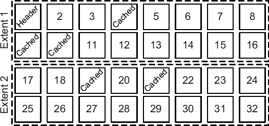
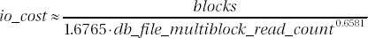
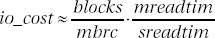
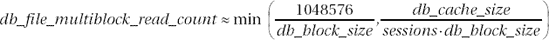
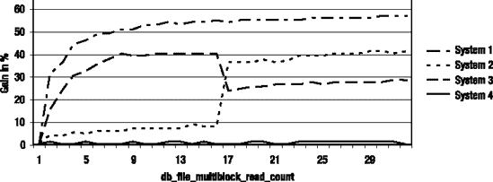

# Oracle 数据库中的多块读操作与性能优化

## 数据段的物理结构

作为示例，图 5-2 展示了存储在数据库中的一个段的结构。和任何段一样，它由区组成（本例中是两个），每个区又由块组成（本例中是 16 个）。第一个区的第一个块是段头。一些块（4、9、10、19 和 21）已被缓存在缓冲区缓存中。因此，执行此段串行全扫描（并行全扫描具有将在第 11 章中描述的特殊行为）的数据库引擎进程将无法执行任何物理读取，即使初始化参数 `db_file_multiblock_read_count` 被设置为大于或等于 32 的值。



**图 5-2.** *数据段的结构*

## 物理读操作示例

如果将初始化参数 `db_file_multiblock_read_count` 设置为 8，那么将执行以下物理读取：

*   一次段头（块 1）的单块读取。
*   一次读取两个块（2 和 3）的多块读取。由于块 4 被缓存，无法读取更多块。
*   一次读取四个块（从 5 到 8）的多块读取。由于块 9 被缓存，无法读取更多块。
*   一次读取六个块（从 11 到 16）的多块读取。由于块 16 是该区的最后一个块，无法读取更多块。
*   一次读取两个块（17 和 18）的多块读取。由于块 19 被缓存，无法读取更多块。
*   一次块 20 的单块读取。由于块 21 被缓存，无法读取更多块。
*   一次读取八个块（从 22 到 29）的多块读取。由于初始化参数 `db_file_multiblock_read_count` 设置为 8，无法读取更多块。
*   一次读取三个块（从 30 到 32）的多块读取。

总之，该进程执行了两次单块读取和六次多块读取。一次多块读取平均读取的块数约为四。平均值小于八这一事实解释了为什么 Oracle 在系统统计信息中引入了 `mbrc` 值。

## 多块读操作的成本计算

此时，了解查询优化器如何计算多块读操作（例如，全表扫描或索引快速全扫描）的成本也很重要。正如 Wolfgang Breitling 在论文"A Look Under the Hood of CBO: The 10053 Event"中指出的，当没有可用的系统统计信息时，成本计算可以很好地用公式 5-1 建模。



**公式 5-1.** *无系统统计信息时的多块读操作 I/O 成本*

当有工作负载系统统计信息可用时，I/O 成本不再依赖于初始化参数 `db_file_multiblock_read_count` 的值。它通过公式 5-2 计算。请注意，`mreadtim` 除以 `sreadtim` 是因为查询优化器根据单块读取对成本进行归一化，正如前一章（公式 4-2）已经讨论过的。



**公式 5-2.** *有工作负载统计信息时的多块读操作 I/O 成本*

在公式 5-2 中，对于无工作负载统计信息的情况，`mbrc` 被替换为初始化参数 `db_file_multiblock_read_count` 的值，`sreadtim` 被替换为由公式 4-3 计算的值，`mreadtim` 被替换为由公式 4-4 计算的值。

这意味着只有在工作负载统计信息不可用时，初始化参数 `db_file_multiblock_read_count` 才会直接影响多块读操作的成本。这也意味着过高的值可能导致过度的全表扫描，或者至少会低估多块读操作的成本。此外，这是工作负载统计信息优于无工作负载统计信息或完全没有系统统计信息的另一种情况。

## 如何设置 `db_file_multiblock_read_count`

现在你已经看到了成本公式，我必须描述如何找出此参数应设置的值。最重要的是要认识到多块读是一项性能特性。因此，初始化参数 `db_file_multiblock_read_count` 应设置为能实现最佳性能的值。为此，必须认识到更高的值并非在所有情况下都能提供更好的性能。此外，超过操作系统支持的最大物理 I/O 大小是没有意义的。一个简单的全表扫描配合不同的值，可以提供关于此初始化参数影响的有用信息，从而帮助找到最优值。以下 PL/SQL 块（摘自脚本 `assess_dbfmbrc.sql`）可用于此目的：

```
DECLARE
  l_count PLS_INTEGER;
  l_time PLS_INTEGER;
  l_starting_time PLS_INTEGER;
  l_ending_time PLS_INTEGER;
BEGIN
  dbms_output.put_line('dbfmbrc seconds');
  FOR l_dbfmbrc IN 1..32
  LOOP
    EXECUTE IMMEDIATE 'ALTER SESSION SET db_file_multiblock_read_count='||l_dbfmbrc;
    l_starting_time := dbms_utility.get_time();
    SELECT /*+ full(t) */ count(*) INTO l_count FROM big_table t;
    l_ending_time := dbms_utility.get_time();
    l_time := round((l_ending_time-l_starting_time)/100);
    dbms_output.put_line(l_dbfmbrc||' '||l_time);
  END LOOP;
END;
```

如你所见，这并不难，因为初始化参数 `db_file_multiblock_read_count` 是动态的，可以在实例和会话级别更改。无论如何，请注意不要在数据库、操作系统和 I/O 子系统级别缓存测试表，这将使测试失效。最简单的避免方法是使用比系统中最大缓存还要大的表。请注意，这里避免了并行处理，因为数据库引擎通常使用不同的系统调用来执行并行全表扫描和串行全表扫描。

## 不同系统上的性能影响

图 5-3 展示了使用上述 PL/SQL 块测量的几个系统的特性：

*系统 1*：

性能随着 I/O 大小的增大而提高。对于 8 到 10 的值，增益显著。更大的值带来的好处很小。

*系统 2*：

高达 16 的值性能不佳（增益小于 10%）。从 16 切换到 17，增益增加了 30%。大于 17 的值提供的益处很小。对于此系统，应避免小于 17 的值。

*系统 3*：

对于高达 8 的值，增益显著。对于 8 到 16 之间的值，增益稳定。从 16 切换到 17，增益下降了 16%。对于此系统，应避免大于 16 的值。

*系统 4*：

此系统的性能与 I/O 大小无关。

## 自动配置

从 Oracle Database 10*g* Release 2 开始，还可以指示数据库引擎自动配置初始化参数 `db_file_multiblock_read_count` 的值。要使用此功能，只需不设置它即可。如公式 5-3 所示，数据库引擎随后会尝试将其设置为允许 1MB 物理读取的值。但同时，会应用一种完整性检查，如果缓冲区缓存的大小相对于数据库支持的会话数量相当小，则会减小该值。




**公式 5-3.** `db_file_multiblock_read_count` 初始化参数在 Oracle Database 10g Release 2 中的默认值



**图 5-3.** I/O 大小对四台不同系统上全表扫描性能的影响

如前所述，由于使用最大 I/O 大小的物理读操作并非总是表现更好，因此不建议使用此功能。最好还是根据具体情况找出最优值。

请注意，如果在此自动配置中未使用工作负载统计信息，在公式 5-2 中，`mbrc` 不会被自动配置的值替换，而是使用值 8。

## `optimizer_dynamic_sampling`

查询优化器过去仅基于存储在数据字典中的对象统计信息进行估计。随着动态采样的出现，这一情况发生了改变。事实上，一些统计信息也可能在解析阶段被动态收集。这意味着为了收集额外的信息，会对引用的对象执行一些查询。不幸的是，动态采样收集的统计信息既不存储在数据字典中，也不存储在其他任何地方。唯一能近乎重用它们的方式是直接重用共享游标本身。

初始化参数 `optimizer_dynamic_sampling` 的值（也称为*级别*）指定了动态采样的使用方式和时机。表 5-1 总结了可接受的值及其含义。请注意，默认值取决于初始化参数 `optimizer_features_enable`。

*   如果 `optimizer_features_enable` 设置为 10.0.0 或更高，默认为级别 2。
*   如果 `optimizer_features_enable` 设置为 9.2.0，默认为级别 1。
*   如果 `optimizer_features_enable` 设置为 9.0.1 或更低，则禁用动态采样。

该参数是动态的，可以在实例级别使用 SQL 语句 `ALTER SYSTEM` 更改，也可以在会话级别使用 SQL 语句 `ALTER SESSION` 更改。此外，还可以通过提示 `dynamic_sampling` 在语句级别指定一个值。该提示有两个可用选项：

*   可以为所有表设置一个值：`dynamic_sampling(`*`级别`*`)`
*   可以为特定表设置一个值：`dynamic_sampling(`*`表名 级别`*`)`

**表 5-1.** 动态采样级别及其含义

| 级别 | 动态采样何时使用？ | 块数^* |
| --- | --- | --- |
| 0 | 禁用动态采样。 | 0 |
| 1 | 动态采样用于没有对象统计信息的表。但是，这仅在满足以下三个条件时发生：表没有索引，是连接（也包括子查询或不可合并视图）的一部分，并且其块数多于用于采样的块数。 | 32 |
| 2 | 动态采样用于所有没有对象统计信息的表。 | 64 |
| 3 | 动态采样用于所有满足级别 2 标准的表，并且额外用于通过猜测来估计谓词选择性的表。 | 32 |
| 4 | 动态采样用于所有满足级别 3 标准的表，并且额外用于在 `WHERE` 子句中引用了两个或更多列的表。 | 32 |
| 5 | 与级别 4 相同。 | 64 |
| 6 | 与级别 4 相同。 | 128 |
| 7 | 与级别 4 相同。 | 256 |
| 8 | 与级别 4 相同。 | 1024 |
| 9 | 与级别 4 相同。 | 4096 |
| 10 | 与级别 4 相同。 | 全部 |
| ** 这是通过初始化参数或不带表名（或别名）的提示激活动态采样时使用的采样块数。当使用带表名（或别名）的提示时，除级别 10 外，块数通过以下公式计算：32*2^(级别-1)。 |

以下是一些示例（摘自在 10.2.0.3 版本上运行的脚本 `dynamic_sampling_levels.sql`），说明了在哪些情况下级别 1 到 4 会触发动态采样。测试所用的表通过以下 SQL 语句创建。最初，它们没有对象统计信息。请注意，表 `t_noidx` 和表 `t_idx` 之间的唯一区别是后者有一个主键。

```sql
CREATE TABLE t_noidx (id, n1, n2, pad) AS
SELECT rownum, rownum, round(dbms_random.value(1,100)), dbms_random.string('p',1000)
FROM all_objects
WHERE rownum <= 1000
```

```sql
CREATE TABLE t_idx (id PRIMARY KEY, n1, n2, pad) AS
SELECT *
FROM t_noidx
```

第一次测试查询如下。它们之间的唯一区别是第一个引用了表 `t_noidx`，而第二个引用了表 `t_idx`。

```sql
SELECT *
FROM t_noidx t1, t_noidx t2
WHERE t1.id = t2.id AND t1.id < 19
```

```sql
SELECT *
FROM t_idx t1, t_idx t2
WHERE t1.id = t2.id AND t1.id < 19
```

如果级别设置为 1，动态采样仅对第一个查询执行，因为第二个查询引用的表是索引的。以下是在我的测试数据库上为表 `t_noidx` 收集统计信息的递归查询。为便于阅读，删除了一些提示并将绑定变量替换为字面量。请注意，在执行测试查询之前激活了 SQL 跟踪。然后，我只需检查生成的跟踪文件以找出执行了哪些递归 SQL 语句。

```sql
SELECT NVL(SUM(C1),0),
       NVL(SUM(C2),0),
       COUNT(DISTINCT C3),
       NVL(SUM(CASE WHEN C3 IS NULL THEN 1 ELSE 0 END),0)
FROM (
  SELECT 1 AS C1,
         CASE WHEN "T1"."ID"<19" THEN 1 ELSE 0 END AS C2,
         "T1"."ID" AS C3
  FROM "T_NOIDX" SAMPLE BLOCK (20,1) SEED (1) "T1"
) SAMPLESUB
```

以下是一些需要注意的重要点：

*   查询优化器统计总行数、`WHERE` 子句中指定范围（`id < 19`）内的行数，以及列 `id` 的不同值数量和 `NULL` 值数量。
*   查询中使用的值必须是已知的。如果使用了绑定变量，查询优化器必须能够窥视值才能执行动态采样。
*   使用 `SAMPLE` 子句执行采样。在我的数据库中，表 `t_noidx` 有 155 个块，因此采样百分比为 20%（32/155）。

如果级别设置为 2，两个测试查询都会执行动态采样，因为在该级别下，当缺少对象统计信息时总是使用动态采样。用于为两个表收集统计信息的递归查询与前面显示的相同。采样百分比增加了，因为在该级别下，它是基于 64 个块而不是 32 个块。此外，对于表 `t_idx`，还会执行以下递归查询。其目的是扫描索引，而不是像前一个查询那样扫描表。这是因为对表的快速采样可能会错过 `WHERE` 子句中谓词指定的范围内的行。而快速扫描索引则肯定能定位到这些行（如果存在的话）。

```sql
SELECT NVL(SUM(C1),0), NVL(SUM(C2),0), NVL(SUM(C3),0)
FROM (
  SELECT 1 AS C1, 1 AS C2, 1 AS C3
  FROM "T_IDX" "T1"
  WHERE "T1"."ID"<19 AND ROWNUM <= 2500
) SAMPLESUB
```

下一个动态采样级别是 3。从该级别开始，即使数据字典中已有对象统计信息，也会使用动态采样。在执行进一步测试之前，使用以下 PL/SQL 块收集了对象统计信息：


