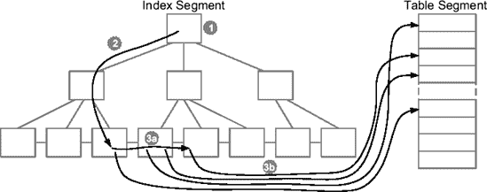
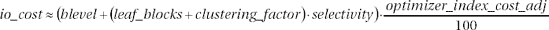

# 动态采样与优化器参数

## 动态采样的工作原理

如果动态采样级别设置为 3 或更高，查询优化器将执行动态采样，通过测量表样本行的选择性来估计谓词的选择性，而不是使用数据字典统计信息和可能的硬编码值。以下两个查询说明了这一点：

```sql
SELECT *
FROM t_idx
WHERE id = 19
```

```sql
SELECT *
FROM t_idx
WHERE round(id) = 19
```

对于第一个查询，查询优化器能够基于列统计信息和直方图估计谓词 `id=19` 的选择性，因此不需要动态采样。而对于第二个查询（除非为表达式 `round(id)` 设置了扩展统计信息），查询优化器无法推断谓词 `round(id)=19` 的选择性。实际上，列统计信息和直方图仅提供关于列 `id` 本身的信息，而不是其四舍五入后的值。用于动态采样的查询如下所示。如你所见，它与之前讨论的查询具有相同的结构。列 `c2` 不同，因为导致动态采样的 SQL 语句的 `WHERE` 子句不同。由于对索引列 (`id`) 应用了表达式，即使对于表 `t_idx`，在此特定情况下也不会对索引进行采样。

```sql
SELECT NVL(SUM(C1),0), NVL(SUM(C2),0), COUNT(DISTINCT C3)
FROM (
  SELECT 1 AS C1,
         CASE WHEN ROUND("T_IDX"."ID")=19 THEN 1 ELSE 0 END AS C2,
         ROUND("T_IDX"."ID") AS C3
  FROM "T_IDX" SAMPLE BLOCK (20,1) SEED (1) "T_IDX"
) SAMPLESUB
```

如果级别设置为 4 或更高，当 `WHERE` 子句中引用了同一表的两个或多个列时，查询优化器会执行动态采样。这对于改善相关列的估计非常有用。以下查询提供了一个示例。回顾用于创建测试表的 SQL 语句，你会注意到列 `id` 和 `n1` 包含相同的数据。

```sql
SELECT *
FROM t_idx
WHERE id < 19 AND n1 < 19
```

同样在这种情况下，查询优化器执行动态采样，使用的查询与之前的查询结构相同。主要区别再次源于导致动态采样的 SQL 语句的 `WHERE` 子句。

```sql
SELECT NVL(SUM(C1),0), NVL(SUM(C2),0)
FROM (
  SELECT 1 AS C1,
         CASE WHEN "T_IDX"."ID"<19 AND "T_IDX"."N1"<19 THEN 1 ELSE 0 END AS C2
  FROM "T_IDX" SAMPLE BLOCK (20,1) SEED (1) "T_IDX"
) SAMPLESUB
```

总而言之，级别 1 和 2 通常不太有用。实际上，表和索引应该具有最新的对象统计信息。一个常见的例外是使用临时表时。通常，临时表没有可用的对象统计信息。无论如何，请注意，即使它们的临时表包含非常不同的数据集，多个会话也可能共享完全相同的游标。级别 3 及更高对于改善“复杂”谓词的选择性估计非常有用。因此，如果查询优化器由于“复杂”谓词而无法做出正确的估计，请将初始化参数 `optimizer_dynamic_sampling` 设置为 4。否则，请保持其默认值。无论如何，如第 4 章所述，从 Oracle Database 11*g* 开始，可以收集表达式和列组上的统计信息。因此，在许多情况下应该可以避免动态采样。

## `optimizer_index_cost_adj`

初始化参数 `optimizer_index_cost_adj` 用于更改通过索引扫描访问表的成本。有效值范围从 1 到 10,000，默认值为 100。大于 100 的值会使索引扫描成本更高，从而有利于全表扫描。小于 100 的值会使索引扫描成本更低。

为了理解此初始化参数对成本计算公式的影响，描述查询优化器如何基于*索引范围扫描*计算与表访问相关的成本是很有用的。

索引范围扫描是对多个键的索引查找。如图 5-4 所示，会执行以下操作。

1. 访问索引的根块。
2. 遍历分支块以定位包含第一个键的叶块。
3. 对于满足搜索条件的每个键，执行以下操作：
   1. 提取引用数据块的 `rowid`。
   2. 访问由 `rowid` 引用的数据块。



**图 5-4.** *基于索引范围扫描的表访问期间执行的操作*

索引范围扫描执行的物理读取次数等于：为定位包含第一个键的叶块而访问的分支块数量（统计信息 `blevel`），加上扫描的叶块数量（统计信息 `leaf_blocks` 乘以操作的选择性），再加上通过 `rowid` 访问的数据块数量（`clustering_factor` 乘以操作的选择性）。这给出了公式 5-4，其中还考虑了由初始化参数 `optimizer_index_cost_adj` 应用的校正。



**公式 5-4.** *基于索引范围扫描的表访问的 I/O 成本*

***

**注意** 在公式 5-4 中，使用相同的选择性来计算索引访问成本和表访问成本。实际上，查询优化器可能会为这两种不同的成本使用两种不同的选择性。当只有部分过滤器通过索引访问应用时，这是必要的。例如，当一个索引由三列组成且第二列没有限制时，就会发生这种情况。

***

总之，你看到初始化参数 `optimizer_index_cost_adj` 对索引访问的 I/O 成本有直接影响。当它设置为小于默认值时，所有成本都会成比例地降低。在某些情况下，这可能是个问题，因为查询优化器会对其估计结果进行四舍五入。这意味着，即使多个索引的对象统计信息不同，就查询优化器而言，它们可能具有相同的成本。如果多个成本值相等，查询优化器会根据索引的名称做出决定！它只是简单地采用字母顺序中的第一个。以下示例演示了这个问题。请注意，当初始化参数 `optimizer_index_cost_adj` 和索引名称更改时，用于 `INDEX RANGE SCAN` 操作的索引如何变化。这是由脚本 `optimizer_index_cost_adj.sql` 生成的输出摘录：

```sql
SQL> ALTER SESSION SET optimizer_index_cost_adj = 100;

SQL> SELECT * FROM t WHERE val1 = 11 AND val2 = 11;

------------------------------------------------
| Id  | Operation                   | Name     |
------------------------------------------------
|   0 | SELECT STATEMENT            |          |
|*  1 |  TABLE ACCESS BY INDEX ROWID| T        |
|*  2 |   INDEX RANGE SCAN          | T_VAL2_I |
------------------------------------------------

   1 - filter("VAL1"=11)
   2 - access("VAL2"=11)

SQL> ALTER SESSION SET optimizer_index_cost_adj = 10;

SQL> SELECT * FROM t WHERE val1 = 11 AND val2 = 11;
```


