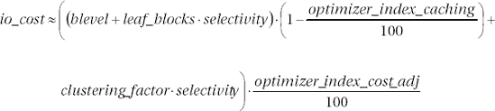
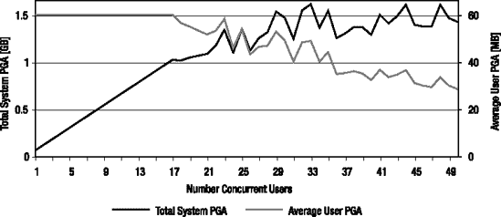
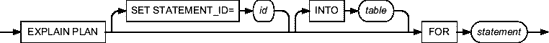

# Oracle 查询优化器初始化参数

## 表访问的 I/O 成本

```
------------------------------------------------
| Id  | Operation                    | Name     |
------------------------------------------------
|   0 | SELECT STATEMENT             |          |
|*  1 |  TABLE ACCESS BY INDEX ROWID | T        |
|*  2 |   INDEX RANGE SCAN           | T_VAL1_I |
------------------------------------------------

   1 - filter("VAL2"=11)
   2 - access("VAL1"=11)

SQL> ALTER INDEX t_val1_i RENAME TO t_val3_i;

SQL> SELECT * FROM t WHERE val1 = 11 AND val2 = 11;
------------------------------------------------
| Id  | Operation                    | Name     |
------------------------------------------------
|   0 | SELECT STATEMENT             |          |
|*  1 |  TABLE ACCESS BY INDEX ROWID | T        |
|*  2 |   INDEX RANGE SCAN           | T_VAL2_I |
------------------------------------------------

   1 - filter("VAL1"=11)
   2 - access("VAL2"=11)
```

为了避免这种不稳定性，通常不建议将初始化参数 `optimizer_index_cost_adj` 设置为较低的值。同样重要的是要提到，系统统计信息提供了与此参数类似的调整。这意味着，如果系统统计信息已就绪，通常默认值就是合适的。同时请注意，系统统计信息没有此参数的缺点，因为它们增加成本而不是降低成本。

初始化参数 `optimizer_index_cost_adj` 是动态的，可以在实例和会话级别进行更改。

## `optimizer_index_caching`

初始化参数 `optimizer_index_caching` 用于指定在执行 in-list 迭代器和嵌套循环连接期间，预计缓存在缓冲区高速缓存中的索引块数量（百分比）。值得注意的是，此初始化参数的值被查询优化器用于调整其估计值。换句话说，它并不指定数据库引擎实际缓存了每个索引的多少。有效值范围从 0 到 100。默认值为 0。大于 0 的值会降低为 in-list 迭代器和嵌套循环连接的内部循环执行的索引扫描的成本。因此，它被用来推动这些操作的使用。

公式 5-5 展示了应用于上一节（公式 5-4）中提出的索引范围扫描成本公式的修正。



**公式 5-5.** 基于索引范围扫描的表访问的 I/O 成本

此初始化参数与我前面谈到的初始化参数 `optimizer_index_cost_adj` 有一些共同的缺点。然而，它的影响范围较小，主要有两个原因。首先，它仅用于嵌套循环和 in-list 迭代器。其次，在用于索引范围扫描的成本公式（公式 5-5）中，它对聚类因子没有影响。由于聚类因子通常是成本公式中最大的因素，因此此初始化参数导致错误决策的可能性较小。总之，此初始化参数对查询优化器的影响小于初始化参数 `optimizer_index_cost_adj`。尽管如此，默认值通常就是合适的。

初始化参数 `optimizer_index_caching` 是动态的，可以在实例和会话级别进行更改。

## `optimizer_secure_view_merging`

初始化参数 `optimizer_secure_view_merging` 从 Oracle Database 10*g* Release 2 开始可用，用于控制视图合并。它可以设置为 `FALSE` 或 `TRUE`。默认值为 `TRUE`。

-   `FALSE` 允许查询优化器始终进行视图合并。
-   `TRUE` 仅当进行视图合并不会导致安全问题时，才允许查询优化器进行视图合并。

要理解此初始化参数的影响，更一般地描述视图合并，让我们看下面的示例（完整示例在脚本 `optimizer_secure_view_merging.sql` 中提供）。

假设你有一个非常简单的表，包含一个主键和另外两列：

```sql
CREATE TABLE t (
  id NUMBER(10) PRIMARY KEY,
  class NUMBER(10),
  pad VARCHAR2(10)
)
```

出于安全原因，你希望通过以下视图提供对该表的访问。注意通过函数应用的过滤器，以部分显示表的内容。该函数如何实现以及其具体作用并不重要。

```sql
CREATE OR REPLACE VIEW v AS
SELECT *
FROM t
WHERE f(class) = 1
```

另一个有权访问该视图的用户使用如下查询。注意对主键的限制，确保最多返回五行。

```sql
SELECT id, pad
FROM v
WHERE id BETWEEN 1 AND 5
```

从性能角度来看，查询优化器现在有两个选择。第一个选项是从视图中选择所有行，然后应用过滤器 `id BETWEEN 1 AND 5`。当然，如果视图返回大量数据，即使用户执行的查询提供了对主键的限制，性能也会非常差。第二个选项是将视图的查询与用户的查询合并，如下所示：

```sql
SELECT id, pad
FROM t
WHERE f(class) = 1
AND id BETWEEN 1 AND 5
```

使用此查询，可以立即应用对主键的限制。因此，无论表中存储的数据量如何，性能都会很好。只要有可能，查询优化器就会利用视图合并。然而，这并不适用于所有情况。例如，当视图在 `SELECT` 子句中包含分组函数、集合运算符或层次查询时，查询优化器无法使用视图合并。这样的视图被称为**不可合并视图**。

现在你理解了视图合并，是时候看看为什么视图合并可能从安全角度来看是危险的。假设，有权访问视图的用户创建了以下 PL/SQL 函数。如你所见，它只是通过调用包 `dbms_output` 来显示输入参数的值：

```sql
CREATE OR REPLACE FUNCTION spy (id IN NUMBER, pad IN VARCHAR2) RETURN NUMBER AS
BEGIN
  dbms_output.put_line('id='||id||' pad='||pad);
  RETURN 1;
END;
```

将初始化参数 `optimizer_secure_view_merging` 设置为 `FALSE` 后，你可以运行两个测试查询。两个查询都只返回用户允许查看的值。然而，在第二个查询中，借助视图合并和添加到查询中的函数，你能够看到本不应访问的数据。

```sql
SQL> SELECT id, pad
  2  FROM v
  3  WHERE id BETWEEN 1 AND 5;

        ID PAD
---------- ----------
         1 DrMLTDXxxq
         4 AszBGEUGEL

SQL> SELECT id, pad
  2  FROM v
  3  WHERE id BETWEEN 1 AND 5
  4  AND spy(id, pad) = 1;

        ID PAD
---------- ----------
         1 DrMLTDXxxq
         4 AszBGEUGEL

id=1 pad=DrMLTDXxxq
id=2 pad=XOZnqYRJwI
id=3 pad=nlGfGBTxNk
id=4 pad=AszBGEUGEL
id=5 pad=qTSRnFjRGb
```

将初始化参数 `optimizer_secure_view_merging` 设置为 `TRUE`，第二个查询返回以下输出。如你所见，函数和查询显示了相同的数据。

```sql
SQL> SELECT id, pad
  2  FROM v
  3  WHERE id BETWEEN 1 AND 5
  4  AND spy(id, pad) = 1;

        ID PAD
---------- ----------
         1 DrMLTDXxxq
         4 AszBGEUGEL

id=1 pad=DrMLTDXxxq
id=4 pad=AszBGEUGEL
```


总之，当初始化参数 `optimizer_secure_view_merging` 设置为 `TRUE` 时，查询优化器会检查视图合并是否可能导致安全问题。如果存在这种情况，将不会执行视图合并，因此性能可能不是最优。基于此原因，如果您并非出于安全目的使用视图，最好将此初始化参数设置为 `FALSE`。

初始化参数 `optimizer_secure_view_merging` 是动态的，可以在实例级别更改。它不能在会话级别更改。但是，拥有对象权限 `MERGE VIEW` 或系统权限 `MERGE ANY VIEW` 的用户不受此初始化参数所施加的限制。

## PGA 管理

将数据存储在内存中的操作（通常是排序操作和哈希连接）使用 *工作区* 来执行。这些工作区分配在每个服务器进程的私有内存中（PGA）。以下部分将描述专门用于配置这些工作区的初始化参数。

通常，更大的工作区能提供更好的性能。因此，您应该将系统上可用的未使用内存分配给 PGA。不过，更改时需要小心。工作区的大小也会影响查询优化器的估计。您应该预期到不仅性能会改变，执行计划也会变化。换句话说，如果您想避免意外情况，任何修改都应经过仔细测试。

一般来说，本节不会为其描述的初始化参数提供具体数值。为特定应用程序找到合适值的唯一方法是测试并衡量需要多少 PGA 才能获得良好的性能。事实上，内存量仅影响性能，而不影响操作的执行方式。

### workarea_size_policy

初始化参数 `workarea_size_policy` 指定了如何执行这些工作区的大小调整。它可以设置为以下两个值之一：

`auto`:

单个工作区的大小调整委托给 `memory manager`（内存管理器）。通过初始化参数 `pga_aggregate_target`，仅指定整个系统的 PGA 总量。这是自 Oracle Database *10g* 起的默认值。

`manual`:

通过初始化参数 `bitmap_merge_area_size`、`hash_area_size`、`sort_area_size` 和 `sort_area_retained_size`，您可以完全控制工作区的大小。这是 Oracle9*i* 中的默认值。

在大多数情况下，`memory manager` 都能很好地工作，因此强烈建议将 PGA 管理委托给它。以下是例外情况：

*   在 Oracle9*i* 中，自动 PGA 管理在共享服务器（以前称为 `multithreaded server`）上不受支持。仅支持手动 PGA 管理。自 Oracle Database *10g* 起，自动 PGA 管理在共享服务器上同样得到支持。
*   截至 Oracle Database *10g* Release 1，工作区的最大大小被人为限制（例如，对于串行操作限制为 100MB），并且只能通过更改未文档化的参数来增加。如果工作区的大小需要远大于这些限制，这是一个重要的限制。自 Oracle Database *10g* Release 2 起，限制会随着可用内存的增加而自动提高。
*   在极少数情况下，手动微调能比自动 PGA 管理提供更好的结果。

初始化参数 `workarea_size_policy` 是动态的，可以在实例和会话级别更改。也可以在系统级别启用自动 PGA 管理，然后针对特殊需求，在会话级别切换到手动 PGA 管理。

### pga_aggregate_target

如果启用了自动 PGA 管理，初始化参数 `pga_aggregate_target` 指定（以字节为单位）专用于一个实例的 PGA 总量。支持从 10MB 到 4TB 的值。在 Oracle9*i* 中，默认值为 0。自 Oracle Database *10g* 起，默认值是 `system global area`（SGA）大小的 20%。很难给出任何关于应使用何种具体数值的建议。然而，在大多数系统上，每个并发用户至少需要几兆字节。

* * *

**注意** 自 Oracle Database *11g* 起，可以使用初始化参数 `memory_target` 和 `memory_max_target` 来指定实例使用的总内存量（即 SGA + PGA）。当设置它们时，实例会在 SGA 和 PGA 之间根据需要自动重新分配内存。在此类配置中，初始化参数 `pga_aggregate_target` 仅用于设置 PGA 的最小大小。

* * *


理解初始化参数 `pga_aggregate_target` 的值不是一个硬性限制，而是一个目标，这一点非常重要。因此，如果指定的值过小，数据库引擎可以自由分配比初始化参数 `pga_aggregate_target` 指定值更多的内存。为了说明这种行为，我执行了一个需要大约 60MB PGA 的查询，并逐步增加并发用户数（从 1 到 50）。初始化参数 `pga_aggregate_target` 被设置为 1GB。这意味着最多应该有 17 个用户（1GB/60MB）能够在内存中获得执行完整语句所需的 PGA。图 5-5 显示了测试结果。如你所见，系统 PGA 增加到了 1.6GB，这高于配置的值。正如预期的那样，系统 PGA 仅在并发用户数达到 17 之前与用户数成比例增加。当用户数超过 17 时，系统开始减少分配给每个用户的 PGA 量。



图 5-5. 内存管理器会自动调整提供给用户的 PGA 量。

要了解你的系统是否正在经历 PGA 的过度分配，可以使用以下查询。如果 `maximum PGA allocated` 的值远高于 `aggregate PGA target parameter` 的值，那么初始化参数 `pga_aggregate_target` 的值可能不合适。

```sql
SELECT name, value, unit
  FROM v$pgastat
 WHERE name IN ('aggregate PGA target parameter','maximum PGA allocated');
```

```
NAME                              VALUE        UNIT
-------------------------------- ------------ -----
aggregate PGA target parameter    1073741824   bytes
maximum PGA allocated             1648665600   bytes
```

初始化参数 `pga_aggregate_target` 是动态的，只能在实例级别更改。

`sort_area_size`

如果启用了手动 PGA 管理，初始化参数 `sort_area_size` 以字节为单位指定用于合并连接、排序和聚合（包括哈希分组）的工作区的大小。请注意：这是一个工作区的大小，而单个会话可能会分配多个工作区。这意味着整个系统使用的 PGA 总量取决于分配的工作区数量，而不是会话数量。默认值是 64KB。尽管很难给出关于建议值的一般性建议，但默认值非常小，通常应至少使用 512KB/1MB。重要的是，工作区并不总是完全分配的。换句话说，初始化参数 `sort_area_size` 指定的值只是一个限制。因此，指定一个比实际需要更大的值不一定是问题。

初始化参数 `sort_area_size` 是动态的，可以在实例和会话级别更改。

`sort_area_retained_size`

在上一节中，你看到初始化参数 `sort_area_size` 指定了用于排序操作的工作区的大小。然而，严格来说，初始化参数 `sort_area_size` 仅指定排序操作进行时用作临时工作区的内存量。在获取最后一行并将其包含在存储于工作区中的排序结果后，仍然只需要内存作为缓冲区将排序结果返回给父操作。初始化参数 `sort_area_retained_size` 以字节为单位指定了为该读取缓冲区保留的内存量。此初始化参数仅在启用手动 PGA 管理时使用。默认值源自初始化参数 `sort_area_size`。请注意，默认情况下，动态性能视图 `v$parameter` 显示为 0。

要设置此初始化参数，你必须注意，如果将其设置为低于初始化参数 `sort_area_size` 的值，并且结果集无法放入保留的内存中，则在排序操作完成时，数据将溢出到临时段中。即使排序操作本身完全在内存中执行，也可能发生这种情况！因此，为了获得更好的性能，建议使用默认值。只有在系统确实内存不足时，设置此参数才有意义。

初始化参数 `sort_area_retained_size` 是动态的，可以在实例和会话级别更改。

`hash_area_size`

如果启用了手动 PGA 管理，初始化参数 `hash_area_size` 以字节为单位指定用于哈希连接的工作区的大小。请注意，这是一个工作区的大小，而单个会话可能会分配多个工作区。这意味着整个系统使用的 PGA 总量取决于分配的工作区数量，而不是会话数量。默认值是初始化参数 `sort_area_size` 值的两倍。同样，很难建议具体值。无论如何，对于高达 4MB 的值，它应至少设置为初始化参数 `sort_area_size` 值的四到五倍。否则，查询优化器可能会高估哈希连接的成本，从而倾向于合并连接。再次强调，工作区并不总是完全分配的。换句话说，初始化参数 `hash_area_size` 指定的值只是一个限制。指定一个比实际需要更大的值不一定是问题。

初始化参数 `hash_area_size` 是动态的，可以在实例和会话级别更改。

`bitmap_merge_area_size`

如果启用了手动 PGA 管理，初始化参数 `bitmap_merge_area_size` 以字节为单位指定用于合并与位图索引相关的位图的工作区的大小。默认值是 1MB。再次强调，很难给出关于建议值的一般性建议。显然，如果使用大量位图索引（例如，由于星型转换——参见第 10 章），更大的值可能会提高性能。

初始化参数 `bitmap_merge_area_size` 是静态的，不能在系统或会话级别更改。因此，需要重启实例才能更改它。

### 进入第 6 章

本章描述了如何通过设置初始化参数来实现查询优化器的良好配置。你看到，不仅理解初始化参数如何工作很重要，理解对象和系统统计信息如何影响查询优化器也很关键。

即使配置得当，查询优化器也可能无法找到高效的执行计划。当 SQL 语句的性能受到质疑时，首先要做的就是查看执行计划。下一章将讨论如何获取执行计划，更重要的是，如何解读它们。我还将介绍一些识别低效执行计划的规则。

* * *

1. 肯尼亚谚语是“和平代价高昂，但物有所值。”你可以在 [`www.quotationspage.com/quote/38863.html`](http://www.quotationspage.com/quote/38863.html) 找到这句引言。

2. 完美在软件开发中如同在你所能想象的几乎所有其他活动中一样，是无法实现的。这条规则，即使你和 Oracle 都不喜欢它，也同样适用于查询优化器。因此，你应该预期一小部分 SQL 语句将需要手动干预（此主题在第 7 章中讨论）。


### 第 6 章
执行计划

`An` *执行计划* 描述了 SQL 引擎为执行一条 SQL 语句所执行的操作。每当你要分析一条 SQL 语句相关的性能问题，或者仅仅是想质疑查询优化器做出的决策时，你都必须了解其执行计划。没有它，你就像一个在撒哈拉沙漠中央、拄着拐杖的盲人，摸索着试图找到方向。我再怎么强调也不为过：在分析或质疑一条 SQL 语句的性能时，首先要做的就是获取其执行计划。

每当处理一个执行计划时，你需要执行三个基本动作：获取它、解读它、判断其效率。本章的目的就是详细描述你应如何执行这三个动作。

#### 获取执行计划

基本上，Oracle 提供四种方法来获取执行计划：

*   执行 SQL 语句 `EXPLAIN PLAN`，然后查询输出写入的表。
*   查询一个动态性能视图，该视图显示缓存在库缓存中的执行计划。
*   查询一个自动工作负载信息库（Automatic Workload Repository）或 Statspack 表，该表显示存储在信息库中的执行计划。
*   激活一个提供执行计划的跟踪功能。

不存在其他方法。由于所有显示执行计划的工具都利用了上述方法之一，接下来的章节将只描述基础知识，而不是专注于诸如 Oracle Enterprise Manager 或 Quest TOAD 之类的特定工具。我在此也不讨论这类工具，因为通常它们并不能提供你进行彻底分析所需的所有信息。

#### SQL 语句 EXPLAIN PLAN

SQL 语句 `EXPLAIN PLAN` 的目的是以一条 SQL 语句作为输入，并在*计划表*中输出其执行计划及相关信息。换句话说，通过它可以询问查询优化器，对于给定的 SQL 语句，将会使用哪个执行计划。

**语法与权限**

图 6-1 展示了 SQL 语句 `EXPLAIN PLAN` 的语法。可用参数如下：

*   `statement` 指定应提供哪条 SQL 语句的执行计划。支持以下 SQL 语句：`SELECT, INSERT, UPDATE, MERGE, DELETE, CREATE TABLE, CREATE INDEX` 和 `ALTER INDEX`。
*   `id` 指定一个名称，用于区分存储在计划表中的多个执行计划。支持最多 30 个字符的任何字符串。此参数可选。默认值为 `NULL`。
*   `table` 指定计划表的名称，有关执行计划的信息将被插入该表。此参数可选。默认值为 `plan_table`。必要时，可以使用常规语法指定模式名以及数据库链接名：`schema.table@dblink`。



**图 6-1.** *SQL 语句 `EXPLAIN PLAN` 的语法*

重要的是要认识到，SQL 语句 `EXPLAIN PLAN` 是一条 DML 语句，而不是 DDL 语句。这意味着它不会对当前事务执行隐式提交。它只是向计划表中插入行。

要执行 SQL 语句 `EXPLAIN PLAN`，需要具备执行作为参数传递的 SQL 语句的权限。注意，当处理视图时，还需要对所有底层表和视图具有适当的权限。由于这一点可能违反直觉，让我们看下面的例子。注意该用户能够执行引用视图 `user_objects` 的查询，但却无法为完全相同的查询执行 SQL 语句 `EXPLAIN PLAN`。

```
SQL> SELECT count(*) FROM user_objects;

  COUNT(*)
----------
        10

SQL> EXPLAIN PLAN FOR SELECT count(*) FROM user_objects;
EXPLAIN PLAN FOR SELECT count(*) FROM user_objects
                                     *
ERROR at line 1:
ORA-01039: insufficient privileges on underlying objects of the view
```

如错误信息所指出的，该用户缺少对视图 `user_objects` 引用的一个或多个数据字典表的 `SELECT` 权限。

**计划表**

计划表是 SQL 语句 `EXPLAIN PLAN` 写入输出的地方。它必须存在；否则会引发错误。从 Oracle Database 10*g* 开始，默认情况下，在 `SYS` 模式下提供了一个计划表和一个向所有用户公开它的同义词 `plan_table`。在之前的版本中，或当需要私有表时，最佳实践是使用 `$ORACLE_HOME/rdbms/admin` 下的脚本 `utlxplan.sql` 手动创建它。如果手动创建了计划表，在数据库升级时不要忘记重新创建它。事实上，新版本中经常会添加新的属性。

有趣的是，从 Oracle Database 10*g* 开始创建的默认计划表是一个全局临时表，其数据存储直到会话结束。¹ 这样，多个并发使用它的用户就不会相互干扰。

要将计划表与 SQL 语句 `EXPLAIN PLAN` 一起使用，你至少需要 `INSERT` 和 `SELECT` 权限。尽管没有 `DELETE` 权限也可以执行基本操作，但通常也会授予该权限。

我不会在这里完整描述计划表，原因很简单：你通常不需要直接查询它。有关其列的详细描述，请参阅 *Performance Tuning Guide* 手册。²

**查询计划表**


