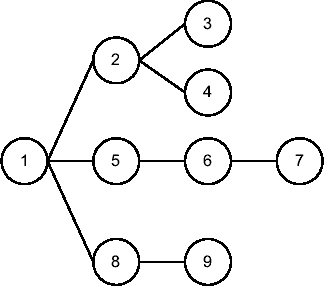
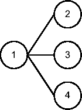
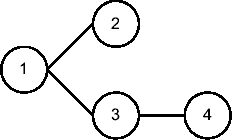

# 函数 display_awr

函数 `display_awr()` 返回存储在 AWR 中的执行计划。它从 Oracle Database 10*g* 开始可用。与函数 `display()` 一样，其返回值是集合 `dbms_xplan_type_table` 的一个实例。该函数具有以下输入参数：

*   `sql_id` 指定要返回其执行计划的父游标。该参数没有默认值。
*   `plan_hash_value` 指定要返回的执行计划的哈希值。默认值为 `NULL`。如果使用默认值，则返回与参数 `sql_id` 标识的父游标相关的所有执行计划。
*   `db_id` 指定在哪个数据库上执行要返回的执行计划。默认值为 `NULL`。如果使用默认值，则使用当前数据库。
*   `format` 指定显示哪些信息。支持与函数 `display()` 的 `format` 参数相同的值。默认值为 `typical`。

要使用函数 `display_awr()`，调用者至少需要在以下数据字典视图上具有 `SELECT` 权限：`dba_hist_sql_plan` 和 `dba_hist_sqltext`。如果未指定参数 `db_id`，则还需要在视图 `v$database` 上具有 `SELECT` 权限。角色 `select_catalog_role` 等提供这些权限。

以下查询展示了参数 `plan_hash_value` 在给定游标存在多个执行计划时的用处。请注意，第一个查询返回两个执行计划，而第二个查询仅返回一个。以下是脚本 `display_awr.sql` 生成的输出摘录：

```
SQL> SELECT *
  2  FROM table(dbms_xplan.display_awr('48vuyqjwpf9wg',NULL,NULL,'basic'));

PLAN_TABLE_OUTPUT
--------------------------------------

SQL_ID 48vuyqjwpf9wg
--------------------
SELECT COUNT(N) FROM T

Plan hash value: 2966233522
-----------------------------------
| Id  | Operation         | Name |
-----------------------------------
|   0 | SELECT STATEMENT  |      |
|   1 |  SORT AGGREGATE   |      |
|   2 |   TABLE ACCESS FULL| T    |
-----------------------------------

SQL_ID 48vuyqjwpf9wg
--------------------
SELECT COUNT(N) FROM T

Plan hash value: 3776247601

--------------------------------------
| Id  | Operation             | Name |
--------------------------------------
|   0 | SELECT STATEMENT      |      |
|   1 |  SORT AGGREGATE       |      |
|   2 |   INDEX FAST FULL SCAN| I    |
--------------------------------------

SQL> SELECT *
  2  FROM table(dbms_xplan.display_awr('48vuyqjwpf9wg',2966233522,NULL,'basic'));

PLAN_TABLE_OUTPUT
-----------------------------------

SQL_ID 48vuyqjwpf9wg
--------------------
SELECT COUNT(N) FROM T

Plan hash value: 2966233522

-----------------------------------
| Id  | Operation         | Name |
-----------------------------------
|   0 | SELECT STATEMENT  |      |
|   1 |  SORT AGGREGATE   |      |
|   2 |   TABLE ACCESS FULL| T    |
-----------------------------------
```

多种情况会导致给定游标出现多个执行计划，例如添加了索引，或者仅仅是因为数据（及其对象统计信息）发生了变化。基本上，每当查询优化器所处的环境发生变化时，就可能生成不同的执行计划。当您质疑一条您认为已稳定运行一段时间的 SQL 语句的性能时，这样的输出非常有用。其思路是检查一条 SQL 语句在一段时间内是否使用了多个执行计划来执行。如果是这种情况，则根据可用信息推断可能导致变化的原因。

### 解读执行计划

我一直感到惊讶的是，关于如何解读执行计划的文档如此之少，尤其是考虑到似乎有那么多人无法正确地解读它们。我将尝试通过描述我在解读执行计划时所采用的方法来解决这个问题。请注意，此处不提供有关不同操作的细节；相反，我提供理解如何解读执行计划所需的基础知识。关于最常见操作的详细信息，我将在第 4 部分中给出。以下各节提供的所有示例都是脚本 `execution_plans.sql` 生成的输出摘录。

#### 父子关系

执行计划是一个树形结构，它不仅描述了 SQL 引擎执行操作的顺序，还描述了操作之间的关系。树中的每个节点都是一个操作，例如表访问、连接或排序。操作（节点）之间存在父子关系。理解这些关系对于正确解读执行计划至关重要。父子关系遵循以下规则：

*   一个父节点有一个或多个子节点。
*   一个子节点只有一个父节点。
*   唯一没有父节点的操作是树的根节点。
*   当显示执行计划时，子节点相对于其父节点向右缩进。根据显示执行计划的方法不同，缩进可能是一个空格、两个空格或其他形式。这并不重要。关键在于，特定父节点的所有子节点都具有完全相同的缩进。
*   父节点位于其子节点之前（父节点的 ID 小于子节点的 ID）。如果子节点前面有多个具有相同缩进的操作，则最近的操作是父节点。

以下是一个执行计划示例。请注意，虽然只有 `Operation` 列是解读执行计划所必需的，但此处显示了 `Id` 列以帮助您更轻松地识别操作。生成此计划的 SQL 语句被故意省略，因为它不服务于本节的目的。

```
---------------------------------------
| Id  | Operation                     |
---------------------------------------
|   1 |  UPDATE                       |
|   2 |   NESTED LOOPS                |
|*  3 |    TABLE ACCESS FULL          |
|*  4 |    INDEX UNIQUE SCAN          |
|   5 |   SORT AGGREGATE              |
|   6 |    TABLE ACCESS BY INDEX ROWID|
|*  7 |     INDEX RANGE SCAN          |
|   8 |   TABLE ACCESS BY INDEX ROWID |
|*  9 |    INDEX UNIQUE SCAN          |
---------------------------------------
```

图 6-2 提供了该执行计划的图形化表示。使用前面描述的规则，您可以得出以下结论。

*   操作 1 是树的根节点。它有三个子节点：2、5 和 8。
*   操作 2 有两个子节点：3 和 4。
*   操作 3 和 4 没有子节点。
*   操作 5 有一个子节点：6。
*   操作 6 有一个子节点：7。
*   操作 7 没有子节点。
*   操作 8 有一个子节点：9。
*   操作 9 没有子节点。



**图 6-2.** 执行计划操作之间的父子关系

#### 操作类型

可能的操作数量很多（大约 200 个）。当然，要完全理解一个执行计划，您应该知道构成它的每个操作的作用。为了实现我们解读执行计划的目的，您只需要考虑三种主要的操作类型：`stand-alone operations`（独立操作）、`unrelated-combine operations`（非关联组合操作）和 `related-combine operations`（关联组合操作）。基本上，每种类型都有特定的行为，了解它对于解读执行计划来说就足够了。

* * *

**注意** 这里使用的三种操作类型的术语是我在几年前撰写关于查询优化器的演示文稿时创造的。不要期望在其他地方找到这些术语。

* * *

除了这三种类型，操作还可以分为阻塞操作和非阻塞操作。简单地说，阻塞操作批量处理数据，而非阻塞操作逐行处理数据。例如，排序操作是阻塞的，因为它只有在所有输入行都完全处理（排序）完毕后才能返回输出行——第一个输出行可能位于输入集中的任何位置。另一方面，应用简单限制的过滤器是非阻塞的，因为它独立评估每一行。不言而喻，对于阻塞操作，数据必须在内存（PGA）或磁盘（临时表空间）中进行缓冲。为简单起见，在解读执行计划时，您可以认为所有操作都是阻塞的。然而，请记住，大多数操作实际上是非阻塞的，并且出于显而易见的原因，SQL 引擎会尽可能避免数据缓冲。


##### 独立操作

我将所有最多只有一个子节点的操作称为 `独立操作`。大多数操作都属于此类。这使得执行计划的解读更为容易，因为不属于此类型的操作少于 20 个。管理独立操作运作的规则如下：

*   子节点在它们的父节点之前执行。然而，本章稍后介绍的两种优化技术会导致此规则的例外情况。
*   每个子节点最多执行一次。
*   每个子节点为其父节点提供数据。

以下是一个查询及其执行计划的示例（图 6-3 以图形方式展示了其父子关系）：

```
SELECT deptno, count(*) FROM emp WHERE job = 'CLERK' AND sal < 1200 GROUP BY deptno
```

```
--------------------------------------------------------------------
| Id  | Operation                    | Name      | Starts | A-Rows |
--------------------------------------------------------------------
|   1 |  HASH GROUP BY               |           |      1 |      2 |
|*  2 |   TABLE ACCESS BY INDEX ROWID| EMP       |      1 |      3 |
|*  3 |    INDEX RANGE SCAN          | EMP_JOB_I |      1 |      4 |
--------------------------------------------------------------------
   2 - filter("SAL"<1200)
   3 - access("JOB"='CLERK')
```


**图 6-3.** `独立操作`之间的父子关系

此执行计划仅由 `独立操作` 组成。通过应用前面描述的规则，你可以发现执行计划按以下方式执行操作：

1.  操作 1 和 2 各有一个子节点（分别为 2 和 3）；因此它们不可能是最先执行的操作。所以，执行从操作 3 开始。
2.  操作 3 通过应用访问谓词 `"JOB"='CLERK'` 来扫描索引 `emp_job_i`。在此过程中，它从索引中提取了四个 rowid（此信息在 `A-Rows` 列中给出）并将其传递给它的父操作（操作 2）。
3.  操作 2 通过操作 3 传递的四个 rowid 访问表 `emp`。对于每个 rowid，读取一行。然后，它应用过滤谓词 `"SAL"<1200`。这个过滤导致一行被排除。剩余三行的数据被传递给它的父操作（操作 1）。
4.  操作 1 对从操作 2 传递过来的行执行 `GROUP BY` 操作。结果集被缩减为两行。由于这是最后一个操作，数据被发送给调用者。

请注意 `Starts` 列清楚地显示每个操作只执行一次。其中一条规则规定子操作在父操作之前执行。这通常是正确的，但在某些情况下会引入智能优化。可能发生的情况是，父操作判断完全执行子操作没有意义，甚至判断执行子操作完全没有意义。换句话说，父操作控制子操作的执行。让我们看两个常见案例。

#### `COUNT STOPKEY` 操作的优化

`COUNT STOPKEY` 操作通常用于执行 top-n 查询。它的目标是，一旦所需的行数已返回给调用者，就停止处理。例如，以下查询的目标是仅返回在表 `emp` 中找到的前十行：

```
SELECT * FROM emp WHERE rownum <= 10
```

```
-----------------------------------------------------
| Id  | Operation          | Name | Starts | A-Rows |
-----------------------------------------------------
|*  1 |  COUNT STOPKEY     |      |      1 |     10 |
|   2 |   TABLE ACCESS FULL| EMP  |      1 |     10 |
-----------------------------------------------------
   1 - filter(ROWNUM<=10)
```

这个执行计划中需要注意的重要一点是，操作 2 返回的行数被限制为十行。即使操作 2 是对一个包含超过十行（实际上该表包含 14 行）的表的全表扫描，情况也是如此。发生的情况是，操作 1 在必要数量的行被处理后立即停止了操作 2 的处理。不过，要小心，因为非阻塞操作无法被停止。事实上，它们需要在将行返回给父操作之前被完全处理。例如，在以下查询中，由于 `ORDER BY` 子句，表 `emp` 的所有行都被读取：

```
SELECT * FROM (SELECT * FROM emp ORDER BY sal DESC) WHERE rownum <= 10
```

```
----------------------------------------------------------
| Id  | Operation               | Name | Starts | A-Rows |
----------------------------------------------------------
|*  1 |  COUNT STOPKEY          |      |      1 |     10 |
|   2 |   VIEW                  |      |      1 |     10 |
|*  3 |    SORT ORDER BY STOPKEY|      |      1 |     10 |
|   4 |     TABLE ACCESS FULL   | EMP  |      1 |     14 |
----------------------------------------------------------
```

#### `FILTER` 操作的优化

`FILTER` 操作不仅在其子节点向其传递数据时应用过滤器，而且它还可能决定完全避免执行某个子节点以及所有依赖操作（孙节点等）。例如，在以下查询中存在一个永远不可能为 `TRUE` 的谓词。在实践中，当应用程序动态生成部分 SQL 语句时，会发现此类谓词。通常，它们的目标是在特定情况下完全停用部分 SQL 语句。

```
SELECT * FROM emp WHERE job = 'CLERK' AND 1 = 2
```

```
--------------------------------------------------------------------
| Id  | Operation                    | Name      | Starts | A-Rows |
--------------------------------------------------------------------
|*  1 |  FILTER                      |           |      1 |      0 |
|   2 |   TABLE ACCESS BY INDEX ROWID| EMP       |      0 |      0 |
|*  3 |    INDEX RANGE SCAN          | EMP_JOB_I |      0 |      0 |
--------------------------------------------------------------------
1 - filter(NULL IS NOT NULL)
  3 - access("JOB"='CLERK')
```

根据前面描述的规则，这样的执行计划应该从处理操作 3 开始执行。实际上，查看 `Starts` 列可以告诉你只有操作 1 被执行了。这种优化简单地避免了处理操作 2 和 3，因为无论如何数据都没有机会通过操作 1 应用的过滤器。


## 无关联组合操作

我将所有拥有多个子操作且这些子操作被独立执行的操作称为**无关联组合操作**。以下操作属于此类型：`AND-EQUAL`、`BITMAP AND`、`BITMAP OR`、`BITMAP MINUS`、`CONCATENATION`、`CONNECT BY WITHOUT FILTERING`、`HASH JOIN`、`INTERSECTION`、`MERGE JOIN`、`MINUS`、`MULTI-TABLE INSERT`、`SQL MODEL`、`TEMP TABLE TRANSFORMATION` 和 `UNION-ALL`。

无关联组合操作的特点如下：

- 子操作在父操作之前执行。
- 子操作按顺序执行，从 ID 最小的操作开始，到 ID 最大的操作结束。在开始处理下一个子操作之前，必须完全执行完当前子操作。
- 每个子操作最多执行一次，并且独立于所有其他子操作。
- 每个子操作都向其父操作提供数据。

以下是一个查询示例及其执行计划（其父子关系的图形化表示见 图 6-4）：

```sql
SELECT ename FROM emp
UNION ALL
SELECT dname FROM dept
UNION ALL
SELECT '%' FROM dual
```

```
---------------------------------------------------------
|  Id  | Operation         |  Name  |  Starts | A-Rows  |
---------------------------------------------------------
|   1  | UNION-ALL         |        |       1 |      19 |
|   2  |  TABLE ACCESS FULL|  EMP   |       1 |      14 |
|   3  |  TABLE ACCESS FULL|  DEPT  |       1 |       4 |
|   4  |  FAST DUAL        |        |       1 |       1 |
---------------------------------------------------------
```



**图 6-4.** `无关联组合操作 UNION-ALL 的父子关系`

在这个执行计划中，无关联组合操作是 `UNION-ALL`。其他三个是独立操作。通过应用上述规则，你可以看到执行计划按如下方式执行操作：

1. 操作 1 有三个子操作，其中操作 2 按升序排列第一。因此，执行从操作 2 开始。
2. 操作 2 扫描 `emp` 表，并返回 14 行数据给其父操作（操作 1）。
3. 当操作 2 完全执行完毕后，操作 3 开始执行。
4. 操作 3 扫描 `dept` 表，并返回 4 行数据给其父操作（操作 1）。
5. 当操作 3 完全执行完毕后，操作 4 开始执行。
6. 操作 4 扫描 `dual` 表，并返回 1 行数据给其父操作（操作 1）。
7. 操作 1 基于从其所有子操作接收到的数据，构建一个包含 19 行的单一结果集，并将数据发送给调用者。

请注意 `Starts` 列清楚地显示了每个操作仅执行一次。对于执行计划的遍历，前面列出的所有其他操作都具有与此示例中显示的 `UNION-ALL` 操作相同的行为。简而言之，一个无关联组合操作会按顺序执行其每个子操作一次。显然，无关联组合操作本身执行的处理是不同的。

## 有关联组合操作

我将所有拥有多个子操作，且其中一个子操作控制所有其他子操作执行的操作称为**有关联组合操作**。以下操作属于此类型：`NESTED LOOPS`、`UPDATE`、`FILTER`、`CONNECT BY WITH FILTERING` 和 `BITMAP KEY ITERATION`。

有关联组合操作的特点如下：

- 子操作在父操作之前执行。
- ID 最小的子操作控制其他子操作的执行。
- 子操作从 ID 最小的执行到 ID 最大的。然而，与无关联组合操作相反，它们不是按顺序执行的，而是以一种交织的方式进行。
- 只有第一个子操作最多执行一次。所有其他子操作可能被执行多次，或根本不执行。
- 并非每个子操作都向其父操作提供数据。有些子操作仅用于应用限制条件。

即使此类操作共享相同的特点，但每个操作在某种程度上都有其自身的行为。那么，让我们来看一下除 `BITMAP KEY ITERATION`（将在 第 10 章 中介绍）之外，每种操作的一个示例。

### 操作 NESTED LOOPS

此操作用于连接两组行。因此，它总是有两个子操作，不多不少。ID 最小的子操作称为 `外循环` 或 `驱动行源`。第二个子操作称为 `内循环`。此操作的特定之处在于，对于外循环返回的每一行，内循环都会执行一次。

以下是一个查询示例及其执行计划（其父子关系的图形化表示见 图 6-5）：

```sql
SELECT *
FROM emp, dept
WHERE emp.deptno = dept.deptno
AND emp.comm IS NULL
AND dept.dname != 'SALES'
```

```
------------------------------------------------------------------
| Id  | Operation                    | Name    | Starts | A-Rows |
------------------------------------------------------------------
|   1 |  NESTED LOOPS                |         |      1 |      8 |
|*  2 |   TABLE ACCESS FULL          | EMP     |      1 |     10 |
|*  3 |   TABLE ACCESS BY INDEX ROWID| DEPT    |     10 |      8 |
|*  4 |    INDEX UNIQUE SCAN         | DEPT_PK |     10 |     10 |
------------------------------------------------------------------

   2 - filter("EMP"."COMM" IS NULL)
   3 - filter("DEPT"."DNAME"<>'SALES')
   4 – access("EMP"."DEPTNO"="DEPT"."DEPTNO")
```



**图 6-5.** `有关联组合操作 NESTED LOOPS 的父子关系`

在这个执行计划中，有关联组合操作 `NESTED LOOPS` 的两个子操作都是独立操作。通过应用上述规则，你可以看到执行计划按如下方式执行操作：


