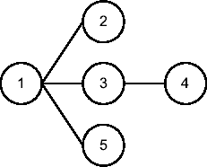

# FILTER 操作

此操作的特定特点是它支持可变数量的子操作。如果它只有一个子操作，则被视为独立操作。如果它有两个或更多子操作，其功能类似于 `NESTED LOOPS` 操作。第一个子操作驱动其他子操作的执行。

为说明这一点，给出以下查询及其执行计划（其父子关系的图形化表示见 图 6-6）：

```sql
SELECT *
FROM emp
WHERE NOT EXISTS (SELECT 0
                  FROM dept
                  WHERE dept.dname = 'SALES' AND dept.deptno = emp.deptno)
AND NOT EXISTS (SELECT 0
                  FROM bonus
                  WHERE bonus.ename = emp.ename);
```

```
------------------------------------------------------------------
| Id  | Operation                    | Name    | Starts | A-Rows |
------------------------------------------------------------------
|*  1 |  FILTER                      |         |      1 |      8 |
|   2 |   TABLE ACCESS FULL          | EMP     |      1 |     14 |
|*  3 |   TABLE ACCESS BY INDEX ROWID| DEPT    |      3 |      1 |
|*  4 |    INDEX UNIQUE SCAN         | DEPT_PK |      3 |      3 |
|*  5 |   TABLE ACCESS FULL          | BONUS   |      8 |      0 |
------------------------------------------------------------------

   1 - filter( NOT EXISTS (SELECT 0 FROM "DEPT" "DEPT" WHERE "DEPT"."DEPTNO"=:B1
               AND "DEPT"."DNAME"='SALES') AND NOT EXISTS (SELECT 0 FROM "BONUS"
               "BONUS" WHERE "BONUS"."ENAME"=:B2))
   3 - filter("DEPT"."DNAME"='SALES')
   4 - access("DEPT"."DEPTNO"=:B1)
   5 - filter("BONUS"."ENAME"=:B1)
```

---

**注意** 包 `dbms_xplan` 中的函数 `display_cursor` 有时会显示错误的谓词。不过，问题不在于这个包。它实际上是由视图 `v$sql_plan` 和 `v$sql_plan_statistics_all` 显示错误信息引起的。在这种情况下，错误显示的谓词如下：

```
1 - filter((`IS NULL AND IS NULL`))
   3 - filter("DEPT"."DNAME"='SALES')
   4 - access("DEPT"."DEPTNO"=:B1)
   5 - filter("BONUS"."ENAME"=:B1)
```

请注意，根据 Oracle 的说法，这不是一个 bug。这只是当前实现的一个限制。

---



**图 6-6.** *关联组合操作 FILTER 的父子关系*

在此执行计划中，关联组合操作 FILTER 的三个子操作是独立操作。应用前述规则，您可以看到执行计划按以下方式执行操作：

1.  操作 1 有三个子操作（2、3 和 5），其中操作 2 按升序排列是第一个。因此，执行从操作 2 开始。
2.  操作 2 扫描表 `emp` 并向其父操作（1）返回 14 行。
3.  对于操作 2 返回的每一行，操作 `FILTER` 的第二个和第三个子操作应各执行一次。实际上，实现了一种缓存机制以将执行次数降至最低。这通过比较操作 2 的 `A-Rows` 列与操作 3 和 5 的 `Starts` 列得到确认。操作 3 执行了三次，对于表 `emp` 中列 `deptno` 的每个不同值执行一次。操作 5 执行了八次，对于在应用操作 3 施加的过滤器后表 `emp` 中列 `empno` 的每个不同值执行一次。以下查询显示开始次数与不同值的数量匹配：
    ```sql
    SQL> SELECT dname, count(*)
      2  FROM emp, dept
      3  WHERE emp.deptno = dept.deptno
      4  GROUP BY dname;
    ```
    ```
    DNAME             COUNT(*)
    --------------  ----------
    ACCOUNTING               3
    RESEARCH                 5
    SALES                    6
    ```
4.  根据独立操作的规则，在操作 3 之前执行的操作 4，通过应用访问谓词 `"DEPT"."DEPTNO"=:B1` 扫描索引 `dept_pk`。绑定变量 (`B1`) 用于传递要由子查询检查的值。在三次执行中，它从索引中提取了三个 rowid 并将其传递给其父操作（3）。
5.  操作 3 通过其子操作（4）传递过来的 rowid 访问表 `dept`，并应用过滤谓词 `"DEPT"."DNAME"='SALES'`。由于此操作仅用于应用限制，因此它不向其父操作（1）返回任何数据。无论如何，重要的是注意只找到了一行满足过滤谓词。因为使用了 `NOT EXISTS`，所以丢弃了这个匹配行。
6.  操作 5 扫描表 `bonus` 并应用过滤谓词 `"BONUS"."ENAME"=:B1`。绑定变量 (`B1`) 用于传递要由子查询检查的值。由于此操作仅用于应用限制，因此它不向其父操作（1）返回任何数据。然而，重要的是注意没有找到满足过滤谓词的行。因为使用了 `NOT EXISTS`，所以没有行被丢弃。
7.  操作 1 在应用了由操作 3 和 5 实现的过滤谓词后，将八行数据发送给调用者。

