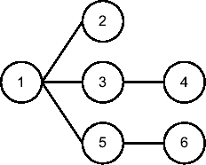
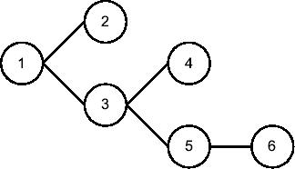
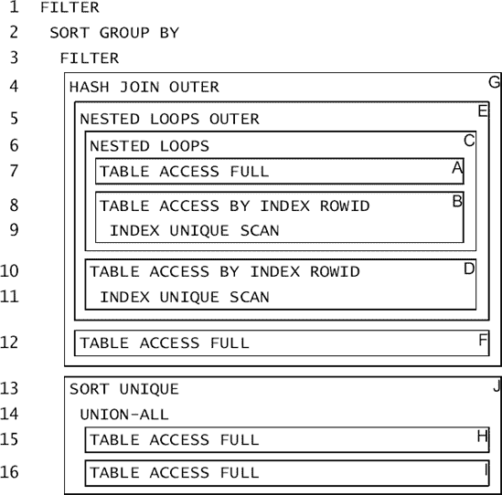
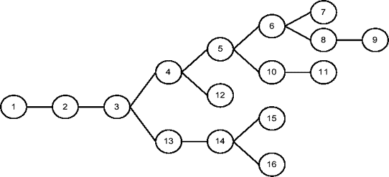

# 执行计划详解

```plaintext
`------------------------------------------------------`
`| Id  | 操作                | 名称  | 开始次数 | 行数   |`
`------------------------------------------------------`
`|   1 |  更新                | EMP  |      1 |      0 |`
`|   2 |    全表扫描          | EMP  |      1 |     14 |`
`|   3 |    聚合排序          |      |      3 |      3 |`
`|*  4 |     全表扫描         | EMP  |      3 |     14 |`
`|   5 |    聚合排序          |      |      1 |      1 |`
`|   6 |     全表扫描         | EMP  |      1 |     14 |`
`------------------------------------------------------`
```

`   4 - 过滤("E2"."DEPTNO"=:B1)` 

**图 6-7.** `相关-组合操作 更新 的父子关系`

在此执行计划中，相关-组合操作`更新`的所有三个子节点都是独立操作。前面描述的规则表明，执行计划按如下方式执行操作：

1.  操作 1 有三个子节点（2、3 和 5），操作 2 是这三个中升序排列的第一个。因此，执行从操作 2 开始。
2.  操作 2 扫描表`emp`并向其父操作（1）返回 14 行。
3.  对于列`deptno`中的每个不同值，其两个子节点（3 和 5）被执行一次。由于这两个操作都是独立的，并且每个都有一个子节点，因此它们的执行从子节点操作（4 和 6）开始。
4.  操作 4 扫描表`emp`并应用过滤谓词`"E2"."DEPTNO"=:B1`。在三次执行过程中，它提取了 14 行并将其传递给其父操作（3）。
5.  操作 3 计算从操作 4 传递给它的行的平均工资，并将结果返回给其父操作（1）。
6.  操作 6 扫描表`emp`，提取 14 行，并将其传递给其父操作（5）。请注意，此子查询仅执行一次，因为它与主查询不相关。
7.  操作 5 计算从操作 6 传递给它的行的平均佣金，并将结果返回给其父操作（1）。
8.  操作 1 使用其其他子节点（3 和 5）返回的值更新由操作 2 传递的每一行。请注意，即使`更新`语句修改了 14 行，此操作的列`行数`也显示为 0。

## 操作 带过滤的连接遍历

此操作用于处理层次查询。它的特点是具有两个子操作。第一个用于获取层次结构的根，第二个为层次结构中的每一级执行一次。

以下是一个示例查询及其执行计划（图 6-8 显示了其父子关系的图形化表示）。请注意，该执行计划是在 Oracle Database 11*g* 上生成的（原因将在后面解释）。

```sql
SELECT level, rpad('-',level-1,'-')||ename AS ename, prior ename AS manager
FROM emp
START WITH mgr IS NULL
CONNECT BY PRIOR empno = mgr
```

```plaintext
---------------------------------------------------------------------
| Id  | 操作                        | 名称      | 开始次数 | 行数   |
---------------------------------------------------------------------
|*  1 |  带过滤的连接遍历           |           |      1 |     14 |
|*  2 |    全表扫描                 | EMP       |      1 |      1 |
|   3 |    嵌套循环                 |           |      4 |     13 |
|   4 |     连接遍历泵              |           |      4 |     14 |
|   5 |     通过索引行 ID 访问表       | EMP       |     14 |     13 |
|*  6 |      索引范围扫描           | EMP_MGR_I |     14 |     13 |
---------------------------------------------------------------------
```

`   1 - 访问("MGR"=PRIOR "EMPNO")`
`   2 - 过滤("MGR" IS NULL)`
`   6 - 访问("MGR"=PRIOR "EMPNO")`

* * *

**注意** 此查询是视图`v$sql_plan`和`v$sql_plan_statistics_all`提供错误信息的另一种情况。在这种情况下，错误显示的谓词如下：

```plaintext
1 - 访问("MGR"=PRIOR NULL)
   2 - 过滤("MGR" IS NULL)
6 - 访问("MGR"=PRIOR NULL)
```

* * *



**图 6-8.** `相关-组合操作 带过滤的连接遍历 的父子关系`

在此执行计划中，相关-组合操作`带过滤的连接遍历`的第一个子节点是一个独立操作。而第二个子节点本身是一个相关-组合操作。要阅读这种情况下的执行计划，您只需在下降树的同时递归地应用基本规则。

为了帮助您更轻松地理解层次查询的执行计划，查看查询返回的数据也很有用：

```plaintext
层级 员工姓名   经理
---------- ---------- ----------
         1 KING
         2 -JONES     KING
         3 --SCOTT    JONES
         4 ---ADAMS   SCOTT
         3 --FORD     JONES
         4 ---SMITH   FORD
         2 -BLAKE     KING
         3 --ALLEN    BLAKE
         3 --WARD     BLAKE
         3 --MARTIN   BLAKE
         3 --TURNER   BLAKE
         3 --JAMES    BLAKE
         2 -CLARK     KING
         3 --MILLER   CLARK
```

应用前面描述的规则，您可以看到执行计划按如下方式执行操作：

1.  操作 1 有两个子节点（2 和 3），操作 2 是其中升序排列的第一个。因此，执行从操作 2 开始。
2.  操作 2 扫描表`emp`，应用过滤谓词`"MGR" IS NULL`，并将层次结构的根返回给其父操作（1）。
3.  操作 3 是操作 1 的第二个子节点。因此，它为层次结构的每一级执行——在本例中为四次。自然，前面讨论的关于`嵌套循环`操作的规则适用于操作 3。首先执行第一个子节点操作 4，对于它返回的每一行，内层循环（由操作 5 及其子节点操作 6 组成）执行一次。请注意，正如预期的那样，操作 4 的列`行数`与操作 5 和 6 的列`开始次数`相匹配。
4.  对于第一次执行，操作 4 通过`连接遍历泵`操作获取层次结构的根。在本例中，级别 1 只有一行（KING）。使用列`mgr`中的值，操作 6 通过应用访问谓词`"MGR"=PRIOR "EMPNO"`对索引`emp_mgr_i`进行扫描，提取 rowid 并将其返回给其父操作（5）。操作 5 使用 rowid 访问表`emp`并将行返回给其父操作（3）。
5.  对于操作 4 的第二次执行，所有工作都与第一次执行相同。唯一的区别是来自级别 2（JONES、BLAKE 和 CLARK）的数据被传递给操作 4 进行处理。
6.  对于操作 4 的第三次执行，所有工作都与第一次类似。唯一的区别是级别 3 数据（SCOTT、FORD、ALLEN、WARD、MARTIN、TURNER、JAMES 和 MILLER）被传递给操作 4 进行处理。
7.  对于操作 4 的第四次也是最后一次执行，所有工作都与第一次类似。唯一的区别是级别 4 数据（ADAMS 和 SMITH）被传递给操作 4 进行处理。
8.  操作 3 获取从其子节点传递的行，并将其返回给其父操作（1）。
9.  操作 1 应用访问谓词`"MGR"=PRIOR "EMPNO"`并将 14 行发送给调用者。


## Oracle Database 10*g* 执行计划差异

在 Oracle Database 10*g* 上生成的执行计划略有不同。可以看出，操作 `CONNECT BY WITH FILTERING` 有了第三个子操作（操作 8）。不过，这个操作在本例中并未执行。操作 8 对应的 `Starts` 列的值证实了这一点。实际上，只有当 `CONNECT BY` 操作使用临时空间时，才会执行第三个子操作。发生这种情况时，性能可能会显著下降。这个在版本 10.2.0.4 中修复的问题被称为 bug 5065418。

```
---------------------------------------------------------------------
| Id  | Operation                     | Name      | Starts | A-Rows |
---------------------------------------------------------------------
|*  1 |  CONNECT BY WITH FILTERING    |           |      1 |     14 |
|*  2 |   TABLE ACCESS FULL           | EMP       |      1 |      1 |
|   3 |   NESTED LOOPS                |           |      4 |     13 |
|   4 |    BUFFER SORT                |           |      4 |     14 |
|   5 |     CONNECT BY PUMP           |           |      4 |     14 |
|   6 |    TABLE ACCESS BY INDEX ROWID| EMP       |     14 |     13 |
|*  7 |     INDEX RANGE SCAN          | EMP_MGR_I |     14 |     13 |
|   8 |   TABLE ACCESS FULL           | EMP       |      0 |      0 |
---------------------------------------------------------------------
```

### 分治法

在前面的章节中，你了解了如何阅读构成执行计划的三种类型的操作。到目前为止，你看到的所有执行计划都相当简单（简短）。然而，更多时候，你不得不处理复杂（冗长）的执行计划。这并非因为大多数 SQL 语句都很复杂，而是因为简单的 SQL 语句很可能已被查询优化器正确优化，因此你永远无需质疑它们的性能。

关键是要认识到，阅读长的执行计划与阅读短的并无不同。你需要做的就是系统地应用前面章节中提供的规则。有了这些规则，执行计划有多少行并不重要。你只需以相同的方式继续即可。

为了向你展示如何处理超过几行的执行计划，让我们看一下图 6-9（图 6-9）所示执行计划所执行的操作（图 6-10 展示了其父子关系的图形化表示）。我故意没有提供用于生成它的 SQL 语句。就我们的目的而言，你完全不需要关心 SQL 语句。另一方面，执行计划才是关键。



**图 6-9.** 按块分解的执行计划。左侧的数字标识操作，右侧的字母标识块。



**图 6-10.** 如图 6-9 所示执行计划的父子关系。

首先，需要将执行计划分解为基本块并识别执行顺序。为此，你需要执行以下步骤。要阅读一个执行计划，首先必须识别它所包含的合并操作（相关和不相关的）。换句话说，识别出每个拥有多个子操作的操作。在图 6-9 的例子中，合并操作如下：3、4、5、6 和 14。然后，对于每个合并操作的每个子操作，你定义一个块。由于在图 6-9 中有五个合并操作，且每个都有两个子操作，因此总共有十个块。例如，对于操作 3，第一个子操作由第 4 至 12 行组成（块 G），第二个子操作由第 13 至 16 行组成（块 J）。请注意，在图 6-9 中，每个块都由一个框架界定。最后，你需要弄清楚块的执行顺序。为了了解如何操作，让我们逐步分析图 6-9 中显示的执行计划，并应用前面讨论的规则：


