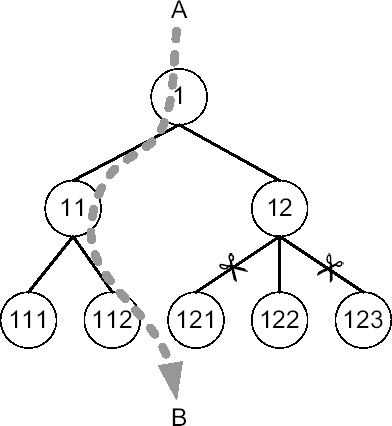

# 执行计划执行流程

## 概述

1.  操作 1 是一个独立操作，它的子操作（2）在它之前执行。
2.  操作 2 是一个独立操作，它的子操作（3）在它之前执行。
3.  操作 3 是一个关联组合操作，它的子操作在它之前执行。由于第一个子块（G）在第二个子块（J）之前执行，我们继续第一个子块（G）的第一个操作（4）。
4.  操作 4 是一个非关联组合操作，它的子操作在它之前执行。由于第一个子块（E）在第二个子块（F）之前执行，我们继续第一个子块（E）的第一个操作（5）。
5.  操作 5 是一个关联组合操作，它的子操作在它之前执行。由于第一个子块（C）在第二个子块（D）之前执行，我们继续第一个子块（C）的第一个操作（6）。
6.  操作 6 是一个关联组合操作，它的子操作在它之前执行。由于第一个子块（A）在第二个子块（B）之前执行，我们继续第一个子块（A）的第一个操作（7）。
7.  操作 7 是一个独立操作，没有子操作。这意味着你终于找到了第一个要执行的操作（因此它在块 A 中）。该操作扫描一个表并将行返回给它的父操作（6）。
8.  块 B 针对块 A 返回的每一行执行。在此块中，操作 9 首先扫描一个索引，然后操作 8 使用返回的行 ID 访问一个表，最后将行返回给它的父操作（6）。
9.  操作 6 执行块 A 和块 B 返回的行之间的连接，然后将结果返回给它的父操作（5）。
10. 块 D 针对块 C 返回的每一行执行。换句话说，它针对操作 6 返回给父操作（5）的每一行执行。在此块中，操作 11 首先扫描一个索引。然后，操作 10 使用返回的行 ID 访问一个表，并将行返回给它的父操作（5）。
11. 操作 5 执行块 C 和块 D 返回的行之间的连接，然后将结果返回给它的父操作（4）。
12. 操作 12（块 F）只执行一次。它扫描一个表并将结果返回给它的父操作（4）。
13. 操作 4 执行块 E 和块 F 返回的行之间的连接，然后将结果返回给它的父操作（3）。
14. 基本上，块 J 针对块 G 返回的每一行执行。换句话说，它针对操作 4 返回给父操作（3）的每一行执行。在此块中，操作 15 首先扫描一个表并将行返回给它的父操作（14）。然后，操作 16 扫描一个表并将行返回给它的父操作（14）。之后，操作 14 将其子操作返回的行合并在一起，并将结果返回给它的父操作（13）。最后，操作 13 删除一些重复的行。请注意，此块不向其父操作返回数据。实际上，父操作是一个`FILTER`操作，第二个子操作仅用于应用限制条件。
15. 一旦操作 3 应用了来自块 J 的过滤器，它将结果返回给它的父操作（2）。
16. 操作 2 执行一个`GROUP BY`并将结果返回给它的父操作（1）。
17. 操作 1 应用一个过滤器并将结果返回给调用者。

总之，请注意块是根据它们的标识符（从 A 到 J）执行的。一些块（A、C、E、F 和 G）最多执行一次，而其他块（B、D、H、I 和 J）根据驱动它们的操作返回的行数执行多次。

## 特殊案例

前面部分描述的规则适用于几乎所有的执行计划。然而，有一些特殊情况。通常，通过查看操作、它们所执行的表以及它们的运行时行为（特别是`Starts`和`A-Rows`列），你就能弄清楚发生了什么。这里有两个例子。

第一个例子使用了一个在`SELECT`子句中包含子查询的查询。查询及其执行计划如下：

```sql
SELECT ename, (SELECT dname FROM dept WHERE dept.deptno = emp.deptno)
FROM emp

-----------------------------------------------------------------
| Id  | Operation                    | Name    | Starts | A-Rows |
-----------------------------------------------------------------
|   1 |  TABLE ACCESS BY INDEX ROWID| DEPT    |      3 |      3 |
|*  2 |   INDEX UNIQUE SCAN         | DEPT_PK |      3 |      3 |
|   3 |  TABLE ACCESS FULL          | EMP     |      1 |     14 |
-----------------------------------------------------------------

   2 - access("DEPT"."DEPTNO"=:B1)
```

这个执行计划中奇怪的地方是操作 1 和 3 缺少父操作。如果你仔细查看`Starts`列，你会发现尽管操作 1 和 2 执行了三次，但操作 3 只执行了一次。这个不寻常的执行计划按如下方式执行操作：

1.  操作 3 扫描表`emp`并返回所有行。基本上，对于操作 3 返回的每一行，子查询都应该执行一次。然而，同样在这种情况下，SQL 引擎会缓存结果，因此子查询只针对列`deptno`中的每个不同值执行一次。
2.  为了执行子查询，操作 2 通过应用访问谓词`"DEPT"."DEPTNO"=:B1`扫描索引`dept_pk`，提取行 ID，并将它们返回给它的父操作（1）。绑定变量（`B1`）用于将要检查的值传递给子查询。然后操作 1 使用这些行 ID 访问表`dept`。

第二个例子使用了一个包含`NOT IN`的查询。查询及其执行计划如下：

```sql
SELECT deptno
FROM dept
WHERE deptno NOT IN (SELECT deptno FROM emp)

--------------------------------------------------------
| Id  | Operation          | Name    | Starts | A-Rows |
--------------------------------------------------------
|*  1 |  INDEX FULL SCAN   | DEPT_PK |      1 |      1 |
|*  2 |   TABLE ACCESS FULL| EMP     |      4 |      3 |
--------------------------------------------------------

   1 - filter( NOT EXISTS (SELECT /*+ */ 0 FROM "EMP" "EMP" WHERE
               LNNVL("DEPTNO"<>:B1)))
   2 - filter(LNNVL("DEPTNO"<>:B1))
```

***

**注意** 这是另一个视图`v$sql_plan`和`v$sql_plan_statistics_all`显示错误信息的案例。在这种情况下，错误显示的谓词如下：

```text
1 - filter(IS NULL)
2 - filter(LNNVL("DEPTNO"<>:B1))
```

***

乍一看，这个执行计划由两个独立操作组成。如果你仔细查看`Starts`列，会发现一些奇怪之处。事实上，尽管父操作（1）只执行了一次，但子操作（2）执行了四次。实际上，这个执行计划按如下方式执行操作：

1.  操作 1 是第一个被执行的，它扫描索引`dept_pk`。
2.  针对列`deptno`中的每个值，执行操作 2。如谓词所示，此操作是由于子查询`NOT EXISTS (SELECT 0 FROM "EMP" "EMP" WHERE LNNVL("DEPTNO"<>:B1))`而执行的。注意，查询优化器将`NOT IN`转换成了`NOT EXISTS`。绑定变量（`B1`）用于将要检查的值传递给子查询。

请注意，这些只是许多可能情况中的两个例子。基本上，每次你看到奇怪的事情时，都应该小心，不要过早下结论。


### 识别低效执行计划

不幸的是，要确认一个执行计划并非最优的唯一方法，就是找到另一个更快的执行计划。尽管如此，一些简单的检查仍可能揭示出执行计划低效的线索。接下来的章节将描述我用于此目的的两种检查方法。

#### 错误估算

这项检查背后的思路非常简单。查询优化器通过计算成本来决定应使用哪些访问路径、连接顺序和连接方法，以生成高效的执行计划。如果成本计算错误，查询优化器很可能选出次优的执行计划。换句话说，错误的估算很容易导致执行计划的选择出现失误。

在实践中，直接判断一条 SQL 语句本身的成本是不可行的。更简便的方法是检查查询优化器执行的其他估算——这些估算构成了成本计算的基础：操作返回行数的估计值（基数）。检查估计基数相当容易，因为你可以借助例如 `dbms_xplan` 包中的 `display_cursor` 函数，直接将其与实际基数进行比较。正如你刚刚看到的，只有当这两个基数接近时，查询优化器才算完成了出色的工作。这种方法的一个核心特点是，判断执行计划质量无需关于 SQL 语句或数据库结构的额外信息。你只需专注于将估算值与实际数据进行比较。

让我用一个例子来阐明这个概念。脚本 `wrong_estimations.sql` 生成的输出摘录展示了一个执行计划及其估计行数 (`E-Rows`) 和实际行数 (`A-Rows`)。如你所见，操作 4 的估算（进而操作 2 和 3 的估算）完全错误。查询优化器估计操作 4 仅返回 32 行，但实际返回了 80,016 行。更糟的是，操作 2 是一个关联组合操作。这意味着操作 5 和 6 实际执行了 80,016 次，而非估算的 32 次。这一点也由 `Starts` 列的值所证实。需要注意的是，操作 5 和 6 的估算本身是正确的。实际上，在比较之前，必须将实际基数 (`A-Rows`) 除以执行次数 (`Starts`)。

```sql
SELECT count(t2.col2)
FROM t1 JOIN t2 USING (id)
WHERE t1.col1 = 666
```

```
----------------------------------------------------------------------------
| Id  | Operation                     | Name    | Starts | E-Rows | A-Rows |
----------------------------------------------------------------------------
|   1 |  SORT AGGREGATE               |         |      1 |      1 |      1 |
|   2 |   NESTED LOOPS                |         |      1 |     32 |  75808 |
|   3 |    TABLE ACCESS BY INDEX ROWID| T1      |      1 |     32 |  80016 |
|*  4 |     INDEX RANGE SCAN          | T1_COL1 |      1 |     32 |  80016 |
|   5 |    TABLE ACCESS BY INDEX ROWID| T2      |  80016 |      1 |  75808 |
|*  6 |     INDEX UNIQUE SCAN         | T2_PK   |  80016 |      1 |  75808 |
----------------------------------------------------------------------------

   4 - access("T1"."COL1"=666)
   6 - access("T1"."ID"="T2"."ID")
```

要理解问题所在，必须仔细分析为何查询优化器无法计算出良好的估算值。基数是通过将选择性乘以表中的行数计算得出的。因此，如果基数出错，问题可能仅由三个原因造成：错误的选择性、错误的行数，或是查询优化器中的一个错误。

在本例中，我们的分析应从查看操作 4 的估算开始。换句话说，就是与谓词 `"T1"."COL1"=666` 相关的估算。由于查询优化器的估算基于对象统计信息，我们来看看这些统计信息是否描述了当前数据。通过以下查询，你可以获取操作 4 所使用的索引 `t1_col1` 的对象统计信息，同时还可以计算每个键的平均行数。在没有直方图的情况下，这基本上就是查询优化器所使用的值。

```sql
SQL> SELECT num_rows, distinct_keys, num_rows/distinct_keys AS avg_rows_per_key
  2 FROM user_indexes
  3 WHERE index_name = 'T1_COL1';

  NUM_ROWS  DISTINCT_KEYS AVG_ROWS_PER_KEY
----------  ------------- ----------------
     160000          5000               32
```

值得注意的是，在本例中，平均行数 32 与之前执行计划中的估计基数相同。要检查这些对象统计信息是否准确，需要将它们与实际数据进行比较。因此，让我们在表 `t1` 上执行以下查询。如你所见，该查询不仅计算了前一个查询的对象统计信息，还统计了列 `col1` 不等于 666 的行数。

```sql
SQL> SELECT count(*) AS num_rows, count(DISTINCT col1) AS distinct_keys,
  2         count(nullif(col1,666)) AS rows_per_key_666
  3  FROM t1;

NUM_ROWS  DISTINCT_KEYS ROWS_PER_KEY_666
---------  ------------- ----------------
  160000            5000            79984
```

从输出结果可以确认，对象统计信息不仅正确，而且数据分布存在严重的倾斜。因此，要获得准确的估算，直方图是绝对必要的。通过以下查询，可以确认本例中不存在直方图：

```sql
SQL> SELECT histogram, num_buckets
  2  FROM user_tab_col_statistics
  3  WHERE table_name = 'T1' AND column_name = 'COL1';

HISTOGRAM       NUM_BUCKETS
--------------- -----------
NONE                      1
```

在收集了缺失的直方图后，查询优化器成功地准确估计了基数，并因此认为另一个执行计划是最高效的。

```
---------------------------------------------------------------
| Id  | Operation           | Name | Starts | E-Rows | A-Rows |
---------------------------------------------------------------
|   1 |  SORT AGGREGATE     |      |      1 |      1 |      1 |
|*  2 |   HASH JOIN         |      |      1 |  80000 |  75808 |
|*  3 |    TABLE ACCESS FULL| T1   |      1 |  80000 |  80016 |
|   4 |    TABLE ACCESS FULL| T2   |      1 |    151K|    151K|
---------------------------------------------------------------
```


### 限制未被识别

我必须提醒你，前一节介绍的检查方法优于本节这一种。通常，只有在无法应用第一种方法时，我才会使用这第二种检查。例如，当读取由 TKPROF 生成的输出，而其中仅提供了实际基数时，就可能发生这种情况。当然，总是可以生成估计基数并应用前一节描述的检查。然而，如果执行计划的数量很多，这就很麻烦了。

这种检查的思路是验证查询优化器是否正确识别了 SQL 语句中的限制，并因此尽早应用了它。换句话说，你需要确认执行计划不会导致不必要的处理。

让我用一个例子来说明这个概念。这里，通过脚本 `restriction_not_recognized.sql` 生成一个跟踪文件，然后用 TKPROF 进行分析。以下是 TKPROF 输出的一个摘录。从中你可以看到，查询优化器决定开始将表 `t1` 与表 `t2` 进行连接。这第一个连接返回了一个包含 40,000 行的结果集。之后，该结果集与表 `t3` 进行了连接。最终生成的结果集只有 100 行，尽管读取表 `t3` 的操作返回了 80,000 行。这仅仅意味着查询优化器未能识别出那个限制，并在已经执行了大量处理后过晚地应用了它。

```
Rows     Row Source Operation
-------  ---------------------------------------------------
      1  SORT AGGREGATE (cr=2337 pr=4254 pw=2133 time=1594879 us)
    100   HASH JOIN  (cr=2337 pr=4254 pw=2133 time=1541152 us)
  40000    HASH JOIN  (cr=1018 pr=1453 pw=645 time=597110 us)
  20000     TABLE ACCESS FULL T1 (cr=329 pr=125 pw=0 time=140064 us)
  40000     TABLE ACCESS FULL T2 (cr=689 pr=683 pw=0 time=640647 us)
  80000    TABLE ACCESS FULL T3 (cr=1319 pr=1313 pw=0 time=321009 us)
```

在这个特定案例中，问题似乎与连接基数的估计有关。顺便提一下，这是查询优化器必须执行的最困难的任务之一。为了验证这个假设，你可以使用 `EXPLAIN PLAN` 这条 SQL 语句，例如，来生成以下输出。从中你可以看到，查询优化器期望第二次连接返回 79,800 行，而运行时实际只有 100 行。

```
---------------------------------------------
| Id  | Operation            | Name | Rows  |
---------------------------------------------
|   0 | SELECT STATEMENT     |      |     1 |
|   1 |  SORT AGGREGATE      |      |     1 |
|*  2 |   HASH JOIN          |      | 79800 |
|*  3 |    HASH JOIN         |      | 40000 |
|   4 |     TABLE ACCESS FULL| T1   | 20000 |
|   5 |     TABLE ACCESS FULL| T2   | 40000 |
|   6 |    TABLE ACCESS FULL | T3   | 80000 |
---------------------------------------------
```

当你遇到这类问题时，你能做的很少。实际上，没有描述两个表之间关系的**对象统计信息**。纠正这类情况的一种可能方法是使用 SQL 配置文件。在此案例中应用一个 SQL 配置文件，将为你带来以下执行计划。（我将在第 7 章介绍 SQL 配置文件是什么以及它是如何工作的。）眼下，重要的是认识到存在解决方案。注意，不仅连接的顺序改变了（`t2`  `t3`  `t1`），而且对表 `t1` 的访问方式也不同了。

```
Rows     Row Source Operation
-------  ---------------------------------------------------
      1  SORT AGGREGATE (cr=2210 pr=2708 pw=713 time=561754 us)
    100   NESTED LOOPS  (cr=2210 pr=2708 pw=713 time=336045 us)
    100    HASH JOIN  (cr=2008 pr=2708 pw=713 time=335609 us)
  40000     TABLE ACCESS FULL T2 (cr=689 pr=683 pw=0 time=320792 us)
  80000     TABLE ACCESS FULL T3 (cr=1319 pr=1312 pw=0 time=560235 us)
    100    TABLE ACCESS BY INDEX ROWID T1 (cr=202 pr=0 pw=0 time=5632 us)
    100     INDEX UNIQUE SCAN T1_PK (cr=102 pr=0 pw=0 time=2428 us)
```

值得注意的是，这个检查可以与前一节描述的检查同时应用。无论如何，两者都应该指出，针对同一操作的估计存在一些问题。由于两项检查都揭示了相同的问题，所以在可能的情况下，最好只使用前一节描述的检查。以下是输出的一个摘录，比较了估计值与实际值：

```
----------------------------------------------------------------
| Id  | Operation            | Name | Starts | E-Rows | A-Rows |
----------------------------------------------------------------
|   1 |  SORT AGGREGATE      |      |      1 |      1 |      1 |
|*  2 |   HASH JOIN          |      |      1 |  79800 |    100 |
|*  3 |    HASH JOIN         |      |      1 |  40000 |  40000 |
|   4 |     TABLE ACCESS FULL| T1   |      1 |  20000 |  20000 |
|   5 |     TABLE ACCESS FULL| T2   |      1 |  40000 |  40000 |
|   6 |    TABLE ACCESS FULL | T3   |      1 |  80000 |  80000 |
----------------------------------------------------------------
```

### 接下来是第 7 章

在本章中，我描述了如何通过 SQL 语句 `EXPLAIN PLAN`、动态性能视图以及一些跟踪工具来获取执行计划。正如对前两种技术的讨论，包 `dbms_xplan` 是提取和格式化执行计划的首选工具。通过它，你可以轻松地获取所需的所有信息，从而理解执行计划。同时还讨论了一些解读执行计划以及判断它们是否高效的规则。

显然，低效的执行计划需要进行调整。下一章将描述可用于此目的的 SQL 调整技术。请注意，有多种技术，因为每种技术只能应用于特定情况或仅用于调整特定问题。

* * *

1. 换句话说，它是一个使用 `on commit preserve rows` 选项创建的全局临时表。
2. 在 Oracle9*i* 中，该手册名为 *《数据库性能调整指南与参考》*。
3. 截至 Oracle Database 10*g* 第 1 版，它是一个 `VARCHAR2(200)`。从 Oracle Database 10*g* 第 2 版开始，它是一个 `VARCHAR2(300)`。


### 第七章
#### SQL 调优技术

当查询优化器无法自动生成高效的执行计划时，就需要进行一些手动调优。为此，Oracle 提供了多种技术。表 7-1 对它们进行了总结。本章的目标不仅是详细描述这些技术，还要解释每种技术能为你做什么，以及你可以在哪些情况下利用它们。要选择其中一种，必须问自己三个基本问题：

*   SQL 语句是否已知且静态？
*   采取的措施应该影响单个 SQL 语句，还是单个会话（甚至整个系统）执行的所有 SQL 语句？
*   是否可以更改 SQL 语句？

让我解释一下为什么这三个问题如此重要。首先，有时 SQL 语句根本未知，因为它们是在运行时生成的，并且实际上每次执行都可能不同。在其他情况下，查询优化器无法正确处理特定结构（例如无法通过索引应用的 `WHERE` 子句中的限制条件），而这些结构被大量 SQL 语句使用。在这两种情况下，你都必须使用能在会话或系统层面解决问题的技术，而不是在 SQL 语句层面。这导致了两个主要问题。一方面，如表 7-1 所示，几种技术只能用于特定的 SQL 语句，它们根本无法在会话或系统层面应用。另一方面，正如第 5 章所解释的，一旦你的数据库模式良好且查询优化器配置正确，通常只需要调优少量的 SQL 语句。因此，你希望避免使用会影响那些查询优化器自动提供高效执行计划的 SQL 语句的技术。

其次，当你处理一个无法控制其 SQL 语句的应用程序时（无论是由于代码不可用，如打包的应用程序，还是由于它在运行时生成 SQL 语句），你就不能使用需要修改代码的技术。总而言之，很多时候，你的选择是受限的。

**表 7-1.** *SQL 调优技术及其影响*

| **技术** | **系统** | **会话** | **SQL 语句** | **可用性** |
| :--- | :--- | :--- | :--- | :--- |
| 更改访问结构 |  |  |  | 所有版本 |
| 更改 SQL 语句 |  |  | ^* | 所有版本 |
| 提示 |  |  | ^* | 所有版本 |
| 更改执行环境 |  |  | ^* | 所有版本 |
| SQL 配置文件 |  |  |  | 自 *10g*^+ 起 |
| 存储的大纲 |  |  |  | 所有版本 |
| SQL 计划基线 |  |  |  | 自 *11g*^+ 起 |
| ** 使用此技术需要更改 SQL 语句*。 |
| *+ 需要调优包，因此也需要企业版*。 |
| *+ 需要企业版*。 |

本章的目的不是描述如何找出给定 SQL 语句的最佳执行计划（例如，解释在什么情况下应使用特定的访问或连接方法）。这方面的分析将在第 4 部分中介绍。本章的目的仅仅是描述可用的 SQL 调优技术。值得一提的是，除了更改访问结构和更改执行环境之外，所有 SQL 调优技术都基于这样一个事实：由于查询优化器的局限性，它无法确定高效的执行计划。当然，这只有在配置正确的情况下才成立。在本章中，将假设初始化参数已正确设置，并且所有必需的系统和对象统计信息都已到位。

描述每种 SQL 调优技术的各节都以相同的方式组织。简短的介绍之后是技术工作原理的描述以及你应在何时使用它。所有章节最后都讨论了一些常见的陷阱和误区。

### 更改访问结构

这项技术并不绑定于某个特定功能。SQL 语句的响应时间不仅取决于处理数据的存储方式，还取决于处理数据的访问方式，这是一个基本事实。

###### 工作原理

在质疑 SQL 语句的性能时，你首先要做的是验证哪些访问结构已经就位。根据你在数据字典中找到的信息，你应该回答以下问题：

*   涉及的表的组织类型是什么？是堆表、索引组织表，还是外部表？或者表是否存储在集群中？
*   包含所需数据的物化视图是否可用？
*   表、集群和物化视图上存在哪些索引？索引包含哪些列，顺序如何？
*   所有这些段是如何分区的？

接下来，你必须评估可用的访问结构是否足以高效地处理你正在调优的 SQL 语句。例如，在此分析过程中，你可能会发现需要额外的索引来有效支持 SQL 语句的 `WHERE` 子句。假设你正在调查以下查询的性能：

```sql
SELECT *
FROM emp
WHERE empno = 7788
```

基本上，查询优化器可能会考虑以下执行计划来执行它。第一个执行计划进行全表扫描，而第二个则通过索引访问表。当然，只有索引存在时，才会考虑第二个计划。

```
-------------------------------
| Id | Operation       | Name |
-------------------------------
|  0 | SELECT STATEMENT |      |
|  1 |  TABLE ACCESS FULL| EMP  |
-------------------------------
```

```
-------------------------------------------
| Id | Operation                   | Name   |
-------------------------------------------
|  0 | SELECT STATEMENT             |        |
|  1 |  TABLE ACCESS BY INDEX ROWID | EMP    |
|  2 |   INDEX UNIQUE SCAN          | EMP_PK |
-------------------------------------------
```

关于此主题的更多信息在此不再提供，因为第 4 部分将详细讨论何时以及如何使用不同的访问结构。目前，只需认识到这是一项基本的 SQL 调优技术就足够了。

###### 何时使用它

如果没有必要的访问结构，可能无法调优 SQL 语句。因此，只要你能更改访问结构，就应该考虑使用此技术。不幸的是，这并不总是可行的，例如当你使用打包的应用程序且供应商不支持更改访问结构时。


###### 陷阱与误区

在修改访问结构时，必须仔细考虑可能的副作用。一般而言，每个被修改的访问结构都会同时带来正面和负面影响。实际上，这种措施的影响不太可能仅限于单个 SQL 语句。很少有情况不是这样。例如，如果你像之前的例子那样添加了一个索引，就必须考虑到该索引会减慢对索引表的每一次 `INSERT` 和 `DELETE` 语句的执行，以及每一次修改了索引列的 `UPDATE` 语句的执行。还应检查是否有足够的可用空间来添加访问结构。综合考虑，在修改访问结构之前，有必要仔细权衡利弊。

### 修改 SQL 语句

SQL 是一种非常强大且灵活的查询语言。通常，你可以用许多不同的方式提交相同的请求。这对开发者来说特别有用。然而，对于查询优化器来说，为所有种类的 SQL 语句提供高效的执行计划是一个真正的挑战。请记住，灵活性是性能的敌人。

###### 工作原理

假设你在模式 `scott` 中选择所有没有员工的部门。以下四条 SQL 语句（可以在脚本 `depts_wo_emps.sql` 中找到）都能返回你要查找的信息：

`SELECT deptno FROM dept WHERE deptno NOT IN (SELECT deptno FROM emp)`

`SELECT deptno FROM dept WHERE NOT EXISTS (SELECT 1 FROM emp WHERE emp.deptno = dept.deptno)`

`SELECT deptno FROM dept MINUS SELECT deptno FROM emp`

`SELECT dept.deptno FROM dept, emp WHERE dept.deptno = emp.deptno(+) AND emp.deptno IS NULL`

这些 SQL 语句的目的是相同的。它们返回的结果也是一样的。因此，你可能期望查询优化器在所有情况下都提供相同的执行计划。然而，事实并非如此。实际上，只有第二条和第四条语句使用了相同的执行计划。其他的则大不相同。请注意，这些执行计划是在 Oracle Database 10*g* Release 2 上生成的。其他版本可能会生成不同的执行计划。

```
-----------------------------------
| Id | Operation        | Name    |
-----------------------------------
|  0 | SELECT STATEMENT |         |
|  1 |  INDEX FULL SCAN | DEPT_PK |
|  2 |   TABLE ACCESS FULL| EMP   |
-----------------------------------
```

```
------------------------------------
| Id | Operation         | Name    |
------------------------------------
|  0 | SELECT STATEMENT  |         |
|  1 | HASH JOIN ANTI    |         |
|  2 |  INDEX FULL SCAN  | DEPT_PK |
|  3 |  TABLE ACCESS FULL| EMP     |
------------------------------------
```

```
---------------------------------------
| Id  | Operation           | Name    |
---------------------------------------
|   0 | SELECT STATEMENT    |         |
|   1 |  MINUS              |         |
|   2 |   SORT UNIQUE NOSORT|         |
|   3 |    INDEX FULL SCAN  | DEPT_PK |
|   4 |   SORT UNIQUE       |         |
|   5 |    TABLE ACCESS FULL| EMP     |
---------------------------------------
```

```
--------------------------------------
| Id  | Operation          | Name    |
--------------------------------------
|   0 | SELECT STATEMENT   |         |
|   1 |  HASH JOIN ANTI    |         |
|   2 |   INDEX FULL SCAN  | DEPT_PK |
|   3 |   TABLE ACCESS FULL| EMP     |
--------------------------------------
```

基本上，尽管访问数据的方法始终相同，但用于组合数据以生成结果集的方法却不同。在这个特定案例中，两个表都非常小，因此，使用这三种执行计划你不会注意到任何真实的性能差异。自然，如果你处理的是大得多的表，情况可能就不一定如此了。一般来说，当你处理大量数据时，执行计划中的每一个微小差异都可能导致响应时间或资源利用率上的显著差异。

这里的要点是意识到，相同的数据可以通过不同的 SQL 语句来提取。每当你在调优一条 SQL 语句时，都应该问问自己是否存在其他等效的 SQL 语句。如果存在，请仔细比较它们，以评估哪一个能提供最佳性能。

#### 适用时机

每当你能够修改 SQL 语句时，都应该考虑使用此技术。没有理由不这么做。

###### 陷阱与误区

SQL 语句就是代码。编写代码的第一条规则是使其易于维护。首先，这意味着它应该可读且简洁。不幸的是，对于 SQL 而言，由于前述原因，编写 SQL 语句最简单或最可读的方式并不总是能带来最高效的执行计划。因此，在某些情况下，你可能会为了性能而被迫放弃可读性和简洁性，尽管这只有在确有必要且有利可图时才应为之。

### 提示

根据 Merriam-Webster 在线词典，`hint` 是一个间接的或概括性的建议。在 Oracle 的术语中，提示的定义略有不同。简而言之，提示是添加到 SQL 语句中以影响查询优化器决策的指令。换句话说，它是促使采取某种行动的东西，而不仅仅是提出建议。在我看来，Oracle 在命名此特性时选择这个词并不是最佳的。无论如何，名称并不那么重要。重要的是提示能为你做什么。只是别让这个名字误导你。

* * *

`注意` 仅仅因为提示是一个指令，并不意味着查询优化器总会使用它。或者，换一个角度看，仅仅因为查询优化器没有使用某个提示，也并不意味着提示仅仅是一个建议。正如我将要描述的，有些情况下提示根本就不相关或不合法，因此它对查询优化器生成的执行计划没有影响。

* * *


###### 工作原理

## 什么是提示？

以下部分将阐述提示的定义、存在的提示类别以及如何使用它们。在查看细节之前，需要注意的一个关键点是：使用提示并不像你想象的那么简单。实际上，在实践中，看到被错误应用的提示是相当常见的。

在优化一条 SQL 语句时，查询优化器可能需要考虑大量的执行计划。理论上，它应该考虑所有可能的执行计划。但在实践中，除了简单的 SQL 语句外，为了保持优化时间合理，考虑太多组合是不可行的。因此，查询优化器会先验地排除掉一些执行计划。当然，完全忽略其中一些执行计划的决定可能是关键性的，查询优化器的可信度在此过程中会受到影响。

每当你指定一个提示时，你的目标都是减少查询优化器考虑的执行计划数量。基本上，你通过一个提示告诉查询优化器，对于一条特定的 SQL 语句，哪些操作应该或不应该被考虑。例如，假设查询优化器需要为以下查询生成执行计划：

```sql
SELECT *
FROM emp
WHERE empno = 7788
```

如果表 `emp` 是一个堆表，并且其列 `empno` 建有索引，查询优化器至少会考虑两种执行计划。第一种是通过全表扫描来完整读取 `emp` 表：

```
---------------------------------
| Id  | Operation        | Name |
---------------------------------
|   0 | SELECT STATEMENT |      |
|   1 | TABLE ACCESS FULL| EMP  |
---------------------------------
```

第二种是基于 `WHERE` 子句中的谓词 (`empno = 7788`) 进行索引查找，然后通过索引中找到的 rowid 来访问表：

```
---------------------------------------------
| Id  | Operation                   | Name   |
---------------------------------------------
|   0 | SELECT STATEMENT            |        |
|   1 | TABLE ACCESS BY INDEX ROWID | EMP    |
|   2 | INDEX UNIQUE SCAN           | EMP_PK |
---------------------------------------------
```

在这种情况下，为了控制查询优化器提供的执行计划，你可以添加一个提示，指定使用全表扫描或索引扫描。需要理解的重要一点是，你不能告诉查询优化器：“我想要对表 `emp` 进行全表扫描，所以请搜索包含它的执行计划。”然而，你可以告诉它：“如果你必须在表 `emp` 的全表扫描和索引扫描之间做决定，请选择全表扫描。”这是一个细微但根本性的区别。当查询优化器必须在几种可能性之间选择时，提示可以让你影响它。

为了进一步强调这个关键点，让我们以 图 7-1 中展示的决策树为例。请注意，即使查询优化器使用决策树工作，这也是一个不直接与 Oracle 相关的通用示例。在 图 7-1 中，目标是从根节点 (1) 开始，下降到叶节点 (111–123)。换句话说，目标是选择一条从点 A 到点 B 的路径。假设由于某种原因，必须经过节点 122。为此，按照 Oracle 的术语，添加了两个提示来剪除从节点 12 到节点 121 和 123 的路径。这样，从节点 12 继续的唯一路径就通向节点 122。但这还不足以确保路径经过节点 122。事实上，如果在节点 1 它走的是节点 11 而不是节点 12，那么这两个提示将永远不会生效。因此，为了引导路径经过节点 122，你应该添加另一个提示来剪除从节点 1 到节点 11 的路径。

查询优化器也可能发生类似的情况。实际上，提示只在它们适用于查询优化器必须做出的决策时才会被评估。不多也不少。因此，一旦你指定了一个提示，你可能被迫添加多个提示才能确保它有效。而且，在实践中，随着执行计划复杂性的增加，找到所有能导向期望执行计划的必要提示变得越来越困难。



`图 7-1.` 决策树的剪枝

## 指定提示

提示是 Oracle 的扩展功能。为了不破坏 SQL 语句与其他数据库引擎的兼容性，Oracle 决定将它们作为一种特殊的注释来添加。注释和提示之间的唯一区别如下：

*   提示必须紧跟在 `DELETE`、`INSERT`、`MERGE`、`SELECT` 和 `UPDATE` 关键字之后。换句话说，它们不能像注释那样可以指定在 SQL 语句的任何位置。
*   注释分隔符后的第一个字符必须是加号 (`+`)。

提示中的语法错误不会引发错误。如果解析器无法解析它们，它们就会被视为真正的注释。也可以混合使用注释和提示。以下是两个示例，展示了如何为前面部分讨论的查询强制对表 `emp` 进行全表扫描：

```sql
SELECT /*+ full(emp) */ *
FROM emp
WHERE empno = 7788
```

```sql
SELECT --+ full(emp) you can also add a real comment without invalidating the hint
       *
FROM emp
WHERE empno = 7788
```

## 提示的类别

有几种方法（角度）可以对提示进行分类。我个人喜欢将它们分为以下几类：


