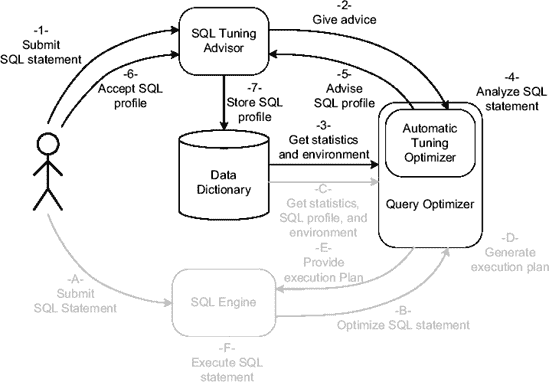
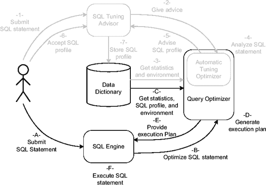

# Oracle SQL 提示的分类与使用

## 提示分类

*   *初始化参数提示* 会覆盖在系统或会话级别定义的一些初始化参数设置。我将以下提示归为此类：`all_rows`、`cursor_sharing_exact`、`dynamic_sampling`、`first_rows`、`gather_plan_statistics`、`no_cpu_costing`、`optimizer_features_enable`、`opt_param`、`no_result_cache`、`result_cache` 和 `rule`。我将在本章后面的“更改执行环境”一节中介绍这些提示，并在第 6 章中介绍了 `gather_plan_statistics` 提示。请注意，当指定这些提示时，它们总是会覆盖在实例或会话级别设置的值。
*   *查询转换提示* 在逻辑优化阶段控制查询转换技术的使用。我将以下提示归为此类：`no_eliminate_join`、`eliminate_join`、`no_expand`、`no_merge`、`merge`、`no_outer_join_to_inner`、`outer_join_to_inner`、`no_push_pred`、`push_pred`、`no_push_subq`、`push_subq`、`no_query_transformation`、`no_rewrite`、`rewrite`、`no_unnest`、`unnest`、`no_xmlindex_rewrite`、`no_xml_query_rewrite` 和 `use_concat`。我将在本章后面介绍其中一些提示，并在第 10 章和第 11 章中介绍另一些提示。
*   *访问路径提示* 控制访问数据的方法（例如，是否使用索引）。我将以下提示归为此类：`cluster`、`full`、`hash`、`no_index`、`index`、`index_asc`、`index_combine`、`index_desc`、`no_index_ffs`、`index_ffs`、`index_join`、`no_index_ss`、`index_ss`、`index_ss_asc` 和 `index_ss_desc`。我将在第 9 章中结合访问方法介绍这些提示。
*   *连接提示* 不仅控制连接方法，还控制连接表的顺序。我将以下提示归为此类：`leading`、`no_nlj_batching`、`nlj_batching`、`ordered`、`no_star_transformation`、`star_transformation`、`no_swap_join_inputs`、`swap_join_inputs`、`no_use_hash`、`use_hash`、`no_use_merge`、`use_merge`、`use_merge_cartesian`、`no_use_nl`、`use_nl` 和 `use_nl_with_index`。我将在第 10 章中结合连接方法介绍这些提示。
*   *并行处理提示* 控制如何使用并行处理。我将以下提示归为此类：`no_parallel`、`parallel`、`no_parallel_index`、`parallel_index`、`pq_distribute`、`no_px_join_filter` 和 `px_join_filter`。我将在第 11 章中结合并行处理介绍这些提示。提示 `pq_distribute` 的一个可能用法与第 10 章中的分区智能连接一起提供。
*   *其他提示* 控制与前述类别无关的其他功能的使用。我将以下提示归为此类：`no_append`、`append`、`no_cache`、`cache`、`driving_site`、`model_min_analysis`、`no_monitor`、`monitor` 和 `qb_name`。我将在本章后面介绍 `qb_name` 提示，并在第 11 章中介绍另一些提示。

尽管在本书中我描述或展示了许多关于这些提示的示例，但我既不会提供实际的参考资料，也不会提供它们的完整语法。此类参考资料在 *SQL 参考手册*的第 2 章中给出。

值得指出的是，有许多用于禁用特定操作或功能的提示（以 `no_` 为前缀的提示）可用。这很好，因为有时指定不应使用的操作或功能比指定应使用的操作或功能更容易。

上面提供的提示列表并不完整。事实上，还有一些未被记录且仅供 Oracle 内部使用的提示。你将在本章后面的“SQL 配置文件”一节中看到一些示例。截至 Oracle Database 11*g*，你可以查询视图 `v$sql_hint` 来获取可能是完整的提示列表。

## 提示的有效性

简单的 SQL 语句只有一个查询块。每当使用视图或子查询、内联视图和集合运算符等构造时，就会存在多个查询块。例如，以下查询有两个查询块（我仅出于说明目的使用子查询因子化子句，而不是定义真实的视图）。第一个是引用表 `dept` 的主查询。第二个是引用表 `emp` 的子查询：

```sql
WITH emps AS (SELECT deptno, count(*) AS cnt
              FROM emp
              GROUP BY deptno)
SELECT dept.dname, emps.cnt
FROM dept, emps
WHERE dept.deptno = emps.deptno
```

初始化参数提示对整个 SQL 语句有效。所有其他提示仅对单个查询块有效。对单个查询块有效的提示必须指定在它们控制的块中。例如，如果想为前面查询中的两个表指定访问路径提示，则必须将一个提示添加到主查询中，另一个添加到子查询中。两者的有效性都限制在定义它们的查询块内。

```sql
WITH
emps AS (SELECT /*+ full(emp) */ deptno, count(*) AS cnt
           FROM emp
           GROUP BY deptno)
SELECT /*+ full(dept) */ dept.dname, emps.cnt
FROM dept, emps
WHERE dept.deptno = emps.deptno
```

此规则的例外是*全局提示*。通过它们，可以使用点表示法引用其他查询块中包含的对象（前提是这些对象已命名）。例如，在下面的 SQL 语句中，主查询包含一个用于子查询的提示。注意子查询名称是如何用于引用的。

```sql
WITH
  emps AS (SELECT deptno, count(*) AS cnt
           FROM emp
           GROUP BY deptno)
SELECT /*+ full(dept) full(emps.emp) */ dept.dname, emps.cnt
FROM dept, emps
WHERE dept.deptno = emps.deptno
```

全局提示的语法支持两级以上的引用（例如，对另一个视图中引用的视图）。对象只需用点分隔即可。

由于 `WHERE` 子句中的子查询没有命名，因此无法使用全局提示引用它们的对象。为了解决这个问题，从 Oracle Database 10*g* 开始，有另一种方法可以实现相同的结果。实际上，大多数提示都接受一个参数来指定它们对哪个查询块有效。通过这种方式，提示可以分组放在 SQL 语句的开头，并简单地引用它们所应用的查询块。为了允许这些引用，查询优化器不仅为每个查询块生成一个*查询块名称*，还允许你通过 `qb_name` 提示指定自己的名称。例如，在以下查询中，两个查询块分别称为 `main` 和 `sq`。然后，在 `full` 提示中，通过在查询块名称前加上“at”符号（`@`）来引用它们。注意，子查询中表 `emp` 的访问路径提示是在主查询中指定的。

```sql
WITH
emps AS (SELECT /*+ qb_name(sq) */ deptno, count(*) AS cnt
           FROM emp
           GROUP BY deptno)
SELECT /*+ qb_name(main) full(@main dept) full(@sq emp) */ dept.dname, emps.cnt
FROM dept, emps
WHERE dept.deptno = emps.deptno
```

前面的例子展示了如何指定你自己的名称。现在让我们看看如何使用查询优化器生成的名称。首先，你必须知道它们是什么。为此，你可以使用 SQL 语句 `EXPLAIN PLAN` 和包 `dbms_xplan`，如下面的示例所示。注意，将选项 `alias` 传递给函数 `display` 以确保查询块名称和别名是输出的一部分。

```sql
SQL> EXPLAIN PLAN FOR
  2  WITH
  3    emps AS (SELECT deptno, count(*) AS cnt
  4             FROM emp
  5             GROUP BY deptno)
  6  SELECT dept.dname, emps.cnt
  7  FROM dept, emps
  8  WHERE dept.deptno = emps.deptno;
```


```sql
SQL> SELECT * FROM table(dbms_xplan.display(NULL, NULL, 'basic `+alias`'));

-------------------------------------------------------
| Id  | Operation                       | Name        |
-------------------------------------------------------
|   0 | SELECT STATEMENT                |             |
|   1 |    MERGE JOIN                   |             |
|   2 |     TABLE ACCESS BY INDEX ROWID | DEPT        |
|   3 |      INDEX FULL SCAN            | DEPT_PK     |
|   4 |     SORT JOIN                   |             |
|   5 |      VIEW                       |             |
|   6 |       HASH GROUP BY             |             |
|   7 |        TABLE ACCESS FULL        | EMP         |
------------------------------------------------------

   1 - SEL$2
   2 - SEL$2 / DEPT@SEL$2
   3 - SEL$2 / DEPT@SEL$2
   5 - SEL$1 / EMPS@SEL$2
   6 - SEL$1
   7 - SEL$1 / EMP@SEL$1
```

系统生成的查询块名称由一个前缀后接一个字母数字字符串组成。前缀基于查询块中包含的操作。表 7-2 对其进行了总结。字母数字字符串是根据 SQL 语句解析期间查询块的位置（从左到右）对其进行的编号。在上面的示例中，主查询块被命名为 `SEL$2`，子查询块被命名为 `SEL$1`。

**表 7-2.** *查询块名称中使用的前缀*

| **前缀** | **用于** |
| --- | --- |
| `CRI$` | `CREATE INDEX` 语句 |
| `DEL$` | `DELETE` 语句 |
| `INS$` | `INSERT` 语句 |
| `MISC$` | 其他 SQL 语句，如 `LOCK TABLE` |
| `MRG$` | `MERGE` 语句 |
| `SEL$` | `SELECT` 语句 |
| `SET$` | 集合操作符，如 `UNION` 和 `MINUS` |
| `UPD$` | `UPDATE` 语句 |

如上所示，系统生成的查询块名称的使用方式与用户定义的查询块名称并无不同。

```sql
WITH
  emps AS (SELECT deptno, count(*) AS cnt
           FROM emp
           GROUP BY deptno)
SELECT /*+ `full(@sel$2 dept) full(@sel$1 emp)` */ dept.dname, emps.cnt
FROM dept, emps
WHERE dept.deptno = emps.deptno
```

关于查询转换阶段生成的查询块命名，我还有最后一点要说明。由于它们在解析时不属于 SQL 语句的一部分，因此无法像其他查询块那样进行编号。在这种情况下，查询优化器会为它们生成一个八字符的哈希值。下面的例子展示了这种情况。其中，系统生成的查询块名称是 `SEL$5DA710D3`。

```sql
SQL> EXPLAIN PLAN FOR
  2  SELECT deptno
  3  FROM dept
  4  WHERE NOT EXISTS (SELECT 1 FROM emp WHERE emp.deptno = dept.deptno);

SQL> SELECT * FROM table(dbms_xplan.display(NULL,NULL,'basic +alias'));

--------------------------------------
| Id  | Operation          | Name    |
--------------------------------------
|   0 | SELECT STATEMENT   |         |
|   1 |  HASH JOIN ANTI    |         |
|   2 |   INDEX FULL SCAN  | DEPT_PK |
|   3 |   TABLE ACCESS FULL| EMP     |
--------------------------------------
1 - `SEL$5DA710D3`
2 - `SEL$5DA710D3` / DEPT@`SEL$1`
3 - `SEL$5DA710D3` / EMP@`SEL$2`
```

在上面的输出中，有趣的是，当发生此类转换时，执行计划中的某些行会显示两个查询块名称。这两个名称都可以在提示中使用。然而，从查询优化器的角度来看，转换后的查询块名称（本例中为 `SEL$5DA710D3`）仅在发生完全相同的转换时才可用。

###### 何时使用它

提示的目的是双重的。首先，当查询优化器无法自动生成高效的执行计划时，它们可以作为方便的变通方法。在这种情况下，你会使用它们来获得更好的执行计划。需要强调的重要一点是，提示是变通方法，因此不应作为长期解决方案使用。然而，在某些情况下，它们是解决问题的唯一可行方法。其次，提示对于评估查询优化器的决策很有用，因为它们可以生成替代的执行计划。在这种情况下，你会使用它们来进行一种假设分析（what-if analysis）。


###### 陷阱与谬误

每次你希望通过访问路径提示、连接提示或并行处理提示来锁定某个特定的执行计划时，都必须谨慎地指定足够多的提示以达到稳定性。这里的稳定性意味着，即使对象统计信息以及（在某种程度上）访问结构发生变化，计划也不会改变。为了锁定特定的执行计划，不仅需要在 SQL 语句中为每个表添加访问路径提示，还需要添加多个连接提示来控制连接方法和顺序，这种情况并不少见。请注意，其他类型的提示（例如，初始化参数提示和查询转换提示）通常不受此问题影响。

在处理 SQL 语句时，解析器会检查提示的语法。尽管如此，当发现语法无效的提示时，并不会引发错误。这意味着解析器将这个特定的伪提示视为注释。从某个角度看，如果这是由于打字错误造成的，这很烦人。但另一方面，这也有好处，因为它避免了因访问结构（提示中经常引用，例如，提示`index`可能引用索引名）的更改或升级到较新的数据库版本而导致已部署的应用程序中断。话虽如此，我希望能有一种方法来验证 SQL 语句中包含的提示。例如，通过`EXPLAIN PLAN`语句，应该能够简单地在这方面提供警告（例如，在`dbms_xplan`输出中添加一个新的注释）。我知道唯一能部分做到这一点的方法是设置事件`10132`。实际上，从 Oracle 数据库`10g`开始，在此事件生成的输出末尾，有一个专门介绍提示的部分。你可以在此部分检查两件事。首先，应该列出每个提示。如果某个提示缺失，则意味着它未被识别。其次，检查是否存在提示有误的通知。（在这种情况下，字段`err`的值会被设置为大于`0`。）请注意，为了获得以下输出，指定了两个相互冲突的初始化参数提示。

```
Dumping Hints
=============
atom_hint=(@=0x2a96c1b err=6 resol=1 used=0 token=453 org=1 lvl=2 txt=FIRST_ROWS ())
atom_hint=(@=0x2a96c1f err=6 resol=1 used=0 token=454 org=1 lvl=2 txt=ALL_ROWS ())
********** WARNING: SOME HINTS HAVE ERRORS *********
```

请注意，使用这种方法，语法正确但引用了错误对象的提示不会被报告为错误。因此，这并不能最终确认一切正常。

在使用提示时最常见的错误之一与表别名有关。规则是：当在提示中引用一个表时，只要该表有别名，就应该使用别名而不是表名。在下面的例子中，你可以看到如何为表`emp`定义表别名(`e`)。在这种情况下，当引用该表的提示`full`使用表名时，提示无效。注意第一个例子中，使用的是索引扫描而不是想要的全表扫描：

```
SQL> EXPLAIN PLAN FOR SELECT /*+ full(emp) */ * FROM emp e WHERE empno = 778;

SQL> SELECT * FROM table(dbms_xplan.display(NULL,NULL,'basic +alias'));

-----------------------------------------------
| Id | Operation                     | Name   |
-----------------------------------------------
|   0 | SELECT STATEMENT             |        |
|   1 |  TABLE ACCESS BY INDEX ROWID | EMP    |
|   2 |   INDEX UNIQUE SCAN          | EMP_PK |
-----------------------------------------------

1 - SEL$1 / E@SEL$1
2 - SEL$1 / E@SEL$1

SQL> EXPLAIN PLAN FOR SELECT /*+ full(e) */ * FROM emp e WHERE empno = 7788;
SQL> SELECT * FROM table(dbms_xplan.display(null,null,'basic'));

----------------------------------
| Id  | Operation         | Name |
----------------------------------
|   0 | SELECT STATEMENT  |      |
|   1 |  TABLE ACCESS FULL|  EMP |
----------------------------------
```

应该检查但经常被遗忘的一点是升级时提示的影响。由于提示是在查询优化器无法自动提供高效执行计划的情况下方便的变通方法，但其效果取决于查询优化器所使用的决策树类型（参见图 7-1），因此，每当包含提示的 SQL 语句在另一个数据库版本（因而也是另一个查询优化器版本）上执行时，都应仔细检查。换句话说，在针对新数据库版本验证应用程序时，最佳实践是重新检查和重新测试所有包含提示的 SQL 语句。

由于视图可能在不同的上下文中使用，通常不建议在视图中指定提示。如果你确实必须在视图中添加提示，请确保这些提示对所有使用它们的模块都有意义。

### 更改执行环境

第 5 章描述了如何配置查询优化器。该配置是所有连接到数据库引擎的用户使用的默认执行环境。因此，它必须适合大多数用户。当数据库被多个应用程序使用（例如，由于数据库服务器整合）或被一个具有不同需求（取决于所使用的模块，例如，白天是 OLTP，夜间是批处理）的应用程序使用时，单一环境在所有情况下都不合适的情况并不少见。在这种情况下，在会话级别甚至 SQL 语句级别更改执行环境可能是合适的。


###### 工作原理

在会话级更改执行环境与在 SQL 语句级操作完全不同。因此，我将在两个独立的小节中分别描述这两种情况。此外，我还将介绍几个动态性能视图，这些视图显示与实例、单个会话或子游标相关的环境信息。

## 会话级

第 5 章中描述的大多数初始化参数都可以通过 SQL 语句 `ALTER SESSION` 在会话级进行更改。因此，如果你有用户或模块需要特定的配置，你只需在会话级更改默认值即可。例如，要根据连接到数据库的用户设置执行环境，你可以使用一个配置表和一个数据库触发器，如下例所示。你可以在脚本 `exec_env_trigger.sql` 中找到这些 SQL 语句。

```
CREATE TABLE exec_env_conf (
  username  VARCHAR2(30),
  parameter VARCHAR2(80),
  value     VARCHAR2(512) );

CREATE OR REPLACE TRIGGER execution_environment AFTER LOGON ON DATABASE
BEGIN
  FOR c IN (SELECT parameter, value
            FROM exec_env_conf
            WHERE username = sys_context('userenv','session_user'))
  LOOP
    EXECUTE IMMEDIATE 'ALTER SESSION SET ' || c.parameter || '=' || c.value;
  END LOOP;
END;
/
```

然后，对于每个需要特定配置的用户，你可以为每个初始化参数在配置表中插入一行。例如，下面的两条 `INSERT` 语句在用户 `ops$cha` 登录时，在会话级更改并定义了两个参数。

```
INSERT INTO exec_env_conf VALUES ('OPS$CHA', 'optimizer_mode', 'first_rows_10');
INSERT INTO exec_env_conf VALUES ('OPS$CHA', 'optimizer_dynamic_sampling', '0');
```

当然，你也可以为单个模式定义触发器，或者执行其他检查，例如基于 `userenv` 上下文进行检查。

## SQL 语句级

SQL 语句级的执行环境通过初始化参数提示来更改。由于使用了提示，先前描述的提示的行为和属性在此情况下同样适用。

并非所有构成查询优化器配置的初始化参数都可以在 SQL 语句级更改。表 7-3 总结了哪些参数和值具有对应的初始化参数提示，以便在 SQL 语句级实现相同的配置。请注意，对于某些初始化参数（例如 `cursor_sharing`），并非所有值都可以通过提示设置。

**表 7-3.** 在 SQL 语句级更改查询优化器配置的提示

| **初始化参数** | **提示** |
| --- | --- |
| `cursor_sharing=exact` | `cursor_sharing_exact` |
| `optimizer_dynamic_sampling=x` | `dynamic_sampling(x)` |
| `optimizer_features_enable=x.y.z` | `optimizer_features_enable('x.y.z')` |
| `optimizer_features_enable` 未设置 | `optimizer_features_enable(default)` |
| `optimizer_index_caching=x` | `opt_param('optimizer_index_caching' x)` |
| `optimizer_index_cost_adj=x` | `opt_param('optimizer_index_cost_adj' x)` |
| `optimizer_mode=all_rows` | `all_rows` |
| `optimizer_mode=first_rows` | `first_rows` |
| `optimizer_mode=first_rows_x` | `first_rows(x)` |
| `optimizer_mode=rule` | `rule` |
| `optimizer_secure_view_merging=x` | `opt_param('optimizer_secure_view_merging','x')` |
| `result_cache_mode=manual` | `no_result_cache` |
| `result_cache_mode=force` | `result_cache` |
| `star_transformation_enabled=x` | `opt_param('star_transformation_enabled','x')` |

提示 `opt_param` 和 `optimizer_features_enable` 仅从 Oracle Database *10g* 开始可用。提示 `result_cache` 和 `no_result_cache` 仅从 Oracle Database *11g* 开始可用。

使用提示 `dynamic_sampling`，不仅可以覆盖初始化参数 `optimizer_dynamic_sampling` 在 SQL 语句级的设置，还可以指定动态采样仅限于特定查询块中的单个表。完整的语法如下：`dynamic_sampling(@qbname table level)`，其中 `qbname` 是查询块名称，`table` 是表别名，`level` 是动态采样级别。

#### 动态性能视图

从 Oracle Database *10g* 开始，有三个动态性能视图提供关于执行环境的信息：

*   `v$sys_optimizer_env` 提供关于实例级执行环境的信息。例如，可以找出哪些初始化参数未设置为默认值。

```
SQL> SELECT name, value, default_value
  2  FROM v$sys_optimizer_env
  3  WHERE isdefault = 'NO';

NAME                           VALUE  DEFAULT_VALUE
------------------------------ ------ --------------
db_file_multiblock_read_count  16     8
```

*   `v$ses_optimizer_env` 提供关于每个会话执行环境的信息。由于没有列提供初始化参数是在系统级还是在会话级被修改的信息，因此可以使用如下查询来实现该目的：

```
SQL> SELECT name, value
  2  FROM v$ses_optimizer_env
  3  WHERE sid = 161 AND isdefault = 'NO'
  4  MINUS
  5  SELECT name, value
  6  FROM v$sys_optimizer_env;

NAME            VALUE
--------------- --------------
cursor_sharing  force
optimizer_mode  first_rows_10
```

*   `v$sql_optimizer_env` 提供关于库缓存中每个子游标执行环境的信息。例如，使用如下查询，可以找出属于同一个父游标的两个子游标是否具有不同的执行环境。

```
SQL> SELECT e0.name, e0.value AS value_child_0, e1.value AS value_child_1
  2  FROM v$sql_optimizer_env e0, v$sql_optimizer_env e1
  3  WHERE e0.sql_id = e1.sql_id
  4  AND e0.sql_id = 'gqpw5sv948u96'
  5  AND e0.child_number = 0
  6  AND e1.child_number = 1
  7  AND e0.name = e1.name
  8  AND e0.value <> e1.value;

NAME                  VALUE_CHILD_0        VALUE_CHILD_1
--------------------- -------------------- --------------
hash_area_size        33554432             131072
optimizer_mode        first_rows_10        all_rows
cursor_sharing        force                exact
workarea_size_policy  manual               auto
```

###### 何时使用

当默认配置不适用于应用程序的某部分或某部分用户时，对其进行更改是件好事。虽然在会话级更改初始化参数应该总是可行的，但只有在也可以更改 SQL 语句的情况下，才能使用提示。


###### 陷阱与谬误

当设置可以集中存储在数据库或应用程序中时，在会话级别更改执行环境是容易的。如果您正在使用由需要不同执行环境的应用程序共享的连接池，请格外小心。实际上，会话参数与物理连接相关联。由于物理连接可能已被另一个应用程序使用，因此每次从池中获取连接时，都必须设置执行环境（这当然是昂贵的，因为需要额外的数据库往返）。因此，如果您有需要不同执行环境的应用程序，也应该使用不同的连接池。这样，您可以为每个连接池设置单一的配置，并通过定义不同的用户连接到数据库，您或许可以将配置集中到一个简单的数据库触发器中。

在 SQL 语句级别更改执行环境，会面临先前针对提示描述的相同陷阱和谬误。

### SQL 配置文件

从 Oracle Database 10*g* 开始，您可以将 SQL 调优委托给查询优化器的一个扩展，称为 `Automatic Tuning Optimizer`。将这个任务委托给最初无法找到高效执行计划的同一个组件，似乎有些奇怪。实际上，这两种情况非常不同。事实上，在正常情况下，查询优化器被限制必须非常快地生成执行计划，通常在亚秒级范围内。相反，可以给 `Automatic Tuning Optimizer` 更多的时间来制定一个高效的执行计划。此外，它还能够使用耗时的技术，例如假设分析，并充分利用动态采样技术来验证其估计。

`Automatic Tuning Optimizer` 通过 `SQL Tuning Advisor` 暴露出来。它的目的是分析 SQL 语句，并建议如何通过收集缺失或过时的对象统计信息、创建新索引、修改 SQL 语句或接受 SQL 配置文件来提升其性能。接下来的章节将专门讨论与 SQL 配置文件相关的建议。

必须理解的是，官方上，SQL 配置文件只能通过 `SQL Tuning Advisor` 生成。然而，正如我在本节后面描述的，您也可以手动创建它们。您应该意识到，Oracle 可能不支持此技术。如需更多信息，请联系 Oracle 支持。

###### 工作原理

以下部分描述了 SQL 配置文件是什么以及如何使用它们；还将提供关于其内部工作原理的信息。要管理它们，您可以使用集成到 `Enterprise Manager` 中的图形界面。我们不会在这里花时间讲解它，因为我认为，如果您了解后台发生了什么，使用图形界面将不成问题。

##### 什么是 SQL 配置文件？

一个 `SQL 配置文件` 是一个包含信息的对象，这些信息帮助查询优化器为特定 SQL 语句找到高效的执行计划。它提供关于执行环境、对象统计信息以及针对查询优化器所做估计的校正信息。它的主要优势之一是能够在不修改 SQL 语句或执行该语句的会话的执行环境的情况下影响查询优化器。换句话说，它对连接到数据库引擎的应用程序是透明的。要理解 SQL 配置文件如何工作，让我们看看它们是如何生成和利用的。

`图 7-2` 说明了生成 SQL 配置文件期间执行的步骤。简单来说，用户请求 `SQL Tuning Advisor` 对一条 SQL 语句进行调优，当提出 SQL 配置文件时，用户接受它。



**图 7-2.** `生成 SQL 配置文件期间执行的主要步骤`

详细步骤如下：

1.  用户将性能不佳的 SQL 语句传递给 `SQL Tuning Advisor`。
2.  `SQL Tuning Advisor` 请求 `Automatic Tuning Optimizer` 提供旨在调优该 SQL 语句的建议。
3.  查询优化器获取系统统计信息、与 SQL 语句引用的对象相关的对象统计信息，以及设置执行环境的初始化参数。
4.  分析 SQL 语句。在此阶段，`Automatic Tuning Optimizer` 执行假设分析并部分执行 SQL 语句以确认其猜测。
5.  `Automatic Tuning Optimizer` 将 SQL 配置文件返回给 `SQL Tuning Advisor`。
6.  用户接受该 SQL 配置文件。
7.  SQL 配置文件被存储在数据字典中。

`图 7-3` 说明了利用 SQL 配置文件期间执行的步骤。重要的是，这种利用对用户是完全透明的。



**图 7-3.** `执行 SQL 语句期间执行的主要步骤`

详细步骤如下：

1.  用户向 SQL 引擎发送要执行的 SQL 语句。
2.  SQL 引擎请求查询优化器提供执行计划。
3.  查询优化器获取系统统计信息、与 SQL 语句引用的对象相关的对象统计信息、SQL 配置文件以及设置执行环境的初始化参数。
4.  查询优化器分析 SQL 语句并生成执行计划。
5.  执行计划被传递给 SQL 引擎。
6.  SQL 引擎执行该 SQL 语句。

接下来的章节将详细描述生成和利用 SQL 配置文件期间执行的核心步骤。重点将放在涉及用户的步骤上。让我们从描述 `SQL Tuning Advisor` 开始。

##### SQL 调优顾问

`SQL Tuning Advisor` 的核心接口可通过 `dbms_sqltune` 包获得。此外，`Enterprise Manager` 中还集成了一个图形界面。这两个接口都允许您执行一个 `调优任务`。它们还允许您查看生成的建议并接受它。我不会在这里向您展示图形用户界面是如何工作的，因为理解幕后发生的事情更为重要。


要启动一个调优任务，你必须调用函数 `create_tuning_task` 并传递以下参数之一作为参数（该函数被重载了四次以接受不同类型的参数）：

*   SQL 语句的文本
*   存储在共享池中的 SQL 语句的引用 (`sql_id`)
*   存储在自动工作量资料档案库中的 SQL 语句的引用 (`sql_id`)
*   SQL 调优集的名称

