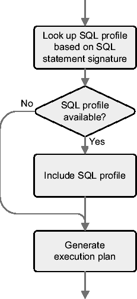
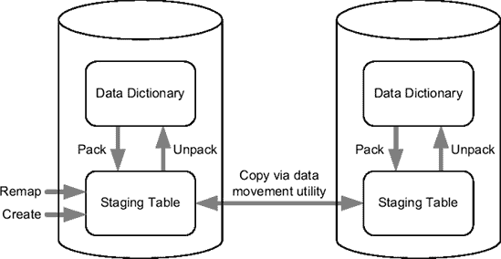
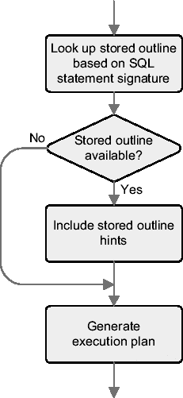
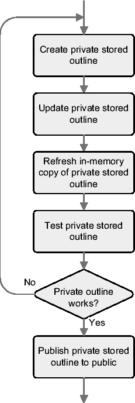
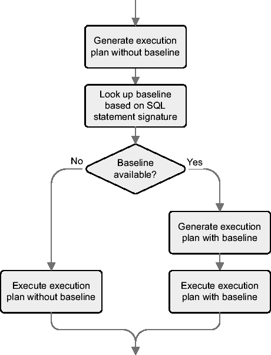
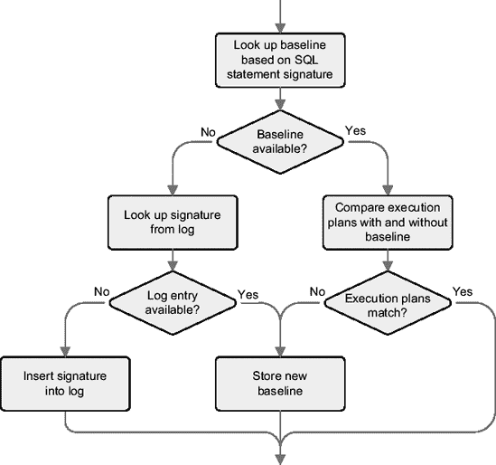

# 接受 SQL 配置文件

包 `dbms_sqltune` 中的过程 `accept_sql_profile` 用于接受 SQL 调优顾问建议的 SQL 配置文件。要接受前面报告中建议的 SQL 配置文件，你可以使用以下 PL/SQL 调用。参数 `task_name` 和 `task_owner` 引用建议 SQL 配置文件的调优任务。参数 `name` 和 `description` 指定 SQL 配置文件本身的名称和描述。在示例中，我使用生成它的脚本名称作为名称。参数 `category` 用于将多个 SQL 配置文件分组以便于管理。其默认值为 `default`。参数 `replace` 指定是否应替换已存在的 SQL 配置文件。它默认为 `FALSE`。最后，参数 `force_match` 指定如何执行文本规范化。它默认为 `FALSE`。下一节提供了关于文本规范化的更多信息。唯一必需的参数是 `task_name`。注意，参数 `replace` 和 `force_match` 仅从 Oracle Database 10g Release 2 开始存在。

```sql
dbms_sqltune.accept_sql_profile(
  task_name       => 'TASK_16467',
  task_owner      => 'OPS$CHA',
  name            => 'first_rows',
  description     => 'switch from ALL_ROWS to FIRST_ROWS_n',
  category        => 'TEST',
  replace         => TRUE,
  force_match     => TRUE
);
```

一旦被接受，SQL 配置文件就存储在数据字典中。视图 `dba_sql_profiles` 显示有关它的信息。由于 SQL 配置文件不绑定到特定用户，因此视图 `all_sql_profiles` 和 `user_sql_profiles` 不存在。

```sql
SQL> SELECT category, sql_text, force_matching
  2  FROM dba_sql_profiles
  3  WHERE name = 'first_rows';
```


`类别`      `SQL 文本`                 `强制匹配`
`--------` `----------------------------` `---------------`
`测试`       `SELECT * FROM T ORDER BY ID` `是`

与过程 `accept_sql_profile` 功能相同的函数 `accept_sql_profile` 同样可用。唯一的区别是，该函数会返回 SQL 配置文件的名称。当名称未被指定为输入参数，而必须由系统生成时，这非常有用。实际上，在 Oracle Database 10g Release 1 中，只有该函数是可用的。

## 修改 SQL 配置文件

你可以使用 `dbms_sqltune` 包中的过程 `alter_sql_profile`，不仅修改创建 SQL 配置文件时指定的一些属性，还可以更改其状态（启用或禁用）。通过以下 PL/SQL 调用，上一示例创建的 SQL 配置文件将被禁用。参数 `name` 标识要修改的 SQL 配置文件。参数 `attribute_name` 和 `value` 分别指定要修改的属性及其新值。注意，参数 `attribute_name` 接受 `name, description, category` 和 `status` 这些值。这三个参数是必需的。

```
dbms_sqltune.alter_sql_profile(
  name           => 'first_rows',
  attribute_name => 'status',
  value          => 'disabled'
);
```

## 文本标准化

SQL 配置文件的一个主要优点是，尽管它应用于特定的 SQL 语句，但使用它并不需要修改 SQL 语句本身。实际上，SQL 配置文件存储在数据字典中，查询优化器会自动选择它们。图 7-4 展示了在此选择过程中执行的基本步骤。首先，对 SQL 语句进行标准化，使其不仅对大小写不敏感，而且与使用的空格无关。然后根据得到的 SQL 语句计算签名。接着，基于该签名在数据字典中进行查找。每当找到具有相同签名的 SQL 配置文件时，就会执行一项检查，以确保要优化的 SQL 语句与附加到 SQL 配置文件的 SQL 语句是等效的。这是必要的，因为签名是一个哈希值，因此可能存在冲突。如果测试成功，则会将 SQL 配置文件纳入执行计划的生成过程中。



**图 7-4.** 选择 SQL 配置文件期间执行的主要步骤

如果 SQL 语句包含会变化的字面量，那么作为哈希值的签名也很可能随之改变。因此，SQL 配置文件可能会因为绑定在一个可能永远不会再次执行的、非常具体的 SQL 语句上而变得无用。从 Oracle Database 10g Release 2 开始，为避免此问题，数据库引擎能够在标准化阶段移除字面量。这是在接受 SQL 配置文件时，通过将参数 `force_match` 设置为 `TRUE` 来实现的。

要研究文本标准化如何工作，可以使用 `dbms_sqltune` 包中的函数 `sqltext_to_signature`。它接受两个参数 `sql_text` 和 `force_match` 作为输入。前者指定 SQL 语句，后者指定要使用的文本标准化类型。以下摘自脚本 `sqltext_to_signature.sql` 生成的输出展示了参数 `force_match` 对不同但相似的 SQL 语句签名的影响：

*   `force_match` 设置为 `FALSE`：对空格和大小写不敏感。

```
SQL_TEXT                                                          SIGNATURE
-------------------------------------------------------------------------
SELECT * FROM dual WHERE dummy = 'X'                             7181225531830258335
select  *  from dual where dummy='X'                             7181225531830258335
SELECT * FROM dual WHERE dummy = 'x'                            18443846411346672783
SELECT * FROM dual WHERE dummy = 'Y'                              909903071561515954
SELECT * FROM dual WHERE dummy = 'X'  OR dummy = :b1           14508885911807130242
SELECT * FROM dual WHERE dummy = 'Y'  OR dummy = :b1            816238779370039768
```

*   `force_match` 设置为 `TRUE`：对空格、大小写和字面量不敏感。但是，如果 SQL 语句中存在绑定变量，则不会执行字面量替换。

```
SQL_TEXT                                                          SIGNATURE
--------------------------------------------------- ---------------------
SELECT * FROM dual WHERE dummy = 'X'                            10668153635715970930
select * from dual where dummy='X'                              10668153635715970930
SELECT * FROM dual WHERE dummy = 'x'                            10668153635715970930
SELECT * FROM dual WHERE dummy = 'Y'                            10668153635715970930
SELECT * FROM dual WHERE dummy = 'X'  OR dummy = :b1           14508885911807130242
SELECT * FROM dual WHERE dummy = 'Y'  OR dummy = :b1            816238779370039768
```

通过 Enterprise Manager 接受 SQL 配置文件时，只有在 Oracle Database 11g 中才能设置参数 `force_match` 的值。在 Oracle Database 10g 中，始终使用默认值 (`FALSE`)。

## 激活 SQL 配置文件

SQL 配置文件的激活是在系统和会话级别由初始化参数 `sqltune_category` 控制的。它接受 `TRUE`、`FALSE` 或在接受 SQL 配置文件时指定的类别名称作为值。如果设置为 `TRUE`，则类别默认为 `default`。例如，以下 SQL 语句在会话级别激活属于 `test` 类别的 SQL 配置文件：

```
ALTER SESSION SET sqltune_category = test
```

该初始化参数支持单个类别。显然，这意味着一个会话在给定时间只能激活一个类别。

## 移动 SQL 配置文件

从 Oracle Database 10g Release 2 开始，`dbms_sqltune` 包提供了多个过程用于在数据库之间移动 SQL 配置文件。如图 7-5 所示，提供了以下功能：

*   你可以通过过程 `create_stgtab_sqlprof` 创建一个暂存表。
*   你可以通过过程 `pack_stgtab_sqlprof` 将 SQL 配置文件从数据字典复制到暂存表中。
*   你可以通过过程 `remap_stgtab_sqlprof` 更改暂存表中 SQL 配置文件的名称和类别。
*   你可以通过过程 `unpack_stgtab_sqlprof` 将 SQL 配置文件从暂存表复制到数据字典中。

请注意，在数据库之间移动暂存表是通过数据移动实用程序（例如，Data Pump 或传统的导出和导入实用程序）执行的，而不是使用 `dbms_sqltune` 包本身。



**图 7-5.** 使用包 `dbms_sqltune` 移动 SQL 配置文件

以下示例（摘自脚本 `clone_sql_profile.sql`）展示了如何在单个数据库内克隆 SQL 配置文件。首先，在当前模式下创建暂存表 `mystgtab`：

```
dbms_sqltune.create_stgtab_sqlprof(
  table_name      => 'MYSTGTAB',
  schema_name     => user,
  tablespace_name => 'USERS'
);
```

然后，将一个名为 `first_rows` 的 SQL 配置文件从数据字典复制到暂存表中：


## 重新划分标题层级并优化格式

## 删除 SQL 配置文件

可以使用 `dbms_sqltune` 包中的 `drop_sql_profile` 过程从数据字典中删除 SQL 配置文件。参数 `name` 指定 SQL 配置文件的名称。参数 `ignore` 指定在 SQL 配置文件不存在时是否引发错误。它默认为 `FALSE`。

```
dbms_sqltune.drop_sql_profile(
  name   => 'first_rows',
  ignore => TRUE
);
```

## 权限

要创建、更改和删除 SQL 配置文件，分别需要系统权限 `create any sql profile`、`drop any sql profile` 和 `alter any sql profile`。自 Oracle Database 11*g* 起，这三个系统权限已被弃用，取而代之的是系统权限 `administer sql management object`。SQL 配置文件不存在对象权限。要使用 SQL 调优顾问，需要系统权限 `advisor`。

最终用户不需要特定权限来使用 SQL 配置文件。

## 未文档化的特性

SQL 配置文件如何影响查询优化器？Oracle 在其文档中并未真正回答这个问题。我相信，高效使用特性的最佳方式是了解其工作原理。那么，让我们深入了解一下。简而言之，SQL 配置文件存储了一组提示，代表查询优化器要执行的调整。其中一些提示是有文档记载的，并且在 Oracle9*i* 中已可用。另一些是未文档化的，仅在 Oracle Database 10*g* 及更高版本中可用。换句话说，它们很可能是为此目的而实现的。所有这些提示都是常规提示，因此也可以直接添加到 SQL 语句中。

数据字典中存储的提示无法通过数据字典视图显示。事实上，唯一提供有关 SQL 配置文件信息的视图 `dba_sql_profiles` 提供了除提示之外的所有信息。如果你想知道 SQL 配置文件使用了哪些提示，有两种方法。第一种是直接查询数据字典表 `sqlprof$attr`。以下查询展示了如何对前面示例中使用的 SQL 配置文件执行此操作。在此特定情况下，只有一个提示 `first_rows`，它指示查询优化器切换优化器模式。当然，这只针对与 SQL 配置文件关联的 SQL 语句执行。

```
SQL> SELECT attr_val
  2  FROM sys.sqlprof$ p, sys.sqlprof$attr a
  3  WHERE p.sp_name = 'first_rows'
  4  AND p.signature = a.signature
  5  AND p.category  = a.category;

ATTR_VAL
--------------------------------------------
FIRST_ROWS(6)
```

如果你使用 Oracle Database 10*g* Release 2 或更高版本，第二种方法是将 SQL 配置文件移动到暂存表中，如前一节所述。然后，使用类似下面的查询，你将从暂存表中获取提示。请注意，通过函数 `table` 进行了展开（unnesting），因为提示存储在 `VARCHAR2` 的可变数组（varray）中。

```
SQL> SELECT *
  2  FROM table(SELECT attributes
  3             FROM mystgtab
  4             WHERE profile_name = 'first_rows');

COLUMN_VALUE
----------------------------------------
FIRST_ROWS(6)
```

为了向你展示优化器模式切换的另一个示例，让我们考虑以下查询，其中提示 `rule` 强制查询优化器在基于规则的模式下工作：

```
SQL> SELECT /*+ rule */ * FROM t ORDER BY id;

--------------------------------------------
| Id  | Operation                   | Name |
--------------------------------------------
|   0 | SELECT STATEMENT            |      |
|   1 |  TABLE ACCESS BY INDEX ROWID| T    |
|   2 |   INDEX FULL SCAN           | T_PK |
--------------------------------------------

Note
-----
- rule based optimizer used (consider using cbo)
```

如果你让 SQL 调优顾问分析这样的查询，就像脚本 `all_rows.sql` 所做的那样，它就会给出创建 SQL 配置文件的建议。接受该建议后，将创建一个包含以下提示的 SQL 配置文件。请注意，使用了两个初始化参数提示（`all_rows` 和 `optimizer_features_enable`）。此外，为了指示查询优化器忽略 SQL 语句中存在的提示（本例中为提示 `rule`），使用了提示 `ignore_optim_embedded_hints`。

```
ALL_ROWS
OPTIMIZER_FEATURES_ENABLE(default)
IGNORE_OPTIM_EMBEDDED_HINTS
```

切换优化器模式并不是 SQL 配置文件唯一能做的事情。它们有用的另一种情况是纠正查询优化器执行的错误基数估计。脚本 `opt_estimate.sql` 展示了这样一个案例。通过使用第 6 章中描述的识别错误估计的技术，你可以在以下示例中看到，几个操作的估计基数（`E-Rows`）与实际基数（`A-Rows`）完全不同：

```
--------------------------------------------------------------------------
| Id  | Operation                     | Name          | Starts | E-Rows | A-Rows |
--------------------------------------------------------------------------
|   1 |  HASH UNIQUE                  |               |      1|      1|      1|
|   2 |   NESTED LOOPS                |               |      1|      3|  26985|
|*  3 |    TABLE ACCESS BY INDEX ROWID| CH            |      1|    680|  26985|
|*  4 |     INDEX RANGE SCAN          | CH_LANGUAGE_I |      1|  26985|  26985|
|   5 |    TABLE ACCESS BY INDEX ROWID| T             |  26985|      1|  26985|
|*  6 |     INDEX UNIQUE SCAN         | T_PK          |  26985|      1|  26985|
--------------------------------------------------------------------------
```

如果你让 SQL 调优顾问分析这种情况并接受其建议，就像脚本 `opt_estimate.sql` 所做的那样，就会创建一个包含以下提示的 SQL 配置文件。在这种情况下需要注意的重要一点是存在未文档化的提示 `opt_estimate`。使用该特定提示，可以通知查询优化器其某些估计是错误的，以及错误的程度。实际上，第一个提示告诉查询优化器将第 3 行的操作估计值放大大约 39 倍（26,985/680）。第二个提示告诉它将第 2 行的操作（两个表之间的连接）的估计值放大大约 275 倍（26,985/3/39——这不是很精确，因为 3 被四舍五入了）。

```
OPT_ESTIMATE(@"SEL$1", TABLE, "CH"@"SEL$1", SCALE_ROWS=39.10326263)
OPT_ESTIMATE(@"SEL$1", JOIN, ("T"@"SEL$1", "CH"@"SEL$1"), SCALE_ROWS=275.1560562)
```

有了 SQL 配置文件后，估计就精确了。另请注意，查询优化器选择了另一个执行计划，这正是创建 SQL 配置文件的初衷。


### SQL 配置文件

以下是一个执行计划示例，展示了`SQL 配置文件`的应用：

```
---------------------------------------------------------------------------------
| Id  | Operation                     | Name          | Starts | E-Rows | A-Rows |
---------------------------------------------------------------------------------
|   1 | HASH UNIQUE                   |               |      1|      1|      1 |
|*  2 |  HASH JOIN                    |               |      1|  26985 |  26985 |
|*  3 |   TABLE ACCESS BY INDEX ROWID | CH            |      1|  26602 |  26985 |
|*  4 |    INDEX RANGE SCAN           | CH_LANGUAGE_I |      1|  26985 |  26985 |
|   5 |    TABLE ACCESS FULL          | T             |      1|  27268 |  26985 |
---------------------------------------------------------------------------------
```

`SQL 配置文件`的另一个应用场景是当对象统计信息不准确或缺失时。当然，这不应该发生，但当这种情况出现且动态采样无法为查询优化器提供所需信息时，就可以使用`SQL 配置文件`。脚本`object_stats.sql`提供了一个这样的示例。该脚本生成的`SQL 配置文件`所包含的`提示`如下所示。正如`提示`的名称所暗示的，其思路是为表、索引或列提供对象统计信息。

```
TABLE_STATS("SH"."AMOUNT_SOLD_MV", scale, blocks=7 rows=1460)
COLUMN_STATS("SH"."AMOUNT_SOLD_MV", "TIME_ID", scale, length=7 distinct=1460
             nulls=0 min=2450815 max=2452275)
COLUMN_STATS("SH"."AMOUNT_SOLD_MV", "SUMSLD", scale, length=5)
INDEX_STATS("SH"."AMOUNT_SOLD_MV", "I_SNAP$_AMOUNT_SOLD_MV", scale, blocks=8
             index_rows=1460)
```

在本节关于未公开特性中，我要描述的最后一个领域是手动创建`SQL 配置文件`的可能性。换句话说，你可以自己构建一个`SQL 配置文件`，而不是让`SQL 调优顾问`进行分析并在建议时接受它。不过，要小心。正如我之前提到的，我不知道这种技术是否受支持。老实说，我认为使用它没有问题，因为创建`SQL 配置文件`的方法与当你接受`SQL 调优顾问`提供的建议时数据库引擎使用的方法相同。实际上，`SQL 配置文件`是通过调用包`dbms_sqltune`中未公开的过程`import_sql_profile`来创建的。以下调用是一个示例。参数`sql_text`指定了`SQL 配置文件`所绑定的 SQL 语句，参数`profile`指定了`提示`列表。所有其他参数的含义与前面描述的过程`accept_sql_profile`的参数相同。

```
dbms_sqltune.import_sql_profile(
  name        => 'import_sql_profile',
  description => 'SQL profile created manually',
  category    => 'TEST',
  sql_text    => 'SELECT * FROM t ORDER BY id',
  profile     => sqlprof_attr('first_rows(42)',
                              'optimizer_features_enable(default)'),
  replace     => FALSE,
  force_match => FALSE
);
```

###### 何时使用

当你正在对一条特定的 SQL 语句进行调优，并且无法在应用程序中更改它时（例如，无法添加`提示`），应考虑使用此技术。不幸的是，要使用`SQL 调优顾问`，必须获得`调优包`和`诊断包`的许可。同样不幸的是，这些组件仅适用于企业版。

###### 陷阱与谬误

`SQL 配置文件`最重要的特性之一是它们与代码分离。与此同时，这也可能导致问题。事实上，由于`SQL 配置文件`和 SQL 语句之间没有直接引用，开发人员可能完全忽略`SQL 配置文件`的存在。此外，如果开发人员修改 SQL 语句导致其签名发生变化，`SQL 配置文件`将不再被使用。同样地，当你部署一个需要某些`SQL 配置文件`才能正常运行的应用程序时，必须记住在数据库设置过程中安装它们。

如果你需要生成一个`SQL 配置文件`，最佳实践是在生产环境（如果可用）中生成，然后将其移动到另一个环境中进行必要的测试。问题在于，在移动`SQL 配置文件`之前，你必须先接受它。由于你不希望在未经测试的情况下在生产环境中启用它，你应该确保通过使用与初始化参数`sqltune_category`激活的类别不同的类别来接受它。这样，`SQL 配置文件`在生产数据库中就不会被使用。无论如何，之后更改`SQL 配置文件`的类别总是可行的。

你必须意识到，当`SQL 配置文件`所依赖的对象被删除时，`SQL 配置文件`并不会被删除。这不一定是问题。例如，如果一个表或索引需要被重组或移动而必须重新创建，`SQL 配置文件`不被删除是件好事；否则，就需要重新创建它们。

两个文本相同的 SQL 语句具有相同的签名。即使它们引用不同模式中的对象，这也是正确的。这意味着一个`SQL 配置文件`可以用于两个名称相同但位于不同模式中的表！你应该非常小心，特别是当你的数据库中有多个相同对象的副本时。

当一条 SQL 语句同时具有`SQL 配置文件`和存储大纲时（注意，存储大纲将在下一节介绍），查询优化器会优先使用存储大纲，而不是使用`SQL 配置文件`。当然，这只在使用存储大纲被激活的情况下才成立。

从 Oracle 数据库 10*g*第 2 版开始，为了了解查询优化器是否使用了`SQL 配置文件`，你可以利用包`dbms_xplan`中提供的函数。如下例所示，其输出的`注释`部分明确地提供了所需的信息：

```
SQL> EXPLAIN PLAN FOR SELECT * FROM t ORDER BY id;

SQL> SELECT * FROM table(dbms_xplan.display(NULL,NULL,'basic +note'));

--------------------------------------------
|  Id | Operation                   | Name |
--------------------------------------------
|   0 | SELECT STATEMENT            |      |
|   1 |  TABLE ACCESS BY INDEX ROWID| T    |
|   2 |   INDEX FULL SCAN           | T_PK |
--------------------------------------------

Note
-----
-  SQL profile "import_sql_profile" used for this statement
```

### 存储大纲

存储大纲旨在为执行环境或对象统计信息发生变化时提供稳定的执行计划。因此，此功能也被称为*计划稳定性*。Oracle 文档中提到了两个可以受益于此功能的重要场景。第一个是从基于规则的优化器迁移到基于成本的优化器。第二个是将 Oracle 版本升级到较新的版本。在这两种情况下，其思路是在应用程序使用旧配置或旧版本时存储有关执行计划的信息，然后使用该信息在较新的版本上提供相同的执行计划。实际上，不幸的是，即使使用了存储大纲，你也可能观察到执行计划的变化。可能正是这个原因，我从未见过一个大规模使用存储大纲的数据库。存储大纲并不总是适合提供稳定执行计划的最终确认是由 Oracle 数据库 11*g*本身给出的，因为从该版本开始，存储大纲已被弃用，转而支持*SQL 计划基线*（将在下一节介绍）。因此，在实践中，存储大纲仅用于特定的 SQL 语句。


###### 工作原理

以下章节将描述存储大纲是什么以及如何使用它们。要管理存储大纲（除了 Oracle9*i* 版本），企业管理器中没有提供图形界面。

### 什么是存储大纲？

一个 `存储大纲` 是与 SQL 语句相关联的对象，旨在查询优化器生成执行计划时对其产生影响。更具体地说，存储大纲是一组提示，或者更准确地说，是所有必要提示的集合，用以强制查询优化器为给定的 SQL 语句始终生成特定的执行计划。

存储大纲的优势之一是它应用于特定的 SQL 语句，但使用它时，你无需修改 SQL 语句。实际上，存储大纲存储在数据字典中，查询优化器会自动选择它们。图 7-6 展示了此选择过程中执行的基本步骤。首先，SQL 语句被规范化——移除空白并将非字面字符串转换为大写。然后计算所得 SQL 语句的签名。接着，基于该签名，在数据字典中进行查找。一旦找到具有相同签名的存储大纲，就会执行检查以确保待优化的 SQL 语句与存储大纲关联的 SQL 语句是等效的。这是必要的，因为签名是一个哈希值，因此可能存在冲突。如果测试成功，则组成存储大纲的提示将被纳入执行计划的生成过程中。



**图 7-6.** 选择存储大纲期间执行的主要步骤

### 创建存储大纲

你可以使用两种主要方法来创建存储大纲：让数据库自动创建或手动创建。如果你想为某个会话甚至整个系统执行的每条 SQL 语句创建存储大纲，第一种方法很有用。然而，如前所述，这通常并不可取。因此，你通常会手动创建它们。

要启用自动创建，你必须将初始化参数 `create_stored_outlines` 设置为 `TRUE` 或另一个指定 `类别` 的值。类别的目的是将多个存储大纲分组以便管理。当初始化参数设置为 `TRUE` 时使用的默认类别名为 `default`。该初始化参数是动态的，可以在会话和系统级别进行更改。要禁用自动创建，你必须将初始化参数设置为 `FALSE`。

要手动创建存储大纲，你必须使用 SQL 语句 `CREATE OUTLINE`。以下 SQL 语句（摘自脚本 `outline_from_text.sql`）展示了创建一个名为 `outline_from_text` 的存储大纲，它关联到类别 `test`，并基于 `ON` 子句中指定的查询：

```sql
CREATE OR REPLACE OUTLINE outline_from_text
FOR CATEGORY test
ON SELECT * FROM t WHERE n = 1970
```

创建后，你可以通过视图 `user_outlines` 和 `user_outline_hints`（两者也都存在 `all` 和 `dba` 视图）显示有关存储大纲及其属性的信息。视图 `user_outlines` 显示除提示外的所有信息。以下查询显示了由前面的 SQL 语句创建的存储大纲所提供的信息：

```sql
SQL> SELECT category, sql_text, signature
  2  FROM user_outlines
  3  WHERE name = 'OUTLINE_FROM_TEXT';

CATEGORY SQL_TEXT                       SIGNATURE
-------- ------------------------------ --------------------------------
TEST     SELECT * FROM t WHERE n = 1970 73DC40455AF10A40D84EF59A2F8CBFFE
```

```sql
SQL> SELECT hint
  2  FROM user_outline_hints
  3  WHERE name = 'OUTLINE_FROM_TEXT';

HINT
------------------------------------------------------------------------
FULL(@"SEL$1" "T"@"SEL$1")
OUTLINE_LEAF(@"SEL$1")
ALL_ROWS
OPTIMIZER_FEATURES_ENABLE('10.2.0.2')
IGNORE_OPTIM_EMBEDDED_HINTS
```

从 Oracle Database 10*g* 开始，你还可以通过引用共享池中的游标来手动创建存储大纲。以下示例（摘自脚本 `outline_from_sqlarea.sql` 的输出）展示了如何在共享池中选择游标，并通过包 `dbms_outln` 中的过程 `create_outline` 创建存储大纲。

```sql
SQL> SELECT hash_value, child_number
  2  FROM v$sql
  3  WHERE sql_text = 'SELECT * FROM t WHERE n = 1970';

HASH_VALUE CHILD_NUMBER
---------- ------------
308120306             0
```

```sql
SQL> BEGIN
  2   dbms_outln.create_outline(
  3     hash_value => '308120306',
  4     child_number => 0,
  5     category => 'test'
  6   );
  7 END;
  8 /
```

过程 `create_outline` 仅接受示例中所示的三个参数。这意味着存储大纲的名称是自动生成的。要找出系统生成的名称，你必须查询视图 `user_outlines`。这里有一个示例，以下查询返回最后创建的存储大纲的名称：

```sql
SQL> SELECT name
  2  FROM user_outlines
  3  WHERE timestamp = (SELECT max(timestamp) FROM user_outlines);

NAME
------------------------------
SYS_OUTLINE_07072608011150604
```

建议将系统生成的名称更改为更有用的名称。下一节将描述如何执行此操作以及其他内容。

### 更改存储大纲

要更改存储大纲的名称，你必须执行 SQL 命令 `ALTER OUTLINE`：

```sql
ALTER OUTLINE sys_outline_07072614532024107 RENAME TO outline_from_sqlarea
```

使用 SQL 命令 `ALTER OUTLINE` 或包 `dbms_outln` 中的过程 `update_by_cat`，你也可以更改存储大纲的类别。前者更改单个存储大纲的类别，而后者将一个类别的所有存储大纲移动到另一个类别。但是，由于错误 5759631，使用 `ALTER OUTLINE` 无法将存储大纲的类别更改为 `default`（对于所有其他类别，这不是问题）。以下示例不仅展示了尝试更改时会发生什么，还展示了如何使用过程 `update_by_cat` 来完成：

```sql
SQL> ALTER OUTLINE outline_from_text CHANGE CATEGORY TO DEFAULT;
ALTER OUTLINE outline_from_text CHANGE CATEGORY TO DEFAULT

                                           *
ERROR at line 1:
ORA-00931: missing identifier
```

```sql
SQL> execute dbms_outln.update_by_cat(oldcat => 'TEST', newcat => 'DEFAULT')
```

```sql
SQL> SELECT category
  2  FROM user_outlines
  3  WHERE name = 'OUTLINE_FROM_TEXT';

CATEGORY
--------
DEFAULT
```

最后，使用 SQL 命令 `ALTER OUTLINE`，你还可以重新生成存储大纲。重新生成存储大纲类似于重新创建它。通常，如果你希望查询优化器生成一组新的提示，你会使用此功能。如果你更改了与存储大纲相关的对象的访问结构，这可能是必要的。

```sql
ALTER OUTLINE outline_from_text REBUILD
```

### 激活存储大纲

查询优化器仅考虑活动的存储大纲。要处于活动状态，存储大纲必须满足两个条件。第一个是存储大纲必须已启用。这是它们创建时的默认状态。要启用和禁用存储大纲，你使用 SQL 语句 `ALTER OUTLINE`：

```sql
ALTER OUTLINE outline_from_text DISABLE
```

```sql
ALTER OUTLINE outline_from_text ENABLE
```


第二个条件是，必须通过会话或系统级别的初始化参数 `use_stored_outlines` 来激活该类别。该初始化参数可接受的值为 `TRUE`、`FALSE` 或一个类别名称。如果指定为 `TRUE`，则默认使用 `default` 类别。以下 SQL 语句在会话级别激活属于 `test` 类别的存储大纲：

```sql
ALTER SESSION SET use_stored_outlines = test
```

由于该初始化参数仅支持单个类别，因此在给定时间，一个会话只能激活一个类别。

## 移动存储大纲

没有提供专门的功能来移动存储大纲。基本上，你需要自己将数据从一个数据字典复制到另一个。这很简单，因为存储大纲的数据存储在 `outln` 模式下的三个表中：`ol$`、`hints$` 和 `ol$nodes`。你可以使用以下命令导出和导入所有可用的存储大纲：

```bash
exp tables=(outln.ol$,outln.ol$hints,outln.ol$nodes) file=outln.dmp
imp full=y ignore=y file=outln.dmp
```

要移动单个存储大纲（本例中名为 `outline_from_text`），可以在导出命令中添加以下参数：

```bash
query="WHERE ol_name='OUTLINE_FROM_TEXT'"
```

要移动属于某个类别的所有存储大纲（本例中类别名为 `test`），可以在导出命令中添加以下参数：

```bash
query="WHERE category='TEST'"
```

请注意，根据你的操作系统，你可能需要添加一些转义字符才能成功传递所有参数。例如，在我的 Linux 服务器上，我必须执行以下命令：

```bash
exp tables=(outln.ol\$,outln.ol\$hints,outln.ol\$nodes) file=outln.dmp \
    query=\"WHERE ol_name=\'OUTLINE_FROM_TEXT\'\"
```

## 编辑存储大纲

利用存储大纲，可以锁定执行计划。然而，这只有在查询优化器能够生成一个高效的执行计划，并且该计划随后能被捕获并由存储大纲冻结时才有用。如果不是这种情况，你首先应该调查是否有可能修改执行环境、访问结构或对象统计信息，以便创建一个存储高效执行计划的存储大纲。例如，如果某个给定 SQL 语句的执行计划使用了你想避免的索引扫描，你可以在测试系统上删除该索引，在那里生成一个存储大纲，然后将该存储大纲移动到生产环境中。

当你发现无法强制查询优化器自动生成高效的执行计划时，最后的手段就是自己编辑存储大纲。简单来说，你必须修改与存储大纲关联的提示。然而，在实践中，你不能仅仅对存储在数据字典表中的公共存储大纲（即迄今为止讨论的类型）执行几条 SQL 语句来进行编辑。相反，你必须按照图 7-7 中总结的步骤进行编辑。这个过程基于对私有存储大纲的修改。私有存储大纲类似于公共存储大纲，但它们不是存储在数据字典中，而是存储在工作表中。使用这些工作表的目的是避免直接修改数据字典表。因此，要编辑一个存储大纲，你必须创建、修改和测试一个私有存储大纲。然后，当私有存储大纲正常工作后，再将其发布为公共存储大纲。可以使用 `dbms_outln_edit` 包以及 SQL 语句 `CREATE OUTLINE` 的几个扩展来进行存储大纲的编辑。

基于脚本 `outline_editing.sql` 中的示例，我将描述图 7-7 总结的整个过程。目的是创建和编辑一个存储大纲，使以下查询执行全表扫描而不是索引扫描：

```sql
SQL> EXPLAIN PLAN FOR SELECT * FROM t WHERE n = 1970;

SQL> SELECT * FROM table(dbms_xplan.display(NULL,NULL,'basic +note'));
```

```text
--------------------------------------------
| Id | Operation                   |  Name |
--------------------------------------------
|  0 | SELECT STATEMENT            |       |
|  1 |  TABLE ACCESS BY INDEX ROWID| T     |
|  2 |   INDEX RANGE SCAN          | I     |
--------------------------------------------
```



**图 7-7.** 编辑存储大纲时执行的步骤

首先，你必须创建一个私有存储大纲。为此，你有两种选择。第一种是使用如下 SQL 语句从头开始创建私有存储大纲。关键字 `PRIVATE` 指定了要创建的存储大纲类型。

```sql
SQL> CREATE OR REPLACE PRIVATE OUTLINE p_outline_editing
  2  ON SELECT * FROM t WHERE n = 1970;
```

第二种选择是通过如下 SQL 语句复制数据字典中已有的公共存储大纲。关键字 `PRIVATE` 和 `PUBLIC` 分别指定了要复制和创建的存储大纲类型。

```sql
SQL> CREATE PRIVATE OUTLINE p_outline_editing FROM PUBLIC outline_editing;
```

要成功执行此命令，工作表必须可用。如果不可用，将引发以下错误：

```text
ORA-18009: one or more outline system tables do not exist
```

自 Oracle Database 10*g* 起，这些表默认可用。如果你使用的是 Oracle9*i*，则需要手动创建它们。脚本 `outline_edit_tables.sql` 的以下摘录展示了如何在 `system` 模式中创建它们并向 `public` 授予必要权限的示例：

```sql
CONNECT / AS SYSDBA

ALTER SESSION SET current_schema = system;

execute dbms_outln_edit.create_edit_tables

CREATE OR REPLACE PUBLIC SYNONYM ol$ FOR system.ol$;
CREATE OR REPLACE PUBLIC SYNONYM ol$hints FOR system.ol$hints;
CREATE OR REPLACE PUBLIC SYNONYM ol$nodes FOR system.ol$nodes;

GRANT SELECT,INSERT,UPDATE,DELETE ON system.ol$ TO public;
GRANT SELECT,INSERT,UPDATE,DELETE ON system.ol$hints TO public;
GRANT SELECT,INSERT,UPDATE,DELETE ON system.ol$nodes TO public;
```

两种方法都会在工作表中创建一个私有存储大纲。以下是与之关联的提示列表：

```sql
SQL> SELECT hint#, hint_text
  2     FROM ol$hints
  3     WHERE ol_name = 'P_OUTLINE_EDITING';
```

```text
  HINT# HINT_TEXT
------- ----------------------------------------
      1 INDEX(@"SEL$1" "T"@"SEL$1" ("T"."N"))
      2 OUTLINE_LEAF(@"SEL$1")
      3 ALL_ROWS
      4 OPTIMIZER_FEATURES_ENABLE('10.2.0.2')
      5 IGNORE_OPTIM_EMBEDDED_HINTS
```

创建私有存储大纲后，你可以使用常规 SQL 语句对其进行修改。在此示例中，包含 `index` 提示的行被替换为 `full` 提示：

```sql
SQL> UPDATE ol$hints
  2     SET hint_text = 'FULL(@SEL$1 T)'
  3     WHERE hint# = 1
  4     AND ol_name = 'P_OUTLINE_EDITING';
```

为确保存储大纲的内存副本与更改同步，你应该执行以下 PL/SQL 调用：

```sql
SQL> execute dbms_outln_edit.refresh_private_outline('P_OUTLINE_EDITING')
```

然后，要激活和测试私有存储大纲，需将初始化参数 `use_private_outlines` 设置为 `TRUE` 或私有存储大纲所属的类别名称。请注意，执行计划中的全表扫描和 `Note` 部分的信息确认了私有存储大纲的使用。

```sql
SQL> ALTER SESSION SET use_private_outlines = TRUE
```


## 删除存储大纲

通过 SQL 命令`DROP OUTLINE`或程序包`dbms_outln`中的过程`drop_by_cat`，您可以删除存储大纲。前者删除单个存储大纲，而后者删除属于某个类别的所有存储大纲。

```
DROP OUTLINE outline_from_text
```

```
dbms_outln.drop_by_cat(cat => 'TEST')
```

要删除私有存储大纲，必须使用 SQL 语句`DROP PRIVATE OUTLINE`。

## 权限

创建、更改和删除存储大纲所需的系统权限分别是`create any outline`、`drop any outline`和`alter any outline`。存储大纲不存在对象权限。

默认情况下，只有具有`dba`或`execute_catalog_role`角色的用户才能使用程序包`dbms_outln`。而程序包`dbms_outln_edit`对所有用户可用（`execute`权限已授予`PUBLIC`）。

最终用户使用存储大纲不需要特定权限。

###### 何时使用

当您正在对特定的 SQL 语句进行性能调优，却无法在应用程序中对其进行修改时（例如，无法添加提示），您应考虑使用此技术。

###### 陷阱与谬误

奇怪的是，初始化参数`use_stored_outlines`无法在初始化文件（`init.ora`或`spfile.ora`）中指定。因此，该参数必须在每次实例启动时在系统级别设置，或在每次会话创建时在会话级别设置。在这两种情况下，您都可以通过数据库触发器进行设置。

存储大纲最重要的特性之一是它们与代码是分离的。然而，这可能导致问题。事实上，由于存储大纲和 SQL 语句之间没有直接引用，开发人员可能会完全忽略存储大纲的存在。此外，如果开发人员修改 SQL 语句导致其签名（signature）发生变化，该存储大纲将不再被使用。同样，当您部署一个需要某些存储大纲才能正确运行的应用程序时，在数据库设置期间切勿忘记安装它们。

您必须意识到，当存储大纲所依赖的对象被删除时，存储大纲本身并不会被删除。不过，这不一定是个问题。例如，如果某个表或索引因为需要重组或移动而必须重新创建，那么存储大纲不被删除是件好事；否则，就需要重新创建它们。

两条文本相同的 SQL 语句具有相同的签名。即使它们引用不同模式（schema）中的对象，情况也是如此。这意味着单个存储大纲可能被用于名称相同但位于不同模式中的两个表！再次强调，您必须非常小心，尤其是当您的数据库中存在多个相同对象的副本时。

直至 Oracle Database 10*g*第 1 版，存储大纲都无法覆盖初始化参数`optimizer_features_enable`、`query_rewrite_enabled`和`star_transformation_enabled`的设置。要成功使用存储大纲，这些设置在各个执行环境中必须保持一致。

从 Oracle Database 10*g*第 2 版开始，要了解查询优化器是否正在使用存储大纲，您可以利用`dbms_xplan`程序包中的可用函数。事实上，如下面的示例所示，其输出的`Note`部分明确地提供了所需信息：

```
SQL> EXPLAIN PLAN FOR SELECT * FROM t WHERE n = 1970;

SQL> SELECT * FROM table(dbms_xplan.display(NULL,NULL,'basic +note'));

--------------------------------------------
| Id  | Operation                   | Name |
--------------------------------------------
|   0 | SELECT STATEMENT            |      |
|   1 |  TABLE ACCESS BY INDEX ROWID| T    |
|   2 |   INDEX RANGE SCAN          | I    |
--------------------------------------------

Note
-----
- outline "OUTLINE_FROM_TEXT" used for this statement
```

另一种适用于所有版本的方法是，使用`dbms_outln`程序包中的`clear_used`过程重置存储大纲的利用标志。然后，通过在使用了存储大纲的执行前后检查该标志，您可以确定存储大纲是否确实被使用了。

```
SQL> execute dbms_outln.clear_used(name => 'OUTLINE_FROM_TEXT')

SQL> SELECT used
  2  FROM user_outlines
  3  WHERE name = 'OUTLINE_FROM_TEXT';

USED
------
UNUSED
```

```
SQL> SELECT * FROM t WHERE n = 1970;

SQL> SELECT used
  2  FROM user_outlines
  3  WHERE name = 'OUTLINE_FROM_TEXT';

USED
------
USED
```

您通常不需要使用`outln`账户登录。因此，出于安全考虑，您应锁定该账户或更改其默认密码。这一点尤为重要，因为该账户拥有一个危险的系统权限：`execute any procedure`。

## SQL 计划基线

从 Oracle Database 11*g*开始，SQL 计划基线取代了存储大纲。实际上，它们可以被视为存储大纲的增强版本。事实上，它们不仅与存储大纲共享多个特性，而且像存储大纲一样，其设计目的是在执行环境或对象统计信息发生变化时提供稳定的执行计划。此外，像存储大纲一样，它们可用于在不修改应用程序的情况下对其进行调优。

***

**注** Oracle 文档中提到的唯一用途是稳定执行计划。出于某些未知的原因，文档并未提及可以使用 SQL 计划基线来改变当前执行计划（针对给定的 SQL 语句），而无需修改提交它的应用程序。


###### 工作原理

以下章节描述了 SQL 计划基线是如何工作的。为了管理它们，企业管理器中集成了一个图形界面。我们不会在这里花时间研究它，因为在我看来，如果你理解了后台发生的事情，使用图形界面就完全没有问题。

##### 什么是 SQL 计划基线？

SQL 计划基线是一个与 SQL 语句关联的对象，旨在查询优化器生成执行计划时影响其行为。更具体地说，一个 SQL 基线包含一系列提示（hints）等信息。基本上，SQL 计划基线用于强制查询优化器为给定的 SQL 语句始终生成特定的执行计划。

SQL 计划基线的优势之一是它应用于特定的 SQL 语句，但使用它时无需修改 SQL 语句本身。实际上，SQL 计划基线存储在数据字典中，查询优化器会自动选择它们。图 7-9 展示了在此选择过程中执行的基本步骤。首先，SQL 语句按常规方式处理。换句话说，查询优化器在没有 SQL 计划基线支持的情况下生成一个执行计划。然后，SQL 语句被标准化，使其不区分大小写，并且与文本中的空格无关。接着计算得到的 SQL 语句的签名（signature）。之后，基于该签名，在数据字典中进行查找。每当找到一个被接受（可信）且已启用的、具有相同签名的 SQL 计划基线时，就会执行一个检查，以确保要优化的 SQL 语句与 SQL 计划基线关联的 SQL 语句是等效的。这是必要的，因为签名是一个哈希值，因此可能存在冲突。当测试成功时，存储在 SQL 计划基线中的信息将用于生成执行计划。请注意，如果有多个有效的 SQL 计划基线可用，查询优化器会选择成本最低的那一个。



**图 7-9.** 选择 SQL 计划基线期间执行的主要步骤

##### 捕获 SQL 计划基线

你可以通过多种方式捕获新的 SQL 计划基线。基本上，它们是由数据库引擎自动创建，或由数据库管理员手动创建。接下来的三个小节将描述其中三种方法。

###### 自动捕获

当动态初始化参数 `optimizer_capture_sql_plan_baselines` 设置为 `TRUE` 时，查询优化器会自动生成新的 SQL 计划基线。默认情况下，该初始化参数设置为 `FALSE`。你可以在会话和系统级别更改它。

当启用自动捕获时，查询优化器会为每个重复执行（即至少执行两次）的 SQL 语句存储一个新的 SQL 计划基线。为此，它管理一个日志，将每个处理的 SQL 语句的签名插入其中。这意味着特定 SQL 语句第一次执行时，其签名仅被插入日志。然后，当相同的 SQL 语句再次执行时，如果尚未为其存在 SQL 计划基线，则会存储一个新的基线。如果 SQL 语句已经关联了一个 SQL 计划基线，查询优化器还会将当前执行计划与借助 SQL 计划基线生成的执行计划进行比较。如果它们不匹配，则会存储一个描述当前执行计划的新 SQL 计划基线。然而，如你之前所见，当前执行计划无法被使用。查询优化器被强制使用借助 SQL 计划基线生成的执行计划。图 7-10 总结了整个过程。



**图 7-10.** 自动捕获 SQL 计划基线期间执行的主要步骤

当存储一个新的 SQL 计划基线时，区分两种情况很重要：

*   如果这是与该 SQL 语句关联的第一个 SQL 计划基线，则该基线将被存储为“已接受”，因此查询优化器将能够使用它。
*   如果该 SQL 语句已经至少存在一个 SQL 计划基线，则新的基线将被存储为“未接受”，因此查询优化器将无法使用它。“演进 SQL 计划基线”一节将描述如何验证 SQL 计划基线以使其可供查询优化器使用。

##### 从库缓存加载

要基于存储在库缓存中的游标手动将 SQL 计划基线加载到数据字典中，可以使用包 `dbms_spm` 中的函数 `load_plans_from_cursor_cache`。实际上，该函数被多次重载以支持识别需要处理哪些游标的不同方法。存在以下两种主要可能性：

*   通过指定以下属性之一来识别多个 SQL 语句：
    *   `sql_text`：SQL 语句的文本。此属性支持通配符（例如 `%`）。
    *   `parsing_schema_name`：用于解析游标的模式名称。
    *   `module`：执行 SQL 语句的模块名称。
    *   `action`：执行 SQL 语句的操作名称。

举例说明，以下调用（摘自脚本 `baseline_from_sqlarea1.sql`）为库缓存中每个在其文本中包含字符串 `MySqlStm` 的 SQL 语句创建一个 SQL 计划基线：

```
ret := dbms_spm.load_plans_from_cursor_cache(
         attribute_name      => 'sql_text',
         attribute_value     => '%MySqlStm%'
       );
```

*   通过其 SQL 标识符以及可选的执行计划哈希值来识别单个 SQL 语句。如果未指定哈希值或设置为 `NULL`，则会加载指定 SQL 语句的所有可用执行计划。以下调用（摘自脚本 `baseline_from_sqlarea2.sql`）说明了这一点：

```
ret := dbms_spm.load_plans_from_cursor_cache(
         sql_id          => '2y5r75r8y3sj0',
         plan_hash_value => NULL
       );
```

使用这些函数加载的 SQL 计划基线将存储为“已接受”，因此查询优化器可能会立即利用它们。

在前面的例子中，SQL 计划基线是基于在库缓存中找到的 SQL 语句文本。这仅在你想确保当前执行计划将来也会被使用时才相关。有时，使用 SQL 计划基线的目的是在不修改应用程序的情况下调整 SQL 语句。让我们看一个基于脚本 `baseline_from_sqlarea3.sql` 的此类情况示例。

假设你的一个应用程序执行以下 SQL 语句。查询优化器生成的执行计划基于全表扫描。这是因为 SQL 语句包含一个提示，强制查询优化器进行此操作。

`SQL> SELECT /*+ full(t) */ count(pad) FROM t WHERE n = 42;`

```
SQL> SELECT * FROM table(dbms_xplan.display_cursor);
-----------------------------------
| Id  | Operation         | Name |
-----------------------------------
|   0 | SELECT STATEMENT  |      |
|   1 |  SORT AGGREGATE   |      |
|   2 | TABLE ACCESS FULL | T    |
-----------------------------------
```

你注意到应用限制的列（`n`）上有索引。于是你想知道使用索引时的性能如何。因此，如以下示例所示，你通过指定一个提示来执行 SQL 语句，以确保使用索引：

`SQL> SELECT /*+ index(t) */ count(pad) FROM t WHERE n = 42;`


