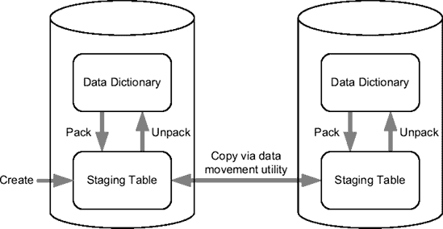

# 使用 SQL 计划基线覆盖执行计划

```sql
SQL> SELECT * FROM table(dbms_xplan.display_cursor);
```

```
SQL_ID dat4n4845zdxc, child number 0
---------------------------------------------
| Id  | Operation                    | Name |
---------------------------------------------
|   0 | SELECT STATEMENT             |      |
|   1 |  SORT AGGREGATE              |      |
|   2 |   TABLE ACCESS BY INDEX ROWID| T    |
|   3 |    INDEX RANGE SCAN          | I    |
---------------------------------------------
```

如果第二个执行计划比第一个更高效，你的目标就是让应用程序使用它。如果无法修改应用程序来移除或修改提示，你可以利用 SQL 计划基线来解决此问题。为此，你可以像前面描述的那样，自动或手动创建 SQL 计划基线。本例中，你决定使用初始化参数 `optimizer_capture_sql_plan_baselines`。

```sql
SQL> ALTER SESSION SET optimizer_capture_sql_plan_baselines = TRUE;

SQL> SELECT /*+ full(t) */ count(pad) FROM t WHERE n = 42;

SQL> SELECT /*+ full(t) */ count(pad) FROM t WHERE n = 42;

SQL> ALTER SESSION SET optimizer_capture_sql_plan_baselines = FALSE;
```

SQL 计划基线创建后，你需要验证它是否被实际使用。注意包 `dbms_xplan` 如何清晰地显示生成执行计划时使用了一个 SQL 计划基线（通过一个 *SQL 计划名称* 来标识）。

```sql
SQL> SELECT /*+ full(t) */ count(pad) FROM t WHERE n = 42;

SQL> SELECT * FROM table(dbms_xplan.display_cursor);
```

```
-----------------------------------
| Id  | Operation         | Name  |
-----------------------------------
|   0 | SELECT STATEMENT  |       |
|   1 |  SORT AGGREGATE   |       |
|   2 |   TABLE ACCESS FULL| T    |
-----------------------------------
```

```
Note
-----
- SQL plan baseline "SYS_SQL_PLAN_8fb2691f3fdbb376" used for this statement
```

然后，根据先前输出提供的 SQL 计划名称，你可以通过数据字典视图 `dba_sql_plan_baselines` 查找 SQL 计划基线的标识符，即 *SQL 句柄*：

```sql
SQL> SELECT sql_handle
  2  FROM dba_sql_plan_baselines
  3  WHERE plan_name = 'SYS_SQL_PLAN_8fb2691f3fdbb376';
```

```
SQL_HANDLE
------------------------------
SYS_SQL_3d1b0b7d8fb2691f
```

最后，你替换 SQL 计划基线使用的执行计划。为此，你需要加载与导致索引扫描的 SQL 语句相关的执行计划，并移除与全表扫描相关的那个。前者通过 SQL 标识符和哈希值引用，后者通过 SQL 句柄和 SQL 计划名称引用。

```sql
ret := dbms_spm.load_plans_from_cursor_cache(
         sql_id             => 'dat4n4845zdxc',
         plan_hash_value    => '3694077449',
         sql_handle         => 'SYS_SQL_3d1b0b7d8fb2691f'
       );

ret := dbms_spm.drop_sql_plan_baseline(
         sql_handle     => 'SYS_SQL_3d1b0b7d8fb2691f',
         plan_name      => 'SYS_SQL_PLAN_8fb2691f3fdbb376'
       );
```

要检查替换是否正确生效，你需要测试新的 SQL 计划基线。注意，即使 SQL 语句包含 `full` 提示，执行计划也不再使用全表扫描。

> **注意** 不恰当的提示是实践中导致低效执行计划的常见原因。能够使用本节介绍的技术覆盖它们是非常有用的。

```sql
SQL> SELECT /*+ full(t) */ count(pad) FROM t WHERE n = 42;

SQL> SELECT * FROM table(dbms_xplan.display_cursor);
```

```
---------------------------------------------
| Id  | Operation                    | Name  |
---------------------------------------------
|   0 | SELECT STATEMENT             |       |
|   1 |  SORT AGGREGATE              |       |
|   2 |   TABLE ACCESS BY INDEX ROWID| T     |
|   3 |    INDEX RANGE SCAN          | I     |
---------------------------------------------
```

```
Note
-----
   - SQL plan baseline SYS_SQL_PLAN_8fb2691f59340d78 used for this statement
```

要了解某个特定 SQL 语句是否使用了 SQL 计划基线，也可以检查动态性能视图 `v$sql` 中的 `sql_plan_baseline` 列。

## 从 SQL 调优集加载

要从 SQL 调优集加载 SQL 计划基线，可以使用包 `dbms_spm` 中的函数 `load_plans_from_sqlset`。加载过程只需指定 SQL 调优集的所有者和名称即可。以下调用（摘自脚本 `baseline_from_sqlset.sql`）说明了这一点：

```sql
ret := dbms_spm.load_plans_from_sqlset(
         sqlset_name  => 'test_sqlset',
         sqlset_owner => user
       );
```

通过此函数加载的 SQL 计划基线将存储为“已接受”状态，因此查询优化器能够立即利用它们。

该函数最重要的用途是升级到 Oracle Database 11*g*。实际上，它也可以加载由 Oracle Database 10*g* 创建的 SQL 调优集。脚本 `baseline_upgrade_10g.sql` 和 `baseline_upgrade_11g.sql` 展示了这种用法。

## 显示 SQL 计划基线

关于可用 SQL 计划基线的通用信息可以通过数据字典视图 `dba_sql_plan_baselines` 显示。要显示它们的详细信息，可以使用包 `dbms_xplan` 中的函数 `display_sql_plan_baseline`。请注意，它的工作方式与第 6 章中讨论的包 `dbms_xplan` 的其他函数类似。以下示例展示了使用它可以显示的信息类型：

```sql
SQL> SELECT *
  2  FROM table(dbms_xplan.display_sql_plan_baseline(
  3              sql_handle => 'SYS_SQL_492bdb47e8861a89'
  4            ));
```

```
-------------------------------------------------------------------------
SQL handle: SYS_SQL_3d1b0b7d8fb2691f
SQL text: SELECT count(pad) FROM t WHERE n = 42
-------------------------------------------------------------------------

-------------------------------------------------------------------------
Plan name: SYS_SQL_PLAN_8fb2691f3fdbb376
Enabled: YES     Fixed: NO      Accepted: YES Origin: MANUAL-LOAD
-------------------------------------------------------------------------

Plan hash value: 2966233522

-------------------------------------------------------------------------
| Id  | Operation         | Name | Rows | Bytes | Cost (%CPU)| Time     |
-------------------------------------------------------------------------
|   0 | SELECT STATEMENT  |      |    1 |   505 |    27   (0)| 00:00:01 |
|   1 |  SORT AGGREGATE   |      |    1 |   505 |            |          |
|*  2 |   TABLE ACCESS FULL| T   |    1 |   505 |    27   (0)| 00:00:01 |
-------------------------------------------------------------------------

Predicate Information (identified by operation id):
---------------------------------------------------

   2 - filter("N"=42)
```

不幸的是，要显示与 SQL 计划基线关联的提示列表，必须查询未公开的数据字典表。以下 SQL 语句显示了一个示例。请注意，由于提示以 XML 格式存储，需要进行转换才能获得可读的输出。

```sql
SQL> SELECT extractValue(value(h),'.') AS hint
  2  FROM sys.sqlobj$data od, sys.sqlobj$ so,
  3       table(xmlsequence(extract(xmltype(od.comp_data),'/outline_data/hint'))) h
  4  WHERE so.name = 'SYS_SQL_PLAN_8fb2691f3fdbb376'
  5  AND so.signature = od.signature
  6  AND so.category = od.category
  7  AND so.obj_type = od.obj_type
  8  AND so.plan_id = od.plan_id;
```

```
HINT
-------------------------------------------
FULL(@"SEL$1" "T"@"SEL$1")
OUTLINE_LEAF(@"SEL$1")
ALL_ROWS
DB_VERSION('11.1.0.6')
OPTIMIZER_FEATURES_ENABLE('11.1.0.6')
IGNORE_OPTIM_EMBEDDED_HINTS
```

## 演化 SQL 计划基线


当查询优化器识别出某个执行计划可能比 SQL 计划基线强制使用的执行计划更高效时，新的、未被接受的 SQL 计划基线会被自动添加。即使查询优化器无法立即使用它们，这一操作也会发生。这样做的目的是为了告知用户存在其他可能更优的执行计划。为了验证某个未被接受的执行计划是否真的比基于已接受 SQL 计划基线生成的计划执行得更好，需要进行一次*演进*尝试。这其实就是请求查询优化器使用不同的执行计划运行 SQL 语句，并判断某个未被接受的 SQL 计划基线是否能带来比已接受基线更好的性能。如果确实如此，该未被接受的 SQL 计划基线就会被设置为已接受状态。要执行一次演进，可以使用`dbms_spm`包中的`evolve_sql_plan_baseline`函数。要调用此函数，除了通过`sql_handle`和/或`plan_name`参数标识目标 SQL 计划基线外，还可以指定以下参数：

`time_limit`:

演进允许持续的时间，以分钟为单位。此参数接受一个自然数或常量`dbms_spm.auto_limit`与`dbms_spm.no_limit`。

`verify`:

如果设置为`yes`（默认值），则执行 SQL 语句以验证性能。如果设置为`no`，则不执行验证，直接接受 SQL 计划基线。

`commit`:

如果设置为`yes`（默认值），则根据演进结果修改数据字典。如果设置为`no`，并且参数`verify`也设置为`yes`，则会执行验证，但不会修改数据字典。

函数的返回值是一份详细描述演进过程的报告。以下 SQL 语句是一个示例。在此特定案例中，SQL 计划基线已成功演进。

```sql
SQL> SELECT dbms_spm.evolve_sql_plan_baseline(
  2           sql_handle => 'SYS_SQL_492bdb47e8861a89',
  3           plan_name => NULL,
  4           time_limit => 10,
  5           verify => 'yes',
  6           commit => 'yes'
  7         )
  8     FROM dual;

-------------------------------------------------------------------------
                     Evolve SQL Plan Baseline Report
-------------------------------------------------------------------------

Inputs:
-------
  SQL_HANDLE = SYS_SQL_492bdb47e8861a89
  PLAN_NAME  =
  TIME_LIMIT = 10
  VERIFY     = yes
  COMMIT     = yes
Plan: SYS_SQL_PLAN_e8861a8959340d78
-----------------------------------
  Plan was verified: Time used .01 seconds.
  Passed performance criterion: Compound improvement ratio >= 25.
  Plan was changed to an accepted plan.

                       Baseline Plan      Test Plan    Improv. Ratio
                       -------------      ---------    -------------
  Execution Status:        COMPLETE       COMPLETE
  Rows Processed:                 1               1
  Elapsed Time(ms):               0               0
  CPU Time(ms):                   0               0
  Buffer Gets:                   75               3                25
  Disk Reads:                     0               0
  Direct Writes:                  0               0
  Fetches:                        0               0
  Executions:                     1               1

---------------------------------------------------------------------------
                                 Report Summary
---------------------------------------------------------------------------
Number of SQL plan baselines verified: 1.
Number of SQL plan baselines evolved: 1.
```

除了上述手动演进方式，通过调优包还支持 SQL 计划基线的自动演进。其思路很简单：一个自动化任务会定期检查是否有未被接受的 SQL 计划基线需要被演进。

## 修改 SQL 计划基线

你可以使用`dbms_spm`包中的`alter_sql_plan_baseline`过程，不仅能修改创建 SQL 计划基线时指定的部分属性，还能更改其状态（启用或禁用）。参数`sql_handle`和`plan_name`用于标识要修改的 SQL 计划基线，两者至少需要指定一个。参数`attribute_name`和`attribute_value`分别指定要修改的属性及其新值。`attribute_name`参数接受以下值：

`enabled`:

此属性可设置为`yes`或`no`。注意，SQL 计划基线只有在设置为`yes`时才能被查询优化器使用。

`fixed`:

将此属性设置为`yes`后，SQL 计划基线将无法随时间演进，并且会优先于未固定的 SQL 计划基线被选用。它可以被设置为`yes`或`no`。

`autopurge`:

将此属性设置为`yes`的 SQL 计划基线，如果在一段保留期内（保留期的配置将在后面的“删除 SQL 计划基线”章节讨论）未被使用，将会被自动移除。它可以被设置为`yes`或`no`。

`plan_name`:

此属性用于更改 SQL 计划的名称。它可以是最多 30 个字符的任意字符串。

`description`:

此属性用于为 SQL 计划基线附加一段描述。它可以是最多 500 个字符的任意字符串。

在下面的调用中，一个 SQL 计划基线被禁用：

```sql
ret := dbms_spm. alter_sql_plan_baseline(
         sql_handle      => 'SYS_SQL_3d1b0b7d8fb2691f',
         plan_name       => 'SYS_SQL_PLAN_8fb2691f3fdbb376',
         attribute_name  => 'enabled',
         attribute_value => 'no'
       );
```

## 激活 SQL 计划基线

只有当动态初始化参数`optimizer_use_sql_plan_baselines`设置为`TRUE`时，查询优化器才会使用可用的 SQL 计划基线。其默认值为`TRUE`。你可以在会话和系统级别修改此参数。

## 迁移 SQL 计划基线

`dbms_spm`包提供了多个用于在数据库间迁移 SQL 计划基线的过程。当需要在开发或测试数据库上生成 SQL 计划基线，然后将其迁移到生产数据库时，此功能非常有用。如图 7-11 所示，它提供了以下功能：

*   你可以使用`create_stgtab_baseline`过程创建一个暂存表。
*   你可以通过`pack_stgtab_baseline`函数将 SQL 计划基线从数据字典复制到暂存表中。
*   你可以通过`unpack_stgtab_baseline`函数将 SQL 计划基线从暂存表复制到数据字典中。

请注意，在数据库间移动暂存表需要通过数据移动实用程序（例如 Data Pump 或传统的导出导入实用程序）来完成，而不是使用`dbms_spm`包本身（参见图 7-11）。

下面的示例摘自脚本`clone_baseline.sql`，展示了如何将 SQL 计划基线从一个数据库复制到另一个数据库。首先，在当前模式下创建暂存表`mystgtab`。

```sql
dbms_spm.create_stgtab_baseline(
  table_name          => 'MYSTGTAB',
  table_owner         => user,
  tablespace_name     => 'USERS'
);
```


**图 7-11.** 使用`dbms_spm`包迁移 SQL 计划基线

然后，将一个 SQL 计划基线从数据字典复制到暂存表中。你可以通过四种方式来标识要处理的 SQL 计划基线：


## 识别与打包 SQL 计划基线

可以通过以下几种方式识别 SQL 计划基线，以便将其打包到暂存表中：

*   通过参数 `sql_handle` 和可选参数 `plan_name` 来精确识别特定的 SQL 计划基线。
*   选择所有关联的 SQL 语句文本中包含特定字符串的 SQL 计划基线。为此，提供了支持通配符（例如 `%`）的参数 `sql_text`。注意，该参数区分大小写。
*   选择匹配以下一个或多个参数的所有 SQL 计划基线：`creator`、`origin`、`enabled`、`accepted`、`fixed`、`module` 和 `action`。如果指定了多个参数，则必须满足所有条件。
*   处理所有 SQL 计划基线。为此，不指定任何参数。

以下调用展示了一个精确识别 SQL 计划基线的示例：

```sql
ret := dbms_spm.pack_stgtab_baseline(
         table_name      => 'MYSTGTAB',
         table_owner     => user,
         sql_handle      => 'SYS_SQL_3d1b0b7d8fb2691f',
         plan_name       => 'SYS_SQL_PLAN_8fb2691f3fdbb376'
       );
```

此时，暂存表 `mystgtab` 通过数据移动工具从一个数据库复制到另一个数据库。

最后，SQL 计划基线从暂存表复制到目标数据库的数据字典中。与 `pack_stgtab_baseline` 函数一样，同样有几种方法可用于识别要处理的 SQL 计划基线。以下调用展示了一个根据关联的 SQL 语句文本来识别 SQL 计划基线的示例：

```sql
ret := dbms_spm.unpack_stgtab_baseline(
         table_name  => 'MYSTGTAB',
         table_owner => user,
         sql_text    => '%FROM t%'
       );
```

## 删除 SQL 计划基线

可以使用 `dbms_spm` 包中的 `drop_sql_plan_baseline` 过程从数据字典中删除 SQL 计划基线。参数 `sql_handle` 和 `plan_name` 用于标识要删除的 SQL 计划基线。两者中至少必须指定一个。以下调用对此进行了说明：

```sql
ret := dbms_spm.drop_sql_plan_baseline(
         sql_handle => 'SYS_SQL_3d1b0b7d8fb2691f',
         plan_name  => 'SYS_SQL_PLAN_8fb2691f3fdbb376'
       );
```

未使用的、且 `fixed` 属性未设置为 `yes` 的 SQL 计划基线会在保留期过后被自动清除。默认保留期为 53 周。当前值可通过数据字典视图 `dba_sql_management_config` 显示。

```sql
SQL> SELECT parameter_value
  2  FROM dba_sql_management_config
  3  WHERE parameter_name = 'PLAN_RETENTION_WEEKS';

PARAMETER_VALUE
---------------
             53
```

可以通过调用 `dbms_spm` 包中的 `configure` 过程来更改保留期。支持 5 到 523 周的值。以下示例展示了如何将其更改为 12 周。如果参数 `parameter_value` 设置为 `NULL`，则恢复默认值。

```sql
dbms_spm.configure(
  parameter_name  => 'plan_retention_weeks',
  parameter_value => 12
);
```

## 权限

当 SQL 计划基线被自动捕获时（即通过将初始化参数 `optimizer_capture_sql_plan_baselines` 设置为 `TRUE`），创建它们不需要特殊权限。

只有拥有系统权限 `administer sql management object` 的用户才能执行 `dbms_spm` 包（`dba` 角色默认包含此权限）。SQL 计划基线不存在对象权限。

最终用户使用 SQL 计划基线不需要特殊权限。

## 使用场景

您应该考虑在两种情况下使用此技术。首先，当您正在对特定的 SQL 语句进行调优，且无法在应用程序中修改它时（例如，无法添加提示）。其次，当无论出于何种原因，您正经历执行计划不稳定的问题时。

遗憾的是，SQL 计划基线仅在企业版中可用。

###### 陷阱与谬误

您必须意识到，当 SQL 计划基线所依赖的对象被删除时，它们不会立即被删除。但这不一定是个问题。例如，如果需要因为重组或移动而重新创建表或索引，不删除 SQL 计划基线是件好事；否则，就需要重新创建它们。无论如何，未使用的 SQL 计划基线会在保留期结束时被清除。

两个文本相同的 SQL 语句具有相同的签名。即使它们引用不同模式中的对象，也是如此。这意味着单个 SQL 计划基线可能会用于两个名称相同但位于不同模式中的表！您必须非常小心，尤其是在数据库中存在多个相同对象副本的情况下。

SQL 计划基线存储在 `sysaux` 表空间中。默认情况下，最多可以使用该表空间的 10%。当前值可通过数据字典视图 `dba_sql_management_config` 显示：

```sql
SQL> SELECT parameter_value
  2  FROM dba_sql_management_config
  3  WHERE parameter_name = 'SPACE_BUDGET_PERCENT';

PARAMETER_VALUE
---------------
             10
```

当超过阈值时，警报日志中会写入一条警告消息。要更改默认阈值，可以使用 `dbms_spm` 包中的 `configure` 过程。支持 1% 到 50% 之间的值。以下示例展示了如何将其更改为 5%。如果参数 `parameter_value` 设置为 `NULL`，则恢复默认值。

```sql
dbms_spm.configure(
  parameter_name  => 'space_budget_percent',
  parameter_value => 5
);
```

## 接下来是第 8 章

本章描述了几种 SQL 调优技术。选择其中一种并不总是容易的。然而，如果您了解使用它们的优缺点，选择就会容易得多。话虽如此，在实践中，您的选择是有限的，因为您不能在所有情况下应用所有技术。这可能是由于技术限制，也可能是由于许可问题。

本章是最后一章完全专注于查询优化器。从下一章开始，第 4 部分就开始了。终于到了不仅可以学习如何高效地访问和连接数据，还可以学习如何利用旨在提高 SQL 语句性能的众多特性的时候了。

第 4 部分的第一章专门讨论解析，这无疑是 SQL 语句执行的核心步骤。它之所以如此重要，是因为查询优化器在此时生成执行计划。为了始终拥有高效的执行计划，您需要解析数据库引擎执行的每条 SQL 语句，但反过来，解析本身是一个非常昂贵的操作。因此，必须将其最小化，并且应尽可能多地重用执行计划——但也不能过度。这可能意味着执行计划并非总是高效的。再次强调，为了以最佳方式利用数据库引擎，您必须了解其工作原理以及不同特性的优缺点。


## 第四部分
优化

*性能即是现实，忘掉其他一切*。

—哈罗德·吉宁[¹]

只有当你确定了性能问题的根本原因后，才应该尝试去解决它。如`第 3 章`所述，存在几种不同类型的问题。无论你面临的是哪种问题，核心目标都是减少——甚至最好是消除——最耗时操作所花费的时间。请注意，单个操作可能由一连串按顺序执行的动作组成。例如，为了完整处理一个返回大量数据的查询，需要进行多次获取操作。

`第 8 章`描述了解析如何工作、如何识别解析问题，以及如何在不影响性能的前提下最小化解析带来的影响。`第 9 章`介绍如何利用可用的访问结构来高效访问存储在单表中的数据。`第 10 章`则更进一步，超越单表访问，描述如何将来自多个表的数据连接在一起。`第 11 章`涉及并行处理以及用于加速流插入和最小化组件间交互的技术。最后，`第 12 章`描述了一些物理存储参数也可能对性能产生可观察到的影响。简而言之，本部分各章旨在展示如何通过利用数据库引擎为此目的提供的众多特性，来改善与 SQL 引擎交互操作的响应时间。

[¹]: 该引言出处见 [`www.quotationspage.com/quote/4442.html`](http://www.quotationspage.com/quote/4442.html)。

### 第 8 章
解析

解析对整体性能的影响差异极大。在某些情况下，它几乎察觉不到。在其他情况下，它却是导致性能问题的主要原因之一。如果你遇到解析问题，通常意味着应用程序没有正确处理它。这是一个大问题，因为要改变应用程序的行为，往往需要大量修改代码。开发者需要了解解析的含义，并学会如何编写代码以尽可能避免与之相关的问题。

`第 2 章`描述了游标的生命周期以及解析的工作原理。本章将阐述如何识别、解决和规避解析问题。我还将讨论与解析相关的开销。最后，我将介绍常见应用程序编程接口所提供的、用于减少解析活动的特性。

#### 识别解析问题

在识别解析问题时，很容易陷入“强迫性调优紊乱”的状态。问题在于，多个动态性能视图包含了详细记录软解析、硬解析和执行次数的计数器。这些计数器以及基于它们计算出的比率是无用的，因为它们没有提供关于解析所花费时间的信息。请注意，对于解析而言，这是一个真正的问题，因为解析没有典型的持续时间。事实上，根据 SQL 语句的复杂程度及其引用的对象，解析的持续时间通常会相差几个数量级。简而言之，这类计数器只能告诉你数据库引擎执行了解析操作，次数是多还是少，但没有提供这是否是问题的任何信息。因此，在实践中，它们可能仅对趋势分析有用。

如果你遵循`第 3 章`描述的分析路线图，就应该清楚，你应该考虑的识别解析问题的唯一有效方法是测量解析操作花费了多少时间。对于这类分析，如果你寻找的是确凿证据而不仅仅是线索，那么只有一个信息来源可以使用：SQL 跟踪生成的输出。请注意，我认为基于动态性能视图（如`v$sesstat`和`v$sess_time_model`）中找到的解析时间的方法价值不大，因为它们通常无法找出哪些 SQL 语句是导致高解析时间的罪魁祸首。

主要有两种解析问题。第一种与持续时间极短的解析相关。我们称之为快速解析。当然，要使其引人注目，需要执行大量的快速解析。第二种解析问题与持续时间很长的解析相关。我们称之为长时解析。这种情况通常发生在 SQL 语句相当复杂，查询优化器需要很长时间来生成高效执行计划时。此时，执行次数就不那么重要了。

我将在接下来的两节中描述识别这两种解析问题的方法。由于它们的识别方法没有本质区别，我将只详细描述第一种。


##### 快速解析

以下章节描述了如何识别由快速解析导致的性能问题。由于第 3 章介绍了两种性能分析工具——TKPROF 和 TVD$XTAT，我将使用相同的示例来展示这两种工具的输出文件。本节用作示例的跟踪文件是通过执行存储在文件 `ParsingTest1.java` 中的 Java 类生成的。跟踪文件和两个输出文件都可以在文件 `ParsingTest1.zip` 中找到。同样处理过程的 PL/SQL、C (OCI) 和 C# (ODP.NET) 实现版本也一并提供。

##### 使用 TKPROF

如第 3 章所建议，使用以下选项执行 TKPROF：

```bash
tkprof <跟踪文件> <输出文件> sys=no sort=prsela,exeela,fchela
```

开始分析输出文件时，先查看最后几行总是有益的。在这个特定案例中，重要的是要注意：处理过程持续了大约 13 秒，应用程序执行了 10,000 条 SQL 语句，并且很可能几乎所有 SQL 语句彼此都不相同（`SQL 语句 ≍ 唯一 SQL 语句`）。

```
跟踪文件中有一个会话。
跟踪文件中有 10000 条用户 SQL 语句。
跟踪文件中有 62 条内部 SQL 语句。
跟踪文件中共有**`10062 条 SQL 语句`**。
跟踪文件中共有**`10013 条唯一 SQL 语句`**。
跟踪文件中有 110627 行。
跟踪文件中耗时**`13 秒`**。
```

接下来，该检查输出文件中列出的第一条 SQL 语句持续了多长时间。请记住，由于您指定了 `sort` 选项，SQL 语句已根据其响应时间排序。有趣的是，第一个游标的响应时间（`elapsed` 列）少于 0.01 秒（`0.00`）。换句话说，所有 SQL 语句的执行时间都少于 0.01 秒。实际上，平均每次执行耗时 1.3 毫秒（`13/10,000`）。这意味着响应时间肯定不是由少数运行时间长的 SQL 语句造成的，而是由短时间内处理的大量 SQL 语句导致的。

```
调用        次数       CPU 耗时    经过时间       磁盘读       一致性读       当前读       行数
------- ------ -------- ---------- ---------- ---------- ---------- ----------
解析        1     0.00       0.00          0          0          0          0
执行        1     0.00       0.00          0          0          0          0
获取        1     0.00       0.00          0          2          0          0
------- ------ -------- ---------- ---------- ---------- ---------- ----------
总计        3     0.00 **`0.00`**          0          2          0          0
```

在这种情况下，要了解解析是否是问题，必须检查提供总体汇总的部分。根据执行统计，解析时间约占总处理时间的 95%（`4.83/5.10`）。这清楚地表明数据库引擎除了进行解析之外，几乎没有做其他任何事情。

```
调用        次数       CPU 耗时    经过时间       磁盘读       一致性读       当前读       行数
------- ------ -------- ---------- ---------- ---------- ---------- ----------
解析    10000     4.83 **`4.83`**          0          0          0          0
执行  10000     0.12       0.13          0          0          0          0
获取    10000     0.20       0.13          0      23051          0       3048
------- ------ -------- ---------- ---------- ---------- ---------- ----------
总计    30000     5.10 **`5.10`**          0      23051          0       3048
```

以下行也显示，10,000 次解析中的每一次都是硬解析。请注意，尽管高比例的硬解析通常不受欢迎，但它不一定是个问题。它只是一个线索，表明某些地方可能不是最优的。

```
解析期间库缓存未命中次数：**`10000`**
```

执行统计的问题在于，它们遗漏了大约 61%（`1–5.10/13`）的响应时间。实际上，通过查看等待事件汇总表，可以看到有 5.94 秒用于等待客户端。然而，这仍然留给我们大约两秒（`13–5.94–5.10`）的时间未被解释清楚。

```
等待事件                           等待次数   最大等待时间   总等待时间
---------------------------------------- ------------ ------------
SQL*Net message to client             10000       0.00         0.00
SQL*Net message from client           10000       0.02 **`5.94`**
latch: shared pool                        1       0.00         0.00
```

既然您知道解析是个问题，明智的做法是查看一下 SQL 语句。在这个案例中，通过查看其中一些 SQL 语句（以下是前五条），很明显它们非常相似。只有`WHERE`子句中使用的字面量不同。这是一个未使用绑定变量的典型案例。

```sql
SELECT pad FROM t WHERE val = 7650
SELECT pad FROM t WHERE val = 8977
SELECT pad FROM t WHERE val = 3233
SELECT pad FROM t WHERE val = 7777
SELECT pad FROM t WHERE val = 3234
```

这种情况下的问题在于，TKPROF 无法识别仅在字面量值上有所不同的 SQL 语句。事实上，即使将 `aggregate` 选项设置为 `yes`（这是默认设置），也只有文本完全相同的 SQL 语句才会被分组在一起。这是一个重大缺陷，在实际案例中使得使用 TKPROF 分析解析问题变得困难。为了使其稍微容易一些，可以指定 TKPROF 的 `record` 选项。这样，会生成一个仅包含 SQL 语句的文件。

```bash
tkprof <跟踪文件> <输出文件> sys=no sort=prsela,exeela,fchela record=<SQL 文件>
```

然后，您可以使用命令行实用程序（如 `grep` 和 `wc`）来找出有多少相似的 SQL 语句。例如，以下命令返回值 10,000：

```bash
grep "SELECT pad FROM t WHERE val =" <SQL 文件> | wc -l
```

##### 使用 TVD$XTAT

执行 TVD$XTAT 时无需指定特定选项：

```bash
tvdxtat –i <跟踪文件> -o <输出文件>
```

分析输出文件从查看整体资源使用概况开始。这里的处理过程持续了大约 13 秒。其中，大约 45%的时间用于等待客户端，大约 39%的时间在 CPU 上运行。这些数据与上一节描述的数据基本一致。只是精度不同。第一部分唯一的附加信息是，明确给出了未解释清楚的时间。

```
组件                      总耗时       占比    事件次数       单次事件耗时
---------------------------- --------- -------- ---------- -------------
SQL*Net message from client      5.946 **`45.353`**     10,000         0.001
CPU                              5.132 **`39.147`**        n/a           n/a
**`未解释清楚`**                    2.024   15.436        n/a           n/a
SQL*Net message to client        0.007    0.054     10,000         0.000
latch: shared pool               0.001    0.010          1         0.001
---------------------------- --------- --------
总计 **`13.110`**  100.000
```

仅通过查看非递归 SQL 语句的汇总，您就可以看到单个 SQL 语句对整个处理过程负责。这是 TKPROF 和 TVD$XTAT 之间的一个显著差异。事实上，TVD$XTAT 能够识别相似的 SQL 语句并将它们一并报告。

```
语句 ID   类型       总耗时       占比    执行次数       单次执行耗时
------------- ------- --------- ------- ----------- -------------
1             SELECT     11.086  84.564      10,000         0.001
------------- ------- --------- -------
总计                    11.086  84.564
```


