# SQL 性能分析文档

## 输出文件概述
在输出文件中，仅显示分析期间发现的第一条 SQL 语句。此外，一条消息会告知发现的相似 SQL 语句数量：

`检测到 10000 条相似的 SQL 语句`

## 执行统计分析
根据执行统计信息，对于 SQL 语句编号 1（不包括递归语句），解析时间约占处理时间的 95%（4.835/5.106）。这清楚地表明数据库引擎除了解析外几乎没有做其他事情。TKPROF 和 TVD$XTAT 输出文件之间执行统计的细微差别在于，TVD$XTAT 在解析调用次数旁边显示了未命中次数（换句话说，硬解析次数）。

```
调用类型    计数    未命中次数    CPU 耗时    已用时间    物理读    逻辑读    一致性读    当前行数    返回行数
--------  -------  ----------  --------  --------  ------  -------  ---------  --------  -----
解析        10,000      10,000      4.835      4.835       0        0          0         0      0
执行        10,000          0      0.122      0.139       0        0          0         0      0
提取        10,000          0      0.150      0.131       0   23,051     23,051         0  3,048
--------  -------  ----------  --------  --------  ------  -------  ---------  --------  -----
总计        30,000      10,000      5.107      5.106       0   23,051     23,051         0  3,048
```

这些执行统计的问题在于，响应时间中约有 54%（1–5.106/11.086）未在其中体现。无论如何，你可以通过查看此处显示的 SQL 语句级别的资源使用情况配置文件来查看缺失的时间；具体来说，有 5.946 秒用于等待客户端。

```
组件类型                       持续时间      占比    事件次数    单次事件持续时间
----------------------------  ---------  -------  ----------  -------------
SQL*Net message from client      5.946   53.631       10,000         0.001
CPU                              5.107   46.067         n/a           n/a
递归语句                         0.025    0.225         n/a           n/a
SQL*Net message to client        0.007    0.064       10,000         0.000
latch: shared pool               0.001    0.012           1         0.001
----------------------------  ---------  -------
总计                           11.086  100.000
```

## 问题总结
TKPROF 和 TVD$XTAT 执行的分析表明，数据库引擎执行的处理完全归因于解析。然而，在数据库端，解析仅占整体响应时间的约 37%（4.835/13.110）。这意味着消除它应该大约可以使整体响应时间减半。分析还显示，有 10,000 条类似于以下内容的 SQL 语句被解析并执行了一次：

`SELECT pad FROM t WHERE val = 3233`

由于使用了不断变化的字面值，库缓存中的共享游标无法被重用。换句话说，每次解析都是一次硬解析。图 8-1 展示了此处理过程的图形化表示。

---

**注意** 图 8-1 中所示的处理过程在后文中被称为*测试用例 1*。

---

不言而喻，这样的处理是低效的。有关此类问题的可能解决方案，请参阅本章后面的“解决解析问题”部分。

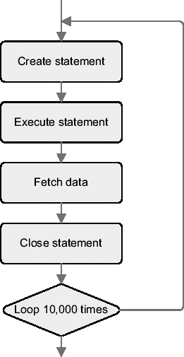

**图 8-1.** *测试用例 1 执行的处理过程*

##### 长解析
以下各节描述了如何识别由长解析引起的性能问题。由于第 3 章描述了两种性能分析器 TKPROF 和 TVD$XTAT，我将针对两种分析器的输出文件讨论同一个例子。本节中用作示例的跟踪文件是通过执行脚本 `long_parse.sql` 生成的。跟踪文件和输出文件可在文件 `long_parse.zip` 中找到。

##### 使用 TKPROF
与快速解析一样，分析从 TKPROF 输出的末尾开始。在此特定情况下，值得注意的是处理持续了大约一秒钟，并且应用程序只执行了三条 SQL 语句。所有其他 SQL 语句都是由数据库引擎递归执行的。

```
跟踪文件中有 1 个会话。
跟踪文件中有 3 条用户 SQL 语句。
跟踪文件中有 612 条内部 SQL 语句。
跟踪文件中共有 615 条 SQL 语句。
跟踪文件中有 16 条唯一的 SQL 语句。
跟踪文件共有 4931 行。
跟踪文件中总耗时 1 秒。
```

通过查看输出文件中第一条 SQL 语句的执行统计信息，不仅可以看到它对整个响应时间（约一秒）负全责，而且所有时间都花在了一次解析上：

```
调用类型  计数      CPU 耗时    已用时间      物理读    查询次数    当前行数    返回行数
-------  ------  ----------  ----------  ----------  ----------  ----------  ----------
解析       1      1.07         1.05            0          0          0          0
执行       1      0.00         0.00            0          0          0          0
提取       2      0.00         0.00            0         19          0          1
-------  ------  ----------  ----------  ----------  ----------  ----------  ----------
总计       4      1.08         1.06            0         19          0          1
```

##### 使用 TVD$XTAT
与快速解析一样，TVD$XTAT 输出的分析始于查看整体资源使用情况配置文件。处理持续了大约 1.6 秒。其中，约 71%的时间用于在 CPU 上运行，29%的时间用于等待客户端。另请注意，在这种情况下，未计入的时间非常短，因此完全可以忽略不计。

```
组件类型                       持续时间      占比    事件次数    单次事件持续时间
----------------------------  ---------  -------  ----------  -------------
CPU                              1.139   71.281         n/a           n/a
SQL*Net message from client      0.471   29.478           5         0.094
SQL*Net message to client        0.000    0.001           5         0.000
SQL*Net more data from client    0.000    0.001           1         0.000
未计入时间                       -0.012   -0.761         n/a           n/a
----------------------------  ---------  -------
总计                            1.598  100.000
```

仅通过查看非递归 SQL 语句的摘要，你就可以看到执行了三条 SQL 语句。其中，第一条几乎承担了全部的响应时间。

```
语句 ID    类型      持续时间    占比    执行次数    单次执行耗时
-------------  -------  ---------  -------  -----------  -------------
1             SELECT     1.138   71.230           1         1.138
5             PL/SQL     0.003    0.201           1         0.003
13            PL/SQL     0.001    0.063           1         0.001
-------------  -------  ---------  -------
总计                    1.142   71.493
```

请注意，在前面的表格中，总计不是 100%，因为一次长时间的 `SQL*Net message from client` 等待未与任何游标关联。确认这一点的唯一方法是打开跟踪文件并搜索属于任何游标的等待（此类等待在跟踪文件中与游标#0 关联）。


`...`
`WAIT #0:   nam='SQL*Net   message to client' ela= 1 driver id=1413697536 ...`
`WAIT #0:   nam='SQL*Net   message from client' ela= 465535 driver id=1413697536 ...`
`WAIT #0:   nam='SQL*Net more data from client' ela= 16 driver id=1413697536 ...`
`...`

您可以通过查看该类事件的以下详细统计数据来确认这一点。尤其请注意，有一个事件持续了大约 0.5 秒，而归属于 SQL 语句的总体等待时间为 3 毫秒。

```
Total           Number of           Duration per
Duration [μs]   Duration        %     Events        %    Event [μs]
-------------- --------- -------- ---------- -------- -------------
< 1024             0.001    0.131          1   20.000           618
< 2048             0.003    0.585          2   40.000         1,377
< 4096             0.002    0.435          1   20.000         2,050
< 524288           0.466   98.849          1   20.000       465,535
------------- ---------- -------- ---------- -------- -------------
Total              0.471  100.000          5  100.000        94,191
```

`2 statements contributed to this event.`

```
                         Total
Statement ID Type     Duration     %
------------ ------- --------- -------
1            SELECT      0.002   0.463
5            PL/SQL      0.001   0.253
------------ ------- --------- -------
Total                    0.003    0.716
```

根据引发问题的 SQL 语句的非递归执行统计信息，单个解析操作约占处理时间的 100%（1.056/1.061）。这清楚地表明，数据库引擎除了解析之外什么也没做。

```
Call       Count  Misses    CPU  Elapsed  PIO     LIO  Consistent  Current  Rows
-------- ------- ------- ------ -------- ---- ------- ----------- -------- -----
Parse          1       1  1.080    1.056    0       0           0       0      0
Execute        1       0  0.001    0.001    0       0           0       0      0
Fetch          2       0  0.003    0.003    0      19          19       0      1
-------- ------- ------- ------ -------- ---- ------- ----------- -------- -----
Total          4        1  1.084    1.061    0      19          19       0      1
```

## 问题总结

使用 TKPROF 和 TVD$XTAT 进行的分析表明，单个 SQL 语句几乎导致了整个响应时间。此外，对于这个特定的 SQL 语句，整个响应时间都是由解析造成的。消除它可能会大大减少响应时间。

#### 解决解析问题

解决解析问题的明显方法是避免解析阶段。不幸的是，这并不总是那么容易。事实上，根据解析问题是与快速解析相关还是与长解析相关，你必须采用不同的技术来解决问题。我将在接下来的章节中分别讨论这两种情况。在两种情况下，都使用“识别解析问题”一节中描述的示例作为解释可能解决方案的基础。

---

**注意** 以下各节通过展示不同性能测试的结果来描述解析的影响。性能数据仅用于帮助比较不同类型的处理，并让你对其影响有所感受。请记住，每个系统和每个应用都有其自身的特点。因此，使用每种技术的相关性可能因其应用位置而有很大不同。

---

##### 快速解析

本节描述如何利用**预备语句**来避免不必要的解析操作。由于实现细节取决于开发环境，此处不作涵盖。本章后面，特别是在“使用应用程序编程接口”一节中，我将提供关于 PL/SQL、OCI、JDBC 和 ODP.NET 的详细信息。

###### 使用预备语句

当一个引发解析问题的 SQL 语句使用不断变化的字面量时，首先要做的就是用**绑定变量**替换这些字面量。为此，你必须使用`预备语句`。使用`预备语句`的目的是为所有 SQL 语句共享单个游标，从而避免不必要的硬解析。图 8-2 展示了旨在改进测试用例 1 中性能的处理过程的图形化表示。

---

**注意** 图 8-2 所示的处理过程在后面被称为*测试用例 2*。

---

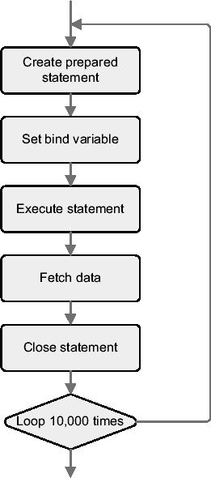

**图 8-2.** *测试用例 2 执行的处理过程*

通过这一增强，如图 8-3 所示，与测试用例 1 相比，响应时间减少了约 41%。这是预期的结果，因为新代码借助`预备语句`只执行了一次硬解析。因此，避免了测试用例 1 中数据库引擎执行的大部分处理。但请注意，仍然执行了 10,000 次软解析。

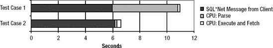

**图 8-3.** *测试用例 1 和测试用例 2 的数据库端资源使用情况对比（占响应时间少于 1%的组件因不可见而未显示）*

###### 重用预备语句

我在前一节提到使用`预备语句`是件非常好的事情。而重用它们则更好，不仅可以消除硬解析，还可以消除软解析。由于在测试用例 2 中，解析的耗时几乎可以忽略不计，你可能会问为什么。在给出答案之前，我将展示与重用单个`预备语句`的处理相关的性能数据。具体来说，图 8-4 展示了旨在改进测试用例 2 中性能的处理过程的图形化表示。

---

**注意** 图 8-4 所示的处理过程在后面被称为*测试用例 3*。

---

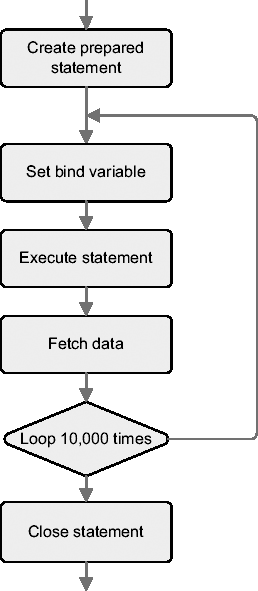

**图 8-4.** *测试用例 3 执行的处理过程*

通过这一增强，如图 8-5 所示，与测试用例 1 和测试用例 2 相比，响应时间分别减少了约 61%和 33%。值得注意的是，真正的差异并非由解析 CPU 时间的减少造成（这在测试用例 2 中已经非常低），而是由`SQL*Net message from client`等待的减少造成的。这意味着你在网络或客户端，或者可能两者都节省了资源。

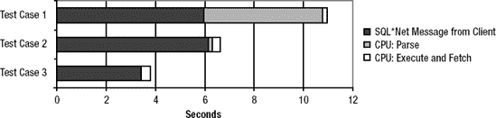

**图 8-5.** *三个测试用例的数据库端资源使用情况对比（占响应时间少于 1%的组件因不可见而未显示）*


在测试用例 2 中，数据库级别的软解析处理耗时约为十分之一秒。问题在于，性能提升从何而来？这肯定不是源于数据库级别的资源利用率降低。你可能会直觉地认为，收益是因为客户端与服务器之间的往返次数减少了。然而，通过观察 `SQL*Net message from client` 或 `SQL*Net message to client` 的等待次数，可以看到三个测试用例之间并无差异。每个用例都有 10,000 次往返。这一点很重要，因为执行了 10,000 次操作，因此这意味着在这个特定案例中，客户端驱动程序将 `parse`、`execute` 和 `fetch` 调用打包在了单个 `SQL*Net` 消息中。然而，网络层存在差异，这是由于客户端和服务器之间发送的消息大小不同造成的。你可以使用以下查询来获取相关信息：
```sql
SELECT sn.name, ss.value
FROM v$statname sn, v$sesstat ss
WHERE sn.statistic# = ss.statistic#
AND sn.name LIKE 'bytes%client'
AND ss.sid = 42
```

图 8-6 显示了三个测试用例的数据。需要注意的是，预处理语句如何轻微增加了从数据库引擎接收的消息大小。然而，最重要的区别在于，与测试用例 3 相比，测试用例 1 和 2 中，数据库引擎接收和发送的消息大小显著减少。这是由于在网络上发送数据以打开和关闭新游标造成的（例如，在测试用例 3 中，SQL 语句的文本仅通过网络发送一次）。

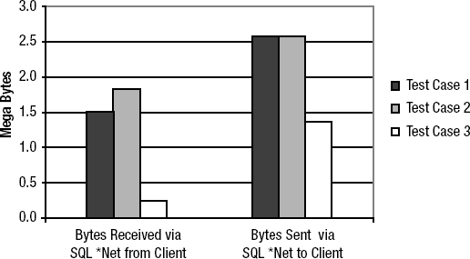

图 8-6. 三个测试用例单次执行的网络流量

由于通过网络发送的消息大小不同，响应时间预计会依赖于网络速度。如果网络很快，客户端和服务器之间通信的影响很小，甚至可能察觉不到。如果网络很慢，影响可能就很大了。图 8-7 显示了两种网络速度下的数据。请注意，对于给定的测试用例，数据库引擎处理调用所花费的时间显然不依赖于网络速度。

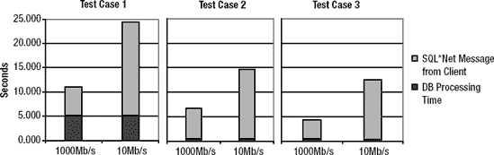

图 8-7. 两种网络速度下三个测试用例的响应时间

即使网络速度对整体响应时间有影响，也需要注意三个测试用例对客户端资源利用率（特别是 CPU）的影响截然不同。图 8-8 显示了使用性能分析器测量的客户端 CPU 利用率。比较测试用例 1 和 2 的数据表明，使用绑定变量对客户端有少量开销。比较测试用例 2 和 3 的数据表明，创建和关闭 SQL 语句给客户端带来了显著的额外开销。

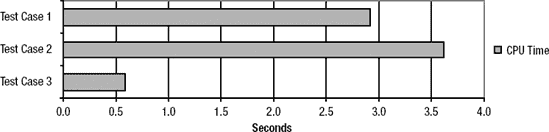

图 8-8. 三个测试用例的客户端 CPU 利用率

通过比较测试用例 2 与测试用例 3 的结果，你可以看到，图 8-8 所示客户端 CPU 的减少量（3.6 – 0.6 = 3.0）几乎与图 8-5 中与数据库活动无关的已用时间的减少量（6.1 – 3.4 = 2.7）相匹配。

## 客户端语句缓存

此功能旨在解决因游标不必要地打开和关闭而导致应用程序产生过多软解析的性能问题。本章前面部分已通过测试用例 2 指出了此问题。

客户端语句缓存的概念相当简单。每当应用程序关闭游标时，并非真正关闭它，而是由负责与数据库引擎通信的客户端数据库层保持其打开状态，并将其添加到缓存中。然后，稍后如果基于相同 SQL 语句的游标再次被打开和解析，则不会真正打开和解析它，而是重用缓存的游标。因此，应该不会发生软解析。基本上，其目标是让应用程序表现得像测试用例 3 一样，即使它是按测试用例 2 的方式编写的。

要利用此功能，通常只需启用它并定义一个会话可以缓存的最大游标数即可。请注意，当缓存满时，最近最少使用的游标会被较新的游标替换。激活方式可以是向应用程序中添加一些初始化代码，也可以是在环境中设置变量。具体如何工作取决于编程环境。本章稍后，在“使用应用程序编程接口”一节中，将提供关于 `PL/SQL`、`OCI`、`JDBC` 和 `ODP.NET` 的详细信息。要设置缓存游标的最大数量，你需要了解正在使用的应用程序。如果不知道，你应该分析 `TKPROF` 或 `TVD$XTAT` 的输出，以找出哪些 SQL 语句经历了大量软解析。无论哪种情况，这都只是初步估计。之后，你需要进行一些测试来验证该值是否合适。无论如何，超过初始化参数 `open_cursors` 的值是没有意义的。

如图 8-9 所示，启用了客户端语句缓存的测试用例 2 的表现几乎与测试用例 3 一样好。实际上，两者都只执行了一次硬解析和一次软解析。因此，多亏了语句缓存，客户端处理大大减少。

图 8-10 显示了对于测试用例 2，使用性能分析器测量的、启用和不启用客户端语句缓存两种情况下的客户端 CPU 利用率。从这些数据可以明显看出，使用客户端语句缓存不仅对服务器有利，对客户端也有利。实际上，在这种情况下，客户端尤其受益。

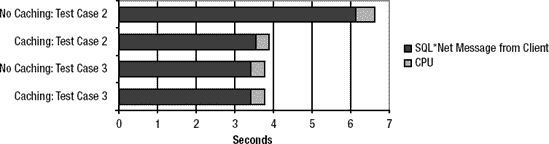

图 8-9. 启用与不启用客户端语句缓存时数据库端资源使用概况的比较（占响应时间不足 1%的组件未显示，因为它们不可见）

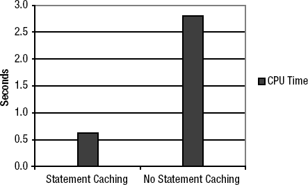

图 8-10. 启用与不启用客户端语句缓存时的客户端 CPU 利用率

## 总结

利用带有绑定变量的预处理语句对于避免不必要的硬解析至关重要。然而，使用它们时，你可能会在客户端 CPU 利用率和网络流量方面遇到少量额外开销。你可能会认为这种开销会导致性能问题，因此只应在真正必要时才使用预处理语句和绑定变量。由于这种开销几乎总是可以忽略不计，因此最佳实践是尽可能使用预处理语句和绑定变量，只要它们不会导致低效的执行计划（有关此主题的详细信息，请参阅第 2 章和第 4 章）。


### 重用准备语句
当一个准备语句被频繁使用时，重用它是个好主意。这样做不仅可以避免软解析，还能降低客户端 CPU 利用率和网络流量。保持准备语句打开的唯一问题与内存利用率有关，涉及客户端和服务器端。这意味着，每个会话保持数千个游标打开必须谨慎操作，且仅在内存充足的情况下进行。同时请注意，初始化参数 `open_cursors` 限制了单个会话可以同时保持打开的游标数量。如果需要缓存大量准备语句，使用经过仔细调整缓存大小的客户端语句缓存可能比手动保持它们打开更好。这样，通过限制可缓存的准备语句数量，可以缓解内存压力。

##### 长解析
对于只执行少数几次（或如前例仅执行一次）的长解析，通常无法避免解析阶段。事实上，SQL 语句至少必须被解析一次。此外，如果 SQL 语句很少执行，则很可能不可避免地发生硬解析，因为在执行之间游标会从库缓存中老化清除。在未使用绑定变量的情况下尤其如此。因此，唯一可能的解决方案是减少解析时间本身。

是什么导致了长解析时间？通常，它们是由于查询优化器评估了过多的不同执行计划所致。这意味着，要缩短解析时间，必须减少评估的执行计划数量。这通常只能通过提示或存储大纲强制指定执行计划来实现。例如，在为“识别解析问题”一节中用作示例的 SQL 语句创建存储大纲后，解析时间降低了一个数量级（参见图 8-11）。通过直接在 SQL 语句中指定提示也可能达到类似效果，但这仅在你能够修改代码时才可能。

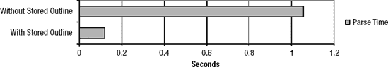

**图 8-11.** *有无存储大纲情况下的解析时间对比*

#### 规避解析问题
前几节描述了与快速解析相关的三个测试用例。第一个纯粹是代码编写不佳的案例。第二个比第一个好得多。第三个在大多数情况下是最好的。困境在于，为了增强代码必须对其进行修改，而这并非总是可行。这要么是因为代码不可用，要么是由于技术障碍（例如，编程环境不支持准备语句），或者仅仅是因为进行所有必要修改的“代价”太高。

接下来的几节将解释如何规避此类问题，以达到类似于正确实施所获得的结果。即使这些变通方法的性能不如正确实施可能达到的那样好，但在某些情况下，变通方法远比什么都不做要好得多。

* * *

**注意** 以下各节通过展示不同性能测试的结果来说明解析的影响。性能数据仅用于帮助比较不同类型的处理并让你对其影响有所感受。请记住，每个系统和每个应用程序都有其自身特点。因此，根据应用位置的不同，使用每种技术的相关性可能差异很大。

* * *

##### 游标共享
此功能旨在解决因应用程序不当使用字面量而非绑定变量而导致的性能问题，这反过来又会导致过多的硬解析，因为使用的是字面量而非绑定变量。在本章前面的测试用例 1 中，我已指出这个问题。

游标共享的概念很简单。如果应用程序执行包含字面量的 SQL 语句，数据库引擎会自动将这些字面量替换为绑定变量。但请注意，如果 SQL 语句中至少已存在一个绑定变量，则不会执行替换。得益于这些替换，那些仅在字面量上不同的 SQL 语句的硬解析会转变为软解析。其基本目标是让应用程序表现得像测试用例 2，即使它写得像测试用例 1。

游标共享通过动态初始化参数 `cursor_sharing` 控制。如果设置为 `exact`，则该功能被禁用。换句话说，只有当 SQL 语句文本完全相同时，它们才会共享同一个父游标。如果 `cursor_sharing` 设置为 `force` 或 `similar`，则该功能启用。默认值为 `exact`。你可以在系统和会话级别更改它。也可以通过指定提示 `cursor_sharing_exact` 在 SQL 语句级别显式禁用游标共享。

* * *

**警告** 游标共享以不太稳定而闻名。这是因为在过去，人们发现并修复了大量与此相关的错误。因此，我的建议是在启用游标共享时仔细测试应用程序。

* * *

由于游标共享可以通过两个值 `force` 和 `similar` 启用，让我们讨论一下它们之间的区别。为此，针对初始化参数 `cursor_sharing` 的每个值分别执行了一次测试用例 1。

让我们看一下值为 `force` 时的结果。如图 8-12 所示，在测试用例 1 中（值为 `force`），数据库端的资源使用情况与值为 `exact` 的测试用例 2 相似。实际上，两者都执行了一次硬解析和 10,000 次软解析。因此，得益于游标共享，解析时间大大减少。使用 `force` 值时，CPU 利用率仅略有增加。由于数据库引擎需要执行更多工作来将字面量替换为绑定变量，这是可以预料的。

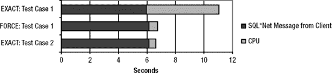

**图 8-12.** *游标共享设置为 force 时的数据库端资源使用情况对比（占比低于响应时间 1%的组件未显示，因为它们不可见）*

与 `force` 值相关的问题是，对于所有在字面量替换后文本相同的 SQL 语句，都使用单个子游标。因此，字面量（对于利用直方图至关重要）仅在为第一个提交的 SQL 语句生成执行计划时进行窥探。自然，这可能导致次优的执行计划，因为后续 SQL 语句中使用的字面量会导致不同的执行计划。为避免此问题，提供了 `similar` 值。事实上，它在重用已有游标之前，会检查是否为某个被替换的字面量存在直方图。如果存在，则创建一个新的子游标。如果不存在，则将使用一个已有的子游标。


以下是值为 `similar` 时的测试结果。请注意，迄今为止的所有测试都是使用直方图执行的。如图 8-13 所示，在测试用例 1 中，将值设置为 `similar` 时，数据库侧的资源使用情况甚至比设置为 `exact` 时更糟糕。问题不仅在于执行了 10,000 次硬解析，还在于由于游标共享，此类解析的 CPU 利用率更高。请注意，在替换字面量后，所有 SQL 语句的文本都相同。因此，库缓存只包含一个父游标，该父游标拥有许多（在此情况下是数千个）子游标。

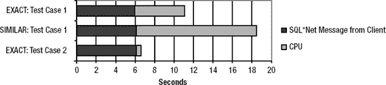

**图 8-13.** 游标共享设置为 `similar` 时的数据库侧资源使用情况对比（占响应时间不到 1%的组件未显示，因为它们无法在图中清晰可见）

### 总结来说

总结来说，如果应用程序使用字面量且游标共享设置为 `similar`，其行为取决于相关直方图是否存在。如果存在，`similar` 的行为类似于 `exact`。如果不存在，`similar` 的行为则类似于 `force`。这意味着，如果您面临解析问题，使用 `similar` 往往是无济于事的。

##### 服务器端语句缓存

此功能类似于客户端语句缓存，旨在减少发生过多软解析时的开销。从概念角度来看，这两种语句缓存是相似的，只是其中一种是在服务器端实现的。然而，从性能角度来看，差异是相当大的。事实上，服务器端的实现远不如客户端的实现强大。这是因为服务器端的实现仅减少了服务器端软解析的开销，而在许多情况下，客户端软解析的开销远大于服务器端。服务器端实现的唯一真正优势是能够缓存由部署在数据库引擎中的 PL/SQL 或 Java 代码执行的 SQL 语句。

如果应用程序执行大量软解析，对库缓存锁存器和互斥量的高压也可能导致数据库引擎出现明显的争用。以下数据库侧资源使用情况配置文件显示了这种情况。请注意，为了生成此配置文件，在数据库引擎每秒处理超过 20,000 次对同一 SQL 语句的解析时，启动了测试用例 2。虽然这肯定不是常见的工作负载，但它有助于展示服务器端游标缓存的影响。

```
Total           Number of  Duration per
Component                Duration       %     Events         Event
---------------------------- --------- -------- ---------- -------------
SQL*Net message from client      8.283   51.528     10,000         0.001
`latch: library cache lock`      3.328   20.700         30         0.111
`cursor: pin S`                  2.782   17.304         11         0.253
`latch: library cache`           1.204    7.488         14         0.086
CPU                              0.461    2.867        n/a          n/a
`cursor: pin S wait on X`        0.011    0.070          1         0.011
SQL*Net message to client        0.007    0.042     10,000         0.000
---------------------------- --------- --------
Total                           16.075  100.000
```

只要服务器端软解析的开销成为一个问题且应用程序无法修改，服务器端语句缓存可能就有用。在这个特定案例中，启用它并重新施加相同负载后，得到的资源使用情况配置文件如下。请注意，所有与库缓存锁存器和互斥量相关的等待都消失了。

```
Total           Number of  Duration per
Component                Duration       %     Events         Event
---------------------------- --------- -------- ---------- -------------
SQL*Net message from client      6.679   94.595     10,000         0.001
CPU                              0.375    5.310        n/a          n/a
SQL*Net message to client        0.007    0.095     10,000         0.000
---------------------------- --------- --------
Total                            7.061  100.000
```


服务器端语句缓存通过初始化参数 `session_cached_cursors` 进行配置。其值指定了每个会话能够缓存的游标最大数量。因此，如果设置为 0，则该功能被禁用；如果设置为大于 0 的值，则启用该功能。在 Oracle Database 10*g* Release 1 及之前的版本中，默认值为 0；在 Oracle Database 10*g* Release 2 中，默认值为 20；在 Oracle Database 11*g* 中，默认值为 50。在系统级别，只能通过重启实例来更改。在会话级别，可以动态更改。至于客户端语句缓存，要为缓存游标的最大数量指定合适的值，你需要了解所使用的应用程序，或者分析 TKPROF 或 TVD$XTAT 的输出，以找出哪些 SQL 语句经历了大量的软解析。然后，基于这个初步估计，需要进行一些测试来验证该值是否合适。在此类测试期间，可以通过查看以下查询得出的统计信息来验证缓存的有效性。请注意，相同的统计信息在系统级别也可用。无论如何，你应重点关注经历过问题负载的单个会话，以找到有意义的线索。

```sql
SELECT sn.name, ss.value
FROM v$statname sn, v$sesstat ss
WHERE sn.statistic# = ss.statistic#
AND sn.name IN ('session cursor cache hits',
                'session cursor cache count',
                'parse count (total)')
AND ss.sid = 42;
```

```
NAME                              VALUE
------------------------------ ----------
session cursor cache hits            9997
session cursor cache count              9
parse count (total)                 10008
```

首先，将缓存的游标数 (`session cursor cache count`) 与初始化参数 `session_cached_cursors` 的值进行比较。如果前者小于后者，则意味着增加初始化参数的值对缓存游标的数量没有影响。否则，如果两个值相等，增加初始化参数的值可能有助于缓存更多游标。无论如何，超过初始化参数 `open_cursors` 的值是没有意义的。例如，根据前面的统计信息，缓存中存在九个游标。由于测试期间初始化参数 `session_cached_cursors` 被设置为 20，因此增加它没有任何作用。

其次，利用附加数据，可以检查有多少次解析调用因为缓存游标 (`session cursor cache hits`) 而被优化，相对于总的解析次数 (`parse count (total)`)。如果两个值接近，那么增大缓存大小可能就不值得了。在前面的统计信息案例中，超过 99% (9,997/10,008) 的解析因为缓存而避免，因此增大它可能没有意义。

同样重要的是要注意，在前面的统计信息中“只有”9,997 次缓存命中。由于测试案例 2 执行了相同的 SQL 语句 10,000 次，为什么不是 9,999 次呢？答案是，只有当一个游标被执行了三次之后，它才会被放入游标缓存。这样做的原因是为了避免缓存只执行一次的游标。只有在第一次解析调用之前，一个可共享的游标已经存在于库缓存中，才有可能获得 9,999 次命中。

总而言之，服务器端语句缓存是一项重要特性。实际上，当大小设置正确时，它可以节省服务器端的一些开销。然而，不能因为这个特性可用，就成为应用程序不首先妥善管理游标的借口，特别是因为，正如你已经看到的，客户端的解析开销可能比服务器端更高。

##### 使用应用程序编程接口

本节的目的是描述与解析相关的、针对不同应用程序编程接口的特性。如前面章节所述，要避免不必要的硬解析和软解析，应具备三个核心特性：绑定变量、重用语句的能力以及客户端语句缓存。表 8-1 总结了这些特性在哪些应用程序编程接口中可用。接下来的章节为 PL/SQL、OCI、JDBC 和 ODP.NET 提供了详细信息。

#### 表 8-1. 不同应用程序编程接口所提供的特性概述

| **应用程序编程接口** | **绑定变量** | **重用语句** | **客户端语句缓存** |
| --- | --- | --- | --- |
| Java 数据库连接 (JDBC) |  |  |  |
| `java.sql.Statement` |  |  | ()^* |
| `java.sql.PreparedStatement` |  |  |  |
| Oracle 调用接口 (OCI) |  |  |  |
| Oracle C++ 调用接口 (OCCI) |  |  | ^$ |
| Oracle Data Provider for .NET (ODP.NET) |  |  | ^+ |
| Oracle Objects for OLE (OO4O) |  |  |  |
| Oracle Provider for OLE DB |  |  | ^# |
| PL/SQL |  |  |  |
| 静态 SQL |  |  |  |
| 原生动态 SQL (`EXECUTE IMMEDIATE`) |  |  | ^$ |
| 原生动态 SQL (`OPEN`/`FETCH`/`CLOSE`) |  |  |  |
| 使用包 `dbms_sql` 的动态 SQL |  |  |  |
| 预编译器 |  |  |  |
| SQLJ |  |  |  |
| ** JDBC 支持两种类型的客户端语句缓存。`java.sql.Statement` 类仅支持其中一种。更多信息，请参阅本章后面关于 JDBC 的部分*。 |
| *+ 自 Oracle Data Provider for .NET Release 10.1.0.3 起 |
| *# 自 Oracle Database 10g Release 2 起 |
| *$ 自 Oracle Database 10g Release 1 起 |


