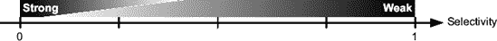
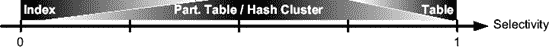
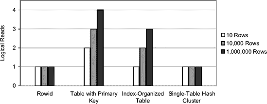
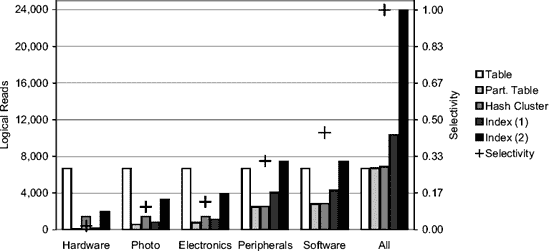
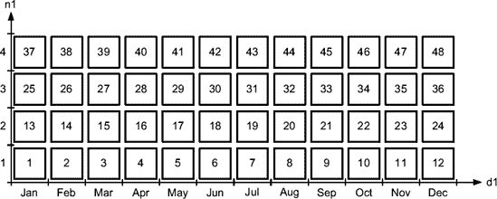
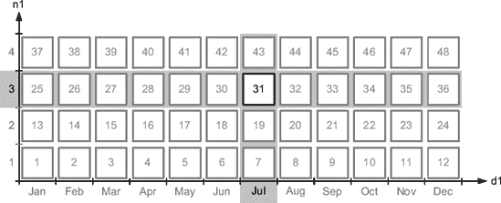

# JDBC

`java.sql.Statement` 是 JDBC 提供的用于执行 SQL 语句的基本类。如表 8-1 所示，使用它时很可能会遇到解析问题。事实上，它不支持绑定变量、游标重用或客户端语句缓存。基本上，只能用它实现测试用例 1。以下代码片段演示了这一点：

```
sql = "SELECT pad FROM t WHERE val = ";
for (int i=0 ; i<10000; i++) {
  statement = connection.createStatement();
  resultset = statement.executeQuery(sql + Integer.toString(i));
  if (resultset.next())
  {
    pad = resultset.getString("pad");
  }
  resultset.close();
  statement.close();
}
```

为了避免前面代码片段执行的所有硬解析，您必须使用类 `java.sql.PreparedStatement`，它是 `java.sql.Statement` 的子类。以下代码片段展示了如何使用它来实现测试用例 2。请注意，用于查找的值不是连接到变量 `sql`（如前面的示例），而是通过绑定变量（在 Java 中用问号定义，称为占位符）来定义的。

```
sql = "SELECT pad FROM t WHERE val = ?";
for (int i=0 ; i<10000; i++)
{
  statement = connection.prepareStatement(sql);
  statement.setInt(1, i);
  resultset = statement.executeQuery();
  if (resultset.next())
  {
    pad = resultset.getString("pad");
  }
  resultset.close();
  statement.close();
}
```

下一个改进是避免软解析，也就是说，实现测试用例 3。如下列代码片段所示，您可以通过将创建和关闭预处理语句的代码移到循环外部来实现这一点：

```
sql = "SELECT pad FROM t WHERE val = ?";
statement = connection.prepareStatement(sql);
for (int i=0 ; i<10000; i++) {
  statement.setInt(1, i);
  resultset = statement.executeQuery();
  if (resultset.next())
  {
     pad = resultset.getString("pad");
  }
  resultset.close();
}
statement.close();
```

JDBC 不仅允许正确处理预处理语句，还支持客户端语句缓存。根据 JDBC 3.0 规范，使用连接池时语句缓存应该是透明的。实际上，Oracle JDBC 驱动程序提供了两个扩展来支持没有连接池的情况：隐式和显式语句缓存。顾名思义，前者几乎不需要更改代码，而后者必须显式实现。

对于显式语句缓存，语句通过 Oracle 定义的方法打开和关闭。由于这对代码有很大影响，并且与隐式语句缓存相比，编写更快的代码更困难，因此此处不作描述。有关更多信息，请参阅 *JDBC Developer's Guide and Reference* 手册。

对于隐式语句缓存，当调用 `close` 方法时，预处理语句会被添加到缓存中。然后，当通过 `prepareStatement` 方法实例化新的 `prepared statement` 时，会检查缓存以查找是否已存在具有相同文本的游标。

以下代码行显示了如何在连接级别启用语句缓存。请注意：将缓存大小设置为大于 0 的值是必需的。强制转换是必需的，因为这两个方法都是 Oracle 扩展。

```
((oracle.jdbc.OracleConnection)connection).setImplicitCachingEnabled(true);
((oracle.jdbc.OracleConnection)connection).setStatementCacheSize(50);
```

另一种启用隐式语句缓存的方法是通过类 `OracleDataSource` 的方法 `setImplicitCachingEnabled` 和 `setMaxStatements`。请注意，从 Oracle Database 10*g* Release 2 开始，`setMaxStatements` 方法已弃用。

默认情况下，所有预处理语句都使用隐式语句缓存进行缓存。当缓存已满时，最近最少使用的语句将被简单地丢弃。如果需要，也可以禁用特定语句的缓存。以下代码行展示了如何操作：

```
((oracle.jdbc.OraclePreparedStatement)statement).setDisableStmtCaching(true);
```

本节示例中使用的 Java 代码摘自文件 `ParsingTest1.java`、`ParsingTest2.java` 和 `ParsingTest3.java`，它们分别实现了测试用例 1、2 和 3。


#### ODP.NET

ODP.NET 对游标生命周期的控制能力有限。在下面实现测试用例 1 的代码片段中，`ExecuteReader` 方法会同时触发解析、执行和获取调用：

```
sql = "SELECT pad FROM t WHERE val = ";
command = new OracleCommand(sql, connection);
for (int i = 0; i < 10000; i++)
{
  command.CommandText = sql + i;
  reader = command.ExecuteReader();
  if (reader.Read())
  {
    pad = reader[0].ToString();
  }
  reader.Close();
}
```

为避免前述代码片段执行的所有硬解析，必须使用 `OracleParameter` 类来传递参数（绑定变量）。以下代码片段展示了如何用它来实现测试用例 2。请注意，用于查找的值不是连接到变量 `sql`（如前一个示例所示），而是通过一个参数来定义。

```
String sql = "SELECT pad FROM t WHERE val = :val";
OracleCommand command = new OracleCommand(sql, connection);
OracleParameter parameter = new OracleParameter("val", OracleDbType.Int32);
command.Parameters.Add(parameter);
OracleDataReader reader;
for (int i = 0; i < 10000; i++)
{
  parameter.Value = Convert.ToInt32(i);
  reader = command.ExecuteReader();
  if (reader.Read())
  {
    pad = reader[0].ToString();
  }
  reader.Close();
}
```

使用 ODP.NET，无法实现测试用例 3。但是，要达到相同的结果，可以使用自 ODP.NET 10.1.0.3 版本起的客户端语句缓存。启用它并设置缓存大小有两种方法。第一种是设置注册表中的以下值，它控制使用特定 Oracle 主目录的所有应用程序的语句缓存。如果设置为 0，则禁用语句缓存。否则，启用语句缓存，该值指定缓存的大小（`<Assembly_Version>` 是 `Oracle.DataAccess.dll` 的完整版本号）。

```
HKEY_LOCAL_MACHINE\SOFTWARE\ORACLE\ODP.NET\<Assembly_Version>\StatementCacheSize
```

第二种方法通过 `OracleConnection` 类提供的 `Statement Cache Size` 属性在代码中直接控制语句缓存。基本上，它与注册表值作用相同，但只针对单个连接。以下代码片段展示了如何启用语句缓存并将其大小设置为 10：

```
String connectString = "User Id=" + user +
                       ";Password=" + password +
                       ";Data Source=" + dataSource +
                       ";Statement Cache Size=10";
OracleConnection connection = new OracleConnection(connectString);
```

请注意，连接级别的设置会覆盖注册表中的设置。此外，当启用语句缓存时，可以通过将属性 `AddToStatementCache` 设置为 `false` 在命令级别禁用它。

本节示例中使用的 C# 代码节选自文件 `ParsingTest1.cs` 和 `ParsingTest2.cs`，它们分别实现了测试用例 1 和 2。

### 转到 第 9 章

本章描述了数据库引擎如何解析 SQL 语句，以及如何识别、解决和规避解析问题。关键信息是，通过了解应用程序的工作方式以及所用应用程序编程接口提供的可能性，你应该能够在开发阶段通过编写高效的代码来避免解析问题。

由于在游标生命周期中，执行阶段紧随 SQL 语句的解析和变量绑定之后，因此有必要概述数据库引擎用于执行单表访问的不同技术。下一章将讨论这一点，并描述如何利用不同类型的索引和分区方法，以帮助加速 SQL 语句的执行。

## 第 9 章 优化数据访问

正如第 6 章所述，一个执行计划由若干操作组成。最常用的操作是访问、过滤和转换数据的操作。本章专门讨论数据访问操作，或者换句话说，数据库引擎如何能够访问数据。在表中定位数据基本上只有两种方式。第一种是扫描整个表。第二种是基于冗余访问结构（例如索引）或表本身的结构（例如哈希集群）进行查找。此外，在分区的情况下，访问可能仅限于一部分分区。这与在本书中查找特定信息并无不同。你要么阅读整本书，要么阅读某一章，要么使用索引或目录来找到你所需的信息所在的位置。

本章第一部分描述了通过查看由 SQL 跟踪或动态性能视图提供的运行时统计信息来识别低效访问路径的方法。第二部分描述了可用的访问方法以及你应该在何时利用它们。对于每种访问路径，也描述了与之相关的提示和执行计划操作。

***

**注意** 在本章中，几条 SQL 语句包含提示。这样做不仅是为了向你展示哪个提示会导致哪种访问路径，也是为了向你展示它们的使用示例。无论如何，既没有提供实际的引用，也没有提供完整的语法。你可以在 *SQL 参考* 手册的第 2 章中找到这些内容。

***

#### 识别次优访问路径

第 6 章描述了如何通过检查查询优化器的估计以及限制是否被正确识别来判断执行计划的效率。重要的是要理解，即使查询优化器正确选择了执行计划，也并不意味着该特定执行计划一定会表现良好。可能是通过更改 SQL 语句或访问结构（例如添加索引），可以考虑采用更好的执行计划。以下部分描述了可执行的额外检查，以帮助识别低效的访问路径、其可能原因以及你可以避免该问题的方法。


## 标识

最高效的访问路径能够以消耗最少的资源来处理数据。因此，要判断一条访问路径是否高效，你必须判断其处理所消耗的资源量是否可接受。要做到这一点，有必要定义如何衡量资源利用率以及“可接受”意味着什么。此外，你还需要考虑检查的可行性。换句话说，你还需要考虑实施一项检查需要多少工作量。它必须尽可能简单。实际上，一个需要太多时间来实施的完美检查在实践中是不可接受的，特别是当你需要处理数十甚至数百条作为优化候选的 `SQL` 语句时。

附带说明一下，请记住本节关注的是效率，而不仅仅是速度。必须理解，最高效的访问路径并不总是最快的。正如你将在第 11 章中看到的，通过并行处理，有时即使资源使用量更高，也有可能获得更好的响应时间。当然，从整个系统来看，`SQL` 语句使用的资源量越少（换句话说，效率越高），系统的可扩展性和速度就越快。这是必然的，因为资源是有限的。

首先近似地说，当访问路径使用的资源量与返回的行数（即返回给执行计划中父操作的行数）成正比时，该资源量是可接受的。换句话说，当返回的行数很少时，预期的资源利用率很低；当返回的行数很多时，预期的资源利用率很高。因此，检查应基于返回单行所使用的资源量。

在理想情况下，你会希望考虑数据库引擎使用的四种主要资源类型来衡量资源消耗：`CPU`、`内存`、`磁盘`和`网络`。当然，这可以做到，但不幸的是，获取和评估所有这些数据需要大量的时间和精力，通常在调优会话中只能针对有限数量的 `SQL` 语句进行。你还应该考虑到，在处理一行数据时，`CPU` 处理时间取决于处理器的速度，这显然因系统而异。此外，使用的 `内存` 量远非与返回的行数成正比，而 `磁盘` 和 `网络` 资源也并非总是会被使用。事实上，经常能看到运行时间长的 `SQL` 语句只使用了适量的 `内存`，并且没有 `磁盘` 或 `网络` 访问。

幸运的是，有一个非常容易收集的单一数据库指标，能够告诉你很多关于数据库引擎完成工作量的信息：逻辑读的数量，即在 `SQL` 语句执行期间在缓冲区缓存中访问的块数。这有四个充分的理由。首先，逻辑读是一个 `CPU` 密集型操作，因此能很好地反映 `CPU` 利用率。其次，逻辑读可能导致物理读，因此，通过减少逻辑读的数量，很可能也会减少 `I/O` 操作。第三，逻辑读是一个受序列化约束的操作。因为你通常需要为多用户负载进行优化，最小化逻辑读有助于避免可扩展性问题。第四，逻辑读的数量在 `SQL` 语句和执行计划操作级别都很容易获得，无论是在 `SQL` 跟踪文件中还是在动态性能视图中。

由于逻辑读非常擅长近似整体资源消耗，你可以（至少在第一轮优化中）专注于那些每返回行数逻辑读数量很高的访问路径。以下通常被认为是好的“经验法则”：

*   每返回行导致少于约 5 次逻辑读的访问路径可能是好的。
*   每返回行导致约 10 到 15 次逻辑读的访问路径可能是可接受的。
*   每返回行导致多于约 15 到 20 次逻辑读的访问路径可能是低效的。换句话说，很可能存在改进空间。

要检查每行的逻辑读数量，基本上有两种方法。第一种方法（仅在 Oracle Database 10*g* 及以上版本可用）是利用动态性能视图提供的执行统计信息，并通过 `dbms_xplan` 包显示（第 6 章完整描述了此技术）。以下执行计划是使用该方法生成的。从中，对于每个操作，你可以看到返回了多少行（列 `A-Rows`）以及为了返回这些行执行了多少逻辑读（列 `Buffers`）。

```
SELECT * FROM t WHERE n1 BETWEEN 6000 AND 7000 AND n2 = 19

----------------------------------------------------------------------------
| Id | Operation                      | Name   | Starts | A-Rows | Buffers |
----------------------------------------------------------------------------
|* 1 | TABLE ACCESS BY INDEX ROWID    | T      |      1 |      3 |      28 |
|* 2 |  INDEX RANGE SCAN              | T_N2_I |      1 |     24 |       4 |
----------------------------------------------------------------------------

    1 - filter(("N1">=6000 AND "N1"<=7000))
    2 - access("N2"=19)
```

第二种方法是利用 `SQL` 跟踪提供的信息（第 3 章完整描述了此技术）。以下是针对与前面示例中完全相同的查询，由 `TKPROF` 生成的输出摘录。请注意，返回的行数（列 `Rows`）和逻辑读数量（属性 `cr`）与前面的数字匹配。

```
Rows     Row Source Operation
------- ---------------------------------------------------
3      TABLE ACCESS BY INDEX ROWID T (cr=28 pr=0 pw=0 time=2 us)
24     INDEX RANGE SCAN T_N2_I (cr=4 pr=0 pw=0 time=73 us)(object id 13709)
```

基于前面提到的经验法则，用作示例的执行计划是可接受的。事实上，该访问路径每返回行的逻辑读数量约为 9（28/3）。让我们看看针对同一条 `SQL` 语句的一个糟糕的执行计划是什么样子。请注意，它糟糕是因为该访问路径每返回行的逻辑读数量约为 130（391/3），而不是因为它包含了一个全表扫描！

```
--------------------------------------------------------------
| Id | Operation          | Name | Starts | A-Rows | Buffers |
--------------------------------------------------------------
|* 1 | TABLE ACCESS FULL  | T    |      1 |      3 |     391 |
--------------------------------------------------------------

  1 - filter(("N2"=19 AND "N1">=6000 AND "N1"<=7000))
```


必须强调的是，本节讨论的是访问路径。因此，您必须仅考虑访问路径级别的数据，而非整个 SQL 语句级别的数据。实际上，SQL 语句级别的数据可能会产生误导。为了理解问题所在，让我们分析下面的查询。如果错误地仅考虑 SQL 语句级别的数据（由操作 1 提供），则返回单行需要执行 389 次逻辑读取。换句话说，这会被错误地归类为低效。然而，如果正确地考虑访问操作（操作 2）的数据，逻辑读取次数（389）与返回行数（160）之间的比值会将此访问路径归类为高效。此案例的问题在于，操作 1 用于对操作 2 返回的行应用`sum`函数。因此，它总是返回单行，并掩盖了访问路径的性能数据。

```sql
SELECT sum(n1) FROM t WHERE n2 > 246
```

```
---------------------------------------------------------------
| Id | Operation          | Name | Starts | A-Rows | Buffers |
---------------------------------------------------------------
|  1 | SORT AGGREGATE     |      |      1 |      1 |     389 |
|* 2 |  TABLE ACCESS FULL | T    |      1 |    160 |     389 |
---------------------------------------------------------------

   2 - filter("N2">246)
```

如果您确实别无选择，只能查看 SQL 语句级别的数据（例如，因为 SQL 跟踪文件不包含执行计划），那么您将很难应用之前提供的经验法则，原因很简单：您没有足够的可用数据。然而，在这种情况下，至少对于简单的 SQL 语句，您可以尝试猜测访问路径数据，并调整经验法则。例如，您可以仔细检查 SQL 语句以确认其中是否存在聚合操作，找出 SQL 语句中引用了多少张表，然后按引用表的数量比例增加经验法则中的限制值。

### 陷阱

在检查逻辑读取次数时，您必须意识到两个可能扭曲数据的陷阱。第一个与读取一致性有关，第二个与行预取有关。

### 读取一致性

对于每个 SQL 语句，数据库引擎都必须保证所处理数据的一致性。为此，基于当前数据块和撤销信息，可能会在运行时创建数据块的一致性副本。执行此操作需要进行多次逻辑读取。因此，SQL 语句执行的逻辑读取次数在很大程度上取决于需要重建的数据块数量。由脚本`read_consistency.sql`生成的输出摘录展示了这种行为。请注意，该查询与上一节使用的查询相同。根据执行统计信息，返回的行数相同（实际上返回的是相同的数据）。然而，执行的逻辑读取次数却高得多（总计 354 次，而不是 28 次）。这种效应是由于另一个会话修改了处理此查询所需的数据块造成的。由于在查询启动时这些更改尚未提交，数据库引擎必须重建数据块。这导致了逻辑读取次数的显著增加。

```sql
SELECT * FROM t WHERE n1 BETWEEN 6000 AND 7000 AND n2 = 19
```

```
----------------------------------------------------------------------------
| Id | Operation                      | Name   | Starts | A-Rows | Buffers |
----------------------------------------------------------------------------
|* 1 | TABLE ACCESS BY INDEX ROWID    | T      |      1 |      3 |     354 |
|* 2 |  INDEX RANGE SCAN              | T_N2_I |      1 |     24 |     139 |
----------------------------------------------------------------------------

   1 - filter(("N1">=6000 AND "N1"<=7000))
   2 - access("N2"=19)
```

##### 行预取

从性能角度来看，您应始终避免基于行的处理。例如，当客户端从数据库检索数据时，它可以逐行检索，或者更好一些，同时检索多行。这种技术称为*行预取*，将在第 11 章中详细描述。目前，我们只关注其对逻辑读取次数的影响。简而言之，每次数据库引擎访问一个数据块，就会记录一次逻辑读取。对于全表扫描，存在两种极端情况。如果行预取设置为 1，则每返回一行大约执行一次逻辑读取。如果行预取设置为大于每个表单数据块存储行数的数字，则逻辑读取次数接近表的数据块数量。由脚本`row_prefetching.sql`生成的输出摘录展示了这种行为。在第一次执行中，行预取设置为 2（该值的选择将在第 11 章的“行预取”一节中解释），逻辑读取次数（5,389）大约是行数（10,000）的一半。在第二次执行中，由于预取行数（100）大于每个数据块的平均行数（25），逻辑读取次数（489）与数据块数量（401）大致相同。

```sql
SQL> SELECT num_rows, blocks, round(num_rows/blocks) AS rows_per_block
  2  FROM user_tables
  3  WHERE table_name = 'T';

NUM_ROWS BLOCKS   ROWS_PER_BLOCK
--------- -------- ---------------
    10000      401              25

SQL> set arraysize 2

SQL> SELECT * FROM t;
```

```
--------------------------------------------------------------
| Id | Operation         | Name | Starts | A-Rows | Buffers |
--------------------------------------------------------------
|  1 | TABLE ACCESS FULL | T    |      1 |  10000 |    5389 |
--------------------------------------------------------------
```

```sql
SQL> set arraysize 100

SQL> SELECT * FROM t;
```

```
--------------------------------------------------------------
| Id | Operation         | Name | Starts | A-Rows | Buffers |
--------------------------------------------------------------
|  1 | TABLE ACCESS FULL | T    |      1 |  10000 |     489 |
--------------------------------------------------------------
```

> **注意** 在 SQL*Plus 中，您通过系统变量 `arraysize` 管理预取行数。默认值是 15。

鉴于逻辑读取次数对行预取的依赖性，每当您在 SQL*Plus 等工具中出于测试目的执行 SQL 语句时，都应仔细设置与应用程序相同的行预取值。换句话说，用于测试的工具应预取与应用程序相同数量的行。否则，可能会导致结果严重误导。

当执行聚合操作时，SQL 引擎会在内部使用行预取。因此，当聚合操作是执行计划的一部分时，访问路径的逻辑读取次数非常接近数据块的数量。换句话说，每次 SQL 引擎访问一个数据块时，它会提取其中包含的所有行。以下示例说明了这一点：

```sql
SQL> set arraysize 2

SQL> SELECT sum(n1) FROM t;
```

```
------------------------------------------------
| Operation         | Name | A-Rows | Buffers |
------------------------------------------------
| SORT AGGREGATE    |      |      1 |     389 |
|  TABLE ACCESS FULL| T    |  10000 |     389 |
------------------------------------------------
```


#### 原因

访问路径效率低下的主要原因有以下几种：

*   没有可用的合适访问结构（例如索引）。
*   存在合适的访问结构，但 SQL 语句的语法不允许查询优化器使用它。
*   表或索引已分区，但无法进行修剪。结果是访问了所有分区。
*   表或索引，或两者均未分区。

除了前面列出的示例外，还有两种情况会导致访问路径效率低下：

*   当查询优化器因缺乏统计信息、统计信息未更新或配置了错误的查询优化器而做出错误估算时。这里不涉及此情况，因为我将假设必要的统计信息已就位且查询优化器已正确配置（第 4 章和第 5 章已完整描述了这两个主题）。
*   当查询优化器自身存在问题时，例如其工作方式中存在内部错误或限制。我也不讨论这一点，因为错误或查询优化器限制导致的问题非常有限。

#### 解决方案

如前面章节所述，要高效执行 SQL 语句，目标是最小化逻辑读取次数，或者换句话说，确定哪种访问路径访问的块更少。为了实现这个目标，可能需要添加新的访问结构（例如索引）或更改物理布局（例如对某些表或其索引进行分区）。给定一条 SQL 语句，访问结构和物理布局的组合方式有很多。幸运的是，为了便于选择，可以根据选择性将 SQL 语句（或者更准确地说，数据访问操作）分为两大类：

*   选择性弱（高）的操作
*   选择性强（低）的操作

选择性很重要，因为对于选择性非常弱的操作效果良好的访问结构和布局，对于选择性非常强的操作效果很差，反之亦然。但要注意，这两类之间没有固定的界限。相反，它取决于操作、所处理的数据以及这些数据的存储方式。例如，数据分布和每块的行数都会强烈影响性能。换句话说，武断地说选择性低于 0.1（或你能想到的任何其他值）必然是强选择性，而高于该值必然是弱选择性，这是绝对错误的。尽管如此，可以说在实践中，常见的界限范围在 0.05 到 0.25 之间。正如图 9-1 所示，只有在值非常接近 0 或 1 时才能确定。



`图 9-1.` 强选择性和弱选择性之间没有固定界限。

必须理解，对于确定操作的类别，其返回的行的绝对数量并不相关。只有选择性是相关的。例如，知道一个操作返回 500,000 行对于选择访问路径完全没有意义。相反，知道该操作的选择性为 0.001 则明确将其归入强选择性类别。

这个类别很重要，因为它为判断应采用哪种访问路径来获得高效的执行计划提供了线索。图 9-2 大致关联了选择性与通常最优的访问路径。当存在合适的索引时，具有强选择性的操作可以高效执行。正如本章后面将看到的，在某些情况下，`rowid`访问或哈希集群也可能有帮助。另一方面，选择性非常差的操作通过读取整个表来处理最为高效。介于这两种情况之间，分区表和哈希集群扮演着重要角色。



`图 9-2.` 特定的访问路径仅对特定范围的选择性有效。

让我们通过两个测试来演示这一点。第一个测试检索单行，第二个测试检索数千行。

**检索单行**

本测试基于脚本`access_structures_1.sql`，旨在比较在存在以下访问结构的情况下，检索单行所需的逻辑读取次数：

*   具有主键的堆表
*   索引组织表
*   以主键作为集群键的单表哈希集群

* * *

**注意** 本章仅描述如何利用不同类型的段（例如表、集群和索引）来最小化处理 SQL 语句期间执行的逻辑读取次数。关于它们的基本信息，你可以在 Oracle 手册《Oracle Database Concepts》的“Schema Objects”章节中找到。

* * *


测试所使用的查询如下。请注意，`id`列是表的主键。存在值为`6`的行，变量`rid`存储了该行的 rowid。

`SELECT * FROM sales WHERE id = 6`

`SELECT * FROM sales WHERE rowid = :rid`

由于逻辑读取的数量取决于索引的高度，因此测试是在表中分别存储 10 行、10,000 行和 1,000,000 行时进行的。图 9-3 总结了结果。它们阐明了四个主要事实：

*   对于所有访问结构，都通过 rowid 执行一次逻辑读取（显然，要读取存储该行的数据块，工作量不可能比这更少了）。
*   对于堆表，至少需要两次逻辑读取：一次用于索引，一次用于表。随着行数的增加，索引的高度增加，逻辑读取的数量也随之增加。
*   通过索引组织表进行的访问比通过堆表进行的访问少一次逻辑读取。
*   对于单表哈希聚簇，逻辑读取的数量不仅与行数无关，而且总是导致一次逻辑读取。



`图 9-3.` *不同的访问结构导致不同的逻辑读取次数。*

总之，对于检索单行数据，带有索引的“常规”表是性能最差的访问结构。然而，正如我将在本章后面描述的，“常规”表是最常用的，因为你只能在特定情况下利用其他访问结构的优势。

## 检索数千行数据

此测试基于脚本`access_structures_1000.sql`，目的是比较在使用以下访问结构时，检索数千行数据所需的逻辑读取数量：

*   无索引的非分区表。
*   列表分区表。`prod_category`列是分区键。
*   单表哈希聚簇。`prod_category`列是聚簇键。
*   在`prod_category`列上建有索引的非分区表。对于此测试，测试了表段中行的两种不同物理分布（因此也测试了不同的聚簇因子）。

测试数据集包含 918,843 行。以下查询显示了`prod_category`列的值的分布情况：

```sql
SQL> SELECT prod_category, count(*), ratio_to_report(count(*)) over() AS selectivity
  2  FROM sales
  3  GROUP BY prod_category
  4  ORDER BY count(*);

PROD_CATEGORY    COUNT(*) SELECTIVITY
-------------- ---------- -----------
Hardware            15357        .017
Photo               95509        .104
Electronics        116267        .127
Peripherals        286369        .312
Software/Other     405341        .441
```

测试所使用的查询如下：

`SELECT sum(amount_sold) FROM sales WHERE prod_category = 'Hardware'`
`SELECT sum(amount_sold) FROM sales WHERE prod_category = 'Photo'`
`SELECT sum(amount_sold) FROM sales WHERE prod_category = 'Electronics'`
`SELECT sum(amount_sold) FROM sales WHERE prod_category = 'Peripherals'`
`SELECT sum(amount_sold) FROM sales WHERE prod_category = 'Software/Other'`
`SELECT sum(amount_sold) FROM sales`

* * *

**注意** 用于测试的查询基于聚合操作。因此，由于行预取机制，逻辑读取次数与行数的比例始终非常低。无论如何，此测试的目的是展示不同访问结构之间的差异。

* * *

对于每种结构，都测量了逻辑读取的次数。图 9-4 总结了结果，得出了四个主要事实：

*   读取无索引的非分区表所需的逻辑读取次数与选择性无关。因此，它仅在选择性较弱时才高效。
*   读取列表分区表的一个分区所需的逻辑读取次数与选择性成正比，因为表已根据`prod_category`列进行了分区。因此，在所有情况下，都执行了最少数量的逻辑读取。
*   读取单表哈希聚簇所需的逻辑读取次数仅与中高值的选择性成正比。（正如你将在后面看到的，当选择性非常强时，哈希聚簇可能非常有用。然而，在此测试中，由于数据分布不均匀，它们处于劣势。）
*   通过索引读取表所需的逻辑读取次数高度依赖于数据的物理分布。因此，仅知道选择性不足以判断此类访问路径是否能高效地处理数据。



`图 9-4.` *特定的访问路径仅在特定的选择性范围内才能高效工作。*

现在你已经了解了在不同情况下能够高效访问数据的主要可用选项，接下来是时候详细描述用于处理具有弱选择性和强选择性的 SQL 语句的访问路径了。

#### 具有弱选择性的 SQL 语句

为了高效处理数据，具有弱（即高）选择性的 SQL 语句必须使用全表扫描或全分区扫描。然而，在很多情况下，只有全表扫描会发挥作用。这主要有三个原因。首先，分区是企业版选项。因此，如果你使用标准版，或者当然，如果你没有使用它的许可，你将无法利用它。其次，即使你被允许使用分区选项，实际上并非所有表都会被分区。第三，一个表可能只能由有限数量的列进行分区。因此，即使表是分区的，并非所有引用该表的 SQL 语句都能利用分区优势，除非它们都引用了分区键，而这在实践中通常并非如此。

在某些特定情况下，可以通过用全索引扫描替代来避免全表扫描和全分区扫描。在这种情况下，想法是利用索引不是为了搜索特定值，而仅仅是因为它们比表更小。


##### 全表扫描

可以对所有表执行全表扫描。尽管执行此类扫描没有特别要求，但在某些情况下，它可能是唯一可行的访问路径。以下查询即为一个示例。请注意，在执行计划中，操作 `TABLE ACCESS FULL` 对应于全表扫描。该示例还展示了如何使用提示 `full` 来强制进行全表扫描。

```sql
SELECT /*+ full(t) */ * FROM t WHERE n2 = 19
```

```
----------------------------------
| Id | Operation          | Name |
----------------------------------
|  1 |  TABLE ACCESS FULL | T    |
----------------------------------
```

在全表扫描过程中，数据库引擎按顺序读取高水位线以下的所有表数据块。因此，逻辑读的次数取决于*块*的数量，而不是*行*的数量。这可能不是最优方案，特别是当表包含大量空块或接近空的块时。显然，必须读取一个块才能知道它是否包含数据。导致表包含大量稀疏填充块的最常见场景之一是表遭受的删除操作多于插入操作。以下示例（摘自脚本 `full_scan_hwm.sql` 的输出）说明了这一点：

*   起初，一次查询需要 390 次逻辑读才能返回 24 行。
    ```sql
    SQL> SELECT * FROM t WHERE n2 = 19;

    SQL> SELECT last_output_rows, last_cr_buffer_gets, last_cu_buffer_gets
      2  FROM v$session s, v$sql_plan_statistics p
      3  WHERE s.prev_sql_id = p.sql_id
      4  AND s.prev_child_number = p.child_number
      5  AND s.sid = sys_context('userenv','sid')
      6  AND p.operation_id = 1;

    LAST_OUTPUT_ROWS LAST_CR_BUFFER_GETS LAST_CU_BUFFER_GETS
    ---------------- ------------------- -------------------
                 24                 390                   0
    ```

*   然后，几乎所有的行（10,000 行中的 9,976 行）都被删除了。然而，执行该查询所需的逻辑读次数并未改变。换句话说，大量完全为空的块被无谓地访问了。
    ```sql
    SQL> DELETE t WHERE n2 <> 19;

    9976 rows deleted.

    SQL> SELECT * FROM t WHERE n2 = 19;

    SQL> SELECT last_output_rows, last_cr_buffer_gets, last_cu_buffer_gets
      2  FROM v$session s, v$sql_plan_statistics p
      3  WHERE s.prev_sql_id = p.sql_id
      4  AND s.prev_child_number = p.child_number
      5  AND s.sid = sys_context('userenv','sid')
      6  AND p.operation_id = 1;

    LAST_OUTPUT_ROWS LAST_CR_BUFFER_GETS LAST_CU_BUFFER_GETS
    ---------------- ------------------- -------------------
                 24                 390                   0
    ```

*   为了降低高水位线，有必要对表进行重组。从 Oracle Database 10*g* 开始，您可以使用以下 SQL 语句来完成此操作。请注意，必须激活行移动功能，因为在重组过程中行可能会获得新的 rowid。
    ```sql
    SQL> ALTER TABLE t ENABLE ROW MOVEMENT;

    SQL> ALTER TABLE t SHRINK SPACE;
    ```

*   重组后，该查询仅执行四次逻辑读就返回了 24 行：
    ```sql
    SQL> SELECT * FROM t WHERE n2 = 19;

    SQL> SELECT last_output_rows, last_cr_buffer_gets, last_cu_buffer_gets
      2  FROM v$session s, v$sql_plan_statistics p
      3  WHERE s.prev_sql_id = p.sql_id
      4  AND s.prev_child_number = p.child_number
      5  AND s.sid = sys_context('userenv','sid')
      6  AND p.operation_id = 1;

    LAST_OUTPUT_ROWS LAST_CR_BUFFER_GETS LAST_CU_BUFFER_GETS
    ---------------- ------------------- -------------------
                 24                   4                   0
    ```

请记住，全表扫描执行的逻辑读次数在很大程度上取决于行预取的设置。有关此方面的示例，请参阅本章前面的“行预取”部分。

##### 全分区扫描

当选择率非常弱（即接近 1）时，全表扫描是访问数据最有效的方式。一旦选择率降低，全表扫描就会不必要地访问许多块。由于在选择率弱的情况下使用索引没有益处，分区是唯一可用于减少逻辑读次数的选项。使用分区的目的是利用查询优化器能够先验地排除处理包含无关数据的分区的能力。此功能称为*分区修剪*。

要利用分区修剪来处理给定的 SQL 语句，有两个基本的先决条件。首先，显然，表必须是分区的。其次，必须在 SQL 语句的 `WHERE` 子句中指定对分区键的限制或连接条件。如果满足这两个要求，查询优化器就能够用一个或多个全分区扫描代替全表扫描。然而在实际中，事情并非如此简单。实际上，查询优化器必须处理几种特殊情况，这些情况可能导致也可能不会导致分区修剪。为了更好地理解这些情况，接下来的章节将详细介绍分区修剪的基础知识，以及更高级的修剪技术，如 `OR` 修剪、多列修剪、子查询修剪和连接过滤修剪。随后是关于如何实现分区的一些实用建议。请注意，分区索引也将在本章后面的“具有强选择性的 SQL 语句”部分中讨论。


### 范围分区

为了说明分区修剪的工作原理，让我们基于脚本 `pruning_range.sql` 检查几个示例。测试表是按范围分区的，并使用以下 SQL 语句创建。为了能够展示所有类型的分区修剪，分区键由两列组成：`n1` 和 `d1`。该表按月分区（基于列 `d1`），并且每个月有四个不同的分区（基于列 `n1`）。这意味着每年有 48 个分区。图 9-5 是测试表的图形化表示。

```sql
CREATE TABLE t (
  id NUMBER,
  d1 DATE,
  n1 NUMBER,
  n2 NUMBER,
  n3 NUMBER,
  pad VARCHAR2(4000),
  CONSTRAINT t_pk PRIMARY KEY (id)
)
PARTITION BY RANGE (n1, d1) (
  PARTITION t_jan_2007_1 VALUES LESS THAN (1, to_date('2007-02-01','yyyy-mm-dd')),
  PARTITION t_feb_2007_1 VALUES LESS THAN (1, to_date('2007-03-01','yyyy-mm-dd')),
  PARTITION t_mar_2007_1 VALUES LESS THAN (1, to_date('2007-04-01','yyyy-mm-dd')),
  ...
  PARTITION t_oct_2007_4 VALUES LESS THAN (4, to_date('2007-11-01','yyyy-mm-dd')),
  PARTITION t_nov_2007_4 VALUES LESS THAN (4, to_date('2007-12-01','yyyy-mm-dd')),
  PARTITION t_dec_2007_4 VALUES LESS THAN (4, to_date('2008-01-01','yyyy-mm-dd'))
)
```


**图 9-5.** 测试表每年由 48 个分区组成。

每个分区可以通过其名称或其在表中的“位置”（后者在 图 9-5 中显示）来标识。当然，这两者之间的映射关系可在数据字典中找到。以下查询展示了如何从数据字典视图 `user_tab_partitions` 中获取它：

```sql
SQL> SELECT partition_name, partition_position
  2  FROM user_tab_partitions
  3  WHERE table_name = 'T'
  4  ORDER BY partition_position;
```
```
PARTITION_NAME      PARTITION_POSITION
-------------------- ------------------
T_1_JAN_2007                          1
T_1_FEB_2007                          2
T_1_MAR_2007                          3
...
T_4_OCT_2007                         46
T_4_NOV_2007                         47
T_4_DEC_2007                         48
```

对于这样的表，如果对分区键应用了限制条件，查询优化器会识别它，并在可能的情况下排除包含与处理无关数据的分区。这是可行的，因为数据字典包含了分区的边界，因此，查询优化器可以将它们与 `WHERE` 子句中指定的限制条件或连接条件进行比较。然而，由于一些限制，这并非总是可行。接下来的小节将展示不同的例子，指出查询优化器如何以及何时能够使用分区修剪。

***

**注意** 在本节中，示例中仅使用了查询语句。这并不意味着分区修剪只对查询有效。实际上，它对于 `UPDATE` 和 `DELETE` 等 SQL 语句的工作方式是相同的。我在这里使用查询仅为方便起见。

***

**PARTITION RANGE SINGLE**

在以下 SQL 语句中，`WHERE` 子句包含两个限制条件：每个分区键列一个。在这种情况下，查询优化器识别出只有一个分区包含相关数据。结果，执行计划中出现了 `PARTITION RANGE SINGLE` 操作。必须理解的是，它的子操作（`TABLE ACCESS FULL`）并非对整个表进行的全表扫描。相反，只访问了一个分区。列 `Starts` 的值也证实了这一点。访问的是哪个分区由列 `Pstart` 和 `Pstop` 指定。图 9-6 是此行为的图形化表示。

```sql
SELECT * FROM t WHERE n1 = 3 AND d1 = to_date('2007-07-19','yyyy-mm-dd')
```
```
----------------------------------------------------------------
| Id | Operation               | Name | Starts | Pstart| Pstop |
----------------------------------------------------------------
|   1 | PARTITION RANGE SINGLE  |      |      1 |    31 |    31 |
|*  2 |  TABLE ACCESS FULL      | T    |      1 |    31 |    31 |
----------------------------------------------------------------

2 - filter("D1"=TO_DATE('2007-07-19 00:00:00', 'yyyy-mm-dd hh24:mi:ss') AND
           "N1"=3)
```


**图 9-6.** `PARTITION RANGE SINGLE` 操作的表示。

如下一个查询的输出所示，列 `Pstart` 和 `Pstop` 中的分区编号与数据字典视图 `user_tab_partitions` 中列 `partition_position` 的值相匹配。

```sql
SQL> SELECT partition_name, partition_position, num_rows
  2  FROM user_tab_partitions
  3  WHERE table_name = 'T'
  4  ORDER BY partition_position;
```
```
PARTITION_NAME      PARTITION_POSITION   NUM_ROWS
-------------------- ------------------ ----------
T_1_JAN_2007                          1        212
T_1_FEB_2007                          2        192
T_1_MAR_2007                          3        212
...
T_3_JUN_2007                         30        206
T_3_JUL_2007                         31        212
T_3_AUG_2007                         32        213
...
T_4_OCT_2007                         46        212
T_4_NOV_2007                         47        206
T_4_DEC_2007                         48        212
```

每当在限制条件中使用绑定变量时，查询优化器在解析时就不再能够确定需要访问哪些分区。在这种情况下，分区修剪在运行时执行。执行计划不会改变，但列 `Pstart` 和 `Pstop` 的值被设置为 `KEY`。这表明发生了分区修剪，但在解析时，查询优化器忽略了哪个分区包含相关数据。

```sql
SELECT * FROM t WHERE n1 = :n1 AND d1 = to_date(:d1,'yyyy-mm-dd')
```
```
----------------------------------------------------------------
| Id | Operation               | Name | Starts | Pstart| Pstop |
----------------------------------------------------------------
|   1 | PARTITION RANGE SINGLE  |      |      1 |   KEY |   KEY |
|*  2 |  TABLE ACCESS FULL      | T    |      1 |   KEY |   KEY |
----------------------------------------------------------------

  2 - filter("N1"=TO_NUMBER(:N1) AND "D1"=TO_DATE(:D1,'yyyy-mm-dd'))
```

如果你使用的是 Oracle9*i*，你应该非常小心，因为操作 `PARTITION RANGE SINGLE` 并不总是显示为执行计划的一部分。因此，执行计划很容易被误解。例如，在前面的查询中，如果你将绑定变量替换为字面值，会产生以下执行计划。从中，如果没有列 `Pstart` 和 `Pstop`，你会认为没有发生分区修剪，即使像本例中一样，只访问了一个分区！请注意，当同一个查询使用绑定变量而不是字面值时，执行计划按预期包含 `PARTITION RANGE SINGLE` 操作。

```sql
SELECT * FROM t WHERE n1 = 3 AND d1 = to_date('2007-07-19','yyyy-mm-dd')
```
```
------------------------------------------------------------
| Id | Operation                    | Name | Pstart| Pstop |
------------------------------------------------------------
|*  1 |  TABLE ACCESS FULL           | T    |    31 |    31 |
------------------------------------------------------------

  1 - filter("T"."D1"=TO_DATE('2007-07-19 00:00:00', 'yyyy-mm-dd hh24:mi:ss') AND
             "T"."N1"=3)
```

**PARTITION RANGE ITERATOR**


